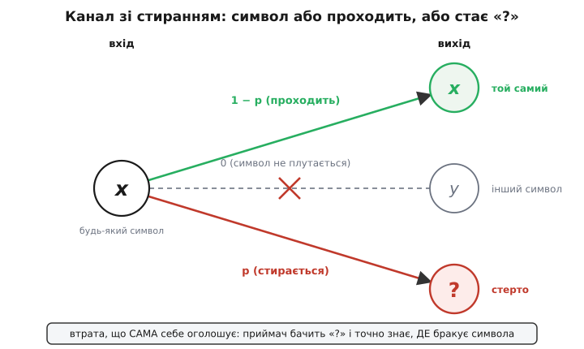
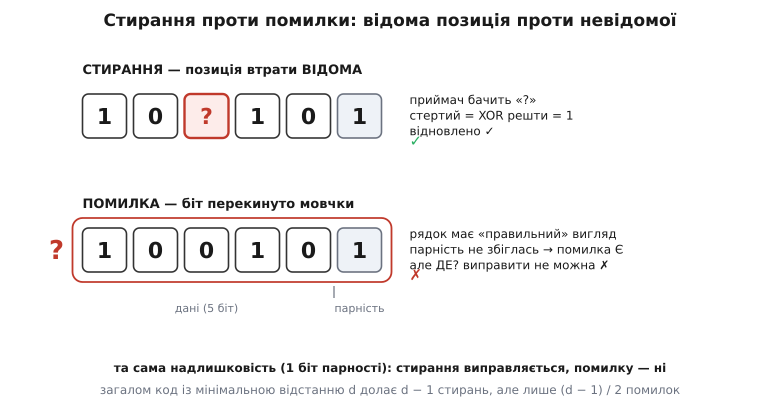

# Канал зі стиранням

<preknowlist>
- [Теорема Шеннона про кодування каналу](book:communications/channel-coding-theorem) — пропускна здатність як найбільша швидкість надійної передачі (біт на символ каналу).
- [Двійковий симетричний канал](book:communications/binary-symmetric-channel) — канал, де біт мовчки перекидається на інший і приймач не знає, котрий; «канал помилок», з яким корисно порівнювати.
</preknowlist>

Символ, ідучи крізь канал, псується двома геть різними способами. Перший: він приходить іншим символом — надіслали 0, дістали 1 — і жодного знаку, що підміна сталася; прийнятий рядок має цілком правильний вигляд. Другий: символ приходить позначеним як утрачений — на його місці приймач бачить порожнечу, знак «?», і напевно знає, що випало саме тут. Обидва випадки — псування, та полагодити їх однаково важко лише на перший погляд. Канал зі стиранням (англ. erasure — стирання, витирання) моделює саме другий тип: втрату, що сама себе оголошує.

Розділова лінія тут не в тому, скільки символів зіпсовано, а в тому, чи відома їхня адреса. Щоб виправити перекинутий біт, треба відповісти на два питання: **де** сталася підміна і **яким** був справжній символ. Щоб залатати стирання, перша відповідь дана даром — де показує сам знак «?»; лишається тільки яким. Половина роботи зроблена ще до початку. Через це стирання й виділяють в окремий клас: локалізована втрата коштує принципово менше, ніж прихована підміна.

## Модель

Канал зі стиранням описується одним числом і одним обмеженням. Кожен символ незалежно або проходить незмінним — з імовірністю 1 − p, — або замінюється на єдиний спеціальний знак стирання «?» — з імовірністю p. Визначальне обмеження: жоден припустимий символ ніколи не перетворюється на *інший* припустимий символ. Єдине можливе псування — це чистий, відкрито позначений «?». Число p — імовірність стирання.



*Один вхід, три можливі виходи: символ проходить (1 − p) або стає «?» (p); переходу на інший символ немає.*

Саме відсутність середньої стрілки відрізняє цю модель від [двійкового симетричного каналу](book:communications/binary-symmetric-channel), де біт якраз перекидається на інший і приймач не знає, на який. Там є перехресні шляхи 0→1 і 1→0; тут уся «неоднозначність» зведена до одного відкритого знаку. Цю зумисне спрощену, зручну для аналізу модель зазвичай пов'язують із Пітером Еліасом (середина 1950-х) — [як і навіщо вона з'явилася](book:communications/erasure-channel/hist-elias-erasure.md).

## Пропускна здатність: C = 1 − p

Побудуймо це число, а не оголосимо його. З кожних надісланих символів частка 1 − p доходить бездоганно, а частка p зникає — але зникає відкрито, ніколи не переплутавшись із чимось іншим. Тож канал поводиться як ідеальний, що працює частку (1 − p) часу й простоює решту. Нижче за 1 − p не опуститися: частка p символів просто відсутня. А піднятися аж до 1 − p дає змогу кодування, бо стерті позиції відомі, і добрий код просто вписує в них пропущене. Отже, пропускна здатність двійкового каналу зі стиранням дорівнює рівно 1 − p біта на символ (для алфавіту з q символів — (1 − p)·log₂q). Формальний вивід цієї межі — у статті про [двійковий канал зі стиранням](book:communications/binary-erasure-channel).

Наскільки це щедро, видно з порівняння. Симетричний канал із тією самою ймовірністю псування p має пропускну здатність 1 − H(p), де H(p) — [ентропія](book:communications/shannon-entropy) двійкового джерела з часткою одиниць p. При p = 0.1 виходить:

```
стирання:  C = 1 − p       = 1 − 0.100  = 0.900
помилка:   C = 1 − H(0.1)  = 1 − 0.469  = 0.531
```

Той самий рівень псування — а стиранню лишається майже вдвічі більше корисної швидкості. Плутанина дорожча за втрату, яку видно.

## Та сама надлишковість — різна сила

Різницю «де відоме проти де невідомого» найлегше відчути на найпростішому захисті. Візьмімо п'ять бітів даних і один [біт парності](book:communications/parity-bit) до них — такий, щоб загальне число одиниць було парним.

**Кодове слово 1 0 1 1 0 1 (чотири одиниці — парно).**

```
слово:      1 0 1 1 0 1     одиниць 4 (парно)
стирання:   1 0 ? 1 0 1     видимих одиниць 3 → стертий = 1 (щоб знову парно)   ✓
помилка:    1 0 0 1 0 1     одиниць 3 (непарно) → «десь помилка», але котра?    ✗
```

При стиранні позиція відома, тож стертий біт відновлюється однозначно: він мусить бути таким, щоб парність зійшлася, — тобто 1. При помилці той самий третій біт мовчки перекинувся; парність не збігається, і ви дізнаєтесь, що помилка є, але не котра з шести. Одним бітом парності її не виправити.



*Один біт парності виправляє стирання (позиція «?» відома) і безсилий проти помилки (позиція невідома).*

Один і той самий біт надлишковості долає одне стирання й жодної помилки. Це не примха прикладу, а загальне правило: код із мінімальною [відстанню](book:communications/hamming-distance) d виправляє до d − 1 стирань, але лише до ⌊(d − 1)∕2⌋ помилок — стирань удвічі більше. Відновлення стертих позицій зводиться до розв'язання лінійної системи за відомими адресами пропусків — [робочий приклад у коді](book:communications/erasure-channel/proj-erasure-recovery.md).

## Чому це найважливіший канал на практиці

Інтернет на рівні пакетів — це майже точно канал зі стиранням. Кожен пакет несе [контрольну суму](book:communications/checksums); якщо його спотворило в дорозі, сума не сходиться, і пакет відкидають — до застосунку він не доходить у вигляді тихо спотворених даних. А [номери послідовності](book:communications/sequence-numbering) кажуть приймачеві, яких саме пакетів бракує. З погляду застосунку пакети або приходять цілими, або відомо, що їх немає: це і є стирання, лише на рівні пакета, а не біта. Тому коди для втрат пакетів — [Ріда–Соломона](book:communications/reed-solomon) в режимі стирань, [фонтанні коди](book:communications/fountain-codes) — будують саме на цій моделі: додають надлишкові пакети так, щоб будь-яка досить велика їх підмножина відновила все повідомлення без жодного перезапиту.

> 🔧 **Навіщо це.** Канал зі стиранням — не лише те, що дає природа; його часто вибудовують навмисне. Контрольна сума на пакеті перетворює невидиму помилку на відкриту втрату: замість тихо зіпсованих даних приймач дістає чесний «?». Так важку задачу (помилка — і де, і що) інженер зводить до легкої (стирання — лише що) і далі латає її кодом. Тому «виявити й відкинути» майже завжди сильніше за «доставити як є».
