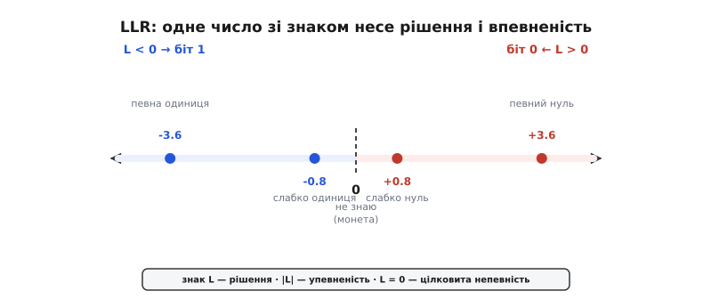
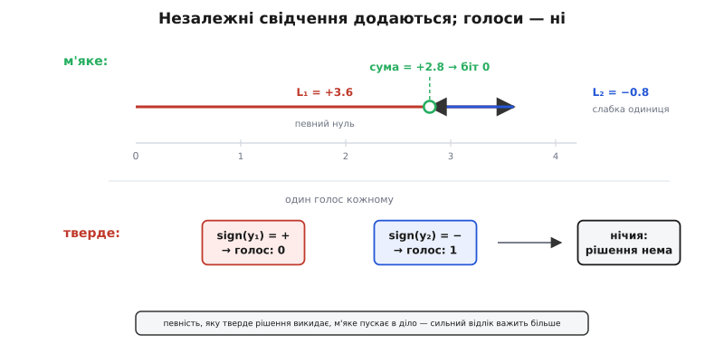
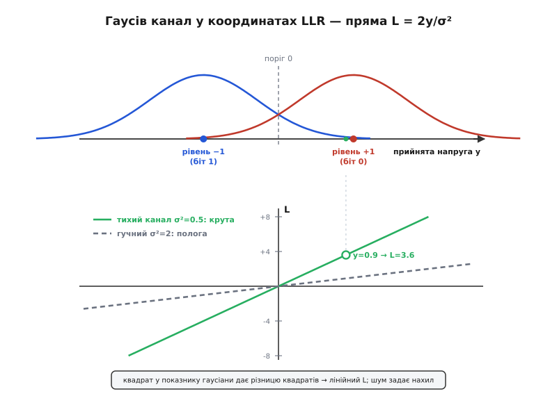

# Логарифм відношення правдоподібностей (LLR)

<preknowlist>
- [Канал AWGN](topic:communications/awgn-channel) — прийом сигналу на тлі адитивного гаусового шуму з дисперсією σ².
- [Байєсова оцінка](topic:math/bayesian-estimation) — умовні ймовірності, апостеріорний висновок та правило Байєса.
- [Логарифми](topic:math/logarithms) — властивість логарифма перетворювати добуток на суму, а частку — на різницю.
</preknowlist>

Приймач цифрового зв'язку, який на виході відлічує лише тверді нулі й одиниці, добровільно викидає половину виміряної аналогової інформації. Якщо аналого-цифровий перетворювач зафіксував напругу `y = +0.95 B`, а на сусідньому біті `y = +0.02 B`, то за прямого порівняння з пороговим нулем обидва відліки перетворяться на біт `0`. Проте перший відлік дає майже цілковиту впевненість у прийнятому значенні, тоді як другий перебуває на грані чистого вгадування через наявність шумної завади. Подібне округлення зветься твердим рішенням (англ. *hard decision*): воно стирає відмінність між безумовною певністю та кволим здогадом, позбавляючи наступні каскади декодера можливості виправити помилку.

Втрата інформації про впевненість коштує приймачу близько 2 дБ енергетичного запасу (англ. *SNR penalty*). Аби компенсувати цей провал і досягти тієї самої частоти помилкових бітів (BER) за твердого рішення, довелося б збільшити потужність передавача понад півтора раза. Щоб зберегти виміряну напругу й передати її декодеру, використовують м'яке рішення (англ. *soft decision*). Головне апаратне й математичне питання полягає в тому, у яких саме координатах нести цю впевненість поруч із самим рішенням, аби подальша обробка у завадостійких кодах залишалася обчислювально простою.

## Чому ймовірність зручна для думки, але шкідлива для обчислень

Найпростіша думка — передавати апостеріорну ймовірність нуля `p = P(b = 0 | y)`. Якщо прийнято `p = 0.99`, біт вважається нулем із високою певністю; якщо `p = 0.5` — це абсолютна непевність (підкидання монети); якщо `p = 0.01` — це висока певність у тому, що передано одиницю. Проте математичне представлення у формі звичайної ймовірності створює три фундаментальні проблеми для обчислювальних систем.

По-перше, значення біта та впевненість у ньому виявляються злитими в одне число з незручною симетрією відносно середини відрізка `[0, 1]`. Сильне рішення «нуль» відповідає `p ≈ 1.0`, а таке ж за силою рішення «одиниця» відповідає `p ≈ 0.0`. Щоб дізнатися впевненість незалежно від рішення, доводиться обчислювати відхилення `|p - 0.5|`, що вимагає додаткових апаратних операцій на кожному кроці.

По-друге, головний біль виникає при об'єднанні багатьох незалежних спостережень. За правилом добутку ймовірностей для кількох незалежних відліків `y₁, y₂, ..., y_N` їхні спільні ймовірності перемножуються. При обробці блоку з тисяч бітів добуток дробових чисел у межах `(0, 1)` миттєво виходить за межі розрядності чисел із рухомою комою і спричиняє машинне підповзання до нуля (англ. *floating-point underflow*).

По-третє, арифметика множення дробових чисел у цифрових мікросхемах (ASIC та FPGA) коштує значно дорожче за додавання з погляду площі кристала та енергоспоживання. Бажано мати координати, у яких накопичення свідчень перетворюється на звичайне додавання.

## Логарифм відношення правдоподібностей: одне число зі знаком

Рішенням усіх трьох проблем є логарифм відношення правдоподібностей (від лат. *verisimilitudo* — правдоподібність, англ. *log-likelihood ratio*, LLR). Правдоподібність (англ. *likelihood*) гіпотези описує ймовірність отримати спостережуваний відлік `y` за умови, що ця гіпотеза була істинною. Розглянемо відношення правдоподібностей для двох альтернативних гіпотез двійкового біта: `b = 0` та `b = 1`:

```
L(b) = ln ( P(y | b = 0) / P(y | b = 1) )
```

У цій формулі використовується натуральний логарифм (або логарифм за основою 2), а саме значення `L` володіє унікальним розподілом обов'язків між знаком і модулем:

1. **Знак `sign(L)` визначає рішення:** якщо `L > 0`, правдоподібнішим є `b = 0`; якщо `L < 0`, правдоподібнішим є `b = 1`.
2. **Модуль `|L|` виражає впевненість:** що далі значення від нуля вздовж числової осі, то вищою є впевненість у прийнятому рішенні.
3. **Точка `L = 0` відповідає цілковитій непевності:** правдоподібності обох бітів ідентичні, `P(y | b = 0) = P(y | b = 1)`, що еквівалентно підкиданню симетричної монети.



*Один числовий параметр зі знаком: праворуч від нуля розташована зона рішення «нуль», ліворуч — зона рішення «одиниця», а відстань від центра виражає міру довіри. Тверде рішення зберігає лише факт перебування ліворуч чи праворуч від нуля, повністю втрачаючи модуль.*

Перехід до логарифмічного відношення розширює обмежений інтервал ймовірностей `[0, 1]` на всю числову вісь від `-∞` до `+∞`. Це усуває проблему числового підповзання: дуже висока певність кодується великими за модулем додатними чи від'ємними числами, які природно лягають у стандартну цілочисельну або плаваючу арифметику.

## Адитивне накопичення свідчень за правилом Байєса

Фундаментальна перевага LLR розкривається під час об'єднання кількох джерел інформації про один і той самий біт. За формулою Байєса апостеріорна ймовірність того, що було передано біт `b`, за наявності прийнятого відліку `y` становить:

```
P(b = 0 | y) = P(y | b = 0) · P(b = 0) / P(y)
P(b = 1 | y) = P(y | b = 1) · P(b = 1) / P(y)
```

Поділимо апостеріорну ймовірність нуля на апостеріорну ймовірність одиниці. Спільний нормувальний знаменник `P(y)` (повна ймовірність сигналу) повністю скорочується:

```
P(b = 0 | y)     P(y | b = 0)     P(b = 0)
────────────  =  ────────────  ·  ────────
P(b = 1 | y)     P(y | b = 1)     P(b = 1)
```

Прологарифмувавши ліву й праву частини, отримуємо вирази у координатах LLR:

```
ln ( P(b = 0 | y) / P(b = 1 | y) ) = ln ( P(y | b = 0) / P(y | b = 1) ) + ln ( P(b = 0) / P(b = 1) )
```

У розширеному позначенні це рівняння записується у вигляді суми двох компонентів:

```
L_post(b) = L_ch(b) + L_a(b)
```

Тут `L_post(b)` — це підсумковий апостеріорний LLR, `L_ch(b)` — канальний LLR, отриманий безпосередньо з виміряного сигналу `y`, а `L_a(b)` — апріорний LLR, що кодує початкову схильність до одного з бітів до отримання сигналу.

Якщо той самий біт передається через канал двічі й приймач отримує два незалежні відліки `y₁` та `y₂`, їхня спільна правдоподібність розпадається на добуток `P(y₁, y₂ | b) = P(y₁ | b) · P(y₂ | b)`. У координатах LLR цей добуток перетворюється на просте додавання:

```
L(y₁, y₂) = L(y₁) + L(y₂)
```

Враховувати кожне нове незалежне свідчення про біт коштує приймачу рівно одне знакове додавання. Сума LLR природно враховує вагу кожного відліку: сильний і впевнений відлік із великим значенням `L₁ = +3.6` легко перекриває слабкий сумнівний відлік із протилежним знаком `L₂ = -0.8`, даючи підсумковий результат `L = +2.8` (впевнений нуль). Тверде голосування на тих самих відліках дало б один голос за «0» і один за «1», призводчи до нічиєї та втрати рішення.



*М'яке додавання вагових підказок проти твердого голосування. У той час як тверде рішення дає кожному відліку рівно один голос незалежно від якості сигналу, м'який LLR складає вектора певностей, де сильний відлік переважає декілька слабких.*

Математичний апарат LLR прийшов у теорію зв'язку зі класичної математичної статистики 1930–1940-х років, де [перевірка гіпотез Неймана–Пірсона довела оптимальність відношення правдоподібностей, а послідовний тест Вальда показав адитивне накопичення логарифмів для швидкого прийняття рішень](topic:communications/log-likelihood-ratio/hist-likelihood-ratio.md).

## Виведення LLR для каналу з адитивним гаусовим шумом (AWGN)

Розглянемо практичний випадок передачі двійкових даних за допомогою двійкової фазової маніпуляції ([BPSK](topic:communications/fsk-psk)). Біт `b = 0` відображається у сигнал `s = +1`, а біт `b = 1` — у сигнал `s = -1`. У каналі [AWGN](topic:communications/awgn-channel) до сигналу додається гаусів шум `n` із нульовим середнім значенням та дисперсією `σ²`. Приймач отримує відлік `y = s + n`.

Щільність ймовірності отримання відліку `y` за умови передачі конкретного сигналу описується гаусовою функцією:

```
P(y | b = 0) = (1 / √(2·π·σ²)) · exp( -(y - 1)² / (2·σ²) )
P(y | b = 1) = (1 / √(2·π·σ²)) · exp( -(y + 1)² / (2·σ²) )
```

Підставимо ці щільності у базове означення LLR і виконаємо послідовні алгебраїчні перетворення:

```
L = ln ( P(y | b = 0) / P(y | b = 1) )

  = ln ( [ (1 / √(2·π·σ²)) · exp( -(y - 1)² / (2·σ²) ) ] / [ (1 / √(2·π·σ²)) · exp( -(y + 1)² / (2·σ²) ) ] )

  = ln ( exp( -(y - 1)² / (2·σ²) ) / exp( -(y + 1)² / (2·σ²) ) )   [нормувальний множник скоротився]

  = [ -(y - 1)² / (2·σ²) ] - [ -(y + 1)² / (2·σ²) ]                [властивість логарифма ln(eᵃ / eᵇ) = a - b]

  = [ -(y - 1)² + (y + 1)² ] / (2·σ²)

  = [ -(y² - 2·y + 1) + (y² + 2·y + 1) ] / (2·σ²)                  [розкриття квадратів]

  = [ -y² + 2·y - 1 + y² + 2·y + 1 ] / (2·σ²)

  = 4·y / (2·σ²)

L = 2·y / σ²                                                        [скорочення на 2]
```

Результат виявився дивовижно простим: для гаусового каналу LLR є строго **лінійною функцією** від прийнятої аналогової напруги `y`. Квадратичні члени у показнику експоненти скоротилися, а від складного криволінійного розподілу залишилася пряма лінія, що проходить через початок координат.



*Гаусів канал у координатах LLR перетворюється на пряму лінію. Нахил цієї прямої визначається рівнем шуму `σ²`: у тихому каналі (мала `σ²`) пряма йде круто вгору, надаючи кожній вольт-дев'ятухі велику вагу, тоді як у шумному каналі пряма полога, і відлік майже не зрушує впевненість.*

Фізичний зміст коефіцієнта `2 / σ²` легко витлумачити:
- **Значення `y` визначає напрямок і первинну величину:** відхилення від нуля в додатний бік свідчить на користь нуля, у від'ємний — на користь одиниці.
- **Дисперсія шуму `σ²` виконує роль масштабного множника надійності:** якщо шум малий (`σ² → 0`), коефіцієнт `2/σ²` є дуже великим, і навіть незначне відхилення напруги `y = +0.1 B` дає високий LLR, сигналізуючи про впевнене рішення. Якщо шум великий (`σ² ≫ 1`), коефіцієнт малий, і той самий відлік `y = +0.1 B` дасть LLR, близький до нуля, застерігаючи декодер від надмірної довіри.

Обчислимо LLR для числового прикладу. Нехай дисперсія шуму каналу становить `σ² = 0.5`, а приймач зафіксувал відлік `y = +0.9`:

```
L = 2 · y / σ²
L = 2 · 0.9 / 0.5
L = 3.6
```

Значення `L = +3.6` вказує на рішення `b = 0` з високим рівнем довіри. Якщо наступний відлік цього ж біта дасть `y = -0.2`, його LLR дорівнюватиме `L₂ = 2 · (-0.2) / 0.5 = -0.8`. Сума двох свідчень складе `L_total = +3.6 - 0.8 = +2.8`, що залишає рішення «нуль» переможцем, але чесно знижує підсумкову впевненість через наявність шумної завади.

## LLR у каналах із релеєвськими замираннями та рознесенням (MRC)

У реальних бездротових каналах (мобільний зв'язок, радіолінії з багатопроменевістю) амплітуда сигналу зазнає швидких випадкових замирань (англ. *fading*). Сигнал на вході приймача описується коефіцієнтом передачі каналу `h(t)`:

```
y = h · s + n
```

Де `h` — випадкова величина з релеєвським або рісовським розподілом, а `n` — адитивний гаусів шум з дисперсією `σ²`. Якщо приймач володіє точной інформацією про канал (англ. *Channel State Information*, CSI), щільності ймовірностей набувають вигляду:

```
P(y | b = 0, h) = (1 / √(2·π·σ²)) · exp( -(y - h)² / (2·σ²) )
P(y | b = 1, h) = (1 / √(2·π·σ²)) · exp( -(y + h)² / (2·σ²) )
```

Обчислення LLR за тією самою схемою дає коригування на коефіцієнт каналу `h`:

```
L = 2 · h · y / σ²
```

Ця формула розкриває глибинну математичну красу LLR у системах із просторовим або частотним рознесенням (англ. *diversity receiving*). Якщо той самий сигнал приймається через `K` незалежних антен із коефіцієнтами каналу `h₁, h₂, ..., h_K` та рівнями шуму `σ₁², σ₂², ..., σ_K²`, сумарний LLR дорівнює:

```
L_total = ∑_{k=1}^K  ( 2 · h_k · y_k / σ_k² )
```

У математичній теорії зв'язку вагове додавання сигналів від багатьох антен із множниками `h_k / σ_k²` називається складанням із максимальним відношенням (англ. *Maximal Ratio Combining*, MRC). Просте додавання LLR на виході кількох приймальних антен автоматично здійснює оптимумний синтез MRC без будь-якої додаткової алгоритмічної обв'язки.

## Точна арифметика Якобі та тотожність Log-Sum-Exp

Під час обчислення точного апостеріорного LLR в алгоритмі BCJR або у м'якому демодуляторі часто виникає вираз вигляду `ln(eᵃ + eᵇ)`. Обчислення окремих експонент `eᵃ` та `eᵇ` з подальшим логарифмуванням призводить до переповнення числової сітки. 

Точна логарифмічна тотожність Якобі перетворює цю операцію на функцію `max` та поправку:

```
ln( eᵃ + eᵇ ) = max(a, b) + ln( 1 + exp( -|a - b| ) )
```

Введемо позначення для поправки Якобі: `J(Δ) = ln(1 + e⁻Δ)`, де `Δ = |a - b|`.

Функція `J(Δ)` є монотонно спадною та швидкою у розрахунку: при `Δ > 5` поправка `J(Δ) < 0.006` і нею можна знехтувати, що дає чисте наближення Max-Log: `ln(eᵃ + eᵇ) ≈ max(a, b)`. В апаратних декодерах поправку `J(Δ)` реалізують у вигляді крихітної таблиці пошуку (LUT) на 8–16 осередків, що гарантує абсолютну математичну точність алгоритму BCJR без втрати продуктивності.

## М'яке демодулювання для багатопозиційних сигналів (QPSK, 16-QAM)

У сучасних системах зв'язку (Wi-Fi, 4G/5G, DVB-S2) використовуються багатопозиційні сигнально-кодові конструкції, такі як QPSK, 16-QAM або 64-QAM. У таких системах один комплексний символ `c = I + j·Q` переносить групу з `m` бітів `(b₀, b₁, ..., b_{m-1})`.

Приймач вимірює точку на комплексній площині `y = y_I + j·y_Q`. Для того щоб вирахувати LLR окремого біта `b_k` у складі символу, необхідно просумувати ймовірності всіх точок сигнального сузір'я `C`, у яких цей біт дорівнює 0, та поділити на суму ймовірностей точок, де цей біт дорівнює 1:

```
L(b_k) = ln ( ∑_{c ∈ C_k⁰} exp( -|y - c|² / (2·σ²) ) / ∑_{c ∈ C_k¹} exp( -|y - c|² / (2·σ²) ) )
```

Обчислення суми експонент для кожного біта вимагає високих обчислювальних витрат. На практиці застосовують наближення Max-Log (англ. *Max-Log approximation*), яке замінює логарифм суми експонент на максимум показових аргументів:

```
ln ( ∑ exp(x_i) ) ≈ max ( x₁, x₂, ... )
```

Завдяки цьому наближенню логарифм суми експонент замінюється пошуком однієї найближчої точки сузір'я. Підставивши це в формулу LLR, отримуємо різницю мінімальних евклідових відстаней:

```
L(b_k) ≈ (1 / (2·σ²)) · [ min_{c ∈ C_k¹} |y - c|² - min_{c ∈ C_k⁰} |y - c|² ]
```

Для квадратних сузір'їв QAM із кодуванням Грея це наближення розпадається на прості кусочно-лінійні функції від координат `y_I` та `y_Q`. М'який демодулятор (англ. *soft demapper*) швидко розраховує LLR для кожного біта без використання трансцендентних функцій.

Детальний алгоритм розрахунку LLR та його програмну реалізацію мовами C та C++ наведено у [практицій вставці з розробки м'якого демодулятора](topic:communications/log-likelihood-ratio/proj-llr-demapper.md).

## LLR у поляризаційних кодах (Polar Codes) та алгоритмі BCJR

У сучасних кодах зв'язку (зокрема у поляризаційних кодах стандарту 5G NR) декодування за принципом послідовного скасування (англ. *Successive Cancellation, SC*) вимагає рекурсивного обчислення LLR на бінарному дереві.

Для двох вхідних LLR `a` та `b` на дереві декодера виконуються дві базові операції:
1. **Операція `f` (аналог перевірки парності):** 
   ```
   f(a, b) = 2 · arctanh( tanh(a/2) · tanh(b/2) ) ≈ sign(a) · sign(b) · min( |a|, |b| )
   ```
2. **Операція `g` (поєднання з прийнятим бітом `u ∈ {0, 1}`):**
   ```
   g(a, b, u) = b + (1 - 2·u) · a
   ```

В алгоритмі BCJR (MAP-декодер для згорткових та турбокодів) метрики стану решітки коду обчислюються повністю в логарифмічних координатах. Ймовірність переходу `γ_k(s', s)` між станами `s'` та `s` на шагу `k` під дією біта `u_k` виражається через LLR:

```
ln γ_k(s', s) = (1/2) · u_k · L_a(u_k) + (2/σ²) · y_k · x_k
```

Прямі метрики `α_k(s)` та зворотні метрики `β_k(s')` накопичуються за допомогою логарифмічного додавання Якобі `ln(eᵃ + eᵇ)`. Підсумковий апостеріорний LLR біта формується як різниця сум метрик усіх шляхів решітки, що відповідають `u_k = 0` та `u_k = 1`.

## LLR як спільна валюта ітеративних декодерів (LDPC та Турбо-коди)

Усі сучасні ефективні коди коригування помилок — [згорткові коди з декодером Вітербі](topic:communications/viterbi-algorithm), алгоритм BCJR, [LDPC-коди](topic:communications/ldpc) та турбокоди — оперують винятково у координатах LLR. 

В ітеративних декодерах (англ. *iterative decoders*) обмін інформацією між внутрішніми вузлами відбувається у формі так званого зовнішнього LLR (англ. *extrinsic LLR*). Загальний апостеріорний LLR біта розкладається на три доданки:

```
L_post = L_ch + L_a + L_ext
```

1. **`L_ch` (канальний LLR):** первинне м'яке значення, отримане від демодулятора з виміряної напруги.
2. **`L_a` (апріорний LLR):** інформація про біт, яка була відома до поточного кроку декодування.
3. **`L_ext` (зовнішній LLR):** нова додаткова впевненість, яку декодер зміг вивести з перевірок парності суміжних бітів.

У Турбо-декодері Клода Берру два компонентні декодери працюють по черзі. Перший декодер обробляє канальні LLR `L_ch` та апріорні підказки `L_a1`, формуючи нове апостеріорне значення `L_post1`. Аби уникнути позитивного зворотного зв'язку (коли декодер починає «підтверджувати власні галюцинації»), він віднімає від виходу початкові значення:

```
L_ext1 = L_post1 - L_ch - L_a1
```

Отриманий зовнішній LLR `L_ext1` через перемежувач (англ. *interleaver*) передається другому декодеру як апріорна інформація `L_a2`. З кожною ітерацією обміну зовнішніми L-значеннями підсумкова впевненість зростає, підводячи частоту помилок до границі Шеннона.

В LDPC-декодерах обчислення у вузлах перевірки парності (англ. *check nodes*) за алгоритмом Belief Propagation використовують добуток гіперболічних тангенсів `tanh(L/2)`. Спрощений алгоритм Min-Sum замінює ці обчислення знаковим добутком та пошуком мінімального модуля:

```
L(u ⊕ v) ≈ sign(u) · sign(v) · min( |u|, |v| )
```

Це перетворює складний імовірнісний висновок на базові операції порівняння та вибору мінімуму серед модулів LLR.

## Фіксованоточкова квантизація та обмеження діапазону (Clipping)

У реальному кремнії LLR не можна зберігати як 64-бітне число з рухомою комою. Для мінімізації площі шин пам'яті та логічних елементів LLR квантують у цілі числа з фіксованою комою (англ. *fixed-point quantization*), зазвичай розрядністю від 4 до 8 бітів.

Під час квантування застосовують два обов'язкових прийоми:

1. **Масштабування (Scaling):** плаваюче значення LLR множиться на фіксований коефіцієнт масштабу `K_scale`, після чого округлюється до найближчого цілого.
2. **Обмеження діапазону або насичення (Clipping):** якщо обчислений LLR перевищує максимально допустиме значення розрядної сітки, його примусово обмежують межами `[-L_max, +L_max]`.

Наприклад, при 6-бітному представленні зі знаком діапазон становить від `-32` до `+31`. Якщо внаслідок додавання декількох свідчень значення LLR досягає `+45.2`, воно записується як `+31`. Дослідження показують, що 6-бітна квантизація LLR у сучасному LDPC-декодері втрачає менше 0.1 дБ порівняно з ідеальною арифметикою подвійної точності.

Обмеження `L_max` відіграє не лише захисну, а й важливу алгоритмічну роль. Якщо один із бітів дістане аномально великий LLR (наприклад, `L = +500`), його надмірна впевненість може «заблокувати» перевірки парності в LDPC-декодері, не дозволяючи сусіднім бітам виправити можливу помилку. Обмеження діапазону зберігає гнучкість ітеративного декодування.

Точність оцінки шуму каналу `σ²` також впливає на підсумковий результат. Якщо приймач помиляється в оцінці `σ²` у 2 рази, це пропорційно змінює масштаб усіх LLR. Для жорсткого рішення `sign(L)` це не має жодного значення, але для ітеративного м'якого декодування помилка масштабу призводить до неоптимального вагового додавання та втрати 0.1–0.3 дБ ефективності.

> 🔧 **Навіщо це.** Логарифм відношення правдоподібностей — це універсальна мова м'якої обробки сигналів у всіх сучасних стандартах (5G NR, Wi-Fi 6/7, DVB-S2X, SSD-контролери). Завдяки тому що LLR перетворює добуток ймовірностей на звичайне додавання, а модуль виражає надійність, приймачі досягають границі Шеннона з мінімальними апаратними витратами.

Причина, з якої кожен сучасний м'який декодер оперує саме LLR, проста й переконлива: це єдине числове представлення, у якому поєднання незалежних доказів здійснюється звичайним додаванням, знак містить готова відповідь, а модуль визначає ступінь довіри до неї.
