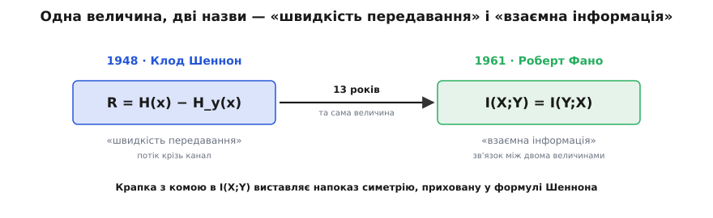

# 📜 Тринадцять років без імені: як «швидкість передавання» стала «взаємною інформацією»

Величина, що стоїть у самому осерді теорії зв'язку — та, чий максимум задає пропускну здатність каналу, — з'являється вже цілком готовою у Шенноновій статті 1948 року. Але якщо шукати в тій статті слова «взаємна інформація» (*mutual information*), ви їх не знайдете. Клод Шеннон мав саму **величину**, та не мав тієї назви, якою ми користуємось. Назва прийшла на тринадцять років пізніше, від іншої людини — і то було не косметичне перейменування. Нове слово несло **твердження про те, чим ця величина є**.

### Що насправді написав Шеннон 1948-го

У праці «Математична теорія зв'язку» (*A Mathematical Theory of Communication*) Шеннон доходить до найцікавішого — до каналу з шумом. Джерело шле символ X, приймач дістає Y, а поміж них шум псує частину переданого. Головне питання інженера: **скільки справжньої інформації проходить**? Відповідь Шеннон будує відніманням. Візьми всю невизначеність джерела — ентропію `H(x)` (див. [ентропію Шеннона](book:communications/shannon-entropy) — міру невизначеності джерела в бітах). Відніми ту частину, що її шум лишає в сумніві навіть після погляду на Y, — Шеннон зве її **двозначністю** (*equivocation*; лат. *aequus* — рівний + *vox* — голос: «однаково звучить у два боки») і позначає `H_y(x)`. Це те, що ми тепер звемо [умовною ентропією](book:communications/conditional-entropy) `H(X|Y)` — залишкова непевність про вхід, коли вихід уже відомий. Що лишилось після віднімання — і є та інформація, яка справді пережила канал:

```
R = H(x) − H_y(x)
```

Оцю величину `R` Шеннон називає **швидкістю передавання** (*rate of transmission*, точніше — *rate of actual transmission*, швидкість дійсного передавання). І назва промовиста: це бухгалтерія інженера. З джерела витікають біти на секунду, шум частину замулює, решта доходить. `R` — це **пропускний потік**, властивість каналу, що робить свою роботу. Величину означено з боку відправника, як «скільки з того, що я послав, уціліло». Шеннон навіть дає знамените число, щоб це відчути:

```
двійкове джерело:   1000 символів/с, рівноймовірні   →   H(x) = 1000 біт/с
ймовірність помилки на біт:  p = 0.01
двозначність:       H_y(x) = H(0.01) ≈ 0.081 біта/символ  ≈ 81 біт/с
швидкість передавання:  R = 1000 − 81 = 919 біт/с
```

Тисяча бітів вирушає щосекунди, шум з'їдає вісімдесят один, а дев'ятсот дев'ятнадцять надійно доходять. Оце Шеннон і зве швидкістю передавання; а її найбільше можливе значення по всіх способах живити канал — уже [пропускна здатність](book:communications/channel-coding-theorem), стеля надійного зв'язку.

Та в самій Шенноновій алгебрі вже ховається несподіванка, яку він і сам виписує чорним по білому. Ту саму `R` можна порахувати з іншого кінця — від виходу до входу — і вийде **те саме число**:

```
R = H(x) − H_y(x) = H(y) − H_x(y)
```

Скільки Y каже про X — рівно стільки ж, скільки X каже про Y. **Симетрія вже тут, у 1948-му.** Але назва «швидкість передавання» дивиться лише в один бік — від джерела до приймача — і **ховає ту саму взаємність, що її формула містить**. Слово відстало від математики: воно описувало, що величина **робить у дроті**, а не чим вона **є**. Тринадцять років вона так і чекала на слово, що скаже друге.

### Хто такий Роберт Фано

Того, хто дав це слово, звали **Роберто Маріо Фано** (*Roberto Mario Fano*). Народився 11 листопада 1917 року в Турині, в Італії, — і тут варто бути точним з походженням, а не махнути «італієць». Родина була **єврейська**, і то родина першорядної науки: батько, **Джино Фано** (*Gino Fano*), — знаменитий математик (його ім'я носить площина Фано в геометрії), брат, **Уго Фано** (*Ugo Fano*), — видатний фізик (резонанс Фано в атомній фізиці). Роберто ріс у домі, де наука була повсякденням.

1938 року фашистська Італія Муссоліні ухвалює расові закони проти євреїв. Фано, що вивчав інженерію в Туринській політехніці, **тікає від цих законів** — 1939 року емігрує до Сполучених Штатів. Тобто в його біографії важлива не гола національність, а точна річ: італієць єврейського роду, **біженець від фашистського расового переслідування**. У США він потрапляє до MIT — бакалаврат з електротехніки 1941 року, докторат 1947-го — і лишається там на всю кар'єру. Працює поряд із Шенноном: їхня спільна праця донині зветься [кодом Шеннона–Фано](book:algorithms/shannon-fano). Згодом його ім'я стане й у нерівності Фано, а поза теорією інформації він заснує Project MAC і стане одним із батьків розподілу часу в обчисленнях (*time-sharing*).

А 1961 року виходить його підручник «Передавання інформації: статистична теорія зв'язку» (*Transmission of Information: A Statistical Theory of Communications*, MIT Press) — настільки впливовий, що його прозвали «біблією теорії інформації». Саме там викладено словник, яким вивчилося ціле покоління. І саме там Шеннонова `R` дістає свою тривку назву.

### Чому саме «взаємна»

Аргумент Фано найкраще починати там, звідки починав він сам, — з окремих **подій** (свою міру він виводив аксіоматично, з чотирьох вимог до «корисної міри інформації»). Спитаймо не про величини загалом, а про конкретику: прийшов конкретний вихід `y`. Наскільки його поява проясняє конкретний вхід `x`? Порівняймо, наскільки ймовірним став `x` **після** появи `y`, з тим, яким він був **до**:

```
i(x;y) = log₂[ p(x|y) / p(x) ]
```

Якщо `y` робить `x` імовірнішим — внесок додатний; якщо `y` нічого не змінює для `x` — нуль. Поки що це схоже на односторонню річ: `y` розповів щось **про** `x`. Але тепер — та алгебра, що вирішує назву. За формулою Баєса відношення `p(x|y)/p(x)` дорівнює `p(x,y)/(p(x)·p(y))`, а цей вираз **симетричний** щодо `x` та `y`: поміняй їх місцями — і нічого не зміниться.

```
i(x;y) = log₂[ p(x,y) / (p(x)·p(y)) ] = i(y;x)
```

Скільки поява `y` каже **про** `x` — рівно стільки ж поява `x` каже **про** `y`. Величина **обопільна**: її не приписати ні одній події, ні другій — вона живе **між** ними. Усередни її по всіх парах — дістанеш `I(X;Y)`, і взаємність переживає усереднення: `I(X;Y) = I(Y;X)`. (Тонкість історії: слово «взаємна інформація» Фано спершу почепив саме на подієву `i(x;y)`; усереднена величина назву успадкувала, і нині «взаємна інформація» звичайно означає середнє, а подієву кличуть «точковою взаємною інформацією».)

Звідси — **слово**. «Взаємна» (лат. *mutuus* — обопільний, позичений навзаєм): величина належить **парі**, а не котрійсь із двох. Звідси й **позначення** — `I(X;Y)` з крапкою з комою, і крапка з комою тут не випадкова: вона підкреслює, що обидва аргументи стоять на рівних, жоден не підмет і не додаток.

А під словом — глибша заява. «Швидкість передавання» каже: це потік крізь канал, те, що відправник проштовхує приймачеві. «Взаємна інформація» каже щось значно загальніше: інформація **ніколи не буває властивістю однієї величини самої по собі** — вона завжди є інформацією **про** щось, зв'язком між двома речами. Не буває «кількості інформації», що висить у повітрі: щойно ти міряєш інформацію, ти міряєш, наскільки одне каже про інше, — а це «казання» взаємне. Назва підіймає величину з радіоканалу й проголошує її фактом про **будь-які дві** випадкові величини.



*Одна величина, дві назви. Шеннон 1948 року означив її як «швидкість передавання» `R = H(x) − H_y(x)` — потік крізь канал, погляд із боку відправника. Фано 1961-го назвав ту саму річ «взаємною інформацією» `I(X;Y) = I(Y;X)` — і крапка з комою в позначенні виставляє напоказ симетрію, що вже ховалася в Шенноновій формулі. Слово не змінило величину; воно зробило видимим те, чим вона є.*

### Що виграла нова назва

Оскільки слово обрамило величину як **зв'язок**, а не як пропускний потік каналу, воно змогло **мандрувати**. «Швидкість передавання» належить інженерії зв'язку — там є передавач і приймач. «Взаємна інформація» належить будь-чому, де є дві сплетені величини. Саме тому та сама `I(X;Y)` нині міряє зв'язок гена з ознакою в біології, важливість ознаки в машинному навчанні, спряження між нейронами — у місцях, де немає ні передавача, ні приймача взагалі. **Влучна назва узагальнила ідею, яку назвала.** Шеннонів потік крізь канал весь час був окремим випадком; Фанове слово зробило цю загальність видимою.

І коло замикається назад на канал: максимум цієї взаємної інформації по всіх вхідних розподілах — це і є [пропускна здатність](book:communications/channel-coding-theorem), те єдине число, що каже, як швидко можна говорити зашумленою лінією без помилок. Тож величина, яку Шеннон звав «швидкістю передавання», а Фано — «взаємною інформацією», — одна й та сама, у двох іменах. Ми лишили Фанове, бо воно каже, **чим** ця річ є, а не лише що вона робить у проводі.

### Наскільки це доведено

За §7 варто чесно розкласти статус кожного твердження.

**Усталений факт.** Шеннон означив величину 1948 року як `R = H(x) − H_y(x)` і назвав її «швидкістю передавання», а не «взаємною інформацією», — його стаття є першоджерелом, а наведене число (919 біт/с) — його власна ілюстрація. Що назва «взаємна інформація» належить Роберту Фано й закріплена в його книзі 1961 року — **добре засвідчено**: незалежні джерела з історії теорії інформації одностайно приписують слово йому. Біографія Фано (Турин 1917, єврейська родина, Джино та Уго Фано, втеча 1939-го від расових законів Муссоліні, MIT, книга 1961-го) — **задокументована**.

**Тлумачення, не цитата.** Формулювання «інформація завжди є інформацією **про** щось» — це природне прочитання того, **чому** слово «взаємна» лягає, а не пряма цитата з Фано. Тверде, документоване осердя під ним — **симетрія** `i(x;y) = i(y;x)`, яка є простою алгеброю і на якій Фано й збудував термін. Тож філософію тут подано як **сенс назви**, а симетрію — як **факт**.

Міфу чи спірної першості в цій історії немає. Величина належить Шеннонові, назва — Фано, і за життя кожен віддавав належне іншому (спільний код Шеннона–Фано — їхня разова праця). Рідкісний випадок чистого родоводу: одна людина дала річ, друга — правильне для неї слово.
