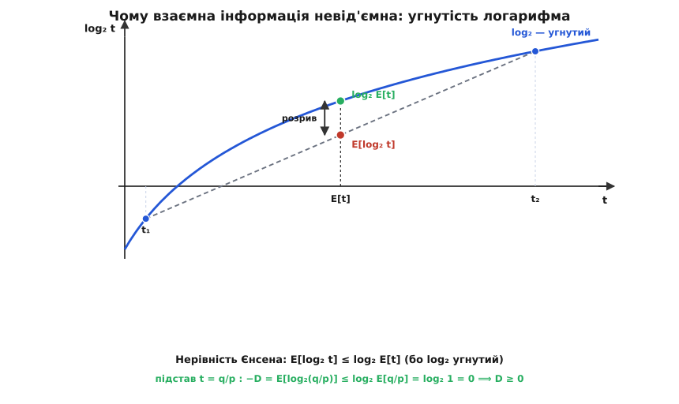
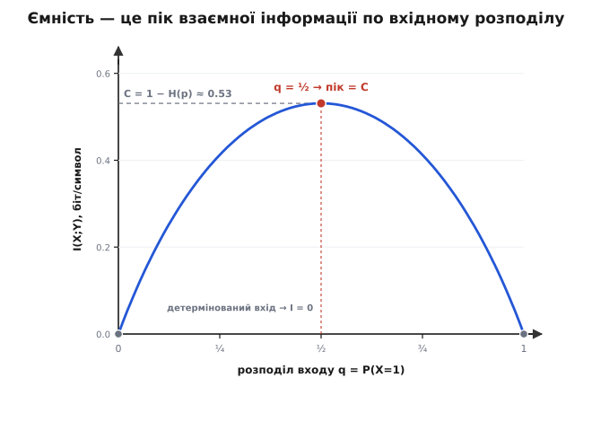

# 🧮 Виведення тотожностей взаємної інформації

Взаємна інформація `I(X;Y)` показується одразу в чотирьох лицях: скорочення невизначеності `H(X) − H(X|Y)`, дзеркальне `H(Y) − H(Y|X)`, перекриття кругів `H(X) + H(Y) − H(X,Y)` і відстань від незалежності `Σ p(x,y)·log₂[p(x,y)/(p(x)·p(y))]`. Побачивши їх поруч, легко подумати, що це чотири різні означення, які випадково збіглися. Насправді збіг тут не випадковий і навіть не чотирикратний: **усе виростає з одного насіння** — ланцюгового правила для ентропії, — а всі властивості (невід'ємність, межі, ємність) додає до нього **одна нерівність** — угнутість логарифма. Розберімо це до кінця: спершу виведемо рівність усіх форм із насіння, потім проростимо з тієї ж землі всі властивості.

Домовимося про запис. Ентропія — це середня несподіванка, [ентропія Шеннона](book:communications/shannon-entropy) `H(X) = −Σ p(x)·log₂ p(x)`. [Умовна ентропія](book:communications/conditional-entropy) `H(Y|X)` — середня невизначеність, що лишається про Y, коли вже знаєш X:

```
H(Y|X) = −Σ p(x,y)·log₂ p(y|x) = Σ p(x)·H(Y|X=x)
          x,y                      x
```

Це не якась нова сутність, а звичайна ентропія виходу, усереднена по всіх входах з їхніми вагами `p(x)`. Права форма проговорює те саме людською мовою: зафіксуй вхід `x`, виміряй невизначеність виходу за цієї умови `H(Y|X=x)`, і візьми середнє по входах. Тримаймо обидві форми напохваті — вони знадобляться.

### Насіння: ланцюгове правило ентропії

Уся конструкція стоїть на одному факті: **невизначеність пари дорівнює невизначеності першого плюс залишкова невизначеність другого**.

```
H(X,Y) = H(X) + H(Y|X)
```

Це не аксіома, яку треба прийняти на віру, — це просто арифметика логарифма. Спільна ентропія `H(X,Y) = −Σ p(x,y)·log₂ p(x,y)` за означенням. Тепер розкладемо кожну спільну ймовірність на добуток `p(x,y) = p(x)·p(y|x)` — це чесна тотожність, а не наближення (умовна ймовірність саме так і означена). Логарифм добутку — сума логарифмів, і сума розпадається на два доданки:

```
H(X,Y) = −Σ p(x,y)·log₂[p(x)·p(y|x)]
          x,y

       = −Σ p(x,y)·log₂ p(x)  −  Σ p(x,y)·log₂ p(y|x)
          x,y                     x,y
         └──────── A ────────┘  └──────── B ────────┘
```

Розберемо дві половинки. У доданку **A** множник `log₂ p(x)` не залежить від `y`, тож просумуймо спершу по `y`: `Σ_y p(x,y) = p(x)` — це просто повертає окрему ймовірність входу. Лишається `−Σ_x p(x)·log₂ p(x) = H(X)`. Доданок **B** — це буквально означення умовної ентропії згори, тобто `H(Y|X)`. Складаємо: `H(X,Y) = H(X) + H(Y|X)`. Насіння пророщене.

За що тут узагалі відповідає логарифм? За те, що **несподіванки складаються, а не множаться**. Імовірності незалежних чи послідовних подій перемножуються; але людині зручно міряти інформацію так, щоб «дізнатися дві речі» коштувало стільки ж, скільки «дізнатися першу» плюс «дізнатися другу за умови першої». Єдина функція, що перетворює множення ймовірностей на додавання невизначеностей, — логарифм. Тому ланцюгове правило не могло вийти інакшим: воно є те саме `log(a·b) = log a + log b`, лише вбране в мову випадкових величин.

Насіння симетричне за побудовою — ту саму пару можна розкласти й з іншого кінця, почавши з `p(x,y) = p(y)·p(x|y)`:

```
H(X,Y) = H(Y) + H(X|Y)
```

Дві ці рівності — увесь інструмент, потрібний, щоб звести чотири лиця взаємної інформації до одного.

### Три ентропійні форми — з двох підстановок

Візьмімо за робоче означення найпростіше — те, яким взаємна інформація й задумана: **скорочення невизначеності про X завдяки Y**.

```
I(X;Y) = H(X) − H(X|Y)          (означення)
```

Тепер жодного нового винаходу — лише підставляння насіння. З другого запису ланцюгового правила `H(X|Y) = H(X,Y) − H(Y)`. Уставмо це в означення:

```
I(X;Y) = H(X) − [ H(X,Y) − H(Y) ]
       = H(X) + H(Y) − H(X,Y)          (симетрична форма)
```

І тут стається головне. Права частина **симетрична**: поміняй місцями X і Y — вона не зміниться, бо `H(X,Y) = H(Y,X)` (пара є пара, байдуже, в якому порядку її називати). А раз середня форма симетрична, то й перша мусить мати дзеркальну пару. Пройдімо той самий крок у зворотний бік, тепер підставляючи `H(Y|X) = H(X,Y) − H(X)`:

```
H(Y) − H(Y|X) = H(Y) − [ H(X,Y) − H(X) ] = H(X) + H(Y) − H(X,Y)
```

Ті самі три букви. Отже, всі три ентропійні лиця — це **одне число, записане трьома способами**:

```
I(X;Y) = H(X) − H(X|Y) = H(Y) − H(Y|X) = H(X) + H(Y) − H(X,Y)
```

Симетрія — не окрема таємниця, яку треба доводити зусиллям; вона просто **успадкована** від симетрії спільної ентропії через одну підстановку. «Скільки Y каже про X» дорівнює «скільки X каже про Y» рівно тому, що обидва дорівнюють «наскільки пара менш невизначена, ніж сума її частин». Число нічиє поодинці — воно належить парі.

### Четверте лице — і чому воно найглибше

Три форми через ентропії гарні для інтуїції, але приховують те, чим взаємна інформація є **насправді**. Витягнімо це, розкривши симетричну форму до самих імовірностей. Кожну з трьох ентропій запишемо сумою й зведімо під один знак `Σ`:

```
H(X)   = −Σ p(x,y)·log₂ p(x)         (бо Σ_y p(x,y) = p(x))
          x,y
H(Y)   = −Σ p(x,y)·log₂ p(y)
          x,y
H(X,Y) = −Σ p(x,y)·log₂ p(x,y)
          x,y
```

Кожну ентропію ми навмисне записали як суму по **тих самих** парах `(x,y)` з вагою `p(x,y)` — тоді `I = H(X) + H(Y) − H(X,Y)` збирається в один `Σ`, а три логарифми — в один за правилами `−log a − log b + log c = log[c/(a·b)]`:

```
I(X;Y) = Σ p(x,y)·[ −log₂ p(x) − log₂ p(y) + log₂ p(x,y) ]
          x,y

       = Σ p(x,y)·log₂[ p(x,y) / (p(x)·p(y)) ]
          x,y
```

Оце й є четверте лице. І воно рівно збігається з формою [розбіжності Кульбака–Лейблера](book:math/kl-divergence) `D(a‖b) = Σ a·log₂(a/b)` — «наскільки розподіл `a` відрізняється від розподілу `b`», — узятої між справжнім спільним розподілом `a = p(x,y)` та вигаданим `b = p(x)·p(y)`, яким пара була б, коли б величини нічого не значили одна для одної:

```
I(X;Y) = D( p(x,y) ‖ p(x)·p(y) )
```

Це не гарна аналогія, а буквальна рівність двох сум. І вона переводить взаємну інформацію з розряду «різниця якихось ентропій» у розряд **відстані від незалежності**: `I` міряє, наскільки справжня картина світу `p(x,y)` відхилилася від тієї, у якій X і Y незалежні. Саме ця форма й дає найпряміший доступ до всіх властивостей — бо про відстані ми знаємо головне: вони не бувають від'ємними.

### Невід'ємність: `I ≥ 0`, і нуль лише при незалежності

Що взаємна інформація невід'ємна — твердження не самоочевидне. Форма `H(X) − H(X|Y)` його не доводить: чому ж знання Y не могло б, бува, **збільшити** середню невизначеність про X? Відповідь ховається у формі-відстані, і ключ до неї — **угнутість логарифма** (concavity). Функція називається угнутою, якщо її графік лежить над кожною своєю хордою; для логарифма це видно по другій похідній `(log₂ t)″ = −1/(t²·ln2) < 0` — крива всюди прогинається донизу, ніде не випрямляючись. З цієї єдиної властивості випливає [нерівність Єнсена](book:math/convex-functions): для угнутої `f` середнє **всередині** не менше за середнє **зовні**,

```
E[ f(T) ] ≤ f( E[T] )
```

— бо кожне значення на кривій вище за відповідну точку хорди, а усереднення значень (ліва частина) сидить на хорді, тоді як `f` від усередненого аргументу (права частина) сидить на кривій, над нею.


*Чому взаємна інформація невід'ємна. Логарифм угнутий — його графік прогинається донизу, тож хорда між будь-якими двома точками `t₁, t₂` проходить нижче самої кривої. Через це середнє логарифмів `E[log₂ t]` (точка на хорді) завжди лежить не вище за логарифм середнього `log₂ E[t]` (точка на кривій). Підстав `t = q/p` — і ліва частина стає `−D`, а права дорівнює `log₂1 = 0`: розрив між ними і є розбіжність, яка тому не може бути від'ємною.*

Тепер застосуймо це до самої розбіжності. Візьмімо `−D` і потрактуймо відношення `q/p`, де `q = p(x)·p(y)` і `p = p(x,y)`, як випадкову величину `T`, що набуває значень з імовірностями `p(x,y)`:

```
−D = Σ p(x,y)·log₂[ p(x)·p(y) / p(x,y) ]  =  E[ log₂ T ],   T = q/p
      x,y
```

За Єнсеном `E[log₂ T] ≤ log₂ E[T]`. Порахуймо праву частину — і станеться маленьке диво скорочення: ваги `p(x,y)` перемножуються з `q/p` і лишають самі `q`, а сума всіх `q = p(x)·p(y)` по парах дорівнює одиниці:

```
E[T] = Σ p(x,y)·[ p(x)·p(y) / p(x,y) ]  = Σ p(x)·p(y) = (Σ p(x))·(Σ p(y)) = 1·1 = 1
        x,y                                x,y            x              y
```

Отже `−D ≤ log₂ 1 = 0`, тобто `D ≥ 0`, а виходить, **`I(X;Y) ≥ 0`**. Погляд на Y у середньому не може зробити тебе непевнішим щодо X — у гіршому разі не скаже нічого.

А коли ж «нічого»? Нерівність Єнсена для строго угнутої функції стає рівністю **тільки** тоді, коли величина `T` не випадкова, а стала майже скрізь. Тут `T = q/p` мусить дорівнювати тій-таки одиниці (бо середнє від неї — одиниця), тобто `p(x,y) = p(x)·p(y)` для кожної пари. Це і є означення незалежності. Тож `I = 0` **точно тоді**, коли X і Y незалежні, — розподіл не лежить на ненульовій відстані від самого себе. Невід'ємність і критерій нуля виведені разом, з однієї опуклості.

> 🔧 **Навіщо це.** Угнутість логарифма — не технічна дрібниця десь у доведенні, а причина, чому взаємна інформація взагалі придатна на роль **міри зв'язності**. Якби `I` бувала від'ємною, «нуль» перестав би означати «незалежні», і величиною не можна було б чесно порівнювати канали чи ознаки: від'ємне значення читалося б як «Y дезінформує про X», чого в середньому не буває. Саме невід'ємність із строгим нулем лише при незалежності робить `I` **чесним детектором залежності будь-якої форми** — тим, чого кореляція, сліпа до нелінійних зв'язків, дати не може.

### Межі: чому `I ≤ min(H(X), H(Y))` і `I(X;X) = H(X)`

Знизу взаємну інформацію тримає нуль. Згори її тримає **власна невизначеність кожної з величин**, і це вже випливає не з Єнсена, а прямо з ентропійних форм плюс однієї простої істини: умовна ентропія не буває від'ємною.

Чому `H(X|Y) ≥ 0`? Бо це середнє значень `H(X|Y=y)`, а кожне з них — звичайна ентропія якогось розподілу, отже само невід'ємне (`−p·log₂ p ≥ 0`, коли `0 ≤ p ≤ 1`). Середнє невід'ємних чисел невід'ємне. Підставмо це у форму скорочення:

```
I(X;Y) = H(X) − H(X|Y) ≤ H(X)        (бо H(X|Y) ≥ 0)
```

За дзеркальною формою так само `I(X;Y) = H(Y) − H(Y|X) ≤ H(Y)`. Обидві межі разом дають

```
I(X;Y) ≤ min( H(X), H(Y) )
```

Читається просто: **з Y годі витягти про X більше бітів, ніж їх у самому X було**. Скільки не дивись на монету, дізнаєшся про неї щонайбільше один біт — стільки в ній і є. Це та сама межа, яку в картинці двох кругів видно як «лінза не буває більша за менший круг».

А що станеться, коли величина дивиться сама на себе — `Y = X`? Тоді, знаючи X, про X уже не лишається нічого невідомого: `H(X|X) = 0` (умовна ентропія від `p(x|x)`, яка дорівнює одиниці на діагоналі й нулю поза нею, а `−1·log₂1 = 0`). Підставмо:

```
I(X;X) = H(X) − H(X|X) = H(X) − 0 = H(X)
```

Перекриття збігається з усім кругом. Величина знає про себе геть усе, і взаємна інформація «із собою» дорівнює всій ентропії — тому `H(X)` інколи й звуть **власною інформацією**. Це водночас показує, що межа `I ≤ H(X)` **досяжна** (на `Y = X` вона стає рівністю), а не просто формально правильна.

### Ємність: від максимуму `I` до `1 − H(p)`

Тепер — навіщо вся ця машинерія існує. Пропускна здатність каналу означена як **найбільша взаємна інформація**, яку можна вичавити між входом і виходом:

```
C = max  I(X;Y)
    p(x)
```

Уся тонкість — у тому, **що саме** тут вільне, а що ні. Канал задає інженерові **матрицю переходів** `p(y|x)` — «що послав → що прийняв»; вона диктується фізикою й змінити її не можна. А от **розподіл входу** `p(x)` — вільний важіль: інженер сам обирає, які символи й з якими частотами слати. Кожен вибір `p(x)` разом із фіксованою матрицею дає свій спільний розподіл, а отже, своє число `I(X;Y)`. Ємність — це пік цього числа по всіх допустимих входах, гранична швидкість, нижче за яку [теорема Шеннона про кодування каналу](book:communications/channel-coding-theorem) обіцяє майже безпомилковий зв'язок.

Що цей максимум узагалі досяжний і єдиний — не випадковість: `I(X;Y)` як функція від `p(x)` при фіксованому каналі **угнута**, тож має один горб без хибних вершин. Побачмо це на найпростішому каналі — [двійковому симетричному](book:communications/binary-symmetric-channel), де кожен біт незалежно перевертається з імовірністю `p`.

Ключ до розрахунку — форма `I = H(Y) − H(Y|X)`, бо один із доданків тут **не залежить від входу зовсім**. Коли вхід `x` уже відомий, єдине, що лишається невідомим у виході, — чи перевернувся цей біт; а це подія з імовірністю `p`, хоч би який був `x`. Тому шумовий залишок сталий: `H(Y|X) = H(p)`, двійкова ентропія перевороту. Уся боротьба за ємність іде за перший доданок — `H(Y)`, невизначеність виходу, яку вхід **може** роздути.

**Двійковий симетричний канал: крос `p`, вхід `P(X=1) = q`.** Випишемо `I` як функцію єдиного важеля `q`:

```
r = P(Y=1) = q·(1−p) + (1−q)·p        (доля одиниць на виході)

H(Y|X) = H(p)                          (сталий шумовий залишок)

I(q) = H(Y) − H(Y|X) = H(r) − H(p)     (лишилось максимізувати H(r))
```

Тепер максимум береться очима. `H(p)` — стала, тож `I(q)` найбільша там, де найбільша `H(r)`; а двійкова ентропія `H(r)` сягає стелі `1` рівно при `r = ½`. Через симетрію каналу `r = ½` дає якраз рівноймовірний вхід `q = ½` (тоді `r = ½·(1−p) + ½·p = ½` за будь-якого `p`). Підставмо пік:

```
C = I(½) = H(½) − H(p) = 1 − H(p)
```


*Ємність — це пік. Крос каналу зафіксовано (`p = 0.1`); по горизонталі — вільний важіль, частка одиниць на вході `q`. На краях, `q = 0` чи `q = 1`, вхід детермінований, вихід нічого не додає до шуму, і взаємна інформація падає до нуля. Угнутий горб має єдину вершину при `q = ½`, і її висота — це `1 − H(p) ≈ 0.53` біта: та сама ємність, до якої зводиться максимум. Ліворуч і праворуч від піка канал недогодований — симетрія входу віддає найбільше.*

Для `p = 0.1` це `1 − H(0.1) = 1 − 0.469 ≈ 0.531` біта на символ. Отже, число, яке в темі виходить простим підрахунком `I` за рівноймовірного входу, є **не просто взаємна інформація за одного вибору**, а сама ємність каналу — бо для симетричного каналу максимум досягається якраз на симетричному вході. Загальна формула `C = max I(X;Y)` тут згорнулася в елегантне `C = 1 − H(p)`: **з одного біта місця на символ шум забирає рівно `H(p)`, а решта надійно проходить.**

### Одним рядком: чому обробка не додає інформації

Наостанок — властивість, що ловить глибоку межу будь-яких обчислень. Хай величини утворюють ланцюг `X → Y → Z`, де `Z` дістають **лише з Y** (не торкаючись X безпосередньо, — так працює будь-який постобробник прийнятого сигналу). Тоді

```
I(X; Z) ≤ I(X; Y)          (нерівність обробки даних)
```

Жодна обробка `Y` не здатна **створити** інформацію про X, якої не було вже в Y: фільтр, декодер, нейромережа над прийнятим — усі вони можуть лише зберегти або втратити частину того, що Y знав про джерело, але не вигадати нове знання про X із повітря. Тому й береш ємність за перерізом самого каналу: усе, що далі, здатне цю цифру хіба зменшити.

### Що з чого виросло

Варто окинути поглядом усе дерево. З **одного насіння** — ланцюгового правила `H(X,Y) = H(X) + H(Y|X)`, яке саме є лише `log(a·b) = log a + log b` мовою величин, — двома підстановками виросли всі три ентропійні форми взаємної інформації, а їхня рівність виявилась успадкованою симетрією спільної ентропії. Зведення тих самих ентропій до імовірностей дало четверте, найглибше лице — розбіжність Кульбака–Лейблера `D(p(x,y)‖p(x)p(y))`, тобто відстань від незалежності. З **однієї опуклості** — угнутості логарифма через нерівність Єнсена — випала невід'ємність `I ≥ 0` разом із критерієм нуля (тільки незалежність). Невід'ємність умовної ентропії дала верхні межі `I ≤ min(H(X), H(Y))`, а випадок `Y = X` — тотожність `I(X;X) = H(X)`. І та сама взаємна інформація, піднята до максимуму по вільному вхідному розподілу, дала ємність, що для двійкового симетричного каналу згорнулась у `C = 1 − H(p)`. Одне насіння, одна нерівність — і ціла в'язка тотожностей, на якій тримається теорія зв'язку.
