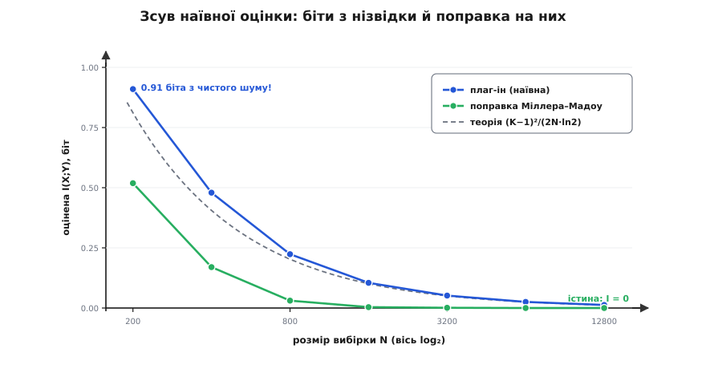
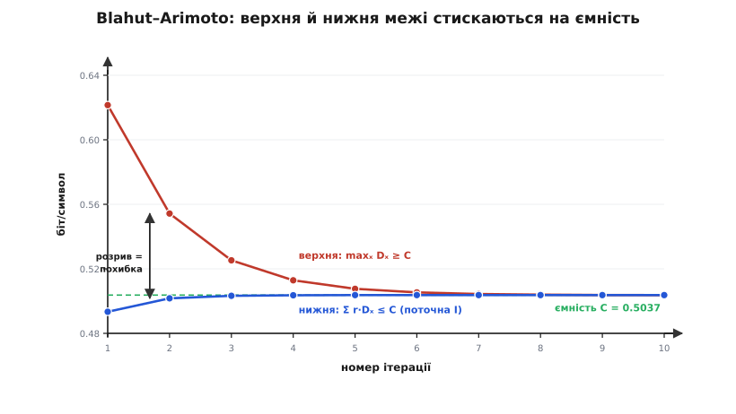

# ⚙️ Два лічильники правди: I(X;Y) з вибірки і ємність каналу числом

> Формула взаємної інформації на папері безневинна — сума добутків із логарифмом. Але щойно замість ідеальних імовірностей у неї підставляють **лічильники з реальної вибірки**, вона починає брехати: рахує біти зв'язку там, де зв'язку нема жодного. А коли треба не оцінити I за одного входу, а знайти її **максимум** — ємність каналу, — прямий шлях «перебрати всі вхідні розподіли» упирається в нескінченний неперервний простір. Обидві задачі — оцінити I з даних і піднести її до C — розв'язуються, але кожна має свою пастку, і кожну пастку видно лише в коді. Зберемо два робочі інструменти й проженемо крізь них канали, відповідь для яких знаємо напам'ять, — щоб зловити брехню, поки вона дешева.

## Дві задачі про одне число

Взаємна інформація приходить у практику з двох боків, і боки ці протилежні.

Перший: у тебе є **дані** — довгий список пар спостережень `(x, y)`. Два стовпчики лога: що подав давач і що виміряв приймач; яка ознака й який клас; який ген і який фенотип. Розподілу `p(x, y)`, що стоїть у формулі, ти не знаєш — маєш лише скінченну вибірку з нього. Питання: **скільки бітів ці два стовпчики поділяють?** Це задача оцінювання — від вибірки до числа.

Другий: розподілу даних нема взагалі, зате відома **фізика каналу** — матриця переходів `Q(y|x)`, повний опис того, з якою ймовірністю кожен вхідний символ перетворюється на кожен вихідний. Питання інше: **як годувати цей канал, щоб він проносив найбільше?** Треба не порахувати I за наперед заданого входу, а перебрати всі можливі вхідні розподіли й узяти той, де I найбільша. Це задача оптимізації — від матриці до ємності `C = max I(X;Y)`.

Перша задача дивиться назад, на зібрані дані; друга — вперед, на межу, яку канал узагалі здатен дати. Візьмімо їх по черзі.

## Частина 1 — оцінити I(X;Y) з вибірки

### Гістограма й підстановка

Найпряміший план не має в собі нічого хитрого. Маєш N пар — порахуй, скільки разів трапилась кожна комбінація `(x, y)`, поділи на N, дістанеш **емпіричний спільний розподіл** `p̂(x, y)`. Просумуй його по рядках і стовпцях — матимеш поля `p̂(x)` і `p̂(y)`. Підстав усе троє в означення. Такий підхід звуть **плаг-ін** оцінкою (англ. *plug-in* — «підставити»): беремо частоти замість імовірностей і підставляємо в готову формулу.

Для дискретних міток `x ∈ {0…K_X−1}`, `y ∈ {0…K_Y−1}` увесь інструмент — це двовимірна гістограма й одна сума:

```python
import numpy as np

def histogram2d(x, y, kx, ky):
    """Спільна гістограма пар (x, y): цілі мітки 0…kx−1, 0…ky−1."""
    joint = np.zeros((kx, ky))
    np.add.at(joint, (x, y), 1)        # +1 у клітину (xᵢ, yᵢ) для кожної пари
    return joint

def mutual_information(joint):
    """Плаг-ін оцінка I(X;Y) зі спільної гістограми лічильників, біт."""
    N = joint.sum()
    pxy = joint / N                    # p̂(x, y)
    px = pxy.sum(axis=1, keepdims=True)  # p̂(x) — сума по рядку
    py = pxy.sum(axis=0, keepdims=True)  # p̂(y) — сума по стовпцю
    indep = px @ py                    # p̂(x)·p̂(y) для кожної клітини
    mask = pxy > 0                     # 0·log0 = 0 — порожні клітини пропускаємо
    return float((pxy[mask] * np.log2(pxy[mask] / indep[mask])).sum())
```

Уся стаття задачі — у двох рядках. `np.add.at` розкидає одиниці по клітинах гістограми (звичайне `joint[x, y] += 1` мовчки згубить повторні індекси — а вони тут скрізь); `indep = px @ py` зовнішнім добутком будує матрицю «як виглядав би спільний розподіл, якби X і Y були незалежні», і формула порівнює справжнє `p̂(x, y)` саме з нею. `mask` викидає порожні клітини — про пастку `log 0` докладно нижче, але вже тут видно, що без неї ніяк.

### Перевірка на каналі, який знаємо напам'ять

Оцінку, якої не звіряли з відомою відповіддю, не варто пускати на живі дані — вона поміряє власні баги, а не зв'язок. На щастя, одну відповідь ми маємо точну: [двійковий симетричний канал](book:communications/binary-symmetric-channel) із перекидом `p = 0.1` несе рівно `1 − H(0.1) = 0.5310` біта на символ. Згенеруймо з нього вибірку й погляньмо, чи впізнає її наш лічильник.

**Канал: рівноймовірний вхід, переворот `p = 0.1`, `N = 5000` пар.**

```python
rng = np.random.default_rng(0)
N = 5000
x = rng.integers(0, 2, N)              # рівноймовірні біти на вхід
y = x ^ (rng.random(N) < 0.1)          # канал: кожен десятий біт перевертається
joint = histogram2d(x, y, 2, 2)
```

```
гістограма (рядок X, стовпчик Y):
   [[2229  260]      ← подали 0: здебільшого прийняли 0, 260 разів перекинуло в 1
    [ 253 2258]]     ← подали 1: 253 перекиди в 0

плаг-ін     I = 0.5228 біта
істинне     I = 0.5310 біта
```

Оцінка сіла коло істини — розбіжність 0.008 біта на такій вибірці цілком у межах випадкового розкиду: повторивши дослід тисячу разів із різними зернами, дістанемо в середньому `0.5308` при розкиді `±0.014`. Лічильник працює. Але зверни увагу, **чого тут не видно**: жодного натяку на систематичну ваду. Плаг-ін для матриці 2×2 має крихітний зсув угору — усього `1/(2N·ln2) ≈ 0.00014` біта, — і його безнадійно ховає звичайний шум вибірки. Здається, оцінка чесна. Це враження оманливе, і зараз ми його зруйнуємо.

### Пастка: біти з нізвідки

Візьмімо найпростіший можливий випадок, де правильна відповідь відома **точно й без жодного каналу**: два **незалежні** потоки. Хай X і Y — просто два окремі генератори, кожен рівноймовірно кидає символ із `K = 16`. Вони не мають між собою нічого спільного, тож істинна взаємна інформація дорівнює **нулю** — рівно нулю, за означенням незалежності. Що скаже плаг-ін?

**Незалежні X, Y, кожен рівноймовірний із 16 символів; істинне I = 0.**

```python
rng = np.random.default_rng(1)
for N in [500, 1000, 5000, 50000]:
    x = rng.integers(0, 16, N)
    y = rng.integers(0, 16, N)         # X і Y ніяк не пов'язані
    j = histogram2d(x, y, 16, 16)
    print(f"N={N:6d}:  плаг-ін = {mutual_information(j):.4f} біта")
```

```
N=   500:  плаг-ін = 0.3838 біта
N=  1000:  плаг-ін = 0.1569 біта
N=  5000:  плаг-ін = 0.0332 біта
N= 50000:  плаг-ін = 0.0034 біта
```

Оце і є пастка в усій наготі. Два потоки чистого шуму, між якими **нуль** зв'язку, а лічильник упевнено рапортує **0.38 біта** спільної інформації при N = 500. Не похибка округлення — майже дві п'ятих біта, вигадані з порожнечі. І що менша вибірка, то нахабніша брехня: 0.38 при пів тисячі пар проти 0.003 при п'ятдесяти тисячах.


*Два потоки чистого шуму, K = 16 символів кожен, істинна взаємна інформація — нуль (зелена лінія по осі). Синя крива — наївна плаг-ін оцінка: вона стелеться рівно вздовж теоретичного зсуву (K−1)²/(2N·ln2), вигадуючи біти, яких нема. Обидві сходяться до нуля лише як 1/N — повільно: щоб збити фальшиві біти вдесятеро, треба вдесятеро більше даних. Зелена крива — та сама оцінка з поправкою Міллера–Мадоу; вона гасить зсув майже дощенту, щойно вибірка перестає бути надто рідкою.*

Чому так стається, видно, коли розкласти оцінку на три ентропії. Плаг-ін-ентропія завжди **занижує** істинну: скінченна вибірка виходить «гострішою» за розподіл, з якого взята (деякі клітини випадково порожні, інші перебрані), а гостріший розподіл має меншу ентропію — це прямий наслідок угнутості логарифма. Класичний результат каже, наскільки саме занижує:

```
E[Ĥ]  ≈  H  −  (m − 1) / (2N·ln2)      біт
                                        m — число НЕпорожніх клітин
```

Тепер згадаймо, що `I = H(X) + H(Y) − H(X,Y)`. Дві ентропії входять із плюсом, спільна — з мінусом, і їхні зсуви **не гасяться, а складаються не на нашу користь**:

```
зсув(Î)  ≈  [ −(m_X − 1) − (m_Y − 1) + (m_XY − 1) ] / (2N·ln2)
```

Спільна гістограма має клітин куди більше, ніж крайові: за повного носія `m_XY = m_X·m_Y`. Підставмо й розкриймо дужки:

```
(m_X·m_Y − 1) − (m_X − 1) − (m_Y − 1)  =  (m_X − 1)(m_Y − 1)

зсув(Î)  ≈  + (m_X − 1)(m_Y − 1) / (2N·ln2)      завжди ДОДАТНИЙ
```

Ось воно. Занижена спільна ентропія входить з мінусом і перетягує знак: плаг-ін-оцінка I **завищена**, і завищена на добуток `(K_X−1)(K_Y−1)`, поділений на вибірку. Для нашого прикладу `(16−1)² / (2·500·ln2) = 225/693 = 0.32` біта — теорія майже точно вгадала виміряні 0.38. Пастка не випадкова: що більше клітин у гістограмі, то більше порожнеч вибірка залишає незаповненими й то грубіше бреше оцінка. Розрідиш дані на дрібнішу сітку — і фальшивої інформації стане більше, хоч зв'язку не додасться ні на біт.

> 🔧 **Навіщо це.** Саме на цій пастці горять відбори ознак у машинному навчанні. Береш сотню ознак, міряєш взаємну інформацію кожної з міткою класу, лишаєш «найінформативніші» — і несвідомо винагороджуєш ознаки з **найбільшим числом рідкісних значень**, бо вони роздрібнюють гістограму й накопичують найбільший зсув. Ознака-ідентифікатор (майже унікальна в кожному рядку) покаже величезну «інформацію» про клас навіть на випадкових даних — і проб'ється у відбір як найкорисніша, будучи чистим шумом. Хто рахує I наївно, той відбирає не зв'язок, а дрібність розбиття.

### Звідки зсув і як його зняти

Формула зсуву не лише пояснює біду — вона підказує ліки. Якщо наївна ентропія занижена приблизно на `(m−1)/(2N·ln2)`, просто **додаймо** цю поправку назад. Це і є поправка **Міллера–Мадоу** (Джордж Міллер, «Note on the bias of information estimates», 1955; Вільям Мадов дав строгіше обґрунтування, тож поправку звуть їхніми двома іменами) — найдешевший спосіб зрізати перший, найбільший доданок зсуву:

```
Ĥ_MM  =  Ĥ_наївна  +  (m₊ − 1) / (2N·ln2)      біт
                       m₊ — число клітин із НЕнульовим лічильником
```

У коді — та сама трійка ентропій, кожна з поправкою, зібрана назад у `I = H(X) + H(Y) − H(X,Y)`:

```python
def entropy_bits(counts):
    """Наївна плаг-ін ентропія масиву лічильників, біт."""
    N = counts.sum()
    p = counts[counts > 0] / N
    return -(p * np.log2(p)).sum()

def mi_miller_madow(joint):
    """I(X;Y) з поправкою Міллера–Мадоу на кожну з трьох ентропій."""
    N = joint.sum()
    def H_mm(counts):
        m_plus = np.count_nonzero(counts)          # заповнені клітини
        return entropy_bits(counts) + (m_plus - 1) / (2 * N * np.log(2))
    return H_mm(joint.sum(axis=1)) + H_mm(joint.sum(axis=0)) - H_mm(joint)
```

Прогнавши той самий дослід із незалежними потоками через `mi_miller_madow`, дістаємо зовсім іншу картину:

```
          плаг-ін      Міллер–Мадоу
N=  500:  0.3838   →   0.1126
N= 1000:  0.1569   →  −0.0018
N= 5000:  0.0332   →   0.0008
N=50000:  0.0034   →   0.0001
```

При тисячі пар оцінка падає з 0.157 до **−0.0018** — практично нуль, як і має бути для незалежних величин. І помітна дрібниця, що бентежить новачка: виправлене значення **від'ємне**. Це нормально: `Ĥ_MM` — оцінка, а не сама величина, і вона має право трохи перестрибнути ціль в обидва боки. Справжня взаємна інформація від'ємною не буває ніколи, а її оцінка — цілком, і бачити −0.002 замість +0.16 куди чесніше, ніж вірити в неіснуючі біти.

Але поправка не всесильна. При N = 500, коли на 256 клітин гістограми припадає в середньому по дві пари, Міллер–Мадоу зрізає зсув лише до 0.11 — бо він знімає **перший** доданок розкладу, а на такій рідкій сітці важать і наступні. Правило звідси просте й непорушне: **міряти взаємну інформацію на сітці, де порожньо, — марна справа**, і жодна поправка цього не рятує. Хочеш надійне число — дай кожній заповненій клітині бодай десяток спостережень або згруби сітку, поки їх стане.

### Неперервні дані: біннінг і його межа

А якщо `x` і `y` — не мітки, а неперервні величини (напруга, температура, затримка)? Тоді «клітини» самі собою не існують — їх доводиться нарізати, розбиваючи діапазон на смуги (англ. *binning* — розкладання по кошиках). І тут відкривається справжня прірва, бо кількість смуг — важіль, за який тягне пастка з попереднього розділу.

Ділиш грубо, на кілька широких смуг, — губиш тонку структуру залежності, і `I` виходить заниженою: різні значення злипаються в одну клітину, наче вони однакові. Ділиш дрібно, на багато вузьких, — на кожну смугу лишається по кілька точок, спільна гістограма зяє порожнечами, і зсув `(K−1)²/(2N·ln2)` роздуває `I` фальшивими бітами. Золотої ширини наперед нема: замало смуг занижує, забагато завищує, а «правильне» число десь між — і залежить від того, скільки в тебе даних.

Саме тому для неперервних величин наївний біннінг витісняють оцінювачі, що взагалі обходяться без сітки, — найвідоміший будує оцінку не на клітинах, а на відстанях до `k`-х найближчих сусідів кожної точки (оцінювач Краскова–Штьоґбауера–Ґрассберґера). Він тримає ту саму [розбіжність від незалежності](book:math/kl-divergence), що й наша формула, але міряє густину локально й не потерпає від порожніх кошиків. Для дискретних міток, однак, чесна гістограма з поправкою Міллера–Мадоу — робочий інструмент, і саме її варто тримати напохваті.

## Частина 2 — ємність каналу за Blahut–Arimoto

### Чому не можна просто перебрати входи

Друга задача виглядає безневинно: канал заданий матрицею переходів `Q(y|x)`, треба знайти `C = max I(X;Y)` по всіх вхідних розподілах `p(x)`. Раз це максимум — перебери входи й візьми найбільше, чи не так?

Не так, і причина глибша за «повільно». Вхідний розподіл `p(x)` — це точка на симплексі: невід'ємні числа, що сумуються в одиницю. Для двох символів це відрізок `[0, 1]`, для трьох — трикутник, для K — `(K−1)`-вимірне тіло, у якому **незліченна нескінченність** точок. Перебрати їх усі не можна в принципі; сітка ж по симплексу платить прокляттям вимірності — кроків треба як `n^(K−1)`, і при десятку символів це вже безнадійно.

Могло б урятувати те, що `I(X;Y)` як функція від `p(x)` **угнута** (має єдиний горб без побічних вершин), тож годиться загальний підйом угору. Але тягти сюди важкий чисельний оптимізатор — стріляти з гармати: у цієї угнутої функції є особлива структура, і вона дарує метод, короткий і точний, як мало який в оптимізації.

### Ідея: піднімати I, поки дві межі не зійдуться

Структура ось у чім. Запишімо взаємну інформацію так: для кожного вхідного символа `x` порахуймо, наскільки його рядок каналу `Q(·|x)` відрізняється від усередненого виходу `q(y) = Σ_x p(x)Q(y|x)`. Ця відмінність — [розбіжність Кульбака–Лейблера](book:math/kl-divergence) рядка від середнього виходу:

```
D_x  =  Σ_y  Q(y|x) · log₂[ Q(y|x) / q(y) ]        (внесок символа x, біт)
```

Тоді вся взаємна інформація — просто середнє цих внесків по входу: `I = Σ_x p(x)·D_x`. А тепер — ключ. Умова оптимуму (Куна–Такера) для угнутої `I` каже дивовижно струнку річ: **на найкращому вході всі використані символи мають однаковий внесок `D_x`, рівний ємності `C`, а невживані — не більший**. Годувати канал оптимально означає підібрати частоти так, щоб кожен пущений у діло символ ніс рівно стільки ж, скільки й решта; той, хто ніс би менше, дістає нульову вагу.

Звідси народжується алгоритм **Blahut–Arimoto**. Він чергує два кроки: за поточного входу порахуй вихід `q(y)` і внески `D_x`, тоді **перерозподіли вагу входу** на користь символів із більшим внеском — помнож `p(x)` на `2^{D_x}` і перенормуй. Символи, що несуть багато, ваги набирають; що несуть мало — втрачають. Повторюй, і вхід сам сповзає до оптимального.

Найкрасивіше — що алгоритм на кожному кроці **сам знає, наскільки він ще далекий від відповіді**, і знає це строго, без здогадів. З умови Куна–Такера випливають дві межі, що затискають `C` з обох боків:

```
нижня:  I_L = Σ_x p(x)·D_x  ≤  C        (це поточна взаємна інформація)
верхня: I_U = max_x D_x     ≥  C        (найбільший внесок — стеля)
```

Поточна `I` ніколи не перевищить ємності — вона нижня межа. А найбільший з внесків `D_x` ніколи не буде меншим за `C` — він верхня. Їхній розрив `I_U − I_L` — це **гарантована похибка**: не оцінка «на око», а строга рамка, у якій напевно лежить справжня ємність. Щойно розрив менший за `ε` — можна спинятись, знаючи точність.

### Алгоритм

Увесь Blahut–Arimoto — це десяток рядків, і кожен прямо відповідає щойно сказаному:

```python
def blahut_arimoto(Q, tol=1e-9, max_iter=10_000):
    """Ємність DMC із матрицею переходів Q[x, y] = P(y | x).
    Повертає (C у бітах, оптимальний вхідний розподіл, число ітерацій)."""
    Q = np.asarray(Q, float)
    r = np.full(Q.shape[0], 1.0 / Q.shape[0])       # старт: рівномірний вхід
    for step in range(1, max_iter + 1):
        q = r @ Q                                    # вихід q(y) = Σ_x r(x) Q(y|x)
        with np.errstate(divide="ignore", invalid="ignore"):
            logterm = np.where(Q > 0, np.log2(Q / q), 0.0)   # 0·log0 → 0
        D = (Q * logterm).sum(axis=1)                # D_x = KL(Q(·|x) ‖ q), біт
        lower = float(r @ D)                         # Σ r(x)·D_x  ≤ C
        upper = float(D.max())                       # max_x D_x   ≥ C
        if upper - lower < tol:                      # розрив менший за поріг — стоп
            return lower, r, step
        r = r * np.exp2(D)                           # r(x) ← r(x)·2^{D_x}
        r /= r.sum()                                 # перенормувати у розподіл
    return lower, r, max_iter
```

Три тонкощі, які роблять ці рядки коректними, а не лише короткими. `np.where(Q > 0, …, 0.0)` разом із `np.errstate` знешкоджує `log 0`: там, де рядок каналу має нуль, внесок клітини — нуль за домовленістю `0·log0 = 0`, і хоч numpy порахує заборонений `log` для всієї матриці, `where` викине результат ще до множення. `r @ Q` — це і є `q(y) = Σ_x r(x)Q(y|x)`, розподіл виходу одним добутком. А `r *= 2^{D_x}` — той самий крок «додати ваги тим, хто несе більше»: `2^{D_x}` бо `D_x` міряємо в бітах (в основі 2), тож множник рівно `2` у степені внеску, а не `e`.

### Три канали на перевірку

Проженімо алгоритм крізь канали, ємність яких відома з формул, — і крізь один, де формула вже не очевидна.

**Двійковий симетричний, `p = 0.1`.** Ємність має вийти `1 − H(0.1) = 0.531`, а оптимальний вхід — рівноймовірний, бо канал симетричний.

```python
p = 0.1
C, r, it = blahut_arimoto([[1-p, p], [p, 1-p]])
# C = 0.5310 біта,  вхід = [0.5, 0.5],  ітерацій: 1
```

Алгоритм сходиться **за один крок** — і це не диво, а сама симетрія: за рівномірного входу обидва внески `D_x` уже однакові, розрив `I_U − I_L` дорівнює нулю з першої ітерації, умова Куна–Такера виконана точно. Симетричному каналу оптимальний вхід відомий наперед, і Blahut–Arimoto це підтверджує миттю.

**Двійковий канал зі стиранням, `e = 0.25`.** Тут вихід має три значення: `0`, `1` і особливе «стерто» — приймач іноді чесно каже «не знаю», замість того щоб гадати. Матриця переходів `Q` має три стовпці, а ємність за формулою — `1 − e = 0.75`.

```python
e = 0.25
C, r, it = blahut_arimoto([[1-e, e, 0],
                           [0,   e, 1-e]])
# C = 0.7500 біта,  вхід = [0.5, 0.5],  ітерацій: 1
```

Знову рівний вхід і точне влучання `0.75` — стирання, на відміну від перевороту, не плутає символи між собою, а лише зізнається в незнанні, тож губить рівно частку `e` пропускної здатності.

**Z-канал, `p = 0.3` — ось де ховається сюрприз.** Це асиметричний канал: нуль проходить **завжди** цілим, а одиниця з імовірністю `p` зісковзує в нуль. Один символ надійний, другий діряв. І тут рівномірний вхід уже **не** оптимальний — бо навіщо однаково часто слати дірявий символ, як надійний?

```python
p = 0.3
C, r, it = blahut_arimoto([[1.0, 0.0],     # вхід 0 → вихід 0 напевно
                           [p,   1-p]])     # вхід 1 → з p зісковзує в 0
# C = 0.5037 біта,  вхід (P0, P1) = [0.579, 0.421],  ітерацій: 23
```

Алгоритм сам знайшов, що надійний нуль слати вигідніше: `0.579` проти `0.421`. Ніхто цієї асиметрії не закладав — вона впала з умови оптимуму, і саме тут Blahut–Arimoto показує силу, бо вручну оптимальний перекіс не вгадаєш. І, на відміну від симетричних, цей канал зажадав уже 23 ітерацій — бо стартовий рівний вхід був далекий від істини, і межам знадобився час зійтися.


*Той самий прогін Z-каналу, ітерація за ітерацією. Синя крива знизу — поточна взаємна інформація `Σ r·D_x`, вона росте (алгоритм щокроку годує канал краще). Червона згори — найбільший внесок `max_x D_x`, вона спадає. Між ними — зелений рівень справжньої ємності `C = 0.5037`, і обидві межі напевно затискають його з боків. Вертикальна стрілка на другій ітерації — розрив `I_U − I_L`, гарантована похибка: вона не «на око», а строга, і на десятій ітерації вже тонша за тисячну біта.*

> 🔧 **Навіщо це.** Дві межі, що затискають `C`, — це не математична пишнота, а **критерій зупинки, якому можна вірити**. Ітеративний метод завжди мучить питанням «а чи вже досить кроків, чи спинився зарано?». Тут відповідь строга: розрив `I_U − I_L` — верхня оцінка того, наскільки ти ще міг би підняти ємність, тож зупинка на `розрив < 0.001` означає «моє число вірне до тисячної біта» — не сподівання, а гарантія. Проєктуючи лінію, ти дістаєш не лише саму стелю пропускної здатності, а й **чесну похибку** цієї стелі, і рівно вона входить у запас бюджету зв'язку понад [межу надійної передачі](book:communications/channel-coding-theorem).

## Складність і збіжність

Один крок Blahut–Arimoto коштує `O(K_X · K_Y)` — рівно стільки клітин у матриці переходів, кожну торкаємо двічі (раз на `q`, раз на `D`). Це копійки; уся ціна — в **числі кроків**, а їх диктує геометрія задачі.

Збіжність тут **лінійна** (розрив тане геометрично, приблизно вдесятеро за кожні кілька ітерацій — видно з фігури: `0.13 → 0.05 → 0.02 → …`). Це означає, що на кожен новий десятковий знак ємності йде однакова жменя кроків: точність до тисячної біта — це десяток ітерацій, до мільйонної — три десятки. Для симетричних каналів кроків узагалі один, бо рівний старт уже оптимальний; що асиметричніший канал, то далі стартовий вхід від істини й то більше кроків. Але навіть найгірші реальні канали сходяться за сотні ітерацій — а це на матриці 2×2 частки мілісекунди.

Швидкість падає лише в одному режимі, і про нього варто знати: коли оптимальний вхід **зовсім не використовує** якийсь символ (його вага має піти в нуль). Множник `2^{D_x}` жене вагу до нуля лише в границі, ніколи не досягаючи його точно, тож такі символи гаснуть повільно, розтягуючи хвіст збіжності. Практично це не біда — межі все одно затискають `C`, і зупинка за розривом спрацьовує вчасно, — але пояснює, чому іноді останні ітерації повзуть.

## Пастки

**`log 0` — усюди, де є нуль.** Порожня клітина гістограми, недосяжний вихід каналу, невживаний вхід — нулі трапляються на кожному кроці, і `log 0 = −∞` отруїть будь-яку суму. Рятунок — домовленість `0·log0 = 0` (вона математично коректна: границя `t·log t → 0` при `t → 0`), і в коді її втілюють маскою `mask = p > 0` або `np.where(Q > 0, …, 0)`. Ніколи не давай логарифму нуля напряму, навіть якщо «здається, там завжди буде щось».

**Нормування — не забудь і не подвоюй.** Гістограма лічильників — ще не розподіл; поділ на `N` обов'язковий, і `N` має бути **сумою лічильників**, а не довжиною масиву (якщо десь відкинуто пари). У Blahut–Arimoto навпаки — легко перенормувати **двічі** чи забути `r /= r.sum()` після множення на `2^{D_x}`: тоді `r` перестане бути розподілом, `q = r @ Q` роз'їдеться, і `D_x` порахуються від сміття. Одне нормування на крок, рівно після оновлення ваг.

**Зсув оцінки — головна пастка Частини 1.** Наївний плаг-ін **завищує** взаємну інформацію на `(K_X−1)(K_Y−1)/(2N·ln2), і завищує тим більше, чим дрібніша сітка проти вибірки. Незалежні дані дадуть фальшиві біти, а не чесний нуль. Поправка Міллера–Мадоу знімає перший доданок зсуву майже задарма — але **не рятує на рідкій сітці**, де в клітинах по кілька спостережень. Правило: щонайменше десяток пар на заповнену клітину, інакше згруби розбиття.

**Критерій зупинки — за розривом, не за кроком.** Спокуса спинити Blahut–Arimoto по «`I` майже не росте» або по фіксованому числі ітерацій зраджує: `I` може повзти вгору дрібно, а до `C` лишатися помітний шмат. Єдиний чесний критерій — **розрив `I_U − I_L`**, бо тільки він строго обмежує залишкову похибку. Стеж саме за ним, і поріг задавай у тих одиницях, у яких потрібна точність ємності.

**Матриця переходів — рядки, а не стовпці.** `Q[x, y] = P(y | x)` означає, що **кожен рядок сумується в одиницю** (з входу `x` щось таки вийде), а стовпці — ні. Переплутати орієнтацію (записати `P(x | y)`) — типова помилка, і вона тиха: алгоритм відпрацює, поверне число, і число буде неправильне. Перед запуском перевір `Q.sum(axis=1)` — усі одиниці, — інакше міряєш не той канал.

**Неперервні дані — не сип у формулу напряму.** Дискретна гістограма на неперервних величинах живе шириною смуги, і ця ширина — прихований важіль між заниженням (грубо) і фальшивими бітами (дрібно). Оптимальної ширини наперед нема; хочеш надійне число на неперервних даних — бери оцінювач без сітки (за найближчими сусідами), а не крути ширину кошика, поки `I` не сподобається.
