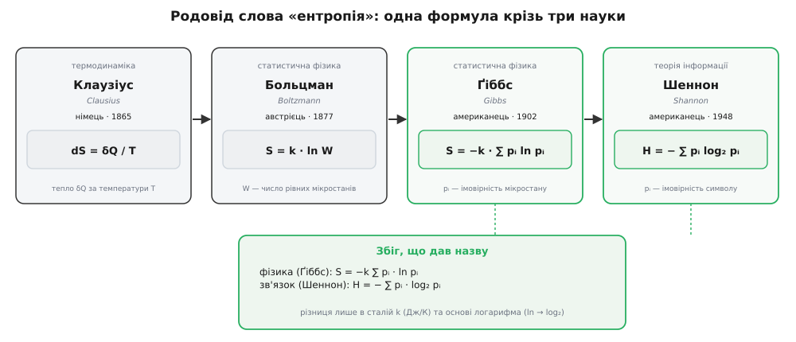

# 📜 Родовід одного слова: як «ентропія» дісталася від теплоти до інформації

Є дивина, повз яку легко пройти, не помітивши: величина, що міряє інформацію в повідомленні, носить ім'я, вигадане на вісімдесят років раніше — для парових машин. І це не вільна метафора, натягнута заднім числом. Той самий вислів, майже літера в літеру, з'явився у фізиці за півстоліття до Шеннона й означав там річ на позір геть іншу — незворотність теплових процесів. Простежмо, як слово пройшло крізь три науки й три покоління фізиків, поки не лягло на `H`.

### Клаузіус кує слово (1865)

Середина XIX століття. Інженери вже будують парові машини, та ясного рахунку, **чому** тепло тече лише від гарячого до холодного й чому жодна машина не буває досконалою, ще немає. Німецький фізик **Рудольф Клаузіус** (*Rudolf Clausius*, 1822–1888), докладаючи цеглину за цеглиною до другого начала термодинаміки, потребував назви для однієї особливої величини: тієї, що в замкненій системі лише зростає й міряє, наскільки процес «витратив» свою здатність робити роботу — незворотну частку кожного перетворення.

1865 року він таку величину вводить — позначає буквою `S` і означає через тепло та температуру:

```
dS = δQ / T
```

Приріст `S` — це порція тепла `δQ`, поділена на температуру `T`, за якої вона перейшла. Тут ще немає ні ймовірностей, ні логарифмів — сама макроскопічна бухгалтерія теплоти. А от назву Клаузіус добирає навмисне і зі смаком. Він бере грецьке **τροπή** (*tropē* — поворот, перетворення) і навмисно надає всьому слову форму, співзвучну зі словом «енергія» (*Energie*), бо ці дві величини — два стовпи його теорії, і, за його ж поясненням, він **свідомо** склав слово «ентропія» якомога схожим на «енергію». Свій підсумок другого начала Клаузіус карбує знаменитою парою фраз: **енергія світу стала; ентропія світу прямує до максимуму**. Це усталений факт, засвідчений його власними працями 1865 року.

Запам'ятаймо стан справ на цьому кроці: ентропія Клаузіуса — суто про тепло й температуру. Ні лічби станів, ні суми `p·log p` тут ще й близько немає.

### Больцман: ентропія стає лічбою мікростанів

Наступний крок робить австрієць **Людвіг Больцман** (*Ludwig Boltzmann*, 1844–1906) — і саме він перетворює ентропію з бухгалтерії теплоти на **лічбу можливостей**. Больцман питає не «скільки тепла перейшло», а «**чому** взагалі ентропія росте», і шукає причину в мікросвіті. Газ — це незліченні молекули. Один і той самий видимий стан (даний тиск, дана температура) можна скласти з молекул **безліччю способів**; хай число цих способів — мікростанів за одним макростаном — буде `W`. Больцманова думка: ентропія й міряє це число. Що більше мікростанів стоїть за макростаном, то вища його ентропія; а система дрейфує до макростанів із найбільшим `W` просто тому, що таких станів **більше** — у них частіше й потрапляєш наосліп.

Це і є місток від макро (Клаузіус) до мікро. Формула, вибита на надгробку Больцмана на Центральному цвинтарі Відня:

```
S = k · ln W
```

Тут варто чесно розрізнити ідею й запис. Саму пропорційність ентропії до логарифма числа станів (`S ∝ ln W`) Больцман установив у працях 1870-х (ключова — 1877 року). А от точний вигляд зі сталою `k` першим виписав уже **Макс Планк** (*Max Planck*) близько 1900 року; ту сталу `k` ми на його ж пропозицію звемо **сталою Больцмана** — на честь того, хто заклав саму ідею. Тож надгробкова формула — трохи історичний сплав двох рук, і це варто тримати як уточнення, а не спірне місце.

Чому тут узагалі **логарифм**? З тієї самої причини, що змусить логарифм і Шеннона. Числа мікростанів **множаться**, коли складаєш дві незалежні системи докупи (кожен стан однієї поєднується з кожним станом другої), а ентропія при цьому має **додаватися** — ціле є сумою частин. Єдина функція, що перетворює множення на додавання, — логарифм. (Хто хоче саму цю властивість — `log(a·b) = log a + log b` — розкриває окрема тема про [логарифми](topic:math/logarithms).) Та сама вимога адитивності, що працює тут на мікростани газу, згодом працюватиме в Шеннона на біти повідомлення — не випадково формули вийдуть однієї породи.

### Ґіббс узагальнює: ентропія нерівних станів

Больцманове `S = k · ln W` мовчки припускає, що всі `W` мікростанів **однаково ймовірні**. Реальні ансамблі не такі рівні: різні мікростани мають різні ймовірності `pᵢ`. Загальний вигляд, придатний і для нерівних станів, виписує американець **Джозая Віллард Ґіббс** (*Josiah Willard Gibbs*, 1839–1903) з Єльського університету — у праці «Основні принципи статистичної механіки» (*Elementary Principles in Statistical Mechanics*, 1902):

```
S = −k · ∑ pᵢ · ln pᵢ
```

Це і є та форма, заради якої вся розповідь. Сума по станах від `p·ln p`, зважена ймовірностями. Коли всі стани рівні (`pᵢ = 1/W`), вона акуратно згортається назад у `k · ln W` — тобто Больцман виявляється окремим випадком Ґіббса, найрівнішим із можливих. Ентропія тут остаточно стала **статистичною**: не про тепло, а про те, наскільки «розмазаний» розподіл імовірностей по своїх станах. Усталений факт.

### Той самий вислів у двох науках

Тепер — розв'язка. 1948 року Шеннон шукає міру середньої несподіванки джерела й приходить до

```
H = − ∑ pᵢ · log₂ pᵢ
```

Поставмо це поряд із Ґіббсовим `S = −k · ∑ pᵢ · ln pᵢ`. Це **та сама функція**. Шеннон змінив рівно дві речі. Він **прибрав фізичну сталу `k`** — тож `H` вийшло чистим числом, а не джоулями на кельвін. І він **замінив натуральний логарифм `ln` на двійковий `log₂`** — тож одиницею став біт, а не термодинамічна одиниця. Усе інше — літера в літеру те саме.



*Родовід величини крізь три науки. Клаузіус дав слово й макроскопічне означення через тепло; Больцман зробив ентропію лічбою мікростанів; Ґіббс узагальнив її на нерівні ймовірності — і саме Ґіббсів вислів збігається з Шенноновим `H` з точністю до сталої `k` (Дж/К) та основи логарифма (ln → log₂). Ім'я перейшло не за співзвуччям, а за тотожністю форми.*

Це глибока істина чи випадковість алгебри? Чесно — і те, і те. Форми збіглися тому, що обидві величини відповідають на **те саме абстрактне запитання**: наскільки розподіл імовірностей розмазаний по своїх можливих станах? В одному разі стани — це мікроконфігурації газу, в іншому — символи повідомлення, але математика питання однакова, тож і відповідь однакового вигляду. А от **зміст** різний, і тут аналогія ламається: термодинамічна ентропія має розмірність, стягнута до тепла й температури сталою `k`; інформаційна ентропія безрозмірна й стягнута до кодів та каналів. Глибокий фізичний міст між ними **існує** — Сілард, Ландауер і Джейнс зробили його точним (стерти один біт коштує щонайменше `k·T·ln2` виділеного тепла), — але це окремий, тяжко здобутий результат, а не подарунок від спільного імені. Спільна назва обіцяє однакову **форму**, не однакову фізику.

### Порада фон Неймана: знаменитий, але непевний анекдот

І тут не обійтися без найпопулярнішої історії про походження назви. За переказом, коли Шеннон вагався, як назвати свою `−∑ p·log p`, угорсько-американський математик **Джон фон Нейман** (*John von Neumann*, з будапештської єврейської родини, Neumann János, 1903–1957) нібито порадив: клич це ентропією, з двох причин. По-перше, та сама функція вже зветься так у статистичній механіці. По-друге, і це важливіше, **ніхто до пуття не розуміє, що таке ентропія, тож у будь-якій суперечці ти матимеш перевагу**.

Дотепно — і майже напевно прикрашено. Ось походження й статус цієї історії, без якого її переказувати нечесно. У друк вона потрапила аж **1971 року** — у статті Майрона Трайбуса (*Myron Tribus*) та Едварда Макірвайна «Енергія та інформація» (*Energy and Information*, «Scientific American»). Трайбус казав, що почув її від самого Шеннона близько **1961 року** — тобто через понад десять років після Шеннонової статті 1948-го, а сама гадана розмова з фон Нейманом мала б відбутися ще раніше, десь у 1940-х. І кілька речей роблять переказ сумнівним. Шеннонів **засекречений звіт із криптографії 1945 року** вже вживав слово «ентропія» й ототожнення `−∑ p·log p` з нею — отже, підказка фон Неймана про «те саме ім'я у фізиці» Шеннону, по суті, й не була потрібна: він знав це сам. А коли Шеннона згодом розпитували про цей анекдот, він **не пригадував**, щоб фон Нейман давав йому таку пораду.

Тож розважмо чесно: сама **дотепна фраза** — справжній фольклор науки й цілком у дусі фон Неймана; а от чи він **справді сказав** її Шеннонові — недоведено й, найпевніше, підретушовано переказом. Тримаймо це як **правдоподібний анекдот, а не задокументований факт**. Що документально відоме — то це що Шеннон **знав** про термодинамічну `S = −∑ p·log p`, коли обирав назву; вибір був свідомий, хай хто його підштовхнув.

### Що успадкувала назва

Слово перейшло крізь три науки й вісім десятиліть — від Клаузіуса 1865-го до Шеннона 1948-го — не за випадковим співзвуччям, а тому, що кожен крок **узагальнював** попередній. Теплова бухгалтерія Клаузіуса → лічба мікростанів у Больцмана → сума по ймовірностях у Ґіббса — і на останньому кроці сума стала настільки абстрактною, що однаково добре лягла і на молекули газу, і на символи повідомлення. Тож ім'я — справжній **спадок**, а не каламбур; але спадкує воно **форму**, не фізику. Шеннонова `H` міряє розмазаність розподілу ймовірностей — рівно те, що міряла й Ґіббсова `S`, тільки без кельвіна.
