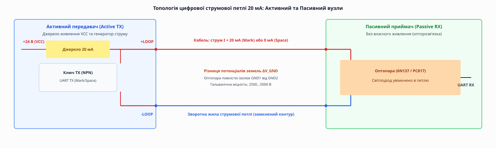
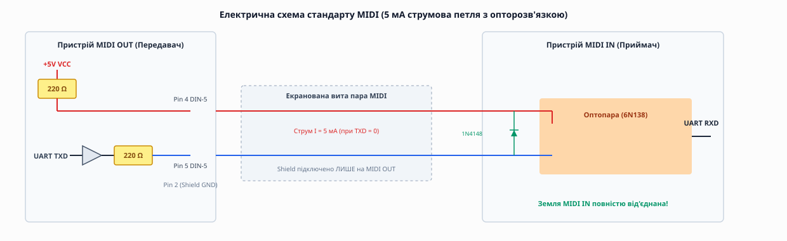
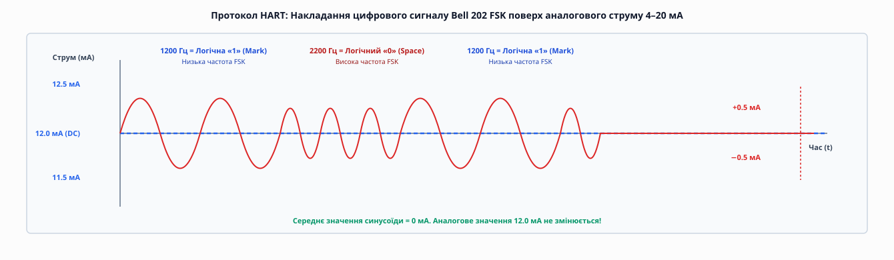

# Струмова петля: послідовний цифровий та аналоговий інтерфейс

<preknowlist>
- [Асинхронна передача](topic:communications/async-serial) — старт- і стоп-біти, узгоджена швидкість baud, кадр UART.
- [Гальванічна ізоляція](topic:electronics/galvanic-isolation) — оптична розв'язка джерел і розрив контурів заземлення.
- [Закон Ома та правила Кірхгофа](topic:electronics/ohms-law) — зв'язок напруги, струму й опору в послідовному колі.
</preknowlist>

Уявіть промисловий цех довжиною у триста метрів. На одному кінці стоїть контролер керування конвеєром, на іншому — датчик обертів вала або термінал введення даних. Між ними прокладено кабель, який проходить уздовж силових шин 380 Вольтів, частотних перетворювачів електродвигунів та дугових зварювальних апаратів. Спроба з'єднати ці пристрої звичайною послідовною лінією з однобічним напруговим сигналом (наприклад, RS-232 або 5-вольтовим TTL UART) приречена на поразку: опір довгого кабелю з'їсть частину напруги, потужні електромагнітні наведення спотворять цифровий потік, а різниця потенціалів між заземленнями двох цехових шаф у кілька десятків вольтів миттєво спалить вхідні мікросхеми. Фізична технологія **струмової петлі** (англ. *current loop*) виникла як один із найперших і найнадійніших розв'язків цієї проблеми: передавати інформацію не потенціалом напруги відносно місцевої землі, а протіканням фіксованого електричного струму в замкненому контурі.

Струмова петля залишається неперевершеною там, де потрібно прокласти лінію зв'язку на сотні метрів крізь сильні промислові завади без використання дорогих екранованих магістралей або складних високочастотних трансиверів. Вона лежить в основі класичних цифрових TTY-інтерфейсів 20 мА, музичного стандарту MIDI (5 мА) та аналогово-цифрових промислових систем 4–20 мА і HART.

---

### Фізичний принцип: чому струм не боїться опору та різниці земель

Щоб зрозуміти, чому передача струмом випереджає напругові лінії за надійністю на довгих дистанціях, слід звернутися до закону збереження електричного заряду та другого правила Кірхгофа для послідовного кола.

У послідовному замкненому колі струм `I` в усіх перетинах провідника **однаковий**. Скільки електронів за секунду вийшло з джерела живлення, стільки ж пройде крізь лінію зв'язку та потрапить у приймач на протилежному кінці кабелю:

```
I_sender = I_cable = I_receiver
```

Опір мідних жил кабелю `R_cable` нікуди не зникає, але він викликає падіння **напруги** (`U = I · R_cable`), а не зміну струму. Якщо джерело живлення має достатній запас напруги, воно проштовхне крізь коло строго заданий струм — наприклад, 20 мА. Якщо передавач виставив струм 20.0 мА, приймач на відстані пів кілометра зчитає ті самі 20.0 мА з прецизійною точністю.

#### Математичне обґрунтування пригнічення синфазного шуму (CMR)
Розглянемо виникнення зовнішньої електромагнітної завади від силового обладнання. Потужне змінне магнітне поле наводить на обидва близько скручені провідники витої пари однакову імпульсну напругу `V_noise`. 

Якщо лінія напругова, потенціал на вході приймача дорівнює сумі сигнальної напруги та завади:

```
V_rx = V_signal + V_noise
```

Вхідний компаратор приймає `V_noise` за корисний біт, що призводить до руйнування кадру даних (Framing Error).

У струмовій петлі передавач виступає в ролі **ідеального джерела струму** з нескінченно великим внутрішнім вихідним опором `R_out → ∞`. Вихідний струм джерела визначається рівнянням:

```
I_loop = (V_source + V_noise) / (R_out + R_cable + R_sense)
```

Оскільки внутрішній опір джерела струму `R_out` становить сотні кілоом або мегаоми (`R_out >> R_cable + R_sense`), вплив наведеної напруги завади `V_noise` стає знехтувально малим:

```
lim [R_out → ∞] (V_noise / R_out) = 0
```

Струм у петлі залишається нерухомим і стабільним. Електричне коло струмової петлі замкнене виключно через вхідні світлодіоди оптопари приймача та колекторні ключі передавача, що утворює ізольовану динамічну систему. Будь-які імпульси синфазного шуму, що з'являються одночасно на двох жилках витої пари відносно зовнішнього заземлення цеху, створюють однакові зсуви напруг на обох контактах світлодіода. Оскільки оптичний прилад реагує виключно на різницевий струм, що протікає крізь його p-n перехід, ці напругові сплески взаємно компенсуються і не спроможні змінити рівень свічення світлодіода.

#### Імунітет до різниці потенціалів земель
Друга фундаментальна перевага — **імунітет до різниці потенціалів земель** (англ. *ground potential difference*). У розподілених об'єктах заземлення різних будівель можуть мати різницю напруг `ΔV_GND` у 10…50 Вольтів через нерівномірне навантаження фаз та статичні заряди. 

Приймач струмової петлі містить вхідний світлодіод **оптопари** (англ. *optocoupler*), який увімкнений послідовно у сигнальний дріт. Оскільки струмове коло замкнене саме на себе і фізично від'єднане від місцевої землі приймача, потенціал `ΔV_GND` просто прикладений до гальванічної ізоляції оптопари (яка витримує від 2500 до 5000 Вольтів) і взагалі не впливає на струм у петлі.

---

### Цифрова струмова петля 20 мА: Активний та Пасивний вузли

У цифрових системах передачі даних (таких як TTY, Siemens CL або промисловий UART) струмова петля працює у двійковому режимі. Замість напругових рівнів 0 В та 5 В застосовують протікання або відсутність струму:

- **Стан Mark (Логічна «1» / Спокій):** струм у петлі тече і дорівнює **20 мА** (або 5 мА у MIDI). Це лінійний стан спокою — коли дані не передаються, струм постійно тече колом.
- **Стан Space (Логічний «0» / Старт-біт):** струм у петлі припиняється (0 мА) шляхом розмикання транзисторного ключа відправника.


*Активний вузол дає живлення та задає струм 20 мА, пасивний — комутує ключ або живить світлодіод оптопари. Опторозв'язка повністю розриває контур заземлення між вузлами.*

#### Концепція Активного та Пасивного вузла (Active vs Passive)
У будь-якому замкненому струмовому колі виникає питання: хто саме дає напругу живлення та обмежує струм? За цією ознакою пристрої струмової петлі діляться на два типи:

1. **Активний вузол (Active Node):** містить внутрішнє джерело постійної напруги (VCC, 12…24 В) та генератор або обмежувальний резистор, який стабілізує струм на рівні 20 мА.
2. **Пасивний вузол (Passive Node):** не має власного джерела живлення у колі петлі. Передавач пасивного вузла містить лише транзисторний ключ (відкритий колектор), який замикає або розмикає зовнішній струм, а приймач — світлодіод оптопари.

> ⚠️ **Золоте правило побудови струмової петлі:** У кожному замкненому контурі повинен бути **строго один активний вузол**. Якщо з'єднати два активні вузли — виникне конфлікт джерел живлення та коротке замикання; якщо з'єднати два пасивні вузли — струм у колі взагалі не піде.

Для забезпечення повнодуплексного обміну (*Full-Duplex*) застосовують **чотирипровідну лінію**, яка складається з двох незалежних струмових петель:
- **Петля TX (передача):** Активний TX передавача `Node A` → Пасивний RX приймача `Node B`.
- **Петля RX (прийом):** Пасивний RX приймача `Node A` ← Активний TX передавача `Node B`.

#### Транзисторна схемотехніка джерела струму Хулланда (Howland Current Pump)
Для створення активного джерела струму в аналогових та цифрових передавачах застосовують **насос струму Хулланда** на операційному підсилювачі:

```
                 R1            R2
    V_IN ───[ Resistor ]───┬──[ Resistor ]──┐
                           │                │
                          ┌┴┐               │
                        (−)│ ОУ             │
                           │  ──────────────┼─── Вихід I_out
                        (+)│ LM358          │
                          └┬┘               │
                           │                │
    GND ────[ Resistor ]───┴──[ Resistor ]──┘
                 R3            R4
```

При виконанні умови мосту `R2 / R1 = R4 / R3` вихідний струм схеми стає суворо пропорційним вхідній напрузі `V_IN` і взалі не залежить від опору підключеного кабелю та навантаження:

```
I_out = V_IN / R1
```

Ця схема дозволяє мікроконтролеру формувати прецизійний струм 20 мА або 4–20 мА за допомогою ззвичайного напругового виходу ЦАП.

> 📜 Розгортання асинхронних ліній від перших телеграфних апаратів Teletype Model 33 ASR зі струмом 60 мА до створення стандарту MIDI докладно описано у [історії від телетайпів до MIDI](topic:communications/current-loop/hist-teletype-to-midi.md).

---

### Музичний стандарт MIDI: 5 мА струмова петля проти земляних петель

Наочним прикладом того, як струмова петля врятувала цілу індустрію, є інтерфейс **MIDI** (Musical Instrument Digital Interface), створений у 1983 році.

У 1980-х роках музиканти зіштовхнулися з проблемою: при підключенні кількох синтезаторів та драм-машин до спільного аудіомікшера через звичайні напругові кабелі виникала **земляна петля** (англ. *ground loop*). Через екрани кабелів починали текти вирівнювальні струми частотою 50 Гц, викликаючи гучний низькочастотний гул у колонках.


*Схема MIDI 5 мА: передавач MIDI OUT живить струмову петлю, а на вході MIDI IN стоїть оптопара із повністю від'єднаною місцевою землею для запобігання гулу.*

Розробники MIDI застосували **струмову петлю зі струмом 5 мА**:
- Передавач **MIDI OUT** є активним вузлом: він подає +5 В через два обмежувальні резистори по 220 Ом на контакти 4 і 5 роз'єму DIN-5.
- Приймач **MIDI IN** є строго пасивним вузлом: усередині нього стоїть високошвидкісна оптопара (6N138 або PC817) із захисним діодом 1N4148.
- Земляний контакт 2 роз'єму MIDI IN **фізично від'єднаний від землі приймача**.

Результат: земляний контур між синтезаторами розірвано. Цифрові дані передаються струмом 5 мА на швидкості **31 250 бод**, а аудіотракт залишається абсолютно чистим від гулу 50 Гц.

---

### Порівняльний аналіз: Струмова петля проти RS-485 та RS-422

Часто постає інженерне питання: коли слід обирати струмову петлю 20 мА, а коли — диференційні напругові інтерфейси RS-422 чи RS-485? 

Розглянемо ключові відмінності між цими технологіями фізичного рівня:

1. **Термінування та хвильовий опір:**
   - Інтерфейси RS-485 та RS-422 працюють на високих швидкостях (до 10–35 Мбіт/с) і вимагають суворого узгодження хвильового опору кабелю (типово 120 Ом) та встановлення термінуючих резисторів `R_T = 120 Ом` на обох кінцях шини. Без термінування виникають відбиття високочастотних хвиль, які спотворюють імпульси.
   - Струмова петля 20 мА є низькочастотним інтерфейсом (до 19.2–115.2 кбіт/с). Вона **не вимагає хвильового термінування 120 Ом**. Джерело струму автоматично компенсує перехідні процеси, що спрощує монтаж та дозволяє використовувати будь-які провідники (навіть старі телефонні пари).

2. **Гальванічний розрив земель:**
   - Стандартні неізольовані трансивери RS-485 мають обмежений діапазон синфазної напруги від **-7 В до +12 В**. Якщо різниця потенціалів земель між двома шафами перевищить 12 Вольтів, вхідні каскади трансивера згорять. Для захисту доводиться купувати дорогі гальванічно ізольовані трансивери з ізольованими DC-DC перетворювачами.
   - Струмова петля за своєю фізичною природою є **гальванічно ізольованою з народження**: світлодіод оптопари приймача витримує зсув земель у 2.5–5 кВ без додавання будь-яких додаткових ізолюючих мікросхем.

3. **Миттєва діагностика обриву кабелю:**
   - В інтерфейсах RS-485 при перебитті кабелю диференційна напруга `V_A - V_B` входить у сіру зону, і приймач видає похибки або зависає. Програма розпізнає обрив лише після спливання таймауту відповіді (наприклад, 100…500 мс).
   - У струмовій петлі 20 мА при обриві кабелю струм миттєво падає з 20 мА до 0 мА. Апаратний UART виставляє прапор `Break Condition` протягом 1.2 бітового інтервалу, забезпечуючи реакцію системи за мікросекунди.

---

### Вибухозахист та іскробезпечні кола (Ex-i / Intrinsically Safe Loops)

На хімічних комбінатах, нафтопереробних заводах, зерносховищах та автозаправних станціях атмосфера містить горючі гази, пари бензину або вибухонебезпечний пил. У таких умовах найменша електрична іскра або нагрівання компонента понад +135 °C викликає миттєвий вибух.

Струмова петля 4–20 мА та 20 мА є єдиним електричним інтерфейсом, який природно адаптується до вимог **іскробезпечного електрообладнання (Ex-i / ATEX / IEC 60079-11)**.

Принцип іскробезпеки полягає в обмеженні максимальної накопичуваної енергії у колі до рівня, нижчого за поріг виникання іскри, здатної запалити вибухонебезпечну суміш метану або водню з повітрям:

```
E_spark = 1/2 · C_cable · V_max²  <  E_ignition (типово < 20 мкДж)
```

Для створення іскробезпечної струмової петлі застосовують **бар'єри Зенера (Zener Barriers)** або **активні гальванічні розділювачі**:

```
 [Безпечна зона: КІП]               [Вибухонебезпечна зона: Резервуар]
 
                              Бар'єр Зенера
  Джерело 24V ────────┬────────[ Запобіжник ]───────┬───────── Кабель 4–20 мА ──┐
                      │                             │                           │
                    ─┴─ Zener                      ─┴─ TVS                      ▼
                    ▲ ▲ 28V                        ▲ ▲                        [Датчик]
                      │                             │ (Ex-d / Ex-i)             │
  Земля КІП ──────────┴─────────────────────────────┴───────────────────────────┘
```

Бар'єр Зенера містить дубльовані стабілітрони та резистори обмеження струму. Навіть при руйнуванні контролера та пробої мережевої напруги 220 В у шафі, бар'єр обмежить напругу у кабелі на рівні не більше 28 В, а струм — на рівні не більше 93 мА, унеможливлюючи появу вибухонебезпечної іскри на датчику у резервуарі.

---

### Топології багатоточкових струмових петель (Multidrop Loop Topology)

Хоча дефолтним режимом струмової петлі є зв'язок «точка-точка» (Point-to-Point), у деяких цифрових та аналогових системах виникає потреба підключення кількох приймачів до одного передавача.

Для цього застосовують **послідовну топологію послідовного ввімкнення приймачів**:

```
 +24V VCC ──[ Active TX ]───┬───────( +LOOP )
                            │
                            ├───[ Passive RX 1: Optocoupler LED ]───┐
                            │                                       │
                            ├───[ Passive RX 2: Optocoupler LED ]───┤
                            │                                       │
                            └───[ Passive RX N: Optocoupler LED ]───┤
                                                                    │
 GND ───────────────────────────────────────────────────────────────┴───( -LOOP )
```

У цій схемі вхідні світлодіоди усіх пасивних приймачів вмикаються **послідовно в один ланцюг**.
- **Перевага:** усі N приймачів зчитують один і той самий струм 20 мА одночасно без спотворення бітів.
- **Обмеження напруги:** падіння напруги на вхідному світлодіоді кожного приймача становить `V_F ≈ 1.5 В`. Для N приймачів джерело живлення має забезпечити додатковий запас напруги `ΔV = N · 1.5 В`. При `N = 10` це вимагає додаткових 15 Вольтів запасу джерела живлення.
- **Резервування обриву:** якщо в одному з пасивних приймачів згорить або випаде світлодіод, струм припиниться в усій петлі. Для захисту паралельно входу кожного пасивного приймача вмикають зустрічно-паралельний шунтувальний стабілітрон (Zener diode) на напругу 3.3 В, який підхоплює струм петлі при поломці вхідного світлодіода.

---

### Стандарт NAMUR NE43 та діагностика аналогової струмової петлі 4–20 мА

В аналогових системах вимірювання струм 4–20 мА репрезентує фізичну величину (0…100 % шкали). Але головною рисою стандарту є наявність полів діагностики над та під робочою смугою, що регламентовано міжнародною рекомендацією **NAMUR NE43**.

```
       Шкала діагностичних рівнів струму NAMUR NE43:
┌─────────────────┬─────────────────────────────────────────────────────────────────┐
│ Струм (мА)      │ Значення та інтерпретація стану лінії                           │
├─────────────────┼─────────────────────────────────────────────────────────────────┤
│ < 3.6 мА        │ Аварія: Фізичний обрив кабелю або коротке замикання (Signal Down)│
│ 3.6 … 3.8 мА    │ Запас живлення: недовантаження датчика (Under-range warning)    │
│ 3.8 мА          │ Нижня межа достовірного вимірювання                             │
│ 4.0 мА          │ 0.0 % вимірюваної шкали (Живий нуль / Live Zero)                │
│ 12.0 мА         │ 50.0 % вимірюваної шкали                                        │
│ 20.0 мА         │ 100.0 % вимірюваної шкали                                       │
│ 20.5 мА         │ Верхня межа достовірного вимірювання                            │
│ 21.0 … 21.5 мА  │ Аварія: Перевантаження або поломка датчика (Signal Up)          │
│ > 21.5 мА       │ Аварія: Коротке замикання на лінію живлення VCC                 │
└─────────────────┴─────────────────────────────────────────────────────────────────┘
```

Завдяки розділенню на смуги мікроконтролер приймача легко відрізняє чесний нуль вимірювання (4.0 мА) від обриву дроту (менше 3.6 мА). При виникненні внутрішньої відмови (наприклад, поломці сенсора тиску) розумний передавач сам виставляє струм у 3.5 мА або 21.5 мА, повідомляючи систему про несправність.

---

### Гібридний протокол HART: FSK-цифровий сигнал поверх 4–20 мА

У промисловій автоматиці аналогова струмова петля 4–20 мА є стандартом передачі вимірювань. У 1980-х роках виникла потреба не лише зчитувати основне значення, але й дистанційно налаштовувати датчик, читати його серійний номер і діагностику без прокладання додаткових дротів.

Для цього компанія *Rosemount* розробила протокол **HART** (Highway Addressable Remote Transducer).


*Цифровий частотний сигнал HART Bell 202 (1200/2200 Гц) накладається синусоїдою ±0.5 мА поверх аналогового постійного струму 4–20 мА, не змінюючи його середнє значення.*

Принцип дії HART:
1. Основне аналогове значення передається постійним струмом в діапазоні **4–20 мА** (DC).
2. Цифрові дані накладаються зверху методом частотної модуляції **Bell 202 FSK** (Frequency Shift Keying) у вигляді синусоїдального змінного струму амплітудою **±0.5 мА**:
   - **Логічна «1» (Mark):** синусоїда частотою **1200 Гц**.
   - **Логічний «0» (Space):** синусоїда частотою **2200 Гц**.

Оскільки інтеграл синусоїди за період дорівнює нулю (`∫ sin(ωt) dt = 0`), **середнє значення аналогового струму 4–20 мА взагалі не змінюється**. Аналоговий вимірювальний прилад додачу синусоїди не помічає через інерційність фільтра, а цифровий HART-модем виділяє частоти 1200/2200 Гц через полосовий фільтр і зчитує цифрові байти на швидкості **1200 бод**.

---

### Розрахунок запасу напруги та обмеження швидкості (RC-ліміт)

Перш ніж прокладати кабель струмової петлі, розробник зобов'язаний виконати два фундаментальні інженерні розрахунки: баланс напруги живлення та розрахунок полоси пропускання за ємністю.

#### 1. Розрахунок запасу відповідності напруги (Compliance Voltage)
Джерело живлення петлі `V_supply` має покрити суму всіх спадів напруги при максимальному робочому струмі `I_max = 20 мА`:

```
V_supply ≥ V_tx_min + I_max · (R_cable + R_sense)
```

Де:
- `V_tx_min` — мінімальна напруга, необхідна для роботи схеми передавача (для 2-провідного датчика — 10…12 В).
- `R_cable` — опір обох жил кабелю (туди й назад): `R_cable = 2 · ρ · L / S`.
- `R_sense` — опір вимірювального резистора приймача (типово 250 Ом для розмаху 1…5 В).

**Worked-приклад розрахунку максимальної довжини лінії:**

**Умова:** Джерело живлення `V_supply = 24 В`, передавачу треба `V_tx_min = 10.5 В`, приймальний резистор `R_sense = 250 Ом`, струм `I_max = 20 мА`. Мідний кабель перерізом 0.5 мм² має опір `0.035 Ом/м` на одну жилу (`0.070 Ом/м` на пару). Яка максимальна довжина кабелю `L_max`?

```
1. Падіння напруги на вимірювальному резисторі:
   U_sense = I_max · R_sense = 0.020 A · 250 Ом = 5.0 В

2. Запас напруги, що залишається на опір кабелю:
   U_cable_max = V_supply − V_tx_min − U_sense
               = 24.0 В − 10.5 В − 5.0 В = 8.5 В

3. Максимальний припустимий опір двох жил кабелю:
   R_cable_max = U_cable_max / I_max = 8.5 В / 0.020 А = 425 Ом

4. Максимальна довжина кабелю L_max:
   L_max = R_cable_max / R_pair_per_meter = 425 Ом / 0.070 (Ом/м) ≈ 6071 метр
```

Висновок: при напрузі живлення 24 В петля спроможна працювати на відстані понад 6 кілометрів.

#### 2. Обмеження швидкості кабельною ємністю (RC low-pass filter)
Довгий кабель має паразитну міжжильну ємність `C_cable`. Разом із опором петлі вона утворює RC-фільтр, який затягує фронти перемикання струму:

```
t_rise ≈ 2.2 · R_loop · C_cable
```

При ємності кабелю `50 нФ` та опорі `500 Ом` час наростання `t_rise` становить `55 мкс`. Щоб імпульси не зливалися, тривалість біта `t_bit` має бути не меншою за `3 · t_rise ≈ 165 мкс`, що обмежує максимальну швидкість цифрової струмової петлі 20 мА на кілометровій дистанції рівнем **6000 бод** (практичний стандарт — 4800 або 9600 бод).

> 📋 Порівняльний аналіз електричних параметрів струмової петлі, RS-232 та RS-485 наведено у [компонентах та оптопарах струмових петель](topic:communications/current-loop/comp-optocouplers.md).

---

### Практичне обслуговування та методи діагностики струмових петель

Під час монтажу та пусконалагоджувальних робіт в умовах діючого підприємства інженери керуються чітким покроковим алгоритмом діагностики струмових петель:

1. **Вимірювання струму в розриві петлі:** мультиметр уживається в режимі вимірювання постійного струму (мА) послідовно у розрив однієї з жил кабелю. Якщо струм дорівнює `0.00 мА`, перевіряють напругу джерела живлення 24 В та цілісність запобіжника.
2. **Вимірювання напруги на вимірювальному резисторі:** без розриву кола мультиметром у режимі напруги (В) вимірюють спад на вимірювальному резисторі 250 Ом. Напруга `1.00 В` відповідає струму 4 мА (0 %), а `5.00 В` — струму 20 мА (100 %).
3. **Ізоляція несправності за допомогою калібратора:** замість датчика у кабель підключають портативний імітатор струмової петлі (Active Loop Calibrator). Якщо приймач на щиті правильно показує задані калібратором 4 мА та 20 мА, проблема полягає у самому датчику; якщо струм не тече — пошкоджено кабель або клеми.

---

### Програмний приклад: Обробка кадрів цифрової струмової петлі

Нижче наведено робочий приклад обробки асинхронного потоку байтів з виявленням обриву струмової петлі (`Break Condition`) на C та C++ у вигляді вкладок `:::tabs`.

:::tabs
```c
/* c */
#include <stdint.h>
#include <stdbool.h>

#define LOOP_BUF_SIZE 128

typedef enum {
    LOOP_OK = 0,
    LOOP_ERR_EMPTY,
    LOOP_ERR_BREAK_FAULT // Обрив струмової петлі (0 мА)
} loop_err_t;

typedef struct {
    uint8_t buf[LOOP_BUF_SIZE];
    uint16_t head;
    uint16_t tail;
    bool line_fault;
} current_loop_rx_t;

// Обробник переривання UART RX
void current_loop_isr(current_loop_rx_t *rx, uint8_t byte, bool break_detected) {
    if (break_detected) {
        rx->line_fault = true; // Аварія: струм припинився понад 12 бітів
        return;
    }
    uint16_t next = (rx->head + 1) % LOOP_BUF_SIZE;
    if (next != rx->tail) {
        rx->buf[rx->head] = byte;
        rx->head = next;
    }
}

loop_err_t current_loop_pop(current_loop_rx_t *rx, uint8_t *byte) {
    if (rx->line_fault) return LOOP_ERR_BREAK_FAULT;
    if (rx->head == rx->tail) return LOOP_ERR_EMPTY;
    *byte = rx->buf[rx->tail];
    rx->tail = (rx->tail + 1) % LOOP_BUF_SIZE;
    return LOOP_OK;
}
```
```cpp
// cpp
#include <cstdint>
#include <array>
#include <expected>

namespace current_loop {

constexpr std::size_t BufferSize = 128;

enum class DriverError {
    BufferEmpty,
    LineBreakFault // Фізичний обрив петлі
};

class LoopReceiver {
public:
    void on_rx_interrupt(uint8_t byte, bool break_detected) noexcept {
        if (break_detected) {
            line_fault_ = true;
            return;
        }
        const auto next = (head_ + 1) % BufferSize;
        if (next != tail_) {
            buffer_[head_] = byte;
            head_ = next;
        }
    }

    [[nodiscard]] std::expected<uint8_t, DriverError> read_byte() noexcept {
        if (line_fault_) {
            return std::unexpected(DriverError::LineBreakFault);
        }
        if (head_ == tail_) {
            return std::unexpected(DriverError::BufferEmpty);
        }
        uint8_t byte = buffer_[tail_];
        tail_ = (tail_ + 1) % BufferSize;
        return byte;
    }

    void clear_fault() noexcept { line_fault_ = false; }

private:
    std::array<uint8_t, BufferSize> buffer_{};
    volatile std::size_t head_{0};
    volatile std::size_t tail_{0};
    volatile bool line_fault_{false};
};

} // namespace current_loop
:::

> ⚙️ Повний приклад проєкту з кільцевим буфером, обробкою помилок кадрування та таймером міжбайтового інтервалу дивіться у [реалізації трансивера струмової петлі](topic:communications/current-loop/proj-current-loop-uart.md).

---

### Порівняльний підсумок інтерфейсів струмової петлі

```
       Порівняння різновидів струмової петлі:
┌─────────────────────┬──────────────────┬─────────────────┬───────────────────────┐
│ Параметр            │ Цифрова 20 мА CL │ MIDI (5 мА)     │ Аналогова 4–20 мА/HART│
├─────────────────────┼──────────────────┼─────────────────┼───────────────────────┤
│ Призначення         │ Промисловий UART │ Музичні інструм.│ Датчики та виконавчі  │
│ Сигнальний струм    │ 0 мА / 20 мА     │ 0 мА / 5 мА     │ 4–20 мА (DC) + FSK    │
│ Швидкість передачі  │ 110…19 200 бод   │ 31 250 бод      │ Аналог (DC) / 1200 бод│
│ Макс. відстань      │ До 1000 м        │ До 15 м         │ До 3000…6000 м        │
│ Гальванічна ізоляція│ Оптопара (6N137) │ Оптопара (6N138)│ Опціонально / Оптопара│
└─────────────────────┴──────────────────┴─────────────────┴───────────────────────┘
```

Завдяки своїй фундаментальній фізичній природі струмова петля залишається світовим еталоном завадостійкості та надійності. Поєднуючи конструктивну простоту двопровідного кабелю з абсолютним захистом від земляних потенціалів та миттєвою самодіагностикою обриву, вона впевнено утримує свої позиції в промислових та спеціалізованих системах зв'язку вже майже століття.
