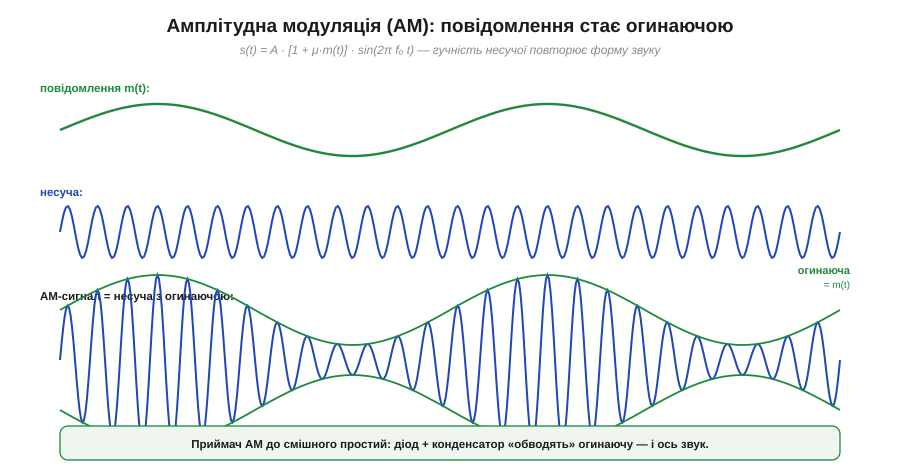
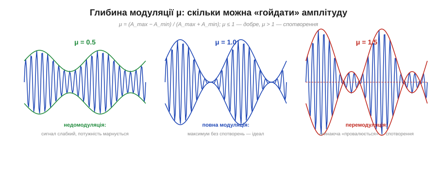
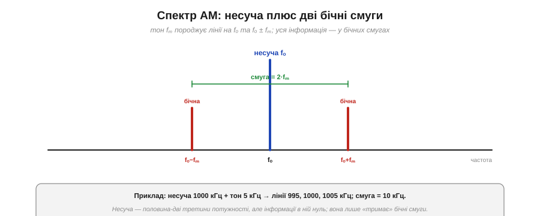
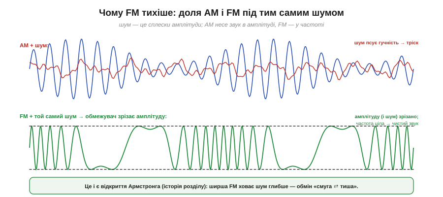
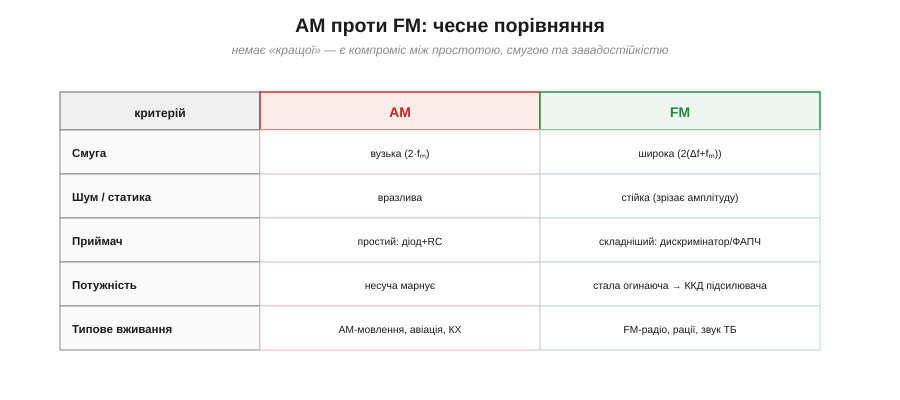

# Амплітудна й частотна модуляція (AM/FM)

У несучої є [три ручки, за які її можна крутити](book:communications/why-modulation) — амплітуда, частота й фаза. Візьмімо дві з них — амплітуду й частоту — і розберімо до дна. Це не випадкові приклади: на AM стоїть усе перше століття радіомовлення, а FM — це та сама модуляція, за чисту якість якої Едвін Армстронг заплатив життям. Зрозумівши ці дві, ти зрозумієш **принцип** будь-якої модуляції, бо решта — лише варіації на ту саму тему.

### AM: гойдаємо амплітуду в такт зі звуком

Найпростіша й найстаріша ідея — **амплітудна модуляція** (*amplitude modulation*, AM): тримати частоту несучої сталою, а її **амплітуду** (гучність хвилі) змінювати в такт із повідомленням. Голосніший звук — більша амплітуда несучої, тихіший — менша. Математично це записують так:

```
s(t) = A · [1 + μ·m(t)] · sin(2π·fₒ·t)
       └───── огинаюча ─────┘   └─ несуча ─┘
```

де m(t) — нормоване повідомлення (від −1 до +1), fₒ — частота несучої, а μ — **глибина модуляції**, що задає, наскільки сильно ми розгойдуємо амплітуду. Уся хитрість у тому, що множник `[1 + μ·m(t)]` стає **огинаючою** (*envelope*) — обвідною лінією, що окреслює форму хвилі зверху й знизу.


*Рис. Беремо повільне повідомлення m(t) і швидку несучу; на виході — несуча, чия амплітуда «дихає» в такт із повідомленням. Огинаюча AM-сигналу точно повторює форму звуку. Саме тому приймач AM украй простий: діод відсікає половину хвилі, конденсатор згладжує — і на виході одразу огинаюча, тобто звук.*

Найприємніше в AM — **простота приймача**. Щоб дістати звук назад, не треба нічого складного: діод пропускає лише верхні півхвилі, конденсатор їх згладжує — і на виході з'являється та сама огинаюча, тобто вихідне повідомлення. Цей **детектор огинаючої** (*envelope detector*) — буквально кілька копійчаних деталей. Ось чому за часів, коли кожна лампа була на вагу золота, переможцем стало саме AM: дешевий масовий приймач.

### Скільки можна гойдати: глибина модуляції

Ключовий параметр AM — **глибина** (або **індекс**) **модуляції** μ: наскільки сильно ми розгойдуємо амплітуду. Її визначають з огинаючої:

```
μ = (A_max − A_min) / (A_max + A_min)
```


*Рис. μ = 0.5 — недомодуляція: огинаюча не доходить до нуля, сигнал слабкий, потужність витрачено марно. μ = 1.0 — повна модуляція: огинаюча торкається нуля, максимум корисного сигналу без спотворень. μ = 1.5 — перемодуляція: огинаюча намагається «провалитися» нижче нуля, хвиля спотворюється, звук хрипить.*

**Приклад (читаємо глибину з осцилограми).** Нехай на екрані осцилографа максимальний розмах огинаючої A_max = 10 поділок, мінімальний A_min = 2:

```
μ = (10 − 2) / (10 + 2) = 8 / 12 ≈ 0.67  →  67% модуляції
```

Правило просте: тримай **μ ≤ 1**. За μ < 1 ти недовикористовуєш передавач (як на лівій панелі), за μ = 1 — вичавлюєш максимум, а от за μ > 1 настає **перемодуляція**: огинаюча «провалюється» за нуль, несуча на мить ніби обертає фазу, і звук спотворюється хрипом. Тому в реальних AM-передавачах стоїть обмежувач, що не дає перейти цю межу.

### Спектр AM: уся інформація — у бічних смугах

Тепер найважливіше для розуміння — як AM виглядає **у спектрі** (за частотами). Виявляється, проста модуляція однією синусоїдою-тоном fₘ породжує **три** спектральні лінії.


*Рис. Тон fₘ, що модулює несучу fₒ, дає лінію на самій fₒ і дві **бічні смуги** (*sidebands*) на fₒ−fₘ та fₒ+fₘ. Уся корисна інформація захована саме в бічних смугах; повна смуга сигналу — 2·fₘ (удвічі більша за найвищу звукову частоту).*

**Приклад (смуга AM-каналу).** Несуча 1000 кГц, найвищий звуковий тон 5 кГц:

```
лінії спектра : 995 кГц | 1000 кГц | 1005 кГц
смуга B = 2·fₘ = 2 × 5 кГц = 10 кГц
```

Саме тому канали AM-мовлення стоять із кроком близько 10 кГц. Але тут криється й вада AM: придивись, де сидить **потужність**. Сама несуча (центральна, найвища лінія) забирає **більшу частину** потужності передавача — а інформації в ній **нуль**! Корисний сигнал — лише у двох бічних смугах. Виходить, AM безбожно марнує енергію на передавання «порожньої» несучої. Інженери це давно зрозуміли й винайшли економніші варіанти — як-от **односмугову модуляцію** (*single-sideband*, SSB), де передають лише одну бічну смугу без несучої; SSB набагато ефективніша й тому панує в далекому радіозв'язку та аматорському ефірі.

> 🔧 **Навіщо це.** Попри марнотратність і вразливість до шуму, AM **дотепер жива** — і не випадково. Її приймач найпростіший і найдешевший; сигнал добре йде на довгих і середніх хвилях на величезні відстані; а головне — **авіація** й досі вживає AM на діапазоні ~118–137 МГц. Чому? Через так званий **ефект захоплення** в FM, коли приймач чіпляється лише за сильніший сигнал: якщо два літаки заговорять водночас на AM, диспетчер почує **обидва** (накладені) і зрозуміє, що є конфлікт. На FM сильніший сигнал повністю заглушив би слабший — і другий пілот зник би безслідно. Іноді «гірша» технологія безпечніша. Це гарний урок: вибір модуляції визначають не лише чистота й ефективність, а й вимоги застосування.

### FM: гойдаємо частоту

Тепер друга ручка — і друга, складніша, але набагато тихіша модуляція. У **частотній модуляції** (*frequency modulation*, FM) амплітуда несучої лишається **сталою**, а в такт із повідомленням гойдається її **миттєва частота**: голосніший звук — сильніший відхил частоти вгору-вниз.

```
миттєва частота:  f(t) = fₒ + Δf·m(t)
```

де **Δf** — **девіація** (*deviation*), тобто на скільки максимум відхиляється частота від несучої fₒ. Це той самий параметр, навколо якого крутиться вся ідея Армстронга.


*Рис. Там, де повідомлення велике, хвиля «густішає» (висока миттєва частота); де мале — «рідшає» (низька). А от амплітуда — стала від краю до краю: вона у FM не несе нічого. Саме тому приймач може сміливо зрізати будь-які коливання амплітуди.*

Ось де ховається перевага, яку відкрив Армстронг. Раз інформація в FM сидить **у частоті**, а **не** в амплітуді, то приймач має повне право амплітуду просто **викинути** — пропустити сигнал через **обмежувач** (*limiter*), що зрізає його до сталої «висоти». А разом з амплітудою зникає й майже весь шум, бо шум — це переважно сплески амплітуди.

### AM проти FM під одним і тим самим шумом

Порівняймо долю двох модуляцій, коли на них однаково сипле статика.


*Рис. Зверху: шум додає сплески амплітуди — а AM саме в амплітуді несе звук, тож тріск стає чутним. Знизу: FM пропускають через обмежувач, який зрізає всі амплітудні коливання (і шум разом із ними); частота лишається недоторканою — і звук виходить чистим.*

Це і є технічне серце того, чого домагався Армстронг. AM беззахисне перед статикою, бо не вміє відрізнити «гучніше через музику» від «гучніше через блискавку». FM же викидає амплітуду цілком — і шум іде разом із нею. Понад те: що **ширше** ми дозволяємо частоті гойдатися (більша девіація Δf), то глибше тоне шум відносно сигналу. Звідси й парадокс Армстронга: **ширша смуга → тихіше**.

Є й цікавий побічний ефект FM — **захоплення** (*capture effect*): якщо на одній частоті є два FM-сигнали, приймач «чіпляється» за **сильніший** і повністю ігнорує слабший — без каші, але й без другого голосу. Для музичного радіо це чудово (чуєш найближчу станцію чисто), а для авіації — навпаки небезпечно: слабший голос зник би безслідно.

### Ціна тиші — смуга: правило Карсона

За чистоту FM платить дорого — **шириною смуги**. Скільки саме смуги займає FM-сигнал, оцінюють простим **правилом Карсона** (*Carson's rule*) — того самого Джона Карсона, що колись математично «довів» марність FM:

```
B ≈ 2·(Δf + fₘ)
```


*Рис. Мала девіація Δf — вузький спектр, тісно, але шумніше. Велика Δf — спектр широкий, смуги багато, зате чисто. FM свідомо «розтринькує» смугу заради завадостійкості — це і є виграш Армстронга.*

**Приклад (смуга FM-мовлення).** Стандарт радіомовлення: максимальна девіація Δf = 75 кГц, найвищий звуковий тон fₘ = 15 кГц:

```
B ≈ 2 × (75 + 15) кГц = 180 кГц   →  канал відводять 200 кГц
```

Порівняй це з 10-кілогерцовим каналом AM: FM-станція займає у **~20 разів** ширшу смугу! Ось ціна високоякісного, безшумного звуку. Це той самий фундаментальний **обмін «смуга ↔ завадостійкість»**, що його Армстронг намацав інженерною інтуїцією, а Клод Шеннон згодом перетворив на точний закон — [межу пропускної здатності каналу](book:communications/bandwidth-capacity).

### AM проти FM: коли що

Зберімо все в одну чесну таблицю. Немає «кращої» модуляції — є компроміс.


*Рис. AM: вузька смуга, простий приймач — але вразливе до шуму й марнує потужність на несучу. FM: стійке до завад, сталий рівень (вигідний для підсилювача) — але широка смуга й складніший приймач. Кожне виграє у своїй ніші.*

Підсумуймо інженерну суть. **AM** обирають там, де цінні простота, дешевизна й вузька смуга, а з шумом готові змиритися: AM-мовлення на середніх хвилях, авіація, далекий КХ-зв'язок (часто у вигляді SSB). **FM** — там, де головне чистота й вірність звуку, а смуги не шкода: FM-радіо, рації, звуковий супровід аналогового телебачення, перші покоління мобільного зв'язку. Додатковий, неочевидний плюс FM — **сталий рівень** сигналу: підсилювач передавача може працювати в найекономнішому режимі «на повну», не боячись спотворити амплітуду (бо вона й так стала). Це робить FM-передавачі енергетично вигідними — важлива деталь для автономних пристроїв.

Обидві ці модуляції — **аналогові**: вони беруть неперервний звук і неперервно ж крутять ручку несучої. Але світ навколо нас давно став **цифровим**: телеметрія дрона, [Wi-Fi](book:communications/wifi), [Bluetooth](book:communications/bluetooth-spp) передають не звук, а **біти** — нулі та одиниці. Як модулювати несучу дискретними символами? Тут ті самі три ручки оживають по-новому — як [цифрові FSK і PSK](book:communications/fsk-psk), де частоту чи фазу перемикають не плавно, а стрибками між кількома наперед заданими значеннями.

---
