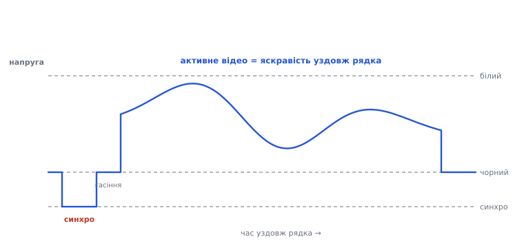
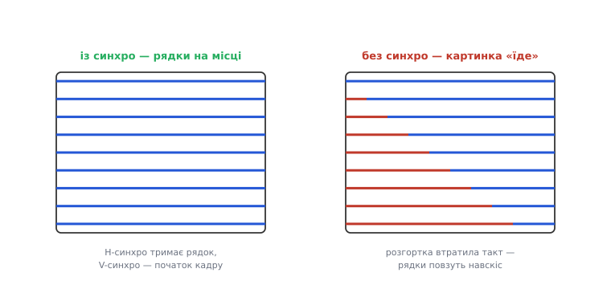
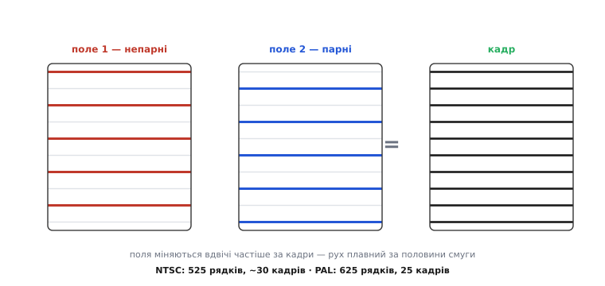
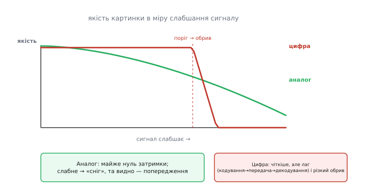

# Аналоговий відеосигнал: рядки, кадри, синхро (FPV)

Цифрове відео несе кадр як сітку чисел. Та є й старий, аналоговий спосіб нести відео, і він досі живий — надто у **FPV** (*first-person view* — політ «очима» камери). Тут картина тече не числами, а **плавною напругою**, точнісінько за ідеєю електронної розгортки, що її 1927 року показав Філо Фарнсворт. Розберімо, як влаштований цей сигнал — і чому аналог пережив свій вік.

### Один рядок — це напруга в часі

Електронна розгортка розбиває образ на рядки й читає їх по черзі. В аналоговому відео кожен **рядок** — це просто напруга, що міняється в часі: вище — світліше, нижче — темніше. Камера «проводить» по рядку зліва направо й видає відповідну криву; приймач малює її назад тим самим рухом.


*Рядок аналогового відео як осцилограма. Картина тече плавною напругою: вище — світліше (білий рівень), нижче — темніше (чорний). Перед рядком сигнал падає нижче чорного — це синхроімпульс «новий рядок», за ним коротке гасіння (поки промінь біжить назад), і аж тоді активне відео — сама яскравість уздовж рядка.*

Але як приймач знає, **де** рядок починається? Перед кожним рядком сигнал на мить падає нижче «чорного» — це **синхроімпульс** (*sync*, від латинського *synchronus* — «одночасний»), умовний знак «новий рядок тут». Між синхроімпульсом і картинкою лежить коротка чорна пауза — **гасіння** (*blanking*): поки промінь приймача перебігає назад до початку наступного рядка, його «гасять», щоб цей зворотний хід не псував картину. Тож рядок сигналу складається з трьох частин по черзі: синхроімпульс, гасіння, тоді активне відео.

### Синхро: щоб картинка не «їхала»

Синхроімпульси — це нерви всього аналогового відео. Їх два роди. **Рядковий** (горизонтальний) синхро на початку кожного рядка тримає приймач у такт по рядках. **Кадровий** (вертикальний) — довший, особливий імпульс на початку кожного **кадру** — каже «починай згори». Разом вони тримають розгортку приймача в один такт із камерою.


*Синхро тримає картинку на місці. Рядковий синхроімпульс позначає початок кожного рядка, кадровий (довший) — початок кадру; приймач замикає на них свою розгортку. Втратив такт — і рядки повзуть навскіс. Синхроімпульси лежать нижче рівня чорного, у службовій зоні, якої око не бачить.*

Що буде без синхро? Картинка попливе: рядки розповзуться, кадр покотиться вгору чи вниз, зображення розірве навскіс. Хто застав аналогові телевізори, пам'ятає це «перевертання» картинки, поки не підкрутиш регулятор, — то губився синхро. У сигналі синхроімпульси вирізняє те, що вони лежать **нижче** рівня чорного, у «службовій» зоні, якої око не бачить: для приймача це й є чітка межа між «де малювати» і «де початок».

### Композитний сигнал: усе в одному дроті

Уся краса схеми в тому, що яскравість, рядковий синхро й кадровий синхро злиті в **один** дріт, у єдину напругу в часі. Такий змішаний сигнал звуть **композитним** (*composite*, від латинського *componere* — «складати докупи»; у FPV його позначають CVBS). Одна жила несе все: рівнем напруги — яскравість, провалами нижче чорного — мітки рядків і кадрів. Саме за цю простоту аналог так дешевий: камера, дріт, передавач — і жодного процесора між ними.

> 🔧 **Навіщо це.** Дешева FPV-камера віддає один композитний (CVBS) вихід — той самий жовтий тюльпан, що колись ішов у телевізор. Тому камеру з аналоговим виходом можна під'єднати майже до будь-чого: до передавача, до екранного меню (OSD), що домальовує телеметрію поверх відео, до запису. Усе працює з однією жилою, бо в ній уже є і картинка, і синхро.

### Кадри й поля: черезрядковість

Стара аналогова традиція має ще одну хитрість — **черезрядкову розгортку** (*interlacing*, від англійського *interlace* — «переплітати»). Замість малювати всі рядки кадру поспіль, сигнал малює спершу всі **непарні** рядки (це одне **поле**), а тоді всі **парні** (друге поле). Два поля, прокладені одне крізь одне, складають **кадр**.


*Черезрядкова розгортка. Сигнал малює спершу непарні рядки (поле 1), тоді парні (поле 2); два поля, прокладені одне крізь одне, складають кадр. Поля міняються вдвічі частіше за кадри — тож рух плавний за половини смуги. Звідси й стандарти, що їх успадкував FPV: NTSC (525 рядків, близько 30 кадрів) і PAL (625 рядків, 25 кадрів).*

Навіщо так? Щоб за **половину** смуги зберегти плавність: поля міняються вдвічі частіше за кадри, тож око бачить рух гладким, хоч даних удвічі менше. Це спадок ери, коли смуга була на вагу золота. Сучасні сенсори знімають **прогресивно** (увесь кадр за раз), але стара черезрядковість досі живе в аналоговому FPV. Тут і коріння двох стандартів, між якими й нині обирає пілот: **NTSC** (525 рядків, близько 30 кадрів) і **PAL** (625 рядків, 25 кадрів).

> 📜 Ці два стандарти FPV успадкував прямо з епохи аналогового телебачення. Американський **NTSC** (525 рядків) перший приніс кольорове мовлення — стандарт затвердили 1953 року, — та його колір «плив» від фазових спотворень у каналі, і глядач мусив сам підкручувати відтінок; інженери жартома розшифровували NTSC як «*Never The Same Color*», ніколи той самий колір. Ліки знайшов німець **Вальтер Брух** у Telefunken (Ганновер): систему **PAL** (*Phase Alternating Line* — «рядок із поперемінною фазою») Telefunken запатентував у грудні 1962-го, а 3 січня 1963-го Брух показав її Європейській мовній спілці. Хитрість проста: фазу кольору **перевертають щорядка**, і приймач сам усереднює сусідні рядки, гасячи помилку, — ціною дрібки вертикальної роздільності. Так світ розділився на 525/30 і 625/25, а через півстоліття ти, вибираючи в меню FPV-камери «PAL чи NTSC», тиснеш на відлуння суперечки 1960-х.

### Як це летить: FM на 5.8 ГГц

Композитний сигнал треба ще донести до окулярів пілота. Аналогове FPV кладе його на радіонесучу **частотною модуляцією** (*FM*, *frequency modulation*): миттєва частота передавача гойдається в такт із напругою відео — світліша точка трохи піднімає частоту, темніша опускає. Працює це здебільшого в діапазоні **5.8 ГГц**, де під відео відведено кілька десятків каналів.

Чому саме FM, а не простіше — амплітудою? Бо [амплітудна модуляція](book:communications/am-fm) несла б яскравість як силу сигналу, і будь-яке завмирання чи завада прямо били б по картинці. FM же тримає інформацію в частоті, а не в силі: поки приймач узагалі ловить несучу, він відновлює напругу відео майже незалежно від того, наскільки вона ослабла дорогою. Звідси й знаменита «м'яка» поведінка аналогу на межі дальності — слабкий сигнал дає шум, а не порожнечу.

### Чому аналог пережив свій вік

Здавалося б, цифрове відео чіткіше — то чому гонщики FPV десятиліттями трималися аналогу? Дві причини, обидві про **виживання в реальному польоті**.


*Якість проти слабшання сигналу. Аналог: майже нуль затримки (сигнал і є картинкою) і плавне згасання — слабне сигнал, наростає шум-«сніг», та картинка деградує поступово, з попередженням до повної втрати. Цифра (HD FPV): чітка картинка, та з лагом (кодування → передача → декодування) і обривом — тримається до порога, а за ним фриз, квадрати, чорне.*

Перша — **затримка**. В аналозі сигнал **і є** картинкою: що камера бачить, те вмить летить в окуляри, без кодування й декодування. Через те, що між сенсором і екраном немає кадрового буфера, ні стиснення, ні розпакування, затримка падає майже до нуля — лишається хіба час пробігу променя розгортки. Цифра ж мусить кадр **стиснути**, передати й **розтиснути** — а це десятки мілісекунд [лагу](book:programming/video-latency), які при польоті на швидкості відчутні рукою.

Друга — **м'яка відмова**. Коли аналоговий сигнал слабшає (далеко, завада), картинка поступово заростає шумом-«снігом»: вона деградує плавно й **попереджає** до повної втрати, тож пілот устигає відвернути — хоча за певною межею сильний шум і збитий синхро вбивають картинку й тут. Цифра ж тримається чітко до порога, а за ним **обривається стрімко**: фриз, квадрати, чорний екран — і ти осліп миттєво. Для того, хто летить очима камери, «шумне, та живе» безпечніше за «чисте, що зненацька замерзає». Тому аналог і живий, хоч цифрове FPV із кращою картинкою дедалі його тіснить.

> 🔧 **Навіщо це.** Якщо літаєш на аналоговому FPV — стеж за наростанням «снігу»: це чесне попередження, що сигнал слабне, і час вертатися, поки видно. Цифрове FPV такого ввічливого попередження не дає — воно тримається до останнього, а тоді гасне різко, тож для нього важливіші запас зв'язку й [failsafe](book:programming/flight-controller). І став PAL чи NTSC **однаково** на камері та в окулярах — інакше приймач не зчитає синхро (бо в нього інша кількість рядків і частота кадрів), і ти не побачиш нічого.

### Скільки триває рядок: рахунок у прошивці

Числа тут прямі й корисні. Стандарт PAL дає 625 рядків на кадр за 25 кадрів за секунду. Звідси час одного рядка — і це число вирішує, як швидко мусить устигати все, що чіпає сигнал: від генератора синхро до накладання телеметрії на відео.

**Умова.** PAL: 625 рядків, 25 кадрів/с. Знайти рядкову частоту й час одного рядка; прикинути, скільки точок устигне покласти на рядок мікроконтролер, що жене піксельний такт 8 МГц.

:::tabs
```c
// PAL-розгортка: рахунок таймінгу рядка у прошивці
const int   lines_per_frame = 625;
const float frames_per_sec  = 25.0f;

float line_rate = lines_per_frame * frames_per_sec; // = 15625 рядків/с
float line_time = 1.0f / line_rate;                 // = 64.0 мкс на рядок

// скільки точок устигне піксельний такт 8 МГц за активну частину рядка
// (з 64 мкс близько 52 мкс — активне відео, решта — синхро + гасіння)
const float pixel_clock = 8.0e6f;        // 8 МГц
float active_time = 52.0e-6f;            // активна частина рядка, с
int   dots = (int)(pixel_clock * active_time); // = 416 точок уздовж рядка
```
```python
# PAL-розгортка: рахунок таймінгу рядка
lines_per_frame = 625
frames_per_sec  = 25.0

line_rate = lines_per_frame * frames_per_sec  # = 15625 рядків/с
line_time = 1.0 / line_rate                   # = 64.0 мкс на рядок

# скільки точок устигне піксельний такт 8 МГц за активну частину рядка
# (з 64 мкс близько 52 мкс — активне відео, решта — синхро + гасіння)
pixel_clock = 8.0e6                     # 8 МГц
active_time = 52.0e-6                    # активна частина рядка, с
dots = int(pixel_clock * active_time)   # = 416 точок уздовж рядка
```
:::

```
line_rate = 625 × 25            = 15625 рядків/с
line_time = 1 / 15625           = 64.0 мкс
dots      = 8·10⁶ × 52·10⁻⁶     ≈ 416 точок
```

Виходить рівно ті славні **15.625 кГц** рядкової частоти, що на них «співали» старі телевізори, і **64 мкс** на рядок. А 416 точок пояснюють, чому накладання телеметрії (OSD) на аналог рахують у грубих знакомісцях, а не в пікселях HD: за 52 мкс активного рядка більше деталей просто нема куди покласти.
