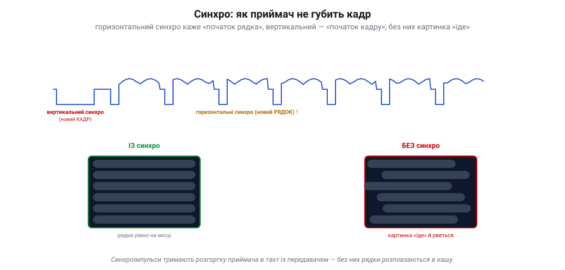

# Аналоговий відеосигнал: рядки, кадри, синхро (FPV)

Цифрове відео несе кадр як сітку чисел. Але є й **старий, аналоговий** спосіб нести відео, що й досі живий, надто у **FPV** (*first-person view* — політ «очима» камери). Тут картина тече не числами, а **плавною напругою**, точнісінько за ідеєю електронної розгортки Фарнсворта. Розберімо, як влаштований цей сигнал — і чому аналог пережив свій вік.

### Один рядок — це напруга в часі

Електронна розгортка розбиває образ на рядки й читає їх по черзі. В аналоговому відео кожен **рядок** — це просто **напруга, що міняється в часі**: вище — світліше, нижче — темніше. Камера «проводить» по рядку зліва направо й видає відповідну криву; приймач малює її назад тим самим рухом.

*Рис. Рядок аналогового відео як осцилограма. Картина тече плавною напругою: вище — світліше (білий рівень), нижче — темніше (чорний рівень). Перед кожним рядком сигнал падає нижче чорного — це **синхроімпульс** «новий рядок», а за ним коротке **гасіння** (поки промінь біжить назад). Далі — **активне відео**: сама яскравість уздовж рядка. Це Фарнсвортова розгортка живцем.*

Але як приймач знає, **де** рядок починається? Перед кожним рядком сигнал на мить падає нижче «чорного» — це **синхроімпульс** (*sync*), умовний знак «новий рядок тут». Між синхроімпульсом і картинкою є коротка чорна пауза (**гасіння**, *blanking*) — поки промінь приймача перебігає назад до початку наступного рядка, його «гасять», щоб цей зворотний хід не псував картину. Отже, рядок сигналу — це: синхроімпульс, гасіння, тоді **активне відео** (сама яскравість). Просто, як і все геніальне.

### Синхро: щоб картинка не «їхала»

Синхроімпульси — це нерви всього аналогового відео. Їх два роди. **Горизонтальний** синхро (на початку кожного рядка) тримає приймач у такт по рядках. **Вертикальний** — довший, особливий імпульс на початку кожного **кадру** — каже «починай згори». Разом вони тримають розгортку приймача **синхронно** з камерою.

*Рис. Синхро тримає картинку на місці. **Горизонтальний** синхроімпульс позначає початок кожного рядка, **вертикальний** (довший) — початок кадру; приймач замикає на них свою розгортку (ліворуч — рядки рівно). Без синхро картинка «їде» й рветься навскіс (праворуч). Синхроімпульси лежать нижче рівня чорного, у службовій зоні, якої око не бачить.*

Що буде без синхро? Картинка «**попливе**»: рядки розповзуться, кадр покотиться вгору чи вниз, зображення розірве навскіс. Хто застав аналогові телевізори, пам'ятає це «перевертання» картинки, поки не підкрутиш — то губився синхро. У сигналі синхроімпульси вирізняються тим, що лежать **нижче** рівня чорного, у «службовій» зоні, якої око не бачить, — тож приймач легко відрізняє «де малювати» від «де початок».

### Кадри й поля: черезрядковість

Стара аналогова традиція має ще одну хитрість — **черезрядкову розгортку** (*interlacing*). Замість малювати всі рядки кадру поспіль, сигнал малює спершу всі **непарні** рядки (це одне **поле**), а тоді всі **парні** (друге поле). Два поля, прокладені одне крізь одне, складають **кадр**.

*Рис. Черезрядкова розгортка. Сигнал малює спершу непарні рядки (поле 1), тоді парні (поле 2); два поля, прокладені одне крізь одне, складають кадр. Поля міняються вдвічі частіше за кадри — тож рух плавний за половини смуги. Звідси й стандарти, що їх успадкував FPV: NTSC (525 рядків, ~30 кадрів) і PAL (625 рядків, 25 кадрів).*

Навіщо так? Щоб за **половину** смуги зберегти плавність: поля міняються вдвічі частіше за кадри, тож око бачить рух гладким, хоч даних удвічі менше. Це спадок ери, коли смуга була на вагу золота. Сучасні сенсори знімають **прогресивно** (увесь кадр за раз), але стара черезрядковість досі живе в аналоговому FPV. Тут і коріння двох стандартів, між якими й нині обирає пілот: **NTSC** (525 рядків, ~30 кадрів) і **PAL** (625 рядків, 25 кадрів).

> 📜 Ці два стандарти FPV успадкував прямо з епохи аналогового телебачення. Американський **NTSC** (525 рядків) перший приніс кольорове мовлення (1953), та його колір «плив» від фазових спотворень у каналі — інженери жартома розшифровували NTSC як «*Never The Same Color*», ніколи той самий колір. Ліки знайшов німець **Вальтер Брух** у Telefunken: 1963 року він показав систему **PAL** (*Phase Alternating Line*), де фазу кольору **перевертають щорядка**, і приймач сам усереднює помилки, відновлюючи чесний колір — ціною дрібки вертикальної роздільності. Так світ розділився на 525/30 і 625/25, а через півстоліття ти, вибираючи в меню FPV-камери «PAL чи NTSC», тиснеш на відлуння суперечки 1960-х.

### Чому аналог пережив свій вік

Здавалося б, цифрове відео чіткіше — то чому гонщики FPV десятиліттями трималися **аналогу**? Дві причини, обидві про **виживання в реальному польоті**.

*Рис. Аналог проти цифри в польоті. **Аналог**: майже нуль затримки (сигнал і є картинкою) і **плавне** згасання — слабне сигнал, наростає шум, та деградує плавно, з попередженням до повної втрати. **Цифра** (HD FPV): чітка картинка, та з лагом (кодування→передача→декодування) і **обривом** — тримається до порога, а за ним фриз/квадрати/чорне. Для польоту очима камери «шумне, та живе» безпечніше за «чисте, що замерзає».*

Перша — **затримка**. В аналозі сигнал **і є** картинкою: що камера бачить, те вмить летить в окуляри, без кодування й декодування. Цифра ж мусить кадр **стиснути**, передати й **розтиснути** — а це десятки мілісекунд [лагу](book:programming/video-latency), які при польоті на швидкості відчутні. Друга — **м'яка відмова**. Коли аналоговий сигнал слабшає (далеко, завада), картинка **поступово** заростає шумом-«снігом»: вона деградує плавніше й **попереджає** до повної втрати, тож пілот устигає відвернути (хоча за певною межею сильний шум і збитий синхросигнал убивають картинку й тут). Цифра ж тримається чітко до порога, а за ним **обривається стрімко**: фриз, квадрати, чорний екран — і ти осліп миттєво. Для того, хто летить очима камери, «шумне, та живе» безпечніше за «чисте, що зненацька замерзає». Тому аналог і живий — хоч цифрове FPV (з кращою картинкою) дедалі його тіснить.

> 🔧 **Навіщо це.** Якщо літаєш на аналоговому FPV — стеж за наростанням «снігу»: це чесне попередження, що сигнал слабне, і час вертатися, поки видно. Цифрове FPV такого ввічливого попередження не дає — воно «тримається до останнього», а тоді гасне різко, тож для нього важливіші запас зв'язку й [failsafe](book:programming/flight-controller). І вибирай PAL чи NTSC однаково на камері й в окулярах — інакше не зчитається синхро, і ти не побачиш нічого.

### Підсумок теми

Аналогове відео несе картину не числами, а **плавною напругою**: кожен рядок — це яскравість у часі (вище — світліше), а розмежовують рядки й кадри **синхроімпульси** (горизонтальний — новий рядок, вертикальний — новий кадр), без яких зображення «їде» й рветься. Стара **черезрядковість** малює кадр двома полями (непарні, тоді парні), заощаджуючи смугу, — звідси й стандарти NTSC (525/30) та PAL (625/25), між якими й досі обирає FPV. А живий аналог тому, що дає дві речі, безцінні в польоті очима камери: **майже нульову затримку** й **м'яку відмову** (поступовий шум замість раптового обриву). Цим аналог і кращий за цифру там, де секунда сліпоти коштує апарата, а головна з цих переваг — мала [затримка](book:programming/video-latency), що й вирішує долю керованого польоту.

---
