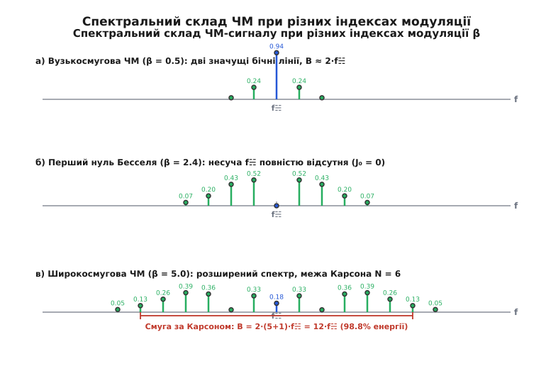
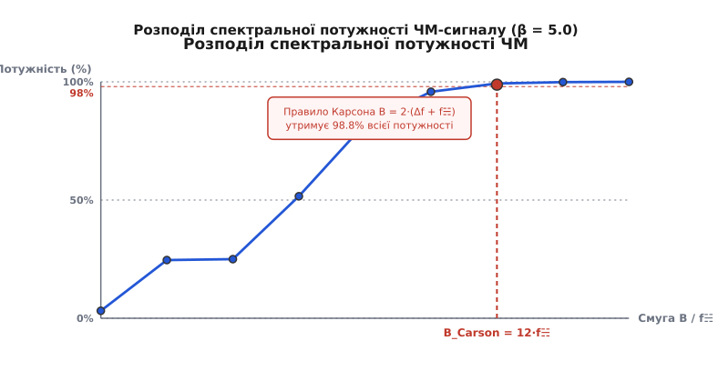
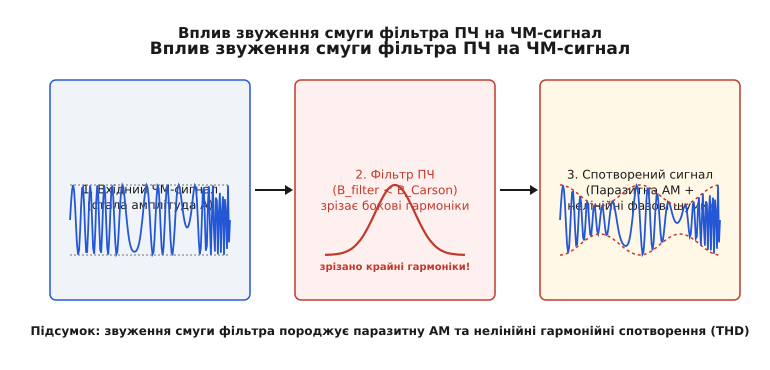

# Правило Карсона і спектр ЧМ

<preknowlist>
- [Навіщо потрібна модуляція](book:communications/why-modulation) — перенесення низькочастотного інформаційного сигналу на високочастотну несучу.
- [Основи AM і FM](book:communications/am-fm) — концепції девіації частоти, миттєвої частоти та індексу модуляції.
</preknowlist>

Коли інформацію накладають на амплітуду високочастотного сигналу, ширина спектра виходить абсолютно прозорою: одна модулююча частота породжує рівно дві бічні лінії, розташовані симетрично обабіч несучої. Якщо ж інформацією гойдати миттєву частоту або фазу, лінійне множення зникає. Зміна частоти у часі означає, що фаза сигналу стає нелінійною функцією повільного повідомлення, а синусоїда від нелінійного аргументу породжує нескінченний ряд гармонік.

Будь-який частотно-модульований (ЧМ) сигнал теоретично має **нескінченну ширину спектра**. Проте у реальному ефірі радіочастотний спектр є обмеженим ресурсом, а приймальні приймачі містять смугові фільтри з скінченною смугою пропускання. Постає критичне інженерне питання: яку саме смугу частот необхідно виділити під ЧМ-сигнал, щоб передати інформацію з нехтовно малими спотвореннями, і скільки енергії можна безболісно зрізати на краях?

Відповідь дає **правило Карсона** (*Carson's bandwidth rule*) — емпірично знайдений та математично обґрунтований критерій, який визначає практичну ширину смуги ЧМ-сигналу, що містить понад 98% усієї його спектральної потужності.

---

### Парадокс нескінченного спектра

Амплітудна модуляція гармонійним тоном частотою `f☵` створює у спектрі три чіткі лінії: саму несучу `f⒒` та дві бічні смуги `f⒒ − f☵` й `f⒒ + f☵`. Смуга сигналу дорівнює строго `2·f☵`. Здавалося б, якщо в ЧМ частота відхиляється від центрального значення `f⒒` на величину девіації `Δf`, то спектр має просто заповнити інтервал від `f⒒ − Δf` до `f⒒ + Δf`, не виходячи за його межі.

Це уявлення є абсолютно помилковим. Причина полягає у фізиці частотної модуляції: миттєва частота є похідною від повної фази сигналу. Коли ми змінюємо частоту за гармонічним законом, сама фаза `φ(t)` змінюється за інтегралом від цього закону:

```
s(t) = A · cos[ 2π·f⒒·t + β·sin(2π·f☵·t) ]
```

де `β = Δf / f☵` — **індекс модуляції** (*modulation index*), який показує відношення максимального відхилення частоти `Δf` до частоти модулюючого сигналу `f☵`.

Розкриття косинуса від синусоїдального аргументу через тригонометричні тотожності дає суму нескінченного числа бічних складових. Спектр ЧМ-сигналу складається з центральної несучої на частоті `f⒒` та нескінченної кількості пар бічних частот, рознесених від несучої на гармоніки модулюючої частоти:

```
спектральні лінії : ... | f⒒ - 3f☵ | f⒒ - 2f☵ | f⒒ - f☵ | f⒒ | f⒒ + f☵ | f⒒ + 2f☵ | f⒒ + 3f☵ | ...
```

Хоча теоретично лінії простягаються до нескінченності в обидва боки, їхня амплітуда швидко спадає зі віддаленням від центральної частоти. Швидкість цього спадання залежить від значення індексу модуляції `β`.

📜 [«Суперечка Карсона й Армстронга: як викривлена математика затримала ЧМ на десятиліття»](book:communications/carson-rule/hist-carson-armstrong.md) детально описує, як у 1920-х роках видатний математик Джон Карсон помилково вирішив, що через розростання бічних смуг ЧМ є неефективною і марнотратною, і як Едвін Армстронг через 13 років довів протилежне.

---

### Математичний портрет: функції Бесселя й нулі несучої

Амплітуду кожної спектральної лінії ЧМ-сигналу задають **функції Бесселя першого роду `n`-го порядку** від індексу модуляції `Jₙ(β)`:

```
s(t) = A · ∑ [ Jₙ(β) · cos(2π·(f⒒ + n·f☵)·t) ]   для n від -∞ до +∞
```

Кожна пара бічних складових на частотах `f⒒ ± n·f☵` має амплітуду, пропорційну `|Jₙ(β)|`. При цьому парні гармоніки симетричні (`J₋ₙ(β) = Jₙ(β)`), а непарні — антисиметричні (`J₋ₙ(β) = -Jₙ(β)`).


*Спектр ЧМ-сигналу при різних індексах модуляції `β`. При `β = 0.5` (вузькосмугова ЧМ) значущою є лише перша пара бічних ліній. При `β = 2.4` амплітуда центральної несучої провалиться у нуль (`J₀(2.4) = 0`). При `β = 5.0` (широкосмугова ЧМ) енергія роззосереджується між багатьма бічними смугами.*

Ключова властивість значень `Jₙ(β)` полягає у збереженні повної потужності сигналу. Оскільки амплітуда ЧМ-сигналу у часі лишається суворо сталою (`A`), загальна потужність сигналу дорівнює `P_total = A² / 2`. Математично це виражається тотожністю:

```
∑ [ Jₙ²(β) ] = 1   (для всіх n від -∞ до +∞)
```

Зміна індексу модуляції `β` лише перерозподіляє енергію між центральною несучою та бічними смугами, не змінюючи загальну потужність передавача.

Особливий практичний інтерес становить поведінка амплітуди центральної несучої `J₀(β)`. При певних значеннях `β` функція `J₀(β)` перетинає нуль:

```
J₀(β) = 0  при  β ≈ 2.4048,  5.5201,  8.6537,  11.7915, ...
```

Ці точки називаються **першими нулями Бесселя** (*Bessel nulls*). У мить, коли індекс модуляції дорівнює `β = 2.405`, вся енергія несучої повністю переходить у бічні смуги, а лінія на частоті `f⒒` на аналізаторі спектра зникає.

> 🔧 **Навіщо це.** Ефект зникаючої несучої є основним лабораторним методом точного калібрування девіації частоти ЧМ-передавачів. Подаючи на модулюючий вхід тон відомої частоти `f☵` (наприклад, 10 кГц) і плавно збільшуючи його напругу, спостерігають спектр на SDR або аналізаторі. Мить, коли центральний пік `f⒒` провалюється до нуля, відповідає суворо `β = 2.4048`. Це дає змогу виміряти точну девіацію `Δf = 2.4048 · 10 кГц = 24.048 кГц` без використання складних цифрових демодуляторів.

Детальний математичний вивід тотожностей Бесселя та аналіз залишкової енергії винесено у 🧮 [«Математика спектра ЧМ: функції Бесселя та енергія бічних смуг»](book:communications/carson-rule/math-bessel-expansion.md).

---

### Анатомія правила Карсона: від NFM до WFM

Оскільки спектр ЧМ нескінченний, передавати всі бічні лінії неможливо й недоцільно. Потрібно обрізати спектр так, щоб залишити його найважливішу частину. Джон Карсон виявив, що амплітуда бічних ліній `Jₙ(β)` починає дуже швидко прямувати до нуля, як тільки номер гармоніки `n` перевищує величину `(β + 1)`.

На основі цього спостереження було сформульовано **правило Карсона**: ширину смуги частот `B`, необхідну для передавання ЧМ-сигналу, можна оцінити як:

```
B ≈ 2 · (Δf + f☵) = 2 · f☵ · (β + 1)
```

де:
- `Δf` — пикова девіація частоти (максимальне відхилення миттєвої частоти від несучої);
- `f☵` — найвища частота модулюючого спектра (або частота модулюючого тону);
- `β = Δf / f☵` — індекс модуляції.

Щоб зрозуміти глибоку фізичну суть цієї формули, розберемо її поведінку в двох крайніх режимах роботи частотної модуляції:

#### 1. Вузькосмугова ЧМ (Narrowband FM, NFM: β ≪ 1)

Коли девіація частоти значно менша за частоту повідомлення (`Δf ≪ f☵`), індекс модуляції прямує до нуля (`β ≪ 1`). У цьому випадку `β + 1 ≈ 1`, і формула Карсона дає:

```
B_NFM ≈ 2 · f☵
```

При малих `β` значення `J₀(β) ≈ 1`, `J₁(β) ≈ β/2`, а амплітуди вищих гармонік `J₂`, `J₃` є знехтувально малими. Спектр NFM складається лише з несучої та однієї пари бічних смуг `f⒒ ± f☵` — точно так само, як і в AM! Різниця полягає лише у фазі бічних складових, яка забезпечує постійність амплітуди огинаючої. Вузькосмугова ЧМ займає таку ж смугу, як і АМ, але не дає виграшу у завадостійкості.

#### 2. Широкосмугова ЧМ (Wideband FM, WFM: β ≫ 1)

Коли девіація частоти значно перевищує модулюючу частоту (`Δf ≫ f☵`), індекс модуляції стає великим (`β ≫ 1`). У цьому випадку доданок `1` у дужках `(β + 1)` стає несуттєвим, і формула Карсона спрощується до:

```
B_WFM ≈ 2 · Δf
```

Фізично це означає, що при великому індексі модуляції спектр сигналу практично повністю визначається діапазоном, у якому фізично «хитається» миттєва частота від `f⒒ − Δf` до `f⒒ + Δf`. 

#### Спектральний місток: навіщо потрібен доданок "+1"?

Доданок `+1` у дужці `(β + 1)` слугує плавною змичкою між NFM та WFM. Для помірних індексів модуляції (`β` від `1` до `5`) енергія сигналу вже розливається за межі девіації `±Δf`. Додавання величини `2·f☵` до діапазону девіації `2·Δf` враховує той факт, що остання значуща спектральна лінія «виплескується» за межею девіації ще на одну додаткову частоту модулюючого сигналу `f☵`.


*Накопичення спектральної потужності ЧМ-сигналу при розширенні смуги. Вертикальна пунктирна лінія показує ширину смуги, обчислену за правилом Карсона `B = 2·(Δf + f☵)`. Вона охоплює від 98% до 99% всієї енергії сигналу.*

Правило Карсона є чудовим компромісом: відсікання смуги на рівні `B = 2·(Δf + f☵)` гарантує, що усередині фільтра приймача залишається **від 98% до 98.7% всієї потужності сигналу**. Втрата 1.3–2% енергії, яка припадає на хвости Бесселя поза смугою, створює лише мінімальні, практично непомітні нелінійні спотворення відновленого звуку.

---

### Обчислений приклад розрахунку смуги каналу

**Розрахунок смуги ЧМ-передавача рації з субтонами CTCSS:**

Нехай службовий ЧМ-передавач передає мову з верхньою частотою `f_speech = 3000 Гц` та піковою девіацією `Δf_speech = 2.5 кГц`. Додатково у спектр підмішується субаудіальний тон CTCSS з частотою `f_ctcss = 150 Гц` та девіацією `Δf_ctcss = 0.5 кГц`.

Розрахуємо сумарні параметри сигналу:

```
Δf_total = Δf_speech + Δf_ctcss = 2.5 кГц + 0.5 кГц = 3.0 кГц     [підсумовування пікових девіацій складових]
f_max = 3000 Гц = 3.0 кГц                                          [визначення найвищої частоти спектра]
β_p = Δf_total / f_max = 3.0 кГц / 3.0 кГц = 1.0                   [обчислення пікового індексу модуляції]
B_total = 2 · (Δf_total + f_max) = 2 · (3.0 кГц + 3.0 кГц) = 12 кГц [розрахунок смуги за Карсоном]
```

**Висновок:** Для передавання мови разом з субтоном CTCSS потрібна смуга **12 кГц**. У стандартній сітці каналів 12.5 кГц такий сигнал розміщується з захисним інтервалом 0.5 кГц.

---

### Правило Карсона для складних та випадкових сигналів

У реальних радіосистемах модулюючий сигнал рідко є чистим одноголосим тоном. Мова, музика або цифровий потік даних утворюють складний неперервний спектр. Для обчислення смуги частот складного сигналу правило Карсона модифікується.

Замість частоти одиночного тону `f☵` підставляють **найвищу частоту модулюючого спектра `f_max`**, а замість однотонової девіації — **пікову девіацію `Δf_peak`**:

```
B_complex = 2 · (Δf_peak + f_max) = 2 · f_max · (β_p + 1)
```

де `β_p = Δf_peak / f_max` — піковий індекс модуляції.

Для випадкових звукових сигналів (мова або симфонічна музика) амплітуда має високий **крест-фактор** (*crest factor* `CF ≈ 3.5 ... 4`): пікова напруга значно перевищує середньоквадратичну (RMS). Якщо розраховувати девіацію за середньою потужністю звуку, пікові сплески голосу викликатимуть перемодуляцію та вихід сигналу за виділену смугу.

Міжнародний консультативний комітет з радіозв'язку (ITU-R SM.853) рекомендує для мультитональних та мовних ЧМ-передавачів обчислювати пікову девіацію як:

```
Δf_peak = g · Δf_rms
```

де `g` — пік-фактор сигнальної пікової амплітуди (зазвичай `g = 3.5 ... 4.0`), а `Δf_rms` — середньоквадратичне відхилення частоти. 

У цифрових системах частотної маніпуляції (FSK / GFSK), де біти даних формуються прямокутними імпульсами зі швидкістю `R_b` біт/с, найвища частота першої гармоніки дорівнює `f_max = R_b / 2`. Тоді формула Карсона для цифрової FSK набуває вигляду:

```
B_FSK = 2 · Δf + R_b
```

Ця формула є базовим стандартом для розрахунку смуги каналів у протоколах Bluetooth (GFSK, `Δf = 160 кГц`, `R_b = 1 Мбіт/с` → `B ≈ 1.32 МГц`), LoRa та 2-FSK/4-FSK у транкінговому радіозв'язку APCO-25 та DMR.

---

### Особливості смуги при фазовій модуляції (ФМ / PM)

Частотна та фазова модуляція є найближчими родичами, об'єднаними спільною назвою **кутова модуляція** (*angle modulation*). Втім, між ними є принципова відмінність у поведінці девіації та спектральної смуги.

У частотній модуляції (ЧМ / FM) девіація частоти `Δf` фіксована й не залежить від частоти звуку `f☵`. Тому індекс модуляції спадає з ростом частоти: `β(f☵) = Δf / f☵`.

У фазовій модуляції (ФМ / PM) сталою є девіація фази `Δφ` (в радіанах). Зв'язок між миттєвою девіацією частоти та девіацією фази визначається похідною:

```
Δf(f☵) = Δφ · f☵
```

Підставляючи це значення в правило Карсона, отримуємо смугу для фазової модуляції:

```
B_PM = 2 · (Δφ · f_max + f_max) = 2 · f_max · (Δφ + 1)
```

Звідси випливає важливий практичний висновок: у фазовій модуляції ширина смуги `B_PM` зростає **прямо пропорційно найвищій модулюючій частоті `f_max`**, оскільки девіація частоти автоматично збільшується на верхніх звукових частотах.

---

### Вплив преакцентуації (Pre-emphasis) на практичний спектр

У реальних аналогових вещательных FM-передавачах застосовують спеціальну обробку аудіосигналу — **преакцентуацію** (*pre-emphasis*). Спектр природної музики та мови містить основну енергію на низьких частотах (до 1 кГц), тоді як високочастотні складові (8–15 кГц) мають дуже малу амплітуду. Проте шум в FM-демодуляторі має так званий **трикутний спектральний розподіл**: спектральна щільність шуму зростає лінійно з підвищенням частоти звуку (`N(f) ∝ f²`).

Щоб захистити високочастотні деталі звуку від трикутного шуму, на передавачі встановлюють дифренціюючий аналоговий RC-фільтр, який підсилює високі аудіочастоти зі швидкістю +6 дБ на октаву, починаючи з частоти зрізу `f_c = 1 / (2π · τ)`.
- В Європі та Україні використовується стала часу `τ = 50 мкс` (`f_c ≈ 3.18 кГц`).
- У Північній Америці та Японії — `τ = 75 мкс` (`f_c ≈ 2.12 кГц`).

У приймачі стоїть дзеркальний інтегруючий фільтр **деакцентуації** (*de-emphasis*), який відновлює природний баланс звуку і водночас подавляє високочастотний шум приймача на 10–13 дБ.

**Зв'язок преакцентуації з правилом Карсона:**
Підсилення високочастотних складових аудіосигналу фільтром преакцентуації призводить до того, що на частотах `f` близьких до `f_max = 15 кГц` девіація частоти стає більшою, ніж вона була б без обробки. Завдяки цьому девіація на частоті 15 кГц досягає значень `Δf = 75 кГц`, що забезпечує збереження високого індексу модуляції `β = 5` по всьому звуковому діапазону та вимагає повного дотримання смуги Карсона `B = 180 кГц`.

---

### Практичний спектральний бюджет у стандартах зв'язку

Розглянемо, як правило Карсона диктує параметри реальних систем радіозв'язку та формує сітку частотних каналів.

**Обчислення смуги для вещательного FM-радіо та професійного раційного зв'язку:**

**Приклад 1: Аналогове комерційне FM-радіомовлення (87.5–108 МГц)**
Стандарт передбачає максимальну девіацію частоти `Δf = 75 кГц` та найвищу звукову частоту аудіосигналу `f☵ = 15 кГц`.
Обчислимо індекс модуляції та смугу Карсона:

```
β = Δf / f☵ = 75 кГц / 15 кГц = 5.0
B = 2 · (Δf + f☵) = 2 · (75 кГц + 15 кГц) = 2 · 90 кГц = 180 кГц
```

Правило Карсона показує, що для якісного прийому музики необхідна смуга **180 кГц**. Саме тому міжнародний стандарт виділяє під один FM-канал сітку з кроком **200 кГц** (що залишає по 10 кГц захисних інтервалів обабіч для запобігання міжканальним завадам).

**Приклад 2: Вузькосмугова рація PMR446 / VHF Marine**
Для передачі мови в службовому раційному зв'язку вимоги до якості звуку скромніші: верхня межа мовного спектра обмежується фільтром до `f☵ = 3 кГц`, а максимальна девіація становить `Δf = 2.5 кГц`.
Обчислимо індекс модуляції та смугу Карсона:

```
β = Δf / f☵ = 2.5 кГц / 3 кГц ≈ 0.833
B = 2 · (Δf + f☵) = 2 · (2.5 кГц + 3 кГц) = 2 · 5.5 кГц = 11 кГц
```

Смуга Карсона становить **11 кГц**, що ідеально вміщується у стандартну сітку каналів з кроком **12.5 кГц** (або 25 кГц для застарілих систем з `Δf = 5 кГц`).

---

### Що стається при завузькому фільтрі: FM-to-AM перетворення й інтерференція

У приймачі ЧМ-сигналу після підсилювача високої частоти стоїть фільтр проміжної частоти (ПЧ). Якщо інженер помилиться і обере смугу фільтра ПЧ `B_filter` вужчою, ніж вимагає правило Карсона (`B_filter < 2·(Δf + f☵)`), виникне ланцюг деструктивних фізичних явищ.


*Фізичні наслідки нерозважливого обмеження смуги ЧМ-сигналу. Зліва: вхідний ЧМ-сигнал зі сталою амплітудою. У центрі: смуговий фільтр, який зрізає зовнійшні бічні гармоніки. Справа: вихідний сигнал дістає паразитну амплітудну модуляцію (пульсації огинаючої) та нелінійні фазові спотворення.*

Коли фільтр ПЧ обрізає бічні гармоніки Бесселя вище певного порядку, баланс між гармоніками руйнується. Це призводить до трьох основних типів спотворень:

1. **Паразитна амплітудна модуляція (FM-to-AM conversion):**
   Оскільки стала амплітуда ЧМ-сигналу забезпечується лише суворим математичним балансом усього нескінченного ряду Бесселя, вилучення крайніх бокових ліній призводить до того, що огинаюча сигналу починає пульсувати з частотою модулюючого звуку. Якщо у приймачі стоїть якісний обмежувач амплітуди (*limiter*), він зріже ці пульсації, але ціною викривлення фази.

2. **Нелінійні гармонійні спотворення демодульованого звуку (THD) та групової затримки:**
   Частотний демодулятор (дискримінатор або PLL) перетворює миттєву частоту на напругу. Відсікання бічних смуг та нерівномірність групової затримки фільтра ПЧ `τ_g = -dφ/dω` призводять до того, що відновлений аудіосигнал дістає сильні нелінійні спотворення (з'являються 3-тя та 5-та гармоніки звукової частоти). Звук стає хрипким, «брудним» та втрачає розбірливість. Для запобігання фазовим спотворення у якісних FM-приймачах використовують смугові фільтри Гаусса або Бесселя з максимально пласкою характеристикою групової затримки.

3. **Міжсимвольна інтерференція (ISI) у цифрових ЧМ-системах (FSK/GFSK):**
   При передачі цифрових даних частотною маніпуляцією (наприклад, у Bluetooth або LoRa) звуження фільтра нижче смуги Карсона призводить до затягування фронтів частотних переходів. Біти даних починають наповзати один на одного, підвищуючи коефіцієнт бітових помилок (BER).

З іншого боку, робити фільтр ПЧ **занадто широким** (`B_filter ≫ 2·(Δf + f☵)`) також небезпечно: надлишкова смуга пропускання у тракт приймача зайвий тепловий шум та завади від сусідніх радіостанцій, знижуючи реальну чутливість радіоприймача.

---

### Завади у суміжних каналах (ACPR / ACLR) та спектральні маски

При розробці комерційних передавачів дотримання правила Карсона є лише першим кроком. Другим кроком є забезпечення суворих норм на рівень випромінювання у сусідніх частотних каналах.

У радіотехніці параметр **ACPR** (*Adjacent Channel Power Ratio*) або **ACLR** (*Adjacent Channel Leakage Ratio*) визначає відношення потужності, яка проростає у сусідній канал, до потужності у своєму каналі `B_Carson`:

```
ACPR = 10 · log10( P_adjacent / P_main )  [дБc]
```

Оскільки вищі гармоніки Бесселя `Jₙ(β)` при `n > β + 1` спадають швидко, але не миттєво, для передавачів високої потужності (1–50 кВт) залишковий хвіст спектра може перевищувати дозволені норми FCC / ETSI (наприклад, `-60 дБc` у сусідньому каналі).

Для пригнічення спектральних хвостів використовують такі методи:
- **Префільтрація модулюючого звуку:** Встановлення низькочастотного фільтра (Low Pass Filter, LPF) з гострим зрізом на 15 кГц, який повністю зрізає гармоніки вище `f_max`.
- **Гауссівська фільтрація у цифрових системах (GFSK):** Проходження прямокутних бітів даних через гауссівський фільтр з параметром `BT = 0.3 ... 0.5` перед модоювання частоти плавно закруглює фронти імпульсів. Це зрізає бічні спектральні пелюстки на 30–40 дБ за межею Карсона, створюючи надзвичайно компактний спектр.

---

### Квадратурне представлення (IQ) та аналіз на аналізаторі спектра

У сучасній цифрової обробці сигналів (DSP) та програмно-визначених радіосистемах (SDR) ЧМ-сигнал подається у вигляді комплексного квадратурного вектора (IQ-сигнал):

```
s(t) = I(t) + j · Q(t)
```

де квадратурні складові дорівнюють:
- `I(t) = A · cos( φ(t) )` — квадратний (In-phase) канал;
- `Q(t) = A · sin( φ(t) )` — фазовий (Quadrature) канал;
- `φ(t) = β · sin(2π·f☵·t)` — миттєве відхилення фази.

Спектр комплексної огинаючої `I(t) + j·Q(t)` розташований симетрично відносно нульової частоти (Zero-IF / Baseband). Для вимірювання ширини смуги на аналізаторі спектра використовують два стандартних критерії:

1. **Критерій утримання потужності (Occupied Bandwidth, OBW):**
   Вимірювальний прилад обчислює інтеграл спектральної щільності потужності й визначає частотну смугу, у якій міститься суворо **99.0%** (або 98.0%) від загальної потужності випромінювання.
2. **Критерій витоку в сусідній канал (Adjacent Channel Power Ratio, ACPR):**
   Оцінюється відношення потужності випромінювання, що потрапляє у виділений канал `B_Carson`, до потужності завади, яка проростає у сусідній частотний канал за рахунок нелінійностей підсилювача потужності (PA).

---

### Чисельне моделювання та вимірювання на аналізаторі

Щоб переконатися у справедливості правила Карсона на практиці, можна провести чисельний розрахунок спектра ЧМ-сигналу та оцінити інтегральну енергію бічних складових.

У практичному модулі ⚙️ [«Моделювання спектра ЧМ та оцінка смуги за Карсоном»](book:communications/carson-rule/proj-carson-spectrum-sim.md) наведено вихідний код C та C++, який реалізує цифровий синтез ЧМ-сигналу, дискретне перетворення Фур’є (FFT) та підрахунок частки потужності в межах смуги Карсона для різних індексів модуляції `β`.

Моделювання показує такі результати співвідношення між індексом `β`, смугою Карсона та вмістом енергії:

```
Індекс β | Смуга Карсона (в одиницях f☵) | Частка енергії у смузі Карсона
-----------------------------------------------------------------------
  0.5    | 2 · (0.5 + 1) = 3.0           | 99.8%  (NFM режим)
  1.0    | 2 · (1.0 + 1) = 4.0           | 99.3%
  2.4    | 2 · (2.4 + 1) = 6.8           | 98.4%  (Перший нуль несучої)
  5.0    | 2 · (5.0 + 1) = 12.0          | 98.8%  (WFM вещательний)
 10.0    | 2 · (10.0 + 1) = 22.0         | 98.9%  (Глибока WFM)
```

Як видно з чисельного розрахунку, для будь-яких значень `β` від 0.5 до 10 правило Карсона стабільно утримує **понад 98% всієї потужності** ЧМ-сигналу.

> 🔧 **Навіщо це.** Під час проективання цифрових трансіверів на базі SDR (Software Defined Radio), таких як HackRF, RTL-SDR або мікросхем SX1276/CC1101, ширина цифрового фільтра ДПФ (FIR/IIR) в цифровому процесорі сигналів (DSP) виставляється строго за формулою Карсона. Це дозволяє досягти максимуму співвідношення сигнал/шум (SNR) при відсутності спотворень демодульованого кадру.

Правило Карсона є фундаментальним містком між абстрактною математикою Бесселя та практичним розрахунком смуги частот. Вона звільняє інженера від необхідності підсумовувати нескінченні ряди, даючи одну просту, але дивовижно точну формулу: додаи девіацію до максимальної частоти звуку і подвой результат.
