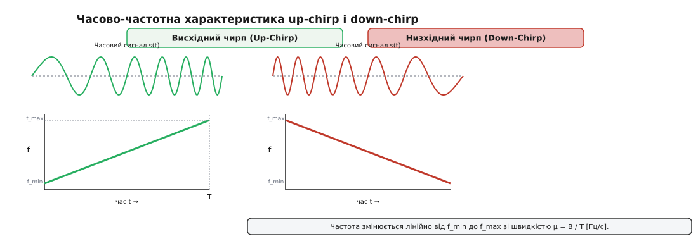
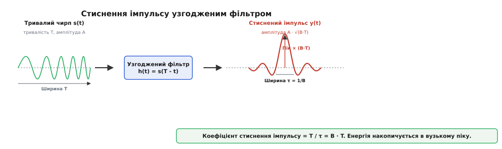
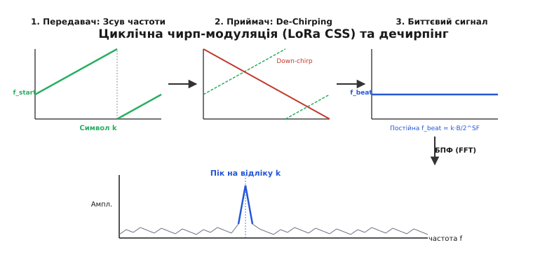
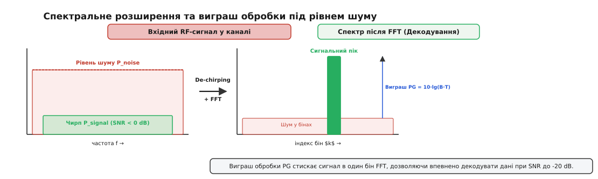

# Чирп-модуляція (CSS) і розширення спектра

<preknowlist>
- [Розширений спектр](book:communications/spread-spectrum) — розмазування сигналу по широкій смузі для підвищення завадостійкості.
- [AM і FM](book:communications/am-fm) — частотна модуляція як згладжена зміна миттєвої частоти несучої.
- [AWGN-канал](book:communications/awgn-channel) — гаусів шум та відношення сигнал/шум (SNR).
</preknowlist>

Коли радіопередавач автономного датчика з батарейним живленням випромінює короткий прямокутний імпульс потужністю 10 мВт, енергія сигналу на відстані кількох кілометрів повністю губиться у фоновому тепловому шумі приймача. Згідно із формулою Фрііса, згасання радіохвиль у вільному просторі пропорційне квадрату відстані й частоти, тому на частоті 868 МГц затухання траси на відстані 10 км становить близько 111 dB. Проста спроба збільшити тривалість прямокутного імпульсу в тисячу разів накопичує необхідну енергію, але звужує спектральну смугу сигналу до кількох герц. Це робить зв'язок надзвичайно вразливим: найменший доплерівський зсув частоти від руху пристрою або температурний дрейф опорного кварцового резонатора на якісь 5 ppm (мільйонних часток) повністю зміщують спектр сигналу за межі вузькосмугового приймального фільтра. Чирп-модуляція (Chirp Spread Spectrum, CSS) розриває жорсткий зв'язок між тривалістю сигналу, його спектральною смугою та піковою потужністю: вона розтягує сигнал у часі, одночасно безперервно змінюючи його частоту за лінійним законом.

## Механізм лінійної частотної модуляції

Основною цеглиною чирп-модуляції є сигнал із лінійною частотною модуляцією (ЛЧМ, англ. *Linear Frequency Modulation*, LFM), який у радіотехніці за аналогією до пташиного щебетання називають чирпом (англ. *chirp*). На відміну від класичної аналогової частотної модуляції (FM), де частота несучої змінюється відповідно до інформаційного звукового сигналу, або дискретної частотної маніпуляції (FSK), де частота скачкоподібно змінюється між зафіксованими позиціями, у чирпі частота змінюється строго безперервно й лінійно від початкового значення до кінцевого протягом кожного символьного інтервалу `T`.

Якщо миттєва частота зростає від мінімальної `f_min` до максимальної `f_max = f_min + B`, такий сигнал називають висхідним чирпом (Up-Chirp). Якщо частота лінійно спадає від `f_max` до `f_min`, сигнал називають низхідним чирпом (Down-Chirp). Швидкість зміни частоти називають чирп-рейтом (абсолютною фазовою прискореністю) і позначають грецькою літерою `μ` (вимірюється в герцах за секунду):

```
μ = B / T
```

де `B` — ширина спектральної смуги розгортки (Гц), а `T` — тривалість одного чирп-символу (секунди).

Математично миттєва фаза `φ(t)` висхідного чирпа є квадратичною функцією часу. Це випливає з фундаментального співвідношення між фазою та частотою: миттєва колова частота `ω(t)` є першою похідною від фази за часом (`ω(t) = dφ/dt`). Інтегрування лінійної функції миттєвої частоти `f(t) = f_0 + μ · t` дає в показнику квадратичний член часу:

```
φ(t) = 2 · π · f_0 · t + π · μ · t²
```

Комплексний радіосигнал на часовому інтервалі `t ∈ [0, T]` описується гармонійним коливанням із постійною амплітудою `A`:

```
s(t) = A · cos(2 · π · f_0 · t + π · (B / T) · t²)
```


*Часова хвильова форма та спектрограма миттєвої частоти для висхідного (Up-Chirp) і низхідного (Down-Chirp) сигналів. За час T частота долає смугу B.*

Головною фундаментальною характеристикою чирпа є **часово-частотний добуток** (Time-Bandwidth Product, TBP), який позначають літерою `D`:

```
D = B · T
```

У традиційних безмодуляційних імпульсах або простих фазомодульованих сигналах (PSK) смуга частот обернено пропорційна тривалості імпульсу (`B ≈ 1 / T`), тому їхній часово-частотний добуток завжди близький до одиниці (`D ≈ 1`). У чирп-сигналах смуга `B` та тривалість `T` обираються незалежно, завдяки чому значення `D` досягає сотень і тисяч одиниць (`D >> 1`). Саме цей приріст часово-частотного добутку забезпечує розширення спектра та формує виражений енергетичний виграш при прийомі.

### Порівняння CSS з іншими методами розширення спектра

Розширення спектра може виконуватися різними способами, і порівняння CSS із традиційними методами DSSS та FHSS розкриває його принципові апаратні переваги:

- **Пряме розширення послідовністю (DSSS):** Вузькосмуговий сигнал множиться на високошвидкісну псевдовипадкову кодову послідовність (PN-код Пломба або Ґолда). Приймач повинен з високою точністю синхронізувати фазу локального генератора PN-коду з точністю до частки чіпа. Це вимагає складних схем слідкування за затримкою (DLL) та значних енерговитрат.
- **Стрибкоподібна перебудова частоти (FHSS):** Несуча частота сигналу дискретно перестрибує з одного каналу на інший за псевдовипадковим законом. FHSS вимагає швидких синтезаторів частоти (PLL) із коротким часом встановлення, що ускладнює проектирування радіочастотної частини.
- **Чирп-розширення спектра (CSS):** Зміна частоти відбувається безперервно всередині одного імпульсу. Приймачу не потрібна складна процедура пошуку фази PN-коду або швидка перебудова синтезатора — демодуляція виконується обчисленням одного БПФ (FFT) після дечирпінгу.

## Узгоджена фільтрація та стиснення імпульсу

Перевага використання сигналів із великим значенням `D = B · T` проявляється на приймальній стороні при проходженні через **узгоджений фільтр** (англ. *Matched Filter*). Імпульсна характеристика узгодженого фільтра `h(t)` являє собою часово-перевернуту та комплексно-спряжену копію переданого чирпа:

```
h(t) = s(T - t)
```

Оскільки різні частотні компоненти вхідного чирпа заходять у фільтр послідовно (спочатку низькі частоти `f_min`, потім високі `f_max`), внутрішня затримка узгодженого фільтра влаштована так, що низькочастотні компоненти затримуються на більший час, ніж високочастотні. У результаті всі частотні складові імпульсу тривалістю `T` накопичуються й виходять із фільтра одночасно в один і той самий момент часу.

Відбувається фізичний ефект **стиснення імпульсу** (англ. *pulse compression*). На виході узгодженого фільтра замість тривалого чирпа тривалістю `T` утворюється вузький, високий сплеск, обволіка якого описується математичною функцією `sinc`:

```
y(t) = A · (B · T) · sinc(π · B · t)
```


*Проходження тривалого малопотужного чирпа через узгоджений фільтр: енергія сигналу накопичується в часі й стискається у вузький пік із пропорційним зростанням амплітуди.*

Математичний вивід форми стисненого імпульсу, ширини головної пелюстки та пікового виграшу наведено у вставці 🧮 [Математика стиснення імпульсів і виграшу обробки](book:communications/chirp-coding/math-pulse-compression.md).

Стиснення імпульсу забезпечує два вирішальні ефекти:
1. **Часове стиснення:** Ширина головного піку за рівнем нулів становить `τ = 1 / B`. Відношення початкової тривалості імпульсу до тривалості стисненого піку дорівнює коефіцієнту стиснення `T / τ = B · T`.
2. **Амплітудне посилення:** Оскільки вся енергія чирпа `E = P_in · T` концентрується на короткому часовому інтервалі `1 / B`, пікова потужність вихідного сигналу зростає в `B · T` разів.

Перша бічна пелюстка чистої функції `sinc` лежить на рівні `-13.2 dB` відносно центрального максимуму. У реальних системах для додаткового придушення бічних пелюсток застосовують зважувальні частотні вікна (Хеммінга або Ганна), що знижує бічні пелюстки до `-43 dB` ціною незначного розширення головного піку (приблизно на 40%) та зменшення пікової амплітуди на 1.34 dB.

Історично цей ефект стиснення був розроблений у 1950-х роках для військових радіолокаторів, що детально описано у вставці 📜 [Від імпульсних радарів 1950-х до протоколу LoRa: еволюція чирпа](book:communications/chirp-coding/hist-radar-to-lora.md). Однак для передачі цифрової інформації одного лише стиснення неохопленого імпульсу недостатньо — необхідно накласти на чирп інформаційне кодування.

## Кодування даних циклічними чирпами (CSS у LoRa)

У класичних бінарних схемах CSS двійкова одиниця передається висхідним чирпом, а нуль — низхідним. Така схема проста, але забезпечує низьку спектральну ефективність: один чирп тривалістю `T` переносить лише 1 біт інформації.

Сучасна технологія розширення спектра чирпами, відома як **Cyclic Shift Chirp Modulation** (застосовується в протоколі LoRa), використовує багатопозиційне кодування. Кожен переданий чирп-символ кодує ціле число `k`, де `k ∈ [0, 2^SF - 1]`. Параметр `SF` (Spreading Factor, коефіцієнт розширення) визначає кількість бітів, що упаковуються в один символ (звичайно `SF` становить від 6 до 12 біт/символ).

Кодування виконується за допомогою **циклічного зсуву початкової частоти**:
1. Базовий неузгоджений висхідний чирп стартує з частоти `f_min` і лінійно зростає до `f_max`.
2. Для передачі символу `k` початкова частота чирпа зсувається вгору на величину `k · (B / 2^SF)`.
3. Коли частота чирпа досягає верхньої межі смуги `f_max`, вона скачкоподібно розривається й миттєво переходить на нижню межу `f_min`, після чого продовжує лінійне зростання до кінця символьного інтервалу `T`.

Завдяки циклічному розриву загальна тривалість символу `T` та випромінювана спектральна смуга `B` залишаються абсолютно незмінними для будь-якого символу `k`.

Для мінімізації бітових помилок при можливих спектральних зсувах кодові числа `k` піддаються перетворенню кодом Ґрея (Gray Mapping): сусідні символьні індекси `k` та `k + 1` відрізняються лише в одном двійковому біті. Якщо через шум пік FFT зміститься у сусідній бін, демодулятор припуститься помилки лише в 1 біті, що легко виправляється вбудованим FEC-кодер Геммінга.


*Принцип циклічної чирп-модуляції: зсув початкової частоти передавачем (ліворуч), дечирпінг множенням на опорний down-chirp (по центру) та отримання гармонійного піку в FFT (праворуч).*

Демодуляція циклічного чирпа на приймачі здійснюється за допомогою витонченого двокрокового процесу, який називається **дечирпінгом** (англ. *de-chirping*):

### Крок 1: Множення на опорний Down-Chirp

Приймач генерує власне локальне коливання — незамодульований низхідний чирп (Down-Chirp), частота якого лінійно спадає від `f_max` до `f_min`. Прийнятий сигнал `r(t)` перемножується з цим опорним чирпом у змішувачі.

Математично прийнятий циклічний чирп має нахил фази `+π · μ · t²`, а опорний down-chirp має протилежний нахил фази `-π · μ · t²`. При множенні фази додаються:

```
φ_mix(t) = (+π · μ · t²) + (-π · μ · t²) + 2 · π · f_beat · t = 2 · π · f_beat · t
```

Квадратичні члени `π · μ · t²` повністю взаємно знищуються. Замість складного ЛЧМ-сигналу зі змінною частотою утворюється простий гармонійний тон із **постійною биттєвою частотою** `f_beat`:

```
f_beat = k · (B / 2^SF)
```

### Крок 2: Дискретне перетворення Фур'є (FFT)

Биттєвий сигнал подається на аналізатор спектра — блочне Швидке Перетворення Фур'є (FFT) розміром `N = 2^SF` відліків. Оскільки биттєвий сигнал є чистою синусоїдою частоти `f_beat`, весь енергетичний потенціал сигналу концентрується строго в одному біні (відліку) FFT під номером `k`.

Приймач визначає номер біна з максимальною амплітудою спектрального модуля `|FFT[k]|` і миттєво декодує початкове значення символу `k`.

Програмну реалізацію моделі генерації, дечирпінгу та FFT-пошуку піку мовами C та C++ наведено у вставці ⚙️ [Моделювання CSS-модему: генерація, de-chirping та FFT-декодування](book:communications/chirp-coding/proj-css-sim.md).

### Анатомія фізичного кадру LoRa

Фізичний пакет радіоканалу LoRa складається з кількох функціональних зон:
1. **Преамбула (Preamble):** Послідовність із `N_pre` (зазвичай 8) однакових базових висхідних чирпів (`k = 0`). Вони слугують для автоматичного регулювання посилення (AGC), виявлення наявності кадру в ефірі та первинного захоплення часової й частотної синхронізації.
2. **Синхрослово (Sync Word / Frame Sync):** Два висхідні чирпи з унікальними циклічними зсувами, що ідентифікують тип мережі (наприклад, `0x12` для приватних мереж або `0x34` для публічних мереж LoRaWAN).
3. **Зворотно-символи (Start Frame Delimiter, SFD):** 2.25 низхідні чирпи (Down-Chirps), які сповіщають приймач про точне закінчення преамбули та початок передачі корисного навантаження.
4. **Заголовок (Header) та Корисне навантаження (Payload):** Послідовність циклічно зсунутих чирпів, кодованих кодами Геммінга або Ріда-Соломона, завершувана контрольною сумою CRC.

## Енергетичний виграш обробки та стійкість до завад

Головна причина масового застосування CSS у мережах LoRaWAN та промислових датчиках полягає в здатності впевнено декодувати дані при негативних відношеннях сигнал/шум (SNR < 0 dB), коли корисний сигнал повністю схований під рівнем теплового шуму каналу.

### Походження виграшу обробки (Processing Gain)

Виграш обробки (Processing Gain, PG) показує, наскільки відношення сигнал/шум після декодування (SNR_out) перевищує відношення сигнал/шум на радіочастотному вході приймача (SNR_in). Для циклічного чирпа з коефіцієнтом розширення `SF`:

```
PG = 10 · lg(B · T) = 10 · lg(2^SF) ≈ 3.01 · SF  [dB]
```

Залежність виграшу обробки та порогового SNR від параметра `SF` наведено в таблиці:

| Spreading Factor (SF) | Кількість відліків N (2^SF) | Виграш обробки PG (dB) | Мінімально необхідний SNR (dB) |
| :--- | :--- | :--- | :--- |
| **SF = 7** | 128 | 21.1 dB | -7.5 dB |
| **SF = 8** | 256 | 24.1 dB | -10.0 dB |
| **SF = 9** | 512 | 27.1 dB | -12.5 dB |
| **SF = 10** | 1024 | 30.1 dB | -15.0 dB |
| **SF = 11** | 2048 | 33.1 dB | -17.5 dB |
| **SF = 12** | 4096 | 36.1 dB | -20.0 dB |


*Принцип розширення та зворотного стиснення спектра: у каналі потужність сигналу нижча за шум, але дечирпінг концентрує сигнал в один бін FFT, розмазуючи шум по всіх 2^SF бінах.*

При `SF = 12` виграш обробки досягає `36.1 dB`. Довільний білий гаусів шум після дечирпінгу залишається шумом і рівномірно розподіляється по всіх 4096 бінах FFT, тому його потужність у кожному окремому біні зменшується в 4096 разів. Натомість вся енергія чирпа під час дечирпінгу підсумовується й потрапляє в один-єдиний бін `k`. У результаті спектральний пік височіє над розмазаним фоновим шумом на `16 dB` навіть тоді, коли загальна вхідна потужність шуму в каналі була в 100 разів більшою за потужність сигналу.

### Гранична чутливість приймача та шум-фактор

Гранична чутливість радіоприймача `P_rx_min` (в dBm) описується фундаментальним виразом:

```
P_rx_min = -174 + 10 · lg(B) + NF + SNR_req  [dBm]
```

де `-174 dBm/Гц` — спектральна щільність теплового шуму при кімнатній температурі (290 K), `B` — смуга частот (Гц), `NF` — коефіцієнт шуму входного LNA підсилювача (зазвичай 4–6 dB), а `SNR_req` — мінімально необхідне SNR для обраного `SF`.

Для смуги `B = 125 кГц` (`10 lg(125000) ≈ 51 dB`), `NF = 6 dB` та `SF = 12` (`SNR_req = -20 dB`):

```
P_rx_min = -174 + 51 + 6 + (-20) = -137 dBm
```

Абсолютна величина чутливості `-137 dBm` відповідає потужності сигналу близько 0.02 фемтовата (2·10⁻¹⁷ Вт), що є рекордним показником для бездротових комерційних трансиверів.

### Стійкість до ефекту Доплера, ортогональність та багатопроменевість

Крім високої чутливості, чирп-модуляція має унікальні фізичні властивості протидії викривленням реального радіоканалу:

1. **Стійкість до доплерівського зсуву:**
   Якщо передавач або приймач рухається зі швидкістю `v`, частота вхідного сигналу зміщується на величину `Δf_Dop = f_0 · (v / c)`. У звичайних фазових схемах (PSK/QAM) це призводить до швидкої втрати синхронізації та катастрофічного зростання помилок (BER).
   У чирп-сигналах зсув частоти `Δf_Dop` призводить лише до невеличкого часового зсуву стисненого піку на виході дечирпінгу:
```
Δt = Δf_Dop / μ
```
   Форма стисненого піку та його висота залишаються абсолютно незмінними. Оскільки початкова синхронізація в LoRa виконується за преамбулою зі стандартних Up-чирпів та закінчується Down-чирпами, часовий зсув легко вимірюється й компенсується в цифровому тракті.

2. **Ортогональність різних Spreading Factor:**
   Чирп-сигнали, згенеровані з різними значеннями `SF` (наприклад, SF7 та SF12) на одній і тій самій частоті, є майже квазіортогональними. При дечирпінгу сигналу SF7 за допомогою опорного down-chirp SF12 квадратичні фази не скасовуються, а утворюють новий чирп, який під час FFT розмазується по всіх бінах спектра. Це дозволяє багатоклітинним шлюзам LoRaWAN декодувати до 8 пакунків із різними SF одночасно на одному радіоканалі за допомогою матриці паралельних цифрових співпроцесорів.

3. **Стійкість до багатопроменевого згасання (Multipath Fading):**
   У міських умовах радіохвилі відбиваються від будинків, створюючи відбиті копії сигналу з різними часовими затримками `Δτ`. Для вузькосмугових систем це призводить до інтерференційного замирання сигналу.
   Для CSS-приймача відбита копія чирпа із затримкою `Δτ > 1 / B` після дечирпінгу перетворюється на окрему тональну синусоїду іншої частоти. У спектрі FFT вона створює другий, менший пік у сусідньому біні, який не перекривається з основним сигнальним піком і не руйнує декодування.

4. **Стійкість до вузькосмугових завад (Narrowband Interference):**
   Якщо в смузі `B` присутня потужна завада на фіксованій частоті `f_jam`, дечирпінг перетворює її на чирп протилежного напрямку. Під час FFT ця завада розмазується по всіх `2^SF` бінах тонким рівномірним шаром, додаючи лише незначний шум і не здатна перекрити високий сигнальний пік.

## Практичний вибір параметрів і границі застосування

При проектируванні систем зв'язку на основі CSS інженер балансує між трьома основними параметрами: шириною смуги `B`, коефіцієнтом розширення `SF` та швидкістю кодування `CR` (Coding Rate).

Тривалість передачі одного чирп-символу `T_sym` дорівнює:

```
T_sym = 2^SF / B
```

Корисна швидкість передачі даних (Data Rate, `R_b`) без урахування службових заголовків обчислюється як:

```
R_b = SF · (1 / T_sym) · CR = SF · (B / 2^SF) · (4 / (4 + CR_val))  [біт/с]
```

де `CR_val ∈ {1, 2, 3, 4}` відповідає виправленню помилок кодами Ріда-Соломона (від 4/5 до 4/8).

### Мережева архітектура та адаптивна швидкість даних (ADR)

У реальних мережах LoRaWAN сотні автономних кінцевих вузлів (End-Nodes) взаємодіяють із базовими станціями (Gateways), які пересилають демодульовані пакунки на центральний мережевий сервер (Network Server):

- **Шлюз (Gateway):** Використовує апаратні багатоканальні трансивери (наприклад, Semtech SX1301 / SX1302), здатні оцифровувати смугу 1 МГц і паралельно обчислювати БПФ для 8 радіоканалів та всіх значень `SF` від 7 до 12.
- **Шифрування корисного навантаження:** На фізичному рівні payload захищається симетричним криптографічним алгоритмом AES-128 у режимі лічильника (CTR mode) з використанням унікального ключа сесії NwkSKey та AppSKey.
- **Алгоритм адаптивної швидкості (ADR):** Мережевий сервер аналізує усреднене значення SNR від останніх 20 пакунків датчика. Якщо SNR суттєво перевищує поріг чутливості, сервер надсилає командою `LinkADRReq` вказівку знизити `SF` (наприклад, з SF12 до SF7) та зменшити випромінювану потужність `P_tx`. Це скорочує тривалість передачі пакета в десятки разів, заощаджуючи заряд акумулятора пристрою.

### Практичний компроміс параметрів LoRa

- **Вибір малого SF (SF = 7):** Забезпечує найвищу швидкість передачі даних (до 5.4 кбіт/с при смузі 125 кГц) та найменшу тривалість передачі пакета (Short Airtime). Це мінімізує енергоспоживання передавача, але обмежує радіус дії і вимагає SNR > -7.5 dB.
- **Вибір великого SF (SF = 12):** Збільшує тривалість пакета в 64 рази порівняно з SF7, зменшуючи швидкість до ~250 біт/с. Однак це забезпечує граничну чутливість приймача (до -137 dBm) та максимальну дальність зв'язку (до 15–20 км на відкритій місцевості).

Застосування високостабільних кварцових генераторів із термокомпенсацією (TCXO, дрейф < 1.5 ppm) дозволяє використовувати найбільш далекобійні режими `SF = 12` навіть у жорстких температурних умовах неопалювальних шаф та вуличних лічильників.

### Бюджет радіолінії (Link Budget) та обмеження Airtime

Для трансивера з передавальною потужністю `P_tx = 14 dBm` (15 мВт) та чутливістю приймача при `SF = 12` `P_rx_min = -137 dBm` результуючий бюджет радіолінії становить:

```
Link Budget = P_tx - P_rx_min = 14 - (-137) = 151 dB
```

Величина бюджета у `151 dB` дає змогу пробивати кілька залізобетонних стін підвальних приміщень або забезпечувати зв'язок із супутниками на низькій навколоземній орбіті (LEO).

Однак тривале випромінювання на великому `SF` обмежене регіональним законодавством (наприклад, робочий цикл Duty Cycle не більше 1% в європейській смузі 868 МГц, тобто передавач може випромінювати не більше 36 секунд на годину). Крім того, при тривалості символу `T_sym > 16 ms` (наприклад, при `SF = 11, 12` на смузі 125 кГц) обов'язково вмикають режим оптимізації низької швидкості даних (Low Data Rate Optimization, LDRO), який відтинає 2 нижні біти символу для захисту від температурного дрейфу частоти під час transmission airtime.

Новітні розширення технології, такі як **LR-FHSS** (Long Range Frequency Hopping Spread Spectrum), поєднують циклічні чирпи зі швидкими псевдовипадковими стрибками частоти. Це дає змогу передавати мільйони пакунків від супутникових терміналів безпосередньо на низькоорбітальні супутникові угруповання в умовах екстремального перевантаження ефіру.

> 🔧 **Навіщо це.**
> Розуміння фізики чирп-модуляції дає змогу розробникові бездротових систем правильно обирати мережеві налаштування (Adaptive Data Rate, ADR). При проектируванні автономного датчика з живильним елементом LiSOCl₂ на 10 років не можна насліпо ставити `SF = 12`: передача кожного пакета триватиме понад 1 секунду, з'їдаючи заряд батареї в десятки разів швидше. Знаючи, що кожен крок `SF` додає `3 dB` до енергетичного запасу лінку за рахунок подвоєння часу випромінювання, розробник налаштовує динамічне зниження `SF` до мінімально можливого значення, при якому маржа згасання каналу залишається в межах безпечних 6–10 dB.

Чирп-модуляція демонструє унікальний приклад того, як фундаментальна математична ідея розширювального стиснення сигналів із 1950-х років знайшла нове життя в мікроспоживаючих чіпах XXI століття, ставши стандартом де-факто для глобальних мереж Інтернету речей.
