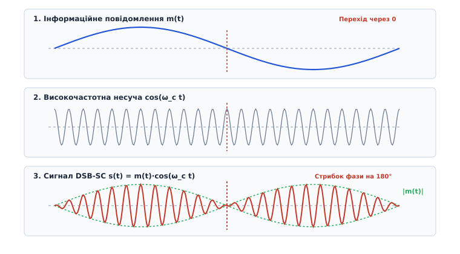
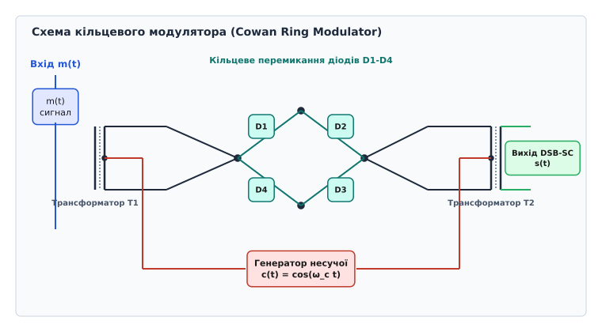
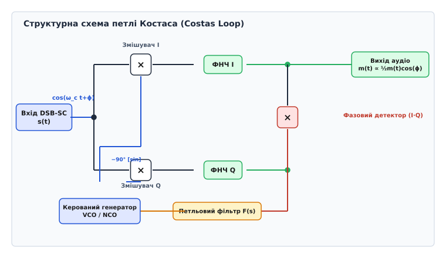

# Двосмугова модуляція з пригніченою несучою (DSB-SC)

<preknowlist>
- [Чому потрібна модуляція](book:communications/why-modulation) — чому низькочастотний спектр вимагає переносу на високочастотну несучу для випромінювання антеною.
- [AM і FM](book:communications/am-fm) — як класична амплітудна модуляція накладає сигнал на несучу і скільки потужності марнується на пик несучої.
- [Представлення сигналів на IQ-площині](book:communications/iq-representation) — як квадратурні компоненти I та Q описують фазу та амплітуду високочастотного сигналу.
</preknowlist>

Стаціонарний AM-передавач потужністю 10 кіловат витрачає понад 6.67 кіловата електроенергії на випромінювання неперервного синусоїдального тону несучої частоти. Цей чистий високочастотний сигнал не змінюється при зміні гучності чи тембру мови і не несе жодного біта інформації. Коли диктор у студії мовчить, передавач продовжує випромінювати в ефір ті самі 6.67 кВт чистої потужності. Двосмугова модуляція з пригніченою несучою (англ. *Double-Sideband Suppressed-Carrier*, DSB-SC) усуває це марнування, вилучаючи сталу складову з модуляційного процесу. У результаті при паузі у мовленні випромінювана потужність передавача падає до точного нуля, а під час розмови 100% підсиленої енергії концентрується виключно в інформаційних бічних смугах.

## Математична модель та спектральний перенос

У класичній амплітудній модуляції (DSB-LC) часовий сигнал формується додаванням сталого зсуву `A` до низькочастотного повідомлення `m(t)` з подальшим множенням суми на високочастотну несучу `cos(ω_c t)`:

```
s_AM(t) = [A + m(t)] · cos(ω_c t) = A · cos(ω_c t) + m(t) · cos(ω_c t)
```

Перший доданок `A · cos(ω_c t)` створює потужну лінію несучої у спектрі. Для переходу до DSB-SC сталий зсув усувають (`A = 0`), і сигнал перетворюється на чистий добуток інформаційного повідомлення на несучу хвилю:

```
s(t) = m(t) · cos(ω_c t)
```

Щоб простежити перетворення спектра, розглянемо найпростіший випадок тонального повідомлення у вигляді єдиної гармоніки з амплітудою `A_m` та частотою `ω_m` (де `ω_m << ω_c`):

```
m(t) = A_m · cos(ω_m t)
```

Підставляючи тон у рівняння модулятора та розкладаючи добуток двох косинусів за тригонометричними формулами, отримуємо:

```
s(t) = A_m · cos(ω_m t) · cos(ω_c t)
     = ½ · A_m · cos((ω_c − ω_m)t) + ½ · A_m · cos((ω_c + ω_m)t)      [добуток косинусів]
```

Отриманий вираз не містить складової з частотою `ω_c`. Спектр складається з двох дискретних симетричних ліній:
1. **Нижня бічна смуга** (LSB) на частоті `ω_c − ω_m` з амплітудою `½ A_m`;
2. **Верхня бічна смуга** (USB) на частоті `ω_c + ω_m` з амплітудою `½ A_m`.

Для довільного аналогового чи цифрового сигналу `m(t)` з обмеженим спектром `M(f)` (шириною `B_m`) теорема про зсув у частотній області через перетворення Фур'є дає:

```
S(f) = ½ · [M(f − f_c) + M(f + f_c)]
```

Спектр повідомлення `M(f)` роздвоюється і зсувається симетрично вправо й вліво відносно центральної частоти `f_c`.


*AM містить потужний дискретний пик несучої частоти, який несе нуль інформації. Пригнічення несучої у DSB-SC залишає лише дві симетричні бічні смуги, спрямовуючи весь енергетичний бюджет у корисне повідомлення.*

Загальна ширина спектра DSB-SC становить `B = 2 B_m`, що повністю збігається зі шириною спектра AM. Проте коефіцієнт корисної дії (ККД) випромінювання стає максимальним: 100% випроміненої потужності належить корисній інформації. Для порівняння розрахуємо середній ККД підсилювача потужності при звичайній AM із коефіцієнтом модуляції `μ`:

```
P_total = P_carrier · (1 + ½ μ²)
P_sidebands = ½ · μ² · P_carrier
ККД_AM = P_sidebands / P_total = μ² / (2 + μ²)
```

Навіть при найсприятливішому випадку граничної синусоїдальної модуляції `μ = 1` ККД класичної AM становить лише `1/3 ≈ 33.3%`. При реальному голосовому сигналі із середньою модуляцією `μ ≈ 0.3` ККД AM падає до марних 4.3%. У радіосигналах DSB-SC середня випромінювана потужність прямо пропорційна дисперсії (потужності) повідомлення `P_s = ½ P_m`, і жоден ват ефірної енергії не витрачається на підтримку несучої. У реальних передавачах ступінь пригнічення несучої (відношення потужності бічних смуг до залишку несучої) становить від 40 до 60 децибел.

## Фазові стрибки обвідної та неможливість діодного детектування

Вилучення сталого зсуву `A` фундаментально змінює геометричну поведінку огинаючої часового сигналу. У класичній AM-хвилі з коефіцієнтом модуляції `μ ≤ 1` сума `A + m(t)` завжди залишається строго додатною. Завдяки цьому обвідна високочастотних коливань точно повторює форму `m(t)`, що дозволяє виділяти звук простим діодним піковим детектором.

У сигналі DSB-SC повідомлення `m(t)` приймає як додатні, так і від'ємні значення, регулярно перетинаючи нульовий рівень. Коли `m(t) > 0`, високочастотне заповнення перебуває у синфазному стані з генератором несучої. У мить, коли `m(t)` змінює знак на від'ємний (`m(t) < 0`), добуток `m(t) · cos(ω_c t)` стає від'ємним:

```
−|m(t)| · cos(ω_c t) = |m(t)| · cos(ω_c t + π)
```

Від'ємна амплітуда математично еквівалентна зміні фази несучої на 180° (π радіан). У кожній точці перетину повідомленням `m(t)` нуля високочастотна синусоїда DSB-SC миттєво інвертує свою фазу на протилежну.


*Під час переходу інформаційного сигналу m(t) через нуль обвідна DSB-SC миттєво інвертує фазу несучої на 180°. Діодний детектор зрізає знак і видає спотворений модуль |m(t)|.*

Якщо подати DSB-SC сигнал на стандартний діодний детектор огинаючої, випрямляч виділить не вихідний сигнал `m(t)`, а його абсолютний модуль `|m(t)|`. Для синусоїдального мовного тону `m(t) = sin(ω_m t)` модуль є двопівперіодним випрямленим синусом із подвоєною частотою `2ω_m` та багатим набором нелінійних гармонік. Розклавши випрямлений модуль `|sin(ω_m t)|` у ряд Фур'є, бачимо:

```
|sin(ω_m t)| = (2/π) − (4/3π)·cos(2ω_m t) − (4/15π)·cos(4ω_m t) − ...
```

Звуковий вихід при цьому стає повністю спотвореним: замість чистого тону `ω_m` слухач чує гармоніку `2ω_m` та набір вищих частот. Діодний детектор втрачає інформацію про знак сигналу, оскільки не має внутрішньої частотної та фазової опори.

Геометрично на квадратурній IQ-площині сигнал DSB-SC здійснює коливання уздовж осі I (реальної осі) і проходить крізь центр координат `(0, 0)`. На відміну від AM, яка зміщена вправо на константу `A`, вектор DSB-SC регулярно переходить із першого та четвертого квадрантів у другий і третій, що відповідає фазовому куту `0` або `π`.

## Апаратна генерація: балансні та кільцеві модулятори

Оскільки аналогове перемноження двох напруг неможливо виконати на одному лінійному підсилювачі, для генерації DSB-SC застосовують спеціальні симетричні схеми — балансні модулятори.

Найдавнішою та найстабільнішою схемою є діодний кільцевий модулятор Кауана (дивіться [історію винайдення кільцевого модулятора](book:communications/dsb-sc/hist-ring-modulator.md)). Схема складається з чотирьох узгоджених діодів, увімкнених по колу, та двох симетричних трансформаторів із виводами від середин обмоток.


*Кільцевий модулятор із чотирьох діодів виконує комутацію полярності сигналу m(t) під управлінням несучої. Симетрія трансформаторів взаємно компенсує струми несучої в первинних і вторинних обмотках, забезпечуючи глибоке пригнічення несучої.*

Напруга несучої `c(t)` значно перевищує напругу повідомлення `m(t)` і працює як комутаційний ключ. Під час додатної напівхвилі несучої діоди `D1` та `D2` відкриваються, прямуючи струм від трансформатора `T1` до `T2` у прямому напрямку. Під час від'ємної напівхвилі несучої відкриваються діоди `D3` та `D4`, які підключають обмотки `T1` до `T2` у протифазному інверсному напрямку.

Математично дія кільцевого модулятора описується множенням сигналу `m(t)` на прямокутну меандрову функцію перемикання `S(t)` з частотою несучої `ω_c`:

```
S(t) = (4/π) · [cos(ω_c t) − ⅓·cos(3ω_c t) + ⅕·cos(5ω_c t) − ...]      [розклад меандру в ряд Фур'є]
```

Множення `m(t) · S(t)` утворює суму бічних смуг навколо основної несучої `ω_c`, а також навколо її непарних гармонік `3ω_c`, `5ω_c` тощо:

```
s_raw(t) = (4/π)·m(t)·cos(ω_c t) − (4/3π)·m(t)·cos(3ω_c t) + ...
```

Висхідний смуговий фільтр на виході модулятора виділяє лише першу гармонійну групу `(4/π)·m(t)·cos(ω_c t)`, повністю відсікаючи високочастотні хвости `3ω_c, 5ω_c`. При цьому завдяки точній симетрії обмоток струми самої несучої `ω_c` протікають крізь половини обмоток трансформаторів у протилежних напрямках і взаємно компенсуються (пригнічуються на 40–50 дБ).

У сучасній мікроелектроніці пасивні діодні мости замінено активними балансними транзисторними комірками Гілберта (дивіться [архітектуру компонентів балансних модуляторів](book:communications/dsb-sc/comp-balanced-modulator.md)), де чотириквадрантне множення виконується перемиканням струмів дифкаскадів на мікросхемах типу MC1496 або SA602.

## Синхронне детектування та квадратурна чутливість

Для вірного відновлення повідомлення `m(t)` із сигналу DSB-SC приймач повинен помножити прийнятий високочастотний сигнал на місцеве коливання опорного гетеродина `v_LO(t)` та пропустити добуток крізь низькочастотний фільтр (ФНЧ). Цей процес називається **когерентним (синхронним) демодулюванням**.

Припустимо, що опорний гетеродин приймача генерує синусоїду з тією ж частотою `ω_c`, але має кутовий зсув фази `ϕ` відносно несучої передавача:

```
v_LO(t) = cos(ω_c t + ϕ)
```

Перемножуючи прийнятий сигнал `s(t) = m(t) · cos(ω_c t)` на коливання гетеродина `v_LO(t)`, отримуємо:

```
s_mult(t) = [m(t) · cos(ω_c t)] · cos(ω_c t + ϕ)
          = m(t) · [½·cos(ϕ) + ½·cos(2ω_c t + ϕ)]         [добуток косинусів]
```

Після проходження крізь ФНЧ високочастотна складова з подвоєною частотою `2ω_c` повністю видаляється, і на виході залишається відновлений низькочастотний сигнал `y(t)`:

```
y(t) = ½ · m(t) · cos(ϕ)
```

Отримане рівняння розкриває фундаментальну властивість синхронного детектування:
* Якщо фази гетеродина та передавача збігаються (`ϕ = 0`), `cos(0) = 1`, і вихідний сигнал `y(t) = ½ m(t)` досягає абсолютного максимуму;
* Якщо гетеродин знаходиться у квадратурі відносно несучої (`ϕ = 90°` або `π/2`), `cos(90°) = 0`, і вихідний сигнал **повністю зникає** (`y(t) = 0`). Цей ефект називається **квадратурним згасанням (загасанням)**;
* Якщо між геродином і несучою існує невеликий частотний розсинхронізм `Δω = ω_LO − ω_c`, то кут фази зростає з часом `ϕ(t) = Δω · t`. Вихідний сигнал набуває вигляду `y(t) = ½ m(t) · cos(Δω · t)`, що спричиняє низькочастотну амплітудну биття (згасання та інверсію звуку з частотою расстройки).

Синхронне детектування вимагає, щоб приймальний гетеродин був строго зфазований з несучою передавача з точністю до кількох градусів.

## Синхронізація несучої: петля Костаса та квадратор

Оскільки у спектрі DSB-SC сама несуча частота пригнічена до нуля, приймач не може виділити опорний тон за допомогою звичайного вузькосмугового резонансного фільтра чи класичної фазової петлі автопідстройки (PLL).

Для вирішення проблеми відновлення пригніченої несучої застосовують дві класичні схеми:

1. **Схема з подвоєнням частоти (квадратор):** прийнятий сигнал `s(t)` возводиться у квадрат за допомогою нелінійного елемента або цифрового множника:
   ```
   s²(t) = m²(t) · cos²(ω_c t) = ½ · m²(t) · [1 + cos(2ω_c t)]
   ```
   Утворений сигнал містить дискретну спектральну лінію на подвоєній частоті `2ω_c` з амплітудою, пропорційною середній потужності повідомлення `E[m²(t)]`. Вузькосмугова петля PLL захоплює частоту `2ω_c`, після чого її частота ділиться на 2 за допомогою цифрового лічильника-дільника, формуючи опорне коливання `cos(ω_c t)`.

2. **Петля Костаса (Costas Loop):** більш досконала аналогово-цифрова система (дивіться [математичний аналіз та динаміку петлі Костаса](book:communications/dsb-sc/math-costas-loop.md)), яка працює безпосередньо на основній частоті.


*Петля Костаса розділяє прийнятий сигнал на квадратурні вітки I та Q. Їхній добуток формує сигнал помилки фази e(t), який контролює VCO навіть за повної відсутності несучої частоти в ефірі.*

Прийнятий DSB-SC сигнал надходить паралельно на два змішувачі. Верхній канал (синфазний, I) множиться на коливання генератора `cos(ω_c t + ϕ)`, а нижній (квадратурний, Q) — на зсунуте на `-90°` коливання `sin(ω_c t + ϕ)`.

Після ФНЧ виходи двох каналів дорівнюють:
```
I(t) = ½ · m(t) · cos(ϕ)
Q(t) = −½ · m(t) · sin(ϕ)
```

Сигнали I та Q подаються на третій перемножувач (фазовий детектор петлі), який формує сигнал керування помилкою `e(t)`:

```
e(t) = I(t) · Q(t) = −¼ · m²(t) · cos(ϕ) · sin(ϕ) = −⅛ · m²(t) · sin(2ϕ)
```

Оскільки `m²(t) ≥ 0` завжди додатне, знак керуючого сигналу `e(t)` залежить виключно від кута фазового відхилення `ϕ`, а не від знака чи форми повідомлення `m(t)`. Напруга `e(t)` проходить крізь петльовий фільтр і коригує частоту керованого генератора (VCO / NCO) доти, доки `sin(2ϕ)` не стане рівним нулю (`ϕ = 0`). При цьому відновлений аудіосигнал знімається безпосередньо з виходу синфазного каналу `I(t)`.

## Шумовий імунітет та порівняння з іншими модуляціями

Аналіз завадостійкості при наявності аддитивного білого гаусового шуму (AWGN) розкриває важливу перевагу когерентного детектування DSB-SC. Нехай на вхід приймача надходить сигнал `s(t)` разом із вузькосмуговим шумом `n(t) = n_I(t) cos(ω_c t) − n_Q(t) sin(ω_c t)` із тотальною потужністю шуму `P_n = N_0 · B`.

При перемноженні суміші `s(t) + n(t)` на опорний косинус гетеродина `cos(ω_c t)` після ФНЧ виділяється вихідний потік:

```
y_out(t) = ½ · m(t) + ½ · n_I(t)
```

Квадратурна складова шуму `n_Q(t)` множиться на `sin(ω_c t) · cos(ω_c t) = ½ sin(2ω_c t)`, що повністю фільтрується ФНЧ. Синхронний демодулятор відсікає рівно половину вхідної потужності шуму! В результаті відношення сигнал/шум (SNR) на виході демодулятора DSB-SC у два рази (на 3 децибели) перевищує вхідне SNR в ефірній смузі:

```
SNR_out = P_s / (N_0 · B_m) = 2 · SNR_in
```

У таблиці зведено порівняльні характеристики чотирьох аналогових систем модуляції:

| Модуляція | Смуга ефіру | Потужність несучої | ККД випромінювання | Детектор приймача |
| :--- | :--- | :--- | :--- | :--- |
| **AM (DSB-LC)** | `2 B_m` | 67%–95% | < 33% | Діодний (некогерентний, дешевий) |
| **DSB-SC** | `2 B_m` | 0% (пригнічена) | **100%** | Синхронний (Костаса / квадратор) |
| **SSB-SC** | `B_m` | 0% (пригнічена) | **100%** | Синхронний (BFO / гетеродин) |
| **NBFM** | `2 B_m` | 100% (стала) | Залежить від відхилення | Дискримінатор частоти (PLL) |

З таблиці видно, що DSB-SC поєднує 100% енергетичну ефективність із відносною простотою формування (не вимагає надстрімких кварцових фільтрів для вирізання однієї бічної смуги, як у SSB).

## Практична реалізація в SDR та сфера застосування

У сучасних системах цифрового радіо (SDR) модулятор та петля Костаса реалізуються програмно на мовах C та C++ (дивіться [програмну реалізацію DSB-SC та петлі Костаса в SDR](book:communications/dsb-sc/proj-dsb-sc-sdr.md)).

Незважаючи на складність когерентного прийому, DSB-SC є базовим фундаментом для ключових технологій зв'язку:

* **Стереофонічне FM-радіомовлення:** стереофонічна різниця лівого й правого каналів `(L − R)` передається на піднесучій частоті 38 кГц саме методом DSB-SC. Для полегшення фазування приймачів у передавач додається малопотужний пілот-тон на частоті 19 кГц (половина несучої 38 кГц);
* **Кольорове аналогове телебачення (PAL / NTSC):** кольорорізницеві сигнали `R − Y` та `B − Y` модулюються на одній колірній піднесучій за допомогою двох квадратурних DSB-SC модуляторів (квадратурна амплітудна модуляція, QAM);
* **Цифрова модуляція BPSK та QAM:** двопозиційна фазова модуляція (BPSK) є прямим цифровим еквівалентом DSB-SC, де повідомлення `m(t)` приймає дискретні значення `+1` та `−1`. Всі сучасні системи Wi-Fi (802.11ax), LTE, 5G та супутниковий зв'язок DVB-S2 використовують квадратурні DSB-SC піднесучі для передачі даних у сузір'ях QAM-64, QAM-256 та QAM-1024.

> 🔧 **Навіщо це.**
> Розуміння DSB-SC є необхідним мостом між аналоговою та цифровою обробкою сигналів. DSB-SC демонструє ортогональність квадратурних компонент I та Q, пояснює фундаментальні обмеження діодного детектування та формує математичну основу для побудови сучасних цифрових модемів Wi-Fi, LTE, 5G та супутникового зв'язку DVB-S2, де інформація передається одночасно в амплітуді й фазі векторного сигналу.
