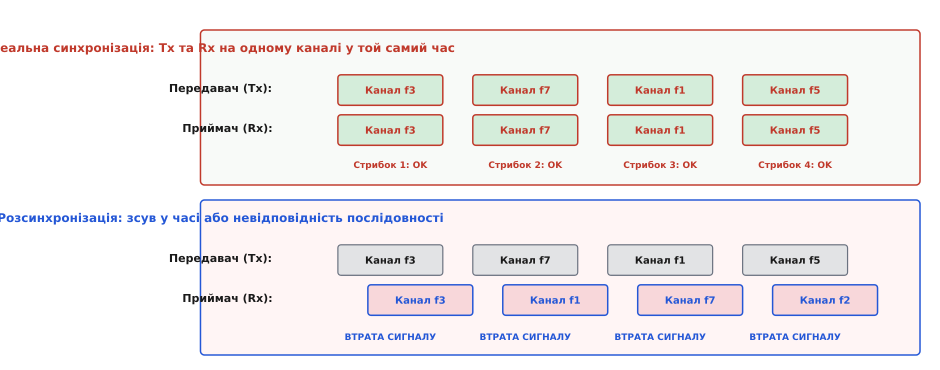
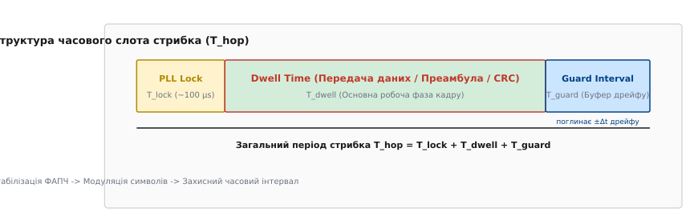
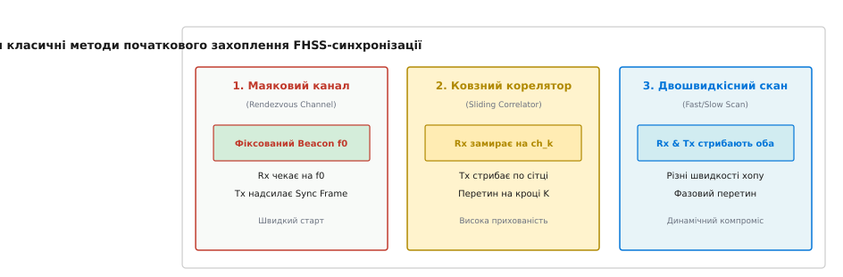

# Синхронізація в FHSS-лінку

<preknowlist>
- [Розширений спектр](topic:communications/spread-spectrum) — принцип стрибків частоти (FHSS) та пряме розширення (DSSS).
- [Частотна маніпуляція (FSK/PSK)](topic:communications/fsk-psk) — модуляція цифрових символів на радіонесучу.
- [Надійний радіолінк](topic:communications/reliable-link) — протокольні механізми підтвердження та перепередачі.
</preknowlist>

Уявіть два радіомодулі, що працюють у системі зі стрибками частоти (англ. *Frequency Hopping Spread Spectrum*, FHSS). Передавач змінює несучу частоту 500 разів на секунду — тобто щодві мілісекунди опиняється на новому каналі з-поміж 80 можливих. Якщо приймач спізниться з переключенням бодай на пів мілісекунди або помилиться з вибором каналу хоч на один крок псевдовипадкової послідовності, він слухатиме порожній ефір. Корисний сигнал перетвориться на білий шум, відношення сигнал/шум впаде до нуля, а зв'язок миттєво обірветься.

Безперервне розгортання спектра дає радіоканалу дивовижну стійкість до завад і глушіння. Проте ця перевага дається високою ціною: передавач і приймач мусять діяти як ідеально зіграний дует, що виконує складну партитуру у цілковитій темряві. Цей процес і називають **синхронізацією в FHSS-лінку** (лат. *synchronos* — «одночасний»). 

Причинно-наслідковий зв'язок тут безапеляційний: розширення спектра стрибками захищає канал лише тоді, коли приймач точно знає, де й коли шукати передавач. Якщо часовий зсув або помилка послідовності перевищує допустимий поріг, система вироджується в два незалежні радіопристрої, що хаотично випромінюють у порожнечу. З математичного погляду, енергія корисного сигналу `E_rx`, виділена демодулятором за один стрибок тривалістю `T_dwell`, падає лінійно зі зростанням часової розсинхронізації `Delta_t`:

`E_rx = E_total · (1 - Delta_t / T_dwell)    при 0 ≤ Delta_t ≤ T_dwell`

Коли часовий зсув `Delta_t` сягає тривалості `T_dwell`, отримана енергія дорівнює нулю, і приймач фіксує 100% пропуск кадру. Щоб лінк працював без збоїв, приймач повинен одночасно узгодити із передавачем дві динамічні величини: **часову синхронізацію** (момент мовчки й початку нового стрибка) та **послідовну синхронізацію** (стан генератора псевдовипадкових чисел, який вказує номер наступного каналу).


*Зверху: ідеальна синхронізація — приймач налаштовується на ту саму частоту точно у межах стрибка. Знизу: розсинхронізація у часі або послідовності призводить до повної втрати корисного сигналу.*

---

### Анатомія стрибка: час утримання, перебудова та захисний проміжок

Перехід з однієї частоти на іншу не відбувається миттєво. На рівні фізичного шару (PHY) кожен стрибок ділиться на кілька строго регламентованих фаз, обумовлених фізичними й електричними обмеженнями радіочастотних компонентів.

Загальний період стрибка `T_hop` складається з трьох ключових інтервалів:

`T_hop = T_dwell + T_lock + T_guard`

- **Час утримання** (англ. *dwell time*, `T_dwell`) — робоча фаза стрибка, протягом якої радіопередавач випромінює корисні дані (кадри або пакети), а приймач демодулює отримані символи. Усі корисні біти інформації мусять передаватися строго у межах цього вікна.
- **Час перебудови синтезатора** (англ. *PLL lock time* або *settling time*, `T_lock`) — тривалість перехідного процесу в системі фазового автопідстроювання частоти (ФАПЧ) гетеродина. Коли мікроконтролер надсилає радіочипу команду змінити канал, гетеродин змінює коефіцієнт ділення в петлі ФАПЧ. Зарядний насос (англ. *charge pump*) коригує напругу на підстроювальному конденсаторі й варакапі генератора, керованого напругою (ГКН / VCO). Поки вихідна частота осідає у межах допустимого відхилення, передача або прийом неможливі, оскільки фазовий шум гетеродина у цей момент перевищує допустимі межі. У сучасних інтегральних трансиверах (як-от Semtech SX1280, Texas Instruments CC1101 або Nordic nRF52840) цей час становить від 15 до 150 мікросекунд.
- **Захисний інтервал** (англ. *guard interval*, `T_guard`) — додатковий часовий буфер, призначений для компенсації накопиченого розходження годинників передавача й приймача, затримок поширення радіохвиль у просторі (англ. *propagation delay*), а також для перемикання високочастотних антенних ключів (англ. *RF switch*).


*Кожен часовий слот стрибка містить час перебудови гетеродина (PLL Lock), корисний час передачі даних (Dwell Time) та захисний проміжок (Guard Interval), який забігає наперед для поглинання дрейфу годинника.*

Фізична причина створення захисного інтервалу полягає у тому, що локальні кварцові генератори двох пристроїв цокають із незначною різницею швидкостей, а електромагнітна хвиля поширюється у просторі зі скінченною швидкістю світла `c ≈ 300 000 km/s` (тобто затримка становить 3.33 мікросекунди на кожен кілометр відстані). На дальності 30 км затримка поширення складає 100 мкс, що співмірне з усім часом перебудови ФАПЧ!

Якщо сумарний часовий зсув між пристроями `Delta_t = Delta_t_drift + Delta_t_prop` перевищує `T_guard`, приймач прокидається із запізненням і захоплює лише частину кадру. Це призводить до сплеску похибок у бітах (BER) і деструкції контрольних сум кадру (CRC).

Звідси випливає фундаментальний інженерний компроміс: занадто малий проміжок `T_guard` робить лінк крихким до температурного дрейфу кварців, затримок шини SPI та дальності зв'язку, а занадто великий — зменшує частку `T_dwell / T_hop`, тобто безжально з'їдає корисну пропускну здатність каналу.

---

### Гетеродин, ФАПЧ та прискорення перебудови частоти

Ключовим апаратним вузлом, що обмежує максимальну швидкість стрибків FHSS, є синтезатор частоти на основі фракційного аналогово-цифрового контуру ФАПЧ (англ. *Fractional-N Phase-Locked Loop*).

Коли контролер видає команду переходу на новий канал `f_k`, у синтезаторі відбуваються наступні фізичні процеси:
1. Завантаження нових коефіцієнтів ділення у регістри дільника частоти через шину SPI.
2. Зсув фази у фазовому дискримінаторі (PFD), який керує струмовим насосом (англ. *Charge Pump*).
3. Перезарядка конденсаторів низькочастотного петльового фільтра (англ. *Loop Filter*) для зміни напруги керування `V_tune`.
4. Переналаштування генератора, керованого напругою (ГКН / VCO), та встановлення нового значення піддіапазону (англ. *VCO sub-band calibration*).

```
   SPI Команда         Фазовий              Зарядний            Петльовий          Генератор VCO
 ┌─────────────┐     дискримінатор           насос                фільтр          ┌─────────────┐
 │ зміна f_k   ├────►┌─────────────┐   I_cp  ┌───────┐   V_tune  ┌─────────┐       │ Частота     │
 └─────────────┘     │     PFD     ├────────►│  CP   ├──────────►│ Filter  ├──────►│ f_out = f_k │
                     └─────────────┘         └───────┘           └─────────┘       └─────────────┘
```

Щоб скоротити час стабілізації `T_lock` зі стандартних 200 мкс до надшвидких 15–20 мкс, сучасні інтегральні трансивери застосовують **табличне попереднє калібрування VCO** (англ. *VCO Auto-Calibration Fast Hopping*). Під час ініціалізації радіомодуль сканує увесь діапазон і зберігає оптимальні цифрові індекси піддіапазонів для кожного каналу у внутрішнє ОЗП. Під час активних стрибків чип не витрачає час на пошук калібрувального значення, а миттєво подає потрібний цифровий код на матрицю конденсаторів VCO, скорочуючи переходний процес у рази.

---

### Початкове захоплення: як знайти голку у радіокопиці

Коли приймач умикається або виходить із глибокого анабіозу (стан «холодного старту», англ. *cold start*), він перебуває у стану цілковитої невідомості. Йому невідомий ані поточний стан генератора псевдовипадкових чисел (PRNG) передавача, ані точний фазовий зсув його локального таймера.

Якщо передавач стрибає по 80 каналах зі швидкістю 500 стрибків на секунду, імовірність випадково вгадати потрібну частоту у довільний момент часу становить лише `1 / 80 = 1.25%`. Без системного алгоритму первинного пошуку пристрої шукатимуть один одного хвилинами. Для швидкого встановлення зв'язку застосовують три основні стратегії початкового захоплення (англ. *initial acquisition*).

```
          ┌────────────────────────────────────────────────┐
          │     Холодний старт (Початкове захоплення)      │
          └───────────────────────┬────────────────────────┘
                                  │
         ┌────────────────────────┼────────────────────────┐
         ▼                        ▼                        ▼
┌──────────────────┐    ┌──────────────────┐    ┌──────────────────┐
│  Маяковий канал  │    │Ковзний корелятор │    │Двошвидкісний скан│
│ (Beacon Channel) │    │(Sliding Correlator│    │(Fast/Slow Scan)  │
└──────────────────┘    └──────────────────┘    └──────────────────┘
```

1. **Фіксований маяковий (службовий) канал (англ. *Rendezvous / Beacon Channel*)**
   Передавач періодично або постійно транслює короткі синхропакети (англ. *sync beacons*) на одній заздалегідь відомій частоті або на вузькій підмножині каналів (рандеву-каналах). Приймач під час старту не намагається стрибати, а настроюється на цей канал і пасивно слухає ефір.
   
   Маяковий пакет містить:
   - 32-бітне абсолютне значення лічильника кадрів або поточний 32-бітний стан генератора PRNG;
   - Точний мікросекундний штамп часу передавача;
   - Ідентифікатор мережі (Net ID) для запобігання хибному захопленню сусідніх радіомереж.

   Отримавши такий пакет, приймач завантажує зародковий стан (англ. *seed*) у свій локальний алгоритм PRNG, налаштовує апаратний таймер переривань і миттєво вмикається у загальний ритм стрибків. Недоліком цього методу є вразливість маякового каналу: якщо противник або потужна завада заблокує саме частоту рандеву, нові пристрої не зможуть увійти у мережу.

2. **Метод ковзного корелятора (англ. *Sliding Correlator*)**
   Якщо фіксованого каналу немає (наприклад, у військовій радіостанції з жорсткими вимогами до прихованості LPI/LPD), приймач обирає один із каналів загального діапазону `f_scan` і «замирає» на ньому. Передавач тим часом циклічно передає довгу преамбулу, стрибаючи по всій послідовності.
   
   Рано чи пізно передавач перестрибує на частоту `f_scan`, де його терпляче чекає приймач. Приймач виявляє преамбулу за допомогою цифрового корелятора, зчитує маркер синхронізації та дізнається поточний індекс у послідовності стрибків. Цей метод забезпечує високу прихованість, але вимагає довшої преамбули та підвищених витрат енергії на боці передавача.

3. **Двошвидкісне сканування (англ. *Fast / Slow Scanning*)**
   Приймач також змінює частоти, але з іншою швидкістю, ніж передавач — скажімо, вдвічі повільніше або трохи швидше. Завдяки відносному руху двох фазових покажчиків у частотно-часовій сітці, траєкторії частот передавача та приймача неминуче перетинаються у певний момент часу. У точці перетину відбувається демодуляція коротокого пакета синхронізації та вирівнювання фаз таймерів.

Детальний аналіз еволюції цих методів — від механічних паперових перфострічок у патенті [Геді Ламарр](topic:communications/spread-spectrum/hist-hedy-lamarr.md) до сучасних цифрових протоколів — розведено у винесеній історії: [Історія розробки FHSS-синхронізації: від механічних рулонів до HAVE QUICK та ExpressLRS](topic:communications/fhss-sync/hist-have-quick-sincgars.md).


*Три класичні схеми входження у зв'язок: очікування на рандеву-каналі, пасивне зависання ковзного корелятора та відносне двошвидкісний скан.*

---

### Точне стеження та компенсація часового дрейфу

Після первинного захоплення лінк переходить у фазу стеження (англ. *tracking phase*). Проте жоден кварцовий генератор (англ. *crystal oscillator*, XTAL) не є ідеальним.

Нестабільність частоти кварцових резонаторів вимірюють у мільйонних частках (англ. *parts per million*, ppm). Якщо передавач має кварц із точністю +15 ppm, а приймач — із точністю -15 ppm, їхня відносна похибка ходу годинників становить:

`delta_rel = 15 ppm + 15 ppm = 30 ppm = 30 · 10⁻⁶ = 0.000030`

Це означає, що за кожну секунду роботи часова похибка між пристроями накопичується на 30 мікросекунд. Через 10 секунд паузи або утримання сну (англ. *sleep mode*) часовий сув досягне 300 мкс. Якщо захисний інтервал `T_guard` становить лише 150 мкс, то пристрій повністю випаде зі синхронізму і втратить наступний стрибок.

Виведення граничних рівнянь для часового дрейфу, тривалості сну та часу пошуку наведено у математичному матеріалі: [Математичний аналіз дрейфу годинника та захисних інтервалів у FHSS](topic:communications/fhss-sync/math-drift-bounds.md).

Для підтримання синхронізації під час активного зв'язку застосовують **ранньо-пізній часовий дискримінатор** (англ. *Early-Late Gate Time Tracking Loop*).

```
                      Вхідний сигнал
                            │
            ┌───────────────┴───────────────┐
            ▼                               ▼
    ┌───────────────┐               ┌───────────────┐
    │Раннє вікно    │               │Пізнє вікно    │
    │(Early Window) │               │(Late Window)  │
    └───────┬───────┘               └───────┬───────┘
            │                               │
            ▼                               ▼
     Обчислення E_early              Обчислення E_late
            │                               │
            └───────────────┬───────────────┘
                            ▼
                Сигнал помилки e = E_early - E_late
                            │
                            ▼
                 Петльовий фільтр (PLL/FLL)
                            │
                            ▼
              Корекція локального таймера
```

Приймач формує два вікна вибірки сигналу відносно очікуваного центру стрибка:
1. **Раннє вікно** (англ. *early gate*) — вимірює енергію прийнятого сигналу у першій половині очікуваного інтервалу преамбули.
2. **Пізнє вікно** (англ. *late gate*) — вимірює енергію у другій половині.

Якщо локальний таймер приймача поспішає, більша частина енергії сигналу потрапляє у пізнє вікно (`E_late > E_early`). Сигнал помилки `e = E_early - E_late` стає від'ємним, і петльовий фільтр трохи уповільнює підрахунок локального таймера. Якщо ж таймер приймача відстає, навпаки — `E_early > E_late`, і таймер підганяють уперед.

У просунутих цифрових модемах застосовують адаптивний **Фільтр Калмана** (англ. *Kalman Filter*), який будує двовимірний вектор стану `x_k = [tau_offset, frequency_drift]^T`. Фільтр Калмана розділяє миттєвий шумок вимірювань і постійний температурний дрейф кварцу, дозволяючи прогностично коригувати інтервал прокидання апаратного таймера з точністю до субмікросекундних часток навіть під час глибоких затінень каналу.

---

### Практична архітектура: автомат станів, AFH та радіопротоколи

У реальних вбудованих системах процес синхронізації описується скінченним автоматом станів (англ. *Finite State Machine*, FSM).

```
                      ┌───────────────────┐
                      │    SEARCHING      │◄─────────────────┐
                      │ (Пошук преамбули) │                  │
                      └─────────┬─────────┘                  │
                                │                            │
                 Преамбулу знайдено / CRC OK                 │
                                │                            │
                                ▼                            │
                      ┌───────────────────┐                  │
                      │      LOCKING      │                  │
                      │ (Ініціалізація)   │                  │
                      └─────────┬─────────┘                  │
                                │                            │
                      Таймери зсинхронізовано                │
                                │                            │
                                ▼                            │
                      ┌───────────────────┐                  │
                      │     TRACKING      │                  │
                      │(Активні стрибки)  │                  │
                      └─────────┬─────────┘                  │
                                │                            │
                    N послідовних пропусків (Timeout)        │
                                │                            │
                                └────────────────────────────┘
```

1. **`SEARCHING` (Пошук / Захоплення)**: Радіомодуль перебуває у режимі прийому на фіксованому або повільно змінюваному каналі. Працює алгоритм виявлення преамбули (англ. *Preamble Detector*).
2. **`LOCKING` (Входження у синхронізм)**: Після успішної демодуляції синхропакета контролер зчитує 32-бітну мітку часу та лічильник кадрів. За цими даними розраховується поточна фаза генератора PRNG та завантажується апаратний таймер переривань (наприклад, TIM2 в STM32 або MCPWM/GPTimer в ESP32).
3. **`TRACKING` (Стеження)**: Основний робочий режим. Приймач стрибає синхронно з передавачем. На кожному стрибку виконується корекція таймера за допомогою ранньо-пізнього дискримінатора або за моментом спрацьовування сигналу SyncWord від радіочипа.
4. **`LOST_SYNC` (Втрата синхронізму)**: Якщо через завади або затінення траси приймач пропускає `N` стрибків поспіль (наприклад, `N = 8`), він не скидає таймер одразу, а продовжує «сліпе» стрибання за інерцією (англ. *flywheel mode* або *coasting*). Якщо після закінчення вікна інерції корисний сигнал не з'являється, автомат скидається у стан `SEARCHING`.

Окрім класичного стрибання по фіксованій сітці, сучасні цивільні системи застосовують **адаптивні стрибки частоти** (англ. *Adaptive Frequency Hopping*, AFH). У режимі AFH передавач і приймач постійно оцінюють рівень похибок (PER) на кожному каналі. Якщо певний канал (наприклад, зайнятий потужним Wi-Fi роутером) постійно дає 100% втрату кадрів, пристрої за допомогою вищого шару MAC позначають його як «поганий» і виключають із робочого масиву PRNG без порушення загальної синхронізації часу.

Полна програмна реалізація автомата станів, ковзного корелятора та системи корекції дрейфу мовами C та C++ подана у практичній вставці: [Симуляція автомата синхронізації FHSS-лінку з ковзним корелятором та стеженням за дрейфом](topic:communications/fhss-sync/proj-fhss-sync-sim.md).

#### Порівняльний аналіз реальних протоколів

- **Bluetooth Classic (BR/EDR)**:
  Застосовує 79 каналів із кроком 1 МГц. Швидкість стрибків в активному режимі становить 1600 стрибків/с (тривалість стрибка 625 мкс). У режимах розшуку (Inquiry) та виклику (Page) швидкість подвоюється до 3200 стрибків/с. Синхронізація тримається на 28-бітному годиннику ведучого пристрою (Master Clock `CLK`), який транслюється кожні 1.25 мс. Залежні пристрої (Slave) обчислюють часовий сув `OFFSET = CLK - CLKN` і підлаштовують свої фази.

- **ExpressLRS (ELRS)**:
  Відкритий протокол для радіокерованих моделей і безпілотників, що працює на частотах 868/915 МГц або 2.4 ГГц. Використовує масив із 4–8 стрибкових каналів зі детально оптимізованим часом утримання. Швидкість оновлення сягає від 50 Гц до 1000 Гц (стрибок щомиті, `T_hop = 1 ms`). Захисний інтервал регулюється динамічно: радіомодуль вимірює рівень шуму і тривалість SPI-транзакцій обміну даними з мікроконтролером, забезпечуючи надійну роботу навіть при жорстких температурних варіаціях.

> 🔧 **Навіщо це на практиці.**
> У розробці власного бездротового протоколу для розбудови мереж датчиків або радіокерованих систем найчастішою помилкою є ігнорування часу затримки шини SPI та часу стабілізації гетеродина (PLL lock). Якщо ви надсилаєте команду зміни частоти у радіочип через SPI на швидкості 2 МГц, лише передача трьох байтів регістрів займає понад 12 мікросекунд. Додайте сюди 100 мкс на розгін ФАПЧ, 20 мкс на варіативність затримки (англ. *jitter*) переривань операційної системи реального часу (RTOS) та 10 мкс затримки поширення радіохвилі — і ви отримаєте сумарну затримку у 142 мкс. Без врахування цієї сумарної затримки у розрахунку `T_guard` приймач відкриватиме вікно прийому занадто рано і пропускатиме початок преамбули.

---

### Крайові випадки та апаратні пастки

Під час проектування FHSS-лінків інженери зіштовхуються із низкою прихованих проблем:

1. **Доплерівський сув частоти (англ. *Doppler Shift*)**
   У високошвидкісних літальних апаратах (FPV-дрони, авіація) відносний рух передавача й приймача зміщує несучу частоту відповідно до формули `delta_f = f_0 · (v / c)`. На частоті 2.4 ГГц при швидкості 300 км/год (83.3 м/с) доплерівський сув становить близько 667 Гц. Хоча це менше за смугу FSK-демодулятора, разом із температурним дрейфом кварцу це може вивести сигнал за межі смуги захоплення АФЧ (англ. *Automatic Frequency Control*, AFC).

2. **Ефект накоплюваної фазової похибки при швидких стрибках**
   При швидкості понад 1000 стрибків на секунду генератор псевдовипадкових чисел не мусить бути обчислювально важким. Використання важких криптографічних функцій на кшталт AES-128 для кожного стрибка створює відчутне навантаження на CPU і додає варіативність затримки (англ. *jitter*). Натомість застосовують легкі та швидкі поліноміальні генератори LFSR (англ. *Linear Feedback Shift Register*) або комбіновані табличні генератори на основі ключів Селмер-Ґоломба, які дають рівномірний розподіл частот і обчислюються за один такт процесора.

3. **Затінення каналу та локальні завади**
   Якщо 3 з 80 каналів повністю заблоковані потужним джерелом Wi-Fi, пристрій не повинен втрачати синхронізм при проходженні цих каналів. Для цього автомат станів у режимі `TRACKING` застосовує таймерний «маховик» (англ. *flywheel*): при відсутності преамбули на зіпсованому каналі приймач не намагається шукати сигнал, а мовчки витримує інтервал `T_hop`, після чого за розкладом переходить на наступну частоту `f_{k+1}`.

Синхронізація в FHSS — це фундамент, на якому тримається надійність радіозв'язку в насиченому й завадженому ефірі. Поєднуючи швидкі апаратні таймери мікроконтролера, точну математику захисних інтервалів та гнучкі автомати станів, розробник отримує канал, здатний працювати в умовах, де звичайне радіо безсило замолкає.
