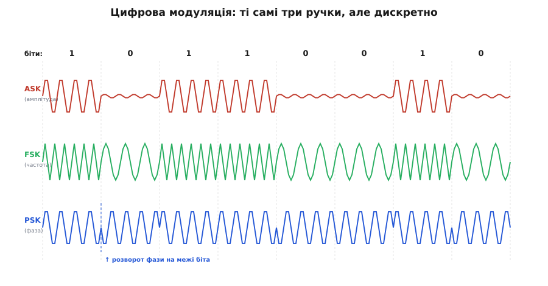
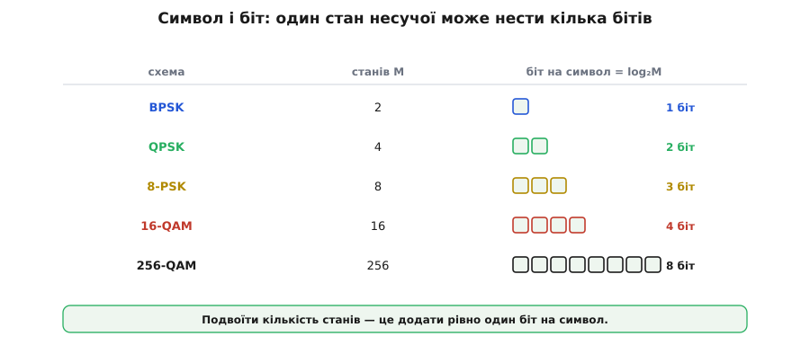
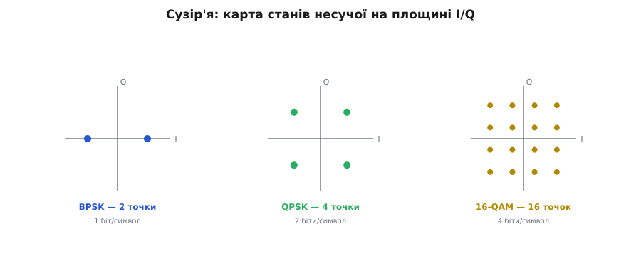
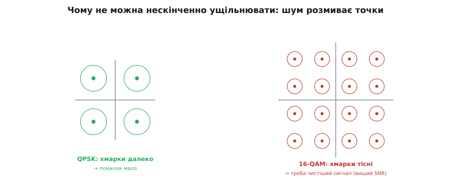
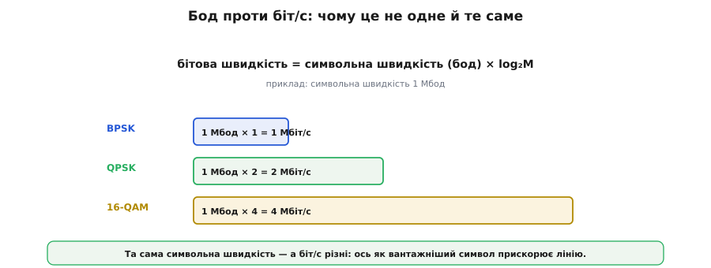
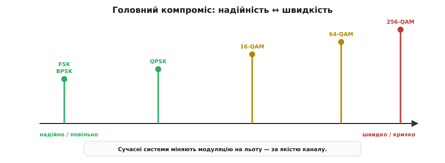
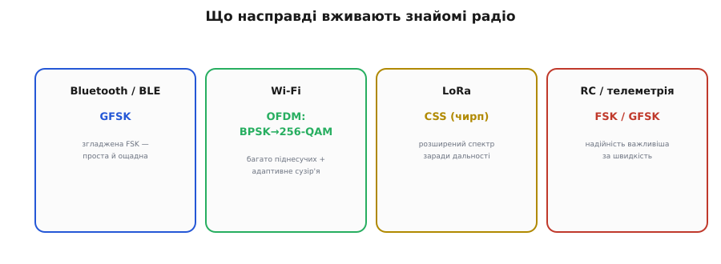

# Цифрова модуляція: FSK, PSK

[Аналогове радіо](book:communications/am-fm) — це коли неперервний звук плавно крутить ручку несучої. Та передавати найчастіше треба не голос, а **біти**: ESP32 шле байти телеметрії, Wi-Fi — пакети, Bluetooth — кадри. Гарна новина: жодної нової фізики тут не потрібно. Ті самі три ручки несучої — амплітуда, частота, фаза — лишаються, тільки тепер їх крутять **дискретно**, перемикаючи між кількома чіткими станами. Англійською таке перемикання називають *keying* (англ. *key* — телеграфний «ключ», яким набивали крапки й тире), і звідси три базові цифрові модуляції.

### Три ручки стають дискретними

Кожна з трьох ручок по-своєму перетворює потік нулів та одиниць на радіосигнал.


*Один і той самий потік бітів, три способи. **ASK** (*amplitude-shift keying*) вмикає/вимикає амплітуду: 1 — несуча є, 0 — її майже нема. **FSK** (*frequency-shift keying*) дає двом бітам дві різні частоти: 1 — густіша хвиля, 0 — рідша. **PSK** (*phase-shift keying*) лишає амплітуду й частоту сталими, а на межі біта розвертає фазу на 180°.*

**ASK** — найпростіша: 1 — несуча увімкнена, 0 — вимкнена (крайній випадок так і звуть *on-off keying*, OOK). Так працюють найдешевші пульти на 433 МГц та інфрачервоні пульти телевізора. Проста, але вразлива, бо несе інформацію в амплітуді — з усіма бідами AM. **FSK** — цифрова рідня FM: одна частота для 0, інша для 1. Вона успадковує стійкість FM до шуму, лишаючись простою; на ній стоять і старі телефонні модеми, і пейджери, і — у згладженому варіанті GFSK — сам **Bluetooth**. **PSK** — найхитріша й найважливіша для швидких ліній: інформацію кодує **фаза** несучої. Найпростіший варіант, **BPSK** (*binary PSK*), має лише два стани фази — 0° і 180°, тобто 1 біт на стан. Здавалося б, не густо — але саме PSK відкриває двері до справжнього ущільнення.

### Символ і біт — це не одне й те саме

Ось ключова ідея всього цифрового зв'язку. Один стан несучої може кодувати один біт — а може й більше, якщо станів **багато**. Несучу, яку тримають незмінною протягом одного такту, називають **символом** (*symbol*, від грец. *symbolon* — умовний знак). І якщо різних символів багато, кожен несе **кілька** бітів одразу.


*Якщо несуча має M розрізнюваних станів, то один символ кодує log₂M бітів. BPSK (2 стани) — 1 біт; QPSK (4) — 2 біти; 8-PSK (8) — 3; 16-QAM (16) — 4; 256-QAM (256) — аж 8 бітів на один символ. Подвоїти кількість станів — це додати рівно один біт на символ.*

Біт на символ дорівнює log₂ від кількості станів M:

```
BPSK   : M = 2   → log₂2   = 1 біт/символ
QPSK   : M = 4   → log₂4   = 2 біти/символ
16-QAM : M = 16  → log₂16  = 4 біти/символ
256-QAM: M = 256 → log₂256 = 8 бітів/символ
```

Ось у чому виграш: **QPSK передає вдвічі більше даних, ніж BPSK, у тій самій смузі й за той самий час** — просто тому, що має 4 стани замість 2. Здавалося б, безкоштовний обід: нарощуй кількість станів — і качай скільки завгодно. Але дарма: за все треба платити, і платять тут **запасом на шум**.

### Сузір'я: карта станів несучої

Стани символів зручно бачити на **сузір'ї** (*constellation diagram*) — карті, де кожен можливий стан несучої позначено точкою на площині. Дві координати цієї площини — **I** (синфазна складова, англ. *in-phase*) та **Q** (квадратурна, англ. *quadrature*) — разом задають і амплітуду (відстань точки від центру), і фазу (кут) несучої; це той самий [фазорний](book:math/phasors) запис коливання, тільки з позначеними дискретними станами. Як саме пара чисел I та Q перетворюється на одне коливання заданої амплітуди й фази — розписано у вставці [про I/Q-подання](book:communications/fsk-psk/math-iq-plane.md).


*BPSK — дві точки на одній осі (1 біт). QPSK — чотири точки квадратом (2 біти): чотири різні фази однакової амплітуди. 16-QAM — сітка 4×4 з 16 точок (4 біти): тут кодують і фазу, і амплітуду одночасно. Що більше точок — то більше бітів на символ.*

Коли станів стає багато, самої лише фази вже не вистачає — точки на колі надто тісняться. Тоді комбінують **дві ручки разом**: і фазу, і амплітуду. Така змішана модуляція зветься **QAM** (*quadrature amplitude modulation*, квадратурна амплітудна модуляція), і саме вона — робоча конячка сучасного швидкісного зв'язку: 16-QAM, 64-QAM, 256-QAM працюють у Wi-Fi, LTE, кабельних модемах і цифровому ТБ. Сузір'я 256-QAM — це щільна сітка 16×16 точок, кожна з яких несе цілих 8 бітів.

### Чому не можна ущільнювати нескінченно

Якщо більше точок — це більше даних, чому б не зробити мільйон точок і не качати терабіти? Відповідь — **шум**, і сузір'я показує її напрочуд наочно.


*Шум зміщує кожен прийнятий символ — ідеальна точка перетворюється на «хмарку» розкиду. Поки хмарки далеко одна від одної (QPSK), приймач упевнено розрізняє стани. Але натисни 16 точок у той самий квадрат — хмарки зближуються, починають перекриватися, і приймач плутає сусідні символи: це бітові помилки.*

Ось плата за швидкість. Кожна реальна, прийнята антеною точка трохи зміщена шумом — вона лягає не точно на місце, а десь поряд, у «хмарці» розкиду. Поки сусідні точки сузір'я стоять **далеко**, хмарки не перетинаються, і приймач безпомилково вгадує, який символ надіслано. Але що **тісніше** напхано точок, то ближче хмарки — і за певного рівня шуму вони зливаються, а приймач починає помилятися. Висновок залізний: **ущільнення сузір'я вимагає чистішого сигналу** — вищого відношення сигнал/шум (*signal-to-noise ratio*, SNR). 256-QAM можливе лише близько до передавача й у чистому ефірі; здалеку чи крізь стіни доводиться вертатися до простих, рідких сузір'їв.

### Бод проти біт за секунду

Тут варто розчистити поширену плутанину — між **символьною** і **бітовою** швидкістю. [Бод](book:communications/baud-rate) (*baud*, на честь Еміля Бодо, автора телеграфного коду) — це число **символів** за секунду, тобто як часто міняється стан несучої. А **бітова швидкість** (біт/с) — це скільки **бітів** за секунду реально проходить. І це різні речі.


*Бітова швидкість = символьна швидкість (бод) × (біт на символ). За тих самих 1 Мбод: BPSK дає 1 Мбіт/с, QPSK — 2 Мбіт/с, 16-QAM — 4 Мбіт/с. Та сама смуга, та сама швидкість зміни символів — а пропускна здатність різна, бо різна «вантажність» символу.*

**Скільки біт/с дає 1 Мбод.** Хай символьна швидкість 1 Мбод (мільйон символів за секунду); тоді бітова швидкість — це бод, помножений на біт/символ:

:::tabs
```c
#include <math.h>
#include <stdint.h>

// Біт на символ для сузір'я з M станами: log2(M).
static inline uint8_t bits_per_symbol(uint32_t M) {
    return (uint8_t)lround(log2((double)M));   // M=4 → 2, M=256 → 8
}

// Бітова швидкість (біт/с) із символьної (бод) і кількості станів сузір'я.
uint32_t bit_rate_bps(uint32_t baud, uint32_t M) {
    return baud * bits_per_symbol(M);
}

// 1 Мбод:  BPSK → 1e6,  QPSK → 2e6,  16-QAM → 4e6 біт/с
uint32_t r_bpsk = bit_rate_bps(1000000u, 2u);   // 1 000 000
uint32_t r_qpsk = bit_rate_bps(1000000u, 4u);   // 2 000 000
uint32_t r_qam  = bit_rate_bps(1000000u, 16u);  // 4 000 000
```
```python
from math import log2

# Біт на символ для сузір'я з M станами: log2(M).
def bits_per_symbol(M):
    return round(log2(M))          # M=4 → 2, M=256 → 8

# Бітова швидкість (біт/с) із символьної (бод) і кількості станів сузір'я.
def bit_rate_bps(baud, M):
    return baud * bits_per_symbol(M)

# 1 Мбод:  BPSK → 1e6,  QPSK → 2e6,  16-QAM → 4e6 біт/с
r_bpsk = bit_rate_bps(1_000_000, 2)    # 1 000 000
r_qpsk = bit_rate_bps(1_000_000, 4)    # 2 000 000
r_qam  = bit_rate_bps(1_000_000, 16)   # 4 000 000
```
:::

Звідси видно, чому «бод = біт/с» — лише окремий випадок: рівність тримається **тільки** для двійкових схем (1 біт/символ), а в усіх сучасних біт/с у рази більший за бод. Символьна швидкість визначає, скільки [смуги](book:communications/bandwidth-capacity) треба; а біт/с піднімають понад це, напихаючи більше бітів у кожен символ.

### Головний компроміс — і як його обходять

Виходить два важелі швидкості: крутити символи **частіше** (більший бод — більша смуга) або робити кожен символ **вантажнішим** (більше точок у сузір'ї — вищий потрібний SNR). Обидва впираються в межу.


*Зліва направо росте швидкість — і водночас крихкість: FSK і BPSK найнадійніші, але повільні; 256-QAM найшвидше, але живе лише за відмінного сигналу. Сучасні системи не обирають щось одне назавжди, а міняють модуляцію на льоту залежно від якості каналу.*

> 🔧 **Навіщо це.** Звідси — одна з найрозумніших ідей сучасного зв'язку: **адаптивна модуляція**. Wi-Fi-роутер чи стільниковий модем **не** тримаються однієї фіксованої схеми. Сидиш поруч із роутером, сигнал відмінний — він перемикається на щільне 256-QAM і качає на повну. Відійшов у дальню кімнату, сигнал ослаб — він плавно **знижує** модуляцію до 64-QAM, 16-QAM, аж до надійного QPSK, жертвуючи швидкістю заради того, щоб зв'язок узагалі не впав. Ось чому що далі від роутера, то повільніший Wi-Fi: він не «слабшає» сам собою — він **свідомо** обирає повільнішу, але стійкішу модуляцію. Знаючи це, інакше дивишся на смужки сигналу: вони — про вибір сузір'я.

### Що насправді вживають повсякденні радіо

Усі ці абстракції — не теорія заради теорії, а саме те, що працює всередині чіпів [Wi-Fi](book:communications/wifi) та [Bluetooth](book:communications/bluetooth-spp).


*Bluetooth / BLE — GFSK (згладжена FSK): проста й ощадна до енергії. Wi-Fi — OFDM (багато піднесучих) з адаптивним сузір'ям від BPSK до 256-QAM. LoRa — CSS (чирп, розширений спектр) заради дальності. RC-керування й телеметрія дрона — FSK/GFSK, де надійність важливіша за швидкість.*

За знайомими назвами проступає конкретика. **Bluetooth і BLE** користуються **GFSK** — це FSK, у якій перемикання частоти згладжене (щоб не «бризкати» в сусідні канали), проста й енергоощадна. **Wi-Fi** — найскладніший: він ділить канал на безліч вузьких **піднесучих** (схема OFDM) і на кожній крутить адаптивне сузір'я аж до 256-QAM. **LoRa**, що творить диво дальності для IoT, застосовує особливу модуляцію на **чирпах** (CSS — *chirp spread spectrum*) — це різновид [розширеного спектра](book:communications/spread-spectrum). А **RC-лінк** і **телеметрія** дрона тримаються FSK/GFSK або [LoRa](book:connect/lora-module) — там, де надійність дорожча за гігабіти.

Усе тут упирається в одну й ту саму стіну: **смуга** й **шум** обмежують, скільки даних можна пропхати. FM Армстронга міняла смугу на тишу; цифрові сузір'я міняють SNR на біти. За всім цим стоїть **єдиний фундаментальний закон**, що пов'язує смугу, шум і максимально можливу швидкість. Його 1948 року вивів Клод Шеннон — і саме він задає [теоретичну стелю](book:communications/bandwidth-capacity) будь-якого зв'язку.

---
