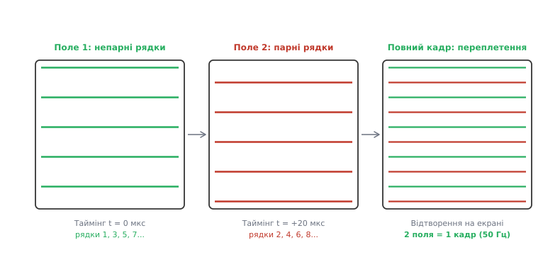
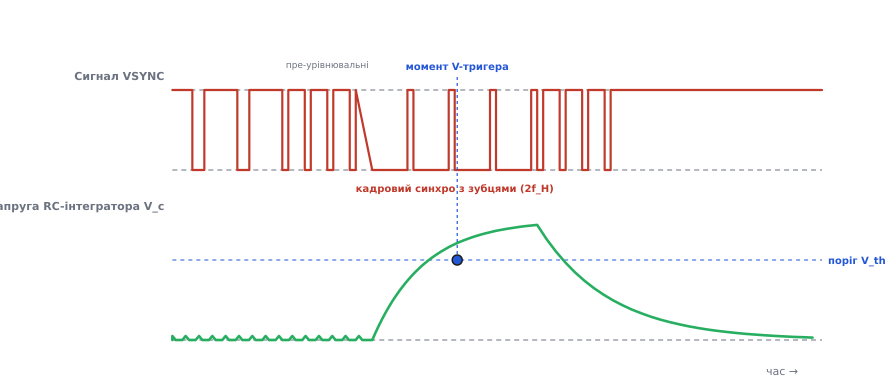
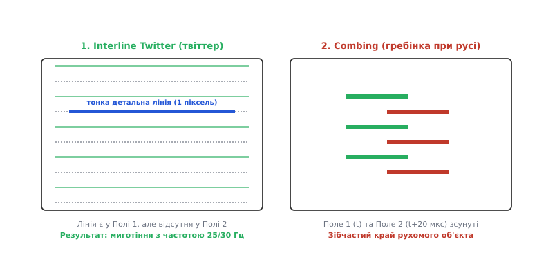

# Черезрядкова розгортка (interlacing): поля, зубчастий vsync, twitter

<preknowlist>
- [Аналоговий відеосигнал](book:communications/analog-video) — формування рядків, рівні чорного й білого, гасіння та принципи горизонтальної розгортки.
- [Частотна модуляція (FM)](book:communications/am-fm) — перенесення аналогового відеосигналу на радіочастоту (TV-мовлення, FPV).
- [RC-фільтр](book:electronics/rc-filter) — робота накопичувального конденсатора для сепарації синхроімпульсів.
</preknowlist>

Коли в 1930-х роках інженери створювали перші системи електронного телебачення, вони зіштовхнулися з жорстким фізичним обмеженням: люмінофор електронно-променевої трубки (CRT) згасає швидко, і якщо оновлювати екран рідше ніж 50 разів на секунду, людське око бачитиме виснажливе миготіння. Проте передавання 50 повних кадрів щосекунди з роздільністю 625 рядків вимагало ширини радіоканалу понад 6.5 МГц, що перевищувало фізичні можливості тогочасних радіопередавачів, приймо-підсилювальних ламп та коаксіальних ліній зв'язку.

Розв'язанням цієї суперечності стала **черезрядкова розгортка** (*interlacing*, від англійського *interlace* — «переплітати»): кадр розбивають на два часових **поля** (*fields*), що передаються послідовно одне за одним. Це дало змогу обдурити фізіологію зору — зберегти плавність руху та відсутність миготіння на частоті 50 Гц за ширини радіоканалу, розрахованої лише на 25 кадрів за секунду.

---

### Поля замість кадрів: економіка смуги та людський зір

При прогресивній розгортці (*progressive scan*) електронний промінь малює всі рядки кадру поспіль від верхнього лівого до нижнього правого кута. Якщо передавати таким способом 50 повних кадрів на секунду, оновлення зображення відбувається абсолютно плавно і без миготіння. Проте смуга частот відеосигналу прямує до фізичної межі:

```
f_max = 0.5 · N_lines · N_pixels_per_line · f_frame
```

де `N_lines` — кількість рядків у кадрі, `N_pixels_per_line` — кількість елементів яскравості уздовж одного рядка, а `f_frame` — частота кадрів. Для 625 рядків при 50 кадрах/с це вимагає ширини спектра понад 6.5 МГц.

Зменшення частоти кадрів до 25 Гц удвічі звужує потрібну смугу частот передавача, але створює фундаментальну психофізіологічну проблему: зоровий аналізатор людини відчуває миготіння екрана на частотах нижче 48–50 Гц. Цей поріг визначається так званою критичною частотою злиття миготінь (*critical flicker fusion frequency*). При 25 Гц екран імпульсно спалахує і гасне, викликаючи швидку втому очей та головний біль вже за кілька хвилин спостереження.

Черезрядкова розгортка розв'язує цю дилему шляхом розділення одного геометричного кадру на два **поля**:
1. **Непарне поле** (*odd field* або *top field*, Поле 1): несе рядки 1, 3, 5, 7, 9...
2. **Парне поле** (*even field* або *bottom field*, Поле 2): несе рядки 2, 4, 6, 8, 10...

Поля передаються у радіоефір або по кабелю одне за одним. Оскільки люмінофор екрана оновлюється кожні `1/50` секунди (20 мс у європейському стандарті PAL/SECAM) або `1/60` секунди (16.67 мс в американському NTSC), око сприймає високу частоту оновлення 50 Гц або 60 Гц, і зорове миготіння повністю зникає. Водночас для передавання всієї інформації про повний кадр потрібен час двох полів (`1/25` секунди), тож ширина частотного спектра відеосигналу залишається точно такою ж, як при прогресивній розгортці зі швидкістю 25 кадрів/с. Детальніше про історію цього винаходу та роботу лабораторії RCA під керівництвом Володимира Зворикіна можна прочитати у [історії винаходу черезрядкової розгортки Рендаллом Баллардом](book:communications/interlacing/hist-ballard-interlace.md).

---

### Геометрія розгортки: чому кількість рядків завжди непарна

Найбільша краса аналогової черезрядкової розгортки полягає у її абсолютній пасивності: для зміщення рядків парного поля відносно непарного не потрібні додаткові електронні перемикачі, генератори затримки або складні сили відхилення променя. Це геометричне зміщення досягається суто в силу того, що **загальна кількість рядків у кадрі є непарним числом**.

Розглянемо стандарт PAL, у якому повний кадр містить `N = 625` рядків. Кожне поле містить точно половину від цієї кількості рядків:

```
N_field = 625 / 2 = 312.5 рядків
```


*Принцип побудови черезрядкового кадру. Ліворуч: Непарне поле (Поле 1) малює 312.5 рядка від верхнього лівого кута до середини нижнього рядка. У центрі: Парне поле (Поле 2) починається з середини верхнього рядка і малює наступні 312.5 рядка. Праворуч: два поля, прокладені одне між одним на екрані, створюють суцільний 625-рядковий кадр із частотою оновлення 50 Гц.*

Прослідкуємо за рухом електронного променя під час формування обох полів у кінескопі або камері:

1. **Формування Непарного поля (Поле 1):**
   Промінь починає рух із верхнього лівого кута екрана (`x = 0, y = 0`). Він сканує непарні рядки послідовно вниз. Оскільки поле містить `312.5` рядка, останній рядок цього поля (рядок 312) закінчується **точно посередині** нижнього краю екрана (`x = 0.5·W, y = H`). У цей момент виникає кадровий синхроімпульс, і вертикальна розгортка повертає промінь угору.

2. **Зворотний хід та початок Парного поля (Поле 2):**
   Під час вертикального зворотного ходу горизонтальна розгортка продовжує працювати у звичайному стаціонарному такті. Оскільки зворотний хід почався з середини нижнього рядка (`x = 0.5·W`), промінь прибуває до верхнього краю екрана **точно в центр першого рядка** (`x = 0.5·W, y = 0`).

3. **Формування Парного поля:**
   Сканування Поля 2 починається від середини верхнього рядка. Через постійний кут нахилу підмітання променя, всі наступні рядки Поля 2 лягають точно у проміжки між рядками Поля 1. Останній рядок Поля 2 закінчується у нижньому правому кутку екрана (`x = W, y = H`), після чого кадровий імпульс повертає промінь у верхній лівий кут (`x = 0, y = 0`) для початку нового Непарного поля.

Співвідношення між частотою рядків `f_H` та частотою полів `f_V` визначається формулою:

```
f_H = 0.5 · N · f_V
```

Для стандарту PAL (`N = 625`, `f_V = 50 Гц`):

```
f_H = 0.5 × 625 × 50 = 15625 Гц
```

Для стандарту NTSC (`N = 525`, `f_V = 59.94 Гц`):

```
f_H = 0.5 × 525 × 59.94 = 15734.25 Гц
```

Завдяки непарній кількості рядків геометричний зсув на `0.5` кроку рядка відбувається самостійно в силу безперервності часу, без жодного цифрового процесора або генератора затримки.

---

### Службові рядки гасіння (VBI) та активний растр

З 625 рядків кадру стандарту PAL не всі містять видиме зображення. Значна частина рядків припадає на **кадровий інтервал гасіння** (*vertical blanking interval*, VBI), під час якого електронний промінь повертається з нижнього краю екрана до верхнього.

У системі PAL кадрове гасіння займає 25 рядків на кожне поле (загалом 50 рядків на кадр):
- **Активні рядки:** 576 рядків (рядки 23–310 у Непарному полі та рядки 336–623 у Парному полі) несуть безпосереднє відеозображення.
- **Службові рядки VBI:** рядки 1–22 та 313–335 використовуються для передавання пре- та пост-урівнювальних імпульсів, кадрового синхроімпульсу, а також телетексту (*teletext*), вимірювальних сигналів та часових міток.

У системі NTSC із 525 рядків активне зображення складає 480–486 рядків, а решта 40–45 рядків відведені під кадрове гасіння та службові дані (включаючи приховані субтитри *closed captioning*).

---

### Зубчастий VSYNC та зрівнювальні імпульси: математика синхронізації

Хоча геометрія розгортки є елегантною, у реальних аналогових приймачах постає важка інженерна проблема. У аналоговому ТВ-приймачі або FPV-окулярах для сепарації кадрового синхроімпульсу (VSYNC) використовують найпростіший пасивний RC-інтегратор (фільтр нижніх частот). Завдання цього ланцюга — ігнорувати короткі рядкові імпульси (тривалістю `4.7 мкс`) і накопичувати заряд під час тривалого кадрового імпульсу, поки напруга на конденсаторі не перетне поріг спрацьовування кадрового тригера `V_th`.

Проте виникає часова асиметрія:
- У Полі 1 останній рядковий імпульс перед кадровим віддалений на **повний період рядка** `T_H = 64 мкс`.
- У Полі 2 останній рядковий імпульс віддалений лише на **половину періоду** `0.5·T_H = 32 мкс` (бо поле закінчилося посередині рядка).

Якщо подати такий сигнал безпосередньо на RC-інтегратор, залишкова напруга на конденсаторі до моменту приходу кадрового імпульсу у Полі 2 буде **вищою**, ніж у Полі 1. Через це напруга на конденсаторі досягне порогу `V_th` у Полі 2 трохи раніше по часу, ніж у Полі 1. Цей невеликий часовий зсув призведе до викривлення точного геометричного зсуву `0.5` рядка: рядки Поля 2 налізуть прямо на рядки Поля 1. Це виснажливе явище називають **злипанням або парністю рядків** (*line pairing*), яке зменшує вертикальну роздільність картинки вдвічі.


*Форма кадрового синхроімпульсу з зубцями (Serrated VSYNC) та перехідний процес в RC-інтеграторі. Перед кадровим імпульсом додаються короткі пре-урівнювальні імпульси з частотою 2f_H (період 32 мкс). Сам кадровий імпульс розрізаний «зубцями» (вирізами) з тією ж частотою 2f_H, щоб рядковий генератор приймача не втрачав фазу під час довгого кадрового провалу. Нижня крива показує напругу на конденсаторі RC-інтегратора, яка перетинає поріг V_th точно в один і той самий момент для обох полів.*

Щоб повністю ліквідувати цю асиметрію, у телевізійний стандарт ввели спеціальну структуру кадрового синхроінтервалу:

1. **Пре-урівнювальні імпульси (*pre-equalizing pulses*):** серія з 5 коротких імпульсів із **подвоєною частотою** `2·f_H` (з інтервалом `32 мкс`). Вони розряджають і вирівнюють заряд накопичувального конденсатора RC-інтегратора перед кадровим імпульсом, роблячи початковий стан заряду для обох полів абсолютно однаковим.
2. **Зубчастий кадровий імпульс (*serrated vertical sync*):** довгий кадровий провал розділяють вузькими позитивними «зубцями» з частотою `2·f_H`. Ці зубці виконують подвійну роль: вони продовжують заряджати RC-інтегратор для утримання кадрової розгортки, і водночас тактують рядковий генератор розгортки, не даючи йому збитися з фази протягом тривалого кадрового гасіння.
3. **Пост-урівнювальні імпульси (*post-equalizing pulses*):** 5 коротких імпульсів з частотою `2·f_H` після кадрового імпульсу, які симетрично повертають RC-інтегратор у вихідний стан для початку нового поля.

Детальний вивід рівнянь накопичення заряду конденсатора та математичний доказ усунення часового зсуву `Δt_tr` можна знайти у [математичному розрахунку RC-інтегратора та урівнювальних імпульсів](book:communications/interlacing/math-serrated-integrator.md).

---

### Артефакти черезрядковості: Interline Twitter та Combing (Гребінка)

Хоча черезрядкова розгортка чудово працювала на кінескопах із плавним згасанням люмінофора, вона має два фундаментальних просторово-часових артефакти, які проявляються при спробі відобразити дрібні деталі або швидкий рух.


*Артефакти черезрядковості. Зліва (Interline Twitter): тонка горизонтальна лінія товщиною в 1 піксель потрапляє лише в непарне поле (Поле 1), але відсутня у парному (Поле 2), викликаючи миготіння з частотою кадрів 25/30 Гц. Справа (Combing): при швидкорухомому об'єкті Поле 1 (t) та Поле 2 (t+20 мс) фіксують його у різних просторових позиціях; при зведенні полів в один кадр на вертикальних межах виникає зібчастий край («гребінка»).*

#### 1. Interline Twitter (мерехтіння тонких горизонтальних деталей)

Якщо на зображенні є чітка горизонтальна лінія товщиною в один піксель (наприклад, верхній край вікна, дрібний шрифт або смугаста сорочка), ця лінія цілком потрапляє лише у непарні рядки (Поле 1) і повністю відсутня у парних рядках (Поле 2).

У результаті ця лінія оновлюється не з частотою полів (50 Гц / 60 Гц), а з частотою повноцінних кадрів — **25 Гц або 30 Гц**. Оскільки частота 25 Гц лежить значно нижче критичної межі злиття миготінь, ця деталь починає інтенсивно й виснажливо вібрувати на екрані. Цей ефект називають **мерехтінням тонких ліній** або **Interline Twitter** (від англійського *twitter* — «щебетання/вібрація»).

Для боротьби з твіттером у студійному відеообладнанні застосовують вертикальний фільтр нижніх частот (*anti-twitter filter*), який злегка розмиває гострі вертикальні межі між сусідніми рядками, розподіляючи яскравість тонкої лінії між непарним і парним полями.

#### 2. Combing / Serration (гребінчастість або «гребінка»)

Другий артефакт виникає під час руху об'єктів у кадрі. Оскільки Поле 1 знімається у момент часу `t = 0 мс`, а Поле 2 — у момент `t = +20 мс` (у системі PAL), швидкорухомий об'єкт встигає зміститися по горизонталі за цей інтервал.

Якщо спробувати об'єднати ці два поля у один прогресивний кадр на моніторі комп'ютера без обробки, непарні рядки покажуть об'єкт у позиції `x1`, а парні — у позиції `x2`. На бічних межах рухомого об'єкта виникне характерний зубчастий край, схожий на зубці гребінця. Цей артефакт називають **гребінчастістю** (*combing*).

---

### Коефіцієнт Келла та реальна вертикальна роздільність

У суто теоретичній моделі 625-рядковий аналоговий кадр має надавати 625 елементів роздільності по вертикалі. Проте через випадкове розташування деталей зображення відносно сітки розгортки реальна чіткість завжди нижча.

Співвідношення між реальною вертикальною роздільністю та кількістю рядків описується емпіричним **коефіцієнтом Келла** (*Kell factor*, `K`):

```
N_vert_effective = K · N_active_lines
```

Для прогресивної розгортки коефіцієнт Келла становить близько `K ≈ 0.70`. Проте для черезрядкової розгортки через вплив артефакту Interline Twitter та міжрядкового аліасингу значення коефіцієнта Келла падає до `K ≈ 0.50 ... 0.60`.

Це означає, що аналоговий кадр стандарту PAL із 576 активними рядками у реальності забезпечує лише близько 300–350 ліній ефективної вертикальної чіткості для рухомих об'єктів.

---

### Деінтерлейсинг у цифрову епоху: Weave, Bob та Motion-Adaptive

Сучасні рідкокристалічні (LCD) та OLED-дисплеї за своєю природою є **прогресивними**: вони оновлюють усі пікселі матриці одночасно. Коли на такий екран подають аналогове черезрядкове відео (наприклад, сигнал з аналогової FPV-камери CVBS або зі старого відеомагнітофона), виникає потреба перетворити послідовність полів у прогресивні кадри. Цей процес називається **деінтерлейсингом** (*deinterlacing*).

Існує три основних класи алгоритмів деінтерлейсингу:

1. **Weave («переплетення»):**
   Алгоритм просто складає непарне поле `t` та парне поле `t + 20 мс` у єдиний кадровий буфер.
   - *Переваги:* Ідеальна вертикальна чіткість для непорушного фону.
   - *Недоліки:* Жахливий артефакт гребінки (combing) на всіх рухомих об'єктах.

2. **Bob («подвоєння» / просторова інтерполяція):**
   Алгоритм бере одне поле (наприклад, непарне) і масштабує його по вертикалі удвічі, обчислюючи відсутні парні рядки як середнє арифметичне між сусідніми непарними: `line[2] = (line[1] + line[3]) / 2`.
   - *Переваги:* Повна відсутність гребінки при будь-якій швидкості руху.
   - *Недоліки:* Вертикальна роздільність зображення падає вдвічі, а горизонтальні межі стають розмитими та східчастими (артефакт *staircasing*).

3. **Motion-Adaptive Deinterlacing (адаптивний до руху деінтерлейсинг):**
   Сучасний стандарт цифрової обробки. Відеопроцесор порівнює поточне поле з попереднім полем тієї самої парності для кожного пікселя окремо:
   - На нерухомих ділянках кадру (де різниця між полями близька до нуля) процесор застосовує метод **Weave**, зберігаючи 100% чіткості деталей.
   - На рухомих ділянках (де виявлено різницю яскравості) процесор перемикається на метод **Bob** або просторову спрямовану інтерполяцію (ELA — *Edge-Based Line Averaging*), усуваючи гребінку.

Ознайомитися з реалізацією такого деінтерлейсера на практиці можна у матеріалі [програмну реалізацію адаптивного деінтерлейсера на C та C++](book:communications/interlacing/proj-deinterlacer.md).

---

### Черезрядковість у сучасних FPV-системах

Аналоговий відеосигнал CVBS, який використовується у спортивних та тактичних FPV-дронах, у повній мірі зберігає черезрядкову структуру сигналів NTSC (525/60) та PAL (625/50).

Камера спортивного дрона генерує непарні та парні поля послідовно з частотою 60 Гц або 50 Гц. Ресивер FPV-окулярів приймає цей сигнал через [частотну модуляцію (FM)](book:communications/am-fm) на частоті 5.8 ГГц і видає його на внутрішні Micro-OLED екрани.

Сучасні FPV-окуляри (наприклад, FatShark або Skyzone) містять вбудований цифровий відеопроцесор деінтерлейсингу. Вони дозволяють пілоту вибирати режим обробки:
- **Режим «Bob» (Fast):** кожне поле негайно розгортається на весь екран з затримкою менше 1 мс. Це дає максимальну оперативність для швидкого пілотування, але ціною зниженої вертикальної чіткості.
- **Режим «Weave/Adaptive» (Quality):** відеопроцесор об'єднує поля для покращення чіткості OSD-телеметрії, додаючи затримку близько 20 мс (одне поле).

---

### Практичний розрахунок таймінгу та фільтрація твіттера у прошивці

При розробці систем збору відеоданих або OSD-модулів (On-Screen Display для FPV-дронів) мікроконтролер мусит точно розраховувати тривалість рядків і синхронізувати піксельний такт із відеопотоком.

#### Обчислення рядкового таймінгу для PAL

Для системи PAL із 625 рядками та частотою 50 полів/с:

```
line_rate = 625 × 25            = 15625 рядків/с
line_time = 1 / 15625           = 64.0 мкс на рядок
active_time                     ≈ 52.0 мкс (активне відео без гасіння)
```

За час активної частини рядка `52.0 мкс` мікроконтролер із частотою піксельного такту `8 МГц` встигає згенерувати або зчитати точно `8·10⁶ × 52·10⁻⁶ = 416` пікселів.

Нижче наведено практичну програму на C та C++, яка розраховує координати полів та виконує фільтрацію Interline Twitter над кадровим буфером.

:::tabs
```c
// interlacing_calc.c — обчислення полів та анти-твіттер фільтр на C
#include <stdio.h>
#include <stdint.h>
#include <stdbool.h>

#define PAL_LINES 625
#define PAL_FIELD_RATE 50.0f
#define WIDTH 720
#define HEIGHT 576

// Структура для зберігання параметрів розгортки
typedef struct {
    float line_time_us;
    float active_video_us;
    uint32_t total_pixels_per_line;
} VideoTiming;

VideoTiming compute_pal_timing(float pixel_clock_mhz) {
    VideoTiming t;
    float line_rate = (PAL_LINES / 2.0f) * PAL_FIELD_RATE; // 15625 Гц
    t.line_time_us = (1.0f / line_rate) * 1.0e6f;          // 64.0 мкс
    t.active_video_us = 52.0f;                             // 52.0 мкс
    t.total_pixels_per_line = (uint32_t)(pixel_clock_mhz * t.active_video_us);
    return t;
}

// Вертикальний Anti-Twitter фільтр (згладжування яскравості між непарними та парними рядками)
void apply_anti_twitter_filter(uint8_t frame[HEIGHT][WIDTH]) {
    for (int y = 1; y < HEIGHT - 1; y++) {
        for (int x = 0; x < WIDTH; x++) {
            // Зважене усереднення 1:2:1 вздовж вертикалі
            uint16_t val = (uint16_t)frame[y - 1][x] + 
                           2 * (uint16_t)frame[y][x] + 
                           (uint16_t)frame[y + 1][x];
            frame[y][x] = (uint8_t)(val / 4);
        }
    }
}
```
```cpp
// interlacing_calc.cpp — обчислення полів та анти-твіттер фільтр на C++
#include <iostream>
#include <vector>
#include <cstdint>
#include <span>

struct VideoTiming {
    float lineTimeUs;
    float activeVideoUs;
    uint32_t totalPixelsPerLine;
};

class InterlacingProcessor {
public:
    static constexpr uint32_t PalLines = 625;
    static constexpr float PalFieldRate = 50.0f;
    static constexpr size_t Width = 720;
    static constexpr size_t Height = 576;

    static constexpr VideoTiming computePalTiming(float pixelClockMhz) noexcept {
        const float lineRate = (PalLines / 2.0f) * PalFieldRate;
        const float lineTimeUs = (1.0f / lineRate) * 1.0e6f;
        const float activeVideoUs = 52.0f;
        const uint32_t totalPixels = static_cast<uint32_t>(pixelClockMhz * activeVideoUs);
        return VideoTiming{lineTimeUs, activeVideoUs, totalPixels};
    }

    // Anti-Twitter фільтр з використанням std::span для безпечного доступу до пам'яті
    static void applyAntiTwitterFilter(std::span<uint8_t> frameBuffer) {
        if (frameBuffer.size() < Width * Height) return;

        for (size_t y = 1; y < Height - 1; ++y) {
            for (size_t x = 0; x < Width; ++x) {
                const size_t currIdx = y * Width + x;
                const size_t topIdx  = (y - 1) * Width + x;
                const size_t botIdx  = (y + 1) * Width + x;

                const uint16_t val = static_cast<uint16_t>(frameBuffer[topIdx]) +
                                     2 * static_cast<uint16_t>(frameBuffer[currIdx]) +
                                     static_cast<uint16_t>(frameBuffer[botIdx]);

                frameBuffer[currIdx] = static_cast<uint8_t>(val / 4);
            }
        }
    }
};
```
:::

Завдяки розумінню геометрії полів, зубчастих синхроімпульсів та артефактів розгортки, інженер може грамотно проектувати як аналогові FPV-відеосистеми, так і цифрові алгоритми деінтерлейсингу та обробки сигналів.
