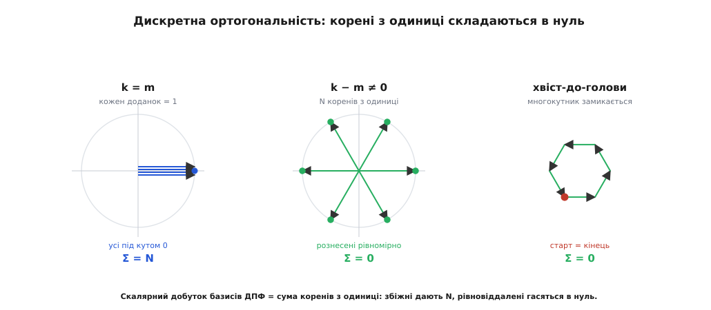

# 🧮 Математика OFDM: ортогональність, зворотне ДПФ і циклічний префікс

Три твердження тримають усю OFDM, і кожне тут виводиться просто з означення: піднесні з кроком Δf = 1/T взаємно **ортогональні**; сума N піднесних із символами X_k — це *точно* зворотне ДПФ цих символів; а **циклічний префікс** обертає дію каналу на один комплексний множник H_k на кожній піднесній. Ніде не буде «очевидно» — лише інтеграли та скінченні суми.

## Піднесна як функція, «не заважають» як нуль

Одна піднесна за час символу T — це комплексна експонента сталої частоти:

```
φ_k(t) = e^{j2πk·Δf·t},   Δf = 1/T,   t ∈ [0, T)
```

Ціле k нумерує піднесну, Δf — крок по частоті. Що означає «дві піднесні не заважають одна одній»? Що приймач, який виділяє k-ту, у відповіді на m-ту (k ≠ m) бачить рівно нуль. Виділення — це усереднений за символ добуток сигналу на спряжену піднесну, тобто скалярний добуток функцій:

```
⟨φ_k, φ_m⟩ = (1/T) ∫₀ᵀ φ_k(t)·φ_m*(t) dt
```

Зірочка — комплексне спряження (φ_m* = e^{−j2πm·Δf·t}). «Ортогональні» означає рівно одне: цей інтеграл дорівнює нулю для k ≠ m.

## Інтеграл добутку за період

Перемножмо піднесні й підставмо Δf = 1/T. Показники додаються, лишається одна експонента:

```
⟨φ_k, φ_m⟩ = (1/T) ∫₀ᵀ e^{j2π(k−m)t/T} dt
```

Позначмо n = k − m — ціле число. Далі два випадки.

**n = 0 (та сама піднесна).** Підінтегральна функція = e⁰ = 1:

```
(1/T) ∫₀ᵀ 1 dt = (1/T)·T = 1
```

**n ≠ 0 (різні піднесні).** Первісна експоненти — вона сама, поділена на свій показник:

```
∫₀ᵀ e^{j2πnt/T} dt = [ T / (j2πn) ]·( e^{j2πn} − 1 )
```

Ось де все вирішується. За час T показник добігає рівно n повних обертів навколо кола, а повний оберт вертає експоненту в 1:

```
e^{j2πn} = cos(2πn) + j·sin(2πn) = 1 + j·0 = 1   (для цілого n)
```

Отже дужка (e^{j2πn} − 1) = 0, і весь інтеграл — нуль. Разом:

```
⟨φ_k, φ_m⟩ = δ_{km} = { 1,  k = m
                       { 0,  k ≠ m
```

Це δ Кронекера: піднесні не просто ортогональні, а ще й одиничної «довжини». Приймач, множачи прийняте на φ_k* й усереднюючи, дістає внесок лише k-ї піднесної — решта самоскасовуються.

Тепер видно, **чому крок мусить бути саме 1/T**. Візьмімо довільний крок Δf і повторімо викладку для сусідів (k − m = 1):

```
∫₀ᵀ e^{j2π·Δf·t} dt = [ e^{j2π·Δf·T} − 1 ] / (j2π·Δf)
```

Ця дужка стає нулем лише коли Δf·T — ціле, а найменший робочий варіант — Δf·T = 1, тобто Δf = 1/T. Зсунь крок хоч трохи — показник не добігає до повного оберту, дужка ненульова, і піднесні починають протікати одна в одну. Величину протікання дає модуль:

```
|⟨φ_k, φ_m⟩| = |sinc((k−m)·Δf·T)|,   sinc(x) = sin(πx)/(πx)
```

При Δf = 1/T аргумент (k−m) — ненульове ціле, а sinc від цілого = 0. Звідси ж, як побачимо, і форма спектра піднесної.

## Від неперервного до дискретного: сума піднесних — це зворотне ДПФ

Передавач не інтегрує — він рахує відліки. Складімо N піднесних із символами-амплітудами X_k:

```
s(t) = Σ_{k=0}^{N−1} X_k · e^{j2πk·Δf·t}
```

і візьмімо N рівномірних відліків за символ, у моменти t_n = n·(T/N), n = 0…N−1. Підставмо Δf = 1/T; тривалість T скорочується начисто:

```
s[n] = s(t_n) = Σ_{k=0}^{N−1} X_k · e^{j2πk·(nT/N)/T}
             = Σ_{k=0}^{N−1} X_k · e^{j2πkn/N}
```

Порівняймо з означенням зворотного дискретного перетворення Фур'є:

```
IDFT:   x[n] = (1/N) Σ_{k=0}^{N−1} X_k · e^{+j2πkn/N}
```

Це та сама сума з точністю до сталого множника: s[n] = N·x[n]. Тобто «породити N піднесних і скласти їх» і «взяти зворотне ДПФ символів» — буквально одна операція; масштаб N — лише питання того, куди віднести нормування 1/N. Тому передавач — один виклик IFFT, а не N окремих генераторів. Строгіше про пряме й зворотне перетворення — у [ДПФ](topic:math/dft).

Лишилась одна тонкість: чому пряме ДПФ на прийомі *чисто* вертає символи назад? Бо базисні вектори e^{j2πkn/N} ортогональні вже у скінченній сумі. Перевірмо — їхній скалярний добуток це геометрична прогресія:

```
Σ_{n=0}^{N−1} e^{j2πkn/N}·e^{−j2πmn/N} = Σ_{n=0}^{N−1} r^n,   r = e^{j2π(k−m)/N}
```

Знову два випадки, і знову все впирається в «повний оберт = 1»:

```
k ≡ m (mod N):  r = 1  →  Σ = N
інакше:         Σ = (r^N − 1)/(r − 1) = (e^{j2π(k−m)} − 1)/(r − 1) = 0
```

бо r^N = e^{j2π(k−m)} = 1 (цілий показник), а знаменник r − 1 ≠ 0. Отже сума = N·δ_{km} — те саме, що інтеграл, лише в дискреті. Геометрично доданки r⁰, r¹, …, r^{N−1} — це N рівновіддалених по колу [коренів з одиниці](topic:math/roots-of-unity): коли вони дивляться в один бік (r = 1), то складаються в N; коли рознесені рівномірно — гасять одне одного дощенту.


*Дискретна ортогональність очима векторів: рівновіддалені корені з одиниці (k ≠ m) складаються хвіст-до-голови в замкнений многокутник — сума нуль; збіжні (k = m) дають N.*

## sinc-спектр: пік однієї — на нулях сусідів

Ортогональність має і частотне обличчя. Кожна піднесна живе лише скінченний час T — це експонента, помножена на прямокутне вікно тривалості T. Її спектр — інтеграл Фур'є за цим вікном:

```
X_k(f) = ∫₀ᵀ e^{j2πf_k·t} · e^{−j2πf·t} dt,   f_k = k·Δf
       = ∫₀ᵀ e^{−j2π(f−f_k)·t} dt                  [додавання показників експонент]
       = T · e^{−jπ(f−f_k)T} · sinc((f − f_k)·T)   [обчислення визначеного інтеграла]
```

Модуль — чистий sinc, зсунутий на частоту піднесної:

```
|X_k(f)| = T · |sinc((f − f_k)·T)|
```

Пік — у f = f_k (там sinc(0) = 1). А нулі — там, де аргумент цілий і ненульовий:

```
(f − f_k)·T = ±1, ±2, …   ⇒   f = f_k ± 1/T, f_k ± 2/T, …
                                 = f_k ± Δf, f_k ± 2Δf, …
```

Нулі кожної піднесної падають рівно на центри всіх інших. Тому, зчитуючи спектр точно в точках f_m, приймач у кожній бачить лише «свою» піднесну на піку, а решта там — у нулях, попри те що криві густо перекриваються.

**Числом (Wi-Fi, канал 20 МГц).**
```
T  = 3.2 мкс              →  Δf = 1/T = 312.5 кГц
нулі sinc піднесної f_k :   f_k ± 312.5 кГц,  f_k ± 625 кГц,  …
```
А 312.5 кГц — це і є крок до сусідньої піднесної. Пік сидить точно на її нулі; жодних захисних проміжків не потрібно.

## Циклічний префікс: лінійна згортка → кільцева

Лишилося показати, звідки береться «один множник на піднесну» після каналу. Багатопроменевий канал із відліковою імпульсною відповіддю h[l] діє **лінійною згорткою**:

```
y_lin[n] = Σ_l h[l]·x[n − l]
```

а ДПФ діагоналізує не її, а **кільцеву** (циклічну) згортку — це теорема згортки для ДПФ:

```
DFT{ h ⊛ x }[k] = H_k · X_k,   H_k = DFT{h},   ⊛ — кільцева згортка
```

Ось розрив: канал дає лінійну згортку, а множником на піднесну стає лише кільцева. Циклічний префікс цей розрив і зшиває. Скопіюймо останні L відліків символу наперед (L — не менше пам'яті каналу). На прикладі N = 4, канал h = [1, 0.5] (пам'ять 1, тож досить L = 1):

```
символ:       x = [x₀, x₁, x₂, x₃]
з префіксом:  t = [x₃ | x₀, x₁, x₂, x₃]     (хвіст x₃ скопійовано наперед)
```

Проженімо t крізь канал (y[n] = t[n+1] + 0.5·t[n]) і викиньмо відлік, що припав на префікс:

```
y[0] = x₀ + 0.5·x₃
y[1] = x₁ + 0.5·x₀
y[2] = x₂ + 0.5·x₁
y[3] = x₃ + 0.5·x₂
```

Тепер порахуймо, чого хотіла б кільцева згортка (h ⊛ x)[n] = x[n] + 0.5·x[(n−1) mod 4]:

```
(h⊛x)[0] = x₀ + 0.5·x₃      ← x[(−1) mod 4] = x₃
(h⊛x)[1] = x₁ + 0.5·x₀
(h⊛x)[2] = x₂ + 0.5·x₁
(h⊛x)[3] = x₃ + 0.5·x₂
```

Збіг відлік у відлік. Уся робота припала на єдиний доданок 0.5·x₃ у y[0]: лінійна згортка тут сягає по x[−1] — «уліво за межу символу». Без префікса на цьому місці стояв би хвіст *попереднього* символу (це і є міжсимвольне спотворення), а префікс підставив туди власний x₃ — рівно те, чого просить mod 4. Кільце замкнулося.

![Два рядки відліків: без префікса вікно каналу для y[0] сягає у хвіст попереднього символу (спотворення); з префіксом на цьому місці стоїть скопійований x₃, і згортка стає кільцевою](/book/communications/modulation/ofdm/img/cyclic-prefix.svg)
*Той самий відлік y[0]: без префікса його другий доданок — із невідомого хвоста попереднього символу; циклічний префікс кладе туди власний x₃, і лінійна згортка стає кільцевою.*

Далі — просто ДПФ від обох боків рівності y = h ⊛ x:

```
Y_k = DFT{y}[k] = DFT{h ⊛ x}[k] = H_k · X_k
```

Канал звівся до одного комплексного множника H_k на кожній піднесній. Для нашого прикладу H_k = DFT{[1, 0.5, 0, 0]} = 1 + 0.5·e^{−j2πk/4}:

```
H_0 = 1 + 0.5          = 1.5
H_1 = 1 + 0.5·e^{−jπ/2}  = 1 − 0.5j
H_2 = 1 + 0.5·e^{−jπ}    = 0.5
H_3 = 1 + 0.5·e^{−j3π/2} = 1 + 0.5j
```

> 🔧 **Навіщо це.** Коли канал — це множник Y_k = H_k·X_k, вирівнювання стає діленням: X̂_k = Y_k / H_k, по одному комплексному діленню на піднесну. Замість матричного вирівнювача на всю смугу — N незалежних скалярних поправок; саме тут ховається обіцяна OFDM дешевизна прийому.

Умова, за якої все це чинне, одна: префікс має бути не коротшим за пам'ять каналу (розкид затримок у відліках, [delay spread](topic:communications/delay-spread)). Якщо луна виходить за префікс, кільце не замикається — у y просочуються доданки сусіднього символу, і з ними повертаються і спотворення, і втрата ортогональності. Сама ж кільцева згортка та її діагоналізація перетворенням Фур'є — окремий сюжет [кільцевої згортки](topic:math/circular-convolution).
