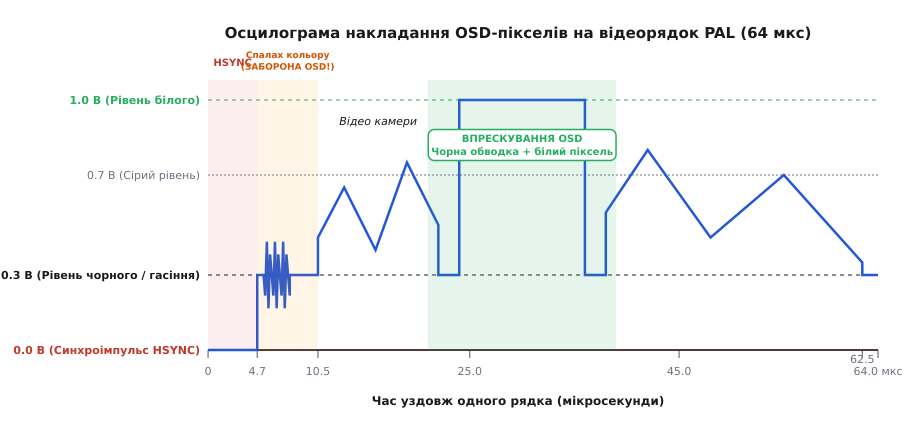
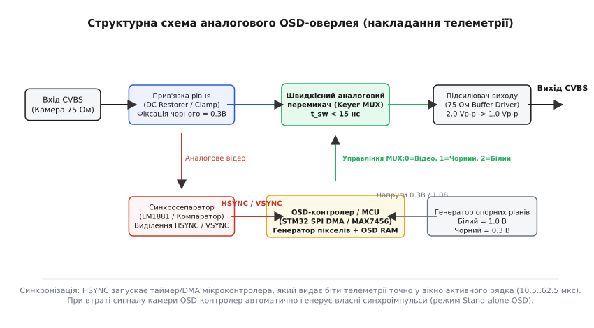
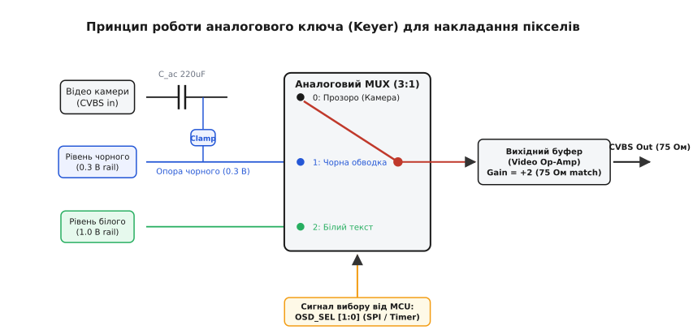

# OSD-накладання телеметрії на аналоговий відеосигнал

<preknowlist>
- [Аналоговий відеосигнал: рядки, кадри, синхро (FPV)](book:communications/analog-video) — структура композитного відеосигналу CVBS, синхроімпульси HSYNC/VSYNC, рівні чорного й білого, таймінг рядка PAL/NTSC.
- [Частотна модуляція (FM)](book:communications/am-fm) — принципи передачі відеосигналу в ефірі на частоті 5.8 ГГц.
</preknowlist>

Коли швидкісний безпілотний апарат мчить між перешкодами на швидкості понад сто кілометрів на годину, пілот у FPV-окулярах не має фізичної змоги відводити погляд на окремий екран приладової панелі чи наземної станції. Напруга бортового акумулятора, поточний споживаний струм, орієнтація штучного горизонту, рівень приймання радіосигналу (RSSI) та GPS-координати мусять відображатися прямо поверх польотного відеопотоку. У цифрових системах відеоспостереження це завдання вирішується просто: відеопроцесор приймає цифровий кадр у матрицю оперативної пам'яті, малює поверх нього графічний шар телеметрії та кодує підсумковий потік апаратним кодеком H.264 або H.265. Проте ці операції стиснення, буферизації та декодування вимагають повного кадрового буфера й створюють неминучу затримку від `30` до `80` мілісекунд, що для швидкісного гоночного або тактичного пілотування є критичним і неприпустимим.

У класичному аналоговому FPV-відеопотоці немає ані кадрового буфера, ані цифрової сітки пікселів. Відеосигнал несеться як неперервна зміна напруги в часі, що біжить по коаксіальному кабелю зі швидкістю п'ятнадцяти тисяч рядків на секунду. Щоб зберегти нульову затримку аналогового відео (`< 1 мкс`), технологія **OSD** (*On-Screen Display* — відображення на екрані) впорскує графічні пікселі безпосередньо в аналогову хвилю відеосигналу «на льоту». Високошвидкісний електронний ключ підміняє напругу камери на калібровані рівні чорного й білого точно в ті мікросекунди, коли електронний промінь приймача пробігає потрібну точку екрана.

---

### Anatomy рядка: куди можна й куди заборонено ставити пікселі

Композитний аналоговий відеосигнал (CVBS) несе інформацію про зображення як послідовне варіювання напруги від `0.0 В` до `1.0 В` на стандартному навантаженні `75 Ом`. Напруга `0.3 В` відповідає рівням чорного кольору та гасіння, а `1.0 В` — найяскравішому білому кольору. Спад напруги нижче чорного (від `0.3 В` до `0.0 В`) слугує службовою міткою синхронізації `HSYNC`, яка вказує приймачу на початок нового рядка.

Щоб накласти текст телеметрії на відеоряд без спотворення картинки й зсуву розгортки, OSD-пристрій мусить суворо дотримуватися часового розкладу кожного рядка. У стандарті PAL один рядок триває рівно `64.0 мкс` і ділиться на чотири принципово різні часові зони.


*Часовий розклад одного рядка PAL (64 мкс). Впорскування OSD-пікселів дозволено виключно у вікні активного відео (10.5..62.5 мкс). Потрапляння пікселів у зону спалаху кольору (4.7..10.5 мкс) вбиває колірну синхронізацію декодера.*

Перші `4.7 мкс` займає рядковий синхроімпульс `HSYNC`, який падає до рівню `0.0 В`. За ним іде задня площадка гасіння (*Back Porch*) тривалістю `5.8 мкс` (інтервал від `4.7` до `10.5 мкс`). У цій зоні лежить **спалах кольору** (*Color Burst*) — короткий цуг із 8–10 періодів синусоїди з частотою `4.43 МГц` (для PAL) або `3.58 МГц` (для NTSC), який калібрує фазовий декодер кольоровості в окулярах пілота.

> ⚠️ **Критичне обмеження.** Накладання OSD-пікселів у зоні від `0.0` до `10.5 мкс` суворо заборонено! Якщо OSD-ключ зреагує зашвидко й спотворить спалах кольору чи синхроімпульс, колірний декодер приймача втратить фазову синхронізацію. У результаті екран в окулярах вкриється вертикальними кольоровими смугами або повністю перейде в чорно-білий режим із розривом рядків.

Тільки починаючи з `10.5 мкс` і до `62.5 мкс` триває **активна зона відео** (`52.0 мкс`), у якій напруга камери формує видиме зображення. Саме в це вікно OSD-контролер може впорскувати власні імпульси напруги. Замикає рядок передня площадка гасіння (*Front Porch*) тривалістю `1.5 мкс`.

Порівняємо часовий бюджет рядка для двох головних аналогових відеостандартів:

```
Часовий розклад відеорядка:

Стандарт PAL (625 рядків, 25 Гц, T_line = 64.0 мкс):
├─ HSYNC (0.0V):          0.0 ..  4.7 мкс (4.7 мкс)
├─ Back Porch & Burst:    4.7 .. 10.5 мкс (5.8 мкс) ──► ЗАБОРОНА OSD
├─ Active Video:         10.5 .. 62.5 мкс (52.0 мкс) ─► ЗОНА ВПОРСКУВАННЯ OSD
└─ Front Porch:          62.5 .. 64.0 мкс (1.5 мкс)

Стандарт NTSC (525 рядків, 29.97 Гц, T_line = 63.55 мкс):
├─ HSYNC (0.0V):          0.0 ..  4.7 мкс (4.7 мкс)
├─ Back Porch & Burst:    4.7 ..  9.4 мкс (4.7 мкс) ──► ЗАБОРОНА OSD
├─ Active Video:          9.4 .. 62.0 мкс (52.6 мкс) ─► ЗОНА ВПОРСКУВАННЯ OSD
└─ Front Porch:          62.0 .. 63.55 мкс (1.55 мкс)
```

Завдяки суворому виділенню вікна активного відео OSD-контролер гарантує, що жоден піксель не потрапить на службові інтервали гасіння й не завадить функціонуванню фазового декодера кольоровості.

Фізична причина такої суворості полягає у спектральному розділенні сигналу CVBS. Яскравісна складова `Y(t)` займає смугу від `0` до `3 МГц`, а колірні різницеві сигнали `U(t)` та `V(t)` модулюють квадратурну піднесучу `4.433 МГц`. Спалах кольору (*Color Burst*) на інтервалі від `5.3` до `7.8 мкс` передає опорну фазу цієї піднесучої. Якщо OSD-впорскування зачепить цей інтервал, піднесучий генератор приймача синхронізується від прямокутних фронтів OSD-пікселів замість синусоїди камери, що викличе спотворення кольорів (*Color Shift*) по всьому кадру.

Строгий алгебраїчний вивід часового бюджету та обчислення частоти піксельного такту подано у вставці [розрахунку часового бюджету рядка та піксельного такту](book:communications/osd-overlay/math-pixel-timing.md).

---

### Фізика накладання: чорно-білий контраст та аналоговий ключ

Проста ідея — змішати сигнал камери з виходом мікроконтролера через простий резистивний підсумовувач — у реальності виявляється непридатною. Якщо підтягувати напругу відеосигналу через резистор, то на світлому тлі (наприклад, на тлі білих хмар у сонячний день) білий текст OSD стане абсолютно невидимим, оскільки напруга камери вже сягає граничних `1.0 В`. Натомість на темній землі чорний текст зливатиметься із тлом.

Крім того, підключення додаткового резистора змінює підсумковий імпеданс лінії `75 Ом`, викликаючи зсув постійної складової напруги й просідання амплітуди рядкових синхроімпульсів `HSYNC`, що призводить до зриву кадрової синхронізації монітора.

Для забезпечення чіткої читабельності за будь-яких умов освітлення телеметрія OSD малюється за принципом **двох рівнів з контрастною обводкою**: білі символи (`1.0 В`) обов'язково оточуються чорним контуром завширшки в один-два пікселі (`0.3 В`). Завдяки такій обводці білі літери виразно читаються на тлі яскравого неба, а чорний контур робить їх контрастними проти темної землі чи лісу.


*Структура OSD-оверлея. Сигнал від камери проходить через фіксатор рівня (DC Clamp) на надшвидкісний аналоговий мультиплексор. Синхросепаратор виділяє імпульси HSYNC, запускаючи генератор пікселів OSD-контролера.*

Щоб сформувати такі чіткі межі пікселів без спотворення решти відео ряду, використовують **аналоговий відеоключ** (*Video Keyer*). Його основою є надшвидкісний аналоговий мультиплексор КМОН із часом перемикання менше ніж `15 нс`.


*Схема аналогового ключа (Keyer MUX). У прозорому режимі ключ пропускає відео камери (вхід 0). При малюванні обводки ключ перемикається на опору 0.3 В (вхід 1), а при малюванні тексту — на 1.0 В (вхід 2).*

Перемикач працює у трьох станах за сигналом від графічного контролера:

1. **Режим 0 (Прозорий):** Вихід зв'язаний із лінією камери. Аналоговий сигнал проходить на підсилювач без змін.
2. **Режим 1 (Чорний контур):** Лінія камери миттєво відключається, а на вихід подається калібрована опора напруги `0.3 В`.
3. **Режим 2 (Білий символ):** Лінія камери відключається, на вихід подається калібрована опора напруги `1.0 В`.

Зміна стану ключа відбувається за лічені наносекунди, що створює вертикальні фронти напруги й дає ідеально гострі межі літер на екрані без «хвостів» і розмиття.

```
Сплайсинг відеосигналу аналоговим мультиплексором:

Відео камери ─── [0.5V] ───┐
Рівень чорного ── [0.3V] ──┼─► [Analog MUX (t_sw < 15ns)] ──► Вихідний OSD потік (CVBS)
Рівень білого ─── [1.0V] ──┘
                             ▲
                             │ Спеціальний 2-бітний сигнал управління пікселем
```

Динамічний опір перемикача `R_DS(on)` у відкритому стані становить менше `5 Ом`, що практично не вносить згасання в лінію камери. Паразитна ємність ключів `C_on < 10 пФ` гарантує відсутність високочастотного завалювання колірної піднесучої.

Детальний розбір принципу роботи та компонентної бази ключа описано у вставці [докладною схемою аналогового відеоключа](book:communications/osd-overlay/comp-analog-keyer.md). З історичним шляхом від перших телевізійних декодерів телетексту до сучасних FPV-чипів можна ознайомитися в вставці [історією розвитку від телетексту до OSD-чипів](book:communications/osd-overlay/hist-osd-evolution.md).

---

### Виділення синхронізації та аварійний режим Stand-alone OSD

Для того щоб OSD-контролер знав, у який саме момент починати відлік мікросекунд для малювання пікселя, йому потрібен точний часовий орієнтир. Цю функцію виконує **аналоговий сепаратор синхросигналу** (наприклад, класична мікросхема LM1881 або вбудований прецизійний компаратор).

Сепаратор зчитує вхідне композитне відео й порівнює його напругу з опорним порогом `0.15 В` (середина між рівнем чорного `0.3 В` та рівнем синхропоглиблення `0.0 В`). Кожного разу, коли сигнал падає нижче цього порогу, сепаратор видає цифровий імпульс `HSYNC` активного низького рівня. Інтегрувальний ланцюжок всередині сепаратора відрізняє короткі рядкові імпульси (`4.7 мкс`) від довших кадрових імпульсів `VSYNC` (`28 мкс`), забезпечуючи повну двовимірну синхронізацію OSD-сітки.

```
Схема виділення синхросигналу компаратором:

CVBS In ───┐
           ├─► [Компаратор V_ref = 0.15V] ──► Цифровий HSYNC (до MCU/Timer)
0.15V ─────┘
```

#### Аварійний режим (Stand-alone OSD)

Що станеться, якщо під час польоту FPV-камера втратить живлення, відвалиться кабель або заліпить об'єктив? Відеосигнал камери зникне, а разом із ним зникнуть і вхідні імпульси `HSYNC`. Якби OSD-контролер працював лише як пасивний перемикач, приймач в окулярах пілота втратив би синхронізацію, і на екрані виник би суцільний хаос, розрив розгортки чи темрява.

Щоб запобігти цьому, апаратні OSD-контролери (зокрема MAX7456 та AT7456E) мають внутрішній детектор втрати відеосигналу (*Loss-of-Sync Detector*). Якщо вхідні імпульси `HSYNC` відсутні понад `128 мкс` (час двох рядків), контролер автоматично перемикається в **автономний режим (Stand-alone OSD)**. Внутрішній кварцовий чи LC-генератор починає самостійно формувати стандартні синхроімпульси `HSYNC` та `VSYNC`, а аналоговий ключ заповнює активну частину рядка суцільним сірим або чорним тлом, поверху якого продовжує малюватися телеметрія. Завдяки цьому пілот не втрачає GPS-координати та напругу батареї навіть при повній відмові камери.

При відновленні відеосигналу від камери детектор синхронізації автоматично виконує підстроювання внутрішнього фазового генератора (PLL) до вхідних імпульсів камери й повертає пристрій у прозорий режим OSD-накладання.

Детальний перелік регістрів та прапорів детекції втрати синхронізації наведено у вставці [картою регістрів та SPI-інтерфейсом MAX7456](book:communications/osd-overlay/api-max7456-registers.md).

---

### Програмне керування OSD на мікроконтролері

У сучасних польотних контролерах (Betaflight, INAV, ArduPilot) OSD-графіка формується або через спеціалізований чип AT7456E по шині SPI, або безпосередньо апаратними ресурсами мікроконтролера STM32 (за допомогою таймерів та SPI DMA).

Розглянемо часовий розрахунок для прошивки, яка виводить текст на відеорядок PAL.

#### Розрахунок параметрів для прошивки

**Умова:** Стандарт PAL (`625` рядків, `25` кадрів/с). Час активного рядка `t_{active} = 52.0 мкс`. Потрібно вивести `320` пікселів телеметрії вздовж рядка. Обчислити необхідний піксельний такт таймера/SPI та час виведення одного байта.

:::tabs
```c
// PAL OSD Timing Calculation in C
#include <stdio.h>
#include <stdint.h>

void calculate_osd_timing(void) {
    const float active_time_sec = 52.0e-6f; // 52 мікросекунди
    const uint16_t active_pixels = 320;
    
    // Розрахунок частоти піксельного такту (Hz)
    float pixel_clock_hz = (float)active_pixels / active_time_sec;
    
    // Час одного пікселя (ns)
    float pixel_time_ns = (1.0f / pixel_clock_hz) * 1.0e9f;
    
    // Час передачі 1 байта (8 пікселів) через SPI (ns)
    float byte_time_ns = pixel_time_ns * 8.0f;

    printf("Pixel Clock: %.2f MHz\n", pixel_clock_hz / 1.0e6f);
    printf("Pixel Duration: %.1f ns\n", pixel_time_ns);
    printf("SPI Byte Duration: %.1f ns\n", byte_time_ns);
}
```
```cpp
// PAL OSD Timing Calculation in C++
#include <iostream>
#include <iomanip>

struct OsdTimingResult {
    double pixel_clock_mhz;
    double pixel_time_ns;
    double byte_time_ns;
};

constexpr OsdTimingResult computePalOsdTiming(uint16_t active_pixels = 320) noexcept {
    constexpr double kActiveTimeSec = 52.0e-6;
    const double pixel_clock_hz = static_cast<double>(active_pixels) / kActiveTimeSec;
    const double pixel_time_ns  = (1.0 / pixel_clock_hz) * 1.0e9;
    const double byte_time_ns   = pixel_time_ns * 8.0;

    return { pixel_clock_hz / 1.0e6, pixel_time_ns, byte_time_ns };
}
```
:::

```
Розрахунок результатів:
Pixel Clock       = 320 / (52.0·10⁻⁶ с) = 6 153 846 Гц ≈ 6.15 МГц
Pixel Duration    = 1 / 6.15 МГц        ≈ 162.5 нс
SPI Byte Duration = 162.5 нс × 8        = 1300 нс = 1.3 мкс
```

Це означає, що периферійний модуль SPI мікроконтролера повинен тактуватися частотою `6.15 МГц`, а передача одного байта даних через DMA займає рівно `1.3 мкс`. Завдяки апаратній периферії SPI DMA перенос даних з пам'яті в регістр виводу виконується без участі процесорного ядра, що дозволяє польотному контролеру паралельно виконувати обчислення контуру PID-регулятора на частоті 8 кГц. 

Під час підготовки кожного кадру польотний контролер формує растрові лінії у тіньовому буфері пам'яті (Render Buffer), перетворюючи символьні коди телеметрії (символи напруги, GPS, висоти) у бітові маски з використанням таблиці шрифтів. У момент кадрового синхроімпульсу `VSYNC` відбуваються переключення буферів (Ping-Pong Swap), усуваючи будь-які артефакти розриву екрана (*Screen Tearing*).

Практичну програмну реалізацію генерації OSD-рядка мовами C та C++ з використанням DMA наведено у вставці [робочим проєктом генерації OSD мовами C та C++](book:communications/osd-overlay/proj-osd-spi-injector.md).

---

### Практичні підводні камені та ощадливі інженерні рішення

Розробка та експлуатація аналогових OSD-систем вимагає врахування трьох схемотехнічних нюансів.

> 🔧 **Навіщо це.** 
> 1. **Узгодження 75 Ом:** Усі аналогові відеолінії є коаксіальними лініями з хвильовим опором `75 Ом`. Вихідний підсилювач OSD містить послідовний резистор `75 Ом`, а приймач (окуляри) має внутрішній навантажувальний резистор `75 Ом` на землю. Цей дільник навпіл зменшує вихідну напругу. Тому операційний підсилювач всередині OSD повинен генерувати розмах `2.0 В (пік-пік)`, щоб після падіння на дільнику приймач отримав стандартний розмах `1.0 В (пік-пік)`.
> 2. **Прив'язка постійної складової (DC Restorer):** Відеолінії FPV-камер зазвичай розв'язані за постійним струмом конденсаторами (`220 мкФ`). Через це постійна складова напруги «плаває» залежно від того, чи світлий кадр, чи темний. Без відновлення постійної складової (`DC Clamp`) опора чорного `0.3 В` зміститься, і замість чорного контуру OSD намалює сірі або білі плями.
> 3. **Невідповідність PAL/NTSC:** Стандарт NTSC має `525` рядків і частоту кадрів `30 Гц` (час рядка `63.55 мкс`), а PAL — `625` рядків і `25 Гц` (`64.0 мкс`). Якщо в меню OSD вказано NTSC, а камера видає PAL, нижні два рядки символів вилетять за межі екрана, а сітка телеметрії постійно вертикально стрибатиме.
