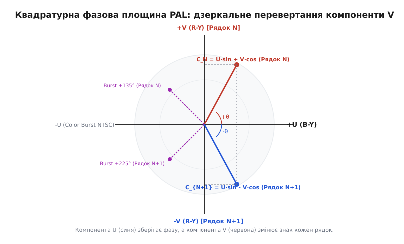
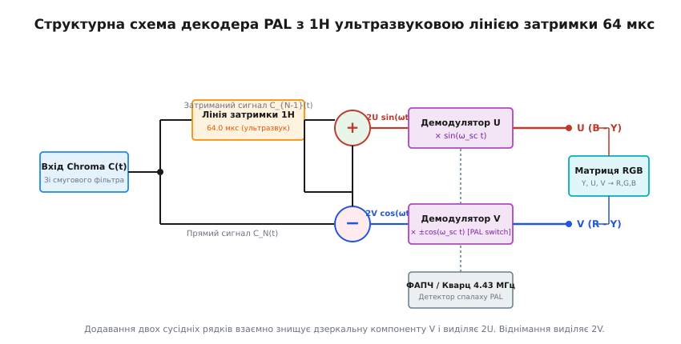
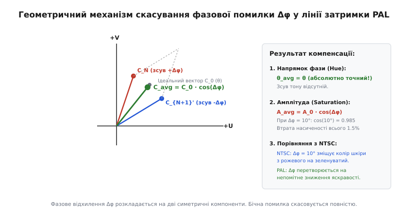

# PAL і NTSC: колірна квадратура і фазовий маятник

<preknowlist>
- [Аналоговий відеосигнал](book:communications/analog-video) — рядкова та кадрова розгортка, часова структура та роль синхронізації.
- [Композитний відеосигнал CVBS](book:communications/cvbs-signal) — шкала IRE, рівні гасіння та розташування колірного спалаху Color Burst.
- [Квадратурна амплітудна модуляція (QAM)](book:communications/fsk-psk) — одночасна передача двох сигналів на одній частоті зі зсувом фази 90°.
- [Фазори та фазова площина](book:math/phasors) — векторне представлення амплітуди й фази гармонічних коливань.
</preknowlist>

Перехід від монохромного аналогового мовлення до кольорового телебачення вимагав передачі трьох незалежних відеосигналів червоного `R`, зеленого `G` та синього `B` кольорів через один і той самий радіоканал шириною `6–8 МГц` без втрати зворотної сумісності з мільйонами чорно-білих приймачів. Для розв'язання цієї задачі було створено системи NTSC та PAL, які упаковують двовимірну колірну інформацію у високочастотну піднесучу за допомогою квадратурної амплітудної модуляції (QAM) та спектрального переплетення гармонік. Проте якщо в американському стандарті NTSC найменший фазовий зсув у радіоефірі призводить до катастрофічної зміни кольорів, європейська система PAL розв'язує цю фізичну обмеженість за допомогою фазового маятника — інверсії червоної компоненти через рядок — та аналогової лінії затримки, яка перетворює небезпечні спотворення колірного тону на непомітні мікрозміни насиченості.

### 1. Інженерний виклик сумісності: розділення яскравості та колірності

Замість прямої передачі трьох широксмугових каналів `R`, `G`, `B`, які б вимагали втричі більшої смуги частот (`15–18 МГц`), інженери застосували особливості людського зору. Очне яблуко має високу щільність паличок (деталі та яскравість) і значно меншу щільність колбочок (сприйняття кольорів). Тому людське око помічає найдрібніші зміни яскравості, але має дуже низьку просторову роздільну здатність для дрібних колірних плям.

Використовуючи цю психофізичну властивість, три початкові сигнали `R`, `G`, `B` лінійно конвертуються у три нові компоненти:

1. **Яскравісний сигнал (Luminance, `Y`).** Несе повну світлову інформацію зображення і виражається стандартною матричною вагованою сумою сприйняття людського ока:
```
Y = 0.299·R + 0.587·G + 0.114·B          [матричний сигнал яскравості Y]
```
   Сигнал `Y` займає повну смугу частот відеоканалу (`0–4.2 МГц` у NTSC або `0–5.0 МГц` у PAL). Саме цей сигнал приймається та відображається старими чорно-білими телевізорами, забезпечуючи ідеальну зворотну сумісність.

2. **Колірно-різницеві сигнали (Chrominance, `R - Y` та `B - Y`).** Відповідають за відтінок і насиченість. Знак і величина показують, наскільки колір відхиляється від чисто сірого чи білого. Оскільки око не потребує високої деталізації за кольором, сигнали `R - Y` та `B - Y` пропускають через низькочастотні фільтри, звужуючи їхню смугу всього до `0.5–1.3 МГц`.

Третя компонента `G - Y` не передається взагалі, оскільки приймач легко відновлює її алгебраїчно з трійки `Y`, `R - Y`, `B - Y`:
```
G - Y = -0.581·(R - Y) - 0.395·(B - Y)   [алгебраїчне відновлення зеленого]
```

Щоб запобігти перевантаженню передавача при передачі чистих насичених кольорів (колірно-різницеві сигнали можуть виходити за межі амплітудного розмаху `100 IRE`), їх нормують за амплітудою підсумковими коефіцієнтами, отримуючи колірні компоненти `U` та `V`:
```
U = 0.49211·(B - Y)                      [масштабована компонента U]
V = 0.87728·(R - Y)                      [масштабована компонента V]
```

У системі NTSC для ще більшого стиснення смуги використовують повернуту на `33°` колірну систему координат `I` (In-phase) та `Q` (Quadrature), де компонента `I` (помаранчево-блакитна вісь, до якої око чутливіше) має смугу `1.3 МГц`, а `Q` (пурпурно-зелена вісь) — всього `0.4 МГц`. У системі PAL збережено симетричні колірні осі `U` та `V` зі однаковою шириною смуги `1.3 МГц`.

### 2. Квадратурне ущільнення та спектральне переплетення

Передача двох колірно-різницевих сигналів `U` та `V` всередині смуги яскравості без взаємних завад вимагає пакування за допомогою квадратурної амплітудної модуляції (QAM) на піднесучій частоті `f[sc]`.

Сумарний колірний сигнал `C(t)` формується додаванням двох гармонік з зсувом фази `90°`:
```
C(t) = U(t)·sin(2·π·f[sc]·t) + V(t)·cos(2·π·f[sc]·t)  [квадратурна піднесуча QAM]
```

На векторній фазовій площині `U–V` амплітуда піднесучої `A(t) = √(U² + V²)` моделює насиченість кольору, а кут повороту вектора `θ(t) = arctan(V / U)` моделює точний колірний тон (*Hue*).


*Квадратурне сузір'я PAL, де компонента U (синя) зберігає фазу, а компонента V (червона) перевертається на 180° на кожному наступному рядку.*

Щоб піднесуча колірності `f[sc]` не створювала грубої сітки на чорно-білому екрані, її частоту вибирають за принципом **спектрального переплетення** (*Spectral Interleaving*). Енергія яскравісного сигналу `Y(t)` не неперервна — вона розбита на вузькі спектральні піки, зосереджені навколо точних цілих гармонік рядкової частоти `n·f[H]`.

Вибираючи частоту піднесучої з дробовим зсувом відносно `f[H]`, піки колірності потрапляють точно в порожні інтервали між піками яскравості:

- **Вибір частоти в NTSC.** Частота піднесучої дорівнює непарній півгармоніці рядкової частоти:
```
f[sc] = (455 / 2)·f[H] ≈ 3.579545 МГц     [піднесуча NTSC при f[H] = 15734.26 Гц]
```
  Піки спектра колірності NTSC розташовані точно посередині між гармоніками яскравості на частотах `(n + 0.5)·f[H]`. У результаті знак високочастотної сітки піднесучої змінюється на протилежний у кожному наступному рядку і в кожному наступному кадрі, за рахунок чого вона зорово згладжується на екрані.

- **Вибір частоти в PAL.** Оскільки в PAL компонента `V` додатково модулюється меандром з напівчастотою рядків `f[H] / 2`, її спектральні піки розщеплюються. Щоб оптимізувати спектральне переплетення для обох компонентів (`U` та `V`), частоту піднесучої вибирають із чвертьрядковим зсувом та кадровою поправкою `25 Гц`:
```
f[sc] = (1135/4 + 1/625)·f[H] ≈ 4.43361875 МГц  [піднесуча PAL при f[H] = 15625 Гц]
```
  Цей точний математичний розрахунок гарантує мінімальну видимість піднесучої як на чорно-білих, так і на кольорових кінескопах.

### 3. Ахіллесова п'ята NTSC: фазова вразливість

Вся схема квадратурної демодуляції спирається на те, що декодер приймача знає точну фазу опорного генератора. Для цього на задньому майданчику кожного рядка передається [колірний спалах Color Burst](book:communications/cvbs-signal) — `8–10` періодів опорного коливання `f[sc]`. Фазовий опор ФАПЧ у приймачі підбудовується за цим спалахом.

Проте при поширенні сигналу в радіоефірі або кабельних мережах виникають амплітудно-фазові викривлення (диференційна фаза) та багатопроменеве відбиття. Вхідний сигнал отримує випадковий фазовий зсув `Δφ`:
```
C[rx](t) = A(t)·sin(2·π·f[sc]·t + θ + Δφ) [вплив фазової завади Δφ]
```

При квадратурному перемноженні у приймачі NTSC цей фазовий зсув прямо додається до колірного тону:
```
θ[demod] = θ + Δφ                        [пряме додавання фазової помилки у NTSC]
```

Наслідки виявилися катастрофічними для якісного мовлення. Людський зор надзвичайно чутливий до відтінків шкіри обличчя (*flesh tones*):
- Відхилення фази `Δφ = +10°` зміщує нормальний рожевий колір шкіри у бік зеленувато-жовтого тону.
- Відхилення фази `Δφ = -10°` перетворює колір шкіри на насичений пурпурово-фіолетовий.

Щоб компенсувати ці спотворення, кожен телевізор NTSC оснащувався ручним регулятором «HUE» (*Tint*), яким глядач мусив самостійно підкручувати фазу опорного генератора при кожній зміні телеканалу або навіть при зміні відеокамери у студії. Історія цього технічного компромісу та виникнення народної назви NTSC розписана в історичному нарисі [Війна аналогових колірних стандартів: RCA, Telefunken і французький SECAM](book:communications/pal-ntsc-color/hist-ntsc-pal-secam-war.md).

### 4. Фазовий маятник PAL: інверсія колірності від рядка до рядка

У 1962 році німецький інженер Вальтер Брух розробив систему PAL (*Phase Alternating Line* — «рядки зі змінною фазою»), яка математично скасувала фазову вразливість NTSC.

Головне рішення PAL полягає у тому, що колірно-різницева компонента `V` (червоний колір) передається з інверсією фази на `180°` на кожному другому рядку:
```
C_N(t)   = U·sin(ω[sc]·t) + V·cos(ω[sc]·t)   [парний рядок N (+V)]
C_N1(t)  = U·sin(ω[sc]·t) - V·cos(ω[sc]·t)   [непарний рядок N+1 (-V)]
```

Вектор колірності на фазовій площині розгойдується від рядка до рядка навколо осі `U` на рівні кути `+θ` та `-θ`, утворюючи так званий **фазовий маятник**.

Якщо в тракті передачі виникає фазова помилка каналу `+Δφ`, вона повертає обидва вектори в один і той самий бік на фазовій площині:
- На рядку `N` відновлений кут дорівнює `θ_N = θ + Δφ`.
- На рядку `N+1` з урахуванням зворотного перевертання фази у декодері відновлений кут дорівнює `θ_{N+1} = θ - Δφ`.

У перших приймачах *Simple PAL* усереднення цих двох кутів здійснювалося безпосередньо око глядача: оптична система людини інтегрує світло сусідніх рядків і бачить середній кут:
```
θ[avg] = ((θ + Δφ) + (θ - Δφ)) / 2 = θ       [зорове скасування фазової помилки]
```

Спотворення колірного тону зникало повністю! Однак на екрані *Simple PAL* з'являвся інший побічний ефект: сусідні рядки мали трохи різну яскравість через фазове відхилення, що викликало структуру тонких горизонтальних ліній — так звані **гановерські смуги** (*Hanover bars*).

### 5. Ультразвукова скляна лінія затримки 1H та математичне скасування помилки

Для повного усунення «гановерських смуг» у приймачах *Standard PAL* було застосовано аналогову **лінію затримки 1H** (*1 Horizontal Line delay*), яка затримувала сигнал колірності на час одного рядка (`T[H] = 64.0 мкс`).

Фізично лінія затримки виготовлялася у вигляді бруска зі спеціального звукопроводящого ізотропного кварцового скла. На торцях бруска закріплювалися п'єзоелектричні перетворювачі: вхідний п'єзоелемент перетворював електричний сигнал у високочастотну ультразвукову хвилю, яка відбивалася від граней скла всередині корпусу і за час `64.0 мкс` досягала вихідного п'єзоелемента, перетворюючись назад у напругу.


*Структурна схема декодера PAL з 64 мкс лінією затримки, матричним суматором для U та віднімачем для V, синхронними демодуляторами та RGB-матрицею.*

Сигнали прямого рядка `C_N(t)` та затриманого попереднього рядка `C_{N-1}(t)` надходять на аналоговий матричний суматор та віднімач.

Завдяки інверсії компоненти `V` на сусідніх рядках, матричні операції дають чистове розділення компонентів ще **ДО** їхньої демодуляції:

1. **Сума двох рядків (`(C_N + C_{N-1}) / 2`).** Протилежні за знаком компоненти `+V` та `-V` взаємно знищуються, залишаючи чистовий сигнал `U`, модульований синусом:
```
S_U(t) = (C_N(t) + C_N1(t)) / 2 = U·sin(ω[sc]·t)   [виділення U сумуванням]
```

2. **Різниця двох рядків (`(C_N - C_{N-1}) / 2`).** Синфазні компоненти `U` взаємно віднімаються, залишаючи чистовий сигнал `V`, модульований косинусом:
```
D_V(t) = (C_N(t) - C_N1(t)) / 2 = V·cos(ω[sc]·t)   [виділення V відніманням]
```

За наявності фазового зсуву каналу `Δφ` алгебраїчне виведення суми та різниці дає винятковий математичний результат:
```
U[out] = U·cos(Δφ)                        [амплітуда U після затримки]
V[out] = V·cos(Δφ)                        [амплітуда V після затримки]
```

Детальний алгебраїчний та комплексно-аналітичний розклад цих тригонометричних виразів подано у вставці [Тригонометричний аналіз колірної квадратури та скасування фазової помилки](book:communications/pal-ntsc-color/math-pal-phase-pendulum.md).


*Векторна геометрична компенсація: фазовий зсув Δφ розкладається на дві симетричні компоненти. Сумарний вектор відновлює точний колірний тон, зменшуючи лише амплітуду на cos(Δφ).*

Фізичні наслідки цього математичного перетворення докорінно змінюють якість зображення:

- **Колірний тон (Hue).** Відновлений кут `θ[out] = arctan(V[out] / U[out]) = arctan(V / U) = θ` є **абсолютно точним**. Зсув колірного тону дорівнює нулю при будь-якій фазовій помилці `Δφ`.
- **Насиченість (Saturation).** Амплітуда колірного вектора зменшується на множник `cos(Δφ)`. Наприклад, при величезному фазовому відхиленні `Δφ = 10°` втрата насиченості становитьсього `cos(10°) = 0.985` (тобто `1.5%`), що повністю невідчутно для людського зору.

### 6. Спалах фази Bruch Burst та декодування в кремнії

Щоб декодер PAL міг правильно віднімати компоненту `V`, електронний перемикач фази у приймачі повинен знати, у якій саме фазі (`+V` чи `-V`) передається поточний рядок. Якщо перемикач зіб'ється на один рядок, колір `V` перевернеться, і обличчя стануть яскраво-зеленими.

Для надійної синхронізації фазового маятника використовується розширений колірний спалах — **спалах Бруха** (*Bruch Burst* або *PAL Burst*):
- На рядках з `+V` фаза спалаху на задньому майданчику гасіння встановлюється під кутом `135°` (`180° - 45°`).
- На рядках з `-V` фаза спалаху встановлюється під кутом `225°` (`180° + 45°`).

Вузли ФАПЧ декодера містять спеціальний фазовий дискримінатор напіврядкової частоти (`7.8125 кГц`), який визначає зсув спалаху `±45°` і строго прив'язує тригер перемикача `V` до ритму мовного передавача.

### Порівняльна характеристика аналогових колірних систем

| Параметр / Властивість | NTSC-M | PAL-B/G | SECAM III-B |
| :--- | :--- | :--- | :--- |
| **Кількість рядків / Частота кадрів** | 525 / 29.97 Гц | 625 / 25 Гц | 625 / 25 Гц |
| **Частота піднесучої (f[sc])** | 3.579545 МГц | 4.43361875 МГц | 4.40625 МГц (D_R) / 4.250 МГц (D_B) |
| **Метод модуляції колірності** | QAM (ортогональна) | QAM з інверсією фази V | Послідовна частотна (FM) |
| **Чутливість до фазових завад** | Висока (зсув колірного тону) | Відсутня (скасовується 1H лінією) | Відсутня (використовується FM) |
| **Необхідність ручки HUE** | Обов'язкова на телевізорі | Не потрібна | Не потрібна |
| **Ширина смуги відеосигналу** | 4.2 МГц | 5.0–5.5 МГц | 6.0 МГц |
| **Складність декодера** | Проста | Середня (потрібна 1H затримка) | Складна (дві FM-лінії) |

У сучасній цифрової обробці сигналів (DSP) аналогові скляні лінії затримки замінено на циклічні цифрові ОЗП-буфери рядків. Програмну реалізацію повного алгоритму моделювання фазової завади та демодуляції PAL/NTSC розібрано у вставці [Моделювання фазового маятника PAL та 1H лінії затримки мовами C та C++](book:communications/pal-ntsc-color/proj-pal-demodulator.md).
