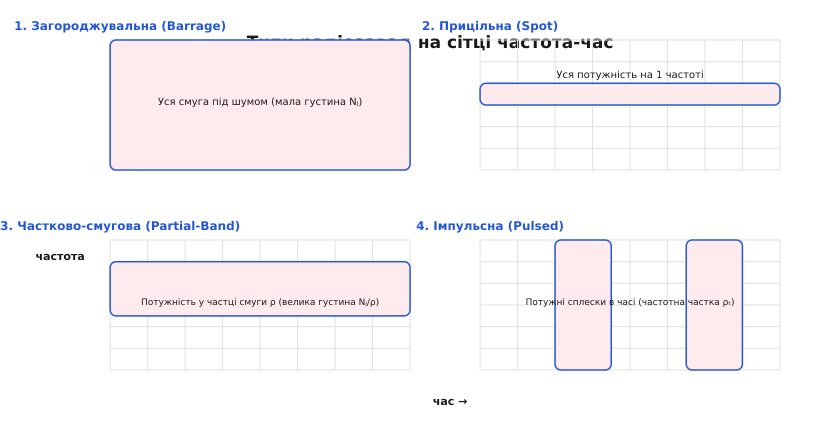
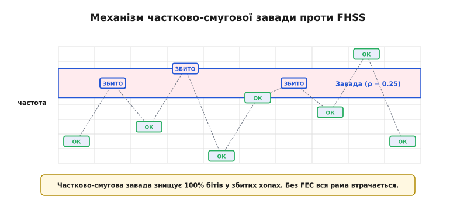
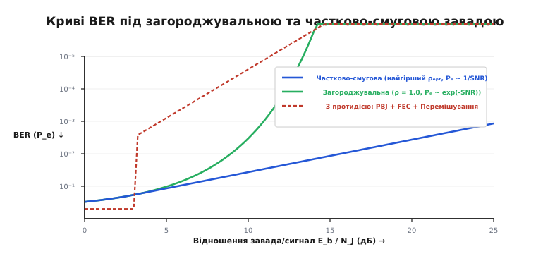
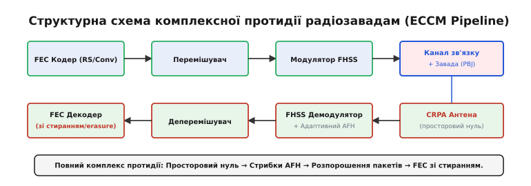

# Типи завад і протидія

<preknowlist>
- [Розширений спектр](topic:communications/spread-spectrum) — стрибки частоти (FHSS) і пряма послідовність (DSSS).
- [Частотна та фазова маніпуляція](topic:communications/fsk-psk) — цифрова модуляція FSK/PSK та імовірність помилки BER.
- [Децибели та потужність](topic:communications/power-decibels) — логарифмічне відношення сигнал/шум (SNR) та завада/сигнал (J/S).
</preknowlist>

У реальному радіоефірі приймач змушений виживати не лише серед неминучого теплового гаусового шуму, а й під тиском навмисного придушення — радіоелектронної боротьби (РЕБ). Звичайна радіостанція з фіксованою частотою несучої f₀ та потужністю P_s виявляється беззахисною проти постановника завад, який випромінює на тій самій частоті навіть скромні кілька міліватів шуму: відношення сигнал/шум падає до нуля, а ймовірність бітової помилки (BER) сягає граничних 50%. Щоб урятувати зв'язок від миттєвого засліплення, інженери розробили [розширений спектр](topic:communications/spread-spectrum), де передавач і приймач синхронно перестрибують між десятками й сотнями частотних каналів (FHSS).

Однак противник не обов'язково розпорошує свою енергію по всій широкій смузі. Якщо він концентрує сумарну потужність J у вузькій частці спектра ρ (0 < ρ <= 1), виникає **частково-смугова завада** (англ. *partial-band jamming*, PBJ). Така завада не намагається згасити весь спектр, але на 100% знищує пакети у тих каналах, куди влучає. Вона перетворює експоненційну завадостійкість радіолінії на лінійну й змушує будувати багатошарову архітектуру протидії — від просторових антенних нулів до декодування зі стиранням.

---

### Класифікація радіозавад: шість тактик придушення

Щоб вибити радіолінію з ефіру, постановник завад може розподіляти свою обмежену потужність J у часі, частоті та просторі. Залежно від геометрії випромінювання у часо-частотній сітці розділяють шість основних класів радіозавад.


*Чотири класичні просторово-частотні тактики глушіння: від суцільного загороджувального шуму з низькою густиною до концентрованих частково-смугових та імпульсних сплесків.*

#### 1. Загороджувальна завада (Barrage Jamming)
Глушильник ділить свою сумарну потужність J рівномірно по всій смузі розширення спектра W_ss. Спектральна густина потужності шуму завади виходить мінімальною:

```
N_J = J / W_ss
```

Це найпростіша «сліпа» тактика. Вона вимагає гігантської енергії постановника завад, адже на кожен герц широкої смуги припадає лише мізерна частка енергії. Для систем із розширеним спектром (DSSS або FHSS) загороджувальна завада є найменш небезпечною: завдяки виграшу обробки (англ. *processing gain*) G = W_ss / R_b приймач стискає корисний сигнал і легко приглушує розмазаний шум нижче рівня теплового порога.

#### 2. Прицільна завада (Spot Jamming)
Постановник завад фокусує всю потужність J у вузькій смузі однієї частоти f₀ (або одного вузького каналу B_s). Спектральна густина шуму стає велетенською, що гарантовано «засліплює» будь-яку звичайну радіостанцію на цій частоті. Але для систем зі стрибками частоти (FHSS) прицільна завада маловпливова: передавач перебуває на ураженій частоті лише один короткий хоп і миттєво іде на інший чистий канал.

#### 3. Частково-смугова завада (Partial-Band Jamming)
Джерело завади концентрує потужність J у частці ρ від загальної смуги (0 < ρ <= 1). Усередині глушеної смуги W_j = ρ · W_ss спектральна густина шуму зростає у 1 / ρ разів:

```
N_J' = N_J / ρ
```

Решта смуги (1 - ρ) залишається вільною від завади. Ця тактика є найруйнівнішою для некодованих FHSS-систем: завада не витрачає марно енергію на всю смугу, але створює непроникний бар'єр на частці частот.

#### 4. Імпульсна завада (Pulsed Jamming)
Це часовий аналог частково-смугової завади. Постановник випромінює потужні короткі сплески шуму у всій смузі W_ss, але діє лише протягом частки часу ρ_t (скважність / робочий цикл). Протягом імпульсу спектральна густина шуму дорівнює N_J / ρ_t, а решту часу ефір чистий. Імпульсна завада є найбільш критичною для систем із прямою послідовністю (DSSS).

#### 5. Багатотональна завада (Multi-tone Jamming)
Глушильник генерує не шум, а сет із M дискретних немодульованих синусоїдальних несучих (тонів), розміщених на сітці каналів FHSS. Якщо потужність кожного тону перевищує потужність корисного сигналу, некогерентний приймач BFSK/MFSK хибно вибирає канал із тоном завади, утворюючи гарантовані помилки.

#### 6. Імітаційна завада (Deceptive / Protocol-Aware Jamming)
Найбільш витончений клас: глушильник оцифровує преамбулу або заголовки пакетів противника, перехоплює синхросигнал і надсилає хибні рами з правильними преамбулами, але викривленими даними (наприклад, GPS-спофінг або завади по преамбулах Wi-Fi/LoRa). Приймач витрачає час на декодування фальшивих кадрів і пропускає реальний сигнал.

---

### Порівняльна ефективність завад проти технологій модуляції

Кожен вид модуляції та розширення спектра демонструє різну вразливість до розглянутих типів радіозавад. Для інженерного проектування радіолінії важливо розуміти, який саме тип завади є найнебезпечнішим для обраного стека технологій:

- **Звичайна вузькосмугова модуляція (AM, FM, unhopped PSK/FSK):** Найбільш вразлива до **прицільної завади (Spot Jamming)**. Навіть скромний глушильник із потужністю 1 Вт на частоті несучої повністю блокує демодуляцію, знижуючи SNR до від'ємних значень.
- **Розширений спектр прямої послідовності (DSSS):** Відмінно захищений від прицільних та частково-смугових завад завдяки виграшу обробки псевдовипадкового коду. Проте DSSS є крайньо вразливим до **імпульсної завади (Pulsed Jamming)**: потужний короткий сплеск шуму напружує АЦП і вхідні підсилювачі приймача, викликаючи нелінійне насичення (кліпінг) та втрату синхронізації кодової послідовності.
- **Стрибки частоти (FHSS):** Легко оминає прицільні завади, але виявляється беззахисним проти **частково-смугової завади (Partial-Band Jamming)** та **багатотональної завади (Multi-tone Jamming)**. Концентрація потужності на 10–20% частотних каналів створює регулярні пакетні спалахи помилок у кожному хопі, що потрапляє на глушені частоти.
- **Мультиносійні системи (OFDM):** Використовуються у Wi-Fi, 4G/5G та цифровому ТБ. Вразливі до **частково-смугових та прицільних завад**, які вибивають пілотні підносійні (англ. *pilot subcarriers*). Без виправлення помилок втрата пілотних підносійних унеможливлює оцінку каналу й призводить до падіння усієї рами.

---

### Механізм ураження FHSS частково-смуговою завадою

Щоб зрозуміти уразливість стрибків частоти, простежимо шлях кадрів крізь канал, де діє частково-смугова завада.


*Приймач стрибає по сітці каналів. Чисті хопи проходять без перешкод, але хопи, що влучають у глушену смугу ρ, зазнають 100% руйнування символів.*

Приймемо, що передавач виконує стрибки по N каналах, а завада займає K з них (ρ = K / N). Псевдовипадковий генератор передавача послідовно обирає канали. З точки зору ймовірності:

- З ймовірністю (1 - ρ) хоп потрапляє у чистий канал. Відношення сигнал/шум високе, ймовірність помилки практично нульова (P_e ≈ 0).
- З ймовірністю ρ хоп потрапляє у глушений канал. Через те, що глушильник стиснув свою потужність у частку ρ, густина шуму N_J / ρ стає надвисокою. Відношення сигнал/шум у глушеному хопі падає нижче 0 дБ, і прийняті біти перетворюються на випадковий монетно-тосовий шум (P_e ≈ 50%).

Якщо один хоп містить кілька бітів інформації (наприклад, 10 бітів у хопі), то влучання завади в цей хоп повністю вибиває **усі 10 бітів поспіль**. Виникає так званий **пакетний спалах помилок** (англ. *burst error*). Без спеціального захисту навіть один зіпсований біт призводить до недійсного значення контрольної суми [CRC](topic:communications/checksums) і відкидання усього мережевого пакета.

Точний розподіл бітових помилок та критична межа ефективності завади випливають із повного підсумовування ймовірностей уражених і чистих каналів. Прямий [Математичний вивід кривих BER для частково-смугової завади](topic:communications/partial-band-jamming/math-ber-jamming.md) обчислює повну ймовірність помилки та визначає екстремуми функції P_e(ρ).

---

### Чому лінійне руйнування є катастрофою

Головна небезпека частково-смугової завади полягає у зміні математичного закону, за яким падає рівень помилок приймача при збільшенні потужності передавача або зменшенні потужності глушильника.


*Порівняння BER: під загороджувальною завадою (синя лінія) помилки падуть експоненційно; під найгіршою частково-смуговою завадою (червона лінія) падіння сповільнюється до лінійного. Зелена пунктирна лінія показує відновлення експоненти завдяки кодуванню та перемішуванню.*

Для некогерентного приймача BFSK ймовірність бітової помилки під загороджувальною завадою (ρ = 1) виражається експонентою:

```
P_e = (1 / 2) · exp(-E_b / (2 · N_J))
```

Якщо збільшити потужність передавача так, щоб відношення E_b / N_J зросло з 10 дБ до 16 дБ, ймовірність помилки впаде від 3.3 · 10⁻³ до 1.1 · 10⁻⁹ — тобто практично до нуля.

Проте якщо постановник завад динамічно вибирає **найгіршу частку смуги** ρ_opt, мінімізуючи потрібну йому енергію, формула змінюється. Похідна по ρ показує, що найруйнівніша частка смуги дорівнює:

```
ρ_opt = 2 / (E_b / N_J)      [при E_b / N_J >= 2]
```

Підставивши ρ_opt у вираз для ймовірності помилки, отримуємо підсумковий закон найгіршого випадку:

```
P_e_max = 1 / (e · (E_b / N_J)) ≈ 0.3679 / (E_b / N_J)
```

Залежність стала **обернено-лінійною**! Тепер при зростанні E_b / N_J з 10 дБ до 16 дБ (у 4 рази) рівень помилок зменшується не в мільйон разів, а лише у 4 рази — з 3.68% до 0.92%.

Це означає: скільки б передавач не нарощував потужність E_b, розумний глушильник завжди може звузити смугу ρ_opt і втримати рівень помилок на позначці біля 1%, що повністю блокує некодовану передачу даних.

#### Числовий аналіз розриву завадостійкості

Розглянемо практичні значення ймовірності бітової помилки для некодованого приймача BFSK при різних значеннях відношення енергії біта до завади E_b / N_J:

1. **При E_b / N_J = 10 дБ (шкала 10.0):**
   - Загороджувальна завада (ρ = 1.0): P_e = 0.5 · exp(-5.0) ≈ 0.00337 (0.34% помилок).
   - Частково-смугова завада (ρ_opt = 0.20, тобто глушіння 20% каналів): P_e_max = 0.3679 / 10.0 ≈ 0.0368 (3.68% помилок). Рівень помилок зростає майже в 11 разів!
2. **При E_b / N_J = 16 дБ (шкала 39.8):**
   - Загороджувальна завада (ρ = 1.0): P_e = 0.5 · exp(-19.9) ≈ 1.14 · 10⁻⁹ (ідеальний зв'язок без жодної помилки).
   - Частково-смугова завада (ρ_opt = 0.05, тобто глушіння лише 5% каналів): P_e_max = 0.3679 / 39.8 ≈ 0.00924 (майже 1% бітових помилок). Зв'язок повністю зруйновано.
3. **При E_b / N_J = 20 дБ (шкала 100.0):**
   - Загороджувальна завада (ρ = 1.0): P_e ≈ 9.64 · 10⁻²³ (абсолютний нуль помилок).
   - Частково-смугова завада (ρ_opt = 0.02, глушіння 2% каналів): P_e_max = 0.3679 / 100.0 ≈ 0.00368 (0.37% помилок).

Витоки цього протистояння та історичні етапи розвитку техніки радіопридушення, починаючи з Другої світової війни, описано у вставці [Історія радіоелектронної боротьби](topic:communications/partial-band-jamming/hist-ew-battle.md). Цей екскурс розкриває, як британська радіорозвідка та німецькі інженери проходили всі етапи дуелі від аналогового перекриття несучих до розширеного спектра.

---

### Комплексна архітектура протидії (ECCM Pipeline)

Щоб зламати лінійну перевагу частково-смугової завади та повернути системі експоненційну завадостійкість, застосовують п'ятиступеневий комплекс інженерних заходів протидії (англ. *Electronic Counter-Countermeasures*, ECCM).


*Конвеєр захисту: від просторового вирізання завади антеною до перемішування бітів у часі й декодування зі стиранням.*

#### 1. Просторове фільтрування (CRPA антени)
Перший рубіж захисту працює ще до демодуляції сигналу. Застосовують **адаптивні антенні решітки** (англ. *Controlled Reception Pattern Antenna*, CRPA). Вимірюючи різницю фаз сигналу між кількома антенними елементами, цифровий процесор формує **просторовий нуль** (англ. *spatial null*) у діаграмі спрямованості в напрямку джерела завади. Це зменшує потужність завади J на 30–50 дБ ще на вході приймача.

#### 2. Адаптивні стрибки частоти (Adaptive Frequency Hopping, AFH)
Приймач та передавач постійно оцінюють рівень шуму у кожному з N каналів (метрика CQI). Якщо канал систематично демонструє високий рівень завади (влучає у смугу ρ), псевдовипадковий генератор виключає його з таблиці стрибків. Саме так працює сучасний Bluetooth та військові системи зв'язку STANAG.

#### 3. Завадостійке кодування (FEC)
Вхідний потік бітів кодується згортковим кодом або каскадним кодом Ріда-Соломона (RS). Наприклад, код Ріда-Соломона RS(n, k) додає n - k виправних символів. Навіть якщо частина символів у блоці зіпсована, декодер повністю відновлює початкові дані.

#### 4. Блокове перемішування (Interleaving)
FEC-коди ефективно виправляють поодинокі незалежні помилки, але безсилі проти довгих пакетних спалахів помилок, які виникають при ураженні цілого хопу. Перемішувач (англ. *interleaver*) записує кодовані біти в матрицю по рядках, а зчитує по стовпчиках перед відправкою в ефір.

Коли частково-смугова завада вибиває один повний хоп в ефірі, вона нищить послідовні біти. На приймальному боці деперемішувач здійснює зворотну операцію і **розпорошує** зіпсовані біти по багатьох різних кодових блоках. У результаті кожен кодовий блок отримує лише по 1 поодинокій помилці, яку FEC-декодер виправляє миттєво.

#### 5. Декодування зі стиранням (Erasure Decoding)
Якщо демодулятор вимірює рівень енергії у хопі й бачить, що хоп потрапив під заваду, він не намагається вгадувати значення бітів. Він позначає ці біти як **стирання** (англ. *erasure* — відома позиція з невідомим значенням).

Для коду Ріда-Соломона з кодовою відстанню d_min = n - k + 1 виправна здатність по помилкам та стиранням описується фундаментальним співвідношенням:

```
2 · t + e <= n - k
```

де t — кількість помилок з невідомою позицією, а e — кількість стирань з відомою позицією. Якщо позиції зіпсованих бітів відомі завдяки моніторингу завади, декодер здатен виправити у **двічі більше** зіпсованих символів (e = n - k), ніж зазвичай (t = (n - k) / 2).

Практичну реалізацію алгоритму перемішування бітів та некогерентного приймача FHSS на мовах C та C++ зведено у вставці [Симуляція FHSS із протидією завадам](topic:communications/partial-band-jamming/proj-jamming-sim.md). Вставка показує реальний код побудови блокового перемішувача, моделей канала та мажоритарного декодування.

---

### Практика застосування у військовому та цивільному зв'язку

Для закріплення розуміння розглянемо, як розглянуті алгоритми протидії втілено у реальних стандартах зв'язку:

1. **Військовий зв'язок Link 16 (JTIDS/MIDS):** Працює в діапазоні 960–1215 МГц. Використовує понад 70,000 стрибків частоти на секунду, розширення DSSS усередині кожного хопу, каскад коду Ріда-Соломона RS(31, 15) та глибоке часове перемішування. Система зберігає зв'язок навіть при придушенні до 60% частотного спектра.
2. **Безпілотна авіація та канали керування дронами:** Сучасні стійкі канали зв'язку каналу "земля-дрон" використовують широкий діапазон (наприклад, 860–930 МГц або 2.4 ГГц) із динамічним псевдовипадковим перестрибуванням частот (AFH) по 100+ каналах, доповнений згортковим кодуванням Viterbi та просторовими CRPA-антенами на борту дрона для зрізання наземних глушилок.
3. **Стандарт Bluetooth (IEEE 802.15.1):** Застосовує адаптивні стрибки частоти (AFH) по 79 каналах у діапазоні 2.4 ГГц. Приймач безперервно будує карту завад (CQI map) і виключає з послідовності стрибків ті канали, на яких працюють роутери Wi-Fi або мікрохвильові печі.

---

> 🔧 **Навіщо це.** Частково-смугова завада — це головний інструмент протидії розширеному спектру в сучасній радіоелектронній боротьбі. Розробляючи радіолінію для дронів, тактичного зв'язку чи супутникових каналів, інженер не має права покладатися лише на самі стрибки частоти (FHSS). Без обов'язкового зв'язувального тріо «FEC-кодування + блокове перемішування + стирання» навіть невелика глушилка потужністю 10 Вт виб'є складну систему розширеного спектра, просто сконцентрувавши потужність на 10–20% частотних каналів.
