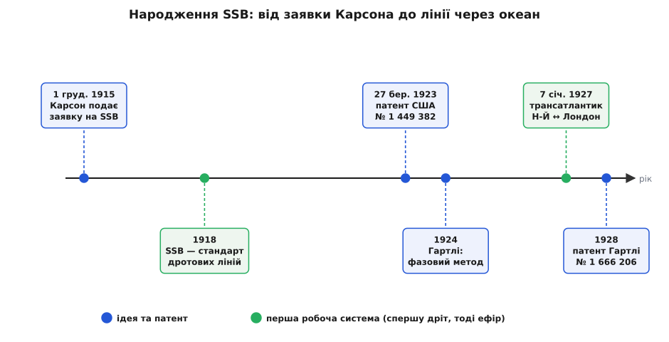

# 📜 Народження SSB: ідея на папері, дріт, а тоді голос через океан

Односмугову модуляцію придумали не для радіо, а для мідного дроту — щоб на одну дорогу міжміську лінію втиснути вдвічі більше телефонних розмов; аж потім той самий трюк відніс людський голос через Атлантику. Ця історія варта того, щоб її розказати точно, бо в ній легко сплутати три різні дати: коли ідею **придумали**, коли її **запатентували** і коли вона вперше **запрацювала насправді**.

## Чому взагалі стали різати смугу

Наприкінці 1910-х найдорожче в телефонії коштувала не розмова, а сама лінія — мідна пара, простягнена на сотні кілометрів. Кожна така пара везла одну розмову за раз, і щоб вона окупалася, на неї хотіли посадити багато розмов одразу. Спосіб був: дати кожній розмові власну несучу частоту й скласти їх в один потік — як окремі станції в ефірі, тільки в дроті (частотне ущільнення каналів). Та щойно так роблять, кожна розмова займає не свою звукову смугу, а подвоєну — [дві дзеркальні бічні смуги, як в AM](book:communications/am-fm). Смуга дроту скінченна, і подвоєння смуги на канал означає рівно вдвічі менше каналів на лінії.

Звідси й приземлена арифметика вигоди:

```
одна розмова, звук до 3 кГц:
  AM  → займає 6 кГц (дві бічні смуги)
  SSB → займає 3 кГц (одна бічна)
у ту саму смугу лінії SSB вкладає вдвічі більше розмов
```

Викинути другу, зайву бічну смугу — і на тій самій міді помістилося вдвічі більше грошей. Ось справжня причина, з якої за односмуговий метод узялися всерйоз: не краса задуму, а ціна мідної пари.

## Сайдбенди, яких «нібито не було»

Щоб різати бічну смугу, треба спершу повірити, що вона взагалі існує окремо. А з цим тоді було непросто. Довгий час поза стінами Bell не було ясного розуміння, що модуляція несучої голосом породжує **окремі** частоти вище й нижче несучої — багато хто уявляв модульовану хвилю як одну-єдину хвилю, що просто «дихає» амплітудою. У такій картині бічні смуги — то радше математична витівка з розкладу, а не щось, що можна взяти й відрізати.

І ось тут SSB зіграв роль не лише винаходу, а й **доказу**. Якщо збудувати фільтр, що пропускає одну бічну смугу й глушить другу, а на приймачі з неї все одно повертається розбірливий голос, — значить, бічні смуги не витівка, а справжні, роздільні фізичні складові сигналу. Абстракція з формули стала залізякою на столі. Саме тому людина, що першою це зробила, була не так радистом, як **математиком**: щоб побачити в осцилограмі не одну хвилю, а суму трьох ліній, потрібно було спершу повірити рівнянню.

## Джон Карсон і заявка 1915 року

Тим математиком був **Джон Реншоу Карсон** (англ. *John Renshaw Carson*, 1886–1940) — американський інженер-теоретик, що 1914-го прийшов у AT&T рахувати, як сигнали живуть у лініях. Уже наступного, 1915 року він виклав ідею: у несучій, модульованій голосом, корисної інформації нема зовсім, а обидві бічні смуги однакові, тож досить погасити несучу й лишити **одну** смугу — і смуга, і потужність упадуть, а голос уцілів.

Заявку на цей метод — «Спосіб і засоби сигналізації хвилями високої частоти» (англ. *Method and Means for Signaling with High Frequency Waves*) — Карсон подав **1 грудня 1915 року**. А от патент на неї, **US 1 449 382**, видали лише **27 березня 1923-го**: заявка вісім років продиралася крізь патентне відомство. Це і є перший розрив, який варто тримати в голові: **ідея — 1915, папір із печаткою — аж 1923**. Тим часом, поки юристи сперечалися, метод устиг зробити щось важливіше за печатку — почав працювати.


*Три дати, які легко сплутати: ідею подано 1915-го, патент видано лише 1923-го, а перша робоча система запрацювала ще раніше за патент — спершу на дроті (1918), тоді в ефірі (1927). Синім позначено ідею й патенти, зеленим — перші робочі системи.*

## Спершу дріт, а вже потім ефір

Перша робоча система на односмуговому методі жила не в ефірі, а **в дроті**. Уже з **1918 року** SSB стає звичайним для міжміської «несучої» телефонії — тієї самої, де на одну лінію накладають багато розмов на різних несучих. Одну з ранніх таких установок проклали між Пітсбургом і Балтимором. Логіка та сама, що й на початку: половина смуги на канал — удвічі більше каналів на дорогій лінії; тут виграш рахували не в красі, а в кабелях, яких не довелося тягнути.

Отже, коли ми кажемо «перша робоча система SSB», це **1918 рік і мідний дріт**, а не радіо й не 1927-й. Ефір прийшов по вже готову, обкатану на лініях техніку.

## Гартлі і другий шлях — не різати, а гасити

Фільтровий метод Карсона мав одну болячку: щоб чисто відрізати одну смугу від упритул сусідньої, потрібен нелюдськи гострий фільтр. **Ральф Вінтон Лайон Гартлі** (англ. *Ralph Vinton Lyon Hartley*, 1888–1970), американський інженер із Western Electric, 1924 року запропонував обійтися **без** такого фільтра. Його думка була протилежна за духом: вести сигнал двома шляхами, зсунути в них фазу так, щоб при додаванні одна бічна смуга підсилилася, а друга погасила сама себе. Ключ — зсунути звук рівно на 90° на **всіх** частотах смуги одразу ([перетворення Гільберта](book:communications/analytic-signal)); тоді верхні бічні смуги двох шляхів складаються, а нижні взаємно знищуються (чи навпаки).

Патент на цей фазовий метод — **US 1 666 206** — Гартлі отримав **1928 року**. Знову той самий візерунок: ідея 1924-го, папір 1928-го. Обидва методи — фільтровий і фазовий — дожили до наших днів, хоч і сперечалися між собою потім не одне десятиліття.

## 7 січня 1927: голос через океан

А тепер ефір. **7 січня 1927 року** запрацювала перша **комерційна** двостороння радіотелефонна лінія через Атлантику — Нью-Йорк ↔ Лондон. Першими офіційно поговорили Волтер Гіффорд (англ. *Walter Gifford*), президент AT&T, і сер Евелін Мюррей (англ. *Evelyn Murray*), секретар Британської пошти (GPO). Голос ішов **довгими хвилями**, близько **60 кГц**, і саме односмуговою модуляцією з придушеною несучою.

Чому саме SSB — тут видно, як ніде. На довгих хвилях трансатлантичний прогін вимагав велетенської потужності, а вільного місця в діапазоні було на кілька каналів на всіх. Кожен кіловат і кожен кілогерц над океаном коштували шалено дорого — і викинути мертву несучу з копією-двійником означало наполовину зменшити і смугу, і потрібну потужність. Дрібниця економії на дроті обернулася вирішальною перевагою в ефірі.

Розкладено все було так, щоб приймати голос якнайдалі від власних потужних передавачів. Передавачі стояли в Рокі-Пойнт (англ. *Rocky Point*, шт. Нью-Йорк) і Раґбі (англ. *Rugby*, Англія), а приймачі винесли в тихі за перешкодами місця — Голтон (англ. *Houlton*, шт. Мен) і К'юпар (англ. *Cupar*, Шотландія). Розмова коштувала цілий статок за три хвилини, лінія пускала одну пару співрозмовників за раз — і все ж уперше два боки океану могли говорити наживо.

## Ідея, патент, робоча система — три різні дати

Якщо з усієї цієї історії лишити одне, хай це буде звичка **не змішувати три речі**. Ідею односмугового методу Карсон подав **1915-го**. Печатку на патенті поставили аж **1923-го**. А працювати метод почав раніше за патент — на дротових лініях від **1918-го** й у трансатлантичному ефірі **1927-го**. Патент Гартлі на фазовий шлях (**1928**) додав другий спосіб робити те саме. «Хто придумав», «хто запатентував» і «де це вперше запрацювало» — це три окремі запитання з трьома окремими відповідями, і чесна історія техніки їх розрізняє.

Той самий Карсон за кілька років дасть інженерії ще одну річ зі своїм ім'ям — [оцінку смуги для частотної модуляції](book:communications/carson-rule). Але це вже інша історія, і в ній він знову буде тим, хто спершу повірив рівнянню, а тоді порахував, скільки місця в ефірі займе жива хвиля.
