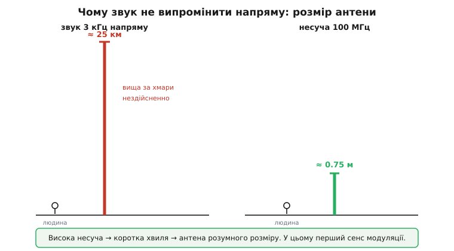
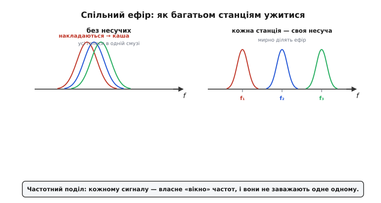
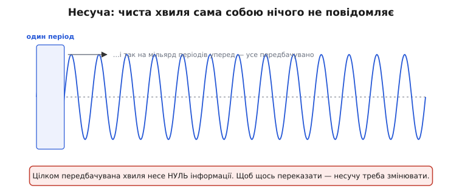
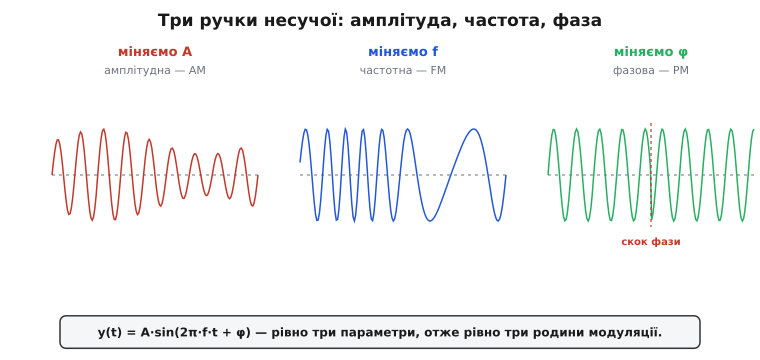
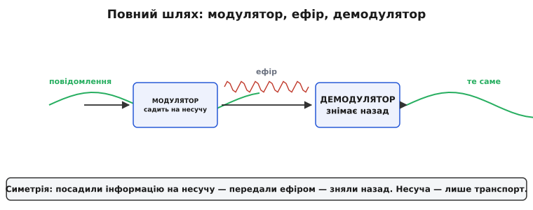
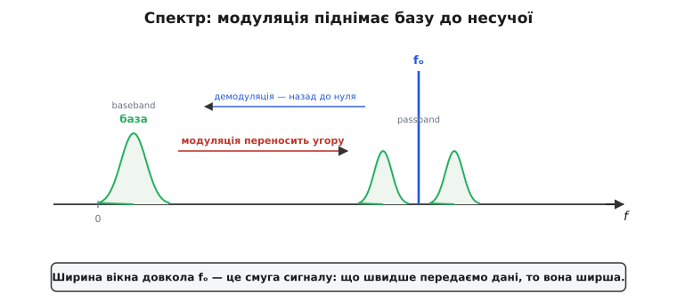
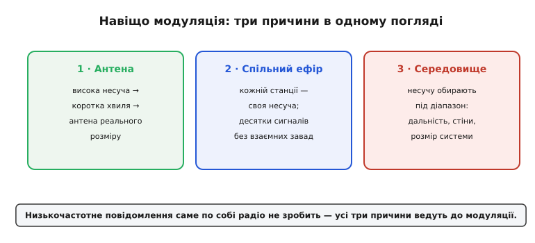

# Навіщо модуляція: посадити інформацію на несучу

<preknowlist>
- [Синусоїда](book:physics/sine-wave) — чиста хвиля, яку повністю задають три величини: амплітуда, частота й фаза; на цих трьох «ручках» тримається вся модуляція.
- [Електромагнітна хвиля](book:physics/em-wave) — інформація летить радіохвилею, а її довжина λ = c / f: що нижча частота, то довша хвиля.
- [Антена](book:communications/antenna) — випромінює хвилю ефективно лише тоді, коли її розмір порівнянний із довжиною хвилі (порядку λ/4).
</preknowlist>

Питання здається наївним, але веде в самісіньку суть радіо. Ось мікрофон: він перетворює голос на електричний сигнал — слабкий струм, що коливається в такт зі звуком, на частотах приблизно 300–3400 Гц. Ось антена. Чому не можна просто подати цей звуковий сигнал на антену й випромінити його «як є»? Навіщо вся ця морока з несучою хвилею та її «псуванням»? Відповідь складається з трьох залізних причин — і кожну варто прочути до кісток, бо на них тримається весь радіозв'язок.

### Проблема перша: антена завбільшки з місто

Перша причина — суто фізична, і вона про **розмір антени**. Щоб ефективно випромінювати хвилю, [антена](book:communications/antenna) має бути **порівнянна з довжиною хвилі** — на практиці порядку **чверті хвилі** (λ/4). А довжину хвилі дає [проста формула](root:embedded/frequency-wavelength) λ = c / f. Що нижча частота — то довша хвиля — то більша потрібна антена. І для звукових частот числа виходять нищівні.


*Щоб напряму випромінити звук 3 кГц, довжина хвилі — 100 км, а антена (λ/4) — близько 25 км заввишки: вища за будь-яку вежу на Землі, нездійсненно. Піднявши той самий сигнал на несучу 100 МГц, маємо λ = 3 м і антену 0.75 м — звичайну паличку.*

**Приклад (антена для звуку проти антени для несучої).** Порахуймо λ/4 для двох випадків за c ≈ 3×10⁸ м/с:

```
звук 3 кГц :  λ = 3×10⁸ / 3×10³  = 100 000 м = 100 км →  λ/4 ≈ 25 км
FM 100 МГц :  λ = 3×10⁸ / 1×10⁸  = 3 м            →  λ/4 = 0.75 м
Wi-Fi 2.4 ГГц: λ = 3×10⁸ / 2.4×10⁹ = 0.125 м        →  λ/4 ≈ 3 см
```

Відчуй контраст. Антена для прямого випромінювання голосу мусила б бути **25 кілометрів** заввишки — вища за всі хмари. А варто «перенести» той самий голос на несучу 100 МГц — і вистачає **тридцятисантиметрової** палички; на 2.4 ГГц антена взагалі ховається всередині телефона. Ось перший, цілком приземлений сенс модуляції: вона дає змогу передавати **низькочастотну** інформацію за допомогою **високочастотної** хвилі, для якої антена має розумний розмір.

### Проблема друга: усі в одній кімнаті кричать разом

Друга причина — про **спільний ефір**. Припустімо навіть, що антена не проблема. Уяви, що всі радіостанції міста почали випромінювати свій звук напряму. Голос — це завжди приблизно ті самі 0.3–3.4 кГц. Тобто **всі** сигнали лежали б в одній і тій самій вузькій смузі низьких частот, накладаючись один на одного. Приймач не мав би жодного способу їх розрізнити — суцільна каша, як коли в одній кімнаті всі говорять водночас.


*Без несучих усі голосові сигнали лежать в одній низькій смузі й безнадійно накладаються. Модуляція переносить кожну станцію на власну несучу f₁, f₂, f₃… — і тепер вони мирно ділять ефір, кожна у своєму «вікні» частот. Це і є частотний поділ.*

Модуляція розв'язує це елегантно: кожній станції дають **свою несучу частоту**. Одна сідає на 100.1 МГц, інша — на 100.5, третя — на 101.3. Тепер їхні сигнали рознесені по шкалі частот і не заважають одне одному, а ти, **налаштовуючись на станцію**, просто кажеш приймачеві, яку саме несучу слухати. Цей принцип називають **частотним поділом** (*frequency-division*), і саме він дає десяткам станцій, сотням каналів Wi-Fi і мільярдам телефонів ужитися в одному ефірі. Без модуляції спільний ефір був би неможливий у принципі.

### Проблема третя: середовище пропускає лише свій діапазон

Третя причина тонша за перші дві, але не менш залізна — вона про **саме середовище**, яким сигнал мусить пройти. Ефір поводиться неоднаково на різних частотах: кожен шлях і кожна перешкода пропускають своє. Довгі хвилі стеляться вздовж землі й огинають пагорби; середні та короткі відбиваються від іоносфери й тому «стрибають» через океан; надвисокі йдуть лише в прямій видимості — зате крізь стіни й дощ проходять уже кепсько, і що вища частота, то гірше. Голос сам по собі замкнений у своїй вузькій низькій смузі — і жодну з цих доріг обрати не може: він піде тільки так, як дозволяє його власна частота. А несучу ми **вільні поставити будь-де на шкалі**. Тож, піднявши повідомлення на несучу потрібної частоти, ми заразом обираємо, **як** хвиля піде: далеко чи близько, крізь стіни чи в обхід, уздовж землі чи відбившись від неба. Це і є третя робота модуляції — покласти сигнал у той [діапазон частот](book:communications/frequency-bands), який середовище справді проведе.

> 🔧 **Навіщо це.** Ці три причини — антена, спільний ефір і саме середовище — пояснюють **усе** радіо навколо тебе. Чому FM-діапазон — десятки мегагерц, а не кілогерци? Бо інакше антена була б кілометрова. Чому в роутера є «канали», а в рації — «частоти»? Бо це різні несучі, рознесені, щоб не глушити одне одного. Чому пульт-брелок від воріт працює на 433 МГц, а швидкий Wi-Fi — на 5 ГГц? Бо нижча несуча краще долає стіни й лине далі, а вища вміщає ширшу смугу. За всіма діапазонами, каналами й налаштуваннями стоїть та сама першооснова: модуляція існує, щоб **підняти** низькочастотну інформацію на зручну високу несучу — заради реальної антени, спільного ефіру й потрібного середовища.

### Несуча — це «вантажівка» для інформації

Придивімося до самої несучої. **Несуча** (від лат. *carrus* — «віз», англ. *carrier*) — це чиста синусоїда високої частоти: стала амплітуда, стала частота, нічого не змінюється. І саме тому вона, сама собою, **не несе жодної інформації**.


*Ідеальна несуча абсолютно передбачувана: знаючи лише перший період, ти точно знаєш усю хвилю на мільярд періодів уперед. А цілковито передбачуване повідомлення не містить інформації. Щоб щось передати, несучу треба змінювати в такт із повідомленням.*

Тут схована напрочуд глибока думка. Саме слово **модуляція** (від лат. *modulari* — «розмірювати, налаштовувати») і означає це кероване «розмірене» гойдання несучої в такт із повідомленням. Інформація — це завжди **несподіванка**, зміна, відхилення від передбачуваного. Ідеальна синусоїда несподіванок не має: вона нудна й передбачувана до кінця часів, тож повідомляє рівно нуль. Щоб несуча щось переказала, ми мусимо її **зіпсувати** — внести в неї керовані зміни, що повторюють форму нашого повідомлення. Несуча тут грає роль **вантажівки**: сама по собі порожня, вона довозить корисний вантаж (голос, біти) туди, куди той самотужки не дістався б — через увесь ефір, попри проблему антени, тісноту спільної смуги й вибагливе середовище.

### Три ручки несучої

А що саме в несучій можна змінювати? Тут — уся краса й уся простота. Будь-яку синусоїду повністю описують **рівно три** параметри:

```
y(t) = A · sin(2π·f·t + φ)
         ▲          ▲    ▲
    амплітуда   частота  фаза
```

Більше нема чого крутити — лише ці три «ручки». А отже, є рівно **три способи** садити інформацію на несучу, тобто три родини модуляції.


*Міняємо амплітуду A — виходить амплітудна модуляція (**AM**); міняємо частоту f — частотна (**FM**); міняємо фазу φ — фазова (**PM**). Три параметри синусоїди — три родини модуляції. Усе інше в радіозв'язку — варіації й комбінації цих трьох.*

Розберімо по ручках. **Амплітуда A** — це «висота» хвилі; змінюючи її в такт із голосом, дістаємо **амплітудну модуляцію** (*amplitude modulation*, AM) — найстарішу й найпростішу. **Частота f** — як часто хвиля коливається; гойдаючи її, дістаємо **частотну модуляцію** (*frequency modulation*, FM) — ту саму, за яку бився Армстронг. **Фаза φ** — зсув хвилі в часі; її зміни дають **фазову модуляцію** (*phase modulation*, PM), особливо важливу в цифровому зв'язку. Уся неосяжна різноманітність сучасних радіосистем — від простого AM-передавача до Wi-Fi і 5G — будується з цих трьох цеглинок та їхніх комбінацій: аналогові [AM і FM](book:communications/am-fm), цифрові [FSK і PSK](book:communications/fsk-psk).

### Повний шлях: модулятор і демодулятор

Складемо всю картину докупи — як інформація проходить шлях від передавача до приймача.


*Повідомлення (низькочастотна «база») заходить у **модулятор**, який садить його на несучу; передавальна антена випромінює модульовану хвилю; приймальна ловить її; **демодулятор** знімає інформацію назад, відновлюючи вихідне повідомлення. Несуча — лише транспорт.*

Ланцюг простий і симетричний. На передавальному боці **модулятор** (*modulator*) бере наше повідомлення й несучу і змішує їх — змінює одну з трьох ручок несучої в такт із повідомленням. Готова модульована хвиля йде в антену й летить ефіром. На приймальному боці **демодулятор** (*demodulator*, або детектор) робить **зворотну** операцію: дивиться, як саме «гуляє» прийнята несуча, і відновлює з цього вихідне повідомлення. Терміни-синоніми, що часто трапляються: модуляцію іноді звуть *накладанням*, демодуляцію — *детектуванням*. Суть незмінна: посадили інформацію на несучу — передали — зняли назад.

### Що відбувається у спектрі

Є ще один спосіб подивитися на модуляцію — крізь призму **спектра**, тобто розкладу сигналу за частотами. Цей погляд особливо корисний, бо одразу пояснює і частотний поділ, і поняття смуги.


*Повідомлення живе біля нуля частот — це **база** (*baseband*). Модуляція переносить його вгору, «обертаючи» навколо несучої fₒ: тепер сигнал займає вузьку смугу довкола fₒ — це смугова область (*passband*). Демодуляція робить зворотне — зсуває спектр назад до нуля й дістає повідомлення.*

Думай про це так. Вихідне повідомлення — голос, дані — займає смугу частот біля **нуля**; це називають **базою** або *baseband*. Модуляція **переносить** цю смугу вгору й розташовує її довкола несучої частоти fₒ — сигнал стає **смуговим** (*passband*), тобто сидить у вузькому «вікні» навколо fₒ. Саме тому різні станції на різних несучих не перетинаються: їхні «вікна» стоять у різних місцях шкали. А приймач, демодулюючи, зсуває обране вікно назад до нуля й читає повідомлення. І ще одне важливе спостереження: **ширина** цього вікна — це [**смуга** сигналу](book:communications/bandwidth-capacity), і вона тим більша, чим швидше ми передаємо дані. Смуга — не безкоштовна, і вона напряму обмежує, скільки даних здатен пропустити канал.

### Навіщо, який і як — дві осі всього радіо

Тепер видно, що вся тема стоїть на **двох незалежних питаннях**, і на обидва ми вже відповіли. Перше — **який носій узяти**: три причини вище цілком його визначають, бо кожна тисне на частоту несучої зі свого боку.


*Три причини — антена, спільний ефір і середовище — не сперечаються, а разом затискають несучу в потрібне місце шкали частот: досить високо, щоб антена була реальна; у власному вікні поряд із сусідами; у діапазоні, який проведе саме це середовище. Разом вони відповідають на перше питання — «який носій».*

Друге питання — **як саме садити на нього повідомлення**: тут ручок рівно три (амплітуда, частота, фаза), і цей вибір уже ні від чого попереднього не залежить. Ось де ховається вся широчінь радіо: будь-яка система задається парою «**який діапазон × яка ручка**». AM-мовлення, FM, Wi-Fi, 5G різняться тільки тим, куди на шкалі вони сіли й котру ручку (чи їхню комбінацію) крутять. Дві скромні осі — а з них виростає все, від нічного радіоприймача до стільникової мережі.

Лишається пройти другу вісь до кінця — розглянути, **як саме** псувати несучу. Два найстаріших і найнаочніших способи, на яких побудовано все аналогове мовлення, — це [**амплітудна** й **частотна** модуляція](book:communications/am-fm), AM і FM.

---
