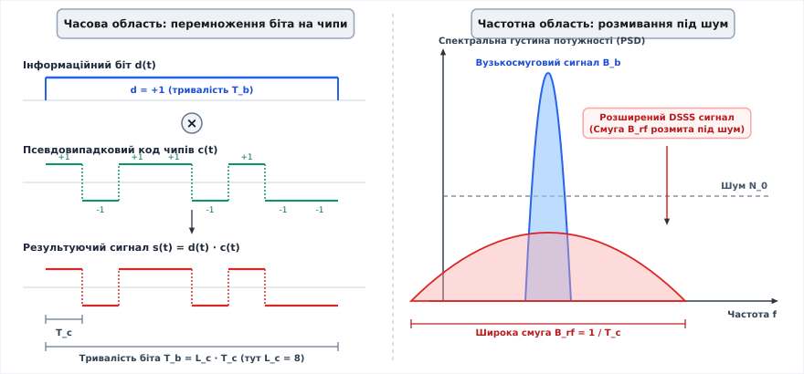
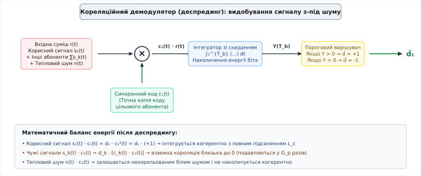
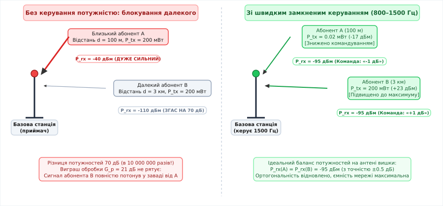
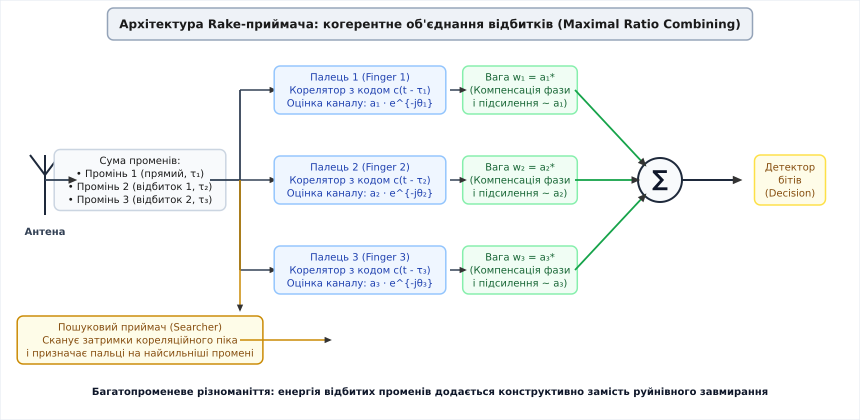

# CDMA: код як адреса

<preknowlist>
- [Канал AWGN](book:communications/awgn-channel) — адитивний білий гаусовий шум як модель теплових завад у радіоканалі.
- [Смуга і межа Шеннона](book:communications/bandwidth-capacity) — зв'язок ширини смуги пропускання, відношення сигнал/шум та граничної ємності каналу зв'язку.
- [Багатопроменевість](book:communications/multipath-fading) — інтерференція та завмирання радіосигналів через перешкоди й відбиття.
- [BER і SNR](book:communications/ber-snr-curve) — відношення енергії біта до спектральної густини шуму та ймовірність помилки.
</preknowlist>

Коли сотня мобільних телефонів одночасно виходить в етер на площі одного міського кварталу, на антені базової станції утворюється сумарна напруга — миттєва лінійна суперпозиція ста електромагнітних хвиль. У класичних системах зв'язку цю суміш розплутують шляхом фізичного розмежування ресурсів: у частотному поділі (FDMA, англ. *Frequency Division Multiple Access*) кожному передавачу виділяють персональну вузьку смужку спектра, а в часовому поділі (TDMA, англ. *Time Division Multiple Access*) абоненти говорять суворо по черзі в призначені мікросекундні інтервали часу.

Обидва підходи впираються в жорсткі межі: щойно частотні канали або часові інтервали вичерпано, новий абонент не може здійснити виклик, навіть якщо половина підключених користувачів у цей момент мовчить і слухає співрозмовника. Частотні захисні смуги (англ. *guard bands*) та захисні інтервали часу (англ. *guard times*) витрачають до 15–25% усього спектрального ресурсу лише на запобігання взаємному перекриттю сигналів.

Альтернативою став множинний доступ із кодовим поділом каналів (англ. *Code Division Multiple Access*, CDMA, від лат. *codex* — «збірка правил» та *divisio* — «розподіл»). У CDMA всі абоненти передають дані одночасно й у спільній широкій смузі частот. Сигнали накладаються один на одного, а роль адреси виконує унікальна математична послідовність чисел, у яку «загортається» кожен інформаційний біт.

### Пряме розширення спектра (DSSS): розмазування біта по чипах

Фундаментом CDMA є технологія прямого розширення спектра (англ. *Direct Sequence Spread Spectrum*, DSSS). Її суть полягає в штучному збільшенні ширини смуги сигналу перед передачею в радіоетер.

Нехай джерело інформації генерує повільну послідовність бітів даних `d(t) ∈ {+1, -1}`, де тривалість одного біта дорівнює `T_b`. Початкова ширина смуги такого інформаційного сигналу становить:

```
B_b ≈ 1 / T_b     [ширина смуги інформаційного сигналу]
```

Перед модуляцією несучої частоти кожен біт даних перемножується на високошвидкісну цифрову послідовність коротких імпульсів — чипів (англ. *chips*, елементарних неподільних сигнальних одиниць) `c(t) ∈ {+1, -1}`. Тривалість одного чипа `T_c` у багато разів менша за тривалість біта `T_b`.

Кількість чипів, що припадає на один інформаційний біт, називають базою сигналу або коефіцієнтом розширення (англ. *spreading factor*, SF):

```
L_c = T_b / T_c     [коефіцієнт розширення спектра]
```

Оскільки результуючий сигнал `s(t) = d(t) · c(t)` перемикається зі швидкістю чипів, його спектр розширюється до радіочастотної смуги:

```
B_rf ≈ 1 / T_c = L_c · B_b     [ширина розширеного радіосигналу]
```

Для обмеження позасмугового випромінювання прямокутні імпульси чипів пропускають крізь фільтри піднесеного косинуса (англ. *Root-Raised Cosine*, RRC) з коефіцієнтом скруглення `α = 0.22` (у стандарті WCDMA). Реальна смуга в етері становить:

```
B_{ch} = (1 + α) / T_c = (1 + 0.22) · 3.84 Мчип/с ≈ 4.68 МГц     [ширина каналу з RRC-фільтрацією]
```

Повна потужність передавача залишається незмінною, але тепер вона рівномірно розподіляється по смузі 5 МГц, яка в `L_c` разів ширша за початкову смугу даних. У результаті спектральна густина потужності (англ. *Power Spectral Density*, PSD) сигналу різко падає:

```
PSD_rf = PSD_b / L_c     [зниження спектральної густини потужності]
```

У реальних стільникових системах спектральна густина сигналу окремого абонента опускається на 10–20 дБ нижче рівня природного теплового шуму радіоефіру `N_0`. Для стороннього приймача сигнал стає невідрізненним від звичайного білого шуму.

Детальний шлях винаходу цієї концепції — від патенту на фортепіанне керування торпедами до комерціалізації компанією Qualcomm — викладено в [історії створення технології розширення спектра](book:communications/cdma/hist-spread-spectrum.md).


*Пряме розширення спектра DSSS у часовій та частотній областях. Ліворуч: перемноження інформаційного біта d(t) на швидку кодову послідовність чипів c(t). Праворуч: трансформація спектра — вузькосмуговий пік B_b перетворюється на широкосмуговий купол B_rf, опускаючись нижче фонового рівня теплового шуму N_0.*

### Кореляційний прийом і виграш обробки (Processing Gain)

Коли широкосмуговий сигнал проходить крізь радіоканал, на вході антени приймача утворюється суміш із корисного сигналу `s_1(t)`, сигналів інших активних абонентів та адитивного шуму `n(t)`:

```
r(t) = s_1(t) + ∑_{k=2}^{K} s_k(t) + n(t)     [прийнята суміш на антені]
```

Для виділення інформації першого абонента приймач застосовує кореляційний демодулятор (операцію стискання спектра, або деспрединг, англ. *despreading*). Вхідний сигнал множиться на локально згенеровану точну копію кодової послідовності `c_1(t)`, синхронізовану за часом:

```
y(t) = r(t) · c_1(t)
= d_1(t) · c_1^2(t) + ∑_{k=2}^{K} d_k(t) · c_k(t) · c_1(t) + n(t) · c_1(t)     [результат деспредингу]
```

Оскільки чипи набувають значень `+1` або `-1`, квадрат власного коду завжди дорівнює одиниці:

```
c_1^2(t) = (+1)^2 = (-1)^2 = +1     [властивість біполярного коду]
```

У результаті перший доданок скидає чипову модуляцію й перетворюється на чистий вихідний біт `d_1(t)` у вузькій смузі `B_b`. Енергія всіх `L_c` чипів корисного сигналу додається когерентно (синфазно).

Натомість сигнали інших абонентів `s_k(t)` та фоновий шум `n(t)`, перемножуючись на `c_1(t)`, залишаються некорельованими широкосмуговими процесами. Їхня енергія не концентрується, а рівномірно розподіляється по всій смузі `B_rf`.


*Кореляційний демодулятор і деспрединг. Вхідна зашумлена суміш перемножується на синхронну копію коду c_1(t). Корисний сигнал когерентно накопичується інтегратором, згортаючись у вузький пік із підсиленням L_c, тоді як інтерференція від інших абонентів і шум залишаються розмитими й пригнічуються пороговим вирішувачем.*

Після інтегрування за період біта `T_b` корисний сигнал підсилюється відносно шуму та завад у `L_c` разів. Це відношення називають коефіцієнтом виграшу обробки (англ. *processing gain*, `G_p`):

```
G_p = B_rf / B_b = T_b / T_c = L_c     [виграш обробки в лінійному масштабі]
```

У логарифмічному масштабі (децибелах) виграш обробки виражається як:

```
G_p (дБ) = 10 · log10(L_c)     [виграш обробки в децибелах]
```

Зв'язок між відношенням енергії біта до спектральної густини шуму `E_b / N_0` на виході демодулятора та відношенням потужності сигналу до шуму `SNR_rf` у радіоканалі описується формулою:

```
(E_b / N_0)_{дБ} = SNR_{rf, дБ} + G_p (дБ)     [баланс енергії після корелятора]
```

Якщо система використовує базу `L_c = 64`, виграш обробки становить `10 · log10(64) ≈ 18.06 дБ`. Якщо вхідний сигнал на антені на 12 дБ слабший за фоновий шум (`SNR_rf = -12 дБ`), після корелятора приймач отримує підсумкове відношення `E_b / N_0 = -12 + 18.06 = +6.06 дБ`, що гарантує низьку ймовірність бітової помилки (`BER < 10^-3`).

> 🔧 **Навіщо це.** Виграш обробки дає змогу будувати системи зв'язку, які надійно працюють за умов колосальних рівнів штучних і природних завад. У військовій радіостанції з базою розширення `L_c = 1024` (`G_p ≈ 30 дБ`) ворожий постановник завад повинен випромінювати сигнал у 1000 разів потужніший за корисний, щоб порушити прийом даних.

### Ортогональність у прямому каналі: матриці Волша–Адамара та дерево OVSF

У прямому каналі (англ. *downlink* або *forward link*, зв'язок від базової станції до мобільних телефонів) передавач вишки випромінює сигнали для всіх абонентів синхронно з однієї антени.

Щоб повністю усунути взаємні завади між абонентами однієї стільникової комірки, чипові послідовності формують на основі взаємно ортогональних функцій Волша (матриць Адамара).

Матриця Адамара `H_N` розміру `N × N` будується рекурсивним методом Сильвестра:

```
H_1 = [ +1 ]
H_{2N} = [ [ H_N,   H_N ],
           [ H_N,  -H_N ] ]     [рекурсивна побудова Сильвестра]
```

Для `N = 4` рядки матриці Адамара мають вигляд:

```
w_0 = [ +1, +1, +1, +1 ]
w_1 = [ +1, -1, +1, -1 ]
w_2 = [ +1, +1, -1, -1 ]
w_3 = [ +1, -1, -1, +1 ]
```

Головна властивість кодів Волша — строго нульова взаємна кореляція при збігу часових фаз (`τ = 0`):

```
⟨w_i, w_j⟩ = ∑_{k=0}^{N-1} w_i[k] · w_j[k] = 0     при i ≠ j     [умова повної ортогональності]
```

Коли телефон першого абонента перемножує прийняту суміш на свій код `w_0`, сигнали абонентів `w_1`, `w_2` та `w_3` після підсумовування перетворюються на строгий нуль. У прямому каналі внутрішньокоміркова інтерференція теоретично зникає повністю.

У стандарті WCDMA (3G UMTS) для підтримки різної швидкості передачі даних використовують дерево ортогональних кодів зі змінним коефіцієнтом розширення (англ. *Orthogonal Variable Spreading Factor*, OVSF). Кореневий вузол має `SF = 1`, наступні рівні — `SF = 2, 4, 8, 16, 32, 64, 128, 256, 512`.

Правило ортогональності OVSF накладає структурне обмеження: якщо певному абоненту виділено швидкісний канал із малим коефіцієнтом розширення (наприклад, `C_{ch,4,1}` із `SF = 4`), усі його дочірні гілки (`SF = 8, 16, 32...`) та батьківські вузли блокуються для використання іншими користувачами, щоб уникнути втрати взаємної ортогональності. Це явище називають фрагментацією кодового дерева OVSF (англ. *code tree blocking*), що вимагає динамічного перерозподілу кодів під час виділення каналів.

Строге математичне виведення властивостей ортогональності та аналіз поведінки матриць Адамара наведено у вставці [алгебра матриць Адамара та кореляційні властивості кодів Волша](book:communications/cdma/math-walsh-hadamard.md).

### Структура фізичних каналів прямого та зворотного зв'язку

Для забезпечення синхронізації, широкомовного сповіщення та передачі трафіку в мережі WCDMA формується ієрархія фізичних каналів.

У прямому каналі (Downlink) базова станція транслює:
* **CPICH (Common Pilot Channel):** немодульований пілотний сигнал на фіксованому коді `C_{ch,256,0}`, що слугує фазовим та амплітудним еталоном для Rake-приймача та вимірювання якості покриття;
* **P-CCPCH (Primary Common Control Physical Channel):** транслює системну інформацію комірки (мовний канал BCH) на коді `C_{ch,256,1}`;
* **S-CCPCH (Secondary CCPCH):** передає канали виклику абонентів (PCH) та сигнали прямого доступу (FACH);
* **DPCH (Dedicated Physical Channel):** персональний виділений канал абонента, що містить часове мультиплексування інформаційних даних (DPDCH) та полів керування (DPCCH з бітами TPC, пілот-символами та індикатором транспортного формату TFCI).

У зворотному каналі (Uplink) термінал мобільного зв'язку використовує подвійне канальне кодування на квадратурних гілках:
* Канал керування **DPCCH** модулюється на синфазну гілку `I` з коефіцієнтом підсилення `β_c`;
* Інформаційний канал **DPDCH** модулюється на квадратурну гілку `Q` з коефіцієнтом підсилення `β_d`.

Такий I/Q-розподіл запобігає перериванню несучої хвилі під час пауз у мовленні: канал DPCCH продовжує випромінювати службові біти на зниженій потужності, підтримуючи безперервну роботу замкненої петлі регулювання потужності та синхронізацію чипів.

### Псевдовипадкові послідовності та коди Голда в асинхронному етері

Ідеальна ортогональність кодів Волша спирається на одну критичну умову: усі кодові слова мають надходити на приймач із нульовим часовим зміщенням.

У зворотному каналі (англ. *uplink* або *reverse link*, від телефонів до вишки) зберегти синхронізацію неможливо: абоненти пересуваються, перебувають на різних відстанях від вежі, а їхні радіохвилі долають різні дистанції з затримками поширення. Якщо код Волша зсунути відносно іншого коду хоча б на один чип (`τ = 1 · T_c`), скалярний добуток рядків перестає дорівнювати нулю й досягає значень `±N`. Ортогональність повністю руйнується.

Для асинхронного зв'язку потрібні кодові послідовності з іншими властивостями:
1. **Дельтоподібна автокореляція:** функція автокореляції повинна мати один гострий пік при `τ = 0` і мінімальні бічні пелюстки при будь-яких інших зсувах `τ ≠ 0` (це необхідно для виявлення сигналу та синхронізації);
2. **Низька взаємна кореляція:** скалярний добуток двох різних послідовностей має залишатися стабільно малим за будь-якого взаємного часового зсуву `τ`.

Цим вимогам відповідають псевдовипадкові послідовності максимальної довжини (m-послідовності, генеровані регістрами LFSR) та побудовані на їхній основі коди Голда (англ. *Gold codes*).

Коди Голда формуються попарним додаванням за модулем 2 двох узгоджених m-послідовностей і мають обмежену трирівневу взаємну кореляцію `{-1, -t(n), t(n) - 2}`.

У стільникових мережах CDMA функції чітко розділені:
* **Коди Волша та коди OVSF** використовуються для розділення каналів усередині однієї базової станції (каналізація, англ. *channelization*);
* **Коди Голда та m-послідовності** використовуються для розрізнення сусідніх базових станцій та ідентифікації окремих абонентів в асинхронному зворотному каналі (скремблювання, англ. *scrambling*).

Повну програмну модель формування DSSS-сигналу, накладання псевдовипадкових чипів і кореляційного прийому наведено у практичній вставці [моделювання DSSS CDMA: кодування, розширення спектра та кореляційний демодулятор](book:communications/cdma/proj-dss-simulation.md).

### Процедура початкового пошуку та синхронізації стільника

Коли мобільний телефон вмикається, він не має часової та частотної прив'язки до базової станції. У стандарті WCDMA початковий захват сигналу виконується у три послідовні кроки:

1. **Слотна синхронізація (Slot Synchronization):** телефон налаштовує узгоджений фільтр на первинний канал синхронізації (P-SCH). На ньому щослота передається фіксований 256-чиповий первинний код синхронізації (PSC), однаковий для всієї мережі. Пік корелятора визначає межі слотів тривалістю 0.667 мс.
2. **Кадрова синхронізація та визначення групи кодів (Frame Synchronization):** термінал корелює сигнал зі вторинним каналом синхронізації (S-SCH). На ньому транслюється послідовність із 15 чипових слів (SSC), що кодує номер однієї з 64 груп скремблювання та визначає початок радіокадру тривалістю 10 мс.
3. **Визначення первинного скремблювального коду (Scrambling Code Identification):** знаючи групу, телефон по черзі перевіряє 8 первинних скремблювальних кодів Голда довжиною 38400 чипів шляхом кореляції з пілотним каналом P-CPICH. Знайдений максимум визначає унікальний ідентифікатор базової станції.

### Ахіллесова п'ята CDMA: проблема близького/далекого абонента

Спільне використання частоти породжує головну вразливість CDMA — проблему близького/далекого абонента (англ. *near-far problem*).

Потужність електромагнітної хвилі згасає пропорційно четвертому степеню відстані в умовах міської забудови:

```
P_rx ∝ P_tx / d^4     [модель згасання радіохвиль у місті]
```

Припустимо, що абонент А знаходиться на відстані `d_A = 100` м від базової станції, а абонент Б — на відстані `d_B = 3000` м (3 км). Обидва телефони передають сигнал із однаковою вихідною потужністю `P_tx = 200` мВт (+23 дБм).

Різниця відстаней становить 30 разів. Різниця потужностей на приймальній антені вежі досягає:

```
ΔP = 10 · log10( (3000 / 100)^4 ) = 10 · log10( 30^4 ) ≈ 59 дБ     [різниця потужностей сигналів]
```

З урахуванням міського затінення перешкодами різниця рівнів сигналів на антені вишки може перевищувати 70 дБ (потужність сигналу ближнього абонента в 10 000 000 разів більша за потужність дальнього).

Коли базова станція намагається прийняти слабкий сигнал від абонента Б (`P_rx = -110` дБм), некорельований залишок від потужного сигналу абонента А (`P_rx = -40` дБм) діє як гігантська завада. Навіть виграш обробки `G_p = 21 дБ` не рятує: завада від абонента А на 49 дБ перевищує корисний сигнал після корелятора. Сигнал дальнього абонента повністю блокується.


*Проблема близького/далекого абонента та швидке керування потужністю. Ліворуч: без керування потужністю сигнал ближнього абонента A на 70 дБ сильніший за сигнал дальнього B і повністю затоплює його в приймачі вишки. Праворуч: базова станція передає команди коригування потужності зі швидкістю 800–1500 Гц, вирівнюючи рівні всіх абонентів на антені до однакового значення -95 дБм.*

### Швидке замкнене керування потужністю (Fast Power Control)

Єдиний спосіб забезпечити працездатність асинхронного CDMA — зробити так, щоб сигнали **всіх** мобільних абонентів приходили на приймальну антену базової станції з **абсолютно однаковою потужністю** незалежно від їхнього розташування.

Для цього застосовують дворівневу систему керування потужністю:

#### 1. Відкрита петля (Open-Loop Power Control)
Мобільний телефон постійно вимірює потужність пілот-сигналу, що надходить від базової станції `P_rx,pilot`. Якщо рівень прийому високий (телефон близько до вишки), термінал зменшує потужність свого передавача; якщо рівень слабкий — збільшує:

```
P_tx = -P_rx,pilot - C     [оцінка потужності у відкритій петлі]
```

де `C` — константа калібрування системи.

Відкрита петля компенсує повільні зміни відстані та затінення будівлями, але не здатна впоратися зі швидкими завмираннями Релея (англ. *fast Rayleigh fading*), оскільки частоти прямого та зворотного каналів (FDD-дуплекс) рознесені на 45–80 МГц, і швидкі інтерференційні мінімуми в них не збігаються за часом.

#### 2. Швидка внутрішня замкнена петля (Inner Loop Power Control, ILPC)
Базова станція безперервно оцінює відношення сигнал/інтерференція `SIR` (або `E_b / I_0`) для кожного підключеного телефона в реальному часі.

Вимірювання та відправка команд відбуваються з високою швидкістю:
* **800 разів на секунду** (кожні 1.25 мс) у стандарті IS-95;
* **1500 разів на секунду** (кожні 0.667 мс) у стандартах UMTS / WCDMA.

Базова станція порівнює поточний `SIR` із цільовим порогом `SIR_target`:
* Якщо `SIR < SIR_target` — вишка передає в службовому каналі біт команди TPC (Transmit Power Control) «підвищити потужність на 1 дБ» (або 0.5 дБ);
* Якщо `SIR > SIR_target` — біт команди «знизити потужність на 1 дБ».

Завдяки швидкості 1500 Гц замкнена петля випереджає навіть швидкі доплерівські завмирання сигналу під час руху автомобіля зі швидкістю понад 100 км/год. Усі сигнали на антені вишки вирівнюються з точністю до ±0.5 дБ.

#### 3. Зовнішня петля керування (Outer Loop Power Control, OLPC)
Контролер радіомережі (RNC) постійно відстежує рівень блокових помилок (BLER) на виході канального декодера. Якщо швидкість руху абонента змінилася і якість зв'язку впала (`BLER > 1%`), зовнішня петля повільно (з частотою 10–100 Гц) коригує цільове значення `SIR_target` для внутрішньої петлі.

> 🔧 **Навіщо це.** Швидке керування потужністю перетворює ємність CDMA на «м'яку» (англ. *soft capacity*): у мережі немає фіксованої кількості ліній. Якщо в соті з'являється додатковий абонент, він лише незначно піднімає загальний рівень шумового фону для інших. Якість зв'язку плавно знижується для всіх, але з'єднання не обривається.

### Багатопроменевість як союзник: Rake-приймач

У вузькосмугових системах зв'язку відбиття радіохвиль від будинків і пагорбів є руйнівним явищем: прямий і відбитий промені приходять на антену з різними фазами, складаються у протифазі та утворюють глибокі нулі амплітуди — інтерференційні завмирання до 30–40 дБ.

У широкосмуговому сигналі DSSS тривалість чипа `T_c` надзвичайно мала:
* У стандарті IS-95: `T_c = 1 / 1.2288 МГц ≈ 0.814 мкс` (відповідає різниці ходу радіохвиль `c · T_c ≈ 244 м`);
* У стандарті WCDMA: `T_c = 1 / 3.84 МГц ≈ 0.260 мкс` (відповідає різниці ходу `c · T_c ≈ 78 м`).

Якщо просторова різниця довжин шляхів між двома відбитими променями перевищує `78 м` (`Δτ > T_c`), вони не накладаються фазово в деструктивну заваду. Завдяки дельтоподібній автокореляції DSSS-коду приймач бачить їх як окремі, рознесені в часі кореляційні піки.

У 1958 році Роберт Прайс і Пол Грін винайшли Rake-приймач (англ. *rake receiver* — «приймач-граблі», названий так за аналогією зі збиранням листя граблями).


*Архітектура Rake-приймача. Багатопроменевий радіосигнал надходить на пошуковий блок (Searcher) і три паралельні кореляційні пальці (Fingers). Кожен палець синхронізується зі своїм відбитим променем (τ_1, τ_2, τ_3), оцінює стан каналу та компенсує фазу. Блок Maximal Ratio Combining зважує сигнали пропорційно амплітуді й сумує їхню енергію.*

Rake-приймач складається з таких блоків:
1. **Пошуковий приймач (Searcher Receiver):** постійно сканує профіль затримок каналу (англ. *Power Delay Profile*) і знаходить найпотужніші відбиті промені;
2. **Кореляційні пальці (Rake Fingers):** кілька незалежних паралельних кореляторів (зазвичай 3–6 пальців). Кожен палець завантажує кодову послідовність із часовою затримкою `τ_k`, що відповідає певному променю;
3. **Оцінювач каналу (Channel Estimator):** вимірює амплітуду `a_k` та фазовий зсув `θ_k` для кожного відбитка на основі пілотних символів (PSAM);
4. **Об'єднувач за методом максимального вагового співвідношення** (англ. *Maximal Ratio Combining*, MRC): повертає фазу кожного пальця на `e^{-jθ_k}` для синфазного додавання та призначає ваговий коефіцієнт `w_k = a_k^*`.

Сумарний вихідний сигнал Rake-приймача:

```
Y_{MRC} = ∑_{k=1}^{M} a_k^* · y_k     [когерентне об'єднання променів]
```

Енергія всіх відбитих радіохвиль конструктивно додається: підсумкове відношення сигнал/шум дорівнює сумі відношень кожного пальця `SNR_{total} = ∑ SNR_k`. Замість глибоких завмирань CDMA використовує багатопроменевість як джерело просторово-часового різноманіття (англ. *multipath diversity*), що кардинально покращує якість зв'язку в містах.

### М'який хендовер та дихання комірок

Оскільки всі базові станції мережі CDMA використовують один і той самий частотний канал (коефіцієнт повторного використання частоти `f = 1`), у мережі з'являються дві унікальні системні властивості:

#### 1. М'який та м'якший хендовер (Soft and Softer Handover)
У класичних мережах GSM перехід між сотами відбувається за принципом «розірвати перед з'єднанням» (англ. *hard handover*): телефон вимикає приймач на старій частоті й перемикається на нову.

У CDMA перехід відбувається безшовно («з'єднати перед розривом», англ. *make-before-break*):
* **М'якший хендовер (Softer Handover):** переміщення між секторами **однієї** базової станції. Сигнали з антен двох секторів надходять на один спільний Rake-приймач вишки й об'єднуються за алгоритмом MRC на рівні чипів/символів.
* **М'який хендовер (Soft Handover):** переміщення між **різними** базовими станціями. Телефон підтримує одночасний радіозв'язок із 2–3 вежами. Базові станції передають прийняті кадри даних до контролера радіомережі (RNC), де блок вибору кадрів (Selection Combining) за контрольними сумами CRC обирає найкращий прийнятий кадр.

#### 2. Дихання комірок (Cell Breathing) та межа ємності
Ємність CDMA обмежена інтерференцією (англ. *interference-limited system*).

Теоретична гранична ємність комірки (англ. *pole capacity*) описується формулою:

```
C_{pole} = (W / R) / (E_b / I_0) · (1 / (1 + β)) · (1 / v) · G_{sect}     [гранична ємність соти CDMA]
```

де `W/R` — виграш обробки, `E_b / I_0` — необхідне відношення енергії біта до інтерференції, `β ≈ 0.55` — коефіцієнт міжкоміркової інтерференції, `v ≈ 0.4` — коефіцієнт голосової активності (людина говорить 40% часу розмови), а `G_{sect} ≈ 2.5` — коефіцієнт виграшу від 3-секторної антени.

Коли кількість активних абонентів у соті зростає, сумарний рівень шумового фону на антені базової станції підвищується (явище *noise rise*). Щоб подолати цей шум, телефони змушені випромінювати більшу потужність. Для абонентів на далекій периферії соти максимальної потужності передавача перестає вистачати — і вони втрачають зв'язок. Ефективний радіус покриття базової станції стискається.

Коли навантаження спадає, фоновий шум падає, і зона покриття знову розширюється. Цей динамічний процес називають «диханням комірок».

### Еволюція стандартів: IS-95, cdma2000 та UMTS (WCDMA)

Технологія CDMA пройшла шлях розвитку крізь кілька поколінь мобільного зв'язку:

| Параметр | IS-95 (cdmaOne, 2G) | cdma2000 1x / EV-DO (3G) | WCDMA / UMTS (3GPP, 3G) |
|---|---|---|---|
| **Ширина радіоканалу** | 1.25 МГц | 1.25 МГц (1x) / 3.75 МГц (3x) | 5.0 МГц (корисна 3.84 МГц) |
| **Чипова швидкість** | 1.2288 Мчип/с | 1.2288 Мчип/с | 3.84 Мчип/с |
| **Коди каналізації** | Коди Волша довжиною 64 | Коди Волша довжиною 128 | Змінні OVSF (довжина 4..512) |
| **Швидкість керування потужністю** | 800 Гц | 800 Гц | 1500 Гц |
| **Синхронізація базових станцій** | Сувора за GPS (зсуви PN) | Сувора за GPS | Асинхронна або синхронна |
| **Максимальна швидкість даних** | 14.4 кбіт/с | 3.1 Мбіт/с (EV-DO Rev A) | 42 Мбіт/с (HSPA+ DC) |

1. **IS-95 (cdmaOne):** перший комерційний стандарт 2G. Використовував смугу 1.25 МГц і коди Волша довжиною 64 для прямого каналу, забезпечуючи високоякісну передачу стисненого голосу зі змінною швидкістю (вокодери EVRC, 8 кбіт/с).
2. **cdma2000:** еволюція стандарту в покоління 3G. Версія 1x подвоїла довжину кодів Волша до 128, а гілка 1xEV-DO (Evolution-Data Optimized) виділила окрему несучу суто під передачу пакетних даних із динамічною адаптацією модуляції (QPSK/8-PSK/16-QAM) та тайм-слотами.
3. **UMTS WCDMA (Wideband CDMA):** глобальний європейсько-міжнародний стандарт 3G, створений консорціумом 3GPP. Ширина смуги 5 МГц та чипова швидкість 3.84 Мчип/с забезпечили вищу роздільну здатність Rake-приймача (78 м) та запровадили деревоподібні коди зі змінним коефіцієнтом розширення (OVSF), що дозволило гнучко виділяти смугу від кількох кілобітів до десятків мегабітів за секунду для різних типів трафіку.

### Чому 4G та 5G відмовилися від CDMA на користь OFDMA

Попри видатний успіх у 3G, при переході до мереж 4G LTE та 5G телекомунікаційна індустрія повністю змінила парадигму множинного доступу, перейшовши до ортогонального частотного поділу (OFDMA).

Причиною стала фізика поширення радіохвиль на надшироких смугах частот (20 МГц, 40 МГц, 100 МГц):
1. **Зростання складності Rake-приймача:** при смузі 20 МГц період чипа падає до `T_c = 50` нс. Кількість помітних відбитих променів у місті зростає до десятків. Для їхнього відстеження та когерентного збирання потрібні надмірно складні апаратні схеми з десятками пальців;
2. **Втрата внутрішньокоміркової ортогональності:** за наявності великої кількості відбитих променів прямий канал втрачає ортогональність кодів Волша/OVSF через взаємні часові затримки відбитків, перетворюючи інші канали тієї самої вишки на потужне джерело самоінтерференції (англ. *Inter-Symbol Interference*, ISI);
3. **Складність підтримки MIMO:** масштабування систем із багатьма антенами (MIMO 4×4, Massive MIMO) набагато простіше реалізується у частотній області на вузьких ортогональних піднесучих OFDM, ніж у часових кореляторах DSSS CDMA.

Технологія CDMA виконала свою історичну місію, довівши можливість ефективного спільного використання радіочастотного спектра багатьма користувачами одночасно. Її математичні принципи прямого розширення, кореляційного прийому та псевдовипадкового кодування продовжують залишатися життєво необхідними в системах глобальної супутникової навігації (GPS, Galileo), бездротових сенсорних мережах (Zigbee) та захищених тактичних лініях зв'язку.
