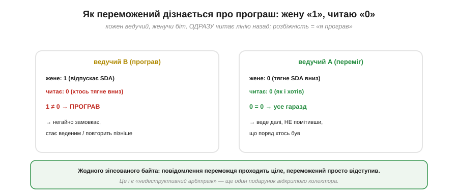
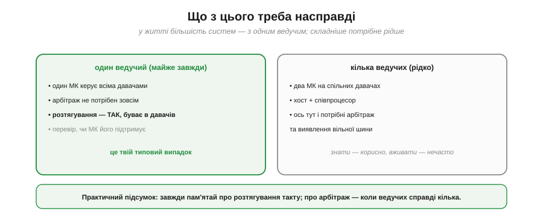

# Розтягування такту й арбітраж

Дві ситуації, рідші за звичайний обмін, у реальному житті все ж трапляються — і I2C розв'язує їх обидві напрочуд елегантно, причому **тим самим** механізмом [відкритого колектора](book:electronics/open-collector), на якому тримається вся шина. Перша: ведений **не встигає** за тактом ведучого. Друга: на шині **кілька** ведучих, і вони можуть заговорити одночасно. Розберімо обидві — і в кожній спрацьовує те саме просте рішення «тягнути вниз перемагає», що виявляється напрочуд могутнім.

### Розтягування такту: ведений каже «зачекай»

Уявімо повільний ведений: щоб віддати вимір, йому треба спершу його **порахувати** (зробити аналого-цифрове перетворення, обробити). А ведучий уже цокає тактом, вимагаючи даних. Як веденому сказати «стривай, я ще не готовий»? У нього є лише дві лінії — і він користується SCL. Ведений просто **тримає SCL низьким** довше, ніж хотів би ведучий.

*Рис. Ведучий уже відпустив SCL, щоб підняти його у «1» і дати наступний такт, — але лінія не піднялась: ведений тримає її внизу. Ведучий мусить чекати. Щойно ведений відпускає SCL, лінія підіймається, і обмін триває. Це **розтягування такту** (*clock stretching*).*

Працює це лише завдяки відкритому колектору: SCL — спільна лінія з монтажним «І», тож **будь-хто** може притримати її внизу, і ведучий нічого з цим не вдіє, поки ведений не відпустить. По суті це **єдиний** спосіб для веденого вповільнити ведучого — таке собі «гальмо» знизу. Багато давачів ним користуються, коли їм потрібен час на внутрішню роботу.

### Чому працює й де пастка

Розтягування тримається на одній умові з боку ведучого: він мусить **дивитися на реальний SCL**, а не просто «цокати» за внутрішнім таймером. Відпустив лінію в «1» — перевір, чи вона **справді** піднялась; ні — значить, хтось тримає, треба чекати.

*Рис. Правильний ведучий, відпустивши SCL, читає реальний рівень лінії й чекає, поки вона підніметься. Наївний ведучий цокає за жорстким таймером, не дивлячись на лінію, — і «переїжджає» розтягування, зчитуючи недоготовлені дані. Це часта вада програмних (bit-bang) реалізацій і дешевих контролерів.*

Ось де ховається підступна біда. Не всі ведучі поважають розтягування: програмні («bit-bang») реалізації або контролери з жорсткими таймінгами можуть **ігнорувати** притриманий SCL і йти далі за розкладом — а тоді зчитують сміття. Бувають і ведені з кривим розтягуванням. Тому це класичне джерело «іноді працює, іноді ні».

> 🔧 **Навіщо це.** Якщо давач **зрідка** віддає сміття або обмін «підвисає», одна з перших підозр — **розтягування такту**: чи підтримує його твій ведучий? Апаратні I2C-блоки мікроконтролерів зазвичай так, програмні — не завжди. У документації шукай «clock stretching»; якщо ведений його активно використовує, а ведучий не підтримує, — або міняй ведучого на апаратний, або шукай у давача режим без розтягування.

### Кілька ведучих і вільна шина

Тепер друге питання — **кілька ведучих**. I2C дозволяє мати на шині більш ніж один ведучий: наприклад, два мікроконтролери, що ділять спільні давачі, або хост і співпроцесор.

*Рис. Два мікроконтролери-ведучі й кілька ведених на спільних лініях. Перш ніж почати обмін, ведучий перевіряє, що шина **вільна** — обидві лінії високі (тобто хтось щойно дав СТОП). Так двоє не наступають одне одному, якщо не стартують одночасно.*

Перший запобіжник проти зіткнення — **виявлення вільної шини**: ведучий не починає, поки бачить чужий обмін (лінії «зайняті»), а чекає СТОПу й стану спокою. Але що, як двоє **майже одночасно** вирішили почати? Ось тут і вмикається найкрасивіший механізм I2C.

### Арбітраж: хто жене «0», той виграє

Якщо два ведучі стартували разом, вони починають **арбітраж** — змагання за шину, що йде **біт за бітом** прямо на лінії SDA. І вирішує його все те саме правило відкритого колектора: «тягнути вниз перемагає».

*Рис. Обидва ведучі женуть свої біти на SDA одночасно. Поки біти однакові — нічого не видно. На першому ж біті, де вони різні (тут третій), один жене «1» (відпускає лінію), інший «0» (тягне вниз) — і лінія стає «0» (монтажне «І»). Той, хто жене «0», переміг.*

Механізм такий: кожен ведучий, женучи свій біт, **одночасно читає** реальний стан SDA. Поки обидва женуть однакове — лінія саме таке й показує, ніхто нічого не помічає. Та на першому біті, де вони розійшлися, один жене «1» (відпускає), а інший «0» (тягне) — і лінія, за монтажним «І», стає **0**. Той, хто хотів «1», бачить на лінії «0» — і розуміє, що програв.

### Як переможений розуміє програш

Подивімося на цей момент зблизька — він і є серцем арбітражу.

*Рис. Ведучий B жене «1» (відпускає SDA), та читає на лінії «0» — розбіжність! Це означає «я програв»: B негайно замовкає й відступає (стане веденим або повторить пізніше). Ведучий A жене «0» і читає «0» — усе, як хотів; він **навіть не помітив** суперника й веде своє повідомлення далі.*

Найкрасивіше тут — **недеструктивність**. Переможений (B) тихо відступає, щойно виявив розбіжність, а повідомлення переможця (A) проходить **цілим**, без жодного зіпсованого байта — A навіть не дізнається, що поряд хтось був. Жодних колізій, повторів, зіпсованих даних: один проходить, інший чемно чекає наступної нагоди. І все це — знову лише завдяки тому, що «0» на спільній лінії сильніший за «1».

### Синхронізація такту

Лишилася одна деталь: щоб двоє чесно порівнювали біти, вони мають **бачити однакові такти**. І це теж улаштовується саме собою через монтажне «І» — тепер уже на лінії SCL.

*Рис. Спільний SCL — це «І» тактів обох ведучих: лінія низька, поки хоч один тримає її внизу, і висока, лише коли всі відпустили. Тому низький період виходить «найдовший із низьких», високий — «найкоротший із високих», і обидва ведучі автоматично йдуть у ногу — а отже, порівнюють біти SDA в одні й ті самі моменти.*

Так такти кількох ведучих злипаються в один спільний ритм без жодного спеціального узгодження — просто з фізики відкритого колектора. Це й робить арбітраж справедливим: обидва учасники крокують синхронно.

### Що з цього треба насправді

Насамкінець — тверезий практичний підсумок, щоб не переоцінити складність.

*Рис. Переважна більшість систем — з **одним** ведучим (один мікроконтролер керує всіма давачами); там арбітраж не потрібен зовсім, а от **розтягування такту** трапляється часто, бо ним користуються давачі. Кілька ведучих (два МК на спільних давачах, хост + співпроцесор) — рідкісний випадок, де вже потрібні арбітраж і виявлення вільної шини.*

> 🔧 **Навіщо це.** Розстав пріоритети правильно. **Розтягування такту** стосується тебе майже завжди: переконайся, що твій ведучий його підтримує, інакше частина давачів капризуватиме. **Арбітраж** же на практиці потрібен рідко — лише коли на шині справді кілька ведучих; у звичайному проєкті «один МК + купа давачів» про нього можна не думати. Та знати, що він є й працює недеструктивно, корисно: побачивши на платі два процесори на спільній I2C, ти вже не здивуєшся, що вони не заважають одне одному.

Прикметно, що і розтягування такту, і арбітраж, і синхронізація тактів — усе це працює без жодного окремого механізму: одне-єдине правило «`0` на спільній лінії сильніший за `1`» дає і притримане «зачекай», і недеструктивне змагання за шину, і спільний ритм кількох ведучих. Та сама фізика [відкритого колектора](book:electronics/open-collector), на якій тримається передача звичайного байта, безкоштовно вирішує й ці два крайні випадки. А коли механіка шини зрозуміла до кінця, лишається перетворити її на практичне вміння — узяти реальний незнайомий давач і за [його регістровою картою](book:communications/register-map) «заговорити» з ним: увімкнути, налаштувати, прочитати вимір.

---
