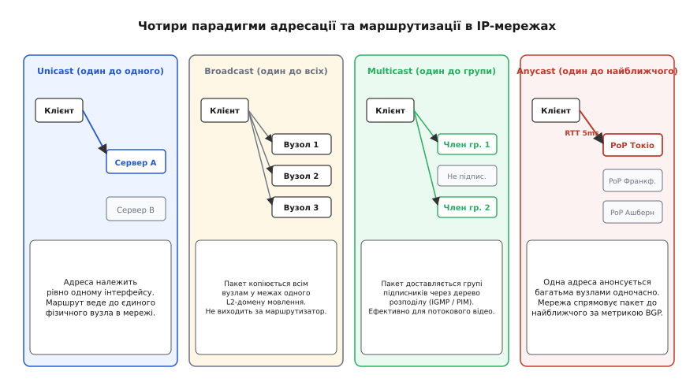
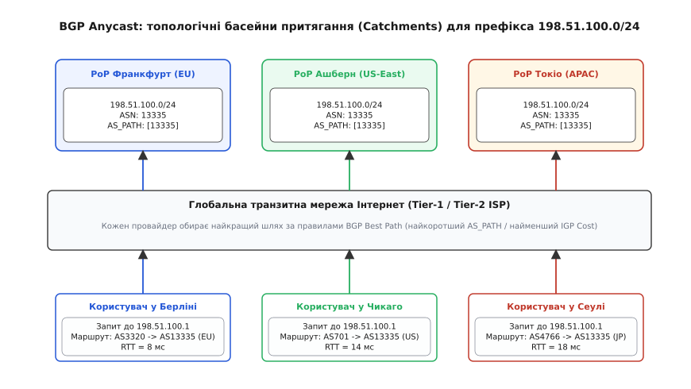
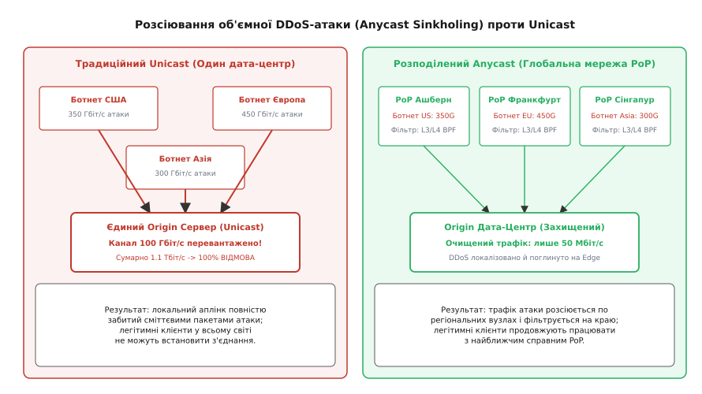
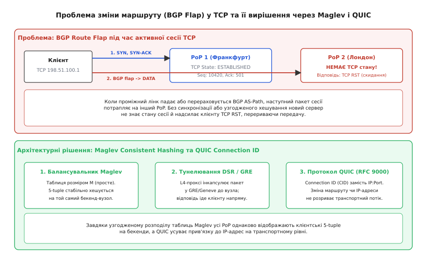
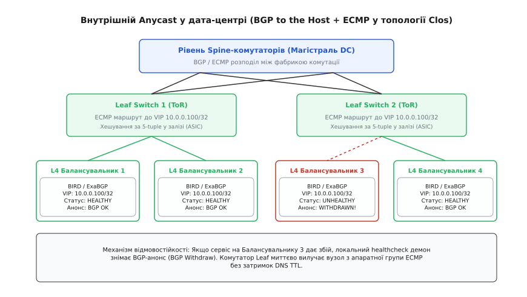

# Anycast і глобальне балансування трафіку

<preknowlist>
- [Маршрутизація](book:communications/ip-routing) — таблиці маршрутів, префікси, метрики та вибір наступного шлюзу (next-hop).
- [BGP: протокол між провайдерами](book:communications/bgp) — автономні системи (AS), атрибути AS_PATH та правила вибору маршруту.
- [CIDR і префікси](book:communications/cidr) — безкласова адресація та мінімальний розмір глобального анонсу /24.
- [Затримка й надійність](book:communications/latency-reliability) — характеристики каналів зв'язку, RTT та доставка пакетів.
- [Життєвий цикл TCP-з'єднання](book:communications/tcp-connection-lifecycle) — тристороннє рукостискання, підтримка стану сесії та прапорець RST.
</preknowlist>

Якщо розмістити центральний сервер глобальної веб-платформи чи служби DNS в одному дата-центрі у Франкфурті, користувач із Сіднея буде змушений щоразу чекати щонайменше 280–320 мілісекунд лише на одне кругове проходження сигналу (RTT, англ. *Round-Trip Time*). Світло в оптоволоконному кабелі фізично не здатне рухатися швидше за приблизно 204 000 кілометрів на секунду через показник заломлення кварцового скла (`n ≈ 1.468`), тому географічна відстань у 16 000 кілометрів накладає жорстку нижню межу на час відкриття будь-якої сторінки. Навіть без урахування затримок комутації та черг на проміжних маршрутизаторах теоретичний мінімум часу кругового проходження становить:

```
RTT_min = 2 · (d / c_glass)
= 2 · (16 000 км / 204 000 км/с)    [фізична межа швидкості світла в склі]
≈ 0.156 с = 156 мс                   [чиста оптична затримка в ідеальному вакуумі кабелю]
```

У реальній трансконтинентальній оптичній мережі з урахуванням вигинів траси, оптичних підсилювачів EDFA (англ. *Erbium-Doped Fiber Amplifier*) та ретрансляторів ROADM цей час подвоюється. Додайте сюди три послідовні кругові затримки на встановлення з'єднання TCP і погодження криптографічних ключів TLS 1.3 — і користувач чекає майже секунду ще до того, як браузер отримає перший байт HTML-відповіді. Ще гірше те, що єдиний канал зв'язку цього дата-центру з пропускною здатністю 100 Гбіт/с може бути за лічені секунди паралізований розподіленою DDoS-атакою потужністю 500 Гбіт/с, що призведе до повної глобальної недоступності сервісу для всіх континентів одночасно.

Спроба розв'язати цю проблему за допомогою традиційної географічної маршрутизації DNS (GeoDNS) натрапляє на непереборні перешкоди архітектури резолвінгу. Проміжні DNS-резолвери інтернет-провайдерів кешують відповіді на час дії TTL (англ. *Time to Live*), через що клієнти продовжують надсилати запити на аварійний сервер протягом десятків хвилин після його падіння. Ба більше, авторитетний DNS-сервер бачить IP-адресу провайдерського резолвера, а не кінцевого клієнта. Розширення EDNS0 Client Subnet (ECS, RFC 7871), покликане передавати підмережу клієнта авторитетному серверу, масово блокується публічними резолверами (зокрема Cloudflare `1.1.1.1`) з міркувань конфіденційності. У результаті користувач корпоративної мережі в Токіо з резолвером у Лондоні буде помилково спрямований на європейський сервер замість азійського, отримуючи колосальну штучну затримку.

Фундаментальне вирішення полягає в зміні самої парадигми мережевого адресування: замість прив'язки однієї IP-адреси до одного фізичного інтерфейсу (Unicast), десятки серверів у різних куточках планети налаштовуються з абсолютно однаковою IP-адресою і одночасно анонсують її через глобальний протокол міждоменної маршрутизації BGP. Цей підхід отримав назву **Anycast** (англ. *anycast*, утворено за аналогією до *unicast*, від лат. *unus* — «один», та англ. *cast* — «кидати, спрямовувати»; маршрутизація за принципом «доставлення до будь-якого одного найближчого із групи»).

---

## 1. Парадигми адресації та фундаментальна концепція Anycast

В архітектурі протоколу IP визначено чотири базові моделі доставки пакетів від джерела до одержувача.


*Порівняння парадигм передавання: Anycast спрямовує пакет до найближчого екземпляра зі спільною IP-адресою засобами глобальної маршрутизації.*

### Порівняльний аналіз моделей доставки

1. **Unicast (один до одного, від лат. *unus* — один):** класична модель адресації. Кожна IP-адреса глобально унікальна й належить рівно одному фізичному або віртуальному мережевому інтерфейсу. Маршрутизатори шукають єдиний найкоротший шлях до цього конкретного вузла. Якщо цей сервер виходить із ладу або його канал перевантажується, сервіс стає повністю недоступним.
2. **Broadcast (один до всіх, від англ. *broadcast* — широкомовлення):** пакет, надісланий на спеціальну адресу (наприклад, `255.255.255.255`), копіюється комутаторами всім вузлам у межах поточного канального L2-домену. Маршрутизатори ніколи не випускають широкомовні пакети за межі локальної підмережі, щоб уникнути широкомовних штормів у глобальній мережі.
3. **Multicast (один до вибраної групи, від лат. *multus* — численний):** пакет надсилається на спеціальну групову адресу (діапазон `224.0.0.0/4` для IPv4 або `ff00::/8` для IPv6). Спеціалізовані протоколи маршрутизації (IGMP, PIM) будують дерево доставки, копіюючи пакети лише тим одержувачам, які явно підписалися на групу. Це ефективно для потокового телебачення та біржових котирувань, але непридатне для персоналізованих двосторонніх сесій.
4. **Anycast (один до найближчого з множини, RFC 4786):** група географічно розподілених незалежних серверів налаштовується з **однаковою IP-адресою**. Кожен із цих серверів оголошує цей IP-префікс у таблицю маршрутизації. Мережеві маршрутизатори сприймають ці оголошення як множину альтернативних шляхів до одного й того самого пункту призначення і самостійно спрямовують пакети кожного клієнта до **топологічно найближчого** сервера.

### Прозорість для клієнта на мережевому рівні L3

Головна архітектурна перевага Anycast полягає в тому, що він не вимагає жодних змін або спеціальної підтримки в операційних системах кінцевих клієнтів (комп'ютерів, смартфонів чи IoT-пристроїв). Клієнтський мережевий стек формує звичайнісінький Unicast IP-пакет, призначений для цільової адреси (наприклад, `198.51.100.1`). 

Уся магія вибору сервера відбувається всередині маршрутизаторів провайдерів за рахунок базового механізму просування пакетів мережевого рівня L3. Маршрутизатор переглядає свою локальну таблицю пересилання (FIB, англ. *Forwarding Information Base*), знаходить наступний шлях (*next-hop*) з найменшою метрикою і відправляє пакет у відповідний вихідний порт. Клієнт навіть не здогадується, що його запит обслужив сервер у Варшаві, тоді як запит сусіда з сусідньої країни пішов на сервер у Франкфурті.

---

## 2. Механіка міждоменної BGP Anycast-маршрутизації

Робота Anycast у масштабах глобального інтернету цілком базується на протоколі прикордонного шлюзу **BGP-4** (англ. *Border Gateway Protocol*, RFC 4271).


*Формування зон притягання Anycast: клієнти потрапляють у найближчий дата-центр на основі довжини шляху автономних систем та метрик BGP.*

### Правило мінімального префікса (/24 для IPv4 та /48 для IPv6)

Глобальна таблиця маршрутизації інтернету (відома як DFZ, англ. *Default-Free Zone*, зона без маршруту за замовчуванням) містить понад 950 000 маршрутів. Для захисту оперативної пам'яті та апаратних таблиць TCAM (англ. *Ternary Content-Addressable Memory*) магістральних маршрутизаторів світові Tier-1 та Tier-2 провайдери застосовують жорсткі фільтри префіксів:

- Для **IPv4** мінімальний розмір префікса, який маршрутизатори приймають і розповсюджують у глобальному інтернеті, становить **/24** (блок із 256 IP-адрес). Якщо оператор спробує анонсувати вужчий префікс (наприклад, `/25` або `/32`), магістральні шлюзи негайно відкинуть такий анонс.
- Для **IPv6** мінімальним глобальним префіксом є **/48** (блок із 65 536 підмереж `/64`).

Таким чином, для запуску публічного глобального BGP Anycast сервісу організація повинна володіти власним зареєстрованим номером автономної системи (ASN, англ. *Autonomous System Number*) та принаймні одним префіксом `/24` для IPv4 або `/48` для IPv6, отриманим від регіонального інтернет-реєстратора (RIPE NCC, ARIN, APNIC тощо).

### Топологічні зони притягання (Anycast Catchments)

Сукупність користувачів та автономних систем, чиї пакети BGP спрямовує до конкретного географічного вузла Anycast (PoP, англ. *Point of Presence*), називається **зоною притягання** або **басейном водозбору** (англ. *Anycast Catchment Area*).

Кордони цих зон визначаються не географічною відстанню в кілометрах, а виключно **мережевою топологією BGP**. Кожен BGP-маршрутизатор у світі приймає кілька альтернативних анонсів префікса `198.51.100.0/24` від різних вузлів Anycast і запускає стандартний алгоритм вибору найкращого шляху (*BGP Best Path Selection*):

```
Критерій 1: Найвищий локальний пріоритет (LOCAL_PREF, внутрішня політика ISP)
    │ (якщо рівні)
Критерій 2: Найкоротший вектор автономних систем (довжина AS_PATH)
    │ (якщо довжина однакова)
Критерій 3: Найменший тип походження (Origin: IGP < EGP < Incomplete)
    │ (якщо однакові)
Критерій 4: Найменший дискримінатор Multi-Exit (MED)
    │ (якщо однакові)
Критерій 5: Перевага зовнішнього eBGP над внутрішнім iBGP
    │ (якщо однакові)
Критерій 6: Найменша метрика внутрішнього протоколу (IGP Cost до BGP next-hop)
    │ (якщо однакові)
Критерій 7: Tie-breaking: найменший BGP Router ID сусіднього маршрутизатора
```

Якщо провайдер у Києві має прямий піринг із дата-центром у Варшаві (де довжина `AS_PATH` дорівнює `[13335]`), і водночас бачить анонс із Франкфурта через транзитного оператора (`AS_PATH: [174, 13335]`), він вибере Варшаву за критерієм коротшого `AS_PATH`. Якщо ж обидва шляхи мають однакову довжину `AS_PATH`, вирішальну роль відіграє внутрішня затримка та вартість каналу за метрикою протоколів OSPF або IS-IS (критерій 6).

### Асиметрія маршрутизації: Hot-Potato проти Cold-Potato Routing

Маршрутизація Anycast є принципово асиметричною:
- **Прямий трафік (клієнт -> сервер):** провайдер клієнта зазвичай реалізує політику «гарячої картоплі» (*Hot-Potato Routing*) — він прагне якнайшвидше скинути вхідний пакет на найближчий стик пірингу з автономною системою Anycast, мінімізуючи навантаження на власну магістраль.
- **Зворотний трафік (сервер -> клієнт):** дата-центр Anycast відправляє відповідь, використовуючи політику «холодної картоплі» (*Cold-Potato Routing*) через власні виділені канали до точки обміну в регіоні клієнта для забезпечення мінімальної затримки.

У результаті прямий і зворотний пакети однієї сесії можуть проходити через абсолютно різні транзитні автономні системи, що вимагає відмови від міжмережевих екранів із суворою прив'язкою до напрямку інтерфейсу.

### Інженерне керування трафіком та моніторинг басейнів притягання

Оскільки інтернет динамічний, розміри зон притягання можуть виявитися незбалансованими: наприклад, вузол у Франкфурті може отримати 70% усього європейського трафіку й почати захлинатися, тоді як сусідній вузол у Відні буде недовантажений.

Для точного балансування зон притягання мережеві інженери використовують два головні інструменти:
1. **Подовження шляху (AS-Path Prepending):** сервер штучно збільшує довжину свого вектора `AS_PATH` у вихідних BGP-анонсах для вибраних провайдерів, дописуючи власний номер ASN кілька разів (наприклад, `AS_PATH: [13335, 13335, 13335]`). Інші маршрутизатори бачать цей шлях як довший і перемикають свій трафік на сусідній PoP.
2. **Маршрутні мітки BGP Communities (RFC 1997):** використання спеціальних цифрових тегів, які вказують транзитним провайдерам знижувати значення `LOCAL_PREF` або обмежувати розповсюдження маршруту (мітка `NO_EXPORT` дозволяє утримувати трафік суто всередині локальної країни або конкретної точки обміну трафіком IXP).

Для постійного моніторингу стабільності зон притягання інженери використовують глобальні мережі зондування (зокрема RIPE Atlas та власні BGP Looking Glasses), які кожні кілька хвилин виконують трасування та перевіряють, чи не стався випадковий витік маршрутів (*Route Leak*), який міг би перенаправити трафік цілого континенту на один перевантажений регіональний вузол.

---

## 3. Anycast у критичній інфраструктурі Інтернету

Завдяки природній масштабованості та стійкості до відмов технологія Anycast стала фундаментом, на якому тримається надійність світового інтернету.

### Кореневі сервери DNS (Root DNS Servers)

Історично коренева зона DNS була жорстко обмежена 13 IP-адресами (літери від `A` до `M`) через 512-байтний ліміт розміру UDP-пакета за стандартом RFC 1035. Будь-яке збільшення кількості адрес призводило до фрагментації IP або примусового переходу на повільний TCP.

У 2002–2003 роках консорціум ISC та європейський реєстратор RIPE NCC успішно застосували BGP Anycast для кореневих серверів `f.root-servers.net` та `k.root-servers.net`. Це дозволило зберегти 13 логічних IP-адрес для сумісності з протоколами, розмістивши за кожною літерою десятки й сотні фізичних серверних кластерів по всьому світу. Детальний історичний огляд цієї кризи та її вирішення наведено в [історичному нарисі про Anycast у кореневих серверах DNS](book:communications/anycast/hist-root-dns-anycast.md).

### Мережі доставки контенту (CDN) та авторитетні сервери імен

Сучасні CDN-провайдери (як-от Cloudflare, Fastly, Akamai) та постачальники публічних DNS-резолверів (Google `8.8.8.8`, Cloudflare `1.1.1.1`, Quad9 `9.9.9.9`) використовують BGP Anycast для мінімізації затримок користувачів:

- **Термінація TCP/TLS на периферії (Edge Termination):** користувач виконує рукостискання TCP та TLS із найближчим сервером Anycast PoP на відстані 2–10 мс. У разі використання протоколу TLS 1.3 фаза погодження криптографічних ключів займає рівно 1 RTT (або 0-RTT при відновленні попередньої сесії), що скорочує затримку старту сесії в 5–10 разів порівняно з централізованим сервером.
- **Кешування статичного контенту:** важкі медіафайли, скрипти та зображення віддаються клієнту прямо з пам'яті локального крайового сервера, повністю розвантажуючи центральний сервер-джерело (Origin).

### Захист від об'ємних DDoS-атак та DNSSEC-ампліфікації

Найважливішою властивістю Anycast є здатність діяти як гігантський глобальний поглинач трафіку (*DDoS Sinkhole*).


*Розсіювання DDoS-атаки: локальні PoP поглинають і фільтрують трафік ботнетів у своїх регіонах, не допускаючи перевантаження ядра.*

Впровадження криптографічних підписів DNSSEC (RFC 4033) збільшило типовий розмір відповіді DNS з 60 байтів до 1500–3000 байтів (записи `RRSIG`, `DNSKEY`). Зловмисники використовують це для атак відбиття (DNS Amplification DDoS) з коефіцієнтом посилення до 50x–70x, надсилаючи підроблені UDP-запити від імені жертви до відкритих резолверів.

Якщо ботнет генерує атаку сумарною потужністю 1.2 Тбіт/с проти звичайної Unicast-адреси, цей трафік сходиться в єдину точку і повністю перевантажує канали дата-центру.

В Anycast-мережі відбувається **природне просторове розсіювання**:
- 350 Гбіт/с атаки від ботів у Північній Америці потрапляють на найближчі вузли в Ашберні та Сан-Хосе;
- 450 Гбіт/с європейських ботів поглинаються дата-центрами у Франкфурті та Лондоні;
- 300 Гбіт/с азійського трафіку фільтруються в Токіо та Сінгапурі.

Кожен регіональний вузол оснащений апаратними або програмними фільтрами (XDP / eBPF на базі ядра Linux), які відкидають шкідливі пакети на швидкості інтерфейсу (Wire Speed), а чистий легітимний трафік передається бекенду. Атака локалізується й гаситься на периферії, не впливаючи на користувачів в інших регіонах.

---

## 4. Виклики сесійних протоколів: TCP over Anycast та Maglev

Якщо для протоколів без встановлення з'єднання (UDP: DNS, NTP) Anycast працює ідеально, то робота протоколів зі збереженням стану (Connection-oriented, зокрема TCP) тривалий час вважалася ненадійною через специфіку глобальної маршрутизації.


*Проблема BGP Flapping у TCP-сесіях та методи її подолання через таблиці Maglev, міжвузлове тунелювання та протокол QUIC.*

### Проблема зміни маршрутів (BGP Route Flapping та Anycast Jitter)

З'єднання TCP вимагає збереження контексту на сервері: блоку керування передаванням (TCB, англ. *Transmission Control Block*), що містить поточні номери послідовностей (*Sequence/ACK numbers*), стан вікна перевантаження та криптографічні ключі сесії TLS.

У глобальному інтернеті топологія BGP перебуває в постійному русі: оптичний кабель між провайдерами може бути пошкоджено, сесія eBGP перезапускається, або провайдер змінює значення `LOCAL_PREF`. Це викликає **ляскання / миготіння маршруту** (англ. *route flapping*) та коливання шляху (*anycast jitter*).

Якщо під час активного завантаження великого файлу через TCP BGP раптово змінює найкращий маршрут, черговий пакет із даними замість Франкфурта надходить на сервер у Лондоні. Сервер у Лондоні нічого не знає про це з'єднання (його таблиця станів порожня). За стандартом RFC 793, отримавши неочікуваний TCP-пакет без прапорця `SYN`, сервер зобов'язаний надіслати у відповідь пакет із прапорцем **`TCP RST`** (Reset). Клієнтський браузер отримує розрив з'єднання з помилкою *Connection Reset by Peer*.

### Пастка IP-фрагментації та чорні діри Path MTU Discovery

Ще одним важким крайовим випадком Anycast є передача фрагментованих IP-пакетів. Перший фрагмент містить повний L4-заголовок (порти джерела й призначення), тому комутатори ECMP успішно обчислюють 5-tuple хеш. Другий та наступні фрагменти містять лише зміщення (*Fragment Offset*) та ідентифікатор пакета без номерів портів.

У результаті комутатор ECMP або проміжний BGP-маршрутизатор обчислює хеш суто від 2-tuple (IP-адрес) і може спрямувати другий фрагмент на **інший сервер** або інший балансувальник. Сервер, отримавши фрагмент без початку, безрезультатно очікує тайм-аут збирання (*IP Reassembly Timeout*) і відкидає дані. Для подолання цієї пастки Anycast-мережі примусово затискають максимальний розмір сегмента TCP (TCP MSS Clamping на рівні `1400–1420` байтів) та блокують фрагментацію на рівні протоколів.

### Механізм SYN Cookies для захисту від переповнення стану

Для захисту від атак типу SYN Flood сервери Anycast PoP застосовують механізм криптографічних кук TCP (SYN Cookies за RFC 4987). Сервер не створює структуру TCB в оперативній пам'яті після отримання першого пакета `SYN`, а кодує параметри з'єднання (зокрема узгоджений MSS та порядковий номер) безпосередньо в 32-бітне поле `Sequence Number` відповіді `SYN-ACK`:

```
Sequence_Number = Crypto_Hash(Src_IP, Dst_IP, Src_Port, Dst_Port, Secret_Key, Timestamp)
```

Коли клієнт надсилає фінальний `ACK`, будь-який сервер у Anycast-кластері може перевірити криптографічний хеш і створити повноцінне з'єднання без попереднього збереження стану, що робить вхідний шлюз абсолютно невразливим до вичерпання таблиці сокетів.

### Розв'язання на рівні L4: Алгоритм узгодженого хешування Maglev

Для усунення цієї вразливості компанія Google у 2016 році представила архітектуру розподіленого балансувальника **Maglev**.

Головна ідея полягає в тому, щоб усунути необхідність централізованої синхронізації стану між серверами. Замість цього всі L4-балансувальники в усіх дата-центрах використовують **детерміновану таблицю узгодженого хешування** фіксованого розміру `M` (де `M` — велике просте число, наприклад `65537`).

Для кожного вхідного пакета обчислюється хеш від його 5-tuple:
```
5-tuple: (Source IP, Destination IP, Source Port, Destination Port, Protocol)
```
Оскільки алгоритм побудови таблиці Maglev є строго детермінованим, будь-який балансувальник у будь-якому PoP завжди обчислить абсолютно однаковий цільовий бекенд для одного й того самого клієнтського потоку. Навіть при виході з ладу частини бекендів Maglev гарантує, що перерозподілено буде лише `1/N` сесій, тоді як решта `(N-1)/N` залишаться непорушними. Детальний математичний аналіз та робочий вихідний код алгоритму реалізовано у [практичному проєкті побудови таблиці Maglev](book:communications/anycast/proj-maglev-consistent-hash.md).

### Міжвузлове тунелювання та пряме повернення від сервера (DSR)

У разі міжрегіонального перемикання BGP крайовий балансувальник нового PoP може бути налаштований на передачу невідомого пакета старому PoP через інкапсуляцію в тунель **GRE**, **IPIP** або **Geneve**. 

При цьому застосовується режим **прямого повернення від сервера** (DSR, англ. *Direct Server Return*): важкі пакети відповідей від бекенда надсилаються клієнту безпосередньо через найближчий маршрутизатор без зворотного проходження через балансувальник навантаження, що кардинально знижує навантаження на L4-проксі.

### Транспортний прорив: протокол QUIC (RFC 9000)

Остаточне та найбільш елегантне вирішення проблеми нестабільності TCP over Anycast було реалізовано в сучасному транспортному протоколі **QUIC** (основа стандарту HTTP/3).

QUIC відмовився від концепції прив'язки сесії до 4-tuple (IP-адрес та портів клієнта і сервера). Замість цього кожне з'єднання ідентифікується 64-бітним або 128-бітним ідентифікатором з'єднання — **Connection ID (CID)**:

```
+----------------------------------------------------------------+
| Заголовок QUIC-пакета: містить явний Connection ID (CID)       |
+----------------------------------------------------------------+
| Пакет маршрутизується балансувальником за CID, а не за IP/Port |
| Зміна маршруту BGP, перемикання з Wi-Fi на LTE -> Сесія ЖИВЕ!  |
+----------------------------------------------------------------+
```

Якщо маршрут BGP перемикається на інший PoP або клієнт переходить із домашнього Wi-Fi на мобільну мережу LTE, новий Anycast-вузол вичитує CID із заголовка QUIC, розшифровує вбудовану інформацію про цільовий сервер і продовжує передавання даних без тривалого повторного рукостискання та скидання з'єднання (*Connection Migration*).

---

## 5. Внутрішній Anycast у дата-центрах (ECMP Anycast)

Технологія Anycast застосовується не лише в глобальному інтернеті, а й усередині сучасних дата-центрів для горизонтального масштабування кластерів проксі-серверів (Nginx, Envoy, HAProxy) та L4-балансувальників (IPVS, Katran).


*Внутрішній Anycast у дата-центрі: горизонтальне масштабування L4-балансувальників через протокол ECMP на комутаторах стійки.*

### Архітектура «BGP to the Host» у топології Клоза (Clos Topology)

У класичних мережах дата-центрів типу Spine-Leaf кожен сервер-балансувальник запускає локальний маршрутизуючий демон (BIRD, FRRouting або ExaBGP) і встановлює сесії eBGP/iBGP безпосередньо з комутаторами своєї стійки (Top-of-Rack / Leaf).

Усі сервери пулу налаштовують на своєму віртуальному інтерфейсі `dummy0` або `lo` спільну віртуальну адресу — **Anycast VIP** (наприклад, `10.0.0.100/32` для IPv4 або `fd00::100/128` для IPv6) та одночасно анонсують її комутаторам стійки.

### Багатошляхове апаратне балансування ECMP (Equal-Cost Multi-Path)

Комутатори Leaf та Spine отримують кілька однакових маршрутів до однієї й тієї самої IP-адреси `10.0.0.100/32` з абсолютно однаковою метрикою. 

Замість вибору одного маршруту комутатор активує режим **ECMP** (англ. *Equal-Cost Multi-Path*, RFC 2992): мережевий процесор комутатора (ASIC) обчислює апаратний хеш від 5-tuple вхідного пакета і рівномірно розподіляє пакети між усіма доступними фізичними лінками до серверів на швидкості порту (40/100/400 Гбіт/с) із нульовою затримкою.

У ядрі Linux поведінка багатошляхового хешування регулюється системним параметром `fib_multipath_hash_policy`:

```bash
# Встановлення повноцінного 5-tuple хешування для IPv4/IPv6 у ядрі Linux
sysctl -w net.ipv4.fib_multipath_hash_policy=1
sysctl -w net.ipv6.fib_multipath_hash_policy=1
```

Значення `policy=1` активує обчислення хешу з урахуванням L4-портів (Source/Destination Port), що забезпечує рівномірний розподіл незалежних TCP/UDP сесій одного клієнта по різних каналах ECMP.

### Миттєва відмовостійкість без участі DNS

Якщо веб-сервіс або L4-проксі на одному з серверів виходить із ладу, локальний демон моніторингу працездатності (Healthcheck) негайно надсилає команду BGP-демону зняти анонс маршруту (**BGP Withdraw**). 

Комутатор стійки за лічені мілісекунди вилучає несправний сервер зі своєї апаратної таблиці ECMP. Весь подальший трафік плавно перерозподіляється між рештою справних серверів пулу. Це забезпечує абсолютну відмовостійкість без очікування оновлення DNS-кешів. Повний посібник із налаштування мережевих інтерфейсів Linux, конфігурацій BIRD та ExaBGP наведено у [довіднику з конфігурації BGP-демонів для Anycast VIP](book:communications/anycast/api-bgp-anycast-config.md).

---

## 6. Порівняльний інженерний аналіз: Anycast проти GeoDNS

Вибір між BGP Anycast та географічним DNS (GeoDNS) є одним із ключових архітектурних рішень при побудові глобальних розподілених систем.

| Критерій | BGP Anycast | GeoDNS (Unicast + DNS Routing) |
|---|---|---|
| **Рівень прийняття рішень** | Мережевий рівень L3 (маршрутизатори інтернет-провайдерів). | Прикладний рівень L7 (авторитетні DNS-сервери). |
| **Точність маршрутизації** | Базується на реальній топології BGP та найкоротшому шляху мережі. | Базується на базах даних GeoIP IP-адреси DNS-резолвера (можливі похибки). |
| **Швидкість реакції на аварію** | Секунди (через сходження BGP або BFD-таймаути). | Хвилини або години (обмежено кешуванням DNS TTL на резолверах). |
| **Стійкість до DDoS-атак** | Максимальна: трафік природно розсіюється по всій мережі PoP (*Sinkholing*). | Низька: зловмисники можуть атакувати цільову Unicast IP напряму, оминаючи DNS. |
| **Вимоги до інфраструктури** | Власна ASN, виділений префікс `/24` IPv4 або `/48` IPv6, підтримка BGP у дата-центрах. | Звичайні Unicast IP-адреси у будь-яких провайдерів чи публічних хмарах (AWS, GCP). |
| **Сесійні протоколи (TCP)** | Потребує узгодженого хешування (Maglev), DSR або QUIC. | Працює стандартно, оскільки клієнт спілкується з фіксованою Unicast IP. |
| **Вартість впровадження** | Висока (підтримка власної автономної системи, обладнання BGP). | Низька (налаштовується через хмарні сервіси Route 53, NS1, Cloudflare). |

> 🔧 **Навіщо це.**
>
> У сучасній інженерії вибір між Anycast та GeoDNS визначається типом сервісу:
> 1. **Anycast є безальтернативним стандартом для:** авторитетних DNS-серверів, публічних рекурсивних резолверів, мереж CDN, систем захисту від DDoS та L4-балансувальників усередині великих дата-центрів. Він гарантує мінімальний RTT та захист від перевантажень на мережевому рівні.
> 2. **GeoDNS залишається доцільним для:** сервісів із суворими вимогами до юридичного збереження даних у конкретній юрисдикції (Data Residency / GDPR), де трафік громадянина не повинен випадково потрапити на закордонний PoP, або для невеликих проєктів, які не мають власної автономної системи та орендують сервери у звичайних публічних хмарах.

---

## 7. Підсумковий синтез

Anycast подолав фундаментальну суперечність між географічною віддаленістю користувачів та швидкістю світла в оптоволокні. Перетворивши IP-адресу з фіксованого географічного маркера на розподілений мережевий ідентифікатор, Anycast переклав завдання вибору найкоротшого шляху на глобальні протоколи маршрутизації інтернету.

Поєднання BGP Anycast на глобальному рівні, узгодженого хешування Maglev та апаратного ECMP усередині дата-центрів, а також сучасного протоколу QUIC на транспортному рівні формує єдиний непорушний та відмовостійкий стек, здатний надійно витримувати мультитерабітні кібератаки та обслуговувати мільярди користувачів із субмілісекундною затримкою мережевого відгуку. Ця неперевершена синергія перетворила Anycast із вузькоспеціалізованого експерименту для кореневих серверів DNS на головну загальносвітову магістральну парадигму доставки контенту в сучасному інтернеті.
