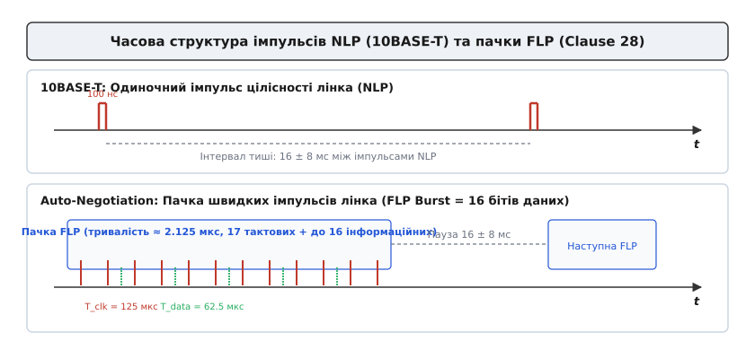
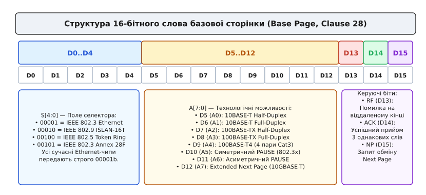
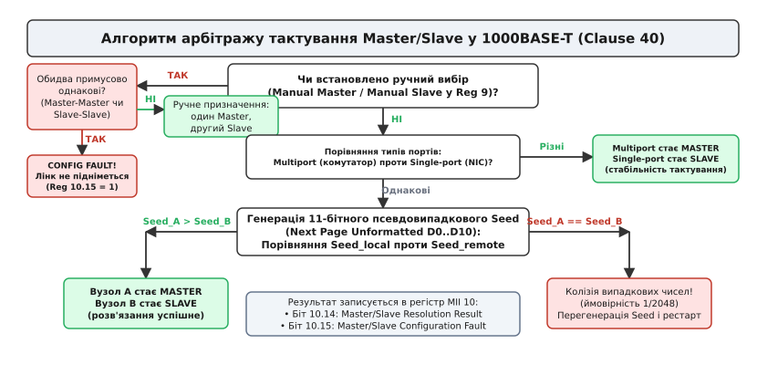
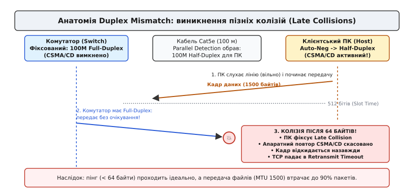

# Автопогодження Ethernet: протокол, сторінки та арбітраж

<preknowlist>
- [Вита пара](book:electronics/twisted-pair) — диференційне передавання сигналу, симетрія жил та гасіння зовнішніх наводок.
- [Фізика лінка](book:communications/ethernet-link-phy) — аналоговий трансивер PHY, лінійні кодери Manchester, MLT-3, PAM-5 та імпульси перевірки цілісності лінка.
- [Кадр Ethernet](book:communications/ethernet-frame) — структура L2-пакета: преамбула, MAC-адреси, поле типу, корисне навантаження та контрольна сума FCS.
- [CSMA/CD](book:communications/csma-cd) — множинний доступ із контролем несучої та виявленням колізій у напівдуплексних мережах.
</preknowlist>

Коли мережевий кабель витої пари підключають до порту комутатора або сервера, на протилежних кінцях дроту зустрічаються дві незалежні мікросхеми трансиверів фізичного рівня (PHY). Один чип може бути сучасним контролером зі швидкістю 10 Гбіт/с чи 1 Гбіт/с, а інший — застарілим адаптером на 100 Мбіт/с або навіть 10 Мбіт/с. Обидва пристрої ще не знають можливостей одне одного, на лінії відсутній спільний тактовий сигнал, а високошвидкісні лінійні кодери (MLT-3, PAM-5, PAM-16) не можуть увімкнутися, оскільки потребують наперед відомої частоти модуляції та узгодженого формату символів. Якщо обидва передавачі почнуть транслювати несумісні типи сигналів одночасно, на клемах приймачів утвориться нерозпізнаваний високочастотний шум.

Щоб розв'язати цю проблему до встановлення основного фізичного каналу зв'язку, інженери розробили апаратний протокол **автопогодження** (англ. *Auto-Negotiation* — автоматичні переговори; IEEE 802.3 Clause 28 для мідної витої пари, Clause 37 для оптики 1000BASE-X та Clause 73 для високошвидкісних бекплейнів). Протокол забезпечує надійний обмін двійковими словами (сторінками) на низькій базовій швидкості за допомогою спеціальних імпульсних послідовностей, що дозволяє двом вузлам безпечно з'ясувати спільні технологічні можливості, узгодити найвищу швидкість, встановити повнодуплексний режим та визначити джерело тактування лінії.

## 1. Фізичний рівень погодження: від імпульсів NLP до пачок FLP

Найперший стандарт витої пари 10BASE-T (IEEE 802.3i) використовував для перевірки наявності підключеного кабелю прості поодинокі імпульси перевірки цілісності — **NLP** (англ. *Normal Link Pulse*). Кожні `16 ± 8 мс` передавач відправляв у лінію короткий диференційний імпульс тривалістю **100 нс**. Якщо приймач фіксував регулярне надходження цих імпульсів, він вмикав індикатор Link Up. Проте імпульс NLP не ніс жодної інформації, крім самого факту фізичної присутності напруги в кабелі.

При розробці стандарту Fast Ethernet 100BASE-TX (IEEE 802.3u, Clause 28) виникла потреба передавати між трансиверами двійкові дані конфігурації ще до увімкнення високошвидкісної модуляції, зберігши при цьому повну сумісність зі старими мережевими картами 10BASE-T. Рішенням стало створення пачок швидких імпульсів лінка — **FLP** (англ. *Fast Link Pulse*).

### Структура та часові інтервали пачки FLP

Замість одного імпульсу NLP передавач формує коротку високочастотну пачку (англ. *burst*), яка складається з послідовності імпульсів тривалістю 100 нс кожен:

1. Загальна тривалість усієї пачки FLP становить приблизно **2.125 мкс**;
2. Пачка повторюється з періодом **16 ± 8 мс** (типово кожні 16 мс), що точно відповідає часовому інтервалу між імпульсами NLP у 10BASE-T;
3. Усередині кожної пачки розміщується рівно **17 тактових імпульсів** (англ. *Clock Pulses*), позначених від `C0` до `C16`, з інтервалом **125 ± 14 мкс** між сусідніми тактами;
4. Між кожною парою тактових імпульсів, рівно через **62.5 ± 7 мкс** після тактового фронту, зарезервовано часову позицію для **імпульсу даних** (англ. *Data Pulse*, біти від `D0` до `D15`):
   * Якщо на позиції `62.5 мкс` присутній імпульс напруги — це логічна одиниця (`1`);
   * Якщо на позиції `62.5 мкс` імпульс відсутній (тиша) — це логічний нуль (`0`).

```general
Час від початку:   0 мкс      62.5 мкс     125 мкс     187.5 мкс    250 мкс
Імпульси:          [ C0 ] ─── [ D0=1 ] ─── [ C1 ] ─── [ D1=0 ] ─── [ C2 ]
Тип:              Тактовий    Дані (1)    Тактовий     (Тиша, 0)   Тактовий
```

Таким чином, одна пачка FLP переносить рівно одне **16-бітне двійкове слово** (16 позицій даних `D0`–`D15`). Уся пачка містить від 17 імпульсів (якщо всі передані біти даних дорівнюють нулю) до 33 імпульсів (якщо всі 16 бітів даних дорівнюють одиниці).


*Часова структура сигналів на витій парі: порівняння поодиноких імпульсів NLP у 10BASE-T та пачок FLP із 16 бітами даних у протоколі Auto-Negotiation.*

### Фізична зворотна сумісність із 10BASE-T та стійкість до дрейфу нульової лінії

Геніальність конструкції FLP полягає в її електричній поведінці на застарілих приймачах та сумісності з ізоляційними трансформаторами (англ. *magnetics*). Вхідний аналоговий тракт мережевої карти 10BASE-T містить низькочастотний фільтр та інтегрувальний ланцюг, розраховані на частоту зрізу близько 10–15 МГц.

Коли вся пачка FLP тривалістю 2.125 мкс проходить крізь інтегрувальний фільтр 10BASE-T, приймач не встигає розрізнити окремі 33 імпульси всередині пачки. Інтегратор усереднює сумарний заряд пачки і сприймає її як **один широкий імпульс NLP**. Завдяки цьому старий пристрій 10BASE-T фіксує надходження сигналів цілісності кожні 16 мс і впевнено піднімає фізичний лінк, не маючи жодного уявлення про те, що всередині імпульсу передавалася складна таблиця параметрів Fast Ethernet.

Крім того, оскільки корисна інформація кодується наявністю або відсутністю імпульсу в часовому вікні `62.5 мкс`, а не постійною напругою, протокол абсолютно нечутливий до дрейфу нульової лінії (англ. *baseline wander*). Кожен імпульс має біполярну форму з нульовим інтегралом напруги, тому сердечники імпульсних трансформаторів не насичуються навіть під час безперервної передачі пачок FLP протягом годин.

> 🔧 **Навіщо це.**
> Завдяки частотній сумісності FLP з NLP стандарт IEEE 802.3 зберіг повну апаратну сумісність між поколіннями обладнання без додавання спеціальних перемикачів або окремих ліній сигналізації. Сучасний гігабітний комутатор можна підключити звичайним патч-кордом до старого верстата з картою 10BASE-T тридцятирічної давнини — зв'язок підніметься автоматично за частки секунди.

## 2. Структура базової сторінки Base Page та процес рукостискання

Інформаційною одиницею обміну під час початкової фази переговорів є **базова сторінка** (англ. *Base Page*). Це 16-розрядне двійкове слово, сформоване імпульсами `D0`–`D15` всередині пачки FLP. Формат Base Page чітко регламентований стандартом IEEE 802.3 Clause 28.


*16-розрядна структура слова Base Page: поля Selector, Technology Ability, біти Remote Fault, Acknowledge та Next Page.*

### Розподіл бітових полів Base Page

16 бітів базової сторінки розділені на функціональні групи:

1. **Поле вибору селектора (Selector Field `S[4:0]`, біти `D0`–`D4`)**:
   Визначає стандарт зв'язку, якому належить таблиця технологій. Значення `00001`b однозначно вказує на стандарт **IEEE 802.3 CSMA/CD Ethernet**. Інші історичні значення (наприклад, `00010`b для IEEE 802.9 ISLAN або `00100`b для IEEE 802.5 Token Ring) на практиці витіснені, тому сучасні Ethernet-контролери завжди передають комбінацію `00001`b. Приймач, який отримує невідоме значення селектора, відкидає сторінку як несумісну.

2. **Поле технологічних можливостей (Technology Ability Field `A[7:0]`, біти `D5`–`D12`)**:
   Бітова маска, в якій кожен біт позначає підтримку відповідного режиму передавання:
   * **`D5` (A0)**: `10BASE-T Half-Duplex` (напівдуплекс 10 Мбіт/с);
   * **`D6` (A1)**: `10BASE-T Full-Duplex` (повний дуплекс 10 Мбіт/с);
   * **`D7` (A2)**: `100BASE-TX Half-Duplex` (напівдуплекс 100 Мбіт/с);
   * **`D8` (A3)**: `100BASE-TX Full-Duplex` (повний дуплекс 100 Мбіт/с);
   * **`D9` (A4)**: `100BASE-T4` (спеціальний режим 100 Мбіт/с на 4 парах кабелю Cat3);
   * **`D10` (A5)**: `PAUSE` — підтримка симетричного апаратного керування потоком (IEEE 802.3x Flow Control);
   * **`D11` (A6)**: `Asymmetric PAUSE` — асиметричне керування потоком кадрами PAUSE;
   * **`D12` (A7)**: `Extended Next Page (XNP)` — підтримка 48-бітних розширених сторінок (використовується в 10GBASE-T, Clause 55).

3. **Біт віддаленої помилки (Remote Fault `RF`, біт `D13`)**:
   Встановлюється в `1`, якщо локальний пристрій виявив збій власного приймача або втрату несучої, інформуючи партнера про неможливість коректного прийому даних.

4. **Біт підтвердження (Acknowledge `ACK`, біт `D14`)**:
   Ключовий прапорець протокольного рукостискання. Встановлюється в `1` тільки після того, як вузол успішно прийняв і валідував **щонайменше три послідовні ідентичні сторінки** FLP від лінк-партнера.

5. **Біт наступної сторінки (Next Page `NP`, біт `D15`)**:
   Якщо цей біт встановлено в `1` хоча б одним із двох пристроїв, після завершення обміну Base Page трансивери переходять до розширеного протоколу передачі додаткових сторінок (Next Pages).

### Кінцевий автомат обміну сторінками (Handshake FSM)

Процедура узгодження на фізичному рівні проходить через строгу послідовність станів апаратного кінцевого автомата:

```general
[ TRANSMIT_DISABLE ] ──► [ ABILITY_DETECT ] ────► [ ACKNOWLEDGE_DETECT ] ────► [ COMPLETE_ACK ] ────► [ RESOLUTION ]
(Пауза тиші перед        (Відправка Base Page     (Прийом 3 слів партнера,    (Обидві сторони           (Вибір найвищого
 початком переговорів)    з бітом ACK = 0)         відправка ACK = 1)          підтвердили ACK = 1)      спільного пріоритету)
```

1. **Стан початкової тиші (Transmit Disable)**:
   При виявленні підключення кабелю або програмному скиданні PHY вимикає передавач на час від 500 до 1500 мс, щоб гарантувати скидання лінійних фільтрів лінк-партнера та переведення його приймача у стан пошуку FLP;
2. **Фаза виявлення можливостей (Ability Detect)**:
   Пристрої надсилають у кабель пачки FLP зі своїм словом Base Page, у якому біт `ACK` дорівнює `0`. Одночасно приймачі фільтрують вхідні імпульси;
3. **Фаза підтвердження (Acknowledge Detect)**:
   Отримавши три однакові сторінки FLP підряд (лічильник `ability_match == 3`), вузол фіксує отримані дані в регістр `ANLPAR` (Link Partner Ability) і починає транслювати свою сторінку з виставленим бітом `ACK = 1` (передається від 6 до 8 пачок FLP);
4. **Контроль узгодженості (Consistency Match)**:
   Логіка PHY перевіряє, щоб вміст бітів даних `D0`–`D13` не змінився між сторінками з `ACK = 0` та `ACK = 1`. Якщо віддалений партнер несподівано підмінив маску технологій під час переговорів, автомат скидається у вихідний стан `Transmit Disable`;
5. **Фаза фіксації квитанції (Complete Acknowledge)**:
   Коли обидва вузли зафіксували надходження сторінок із бітом `ACK = 1` (лічильник `ack_match == 3`), базова фаза переговорів вважається успішною;
6. **Перехід до арбітражу або Next Page**:
   Якщо обидва вузли мали `NP = 0`, кінцевий автомат переходить до виконання алгоритму вибору найвищого спільного пріоритету (Technology Priority Resolution). Якщо хоча б один вузол виставив `NP = 1`, запускається обмін сторінками Next Page.

## 3. Механізм Next Page та розширення для гігабітних і енергоефективних мереж

Базова сторінка Clause 28 мала лише 8 бітів у полі технологій `A[7:0]`, чого було достатньо для швидкостей 10 та 100 Мбіт/с. Проте з появою стандарту Gigabit Ethernet 1000BASE-T (IEEE 802.3ab, Clause 40), 10-гігабітного мідного стандарту 10GBASE-T (Clause 55) та технології енергоефективного Ethernet **EEE** (IEEE 802.3az) базових 16 бітів стало катастрофічно замало.

Для необмеженого розширення можливостей без зміни фізичного рівня FLP було розроблено протокол **Next Page** (IEEE 802.3 Annex 28C).

### Формат сторінки Next Page

Кожна сторінка Next Page також має довжину 16 бітів, але її внутрішнє призначення змінюється:

```general
Біт:    D15    D14    D13    D12    D11    D10 ... D0
Поле:   [NP]  [ACK]   [MP]  [Ack2]  [T]   [ Code / Data Field (11 бітів) ]
```

* **`D15` (NP)**: Наявність наступної сторінки (`1` — передача продовжується, `0` — це остання сторінка ланцюжка);
* **`D14` (ACK)**: Підтвердження прийому сторінки;
* **`D13` (Message Page, MP)**: Тип сторінки:
  * `MP = 1` — **Сторінка повідомлення** (англ. *Message Page*): 11 бітів `D0`–`D10` містять стандартизований 11-розрядний код повідомлення;
  * `MP = 0` — **Неформатована сторінка** (англ. *Unformatted Page*): 11 бітів містять довільні бітові прапорці або регістри конфігурації, визначені попередньою Message Page;
* **`D12` (Acknowledge 2, Ack2)**: Підтвердження здатності виконати команду або запит, переданий у повідомленні;
* **`D11` (Toggle, T)**: Біт чергування. Змінює свій стан (`0 → 1 → 0`) у кожній наступній переданій сторінці. Це захищає логіку прийому від повторної обробки тієї самої сторінки у разі короткочасних втрат синхронізації.

### Стандартизовані коди повідомлень Message Page

Комітет IEEE 802.3 зафіксував перелік глобальних кодів повідомлень (Annex 28C):

```general
Код повідомлення (D10..D0)   Призначення та стандарт
Message Code 1              Зарезервовано IEEE
Message Code 5              1000BASE-T Technology Ability (IEEE 802.3ab Clause 40)
Message Code 9              10GBASE-T Technology Ability (IEEE 802.3an Clause 55)
Message Code 10             EEE Capability (Energy Efficient Ethernet, IEEE 802.3az)
Message Code 11             2.5G/5GBASE-T Technology Ability (IEEE 802.3bz)
```

Коли гігабітний трансивер 1000BASE-T виконує автопогодження, він встановлює `NP = 1` у Base Page. Одразу після цього передається Message Page із кодом `5`, за якою слідує Unformatted Page, що містить біти конфігурації гігабітного лінка: підтримку 1000BASE-T Full/Half-Duplex, налаштування Master/Slave та 11-бітне псевдовипадкове число Seed для арбітражу тактування.

Для узгодження енергоефективного режиму EEE (IEEE 802.3az) передається Message Page з кодом `10`, після чого в неформатованій сторінці сторони обмінюються інформацією про здатність переходити у стан сну з низьким енергоспоживанням (Low Power Idle, LPI) під час пауз між передачею пакетів.

## 4. Арбітраж тактового генератора Master/Slave у 1000BASE-T

Швидкість 1000BASE-T кардинально відрізняється від 10BASE-T та 100BASE-TX фізичним принципом використання кабелю. Замість виділених односпрямованих пар передавання (`TX`) та прийому (`RX`), 1000BASE-T використовує **усі чотири пари кабелю одночасно в обох напрямках** (повнодуплексна передача на кожній парі з багаторівневою модуляцією PAM-5 на швидкості 125 Мбод).

На кожному кінці дроту власний потужний передавач створює амплітуду до ±1 В, яка потрапляє безпосередньо на вхід власного чутливого приймача. Щоб виділити з кабелю слабкий сигнал віддаленого партнера (який після 100 метрів кабелю загасає у десятки разів), мікросхема PHY використовує складні аналогові гібридні розв'язки та високошвидкісні цифрові фільтри придушення відлуння (англ. *Echo Cancellers*) і перехресних наводок (англ. *NEXT/FEXT Cancellers*).

Ці алгоритми цифрової обробки сигналів (DSP) можуть збігтися та успішно відфільтрувати відлуння лише за однієї фундаментальної умови: **обидва трансивери на лінії повинні працювати від єдиного тактового генератора**. Якщо два чипи працюватимуть від незалежних кварцових резонаторів із навіть мізерною різницею частот у 10 ppm (часток на мільйон), фазовий зсув між власним передавачем і прийнятим сигналом постійно дрейфуватиме. Адаптивні фільтри відлуння не зможуть відстежувати цей дрейф, що призведе до фазового розмиття сузір'я PAM-5 і катастрофічного зростання кількості бітових помилок (BER > 10⁻⁵).

Один чип зобов'язаний бути ведучим — **Master**, а інший — веденим — **Slave**:

* **Master PHY**: використовує свій високоточний локальний кварцовий генератор (125 МГц) для прямого тактування передавачів на всіх 4 парах;
* **Slave PHY**: вимикає власний кварц для передачі, відновлює тактову частоту Master з прийнятого аналогового сигналу за допомогою схеми фазового автопідлаштування частоти (PLL) і використовує цю **відновлену частоту** для тактування своїх власних передавачів у зворотний бік.


*Дерево прийняття рішень під час арбітражу Master/Slave у стандарті 1000BASE-T (IEEE 802.3 Clause 40).*

### Алгоритм розв'язання ролей Master/Slave

Розподіл ролей між двома портами виконується автоматично під час фази Next Page за алгоритмом IEEE 802.3 Clause 40:

1. **Рівень 1: Ручне примусове налаштування (Manual Configuration)**:
   Якщо системний адміністратор у конфігурації драйвера (регістр MII `9`, біти `12` та `11`) вручну зафіксував один пристрій як `Manual Master`, а інший як `Manual Slave`, арбітраж миттєво завершується.
   * *Помилка конфлікту (Master/Slave Configuration Fault)*: якщо обидва пристрої примусово встановлені в `Manual Master` або обидва в `Manual Slave`, арбітраж неможливий. Чип виставляє прапорець помилки `1000BASE-T Status Register (Reg 10.15 = 1)`, і гігабітний лінк **не піднімається взагалі**.

2. **Рівень 2: Тип пристрою (Port Type)**:
   Якщо ручне налаштування вимкнено, пріоритет визначається типом пристрою:
   * **Multiport Device** (багатопортовий комутатор або маршрутизатор) має переважне право стати **Master**;
   * **Single-port Device** (мережева карта ПК або сервера) за замовчуванням стає **Slave**.
   Це зроблено для того, щоб центральний комутатор тактував усі свої 24 чи 48 портів від єдиного внутрішнього генератора без потреби тримати десятки незалежних PLL.

3. **Рівень 3: Випадкове число Seed (11 бітів)**:
   Якщо з'єднуються два пристрої однакового типу (наприклад, два комутатори Switch-to-Switch або два сервери прямо через патч-корд):
   * Кожен трансивер апаратно генерує **11-розрядне псевдовипадкове число** `Seed[10:0]` (діапазон значень від `0` до `2047`) і передає його у неформатованій сторінці Next Page;
   * Вузол із **більшим значенням Seed стає Master**, а вузол із меншим значенням стає **Slave**;
   * Якщо випадкові числа повністю збіглися (ймовірність колізії становить `1/2048 ≈ 0.048%`), трансивери фіксують нічию, генерують нові псевдовипадкові числа та миттєво перезапускають процедуру автопогодження.

## 5. Механізм Parallel Detection та асиметрія Duplex Mismatch

Що відбувається, коли сучасний мережевий порт із увімкненим Auto-Negotiation підключають до старого пристрою (або порту комутатора, де адміністратор жорстко зафіксував `100 Mbps Full Duplex`, вимкнувши автопогодження)?

Віддалений фіксований пристрій не генерує пачок FLP! Натомість він одразу транслює або безперервний потік символів IDLE кодування MLT-3 (якщо це 100BASE-TX), або поодинокі імпульси NLP (якщо це 10BASE-T).

### Як працює паралельне детектування (Parallel Detection)

Щоб запобігти «зависанню» порту в очікуванні сторінок FLP, стандарт Clause 28 передбачає механізм **паралельного детектування** (англ. *Parallel Detection*).

Всередині трансивера PHY паралельно з логікою декодування FLP працюють апаратні енергетичні детектори та приймачі MLT-3 / Manchester. Якщо протягом встановленого таймауту пачки FLP не з'являються, але на лінії виявлено валідні символи IDLE стандарту 100BASE-TX (або імпульси NLP 10BASE-T), блок Parallel Detection:
1. Апаратно перемикає лінійний приймач на відповідну швидкість (100 Мбіт/с або 10 Мбіт/с);
2. Записує синтезоване значення в регістр `ANLPAR` (Link Partner Ability);
3. Встановлює статус успішного лінка `Link Up`.

### Чому Parallel Detection ЗАВЖДИ обирає Half-Duplex?

Символи MLT-3 IDLE або імпульси NLP свідчать про частоту модулювального генератора, але фізично **не несуть жодної інформації про дуплексний режим** (Half чи Full Duplex).

Згідно зі специфікацією IEEE 802.3, протокол зобов'язаний діяти за принципом максимальної безпеки:
* Якщо старий пристрій підключено до класичного колізійного концентратора (хаба), він працює у режимі Half-Duplex за правилами CSMA/CD;
* Якби Parallel Detection увімкнув Full-Duplex навмання, одночасна передача даних викликала б руйнування кадрів у спільному середовищі без виявлення колізій.
* Тому за стандартом IEEE 802.3 результат Parallel Detection **завжди і безальтернативно встановлює напівдуплексний режим (Half-Duplex)**.

### Анатомія катастрофи Duplex Mismatch

Якщо на порту комутатора адміністратор вручну прописав команду `speed 100 / duplex full` (вимкнувши автопогодження), а на клієнтському комп'ютері залишено заводське налаштування `Auto-Negotiation (Auto)`:

1. Комутатор жорстко працює у режимі **100BASE-TX Full-Duplex** (він не відправляє FLP);
2. Клієнтський комп'ютер через Parallel Detection розпізнає швидкість 100 Мбіт/с і, згідно зі стандартом, вмикає **100BASE-TX Half-Duplex**;
3. Виникає небезпечний стан **асиметрії дуплексу** (англ. *Duplex Mismatch*).


*Анатомія Duplex Mismatch: механізм виникнення пізніх колізій (Late Collisions) під час одночасної передачі комутатора Full-Duplex та клієнта Half-Duplex.*

При асиметрії дуплексу виникають такі процеси:
* **Комутатор (Full-Duplex)** вважає середовище виділеним: він передає кадри в будь-який момент часу, не перевіряючи наявність несучої (Carrier Sense вимкнено) і повністю ігноруючи будь-які вхідні сигнали як колізії;
* **Клієнт (Half-Duplex)** підпорядковується алгоритму CSMA/CD: перед передачею він слухає кабель, а під час передачі власного кадру стежить за приймачем;
* **Низьке навантаження (утиліта ping)**: короткі ICMP-пакети передаються почергово. Затримка мінімальна, втрат немає, адміністратор бачить зелений світлодіод і вважає, що мережа працює ідеально;
* **Високе навантаження (передача великого файлу через TCP)**:
  1. Клієнт починає передавати великий кадр розміром 1500 байтів;
  2. Комутатор у цей самий момент починає надсилати зустрічний пакет (наприклад, TCP ACK або інший потік даних);
  3. Для клієнта поява зустрічного сигналу під час власної передачі є **колізією**. Оскільки частина кадру вже пішла в лінію і час передачі перших 64 байтів (512 бітів — слот часу, англ. *Slot Time*) минув, ця колізія фіксується як **пізня колізія** (англ. *Late Collision*);
  4. За правилами CSMA/CD пізня колізія вважається апаратною аварією лінії (обрив або надмірна довжина кабелю), тому контролер MAC **не виконує автоматичний повтор передачі**;
  5. Кадр безповоротно втрачається, контрольна сума CRC на приймачі комутатора руйнується, а протокол TCP фіксує втрату пакета і входить у стан глибокого таймауту (Retransmission Timeout, RTO) зі скиданням вікна перевантаження `cwnd` до 1 MSS.

У результаті реальна швидкість передавання файлів у 100-мегабітній лінії падає до кількох кілобіт на секунду, зв'язок періодично «зависає», а лічильники інтерфейсу фіксують тисячі помилок `Late Collisions` та `FCS Errors`.

> 🔧 **Навіщо це.**
> Золоте правило мережевої інженерії: або Auto-Negotiation увімкнено **з обох боків лінка**, або швидкість і дуплекс жорстко зафіксовані **з обох боків одночасно**. Налаштування `Full-Duplex` з одного боку і `Auto` з іншого гарантовано породжує Duplex Mismatch через закладену в стандарт логіку Parallel Detection.

## 6. Таблиця пріоритетів технологій та регістри керування MII

Коли обидві сторони завершили обмін сторінками Base Page та Next Page, локальний трансивер порівнює список своїх можливостей із прийнятим списком можливостей партнера. Перетин цих двох множин дає перелік взаємно підтримуваних режимів.

З цього списку чип зобов'язаний вибрати рівно один спільний режим із найвищою продуктивністю. Для цього стандарт IEEE 802.3 визначає єдину глобальну **таблицю пріоритетів технологій** (англ. *Technology Priority Resolution Table*).

### Таблиця пріоритетів IEEE 802.3

```general
Пріоритет   Технологія              Стандарт IEEE       Швидкість    Режим дуплексу
1 (Найвищий) 100GBASE-CR4 / KR4      802.3bj / 802.3ba   100 Гбіт/с   Full-Duplex
2            40GBASE-CR4 / KR4       802.3ba             40 Гбіт/с    Full-Duplex
3            25GBASE-CR / KR         802.3by             25 Гбіт/с    Full-Duplex
4            10GBASE-T               802.3an             10 Гбіт/с    Full-Duplex
5            5GBASE-T                802.3bz             5 Гбіт/с     Full-Duplex
6            2.5GBASE-T              802.3bz             2.5 Гбіт/с   Full-Duplex
7            1000BASE-T Full-Duplex  802.3ab             1 Гбіт/с     Full-Duplex
8            1000BASE-T Half-Duplex  802.3ab             1 Гбіт/с     Half-Duplex
9            100BASE-T2 Full-Duplex  802.3y              100 Мбіт/с   Full-Duplex
10           100BASE-TX Full-Duplex  802.3u              100 Мбіт/с   Full-Duplex
11           100BASE-T4              802.3u              100 Мбіт/с   Half-Duplex (4 пари)
12           100BASE-T2 Half-Duplex  802.3y              100 Мбіт/с   Half-Duplex
13           100BASE-TX Half-Duplex  802.3u              100 Мбіт/с   Half-Duplex
14           10BASE-T Full-Duplex    802.3i              10 Мбіт/с    Full-Duplex
15 (Найнижчий) 10BASE-T Half-Duplex   802.3i              10 Мбіт/с    Half-Duplex
```

Обидва кінці лінії, виконуючи цей алгоритм паралельно над однаковими прийнятими наборами бітів, гарантовано доходять абсолютно однакового висновку без необхідності додаткового узгодження.

Повний опис бітових масок, стандартних регістрів MII (Registers 0, 1, 4, 5, 6, 9, 10), прапорців засувок (Latching Low / Latching High) та доступ до розширеного простору Clause 45 MMD наведено в окремій довідковій вставці [Карта регістрів MDIO автопогодження та бітові маски IEEE 802.3](book:communications/auto-negotiation/api-mii-registers.md).

Практичну реалізацію низькорівневого кінцевого автомата конфігурації, опитування статусів та алгоритму розв'язання технологій мовами C та ідіоматичним C++20 наведено у практичній вставці [Програмне опитування PHY та кінцевий автомат автопогодження](book:communications/auto-negotiation/proj-an-fsm.md).

## 7. Автопогодження в оптичних лінках та бекплейнах

Хоча автопогодження найчастіше асоціюється з мідною витою парою, подібні механізми стандартизовані й для інших середовищ передавання даних:

### Оптичний Gigabit Ethernet: Clause 37 (1000BASE-X)

В оптичних мережах Gigabit Ethernet (1000BASE-SX, 1000BASE-LX) та інтерфейсах SerDes (SGMII) передавання імпульсів FLP неможливе, оскільки лазер або світлодіод працює з безперервним потоком 8B/10B символів на швидкості **1.25 Гбод**.

Стандарт **IEEE 802.3 Clause 37** реалізує автопогодження безпосередньо всередині потоку 8B/10B символів:
* Замість пачок FLP передавач транслює спеціальні впорядковані набори конфігурації — **Configuration Ordered Sets** (`/C1/` та `/C2/`);
* Кожен набір `/C/` складається зі спеціального символу коми `K28.5` (`0011111010`b), за яким слідують два байти даних `D21.5` та `D2.2`, що переносять 16-бітне слово конфігурації (аналог Base Page);
* Оскільки швидкість в оптиці завжди фіксована (1 Гбіт/с), автопогодження Clause 37 використовується переважно для узгодження режиму дуплексу, симетричного/асиметричного керування потоком (PAUSE) та сигналізації про обрив одного з оптичних волокон (Remote Fault).

### Високошвидкісні бекплейни: Clause 73 (10G/40G/100G KR/CR)

Для комутаторних шасі, об'єднувальних плат (бекплейнів) та мідних кабелів прямого підключення Direct Attach Copper (DAC) на швидкостях 10G, 25G, 40G та 100G застосовується стандарт **IEEE 802.3 Clause 73**:
* Використовує диференційне манчестерське кодування (**DME**, англ. *Differential Manchester Encoding*) на низькій базовій швидкості (тактова частота близько 312.5 МГц);
* Базова сторінка розширена до **48 бітів**, що дозволяє за один такт передати повну інформацію про підтримку багатоканальних протоколів (10GBASE-KR, 40GBASE-KR4, 100GBASE-KR4), параметри прямої корекції помилок (**FEC**, Clause 74 Firecode та Clause 91 RS-FEC) та коефіцієнти попереднього спотворення сигналу лінійних еквалайзерів (Link Training).

Завдяки цьому сучасні центри обробки даних автоматично узгоджують оптимальні параметри зв'язку між серверами та комутаторами на будь-яких фізичних середовищах — від дешевої витої пари до 100-гігабітних магістралей.
