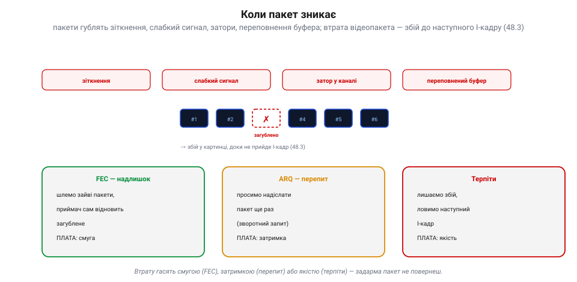
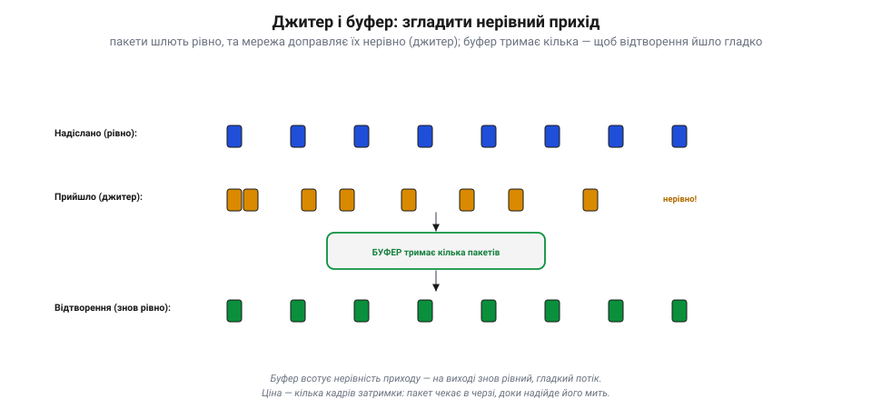

# Пропускна здатність, втрати, буферизація

Коли відео доправляють [цифровою мережею](book:communications/video-transmission), вилазять **реалії**, на які натикаєшся щокроку: скільки біт за секунду канал насправді витягне (**пропускна здатність**), що буде, коли пакети **зникають** (втрати), і як черга-**буфер** згладжує нерівний прихід. Саме ця трійця вирішує, чи потік іде гладко, чи смикається й розсипається.

### Пропускна здатність: бітрейт мусить улізти під стелю

**Пропускна здатність** (англ. *bandwidth*, *throughput*) — це скільки біт за секунду канал реально доправляє. І вона **не стала**: що далі апарат, що більше завад і перешкод, то слабший сигнал — а отже, нижча «стеля». Так працює [межа Шеннона](book:communications/bandwidth-capacity): менше відношення сигнал/шум — менша ємність каналу. Твій **[відеобітрейт](book:algorithms/quality-bitrate)** мусить іти **під** цією стелею, та ще й із запасом.

*Рис. Бітрейт під стелею смуги. «Стеля» (доступна смуга) падає з відстанню й завадами. Поки **сталий бітрейт** іде під нею — усе гаразд; та щойно стеля опускається нижче — бітрейт її **переростає**, і починаються затори й **втрати** (червона зона). Рятунок — **адаптивний бітрейт**: кодек сам знижує потік, повзучи під стелею, тож якість плавно падає, а зв'язок тримається (без обриву). Аналог так не вміє — у нього бітрейт фіксований формою хвилі.*

Якщо бітрейт **перевищить** доступну смугу — канал захлинається: пакети стають у чергу, спізнюються, **губляться**. Ось чому розумні цифрові системи крутять **адаптивний бітрейт**: коли смуга вужчає, кодувальник сам **знижує** потік ([грубіше квантування](book:algorithms/jpeg-intra)) — картинка м'якшає, але зв'язок живий. Це і є та «плавність» проти «обриву»: адаптивність перетворює різкий обрив на поступове згасання якості.

### Втрати: коли пакет зникає

Хоч як добре влізли під стелю, **пакети все одно гублять** — і дорогою, і в самому приймачі. Причини: зіткнення в ефірі, слабкий сигнал, затор у каналі, переповнення буфера. А наслідок для відео простий: загублений пакет — це **збій у картинці**, що тягнеться аж до наступного [I-кадру](book:algorithms/inter-frame).

*Рис. Коли пакет зникає. Пакет губиться від зіткнень, слабкого сигналу, заторів чи переповнення буфера — і в картинці буде збій, доки не прийде I-кадр. Три відповіді, і кожна за свою плату: **FEC** (шлемо надлишкові пакети, приймач сам відновлює загублене — плата: смуга), **ARQ** (просимо надіслати пакет ще раз — плата: затримка), **терпіти** (лишаємо збій, чекаємо наступний I-кадр — плата: якість).*

Проти втрат є рівно три ходи, і кожен бере свою ціну. **FEC** (*forward error correction*): шлемо трохи **надлишкових** пакетів, з яких приймач **сам відновить** загублене, нічого не перепитуючи — плата йде **смугою**. **ARQ** (перепит, *retransmit*): приймач **просить** надіслати втрачений пакет ще раз — надійно, та зворотний запит коштує **затримки**, тому для живого відео майже непридатний (спізнілий кадр уже нікому не потрібен). **Терпіти**: просто лишити збій і дочекатися наступного I-кадру — плата **якістю**. Тобто загублений пакет завжди обходиться **смугою, затримкою або якістю** — задарма його не повернеш.

### Джитер і буфер: згладити нерівний прихід

Навіть коли пакети доходять усі, вони приходять **нерівно**: мережа щоразу затримує їх трохи по-різному. Цю нерівність приходу звуть **джитером** (*jitter*). Якби кадри віддавали на екран рівно в міру приходу — відео б **смикалося**. Рятує **буфер**: невелика черга, що тримає кілька пакетів напоготові, аби на екран завжди йшов рівний потік.

*Рис. Джитер і буфер. Пакети **шлють рівно**, але мережа доправляє їх **нерівно** (джитер — десь густо, десь із розривом). **Буфер** тримає кілька пакетів у черзі, тож на виході знов виходить **рівний, гладкий** потік на екран. Ціна — кілька кадрів затримки: кожен пакет чекає в черзі своєї миті.*

Буфер **всотує** нерівність: швидкі пакети чекають у черзі, повільні встигають надійти — і відтворення йде гладко. Та за це платять **затримкою**: усе, що лежить у буфері, чекає своєї миті. Саме тут і криється головний компроміс буферизації.

### Глибина буфера: гладко чи миттєво

Скільки пакетів тримати в буфері — це і є ручка між **гладкістю** і **затримкою**.

*Рис. Глибина буфера — компроміс. **Малий** буфер — мала затримка, та на джитері смикається й губить (бракне запасу). **Великий** — гладко й стійко всотує і джитер, і дрібні втрати, та додає лаг. Тож гонка/FPV беруть крихітний буфер (миттєвість понад усе), перегляд і стрім — середній (гладко, лаг терпимо), а хмара й запис — великий (лаг байдужий). Це той самий компроміс «якість↔бітрейт↔затримка» — буфер просто інший бік ручки «затримка».*

**Малий** буфер дає малу затримку, та на джитері легко **смикається** й губить (не встигає підстрахувати спізнілий пакет). **Великий** буфер гладко всотує і джитер, і дрібні втрати — але кожен зайвий пакет у черзі додає **лагу**. Тому гонка й ручне FPV ріжуть буфер мало не до нуля (миттєвість понад усе, хай і смикне), перегляд і стрім тримають середній (гладко, а десяток мілісекунд лагу не шкода), а запис у хмару чи на картку не шкодує буфера зовсім (лаг там байдужий). Це, по суті, **той самий компроміс** [«якість↔бітрейт↔затримка»](book:algorithms/quality-bitrate): буфер — просто інший бік ручки «затримка».

> 📜 **Як ідея пережити ядерну війну зробила відео стійким до втрат.** Чому загублений пакет лише дряпає картинку, а не рве зв'язок? Бо відео йде **незалежними пакетами** — а цю ідею народила холодна війна. На початку 1960-х інженер **Пол Беран** із корпорації RAND шукав, як збудувати мережу зв'язку, що **переживе ядерний удар**: якщо ворог вирве кілька вузлів, решта має працювати. Його розв'язок (доповідь «On Distributed Communications», серпень 1964) був радикальний: не тягнути один тендітний провід від А до Б, а **порізати** повідомлення на дрібні порції даних (*message blocks*), пустити кожен **самостійно** через комірчасту мережу найшвидшим вільним шляхом — і зібрати докупи на тому кінці. Незалежно від нього те саме 1965 року придумав британець **Дональд Девіс** із NPL — і саме він назвав ці порції **пакетами** (*packets*). Військові спершу махнули рукою (а телефонна монополія AT&T казала, що це не запрацює), та згодом ідея лягла в основу **ARPANET**, а далі — усього інтернету. І твого відеолінка теж: коли цифровий потік летить **незалежними пакетами**, втрата кількох — лише збій, а не розрив: решта приходять самі й збираються в кадр. (Щоправда, «знайти **інший шлях**» уміють маршрутизовані й комірчасті мережі; у звичайному двоточковому дрон-лінку шлях один, тож загублений пакет просто втрачено — рятують незалежність пакетів і FEC, а не перемаршрутизація.) Стійкість, задумана проти бомби, щодня рятує твою картинку від звичайних завад.

> 🔧 **Навіщо це.** Постав відеобітрейт **нижче найгіршої** очікуваної смуги, із запасом — і ввімкни **адаптивний** режим, якщо є: хай кодек сам сповзає за стелею, а не б'ється об обрив. Не «наливай» канал по вінця — повний канал = затори = втрати. Для наживо лікуй втрати **FEC**, не перепитом (ARQ додасть лаг). Крути **буфер** під місію: гонка — мінімум (хай смикне, аби миттєво), запис — більший (гладко). І стеж за **статистикою лінка** (смуга, втрати, джитер): саме вони, а не «магія», вирішують, чи долетить картинка.

### Підсумок

Передача має три реалії. **Пропускна здатність** — стеля, що падає з відстанню; бітрейт мусить іти під нею з запасом, а адаптивний кодек сам сповзає за стелею. **Втрати** неминучі (зіткнення, завади, затори), і гасять їх лише трьома способами — FEC (смугою), ARQ (затримкою) чи терпінням (якістю). **Буферизація** згладжує джитер, та глибина буфера — це ручка «гладкість ↔ затримка». А під усім лежить ідея **пакетів** Берана й Девіса, що й робить цифрове відео стійким до втрат: канал віддає рівно те, що в нього влізе, решту впорядковують код проти втрат і буфер проти джитера.
