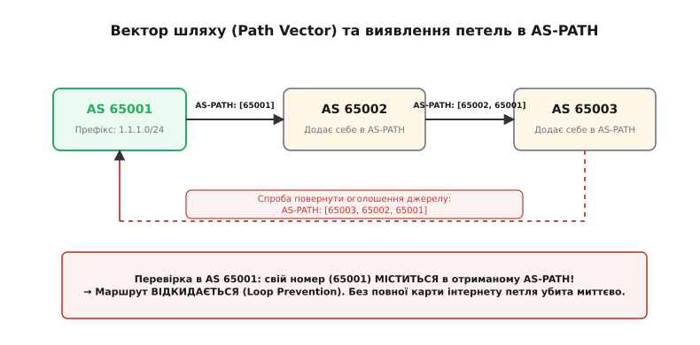
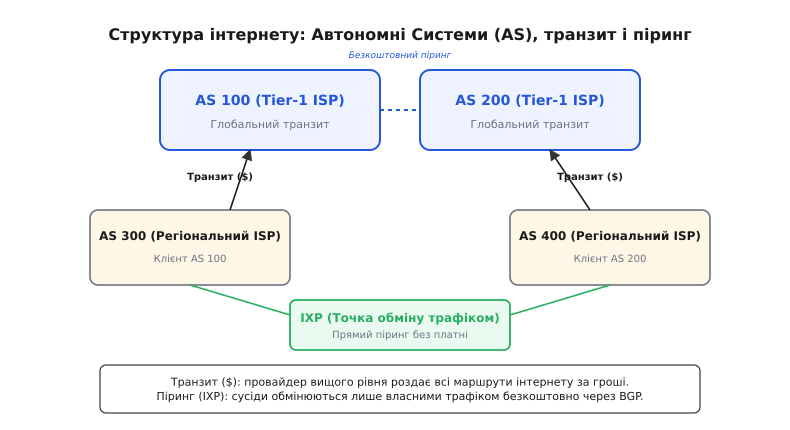
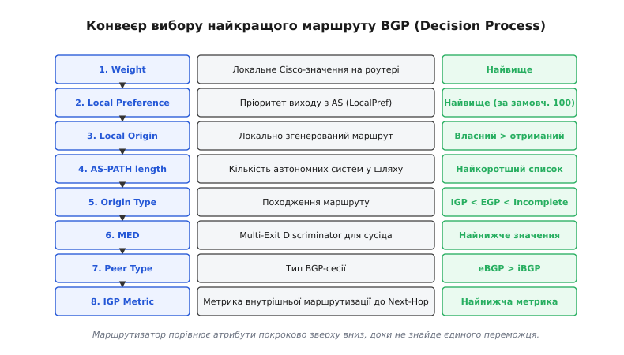
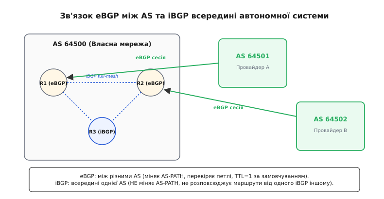

# BGP: протокол зв'язку між автономними системами

<preknowlist>
- [Маршрутизація IP](topic:communications/ip-routing) — таблиці маршрутів, next-hop, підмережі, маски, default route.
- [MAC, IP і ARP](topic:communications/mac-ip-arp) — ієрархія адрес і поділ локального та глобального зв'язку.
- [Затримка й надійність](topic:communications/latency-reliability) — транспортні властивості мережі, втрати та затримки.
</preknowlist>

Коли корпоративна мережа на кілька десятків маршрутизаторів обмінюється даними, вона запускає протоколи внутрішньої маршрутизації (IGP, англ. *Interior Gateway Protocol*) — такі як OSPF чи IS-IS. Усі маршрутизатори в такій мережі належать одній організації, повністю довіряють один одному й регулярно розсилають карти зв'язків. Кожен вузол знає точну топологію всієї компанії, обраховує найкоротші шляхи алгоритмом Дейкстри й за частки секунди реагує на обрив будь-якого кабелю. Таке рішення бездоганно працює на масштабі тисячі пристроїв, але миттєво розвалюється, коли мова заходить про глобальний інтернет із його мільйоном мережевих префіксів і сотнями тисяч незалежних маршрутизаторів.

Причина розвалу — три непримиренні бар'єри: обмеження пам'яті та обчислювальної потужності, повна відсутність довіри між бізнес-конкурентами та економіка пересилання даних. 

По-перше, алгоритми стану каналів (Link-State) вимагають обчислювальної складності порядка `O(E log V)` для побудови графа коротших шляхів. Якби глобальний інтернет із його 100 000 маршрутизаторів та мільйоном міжмережевих зв'язків перераховував точну карту щоразу, коли в австралійського провайдера обірвався оптичний кабель, обчислювальні процесори роутерів по всьому світу згоріли б від постійних пиків навантаження. 

По-друге, жоден комерційний провайдер (наприклад, AT&T, Deutsche Telekom чи Cloudflare) ніколи не віддасть конкурентові точну карту своєї внутрішньої мережі, волоконних трас та розташування дата-центрів, оскільки це стратегічна комерційна таємниця. 

По-третє, у глобальному світі «найкоротший шлях» за кількістю маршрутизаторів чи кілометрів волокна часто виявляється найгіршим, бо пересилання ним коштує грошей, а довший шлях через точку обміну трафіком — безкоштовний. Внутрішні протоколи IGP знають лише технічні метрики (затримку, пропускну здатність), але принципово не розуміють бізнес-договорів, тарифів і фінансових угод.

Розв'язанням цієї фундаментальної проблеми став **BGP** (англ. *Border Gateway Protocol*, «протокол межового шлюзу»). Це єдиний протокол міждоменної маршрутизації, який тримає разом увесь глобальний інтернет, перетворюючи мільйони окремих приватних та публічних мереж на єдину зв'язну систему.

---

### 1. Автономні системи (AS) і два рівні маршрутизації

Глобальний інтернет — це не одна гігантська мережа, а «мережевий конгломерат», що складається з понад 75 000 незалежних мереж. Кожна така мережа належить окремій організації (провайдеру зв'язку, дата-центру, банку, університету чи техгіганту на кшталт Google або Cloudflare) і зветься **Автономною Системою** (англ. *Autonomous System*, **AS**).

Автономна система має три визначальні ознаки:
1. Вона перебуває під єдиним адміністративним та технічним управлінням.
2. Вона має власну внутрішню політику маршрутизації.
3. Вона виступає перед рештою світу як єдиний цілісний блок IP-адрес (префіксів).

Щоб автономні системи могли ідентифікувати одна одну в глобальних таблицях, кожна з них отримує унікальний **номер автономної системи** (англ. *Autonomous System Number*, **ASN**). Номери роздає глобальний реєстратор IANA через п'ять регіональних інтернет-реєстраторів (RIR): RIPE NCC (Європа та Близький Схід), ARIN (Північна Америка), APNIC (Азійсько-Тихоокеанський регіон), LACNIC (Латинська Америка) та AFRINIC (Африка).

Виділяють два формати AS-номерів:
- **16-бітні номери (історичні):** від `1` до `65535`. Приклади відомих глобальних ASN: `AS15169` (Google), `AS13335` (Cloudflare), `AS3356` (Lumen/Level3), `AS1299` (Arelion/Telia). Діапазон `64512–65534` виділено під приватні AS (аналог приватних IP-адрес RFC 1918), які не виходять у глобальний інтернет.
- **32-бітні номери (сучасні, RFC 6793):** від `65536` до `4 294 967 295`. Їх ввели у 2007 році, коли 16-бітна адресація вичерпалася.

```
+-----------------------------------------------------------------------+
|                         ГЛОБАЛЬНИЙ ІНТЕРНЕТ                           |
|                                                                       |
|   +-------------------+    eBGP сесія    +-------------------+        |
|   |    AS 15169       |<---------------->|    AS 13335       |        |
|   |    (Google)       |                  |   (Cloudflare)    |        |
|   |                   |                  |                   |        |
|   |  IGP (OSPF/IS-IS) |                  |  IGP (OSPF/IS-IS) |        |
|   |  всередині AS     |                  |  всередині AS     |        |
|   +-------------------+                  +-------------------+        |
+-----------------------------------------------------------------------+
```

Звідси чітко видно поділ усієї мережевої маршрутизації на два незалежних рівні:

- **Внутрішня маршрутизація (IGP):** працює *всередині* однієї AS (OSPF, IS-IS). Вона шукає фізично найшвидший та найдешевший шлях між роутерами всередині компанії, використовуючи метрики затримки й смуги пропускання.
- **Зовнішня маршрутизація (EGP / BGP):** працює *між* різними AS. Вона не знає і не хоче знати топологію всередині чужих систем, а оперує виключно бізнес-політиками та списком автономних систем на шляху.

---

### 2. Вектор шляху (Path Vector): зупинити петлі без повної карти

Традиційні протоколи маршрутизації використовують один із двох підходів:

1. **Стан каналів (Link-State, OSPF):** розсилає всім точну карту всіх лінків. Для глобального інтернету це неприйнятно через гігантський обсяг даних і розкриття комерційної таємниці.
2. **Дистанційно-векторні (Distance-Vector, RIP):** передають лише пару `(ціль, відстань)`. У складних мережах це призводить до петель маршрутизації та проблеми «рахунку до нескінченності» (англ. *count-to-infinity*), коли пакети ходять по колу, безкінечно збільшуючи лічильник.

BGP застосовує третій, особливий підхід — **вектор шляху** (англ. *Path Vector*). Замість передачі кількості хопів чи карти зв'язків, BGP під час оголошення IP-префікса передає **повний список усіх автономних систем**, через які цей маршрут уже пройшов. Цей список записується у ключовий атрибут — `AS_PATH`.

Подивись, як це працює в динаміці під час проходження префікса через мережу:

```
[AS 65001] оголошує префікс 1.1.1.0/24 
   │  AS-PATH: [65001]
   ▼
[AS 65002] отримує пакет, додає свій ASN на початок списку
   │  AS-PATH: [65002, 65001]
   ▼
[AS 65003] отримує пакет, додає свій ASN
   │  AS-PATH: [65003, 65002, 65001]
   ▼
[AS 65001] отримує оновлення назад по кільцевому каналу...
```

Коли маршрутизатор в `AS 65001` отримує оголошення про префікс `1.1.1.0/24`, він перевіряє атрибут `AS_PATH`. У списку `[65003, 65002, 65001]` він бачить **свій власний номер AS 65001**. Це беззаперечно означає: маршрут пройшов по колу й утворив петлю! Маршрутизатор миттєво відкидає це оголошення.


*Кожен вузол дописує свій ASN до атрибута AS-PATH. Якщо при отриманні маршруту вузол бачить у списку власний номер — маршрут відкидається. Це знищує петлі накорню без побудови карти світу.*

Окрім виявлення петель, атрибут `AS_PATH` активно використовується для керування вхідним трафіком за допомогою прийому **AS-Prepending**. Якщо інженер хоче, щоб певний провайдер вважався резервним, він змушує BGP дописувати власний ASN кілька разів підряд (наприклад `AS-PATH: [65001, 65001, 65001]`). Решта світу бачить штучно видовжений шлях і вибирає альтернативний канал.

Механізм вектора шляху геніально простий: він не вимагає від роутера пам'ятати топологію всієї планети й не вимагає складних обчислень. Перевірка наявності власного ASN у списку здійснюється за один прохід масиву, забезпечуючи 100% захист від міждоменних петель. 

Детальніше про те, як ця ідея народилася на трьох паперових серветках під час обіду інженерів у 1989 році, розповідає [історія створення BGP](topic:communications/bgp-basics/hist-bgp-origins.md).

---

### 3. Економіка інтернету: транзит, піринг та точки обміну трафіком (IXP)

На відміну від внутрішніх протоколів, де найкоротша метрика завжди перемагає, BGP — це протокол **економічних угод та політик**. Маршрутизація в інтернеті підпорядковується грошам, а не кілометрам волокна чи кількості роутерів.

Усі автономні системи в інтернеті діляться на три ієрархічні рівні (Tiers):
1. **Tier-1 провайдери (Backbone):** близько 15 гігантських міжнародних операторів (Lumen, Telia/Arelion, NTT, Cogent, GTT), які володіють міжконтинентальними волоконно-оптичними кабелями. Вони не купують транзит ні в кого й з'єднані між собою безкоштовним пірингом.
2. **Tier-2 провайдери (Регіональні):** великі національні оператори, які купують транзит у Tier-1, але також мають прямий піринг між собою.
3. **Tier-3 / Доступ (Access):** локальні провайдери та корпоративні мережі, які лише купують транзит у вищих провайдерів.

Узагальнюючи, усі взаємини між автономними системами поділяються на два основних типи:

#### 1. Транзит (Transit)
Це відносини «клієнт — провайдер». Менша автономна система платить гроші вищому провайдеру за доступ до **всього інтернету**. Провайдер оголошує клієнту всі глобальні маршрути інтернету (Full Feed, близько 950 000 префіксів IPv4) і розповсюджує префікси клієнта решті світу. Клієнт платить за кожен гігабіт переданого трафіку.

#### 2. Піринг (Peering)
Це партнерські відносини між двома автономними системами, які домовляються обмінюватися трафіком **безкоштовно** (англ. *settlement-free peering*). Дві AS обмінюються **лише власними маршрутами** (і маршрутами своїх прямих клієнтів). Жодна з AS не передає піринговому партнеру маршрути, отримані від своїх платних транзитних провайдерів.


*Транзитний провайдер роздає повну таблицю інтернету за гроші ($). Пірингові партнери на точках IXP безкоштовно обмінюються трафіком лише своїх локальних клієнтів.*

Щоб не прокладати тисячі окремих кабелів між кожною парою провайдерів, індустрія створила **точки обміну трафіком** (англ. *Internet Exchange Point*, **IXP**, такі як UA-IX у Києві, AMS-IX в Амстердамі або DE-CIX у Франкфурті). IXP — це гігантський дата-центр зі швидкісними комутаторами Layer 2. Провайдери підключають свої BGP-маршрутизатори до цього комутатора й можуть в один клік укладати пірингові угоди з сотнями інших мереж через спеціальні **Route Servers**.

Звідси випливає головний принцип політики BGP: **безкоштовний піринговий маршрут завжди кращий за платний транзитний**, навіть якщо піринговий шлях містить більше автономних систем!

---

### 4. Сесії BGP: транспорт на TCP і чотири типи повідомлень

Більшість мережевих протоколів нижчих рівнів самостійно дбають про повторну відправку втрачених пакетів, підтвердження та порядкові номери. BGP вчинив інакше: він повністю покладається на надійний транспортний протокол **TCP (порт 179)**.

Завдяки використанню TCP протоколу BGP не потрібно розробляти власні механізми фрагментації, контролю насичення чи підтвердження прийому. Поки TCP-з'єднання живе — сесія BGP вважається активною.

Сесія BGP проходить такі стадії:
1. **Встановлення TCP-з'єднання:** один із роутерів ініціює SYN-запит на IP-адресу сусіда (BGP peer) на порт 179.
2. **Обмін привітаннями (`OPEN`):** після завершення рукостискання TCP сторони обмінюються параметрами BGP (версія, ASN, Hold Time, Capabilities).
3. **Узгодження таймерів:** якщо місцевий роутер вимагає Hold Time 90 с, а сусід 180 с, обидві сторони вибирають мінімальне значення `min(90, 180) = 90 с`. Таймер відправки `KEEPALIVE` автоматично розраховується як 1/3 від Hold Time (тобто 30 секунд).
4. **Обмін маршрутами (`UPDATE`):** роутери передають один одному свої таблиці досяжних префіксів.
5. **Підтримка зв'язку (`KEEPALIVE`):** періодична розсилка пустих пакетів для підтвердження того, що сусід живий.

Усього в BGP існує **чотири типи повідомлень**:

```
+-----------------+---------------------------------------------------------+
| Тип повідомлення | Призначення                                             |
+-----------------+---------------------------------------------------------+
| 1. OPEN         | Відкриття сесії, узгодження ASN, Hold Time, Capabilities|
| 2. UPDATE       | Оголошення нових маршрутів або відкликання недосяжних  |
| 3. NOTIFICATION | Повідомлення про помилку та негайне закриття сесії     |
| 4. KEEPALIVE    | Підтвердження працездатності (Heartbeat кожні 30 с)     |
+-----------------+---------------------------------------------------------+
```

Для зміни політик фільтрації без розриву TCP-сесії використовується розширення **Route Refresh (RFC 2918)**. Замість перезавантаження сокета роутер надсилає запит спецповідомленням, і сусід повторно транслює свою BGP-таблицю.

Якщо на мережевому рівні стається збій або роутер отримує некоректний атрибут, він надсилає пакет `NOTIFICATION` із кодом помилки й негайно закриває TCP-сокет. Сусідній роутер у той же момент видаляє всі маршрути, отримані через цю сесію.

Повний бінарний формат усіх заголовків, значення прапорців та структуру пін-кодів помилок розкрито у вставці [структура BGP-повідомлень та атрибутів](topic:communications/bgp-basics/api-bgp-messages.md).

---

### 5. Атрибути та алгоритм вибору найкращого маршруту (BGP Decision Process)

Маршрутизатор BGP отримує інформацію про той самий префікс (наприклад, `8.8.8.8/32`) від десятків різних сусідніх автономних систем. Усі ці варіанти складаються у внутрішню базу BGP — **BGP Table (Loc-RIB)**. 

Проте системна таблиця маршрутизації операційної системи (**FIB**, англ. *Forwarding Information Base*), яка здійснює реальне пересилання пакетів, може прийняти **лише один-єдиний найкращий маршрут** (англ. *Best Path*) для кожного префікса.

Щоб вибрати цей єдиний маршрут, BGP запускає суворий детермінований конвеєр порівняння атрибутів. Маршрутизатор бере два альтернативні маршрути й порівнює їхні характеристики за наступними кроками строго зверху вниз, доки не знайде першу розбіжність:

```
[ Усі отримані маршрути для префікса у BGP Table ]
                         │
                         ▼
┌───────────────────────────────────────────────────┐
│ 1. Найвищий Weight (локально на роутері, Cisco)  │
└────────────────────────┬──────────────────────────┘
                         ▼
┌───────────────────────────────────────────────────┐
│ 2. Найвищий Local Preference (на рівні всієї AS) │
└────────────────────────┬──────────────────────────┘
                         ▼
┌───────────────────────────────────────────────────┐
│ 3. Локально згенерований (network / redistribute) │
└────────────────────────┬──────────────────────────┘
                         ▼
┌───────────────────────────────────────────────────┐
│ 4. Найкоротший AS-PATH (найменше AS у списку)     │
└────────────────────────┬──────────────────────────┘
                         ▼
┌───────────────────────────────────────────────────┐
│ 5. Найнижчий Origin Code (IGP < EGP < Incomplete) │
└────────────────────────┬──────────────────────────┘
                         ▼
┌───────────────────────────────────────────────────┐
│ 6. Найнижчий MED (Multi-Exit Discriminator)       │
└────────────────────────┬──────────────────────────┘
                         ▼
┌───────────────────────────────────────────────────┐
│ 7. Перевага eBGP над iBGP (зовнішній > внутрішній)│
└────────────────────────┬──────────────────────────┘
                         ▼
┌───────────────────────────────────────────────────┐
│ 8. Найменша IGP-метрика до адреси Next-Hop        │
└────────────────────────┬──────────────────────────┘
                         ▼
             [ Єдиний BEST PATH → у FIB ]
```


*Конвеєр вибору BGP порівнює атрибути строго покроково. Перше ж правило, де є різниця, визначає переможця, який потрапляє в системну таблицю маршрутизації.*

Розберімо ключові атрибути цього конвеєра:

- **Weight (Вага):** пропрієтарний атрибут Cisco. Діє лише в межах одного роутера (не передається нікому). Маршрут із вищою вагою перемагає все.
- **Local Preference (`LOCAL_PREF`):** має найвищий пріоритет серед стандартних атрибутів. Поширюється між всіма роутерами *всередині* однієї автономної системи. За замовчуванням дорівнює `100`. Адміністратор встановлює `LOCAL_PREF = 200` для безкоштовного пірингового каналу і `LOCAL_PREF = 100` для платній транзиту. У результаті весь вихідний трафік компанії автоматично піде через піринг, ігноруючи довжину шляху у хопах!
- **`AS_PATH` Length:** якщо `LOCAL_PREF` однаковий, роутер рахує кількість автономних систем у списку `AS_PATH`. Виграє той шлях, де автономних систем менше.
- **Origin Code (Джерело):** вказує, як саме маршрут потрапив у BGP. `IGP` (`i`, додано через команду `network`) краще за `EGP` (`e`), яке краще за `INCOMPLETE` (`?`, редистрибуція з інших протоколів).
- **`NEXT_HOP`:** IP-адреса наступного маршрутизатора, на який треба відправити пакет. Якщо `NEXT_HOP` недосяжний згідно з внутрішньою таблицею маршрутизації IGP, увесь BGP-маршрут вважається невалидним і відкидається ще до початку вибору.
- **MED (Multi-Exit Discriminator):** використовується, коли дві автономні системи з'єднані між собою у кількох різних географічних точках (наприклад, у Києві та у Франкфурті). Сусідня AS надсилає значення MED, підказуючи, через який саме стик вона воліє приймати трафік (найнижче значення виграє).

---

### 6. iBGP проти eBGP: проходження через власну систему

Поняття BGP ділиться на два режими роботи залежно від того, де знаходяться партнери по сесії:

1. **eBGP (External BGP):** сесія між маршрутизаторами, що належать **різним** автономним системам.
2. **iBGP (Internal BGP):** сесія між маршрутизаторами **всередині однієї** автономної системи.

```
       [ AS 65001 ]                     [ AS 65002 ]
  ┌──────────────────┐             ┌──────────────────┐
  │  R1 ──iBGP─── R2 │<───eBGP────>│ R3               │
  └──────────────────┘             └──────────────────┘
```

Між цими режимами є дві фундаментальні відмінності у поведінці:

#### 1. Модифікація AS-PATH та Next-Hop
- У сесії **eBGP** при пересиланні оголошення роутер додає свій ASN до атрибута `AS_PATH` та перезаписує `NEXT_HOP` власною IP-адресою.
- У сесії **iBGP** роутер **НЕ додає** свій ASN до `AS_PATH` і **НЕ змінює** `NEXT_HOP` (через що на внутрішніх роутерах часто доводиться явно вказувати команду `next-hop-self`).

#### 2. Правило Split-Horizon для iBGP
Оскільки всередині iBGP атрибут `AS_PATH` не змінюється, звичайний механізм виявлення петель (пошук власного ASN у списку) всередині автономної системи **не працює**!

Щоб запобігти виникненню внутрішніх петель, в BGP введено залізне правило **iBGP Split-Horizon**:
> *Маршрутизатор BGP, який отримав маршрут через iBGP-сесію, НІКОЛИ не передає його іншому iBGP-сусідові.*


*eBGP з'єднує різні AS і змінює AS-PATH. iBGP працює всередині AS і вимагає повного зв'язку (full-mesh) або Route Reflectors через правило Split-Horizon.*

Наслідок цього правила колосальний: щоб усі внутрішні маршрутизатори дізналися про зовнішні мережі, вони мусять бути з'єднані між собою за схемою **Full Mesh** (кожен з кожним). Для `N` роутерів це вимагає `N·(N - 1) / 2` iBGP-сесій. При 100 роутерах це майже 5000 сесій, що неможливо масштабувати.

Для вирішення цієї проблеми у великих мережах застосовують **Route Reflectors (RR, RFC 4456)** — спеціальні роутери-відбивачі, яким дозволено порушувати правило split-horizon і пересилати iBGP-маршрути іншим клієнтам. Захист від петель в RR забезпечується двома додатковими атрибутами: `ORIGINATOR_ID` (Router ID творця маршруту) та `CLUSTER_LIST` (список ідентифікаторів кластерів відбивачів).

Практичний конфіг даймона FRR, приклад налаштування eBGP-сесії та робочий код парсера заголовків на C і C++ наведено у вставці [приклад налаштування та моніторингу BGP](topic:communications/bgp-basics/proj-bgp-peering.md).

---

### 7. Вразливості та безперервний розвиток: BGP Hijacking, RPKI та BGPsec

BGP створювався наприкінці 80-х років, коли інтернет був закритим клубом наукових інститутів і довіра між учасниками була абсолютною. У початковій специфікації BGP **відсутня будь-яка встроенна автентифікація** правомірності володіння IP-префіксами.

Це створило найнебезпечнішу вразливість сучасного інтернету — **BGP Route Hijacking (перехоплення маршрутів)**.

Суть вразливості описується двома сценаріями:

1. **Оголошення чужого префікса:** Автономна система `AS X` надсилає в BGP оголошення: «Я володію префіксом `1.1.1.0/24`» (який насправді належить Cloudflare). Якщо сусіди `AS X` повірять цьому оголошенню, трафік мільйонів користувачів з усього світу потече до зловмисника чи в «чорну діру».
2. **Атака більш конкретним префіксом (More Specific Prefix):** Нагадаємо правило маршрутизації IP: **виграє найдовша маска (Longest Prefix Match)**. Якщо справжній власник оголошує мережу `/22` (1024 адреси), а зловмисник оголосить зсередини неї дві мережі `/24` (по 256 адрес), увесь світ вибере маршрути зловмисника, незалежно від довжини `AS_PATH` чи будь-яких інших атрибутів!

Гучний інцидент стався у 2008 році, коли провайдер Pakistan Telecom спробував заблокувати доступ до YouTube усередині країни. Вони оголосили у BGP більш конкретний префікс YouTube `/24`. Через помилку у фільтрах цей маршрут витік до глобального транзитного провайдера PCCW, і протягом кількох годин увесь світовий трафік YouTube спрямовувався до Пакистану, обваливши мережу.

Для захисту глобального інтернету розроблено архітектуру **RPKI** (англ. *Resource Public Key Infrastructure*, RFC 6480):

- Власники префіксів підписують криптографічний сертифікат **ROA** (англ. *Route Origin Authorization*), у якому чітко вказується: «Префікс `1.1.1.0/24` має право оголошувати ТІЛЬКИ `AS 13335`».
- Маршрутизатори по всьому світу завантажують базу ROA й під час отримання оновлень BGP класифікують кожен маршрут як `Valid`, `Invalid` або `NotFound`.
- Маршрути зі статусом `Invalid` автоматично відкидаються.

Сьогодні RPKI розгорнуто на більшості магістральних роутерів світу, що поступово робить класичний BGP Hijacking неможливим.

---

> 🔧 **Навіщо це.** Знання BGP критично необхідне не лише мережевим інженерам провайдерів, а й архітекторам хмарних систем та DevOps-інженерам. По-перше, географічно розподілені сервіси (DNS 8.8.8.8 чи 1.1.1.1, CDN Cloudflare/Akamai) побудовані на технології **Anycast BGP**: одна й та сама IP-адреса оголошується з сотень дата-центрів по всьому світу через BGP, і кожний користувач автоматично потрапляє до найближчого сервера завдяки вибору найкоротшого `AS_PATH`. По-друге, сучасні Kubernetes-кластери у хмарах (за допомогою CNI-плагінів Calico чи Cilium) запускають BGP-спікери на кожній ноді кластера, оголошуючи IP-адреси окремих подів прямо на мережеві комутатори стійки.

---

BGP — це не просто протокол передачі адрес; це економічний та технічний механізм, який утримує світову цифрову цивілізацію. Розуміння його принципів — вектора шляху, атрибутів, економіки пірингу та правил вибору маршрутів — дає можливість бачити інтернет не як магічну хмару, а як чітку, детерміновану та керовану систему.
