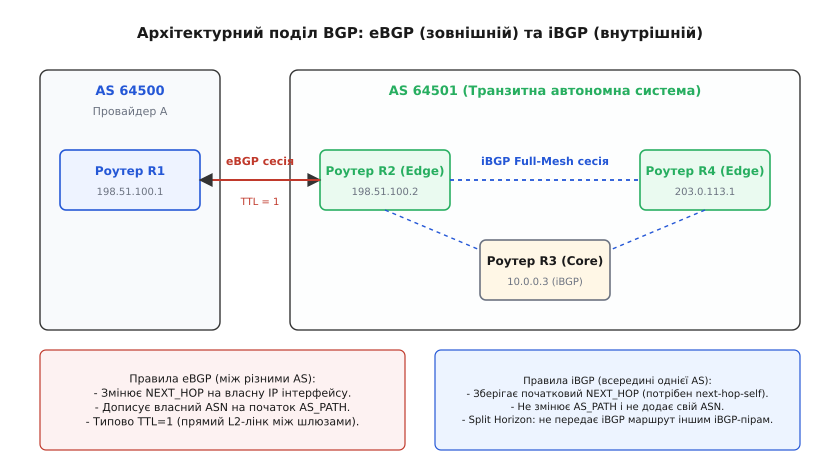
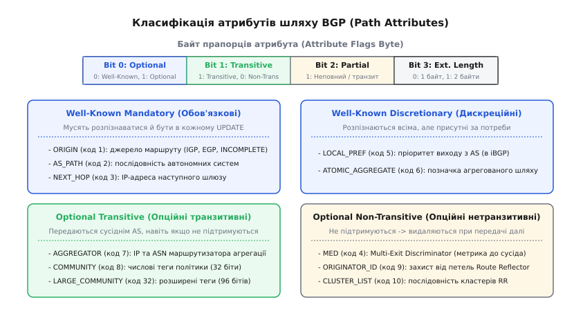
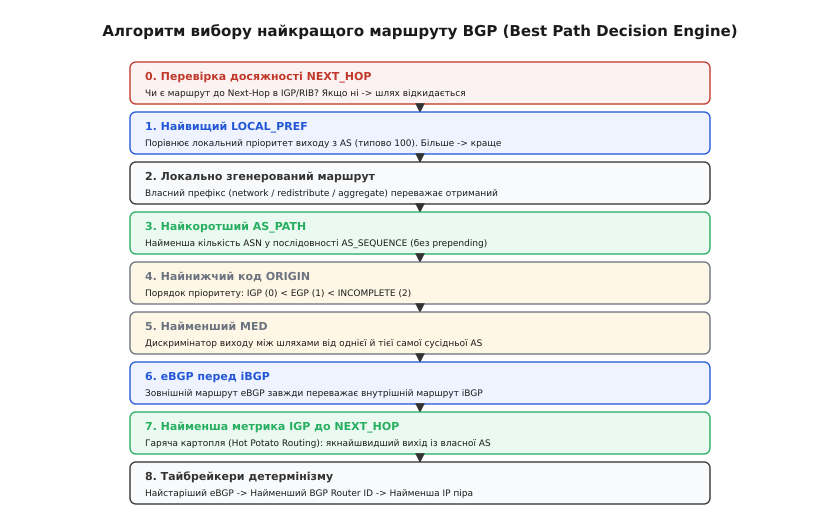

# BGP: протокол між провайдерами

<preknowlist>
- [Маршрутизація](topic:communications/ip-routing) — таблиці маршрутів, префікси, метрики та вибір наступного шлюзу (next-hop).
- [CIDR і префікси](topic:communications/cidr) — безкласова адресація, маски змінної довжини та агрегація префіксів.
- [OSPF: протокол стану каналів](topic:communications/ospf) — внутрішньодоменна маршрутизація (IGP), база стану лінків та межі масштабування.
- [Затримка й надійність](topic:communications/latency-reliability) — характеристики каналів зв'язку, черги та доставка пакетів.
</preknowlist>

Коли корпоративна чи провайдерська мережа розростається до кількох сотень маршрутизаторів, протоколи стану каналів (OSPF або IS-IS) утримують повну топологічну базу даних (*Link-State Database*) і за мілісекунди перераховують найкоротші шляхи алгоритмом Дейкстри. Але щойно мережа стикається із завданням об'єднати десятки тисяч незалежних комерційних операторів, дата-центрів і магістральних провайдерів у єдиний глобальний інтернет із понад 950 000 префіксів IPv4, алгоритми стану каналів зазнають повної алгоритмічної та економічної катастрофи. Жоден транзитний оператор не погодиться відкрити внутрішню топологію своїх волоконно-оптичних ліній конкурентам, обчислювальна складність `O(E \log V)` на графі з мільйона ребер перевантажить процесори будь-яких прикордонних шлюзів при кожному коливанні лінка в іншій частині світу, а математично «найкоротший» шлях через мережу третьої країни може коштувати оператору вдесятеро дорожче за довший комерційний піринг.

Протокол прикордонного шлюзу BGP (англ. *Border Gateway Protocol*, версія BGP-4 за стандартом RFC 4271) вирішує це протиріччя через поділ інтернету на суверенні автономні системи, заміну метрики вартості лінка вектором послідовності доменів (*Path Vector*) та підпорядкування вибору маршруту гнучким адміністративно-фінансовим політикам оператора.

---

## 1. Межі внутрішньодоменної маршрутизації та концепція автономних систем (AS)

Глобальна мережа інтернет побудована за дворівневою моделлю маршрутизації:
1. **Внутрішньодоменна маршрутизація (IGP — Interior Gateway Protocol):** протоколи OSPF, IS-IS або RIP працюють усередині однієї організації з єдиним адміністративним контролем, знаходять найшвидші зв'язки між внутрішніми інтерфейсами та формують зв'язність для службових адрес і loopback-інтерфейсів.
2. **Міждоменна маршрутизація (EGP — Exterior Gateway Protocol):** протокол BGP пов'язує тисячі незалежних доменів між собою, приховуючи їхню внутрішню структуру та обмінюючись агрегованими префіксами мереж.

Автономна система (англ. *Autonomous System*, AS) — це зв'язана сукупність IP-мереж та мережевих пристроїв, що перебуває під спільним адміністративним управлінням однієї організації (провайдера послуг зв'язку, телеком-оператора, банку, хмарної платформи чи університету) і реалізує єдину узгоджену політику зовнішньої маршрутизації.

### Номери автономних систем (ASN) та їхні формати

Кожній автономній системі, яка бере участь у глобальному обміні маршрутами або має кілька підключень до різних провайдерів (*multi-homing*), регіональні реєстратори (RIR: RIPE NCC, ARIN, APNIC тощо) виділяють глобально унікальний номер — **ASN** (*Autonomous System Number*).

Історично номери ASN кодувалися 16-бітними беззнаковими цілими числами (діапазон від `1` до `65535`):
- `1` — `64495`: глобальні публічні 16-бітні ASN для маршрутизації в глобальному інтернеті.
- `64496` — `64511`: зарезервовані RFC 5398 для документації та прикладів.
- `64512` — `64534`: приватні ASN (аналог приватних IP-адрес за RFC 1918), які використовуються всередині корпоративних мереж чи закритих дата-центрів і обов'язково видаляються при виході в глобальний інтернет.
- `65535`: спеціальний зарезервований номер.

Стрімке вичерпання пулу 16-бітних номерів у 2000-х роках спонукало IETF розробити стандарт RFC 6793, який розширив ASN до **32 бітів** (діапазон від `0` до `4 294 967 295`):
- `65536` — `4199999999`: сучасні глобальні публічні 32-бітні ASN.
- `4200000000` — `4294967294`: розширений діапазон приватних 32-бітних ASN.

```
       0               15 16             31
      +------------------+-----------------+
16-bit: | 0000000000000000 | 16-бітний ASN   |  (діапазон: 1 .. 65535)
      +------------------+-----------------+
32-bit: |          32-бітний номер ASN             |  (діапазон: 1 .. 4294967295)
      +------------------------------------+
```

Для плавної сумісності старого обладнання, що знає лише 16-бітні поля, із сучасними 32-бітними маршрутизаторами було введено зарезервований номер `23456` (`AS_TRANS`). Якщо 32-бітний маршрутизатор надсилає оновлення 16-бітному піру, він підставляє `23456` у заголовок повідомлення, а справжній довгий ASN інкапсулює у спеціальний опційний атрибут `AS4_PATH`. Наступний 32-бітний роутер на шляху вичитує `AS4_PATH` і повністю відновлює початкову послідовність.

---

## 2. Концепція вектора шляху (Path Vector) та анатомія сесії BGP

На відміну від протоколів дистанції-вектора (RIP), де маршрутизатор знає лише кількість хопів і наступний крок, або протоколів стану каналів (OSPF), де кожен роутер знає граф усієї зони, BGP реалізує парадигму **вектора шляху** (*Path Vector*).

Разом із кожним мережевим префіксом (наприклад, `198.51.100.0/24`) BGP передає повний список номерів автономних систем, через які це оголошення вже пройшло. Цей список записується в атрибут `AS_PATH`.

```
[AS 64500 (Оригінатор)]
      │  Оголошує 198.51.100.0/24 із AS_PATH: [64500]
      ▼
[AS 64501 (Транзит)]
      │  Дописує свій номер: AS_PATH: [64501, 64500]
      ▼
[AS 64502 (Транзит)]
      │  Дописує свій номер: AS_PATH: [64502, 64501, 64500]
      ▼
[AS 64500 (Оригінатор отримує назад!)]
      │
      └─► Бачить власний ASN 64500 у списку -> МИТТЄВИЙ СКИН (Loop Detection!)
```

### Механізм захисту від петель (Loop Prevention)

Вектор шляху забезпечує базовий і найнадійніший захист від міждоменних маршрутних петель:
Кожен BGP-маршрутизатор під час отримання повідомлення `UPDATE` перевіряє вміст атрибута `AS_PATH`. Якщо у списку зустрічається **власний номер автономної системи**, маршрутизатор негайно відкидає це оголошення. Це унеможливлює утворення нескінченних циклів між різними провайдерами без необхідності запуску ресурсомістких обчислень.

### Транспортний рівень TCP та надійність

На відміну від більшості протоколів маршрутизації, які працюють безпосередньо над мережевим рівнем IP (OSPF — протокол IP `89`) або використовують власні протоколи доставки (EIGRP), BGP покладається на надійний потоковий транспорт **TCP (порт призначення 179)**.

Використання TCP звільняє BGP від необхідності самостійно реалізовувати:
- Підтвердження доставки пакетів (*ACK*).
- Контроль перевантаження каналу (*Congestion Control*) та ковзні вікна (*Sliding Window*).
- Фрагментацію та збирання великих повідомлень (таблиці маршрутів можуть містити мегабайти даних).
- Повторне надсилання втрачених сегментів (*Retransmission*).

### Кінцевий автомат BGP (Finite State Machine, FSM)

Встановлення та підтримка сесії між двома BGP-маршрутизаторами (яких називають *BGP Peers* або *BGP Speakers*) описується кінцевим автоматом із 6 послідовних станів:

```
+--------+   Помилка TCP / таймаут   +---------+
|  IDLE  | ------------------------> | CONNECT |
+--------+                           +---------+
    │                                     │
    │ TCP успішне                         │ TCP не вдалося
    ▼                                     ▼
+----------+                         +--------+
| OPENSENT | <────────────────────── | ACTIVE |
+----------+     TCP встановилося    +--------+
    │
    │ Отримано валідний OPEN
    ▼
+-------------+
| OPENCONFIRM |
+-------------+
|
| Отримано KEEPALIVE
▼
+-------------+
| ESTABLISHED |  <─── Робочий стан: обмін маршрутами (UPDATE)
+-------------+
```

1. **Idle (Бездіяльність):** початковий стан. Маршрутизатор виділяє системні ресурси та запускає таймер спроби з'єднання `ConnectRetryTimer` (типово 120 с).
2. **Connect (З'єднання):** роутер ініціює тристороннє TCP-рукостискання на порт 179 сусіда. Якщо TCP-з'єднання встановлено успішно, відправляється повідомлення `OPEN`, і автомат переходить у стан `OpenSent`. Якщо спроба зазнала невдачі, переходить у стан `Active`.
3. **Active (Активне очікування):** роутер повторно намагається ініціювати TCP-сесію або чекає на вхідне TCP-з'єднання від піра. Якщо таймер `ConnectRetryTimer` спливає, повертається в стан `Connect`.
4. **OpenSent (OPEN відправлено):** TCP-сесію встановлено, роутер відправив своє повідомлення `OPEN` і очікує на отримання `OPEN` від протилежної сторони.
5. **OpenConfirm (Підтвердження OPEN):** роутер отримав валідне повідомлення `OPEN` від сусіда, перевірив версію, ASN та Router ID, відправив у відповідь `KEEPALIVE` і очікує на `KEEPALIVE` від сусіда.
6. **Established (Встановлено):** сесія повністю піднята. Лише в цьому стані маршрутизатори обмінюються повідомленнями `UPDATE` з префіксами та атрибутами, а також підтримують зв'язок регулярними `KEEPALIVE`.

### Чотири типи повідомлень BGP

Протокол використовує лише чотири формати повідомлень (детальна специфікація та бінарні зміщення наведені у вставці [Довідник атрибутів та бінарного кодування BGP](topic:communications/bgp/api-bgp-attributes.md)):
- **OPEN (Тип 1):** відкриття сесії, обмін версіями BGP, номерами ASN, таймерами Hold Time, BGP Router ID та узгодження розширень (Capabilities: MP-BGP, 4-byte ASN, Route Refresh).
- **UPDATE (Тип 2):** робоче тіло протоколу. Оголошує нові доступні маршрути (NLRI) зі спільними атрибутами шляху або відкликає недосяжні префікси (*Withdrawn Routes*).
- **NOTIFICATION (Тип 3):** сигналізує про критичну помилку (некоректний формат пакета, непідтримувана версія, збій FSM, ручне закриття сесії). Після надсилання повідомлення сесія негайно розривається, і автомат скидається в стан `Idle`.
- **KEEPALIVE (Тип 4):** 19-байтний пакет підтримки зв'язку (лише стандартний заголовок BGP без тіла). Відправляється з інтервалом `KeepaliveTimer` (типово 30 або 60 с), щоб запобігти спрацьовуванню `HoldTimer` (типово 90 або 180 с).

### Швидке виявлення збоїв: BGP Timers, BFD та Graceful Restart

Оскільки BGP покладається на стандартні таймери `Keepalive` (30 с) та `Hold Time` (90 с), за замовчуванням аварія на оптичному лінку між провайдерами (якщо інтерфейс не впав на рівні L1/L2, наприклад, через проміжний конвертер чи комутатор) може виявлятися до півтори хвилини. Протягом цього часу трафік продовжує спрямовуватися у чорну діру.

Для досягнення операторського рівня надійності (*Carrier Grade Reliability*) протокол BGP комбінують із трьома технологіями:
1. **Зниження таймерів (Fast Timers):** налаштування `keepalive 3` та `holdtime 9`. Зменшує час виявлення до 9 секунд, але створює суттєве навантаження на процесор під час масових спалахів маршрутизації.
2. **Протокол двонаправленого виявлення пересилань (BFD — Bidirectional Forwarding Detection, RFC 5880):** спеціальний апаратний протокол мікросекундного зондування каналу. BFD надсилає легковагові пакети кожні 50–300 мс безпосередньо через мережеві чипи комутації (ASIC). При втраті 3 пакетів поспіль (150–900 мс) BFD миттєво сповіщає BGP FSM про збій, викликаючи негайне перемикання на резервний маршрут за частки секунди.
3. **Плавний перезапуск (Graceful Restart, RFC 4724):** розділяє площину управління (*Control Plane*, демон BGP) та площину передачі даних (*Data Plane*, комутаційна таблиця FIB у кремнії). Якщо процес керування BGP аварійно перезавантажується, сусідні маршрутизатори продовжують пересилати трафік через комутаційні чипи без скидання трафіку протягом `Restart Time` (типово 120 с), очікуючи на повторне підняття BGP-сесії та оновлення префіксів.

---

## 3. Архітектурний поділ: eBGP проти iBGP та масштабування

Протокол BGP працює у двох принципово різних режимах залежно від того, де розташовані взаємодіючі вузли: між різними автономними системами чи всередині однієї.


*Архітектурний поділ BGP: зовнішній протокол eBGP між різними автономними системами (зміна NEXT_HOP, дописування ASN, TTL=1) та внутрішній iBGP всередині єдиної AS (збереження початкового NEXT_HOP, правило Split Horizon).*

### External BGP (eBGP — зовнішній BGP)

Сесія `eBGP` встановлюється між двома маршрутизаторами, які належать до **різних автономних систем** (наприклад, між AS 64500 та AS 64501):
- **Модифікація `AS_PATH`:** перед відправкою оновлення маршрутизатор дописує свій власний ASN на початок списку `AS_PATH`.
- **Зміна `NEXT_HOP`:** маршрутизатор автоматично замінює значення атрибута `NEXT_HOP` на IP-адресу власного вихідного інтерфейсу, з якого встановлено eBGP-сесію.
- **Обмеження TTL:** за замовчуванням пакети eBGP відправляються зі значенням `IP TTL = 1`. Це передбачає, що піри з'єднані прямим фізичним кабелем або спільним комутатором точки обміну трафіком (IXP). Якщо сесію потрібно підняти між loopback-інтерфейсами через кілька проміжних комутаторів, оператор вмикає директиву `ebgp-multihop <N>` або налаштовує механізм GTSM.

### Internal BGP (iBGP — внутрішній BGP)

Сесія `iBGP` встановлюється між маршрутизаторами, які належать до **однієї й тієї самої автономної системи**:
- **Збереження `AS_PATH`:** внутрішній маршрутизатор **не має права** дописувати власний ASN до `AS_PATH` при передачі префікса своєму iBGP-піру.
- **Проблема `NEXT_HOP`:** за замовчуванням маршрутизатор iBGP передає адресу `NEXT_HOP` зовнішнього eBGP-піра **без змін**. Якщо внутрішні роутери не знають прямого маршруту до цієї зовнішньої IP-адреси, префікс стає невалідним. Для вирішення цієї проблеми прикордонний роутер налаштовують із правилом `next-hop-self`, яке змушує його підставляти власну loopback-адресу як `NEXT_HOP` для всіх внутрішніх пірів.
- **Відсутність обмеження TTL:** пакети iBGP курсують через внутрішню мережу AS і мають стандартний `TTL = 255`. Зв'язність між ними забезпечується внутрішнім протоколом IGP (OSPF/IS-IS).

### Правило iBGP Split Horizon та проблема Full-Mesh

Оскільки в межах iBGP номер автономної системи не додається до `AS_PATH`, класичний механізм виявлення петель за вмістом `AS_PATH` всередині однієї AS **не працює**. Якби роутер R2 передав отриманий від R1 маршрут роутеру R3, а той повернув його роутеру R4 і назад до R2, виникла б нескінченна маршрутна петля.

Для запобігання цій загрозі RFC 4271 вводить фундаментальне обмеження:
> **Правило iBGP Split Horizon:** маршрутизатор, який отримав маршрут через iBGP-сесію, **ніколи не передає його іншим iBGP-пірам**.

Наслідок цього правила: щоб усі маршрутизатори автономної системи дізналися про зовнішні маршрути, вони мусять мати пряму сесію кожен з кожним — утворюючи топологію **Full-Mesh iBGP**.

Для мережі з `N` маршрутизаторів кількість необхідних TCP-сесій обчислюється як:
```
Sessions = N * (N - 1) / 2
```
Для 10 роутерів це 45 сесій, для 100 роутерів — 4 950 сесій, а для 1000 роутерів — 499 500 одночасних TCP-з'єднань. Це створює катастрофічне навантаження на пам'ять та процесори маршрутизаторів.

### Масштабування iBGP: Route Reflector та Confederations

Для усунення обмеження Full-Mesh у великих мережах використовують дві архітектури:

```
        Full-Mesh iBGP                    Route Reflector (RR)
        (N=5, 10 сесій)                     (N=5, 4 сесії)
           R1 ──── R2                            [ RR ]
          /  \    /  \                          /  │  \  \
         /    \  /    \                        /   │   \  \
        R3 ──── R4 ── R5                     R1   R2   R3  R4
     (кожен зв'язаний з кожним)          (клієнти з'єднані лише з RR)
```

1. **Сервер відбиття маршрутів (Route Reflector, RFC 4456):** центральний маршрутизатор (RR), якому дозволено порушувати правило Split Horizon за чіткими правилами відбиття:
   - Маршрут, отриманий від **eBGP-піра**, транслюється всім клієнтам і не-клієнтам.
   - Маршрут, отриманий від **RR-клієнта**, транслюється всім клієнтам і не-клієнтам.
   - Маршрут, отриманий від **не-клієнта** (звичайного iBGP-піра), транслюється **лише клієнтам**.
   
   Для захисту від петель у складних багаторівневих та резервованих схемах (Dual-RR) сервер відбиття додає до кожного анонсу два атрибути:
   - `ORIGINATOR_ID` (код `9`): 4-байтний BGP Router ID того роутера, який першим згенерував або інжектував маршрут в AS. Якщо роутер бачить у цьому полі свій власний Router ID — він негайно відкидає оновлення.
   - `CLUSTER_LIST` (код `10`): послідовність 4-байтних `Cluster ID`. Кожен RR перед відбиттям дописує свій ідентифікатор на початок списку. Якщо RR бачить у списку свій `Cluster ID`, він відкидає оновлення, запобігаючи зацикленню між резервними серверами.

2. **Конфедерації BGP (BGP Confederations, RFC 5065):** розбиття великої AS на кілька менших приватних під-AS (наприклад, під-AS 65001, 65002 всередині загальної AS 64500). Всередині під-AS діє звичайний iBGP, а між під-AS — спеціальний протокол confederation eBGP, який використовує сегменти `AS_CONFED_SEQUENCE` та `AS_CONFED_SET`. При виході за межі конфедерації ці внутрішні номери автоматично видаляються, і зовнішній світ бачить лише єдиний легітимний номер основної AS.

---

## 4. Атрибути шляху BGP: класифікація та семантика політик

Уся гнучкість керування трафіком у BGP реалізується за допомогою набору **атрибутів шляху** (*Path Attributes*), які додаються до кожного блоку префіксів у повідомленні `UPDATE`.


*Класифікація атрибутів шляху BGP: чотири функціональні квадранти за ознаками обов'язковості (Well-Known vs Optional) та транзитивності (Transitive vs Non-Transitive).*

### Чотири фундаментальні категорії атрибутів

Кожен атрибут у бінарному заголовку містить байт прапорців (*Attribute Flags*), які ділять усі атрибути на 4 взаємовиключні категорії:

1. **Well-Known Mandatory (Добре відомі обов'язкові):**
   Кожен сумісний BGP-маршрутизатор зобов'язаний розпізнавати ці атрибути, і вони **мусять бути присутніми в кожному повідомленні UPDATE**, яке містить маршрути NLRI.
   - `ORIGIN` (код 1): первинне походження маршруту (`IGP` — команда network, `EGP` — застарілий протокол, `INCOMPLETE` — редистрибуція).
   - `AS_PATH` (код 2): послідовність номерів AS на шляху до мережі.
   - `NEXT_HOP` (код 3): IP-адреса наступного шлюзу.
2. **Well-Known Discretionary (Добре відомі дискреційні):**
   Маршрутизатор зобов'язаний розпізнавати атрибут, але його наявність в `UPDATE` є необов'язковою і визначається логікою політики.
   - `LOCAL_PREF` (код 5): пріоритет виходу з автономної системи (передається лише в iBGP, типово `100`).
   - `ATOMIC_AGGREGATE` (код 6): позначка того, що маршрут є результатом агрегації кількох дрібніших підмереж із втратою частини специфічних шляхів.
3. **Optional Transitive (Опційні транзитивні):**
   Маршрутизатор може не знати цього атрибута, але якщо він його отримує, він зобов'язаний зберегти його і **передати далі сусіднім AS без змін**.
   - `AGGREGATOR` (код 7): IP-адреса та ASN роутера, що виконав агрегацію префікса.
   - `COMMUNITY` (код 8, RFC 1997): 32-бітні числові мітки формату `ASN:Value` для маркування маршрутів і групового застосування політик (наприклад, `NO_EXPORT` `0xFFFFFF01`, `BLACKHOLE` `0xFFFF029A`).
   - `LARGE_COMMUNITY` (код 32, RFC 8092): 12-байтні мітки для повної підтримки 4-байтових ASN.
4. **Optional Non-Transitive (Опційні нетранзитивні):**
   Якщо маршрутизатор не підтримує цей атрибут або якщо атрибут локальний для інтерфейсу, він **не передається іншим автономним системам**.
   - `MULTI_EXIT_DISC (MED)` (код 4): метрика, якою сусідня AS сигналізує бажану точку входу для вхідного трафіку.
   - `ORIGINATOR_ID` (код 9) та `CLUSTER_LIST` (код 10): службові атрибути Route Reflector.

---

## 5. Алгоритм вибору найкращого маршруту (BGP Best Path Selection Engine)

Якщо маршрутизатор отримує від різних сусідів кілька конкуруючих маршрутів до одного й того самого префікса (наприклад, три різні шляхи до `203.0.113.0/24`), він не змішує їх і не обирає випадковий. Рушій BGP запускає детермінований конвеєр порівняння, відсіюючи кандидатів зверху вниз, доки не залишиться рівно один найкращий маршрут (*Best Path*), який встановлюється в таблицю ядра FIB і анонсується іншим пірам.


*Послідовність критеріїв алгоритму вибору найкращого маршруту BGP (Best Path Decision Engine): від валідації Next-Hop та Local Preference до тайбрейкерів Router ID.*

### Покроковий порядок порівняння:

```
[ Крок 0: Валідність ]        Перевірити досяжність NEXT_HOP в таблиці IGP/RIB.
                               Недосяжний -> шлях відкидається негайно!
        │
[ Крок 1: Вага / Weight ]     Найбільша локальна вага (Weight, пропрієтарний Cisco/Vendor).
        │
[ Крок 2: LOCAL_PREF ]        Найвищий LOCAL_PREF (типово 100). Більше -> краще.
        │
[ Крок 3: Локальне джерело ]  Локально згенерований маршрут (network/aggregate) > отриманий.
        │
[ Крок 4: AS_PATH ]           Найкоротша довжина послідовності AS_SEQUENCE.
        │
[ Крок 5: ORIGIN ]            Найнижчий код: IGP (0) < EGP (1) < INCOMPLETE (2).
        │
[ Крок 6: MED ]               Найменший MED (тільки між шляхами від однієї сусідньої AS).
        │
[ Крок 7: eBGP vs iBGP ]      Зовнішній маршрут eBGP переважає внутрішній маршрут iBGP.
        │
[ Крок 8: IGP до Next-Hop ]   Найменша метрика IGP до NEXT_HOP (Hot Potato Routing).
        │
[ Крок 9: BGP Multipath ]     Якщо увімкнено ECMP і метрики однакові -> балансувати трафік.
        │
[ Крок 10: Тайбрейкери ]      Найстаріший eBGP -> Найменший Router ID -> Найменша IP піра.
```

Повну програмну реалізацію цього конвеєра алгоритму мовами C, C++ та Python з покроковим трасуванням розбору наведено у практичній вставці [Реалізація алгоритму BGP Best Path Selection](topic:communications/bgp/proj-bgp-best-path.md).

### Концепція Hot Potato Routing («Гаряча картопля»)

На Кроці 8 алгоритму роутер обирає той із кількох iBGP-маршрутів, який має найменшу внутрішню вартість IGP (OSPF метрику) до точки виходу `NEXT_HOP`. Ця поведінка отримала назву **Hot Potato Routing**: транзитна автономна система намагається скинути транзитний пакет на найближчий вихідний прикордонний роутер якомога швидше, щоб мінімізувати навантаження на власні магістральні канали, перекладаючи подальшу роботу з транспортування на мережу сусіда.

Протилежний підхід — **Cold Potato Routing** (зазвичай реалізується через узгодження `MED` між великими контент-провайдерами та операторами останньої милі): контент-провайдер несе трафік власною глобальною оптоволоконною мережею якомога ближче до кінцевого користувача і віддає його локально.

---

## 6. Практична інженерія трафіку: фільтрація, маршрутні карти та діагностика

BGP надає мережевим інженерам широкий арсенал інструментів для маніпуляції вхідним (*Inbound*) та вихідним (*Outbound*) трафіком.

### Керування вихідним трафіком (Outbound Traffic Engineering)

Оскільки автономна система повністю контролює свої вихідні рішення:
1. **LOCAL_PREF:** найпотужніший інструмент. Якщо встановити на роутері `LOCAL_PREF 200` для провайдера A і `LOCAL_PREF 100` для провайдера B, 100% вихідного трафіку піде через провайдера A.
2. **Фільтрація префіксів (Prefix-Lists):** блокування прийому маршруту за замовчуванням або вибірковий прийом лише прямих клієнтських маршрутів пірингового партнера.

### Керування вхідним трафіком (Inbound Traffic Engineering)

Керувати вхідним трафіком значно складніше, оскільки остаточне рішення приймає віддалений маршрутизатор відправника:
1. **AS-Path Prepending:** штучне подовження власного `AS_PATH` під час надсилання префікса резервному провайдеру (наприклад, відправка `AS_PATH: 64500 64500 64500` замість `64500`). Віддалені роутери побачать цей шлях довшим і спрямують вхідні пакети через основний канал.
2. **BGP Communities:** відправка провайдеру спеціальних числових міток (наприклад, ком'юніті провайдера `64500:80`, що означає «встановити Local_Pref = 80 на території Європи»). Це найгнучкіший і найточніший інструмент міжнародного регулювання трафіку.
3. **Анонсування специфічніших префіксів (More Specific Prefixes):** правило *Longest Prefix Match* у маршрутизації IP має абсолютний пріоритет над будь-якими BGP-атрибутами. Якщо анонсувати агрегований блок `198.51.100.0/23` обом провайдерам, але через провайдера A додатково відправити `/24`, весь інтернет надсилатиме трафік до цієї підмережі через провайдера A.

### Архітектура Anycast на базі BGP

Одним із найпотужніших практичних застосувань BGP є технологія **Anycast**: один і той самий префікс IP-адреси (наприклад, публічні DNS-сервери `1.1.1.1` або `8.8.8.8`) одночасно анонсується у глобальний BGP із десятків або сотень дата-центрів, розташованих на різних континентах.

Кожен користувач інтернету автоматично прямує до топологічно найближчого сервера Anycast, оскільки його локальний провайдер обирає шлях із найкоротшим `AS_PATH` та найменшою затримкою. Якщо дата-центр у Франкфурті виходить із ладу, BGP-сесія розривається, сусідні роутери отримують повідомлення про відкликання маршруту і за лічені секунди перенаправляють трафік європейських користувачів на резервний вузол у Варшаві чи Амстердамі без жодних змін у записах DNS.

### Захист від DDoS: Remotely Triggered Black Hole (RTBH) та BGP Flowspec

Під час масованих розподілених атак типу «відмова в обслуговуванні» (DDoS) на окрему IP-адресу сервера гігабітний сміттєвий трафік перевантажує зовнішні канали зв'язку провайдера. BGP дозволяє вирішити цю проблему на рівні магістралі:
1. **RTBH (RFC 7999 / RFC 3882):** оператор жертви анонсує атаковану IP-адресу `/32` на eBGP-сесії з магістральним аплінком, додаючи спеціальне ком'юніті `BLACKHOLE` (`0xFFFF029A` або `ASN:666`). Магістральний провайдер перенаправляє трафік до цієї адреси у вихідний інтерфейс `Null0` на межі своєї мережі, рятуючи основний канал клієнта.
2. **BGP Flowspec (RFC 5575 / RFC 8955):** розширення BGP, яке передає не просто префікси, а динамічні правила міжмережевого екрана (фільтрація за протоколом UDP/TCP, діапазоном портів, розміром пакетів, прапорцями TCP SYN). Це дозволяє вибірково дропати лише паразитарний трафік атаки, пропускаючи легітимні запити користувачів.

### Захист від нестабільності лінків: Route Flap Damping (RFC 2439)

Якщо міждоменний канал зв'язку зазнає періодичних короткочасних розривів (*flapping*, наприклад через пошкоджене оптоволокно чи нестабільне BGP TCP-з'єднання), роутер відправляє хвилю повідомлень `UPDATE` з відкликанням і повторним оголошенням префікса кожні кілька секунд. Це змушує всі маршрутизатори планети повторно перераховувати BGP Best Path, перевантажуючи їхні центральні процесори.

Алгоритм **BGP Route Flap Damping (RFD)** захищає глобальну таблицю маршрутизації за такою математичною моделлю:
1. За кожен факт коливання префікса (*flap*) маршрут отримує штрафний бал `Penalty = 1000`.
2. Якщо сумарний штраф перевищує поріг придушення `Suppress Threshold` (типово `2000`), маршрутизатор переводить префікс у стан *Damped* (придушений). Незважаючи на отримання оновлень, префікс перестає встановлюватися в таблицю FIB і не транслюється пірам.
3. Штраф експоненційно згасає з часом за законом напіврозпаду `Half-Life` (типово 15 хвилин).
4. Щойно накопичений штраф опускається нижче порогу відновлення `Reuse Threshold` (типово `750`), маршрут автоматично розблоковується і повертається в активну роботу.
5. Максимальний час безперервного придушення обмежується параметром `Max Suppress Time` (типово 60 хвилин), що гарантує відновлення зв'язку навіть при тривалих аваріях.

### Приклад конфігурації маршрутної карти (Route Map у FRRouting / Cisco IOS):

```text
! Створюємо фільтр префіксів
ip prefix-list PEER_IN permit 198.51.100.0/24
ip prefix-list DEFAULT_ONLY permit 0.0.0.0/0

! Створюємо маршрутну карту для вхідних оголошень
route-map ISP1_IN permit 10
 match ip address prefix-list PEER_IN
 set local-preference 200
 set community 64501:100 additive
route-map ISP1_IN permit 20
 match ip address prefix-list DEFAULT_ONLY
 set local-preference 100

! Створюємо маршрутну карту для вихідних оголошень із AS-Path Prepending
route-map ISP2_OUT permit 10
 match ip address prefix-list PEER_IN
 set as-path prepend 64501 64501
```

### Діагностика стану BGP у командному рядку

Для моніторингу сесій та аналізу отриманих шляхів оператори використовують утиліти `vtysh` (FRRouting), Cisco CLI або `birdc` (BIRD):

1. **Перевірка стану сесій:**
   ```text
   router# show ip bgp summary
   BGP router identifier 198.51.100.2, local AS number 64501
   Neighbor        V    AS   MsgRcvd MsgSent   TblVer  InQ OutQ  Up/Down State/PfxRcd
   198.51.100.1    4 64500      1422    1419        0    0    0 00:45:12        1
   10.0.0.3        4 64501     12099   12094        0    0    0 02:15:00       42
   ```
   Колонка `State/PfxRcd`: якщо значення є числом (наприклад, `1` або `42`) — сесія перебуває у стані `Established`, а число показує кількість отриманих префіксів. Якщо там написано слово (`Active`, `Idle`, `Connect`) — сесія не працює.

2. **Перегляд таблиці BGP для префікса:**
   ```text
   router# show ip bgp 198.51.100.0/24
   BGP routing table entry for 198.51.100.0/24
   Paths: (2 available, best #1)
     Advertised to non-peer-group peers:
       10.0.0.3 10.0.0.4
     64500
       198.51.100.1 from 198.51.100.1 (198.51.100.1)
         Origin IGP, metric 0, localpref 200, valid, external, best
     64502 64500
       203.0.113.1 from 203.0.113.1 (203.0.113.1)
         Origin IGP, metric 0, localpref 100, valid, external
   ```

> 🔧 **Навіщо це.**
> BGP — це єдиний клей, що утримує світову цифрову економіку разом. Розуміння його кінцевого автомата FSM, тонкощів збереження Next-Hop в iBGP, архітектури Route Reflector та 10-ступеневого конвеєра Best Path дозволяє системним та мережевим інженерам проектувати відмовостійкі мультипровайдерські підключення дата-центрів, організовувати географічне балансування сервісів через Anycast DNS/BGP, захищати корпоративні мережі від DDoS за допомогою RTBH/Flowspec та уникати фатальних конфігураційних помилок, здатних «погасити» доступність цілої країни.


