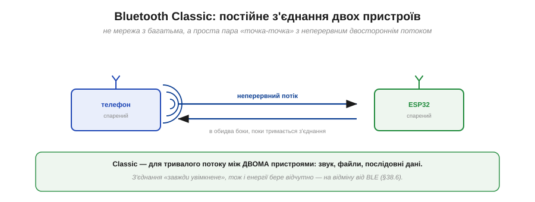
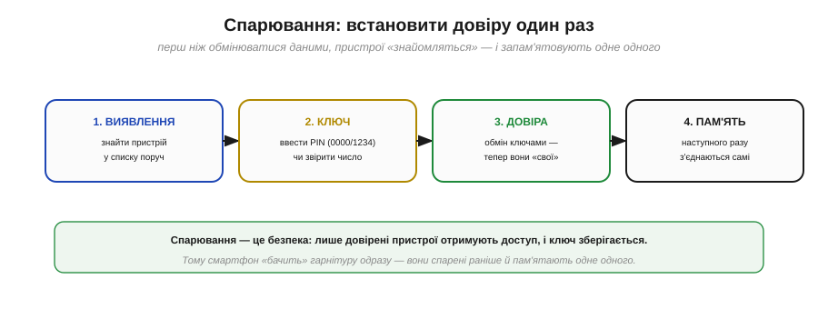
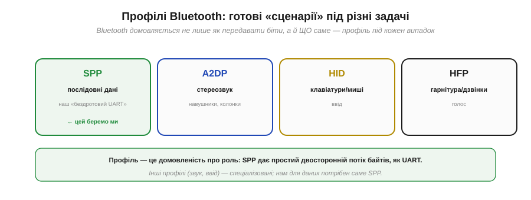
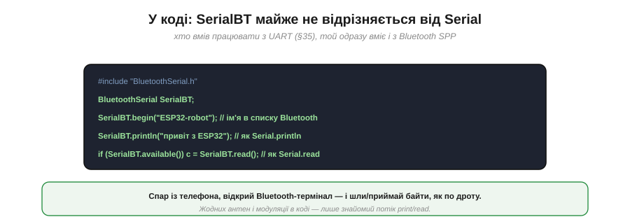
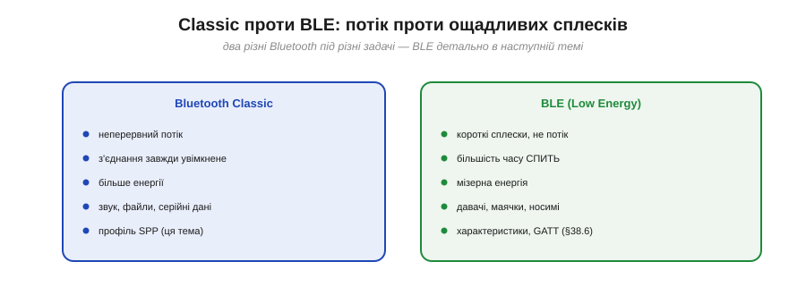

# Bluetooth Classic (SPP): бездротовий UART

Якщо [Wi-Fi](book:communications/wifi) — це «під'єднати пристрій до мережі», то Bluetooth — це «з'єднати два пристрої між собою». Для багатьох задач саме друге й потрібне: керувати роботом із телефона, прочитати давач, замінити надокучливий кабель бездротом. І тут Bluetooth Classic пропонує напрочуд приємний трюк — він уміє прикинутися звичайним [послідовним портом](book:communications/async-serial). Цей профіль (SPP) — улюблений інструмент аматорів, бо дозволяє «перерізати дріт», майже не міняючи код. Розберімо, як це працює.

### Bluetooth Classic: постійне з'єднання двох

**Bluetooth Classic** (його ще звуть BR/EDR) призначений для **тривалого потоку** між **двома** пристроями. Це не мережа з багатьма вузлами, як Wi-Fi, а проста пара «точка-точка».


*Рис. Два спарені пристрої (телефон і ESP32) тримають **неперервне** двостороннє з'єднання: дані течуть в обидва боки, поки воно живе. Classic заточений під сталий потік — звук, файли, послідовні дані. З'єднання «завжди увімкнене», тож і енергії бере відчутно (на відміну від ощадливого [BLE](book:communications/ble-gatt)).*

Ключове слово тут — **неперервний**. Classic тримає з'єднання активним увесь час, готовий передавати потік без пауз. Це чудово для звуку (навушники) чи постійного обміну, але має ціну: «завжди увімкнене» радіо помітно **їсть енергію**. Саме тому для давачів і носимих пристроїв існує економніший [BLE](book:communications/ble-gatt) — а найкорисніша риса самого Classic в іншому.

### SPP: Bluetooth прикидається UART

Серед можливостей Bluetooth Classic є профіль **SPP** (*Serial Port Profile*) — і він робить дивовижну річ: перетворює радіоканал на **точну подобу UART**. Два спарені пристрої отримують віртуальний послідовний порт: шлеш байти — вони приходять на той бік, як по дроту.


*Рис. Було: два пристрої з'єднані дротом UART (TX/RX/GND). Стало: той самий потік байтів іде по Bluetooth SPP — без дроту. Модель та сама — послідовний потік, — лише канал тепер радіо. Тому код майже не міняється: де був `Serial`, тепер `SerialBT`.*

Це і є «перерізати дріт». Уся звична робота з [UART](book:communications/async-serial) — `print()`, `read()`, побайтовий потік — переноситься на Bluetooth майже без змін: міняєш `Serial` на `SerialBT` — і той самий код тепер працює бездротово. Хочеш керувати роботом із телефона? Відкрив Bluetooth-термінал, шлеш команди — пристрій їх читає, як з UART. Саме ця простота й зробила SPP народним улюбленцем.

### Спарювання: встановити довіру один раз

Перш ніж два пристрої почнуть обмінюватися, вони мусять **спаритися** (*pairing*) — установити довірчий зв'язок. Це робиться раз, і далі вони пам'ятають одне одного.


*Рис. **Виявлення** — знайти пристрій у списку поруч. **Ключ** — підтвердити PIN (часто 0000 чи 1234) або звірити число на обох екранах. **Довіра** — обмін ключами, відтепер пристрої «свої». **Пам'ять** — наступного разу вони з'єднаються самі, без повторного введення коду.*

Спарювання — це **безпека**: лише довірені пристрої дістають доступ, а ключ зберігається в обох. Тому смартфон одразу «бачить» свою гарнітуру — вони спарилися раніше й пам'ятають одне одного. Для розробника це означає простий сценарій: спарив телефон із ESP32 один раз (ввівши код), а далі вони з'єднуються автоматично.

### Профілі Bluetooth

SPP — лише один із багатьох **профілів** Bluetooth. Профіль — це домовленість не лише про те, **як** передавати біти, а й **що** саме й навіщо.


*Рис. **SPP** — послідовні дані (наш «бездротовий UART»). **A2DP** — стереозвук (навушники, колонки). **HID** — клавіатури й миші (ввід). **HFP** — гарнітура й дзвінки (голос). Кожен профіль — готовий сценарій під свою задачу; для довільних даних потрібен саме SPP.*

Це зручно: замість винаходити свій спосіб передати звук чи зімітувати клавіатуру, береш готовий профіль. Для **довільних даних** (команди, телеметрія, текст) універсальний інструмент — **SPP**: він дає простий двосторонній потік байтів, як UART, і не нав'язує жодної структури зверху. Решта профілів спеціалізовані; нам у курсі потрібен саме SPP.

### Під капотом: чистий потік над брудним ефіром

Варто пам'ятати, що зручна «ілюзія дроту» в SPP — саме ілюзія. Під нею ховається вся [ненадійність радіоканалу](book:communications/on-chip-radio).


*Рис. Застосунок бачить рівний UART-потік (`SerialBT.print/read`). Стек Bluetooth унизу непомітно робить усю чорну роботу: пакети, CRC, ACK, перевідправлення, стрибки частоти. А ще нижче — спільний брудний ефір 2.4 ГГц із втратами й завадами. Чистий потік нагорі — результат боротьби стека внизу.*

Тобто SPP не **скасовує** ненадійність радіо — він її **ховає**, додаючи знизу підтвердження й ретраї (так само, як [TCP](book:communications/tcp-vs-udp) робить це поверх [Wi-Fi](book:communications/wifi)). Для тебе це означає: зазвичай «дріт» працює прозоро, але за поганого зв'язку (далеко, завади) він усе одно може **обірватися** — і твій код має бути до цього готовий через [надійну логіку та failsafe](book:communications/reliable-link). Зручність є, та фізику не обдуриш.

### У коді: SerialBT ≈ Serial

Найкраще все це видно в коді — він майже не відрізняється від звичайного UART.


*Рис. Кілька рядків — і ESP32 уже бездротовий послідовний порт: `SerialBT.begin("ім'я")` піднімає його під цим іменем у списку Bluetooth, а далі `println()` і `read()` працюють точно як у `Serial`.*

```
#include "BluetoothSerial.h"
BluetoothSerial SerialBT;

SerialBT.begin("ESP32-robot");                 // ім'я в списку Bluetooth
SerialBT.println("привіт з ESP32");            // як Serial.println
if (SerialBT.available()) c = SerialBT.read(); // як Serial.read
```

> 🔧 **Навіщо це.** Це найшвидший спосіб додати пристрою бездротове керування. Якщо ти вже вмієш працювати зі звичайним [послідовним портом](book:communications/async-serial), то Bluetooth SPP дається майже задарма: заміни `Serial` на `SerialBT`, спар із телефона, відкрий Bluetooth-термінал — і керуй пристроєм чи читай із нього байти без жодного дроту. Це ідеально для налагодження, простих пультів і прототипів. Пам'ятай лише дві речі: Classic помітно **їсть батарею** (для автономних давачів краще [BLE](book:communications/ble-gatt)), і «дріт» бездротовий, тож при втраті зв'язку потрібен [failsafe](book:communications/reliable-link).

### Classic проти BLE

Bluetooth буває **двох** дуже різних видів, і їх легко сплутати.


*Рис. **Bluetooth Classic**: неперервний потік, з'єднання завжди увімкнене, більше енергії — звук, файли, серійні дані (профіль SPP). **BLE** (*Bluetooth Low Energy*): короткі сплески замість потоку, більшість часу пристрій спить, мізерна енергія — давачі, маячки, носимі гаджети (характеристики, GATT).*

Коротко: **Classic** — для тривалого потоку, коли енергія не критична (бездротовий UART саме тут). **BLE** — для рідкісних дрібних обмінів, коли пристрій має жити роками від маленької батарейки: він більшість часу **спить** і прокидається лише на мить, щоб надіслати порцію даних. Це принципово інша філософія — не «потік», а «ощадливі сплески», — і вона потребує іншої моделі даних: реклами, [характеристик і GATT](book:communications/ble-gatt).

---
