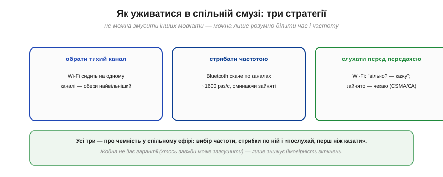
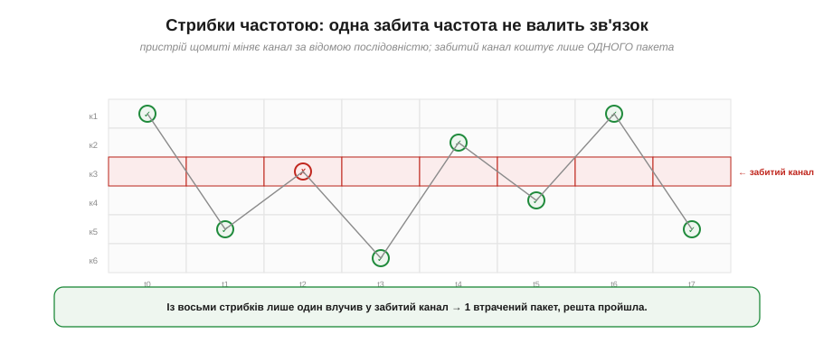
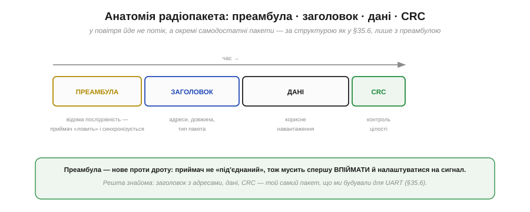
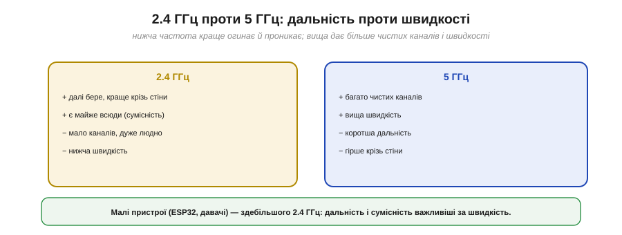

# Канал, смуга, пакет

Спільне повітря, у якому працює будь-яке [радіо на чипі](book:communications/on-chip-radio), — це не хаос, у якому всі кричать абияк. Ефір **ділять** за певними правилами: вирізають смугу частот, нарізають її на канали, домовляються, як по черзі користуватися, і пакують дані в стандартні пакети. Зрозуміти цей поділ важливо практично: він пояснює, чому Wi-Fi у людному місці гальмує, чому Bluetooth стійкіший до завад, і навіть чому варто обрати 5 ГГц замість 2.4. Розберімо все по черзі — від смуги до пакета.

### Смуга 2.4 ГГц: безліцензійна, тому переповнена

І Wi-Fi, і Bluetooth (і ще багато хто) живуть в одній і тій самій смузі частот — близько **2.4 гігагерца**. Чому саме там? Бо це **безліцензійна** смуга (її звуть **ISM** — *Industrial, Scientific, Medical*): користуватися нею можна без жодного дозволу, і вона доступна майже в усьому світі.


*Рис. У смугу 2.400–2.4835 ГГц набилися всі: Wi-Fi, Bluetooth, Zigbee, навіть мікрохвильова піч (вона теж випромінює на 2.45 ГГц) і старі радіотелефони. «Безліцензійна» означає «нічия» — заходити можна без дозволу, але й захисту від сусідів немає.*

Звідси й головна біда 2.4 ГГц — **тіснота**. «Безліцензійна» — це палиця на два кінці: з одного боку, будь-хто може робити пристрої без бюрократії (тому радіо й стало таким дешевим і всюдисущим), з іншого — ніхто не гарантує тобі чистого ефіру. Твій Wi-Fi бореться за місце із сусідським, з твоїм же Bluetooth, а коли вмикається мікрохвильовка — і з нею. Уся подальша хитрість каналів і стратегій уживання — це боротьба за виживання в цьому людному небі.

### Канали: смугу ділять, але вони перекриваються

Щоб не всі тиснулися в одне місце, смугу нарізають на **канали** — підсмуги, на яких можна працювати окремо. Та з Wi-Fi тут криється пастка: його канали **широкі** й насправді **перекриваються**.


*Рис. На папері Wi-Fi у 2.4 ГГц має 13 каналів, та кожен завширшки ~20 МГц — тож сусідні налазять один на одного. Не перекриваються лише три: **1, 6, 11**. Саме на них і ставлять Wi-Fi. Bluetooth натомість ділить ту саму смугу на десятки **вузьких** каналів (1–2 МГц) і стрибає по них.*

Ось чому номери Wi-Fi-каналів 1, 6 і 11 — майже сакральні: це **єдина** трійка, що не заважає одне одному. Якщо два роутери поряд стоять на каналах 1 і 3, вони частково перекриваються й глушать одне одного; на 1 і 6 — ні. Bluetooth пішов іншим шляхом: багато **вузьких** каналів, по яких він **стрибає** (про це нижче). Дві різні філософії поділу однієї смуги.

### Ширина каналу ↔ швидкість

Чому б не зробити канали ще ширшими, щоб гнати більше даних? Бо ширина каналу — це **компроміс**.


*Рис. Вузький канал: їх влазить багато, але кожен везе мало даних. Широкий канал: везе більше даних, та займає більше спектра — тож таких каналів влазить мало, і вони ловлять більше завад. Більше спектра = вища швидкість, але менше «слотів».*

Зв'язок простий: **більше смуги — більше швидкості** (це фундаментальний закон, межу якому ставить [теорема Шеннона про пропускну здатність](book:communications/bandwidth-capacity)). Та спектр скінченний, тож широкі канали швидко його з'їдають.

**Приклад (скільки каналів влазить).** Порахуймо для Wi-Fi у 2.4 ГГц:

```
ширина всієї смуги ≈ 2483.5 − 2400 = 83.5 МГц
ширина одного Wi-Fi-каналу        ≈ 20 МГц

83.5 / 20 ≈ 4 канали, що не перекриваються
(на практиці — рівно 3: канали 1, 6, 11)
```

Лише три неперекривні канали на **всіх** у радіусі — ось чому в багатоквартирному будинку Wi-Fi гальмує: десятки роутерів б'ються за ті самі 1, 6, 11. Широка смуга дала швидкість, але забрала простір для сусідів.

### Як уживатися: три стратегії

Оскільки змусити інших замовкнути не можна, пристрої вживаються трьома способами «чемності» в спільному ефірі.


*Рис. **Обрати тихий канал**: Wi-Fi сидить на одному каналі — варто вибрати найвільніший. **Стрибати частотою**: Bluetooth скаче по каналах ~1600 разів за секунду, оминаючи зайняті. **Слухати перед передачею**: Wi-Fi спершу перевіряє, чи канал вільний, і лише тоді говорить (метод CSMA/CA).*

Кожна стратегія по-своєму знижує ймовірність зіткнень. Wi-Fi сидить на фіксованому каналі, але **слухає перед передачею** (почув, що канал зайнятий, — зачекав). Bluetooth не сидить на місці взагалі, а **стрибає** з каналу на канал. Спільне в них одне: **жодна не дає гарантії** — хтось завжди може заглушити ефір, — вони лише роблять зіткнення рідшими. Це знову та сама природа радіо: не «надійно», а «як вийде, але з розумом».

### Стрибки частотою

Стратегія Bluetooth — **стрибки частотою** (*frequency hopping*) — заслуговує окремого погляду, бо вона напрочуд елегантна. Пристрій щомиті міняє канал за наперед відомою (і передавачу, і приймачу) послідовністю — близько **1600 разів за секунду**.


*Рис. Зв'язок скаче по каналах за відомою послідовністю. Якщо один канал постійно забитий завадою (червоний рядок), у нього влучає лише один стрибок із багатьох — тож втрачається лише **один** пакет, а решта проходить по інших каналах. Завада на одній частоті більше не валить увесь зв'язок.*

У цьому й геніальність ідеї: завада зазвичай сидить на **одній** частоті (як та сама мікрохвильовка), а пристрій, що стрибає, проводить на ній лише крихітну частку часу. Забитий канал коштує одного загубленого пакета — який легко [перешлеться](book:communications/reliable-link), — а не розриву зв'язку. Сама ідея стрибків частоти, до речі, має яскраву й несподівану історію — її варто шукати поряд із розмовою про [завадостійкість і розширення спектра](book:communications/jamming-fhss).

**Приклад (тривалість одного стрибка).** За 1600 стрибків за секунду:

```
час на одному каналі = 1 / 1600 с = 625 мкс
```

Лише 625 мікросекунд на частоті — і пристрій уже на іншій. Навіть якщо завада постійна, вона псує крихітну частку передач.

### Анатомія радіопакета

Тепер про те, **що** саме летить у тому пакеті. По радіо йде не суцільний потік, а окремі **пакети**, і кожен влаштований за знайомою схемою — лише з однією новою частиною на початку.


*Рис. Пакет: **преамбула** (відома послідовність, щоб приймач упіймав сигнал і синхронізувався) → **заголовок** (адреси, довжина, тип) → **дані** → **CRC** (контроль цілості). Усе, крім преамбули, — той самий [пакет](book:communications/packet-design), що будують і для UART.*

Більшість частин — це звичайна [будова пакета](book:communications/packet-design): заголовок з адресами й довжиною, корисні дані, CRC наприкінці. Нове тут — **преамбула** (*preamble*) на самому початку. На дроті приймач завжди «під'єднаний» і слухає; а в радіо він спершу мусить **упіймати** сигнал із шуму — налаштувати підсилення, синхронізувати свій годинник із чужим. Преамбула — це відома наперед послідовність на початку кожного пакета, по якій приймач «чіпляється» за сигнал, перш ніж читати корисні дані. Без неї він не знав би навіть, де пакет починається.

### 2.4 проти 5 ГГц

Насамкінець — чому існує ще й смуга **5 ГГц**, і коли яку брати.


*Рис. 2.4 ГГц: бере далі, краще проходить крізь стіни, є майже всюди — але мало каналів і дуже людно, та й швидкість нижча. 5 ГГц: багато чистих каналів і вища швидкість — але коротша дальність і гірше крізь перешкоди. (Чому нижча частота краще [огинає перешкоди](book:communications/propagation-polarization) — суто фізика поширення хвиль.)*

Коротко: **нижча** частота (2.4) краще **огинає** перешкоди й бере далі; **вища** (5) дає більше чистого спектра й швидкості, але слабшає на відстані й застряє у стінах. Малі пристрої — ESP32, давачі, носимі гаджети — майже завжди працюють на **2.4 ГГц**: для них дальність і всюдисутність важливіші за швидкість, а великих потоків вони й не передають.

> 🔧 **Навіщо це.** Практичні висновки. Якщо твій Wi-Fi-пристрій погано працює в людному місці — спробуй **інший канал** (1, 6 чи 11) або перейди на **5 ГГц**, якщо він є і дальності вистачає. Якщо потрібна **стійкість** до завад (а не максимальна швидкість) — Bluetooth зі своїми стрибками частоти витриваліший за Wi-Fi на тому самому 2.4 ГГц. А проєктуючи власний радіообмін, пам'ятай про преамбулу: приймачеві треба час «упіймати» кожен пакет, тож надто короткі чи надто часті пакети неефективні.

Смуга, канали й пакети — це той рівень «сирого радіо», на якому стоять усі **готові системи** бездротового зв'язку. Найпоширеніша з них — [Wi-Fi](book:communications/wifi): саме поверх цього поділу ефіру вона будує точки доступу, IP-адреси й увесь звичний бездротовий інтернет.

---
