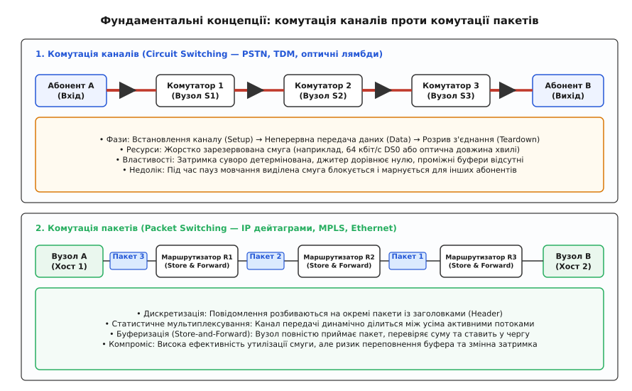
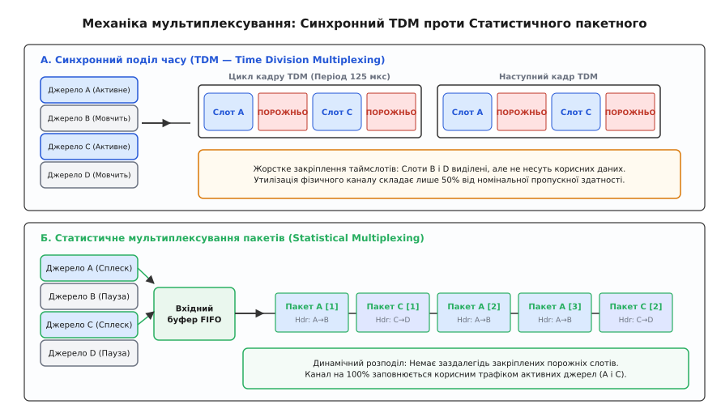
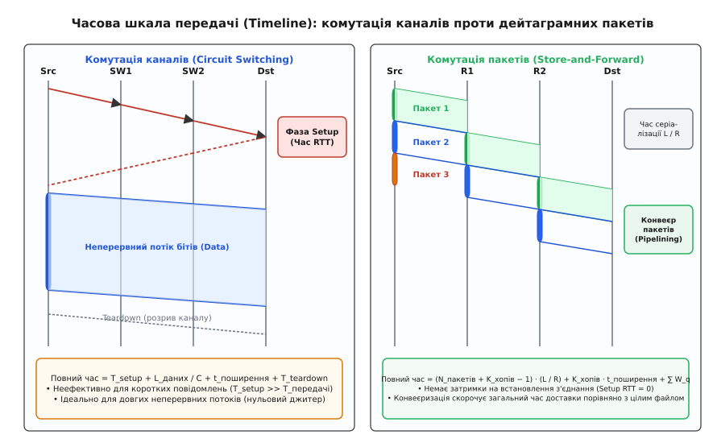
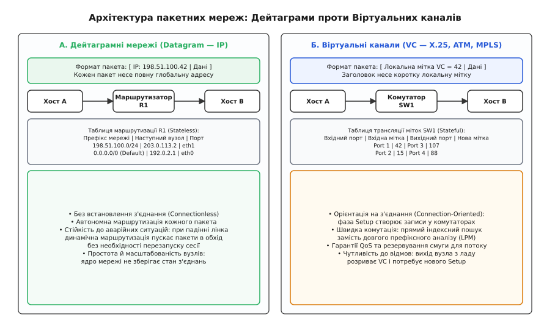

# Комутація каналів проти комутації пакетів

<preknowlist>
- [Затримка й надійність](topic:communications/latency-reliability) — складові мережевої затримки, втрати та компроміси передачі.
- [Смуга і межа Шеннона](topic:communications/bandwidth-capacity) — пропускна здатність каналів зв'язку та фізичні обмеження швидкості.
- [Черги в мережах: затримка і втрати](topic:communications/queue-theory-networks) — моделі черг, закон Літтла та переповнення буферів.
</preknowlist>

Коли трансатлантичний підводний кабель зв'язує два континенти, його фізична смуга пропускання є скінченним і надзвичайно дорогим ресурсом: кожен гігагерц оптичного спектра коштує десятки мільйонів доларів інвестицій. Якщо спробувати організувати передачу комп'ютерних даних за телефонним принципом — виділивши кожному користувачеві фіксовану смугу на весь час його перебування в мережі, — магістраль зможе обслужити лише кілька тисяч клієнтів, а 90% її пропускної здатності щосекунди марнуватиметься в паузах між натисканнями клавіш та читанням веб-сторінок. Навпаки, якщо відмовитися від закріплення смуг і дозволити всім комп'ютерам одночасно скидати свої дані у спільну чергу, магістраль обслуговуватиме сотні тисяч користувачів, але зіткнеться зі стохастичними сплесками, нерівномірною затримкою та ризиком втрати даних при переповненні буферів. Уся історія цифрових комунікацій обертається довкола цього фундаментального вибору: детерміноване монопольне резервування ресурсів чи гнучкий спільний розподіл за вимогою.

### Фізична та логічна архітектура комутації каналів

Комутація каналів (*Circuit Switching*, від латинського *circuitus* — замкнений шлях або коло) — це спосіб побудови мережі, за якого перед початком передачі інформації між джерелом і одержувачем установлюється виділений фізичний або логічний канал, що монопольно закріплюється за цією парою вузлів на весь час сеансу.

Історично принцип виник в аналоговій телефонії, де комутатор буквально замикав мідні дроти релейними перемикачами, утворюючи суцільний електричний провідник від мікрофона першого абонента до динаміка другого. З переходом на цифрову передачу фізичні мідні пари поступилися місцем синхронному часовому мультиплексуванню (**TDM**, *Time-Division Multiplexing*). У TDM-магістралях спільний цифровий потік ділиться на циклічні кадри тривалістю рівно 125 мікросекунд (що відповідає частоті дискретизації звуку 8000 Гц за стандартом Найквіста–Котельникова). Кадр містить фіксовану кількість таймслотів:
- Базовий цифровий канал **DS0** (*Digital Signal 0*): 1 байт кожні 125 мкс, що забезпечує швидкість:

```
R_DS0 = (8 бітів) / (125 · 10⁻⁶ с) = 64 000 біт/с = 64 кбіт/с
```

- Північноамериканський стандарт **T1**: об'єднує 24 канали DS0 та 1 біт синхронізації (193 біти на кадр), що становить `193 · 8000 = 1.544` Мбіт/с.
- Європейський стандарт **E1**: об'єднує 32 канали DS0 (30 для голосу, 1 для кадрової синхронізації, 1 для сигналізації), що формує потік `32 · 8 · 8000 = 2.048` Мбіт/с.

На оптичному рівні еволюція продовжилася синхронними ієрархіями **SONET/SDH** (потоки від STM-1 на швидкості 155.52 Мбіт/с до STM-64 на 9.953 Гбіт/с), а в сучасних оптичних магістралях — комутацією за довжиною хвилі (**WDM/DWDM**, *Dense Wavelength Division Multiplexing*). В оптичних мережах стандарту ITU-T G.694.1 одиницею комутованого каналу виступає оптична довжина хвилі (лямбда `λ`) у сітці частот 50 ГГц або 100 ГГц (а в сучасних гнучких сітках *Flex-Grid* — із гранулярністю 12.5 ГГц). Ці хвилі перемикаються реконфігуровними оптичними мультиплексорами **ROADM** (*Reconfigurable Optical Add-Drop Multiplexer*) за допомогою мікродзеркал (MEMS) або рідких кристалів на кремнії (LCoS) без перетворення фотонів в електрони.

Будь-який сеанс у мережі комутації каналів строго складається з трьох послідовних фаз:

```
[ Фаза 1: Setup ] ───► [ Фаза 2: Data Transfer ] ───► [ Фаза 3: Teardown ]
 Сигналізація виділяє   Неперервний бітовий потік      Сигналізація звільняє
 смугу на всіх вузлах   без черг та без заголовків     слоти для інших викликів
```

1. **Фаза встановлення каналу (Setup phase)**: Абонент, що ініціює зв'язок, надсилає службове повідомлення сигналізації (наприклад, повідомлення IAM — *Initial Address Message* у підсистемі ISUP телефонного стека ОКС-7 / SS7, або запит RSVP-TE / GMPLS в оптичних мережах). Сигналізаційний пакет проходить крізь усі проміжні комутатори на шляху до адресата, перевіряє наявність вільних таймслотів або оптичних довжин хвиль і резервує їх. Якщо на будь-якому проміжному відрізку вільних ресурсів немає, виклик відхиляється (блокується) повідомленням REL (*Release*). Якщо ресурс зарезервовано успішно, комутатор адресата надсилає підтвердження ACM (*Address Complete Message*) та ANM (*Answer Message*) назад. Час встановлення становить щонайменше один повний круговий час обігу сигналу (*Round-Trip Time*, RTT) плюс сумарний час програмної обробки сигналізації комутаторами:

```
T_setup = RTT + ∑ t_switch
```

2. **Фаза передачі даних (Data transfer phase)**: Після підтвердження каналу передавач починає випромінювати інформаційні біти. Дані передаються неперервно у виділених таймслотах. Проміжним комутаторам більше не потрібно читати адреси, шукати маршрути чи приймати рішення: вони просто перекладають байти з вхідного таймслота у вихідний таймслот за заздалегідь налаштованою таблицею крос-коннекту (апаратної матриці комутації *Time-Space-Time*, TST). Затримка передачі складається виключно з часу поширення електромагнітної хвилі в середовищі (`t_prop = d / v`, де `v ≈ 200 000` км/с у склі).
3. **Фаза розриву з'єднання (Teardown phase)**: Після завершення сеансу спеціальна команда сигналізації (повідомлення REL та підтвердження RLC — *Release Complete*) проходить уздовж маршруту і скасовує резервування таймслотів у комутаторах, повертаючи їх у пул доступних ресурсів для нових абонентів.

Історичні корені цієї інженерної парадигми, винахід крокових шукачів Строуджера та опір телефонних монополій описано у вставці [Еволюція комутації: від телефонних шнурів до пакетної революції](topic:communications/circuit-vs-packet-switching/hist-switching-evolution.md).


*Порівняння парадигм: у комутації каналів ресурси резервуються монопольно на весь час сеансу через фази сигналізації; у комутації пакетів спільні канали динамічно діляться між потоками за допомогою буферів проміжних вузлів.*

Головні переваги комутації каналів — абсолютний детермінізм:
- **Гарантована пропускна здатність**: швидкість передачі зафіксована й не залежить від активності інших абонентів у мережі.
- **Постійна затримка**: відсутні черги та випадкові очікування у вузлах.
- **Нульовий джитер**: варіація затримки між сусідніми бітами дорівнює нулю (`Jitter = 0`), що ідеально підходить для аналогового звуку.

### Проблема пачкового трафіку та неефективність TDM

Попри бездоганний детермінізм, комутація каналів має фундаментальну ваду, яка зробила її непридатною для комп'ютерних систем: **катастрофічна неефективність використання смуги при пульсуючому трафіку**.

Людська мова в телефонній розмові має коефіцієнт активності близько 40% (поки один говорить, інший слухає, плюс паузи між фразами). Навіть за таких умов 60% часу виділений телефонний канал передає тишу. Проте для комп'ютерних даних ситуація стає критичною. Трафік додатків — від завантаження веб-сторінок і транзакцій баз даних до запитів API — має виражений пачковий характер (*bursty traffic*).

Ступінь пульсації кількісно оцінюється коефіцієнтом пачковості або відношенням пікової швидкості до середньої (**PAR**, *Peak-to-Average Ratio*):

```
PAR = R_peak / R_average
```

Для більшості інтернет-додатків `PAR` становить від 10:1 до 1000:1. Наприклад, користувач клікає на посилання: браузер завантажує веб-сторінку за 50 мілісекунд, споживаючи пікову швидкість 100 Мбіт/с, після чого людина читає текст протягом 25 секунд (швидкість передачі дорівнює 0 біт/с). Середня швидкість за цей інтервал:

```
R_average = (100 Мбіт/с · 0.05 с) / 25 с = 0.2 Мбіт/с = 200 кбіт/с
PAR = 100 Мбіт/с / 0.2 Мбіт/с = 500
```

Якщо організувати цей зв'язок через комутацію каналів, мережа змушена зарезервувати за користувачем лінію 100 Мбіт/с на всі 25 секунд сесії. Протягом 99.8% часу виділені таймслоти передаватимуть порожнечу (байти заповнення `0xFF` або `0x00`), блокуючи доступ для інших абонентів.


*Механіка мультиплексування: у синхронному TDM таймслоти неактивних джерел B і D подорожують порожніми; у статистичному мультиплексуванні канал на 100% заповнюється корисними пакетами активних джерел A і C.*

Економічна модель комутації каналів побудована на тарифікації тривалості з'єднання (*call duration billing*): абонент сплачує за кожну хвилину утримання зарезервованого каналу, незалежно від того, передавав він інформацію чи мовчав. Для комп'ютерного світу, де з'єднання між серверами та клієнтами підтримуються годинами у фоновому режимі, така модель виявилася економічно безглуздою.

### Механіка комутації пакетів і статистичне мультиплексування

Комутація пакетів (*Packet Switching*) відмовляється від попереднього резервування фізичних каналів та неперервних потоків. Замість цього повідомлення розбиваються на невеликі автономні блоки даних — **пакети** (*packets*).

Кожен пакет складається з двох частин:
1. **Службовий заголовок (Header)**: містить метадані, необхідні для доставки — мережеву адресу джерела та призначення (наприклад, IP-адреси), порядковий номер пакета для відновлення послідовності, ідентифікатор протоколу верхнього рівня, біти пріоритету (QoS) та контрольну суму (CRC/Checksum) для перевірки цілісності.
2. **Корисне навантаження (Payload)**: безпосередній фрагмент переданого файлу, запиту чи медіапотоку.

Головна рушійна сила комутації пакетів — **статистичне мультиплексування** (*Statistical Multiplexing*). Замість жорсткого закріплення таймслотів за абонентами спільний фізичний канал надається будь-якому вузлу на вимогу — у той момент, коли в нього з'являється готовий до відправлення пакет. Оскільки ймовірність того, що всі підключені комп'ютери згенерують сплеск трафіку в одну й ту саму мілісекунду, мізерно мала, лінія пропускною здатністю `C` здатна одночасно обслуговувати в 3–10 разів більше користувачів, ніж при комутації каналів.

Строге математичне порівняння ємності ліній, виведення формули блокування Ерланга та біноміальний розрахунок імовірності перевантаження наведено у вставці [Математика статистичного мультиплексування проти моделі Ерланга](topic:communications/circuit-vs-packet-switching/math-statistical-multiplexing.md).

#### Принцип Store-and-Forward (збереження та пересилання)

Оскільки пакети надходять від різних джерел асинхронно, проміжні комутатори й маршрутизатори працюють за принципом збереження та подальшої передачі (**Store-and-Forward**):

```
Вхідний порт ──► [ Прийом усіх бітів пакета L ] ──► [ Перевірка CRC ] ──► [ Буфер FIFO ] ──► [ Передача у вихідний канал ]
```

Вузол не може почати випромінювати перший біт пакета у вихідну лінію, доки не прийме пакет повністю. Це необхідно з двох причин:
1. **Перевірка цілісності**: комутатор обчислює контрольну суму кадру (FCS) і звіряє її із заголовком. Якщо кабель зазнав електромагнітної завади і біти спотворилися, пошкоджений пакет негайно знищується у вузлі, не засмічуючи подальші сегменти мережі марним трафіком. (Виняток становлять спеціалізовані комутатори *Cut-Through* у центрах високочастотної біржової торгівлі та суперкомп'ютерних кластерах HPC, де комутатор починає видавати байти після зчитування перших 6–14 байтів заголовка для досягнення затримок < 300 наносекунд, жертвуючи перевіркою цілісності на проміжних вузлах).
2. **Узгодження швидкостей**: вхідний порт може працювати на швидкості 100 Гбіт/с, а вихідний — на 10 Гбіт/с. Вузол накопичує пакет у пам'яті інтерфейсу, перетворюючи швидкість надходження на швидкість відправлення.

Повний час передачі пакета довжиною `L` бітів крізь один комутаційний хоп зі швидкістю лінії `R` біт/с складається з чотирьох компонентів затримки:

```
T_hop = t_proc + t_queue + t_tx + t_prop
```

де:
- `t_proc` — **затримка обробки** (*Processing Delay*): час, необхідний процесору або ASIC комутатора для аналізу заголовка, пошуку вихідного порту в таблиці маршрутизації (FIB/TCAM) та перерахунку контрольних сум (зазвичай 1–10 мкс).
- `t_queue` — **затримка в черзі** (*Queuing Delay*): час очікування в буфері вихідного порту, доки передавач зайнятий відправленням попередніх пакетів. Це випадкова величина, яка залежить від миттєвого завантаження мережі (від 0 до сотень мілісекунд).
- `t_tx = L / R` — **затримка серіалізації** (*Transmission / Serialization Delay*): час, потрібний передавачу для того, щоб виштовхнути всі `L` бітів пакета у фізичний дріт або оптичне волокно.
- `t_prop = d / v` — **затримка поширення** (*Propagation Delay*): фізичний час руху електромагнітного сигналу кабелем довжиною `d` зі швидкістю `v`.

#### Конвеєризація пакетів (Pipelining)

Розбиття монолітного повідомлення на пакети дає колосальний виграш у сумарному часі передачі за рахунок конвеєризації. Нехай необхідно передати файл розміром `M = 15 Мбіт` крізь ланцюжок із `K = 3` послідовних каналів зі швидкістю `R = 10 Мбіт/с` кожен (і знехтуємо часом поширення):

- **Без розбиття на пакети (монолітне повідомлення)**:
  Вузол 1 передає файл вузлу 2 за `15 / 10 = 1.5` с. Лише після повного отримання вузол 2 передає файл вузлу 3 (ще 1.5 с), а вузол 3 — адресату (ще 1.5 с). Повний час доставки:

```
T_моноліт = K · (M / R) = 3 · 1.5 с = 4.5 с
```

- **З розбиттям на N = 1500 пакетів по 10 кбіт (L = 10 000 бітів)**:
  Час серіалізації одного пакета становить `t_tx = 10 000 / 10 000 000 = 1` мс. Джерело надсилає пакет 1 за 1 мс. Щойно вузол 2 прийняв пакет 1, він починає пересилати його вузлу 3, а джерело одночасно надсилає пакет 2 у перший канал. Усі ланки лінії працюють паралельно як конвеєр на заводі.
  
  Повний час доставки всіх `N` пакетів крізь `K` ліній:

```
T_пакети = (N + K - 1) · (L / R)
T_пакети = (1500 + 3 - 1) · 0.001 с = 1502 · 0.001 с = 1.502 с
```

Розбиття на пакети прискорило доставку майже втричі (з 4.5 с до 1.5 с), оскільки лінії не простоюють в очікуванні завершення передачі всього масиву даних.


*Часова шкала: комутація каналів витрачає початковий час RTT на фазу Setup, але передає дані неперервно; комутація пакетів стартує без затримки на Setup, забезпечуючи конвеєрну передачу Store-and-Forward.*

### Дейтаграми проти віртуальних каналів у пакетних мережах

Усередині самої концепції комутації пакетів виник фундаментальний розкол на дві архітектурні школи: **дейтаграмні мережі** (*Datagram Networks*) та **мережі віртуальних каналів** (*Virtual Circuit Networks*).


*Два підходи до комутації пакетів: дейтаграмний IP спрямовує кожен пакет автономно за глобальною адресою через безстанційні вузли; віртуальні канали X.25/ATM комутують локальні мітки через станційні таблиці трансляції.*

#### 1. Дейтаграмний підхід (Datagram — стек TCP/IP)

Дейтаграмний підхід побудований на принципі **відсутності з'єднання** (*Connectionless*):
- Мережа не знає нічого про виклики чи сесії: кожен пакет (дейтаграма) обробляється маршрутизатором як абсолютно незалежний об'єкт.
- Заголовок кожного пакета несе повну глобальну адресу призначення (наприклад, 32-бітну IPv4 чи 128-бітну IPv6).
- Маршрутизатори є **безстанційними** (*Stateless*): вони не зберігають інформації про активні з'єднання користувачів. У пам'яті маршрутизатора є лише спільна таблиця маршрутизації, яка вказує, через який порт відправляти префікс мережі адресата (алгоритм найдовшого співпадіння префікса — *Longest Prefix Match*, LPM).
- Пакети одного й того самого потоку можуть пройти різними фізичними маршрутами, якщо в процесі передачі змінилася вага метрик або топологія мережі.

Головна перевага дейтаграмної мережі — **максимальна живучість**: якщо проміжний маршрутизатор раптово виходить з ладу чи згорає оптичний лінк, протоколи динамічної маршрутизації (BGP, OSPF) за секунди перебудовують таблиці. Наступний пакет того ж потоку автоматично піде в обхід аварійної ділянки без необхідності розриву сесії чи перезапуску клієнтської програми.

#### 2. Підхід віртуальних каналів (Virtual Circuit — X.25, Frame Relay, ATM)

Підхід віртуальних каналів намагався схрестити логіку комутації каналів із пакетною передачею:
- Перед відправленням першого байта даних обов'язково виконується фаза сигналізації встановлення з'єднання (**Call Setup**).
- Наскрізний шлях визначається один раз на стадії Setup. Усі комутатори на цьому шляху роблять запис у своїх внутрішніх таблицях комутації.
- Пакети не несуть довгих глобальних IP-адрес. Замість цього заголовок містить коротку локальну мітку віртуального каналу (**VCI**, *Virtual Circuit Identifier*).
- Комутатори є **станційними** (*Stateful*). Отримавши пакет, комутатор дивиться на пару `(Вхідний порт, Вхідний VCI)`, знаходить відповідний рядок у таблиці, замінює мітку на `Вихідний VCI` і виштовхує пакет у `Вихідний порт`.

```
Таблиця комутації ATM/VC (Вузол SW1):
+──────────────+──────────────+───────────────+────────────────+
| Вхідний порт | Вхідний VCI  | Вихідний порт |  Вихідний VCI  |
+──────────────+──────────────+───────────────+────────────────+
| Port 1       | 42           | Port 3        | 107            |
| Port 2       | 15           | Port 4        | 88             |
+──────────────+──────────────+───────────────+────────────────+
```

Перевага віртуальних каналів полягала у надзвичайно швидкій апаратній комутації за індексом таблиці та можливості жорсткого контролю якості обслуговування (QoS): під час фази Setup комутатор міг перевірити, чи вистачає смуги (*Admission Control*), і зарезервувати її.

Головний недолік — слабка відмовостійкість: вихід з ладу будь-якого комутатора на шляху миттєво руйнував віртуальний канал. Усі активні сесії обривалися, і кінцеві пристрої були змушені запускати повну процедуру сигналізації заново.

#### MPLS: сучасний синтез дейтаграм та міток

Наприкінці 1990-х років технологія **MPLS** (*Multiprotocol Label Switching*, RFC 3031) об'єднала найкраще з обох світів:
- На межі провайдерської мережі прикордонний маршрутизатор (**LER**, *Label Edge Router*) виконує класичну IP-маршрутизацію (LPM), зіставляє IP-пакет із класом еквівалентності пересилання (FEC) і вставляє 32-бітний заголовок мітки MPLS (між заголовком Ethernet L2 та IP L3, так званий рівень 2.5).
- Усередині магістрального ядра комутатори міток (**LSR**, *Label Switching Router*) комутують пакети виключно за мітками LSP (*Label Switched Path*) без аналізу важкого заголовка IP.
- За сигналізацію шляхів відповідають протоколи LDP або RSVP-TE, що дозволяє реалізувати інженерію трафіку (направлення потоків в обхід перевантажених лінків) та організацію ізольованих віртуальних приватних мереж (L3VPN / L2VPN).

### Порівняльний системний аналіз

Зіставлення двох фундаментальних парадигм дозволяє систематизувати їхні технічні й експлуатаційні характеристики:

```
Критерій                     Комутація каналів (Circuit Switching)     Комутація пакетів (Packet Switching)
────────────────────────────────────────────────────────────────────────────────────────────────────────────
Виділення ресурсів           Монопольне резервування (TDM/лямбда)      Динамічний спільний поділ за вимогою
Фаза встановлення (Setup)    Обов'язкова перед передачею даних         Відсутня (для дейтаграмного IP)
Утилізація смуги             Низька при пачковому трафіку              Максимальна (статистичне мультиплексування)
Затримка передачі            Суворо фіксована (лише t_prop)            Змінна (t_prop + t_tx + черги t_queue)
Джитер (варіація затримки)   Дорівнює нулю                             Присутній через коливання черг у буферах
Втрати інформації            Відхилення сесії при блокуванні           Втрати окремих пакетів при переповненні буфера
Поведінка при аварії вузла   Обрив сеансу, потрібен новий Setup        Автономний динамічний обхід аварійного лінка
Стан у проміжних вузлах      Stateful (стан кожного виклику)           Stateless у дейтаграмах IP
Вимоги до пам'яті вузлів     Мінімальні (немає черг пакетів)           Великі високошвидкісні буфери оперативної пам'яті
Економічна модель            Тарифікація за тривалість (час)           Тарифікація за пропускну здатність або гігабайти
```

Практичну перевірку цих властивостей, програмну модель джерел та результати порівняльного експерименту наведено у вставці [Імітаційне моделювання: комутація каналів проти комутації пакетів](topic:communications/circuit-vs-packet-switching/proj-switching-simulation.md).

### Конвергенція: як пакети повертають гарантії каналів

Перемога комутації пакетів створила нову інженерну проблему: як передавати чутливий до затримок трафік (живий голос у VoIP, відеоконференції Zoom/WebRTC, промислове телекерування) через мережу, побудовану за принципом найкращого зусилля (**Best Effort**)?

Якщо магістральний канал навантажений на 95%, випадкові сплески веб-трафіку переповнюють буфери маршрутизаторів. Пакети голосового дзвінка починають втрачатися або затримуватися на сотні мілісекунд, перетворюючи людську мову на нерозбірливе «роботизоване» булькотіння.

Щоб вирішити цю суперечність, пакетні мережі розробили кілька рівнів технологій конвергенції:

#### 1. Архітектури забезпечення якості обслуговування (QoS)

- **IntServ (Integrated Services, RFC 1633)**: спроба повернути поведінку комутації каналів у дейтаграмний IP. Протокол сигналізації **RSVP** (*Resource Reservation Protocol*, RFC 2205) опитував кожен маршрутизатор уздовж шляху і резервував смугу для конкретного потоку. Модель провалилася в глобальному Інтернеті через проблему масштабованості ядра: магістральний маршрутизатор не здатен підтримувати мільйони активних станів потоків у пам'яті (складність `O(N)` стану).
- **DiffServ (Differentiated Services, RFC 2474)**: масштабоване пакетне рішення без збереження стану окремих потоків. Пакети класифікуються на межі мережі та маркуються 6-бітним полем **DSCP** (*Differentiated Services Code Point*) у заголовку IP (байт Type of Service в IPv4 або Traffic Class в IPv6). Маршрутизатори в ядрі обробляють пакети відповідно до стандартних поведінок на кожному хопі (**PHB**, *Per-Hop Behavior*):
  - **Expedited Forwarding (EF, DSCP 46)**: абсолютний пріоритет. Пакети вичитуються з буфера позачергово через чергу з низькою затримкою (**LLQ**, *Low Latency Queuing*), що емулює поведінку виділеного проводу для голосу.
  - **Assured Forwarding (AF, класи AF11–AF43)**: зважене справедливе обслуговування черг (**CBWFQ**) з раннім випадковим скиданням пакетів при перевантаженні (**WRED**).
  - **Best Effort (BE, DSCP 0)**: передача за залишковим принципом.

#### 2. Емуляція каналів поверх пакетних мереж (Circuit Emulation Services)

Для плавного виведення з експлуатації застарілих телефонних АТС та базових станцій мобільного зв'язку 2G/3G IETF розробив технології **PWE3** (*Pseudo-Wire Emulation Edge-to-Edge*):
- **CESoPSN (RFC 5086)** (*Circuit Emulation Service over Packet Switched Network*): упаковує структуровані цифрові потоки E1/T1/DS0 у стандартні IP/MPLS пакети, передаючи лише активні таймслоти.
- **SAToP (RFC 4553)** (*Structure-Agnostic TDM over Packet*): інкапсулює суцільний неструктурований бітовий потік E1/T1 у пакети без аналізу внутрішнього кадрування TDM.

На приймальній стороні встановлюється спеціальний апаратний буфер усунення джитеру (**De-jitter Buffer**). Він приймає пакети, які приходять із випадковими мережевими коливаннями, вирівнює їх у часі та виштовхує біти з фіксованою тактовою частотою, відновлюючи безперервний синхронний потік TDM.

#### 3. Високоточна синхронізація часу

Комутація каналів спиралася на єдину глобальну атомну синхронізацію тактових генераторів телефонних станцій (рівні Stratum 1–4). Пакетні мережі асинхронні, тому для роботи стільникових веж 5G та систем промислової автоматизації застосовують нові протоколи синхронізації поверх Ethernet:
- **SyncE (Synchronous Ethernet, ITU-T G.8261/G.8262)**: передача стабільної тактової частоти безпосередньо на фізичному рівні модуляції PHY.
- **PTP (Precision Time Protocol, IEEE 1588v2)**: протокол пакетної синхронізації фази та абсолютного часу, що забезпечує точність менше 10 наносекунд завдяки апаратним міткам часу в мережевих картах.

#### 4. Безвтратний Ethernet у сучасних дата-центрах (Lossless Ethernet та RoCEv2)

У сучасних хмарних обчисленнях штучного інтелекту (тренування великих мовних моделей на кластерах GPU) та розподілених сховищах NVMe-oF втрата навіть одного пакета призводить до катастрофічного падіння пропускної здатності через таймаути TCP. Щоб вирішити це, пакетний Ethernet отримав розширення **Data Center Bridging (DCB)**:
- **PFC (Priority-based Flow Control, IEEE 802.1Qbb)**: формує механізм зворотного зв'язку на рівні L2 кадру. Коли буфер вихідного порту комутатора заповнюється на 80%, комутатор надсилає передавачу кадр PAUSE для конкретного пріоритетного класу, примусово зупиняючи відправлення на кілька мікросекунд і повністю усуваючи втрати через переповнення (*Zero Packet Drop*).
- **DCQCN (Data Center Quantized Congestion Notification)**: поєднує маркування явної ознаки перевантаження **ECN** (*Explicit Congestion Notification*) у заголовках IP із протоколом **RoCEv2** (*RDMA over Converged Ethernet*), забезпечуючи передачу даних безпосередньо між пам'яттю віддалених серверів з детермінізмом, еквівалентним виділеному каналу.

#### 5. Детерміновані пакетні мережі: TSN та DetNet

В автомобільних бортових мережах (Drive-by-Wire), авіаційній авіоніці та промисловій робототехніці затримка пакета повинна гарантуватися з мікросекундною точністю без права на стохастичні відхилення. Для цього робоча група IEEE 802.1 розробила стандарти **TSN** (*Time-Sensitive Networking*), а IETF — робочу групу **DetNet** (*Deterministic Networking*, RFC 8655):
- Стандарт IEEE 802.1Qbv запроваджує планувальник з контролем за часом (*Time-Aware Shaper*, TAS), який циклічно відкриває та закриває доступ до черг комутатора за глобальним розкладом IEEE 1588. У заздалегідь виділені мікросекундні вікна всі черги фонового трафіку блокуються, і критичний пакет керування проходить крізь комутатор абсолютно без затримки очікування, відновлюючи властивості ідеального фізичного каналу всередині пакетного Ethernet.

### Сучасна багаторівнева модель

У сучасній цифровій інфраструктурі протистояння завершилося взаємною інтеграцією на різних рівнях мережевого стека:

```
+─────────────────────────────────────────────────────────────────────────────+
| РІВЕНЬ ДОДАТКІВ ТА СЕРВІСІВ (Web, Відео, Голос VoIP, Хмарні API)           |
| Пакети UDP / TCP / QUIC (Повна домінація комутації пакетів)                 |
+─────────────────────────────────────────────────────────────────────────────+
                                       ▲
                                       │
+─────────────────────────────────────────────────────────────────────────────+
| ТРАНСПОРТНИЙ ТА МЕРЕЖЕВИЙ ШАР (IP / MPLS / Segment Routing SRv6)            |
| Статистичне мультиплексування + Інженерія трафіку (LSP) + Гарантії DiffServ |
+─────────────────────────────────────────────────────────────────────────────+
                                       ▲
                                       │
+─────────────────────────────────────────────────────────────────────────────+
| ФІЗИЧНИЙ ОПТИЧНИЙ ШАР (DWDM Магістралі + ROADM Комутатори)                  |
| Комутація оптичних каналів (Лямбди 400G/800G — чистий Circuit Switching)   |
+─────────────────────────────────────────────────────────────────────────────+
```

Сучасний Інтернет об'єднав обидва підходи: на верхніх рівнях панує комутація пакетів, яка забезпечує гнучкість, масштабованість та ефективне статистичне мультиплексування мільярдів нерівномірних клієнтських потоків. Але в глибині підземних і трансокеанських магістралей ці терабітні пакетні потоки інкапсулюються у виділені оптичні довжини хвиль DWDM — детерміновані оптичні канали зв'язку, що працюють за фундаментальними законами комутації каналів.

> 🔧 **Навіщо це.**
> Розуміння різниці між комутацією каналів і пакетів необхідне інженеру для проєктування мережевої архітектури та налаштування параметрів надійності:
> - **При розробці розподілених систем реального часу (аудіо, відео, IoT, робототехніка)**: пакетна мережа за замовчуванням дає змінний джитер і втрати. Розробник повинен передбачити розмір буфера відтворення (jitter buffer): занадто малий буфер призведе до випадання кадрів через запізнілі пакети, занадто великий — створить помітну затримку в розмові.
> - **При виборі телеком-послуг для дата-центрів**: якщо системі потрібна суворо детермінована наднизька затримка без коливань (наприклад, для реплікації сховищ NVMe-oF чи фінансового високочастотного трейдингу), компанії орендують «темну оптику» або виділену довжину хвилі (лямбду DWDM — комутація каналів), а не спільний L3-канал інтернету.
> - **При налаштуванні корпоративних мереж (SD-WAN, MPLS)**: інженер налаштовує класифікацію DiffServ (DSCP/CoS), щоб пріоритетний голосовий і трафік керування не потрапляв у загальну чергу разом із важкими завантаженнями файлів.
