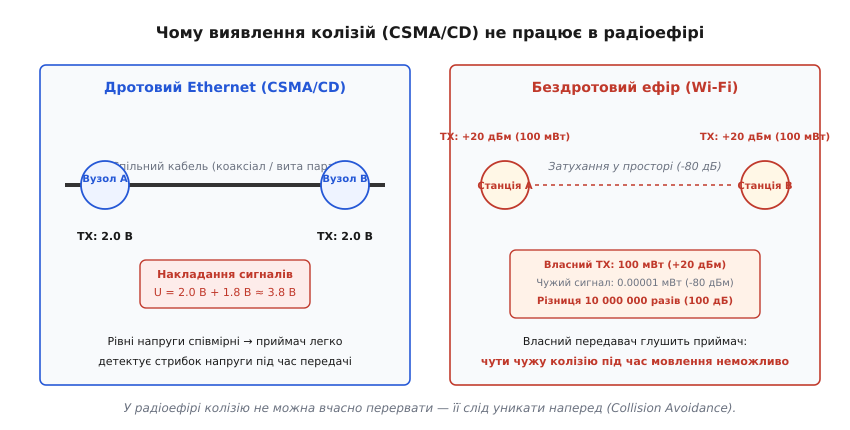
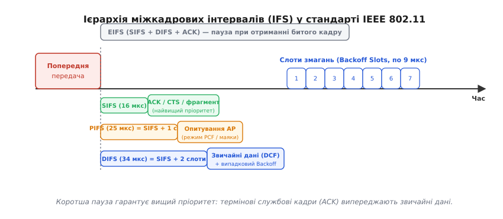
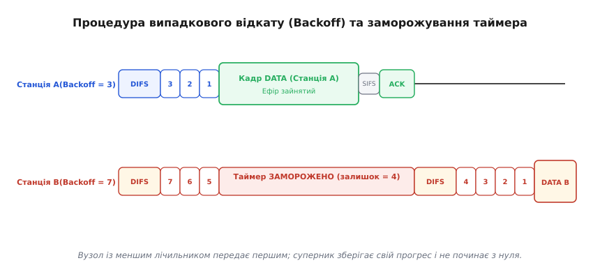
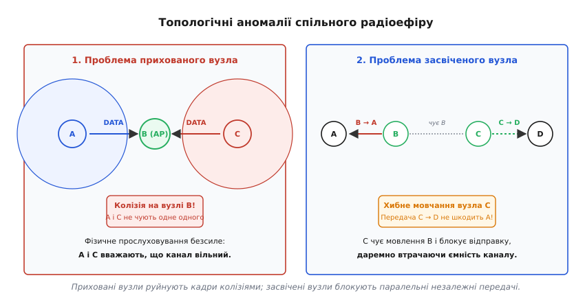
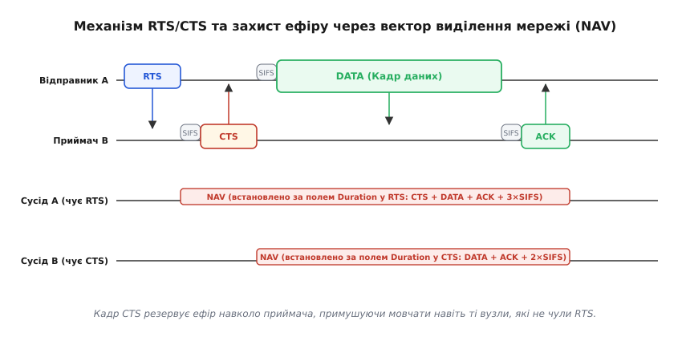

# CSMA/CA: уникнення колізій у спільному ефірі

<preknowlist>
- [Кадр Ethernet](book:communications/ethernet-frame) — структура кадру L2, MAC-адресація та виявлення колізій у дроті.
- [Wi-Fi](book:communications/wifi) — топологія мереж 802.11, роль точки доступу та радіоканали.
</preknowlist>

Коли дві радіостанції починають випромінювати сигнал на одній несучій частоті в радіусі дії спільного приймача, їхні електромагнітні коливання складаються у просторі. Приймач фіксує нерозбірливу суміш хвиль, контрольна сума кадру руйнується, і передані дані втрачаються. У класичному дротовому Ethernet цю проблему розв'язував механізм [CSMA/CD](book:communications/csma-cd) (Carrier Sense Multiple Access with Collision Detection): станція під час передачі безперервно вимірювала напругу в мідному кабелі, і щойно потенціал подвоювався через накладання чужого сигналу, негайно припиняла мовлення. Проте спроба перенести цей підхід у радіозв'язок натрапляє на нездоланні фізичні закони розповсюдження електромагнітних хвиль та обмеження динамічного діапазону трансиверів.

У радіоефірі виявити зіткнення під час власної передачі апаратно неможливо. Вихідний каскад передавача станції генерує в антену потужність порядку +20 дБм (100 мВт). Водночас корисний сигнал від сусіднього абонента, подолавши відстань у кілька десятків метрів крізь повітря та стіни, затухає відповідно до закону обернених квадратів і приходить на вхід приймача з потужністю від -70 до -90 дБм (від 100 піковатів до 1 піковата). Різниця рівнів потужності між власним передавачем і чужим вхідним сигналом сягає від 80 до 110 дБ — тобто від 100 мільйонів до 100 мільярдів разів. Власний передавач миттєво перевантажує та засліплює чутливий малошумний підсилювач (LNA) приймального тракту, що працює на тій самій антені чи поруч із нею.

Оскільки станція не здатна почути чужий сигнал на тлі власного мовлення, вона не може вчасно виявити колізію й перервати передачу зіпсованого кадру. Будь-яке зіткнення призводить до того, що довгий пакет передається до самого кінця, марнуючи пропускну здатність каналу. Більше того, через просторове затухання два абоненти можуть узагалі не чути один одного, перебуваючи поза зоною взаємної досяжності, але одночасно створювати заваду для центральної точки доступу. Тому бездротові мережі стандарту IEEE 802.11 (Wi-Fi) змушені були змінити парадигму: замість виявлення колізій у процесі мовлення вони будують доступ на їх **запобіганні та уникненні** — протоколі **CSMA/CA** (*Carrier Sense Multiple Access with Collision Avoidance* — множинний доступ із контролем несучої та уникненням колізій).


*У мідному дроті напруги сигналів співмірні, тому приймач миттєво фіксує подвоєння амплітуди й зупиняє передачу. У радіоефірі власний передавач потужністю 100 мВт засліплює приймач, який очікує чужий сигнал на рівні часток нановата, роблячи одночасне слухання неможливим.*

### Подвійний контроль несучої: фізичний та віртуальний

Щоб мінімізувати ймовірність виходу в ефір у той момент, коли канал уже зайнятий іншим вузлом, протокол CSMA/CA реалізує багаторівневий механізм прослуховування середовища (Carrier Sensing). Він складається з двох незалежних компонентів, що доповнюють один одного: фізичного контролю каналу на апаратному рівні та віртуального таймера на канальному рівні.

**Фізичне прослуховування несучої (Physical Carrier Sensing)** виконується апаратним блоком фізичного рівня PHY за допомогою процедури оцінки зайнятості каналу (Clear Channel Assessment, CCA). Фізичний рівень використовує два методи детекції:
1. *Виявлення енергії (Energy Detection, ED)*: приймач вимірює сумарну радіочастотну потужність у смузі каналу без спроби розкодувати структуру сигналу. Якщо виміряна потужність перевищує поріг (типово -62 дБм для сторонніх не-Wi-Fi джерел, таких як мікрохвильові печі чи Bluetooth), канал вважається фізично зайнятим.
2. *Виявлення преамбули та несучої (Carrier Sense / Preamble Detection, CS)*: приймач аналізує сигнал на наявність відомих синхронізаційних послідовностей (преамбул) кадрів 802.11. Цей метод значно чутливіший і спрацьовує при рівнях сигналу від -82 до -85 дБм, дозволяючи зафіксувати передачу навіть віддаленого або слабкого Wi-Fi передавача.

**Віртуальне прослуховування несучої (Virtual Carrier Sensing)** реалізується на канальному рівні MAC за допомогою внутрішнього таймера, який називається **вектором виділення мережі (Network Allocation Vector, NAV)**. 

Кожен кадр 802.11 містить у своєму службовому заголовку 16-бітне поле `Duration/ID`. Станція, яка починає транзакцію, записує в це поле точний час у мікросекундах, протягом якого ефір буде потрібен їй для завершення повної передачі даних, включаючи всі необхідні міжкадрові паузи та очікувану квитанцію підтвердження (ACK). Будь-яка станція, що почула цей заголовок і не є адресатом кадру, вичитує значення поля `Duration` і встановлює свій лічильник NAV на відповідний час. Доки таймер NAV веде зворотний відлік до нуля, станція вважає ефір віртуально зайнятим і не робить жодних спроб передачі, навіть якщо апаратний блок CCA показує повну фізичну тишу в антені.

Канал вважається вільним для станції лише за одночасного виконання двох умов: фізичний рівень фіксує відсутність сигналу (CCA = IDLE), а віртуальний таймер обнулився (NAV = 0).

### Ієрархія міжкадрових інтервалів (IFS)

У спільній бездротовій мережі різні типи повідомлень мають різну критичність: наприклад, службова квитанція підтвердження (ACK), на яку чекає відправник після успішного прийому даних, повинна мати безумовну перевагу над спробою іншого клієнта надіслати свій новий довгий кадр. Якщо змусити ACK змагатися за ефір на загальних підставах, він може зазнати затримки або колізії, що призведе до хибного тайм-ауту та марної повторної відправки вже отриманого кадру.

Для розв'язання цієї задачі стандарт IEEE 802.11 вводить детерміновану систему пріоритетів через **міжкадрові інтервали (Interframe Spaces, IFS)** — обов'язкові паузи фіксованої тривалості, які станція мусить витримати після звільнення ефіру, перш ніж виконати будь-яку дію. Чим коротший інтервал призначено для типу повідомлення, тим швидше станція виходить в ефір, автоматично випереджаючи менш пріоритетних учасників.


*Коротший міжкадровий інтервал забезпечує вищий пріоритет у доступі до ефіру. Термінові квитанції ACK та дозволи CTS виходять через інтервал SIFS, випереджаючи кадри даних, які змушені чекати повний інтервал DIFS та випадковий Backoff.*

Стандарт визначає чотири базові міжкадрові інтервали:

1. **SIFS (Short Interframe Space)** — найкоротший міжкадровий інтервал (10 мкс у діапазоні 2.4 ГГц, 16 мкс у діапазоні 5 ГГц). Він забезпечує найвищий абсолютний пріоритет і використовується виключно для невідкладних відповідей у межах поточної транзакції: кадрів підтвердження прийому `ACK`, дозволів на передачу `CTS` та послідовних фрагментів одного довгого кадру. Оскільки жоден інший вузол не має права виходити в ефір раніше за тривалість SIFS, станція-адресат гарантовано захоплює канал для надсилання ACK без ризику колізії.

2. **PIFS (Point Coordination Function Interframe Space)** — інтервал точкової координації, тривалість якого дорівнює `SIFS + 1 слот часу` (25 мкс для 802.11a/n/ac на 5 ГГц). Він зарезервований для точки доступу (AP), коли вона працює в централізованому режимі беззмагального опитування клієнтів (Point Coordination Function, PCF) або транслює критичні керуючі маякові кадри (Beacon frames). Точка доступу чекає менше за звичайних клієнтів і може перехопити керування ефіром у будь-який момент.

3. **DIFS (Distributed Coordination Function Interframe Space)** — інтервал розподіленої координації, який використовується за замовчуванням для передачі звичайних кадрів даних та керуючих повідомлень у режимі змагання (DCF). Тривалість DIFS дорівнює `SIFS + 2 слоти часу` (34 мкс для OFDM на 5 ГГц). Будь-яка станція, що бажає передати новий пакет даних, повинна переконатися, що канал залишався безперервно вільним протягом щонайменше інтервалу DIFS.

4. **EIFS (Extended Interframe Space)** — розширений захисний інтервал значно більшої тривалості (типово від 90 до 360 мкс). Станція переходить на інтервал EIFS замість DIFS у тому випадку, коли вона прийняла з ефіру пошкоджений кадр (не пройшла перевірка контрольної суми CRC/FCS або збійнула преамбула). Оскільки заголовок був спотворений, станція не змогла прочитати поле `Duration` і не знає коректного значення таймера NAV. EIFS надає іншим станціям достатньо часу, щоб завершити передачу очікуваного кадру ACK або CTS, перш ніж вузол із пошкодженим кадровим контекстом знову спробує втрутитися в ефір.

Ця багаторівнева структура створює жорстку координацію: першими відповідають учасники розпочатого діалогу (через SIFS), за ними йде точка доступу (через PIFS), далі допускаються звичайні дані (через DIFS), а станції з помилками прийому примусово затримуються (через EIFS).

### Процедура випадкового експоненційного відкату (Binary Exponential Backoff)

Витримка інтервалу DIFS є необхідною, але недостатньою умовою для безпечного виходу в ефір. Розглянемо типову ситуацію: одна станція передає довгий пакет, і в цей час ще три станції в мережі отримують від своїх операційних систем пакети для відправки. Усі три станції слухають ефір, бачать, що він зайнятий, і терпляче чекають його звільнення.

Щойно передача завершується, усі три станції одночасно відраховують інтервал DIFS. Оскільки ефір залишався чистим протягом DIFS для всіх трьох учасників одночасно, без додаткового механізму всі три станції вийшли б в ефір у першу ж мікросекунду після закінчення DIFS. Результатом була б 100% гарантована колізія всіх трьох пакетів.

Щоб запобігти синхронному зіткненню пакетів, що накопичилися під час передачі, стандарт CSMA/CA запроваджує процедуру **випадкового відкату (Backoff)** на основі дискретних часових слотів (`aSlotTime`, що становить 9 мкс у сучасних стандартах OFDM).


*Після паузи DIFS станції ведуть зворотний відлік випадкових слотів. Станція A з меншим лічильником починає передачу першою. Станція B під час чужого мовлення заморожує свій таймер на залишку (4 слоти) і продовжує відлік після завершення передачі та нової паузи DIFS.*

Процедура відкату функціонує за чітким алгоритмом:

1. **Вибір випадкового лічильника**: кожна станція обирає псевдовипадкове ціле число слотів затримки `Backoff` із рівномірного розподілу на інтервалі `[0, CW]`, де `CW` — поточний розмір вікна змагань (Contention Window):
   ```
   Backoff = Random(0, CW)
   ```
   Для нової передачі розмір вікна встановлюється у мінімальне значення `CWmin` (наприклад, 15 для 802.11a/g/n/ac/ax або 31 для 802.11b).

2. **Зворотний відлік у вільних слотах**: після витримки обов'язкового інтервалу DIFS станція починає слухати ефір слот за слотом. Якщо протягом чергового слоту тривалістю 9 мкс канал залишається фізично та віртуально вільним, станція зменшує свій лічильник на одиницю:
   ```
   Backoff = Backoff - 1
   ```

3. **Заморожування таймера (Backoff Freeze)**: якщо під час зворотного відліку якась інша станція (у якої згенерований лічильник виявився меншим) обнуляє свій таймер і починає передачу, ефір стає зайнятим. Усі інші станції негайно **заморожують** свої лічильники відкату на поточному значенні. Коли чужа передача завершується і канал знову звільняється, станції вичікують обов'язковий інтервал DIFS і відновлюють зворотний відлік із того значення, на якому вони зупинилися. Станція, яка вже витримала частину затримки, зберігає свою перевагу й не починає процедуру з нуля.

4. **Вихід в ефір**: станція отримує ексклюзивне право розпочати передачу свого кадру в той момент, коли її лічильник відкату сягає нуля (`Backoff = 0`).

5. **Підтвердження та реакція на колізію**: якщо передача пройшла успішно і станція вчасно отримала кадр `ACK` через інтервал SIFS, передача вважається завершеною. Вікно змагань скидається до мінімуму `CW = CWmin`, а лічильник повторних спроб обнуляється.

Якщо ж два або більше вузли випадково згенерували однакове найменше значення лічильника (наприклад, обидва обрали `Backoff = 2`), вони одночасно вийдуть в ефір і їхні кадри зазнають колізії на приймачі. Приймач не зможе розкодувати пошкоджений кадр і не надішле квитанцію `ACK`.

Не отримавши ACK протягом очікуваного тайм-ауту (`ACK_Timeout`), кожен відправник констатує втрату кадру і запускає алгоритм **двійкового експоненційного збільшення вікна (Binary Exponential Backoff)**. Розмір вікна подвоюється за правилом:
```
CW = min(CWmax, (CW + 1) · 2 - 1)
```

Вікно змагань послідовно проходить значення `15 → 31 → 63 → 127 → 255 → 511 → 1023` (де 1023 — максимальна межа `CWmax`). Станції генерують новий випадковий відкат із ширшого діапазону, що різко зменшує ймовірність повторного одночасного вибору однакового числа. Якщо після максимальної кількості спроб (типово `dot11ShortRetryLimit = 7`) кадр так і не вдалося доставити, він відкидається канальним рівнем із фіксацією помилки.

Математичне обґрунтування цієї моделі та розрахунок пропускної здатності каналу за методом Маркова наведено у вставці [математичний розрахунок імовірності колізій та оптимуму вікна Б'янкі](book:communications/csma-ca/math-backoff-throughput.md).

### Топологічні аномалії: прихований та засвічений вузли

У замкненому коаксіальному дроті сигнал однакової потужності гарантовано доходить до всіх учасників сегмента. На противагу цьому, бездротове середовище характеризується просторовою неоднорідністю: радіус дії антени кожного вузла обмежений, а фізичні перешкоди створюють зони радіотіні. Це породжує дві класичні топологічні проблеми, за яких звичайне прослуховування несучої виявляється неефективним або шкідливим.


*Зліва: станції A і C не чують випромінювання одна одної через відстань або перешкоду, але обидві передають до точки B, спричиняючи колізію. Справа: станція C чує передачу B до A і хибно блокує свою незалежну передачу до D, втрачаючи ємність ефіру.*

#### 1. Проблема прихованого вузла (Hidden Node Problem)

Розглянемо топологію `A — B — C`, де центральним вузлом є точка доступу `B`, а клієнти `A` і `C` розташовані по різні боки від неї. Відстань між `A` і `C` перевищує радіус дії їхніх антен, тому вони не чують радіосигналів один одного.

Коли станція `A` передає пакет до `B`, станція `C` також вирішує надіслати свій пакет до `B`. Вузол `C` виконує фізичне прослуховування каналу: в антені `C` фіксується повна тиша, оскільки випромінювання від `A` сюди не доходить. Станція `C` робить хибний висновок, що ефір вільний, і починає передачу. На антені точки доступу `B` сигнали від `A` і `C` накладаються, викликаючи руйнівну колізію.

Приховані вузли роблять фізичне прослуховування несучої безсилим: станції добросовісно слухають ефір перед передачею, але колізії все одно відбуваються на стороні приймача. У завантажених мережах зі значною часткою прихованих вузлів пропускна здатність може деградувати до рівня класичної чистої ALOHA (менше 20% від номіналу).

#### 2. Проблема засвіченого вузла (Exposed Node Problem)

Проблема засвіченого вузла є дзеркальною протилежністю попередньої й виникає за топології чотирьох вузлів у лінію: `A ← B` і `C → D`. Вузол `B` передає дані станції `A`. Вузол `C`, розташований поруч із `B`, чує передачу сусіда. Водночас вузол `C` має пакет для станції `D`, яка розташована праворуч і знаходиться далеко за межами зони радіодосяжності вузлів `A` та `B`.

Коли `C` виконує прослуховування каналу, його апаратний блок CCA виявляє високий рівень енергії від передавача `B`. Станція `C` вважає канал зайнятим і блокує власну відправку. Проте передача від `C` до `D` жодним чином не могла б завадити прийому кадру на станції `A`, оскільки `A` знаходиться поза зоною впливу `C`. Станція `C` змушена мовчати даремно, що призводить до втрати пропускної здатності та невиправданих затримок черги.

### Ефект захоплення сигналу (Capture Effect)

У реальному ефірі колізія двох сигналів не завжди закінчується взаємним знищенням обох кадрів. Якщо одна зі станцій знаходиться набагато ближче до приймача, ніж її конкурент, потужність її сигналу в точці прийому може виявитися значно вищою.

Якщо різниця потужностей перевищує поріг захоплення (Capture Threshold, зазвичай 3–6 дБ для сучасних приймачів OFDM), приймальний тракт успішно синхронізується з преамбулою сильнішого сигналу й розкодовує його корисне навантаження без помилок, сприймаючи слабший сигнал просто як додатковий тепловий шум. Це явище називається **ефектом захоплення (Capture Effect)**.

Хоча ефект захоплення рятує частину пакетів від втрати, він створює серйозну системну асиметрію: близькі до точки доступу клієнти отримують несправедливу перевагу, а віддалені вузли постійно зазнають колізій, входять у глибокий експоненційний відкат і втрачають зв'язок.

### Механізм RTS/CTS та віртуальне резервування каналу

Для боротьби з проблемою прихованого вузла стандарт 802.11 запроваджує додатковий протокольний механізм — чотириетапний обмін службовими кадрами **RTS/CTS (Request to Send / Clear to Send)**. Цей підхід був розроблений інженером Філом Карном у протоколі MACA (детальніше — [як змагання перейшло від чистого радіоефіру ALOHA до рукостискання MACA](book:communications/csma-ca/hist-maca-80211.md)).


*Станція A надсилає короткий запит RTS, а приймач B відповідає дозволом CTS. Усі вузли в радіусі дії приймача B (включаючи приховані) вичитують поле тривалості з кадру CTS і блокують власні передачі через таймер NAV.*

Процедура захисту розгортається за такими етапами:

1. **Запит на передачу (RTS)**: замість довгого кадру даних станція `A` після виграшу процедури змагання надсилає крихітний службовий кадр `RTS` (20 байтів). У полі `Duration` відправник вказує час, необхідний для передачі кадру відповіді CTS, основного тіла даних, квитанції ACK та трьох міжкадрових пауз SIFS:
   ```
   Duration_RTS = SIFS + T(CTS) + SIFS + T(DATA) + SIFS + T(ACK)
   ```
   Усі сусіди відправника `A`, почувши RTS, оновлюють свій таймер NAV і блокують ефір.

2. **Дозвіл на передачу (CTS)**: цільовий приймач `B` через інтервал SIFS відповідає коротким службовим кадром `CTS` (14 байтів). У полі `Duration` приймач дублює залишкову тривалість:
   ```
   Duration_CTS = Duration_RTS - SIFS - T(CTS)
   ```
   Кадр CTS лунає в радіусі антени `B` і досягає всіх прихованих вузлів (включаючи станцію `C`). Почувши CTS, вузол `C` дізнається, що поруч із ним зараз відбуватиметься прийом даних, і виставляє свій таймер NAV на вказаний час. Прихований вузол примусово замовкає, створюючи «зону радіотиші» навколо приймача.

3. **Передача даних (DATA)**: отримавши дозвіл CTS, станція `A` через інтервал SIFS передає свій основний кадр даних. Прихований вузол `C` не намагається вийти в ефір, оскільки його таймер NAV заблокований.

4. **Підтвердження (ACK)**: успішно прийнявши дані, точка `B` через інтервал SIFS повертає кадр підтвердження `ACK`, завершуючи сеанс.

Якщо два вузли одночасно надішлють запити RTS до одного приймача, вони зіткнуться. Проте колізія 20-байтного кадру RTS блокує ефір лише на частки мікросекунди, тоді як колізія повнорозмірного кадру даних на 1500 байтів марнувала б у сотні разів більше часу.

Точну двійкову структуру полів, бітові прапорці Frame Control та правила розрахунку тривалості NAV наведено у довіднику [поля заголовків 802.11, біти Frame Control і формат кадру RTS/CTS](book:communications/csma-ca/api-frame-control-nav.md).

#### Поріг RTS (RTS Threshold)

Механізм RTS/CTS не є безкоштовним: додавання двох службових кадрів та додаткових пауз SIFS створює накладні витрати часу каналу. Якщо корисний кадр даних має малий розмір (наприклад, TCP ACK на 40 байтів чи DNS-запит), час на передачу преамбул та кадрів RTS/CTS у кілька разів перевищує час передачі самого пакета.

Тому стандарт передбачає адаптивний параметр конфігурації — **поріг RTS (RTS Threshold)**:
- Якщо розмір кадру перевищує встановлений поріг (`Frame_Size > RTS_Threshold`), станція обов'язково виконує рукостискання RTS/CTS перед відправкою.
- Якщо розмір кадру менший за поріг (`Frame_Size ≤ RTS_Threshold`), кадр надсилається безпосередньо за базовою процедурою CSMA/CA (Basic Access).

За замовчуванням у більшості операційних систем та драйверів поріг RTS вимкнено або встановлено у максимальне значення (2347 байтів). Його ручне зменшення (наприклад, до 500–1000 байтів) є потужним інструментом оптимізації в середовищах із високим рівнем колізій та наявністю прихованих вузлів.

### Пріоритезація трафіку: від DCF до EDCA (WMM / 802.11e)

Базовий протокол DCF забезпечує абсолютно рівні права всім типам трафіку. Для передачі файлу та критичного голосового пакету VoIP застосовувалися однакові інтервали DIFS та однакове вікно змагань `CWmin = 15`. Це робило неможливим гарантування якості обслуговування (QoS) у навантажених мережах.

Стандарт **IEEE 802.11e (Wi-Fi Multimedia, WMM)** вдосконалив процедуру CSMA/CA, ввівши механізм **розширеного розподіленого доступу до каналу (Enhanced Distributed Channel Access, EDCA)**. 

Трафік поділяється на чотири категорії доступу (Access Categories, AC):
1. **Голос (`AC_VO`)**: найвищий пріоритет (мінімальна затримка).
2. **Відео (`AC_VI`)**: високий пріоритет.
3. **Звичайні дані (`AC_BE`, Best Effort)**: стандартний інтернет-трафік.
4. **Фоновий трафік (`AC_BK`, Background)**: низькопріоритетні завантаження.

Кожна категорія отримує власний набір параметрів CSMA/CA:
- Замість єдиного DIFS використовується адаптивний інтервал **AIFS[AC]** (*Arbitration Interframe Space*), де `AIFS[AC] = SIFS + AIFSN[AC] · aSlotTime`. Для голосу `AIFSN = 2` (еквівалентно DIFS), а для фонового трафіку `AIFSN = 7`.
- Категорії з високим пріоритетом мають значно менші вікна змагань: для `AC_VO` вікно стартує з `CWmin = 3` і сягає максимуму `CWmax = 7`, тоді як для `AC_BK` вікно змінюється від 15 до 1023.
- Станція, що виграла змагання для черги `AC_VO` або `AC_VI`, отримує право безперервної передачі пачки кадрів протягом фіксованого кванту часу — **вікна передачі (Transmission Opportunity, TXOP)**, не запускаючи нових раундів відкату для кожного пакета.

### Сучасні оптимізації: агрегація кадрів та Block ACK

У міру зростання фізичних швидкостей Wi-Fi (від 11 Мбіт/с у 802.11b до сотень і тисяч мегабіт у 802.11n, 802.11ac та 802.11ax) накладні витрати протоколу CSMA/CA стали головним «пляшковим горлом» мережі. 

Час, який витрачається на паузу DIFS, зворотний відлік слотів Backoff, фізичні преамбули PHY та очікування ACK, є фіксованим і не зменшується від підвищення швидкості модуляції. Якби кожен окремий пакет на швидкості 1 Гбіт/с вимагав власної повної процедури змагання CSMA/CA та індивідуального ACK, реальна корисна пропускна здатність каналу становила б менше 15–20% від фізичної швидкості лінка.

Для подолання цієї межі стандарт IEEE 802.11n запровадив фундаментальну оптимізацію:
1. **Агрегація кадрів (A-MPDU)**: станція виборює право на ефір один-єдиний раз за повною процедурою CSMA/CA, після чого передає суцільною пачкою (Burst) до 64 або 256 об'єднаних кадрів даних загальним обсягом до кількох десятків чи сотень кілобайтів.
2. **Групове підтвердження (Block ACK)**: замість надсилання окремого кадру ACK на кожен отриманий пакет приймач відповідає єдиним службовим кадром `BlockAck`. Цей кадр містить 64-бітну бітову маску (Bitmap), де кожен біт сигналізує успішний прийом або втрату відповідного фрагмента пачки. Якщо окремі кадри пачки пошкоджено завадою, відправник повторно передає лише відсутні фрагменти під час наступного раунду.

Завдяки агрегації та груповому підтвердженню накладні витрати процедури змагання CSMA/CA розподіляються між десятками пакетів, що дозволяє сучасним стандартам утилізувати понад 80% фізичної ємності гігабітного ефіру.

Як працюють алгоритми відкату та заморожування в програмному коді симулятора змагань, можна дослідити у вставці [дискретно-подійна модель CSMA/CA та вимірювання затримок у коді](book:communications/csma-ca/proj-csma-simulator.md).

> 🔧 **Навіщо це.** Якщо бездротова мережа демонструє високий відсоток втрати пакетів (Retry Rate > 20%) і низьку швидкість за відсутності видимих сторонніх радіозавад, головною причиною зазвичай є колізії через приховані вузли. Це типово для великих приміщень із залізобетонними колонами або довгих коридорів. 
> 
> Утиліта діагностики драйвера бездротової карти (наприклад, `iw`, `wavemon` у Linux або профілювальник точки доступу) дозволяє побачити частку повторних передач. Увімкнення механізму RTS/CTS шляхом зниження порогу `rts_threshold` (наприклад, `iw wlan0 set rts 1000`) змушує клієнтів резервувати ефір службовими кадрами, миттєво ліквідуючи колізії від прихованих вузлів та стабілізуючи затримку (jitter) для чутливого трафіку реального часу.
