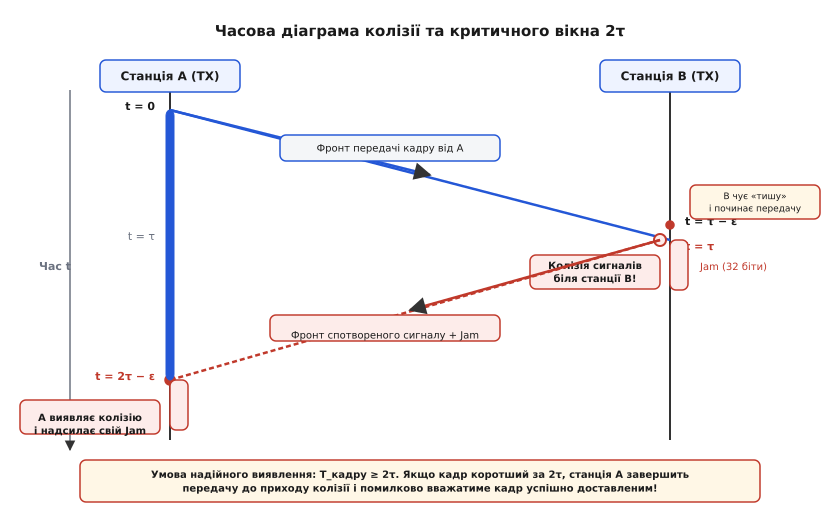
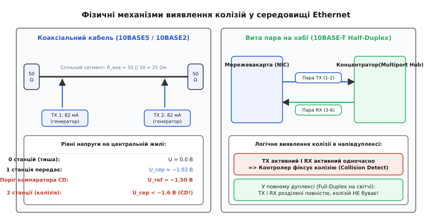
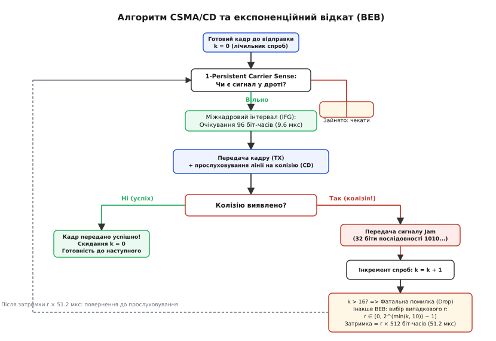
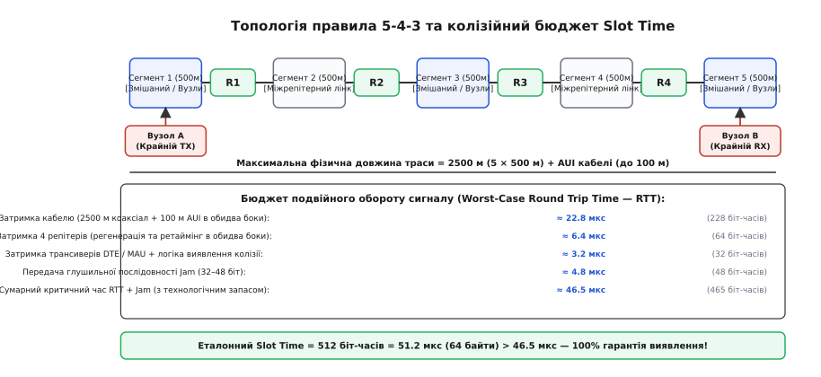

# CSMA/CD: колізії у спільному дроті Ethernet

<preknowlist>
- [Кадр Ethernet](book:communications/ethernet-frame) — структура кадру L2, преамбула, адресація MAC та контрольна сума CRC32.
- [Фізика лінка](book:communications/ethernet-link-phy) — передача електричних імпульсів, манчестерське кодування та затримка поширення сигналу в мідному провіднику.
- [Контрольна сума CRC](book:communications/crc) — виявлення спотворень переданих бітів на канальному рівні.
</preknowlist>

Коли два комп'ютери, з'єднані одним коаксіальним кабелем довжиною 500 метрів, одночасно випромінюють електричні імпульси, їхні сигнали неминуче стикаються посеред провідника. Електромагнітна хвиля поширюється в мідній жилі зі скінченною швидкістю близько 200 000 кілометрів на секунду, тому затримка проходження сигналу від одного кінця сегмента до іншого становить близько 2.5 мікросекунди. Якщо вузол починає передачу, коли лінія здається йому цілком порожньою, він не здатний миттєво дізнатися, що з протилежного кінця дроту назустріч уже мчить чужий електричний фронт. Без спеціального протокольного арбітражу обидва пакети накладуться, амплітуди напруг спотворяться, контрольні суми знеціняться, а корисні дані будуть безповоротно втрачені без сповіщення відправників.

Для розв'язання цієї проблеми в класичному напівдуплексному Ethernet було розроблено метод множинного доступу з контролем несучої та виявленням колізій — **CSMA/CD** (англ. *Carrier Sense Multiple Access with Collision Detection*, від лат. *gestare* / фр. *porteur* — носій, *sentire* — відчувати, *multiplus* — множинний, *accedere* — наближатися, та лат. *collisio* — зіткнення, *detegere* — розкривати). Цей механізм перетворює випадковий спільний провідник на саморегульоване середовище передачі, де колізія є не катастрофічною аварією, а штатним сигналом зворотного зв'язку для децентралізованого розведення потоків у часі.

Детальний аналіз того, як ця концепція виросла з перших експериментів гавайської радіомережі та лабораторій Xerox PARC, викладено в [історичному розвитку від радіоефіру ALOHANET до коаксіального Ethernet](book:communications/csma-cd/hist-ethernet-origins.md).

---

## Фізична природа спільного середовища та вразливе вікно поширення

У ранніх топологіях Ethernet 10BASE5 («товстий коаксіал») та 10BASE2 («тонкий коаксіал») усі комп'ютери під'єднувалися до єдиного відрізка коаксіального кабелю з хвильовим опором 50 Ом. Кабель був пасивним середовищем: будь-який електричний струм, поданий трансивером однієї станції, створював хвилю напруги, що бігла в обидва боки лінії й поглиналася кінцевими 50-омними резисторами-термінаторами.

Головна фізична складова доступу — **скінченна швидкість світла в діелектрику**. У коаксіальному кабелі зі спіненим поліетиленом сигнал поширюється зі швидкістю `v ≈ 0.77c ≈ 231 000 км/с`, що дає питому затримку близько `4.33 нс` на кожен метр дистанції.

Нехай станція `A` на лівому кінці кабелю починає передавати кадр у момент часу `t = 0`. Вона прослуховує кабель (Carrier Sense), фіксує відсутність сторонньої напруги й запускає передавач. Хвиля напруги поширюється праворуч до станції `B`, розташованої на відстані `L`, досягаючи її через час `τ = L / v`.

Припустимо, що станція `B` також накопичила дані для відправки і перевіряє стан шини за мить до прибуття фронту сигналу від `A` — у момент `t = τ − ε` (де `ε` — мізерна частка мікросекунди). Оскільки фронт хвилі від `A` ще не досяг точки підключення `B`, станція `B` фіксує «тишу» на лінії й також починає передачу.


*Часова розгортка виявлення колізії між двома віддаленими станціями: передавач A зобов'язаний утримувати передачу щонайменше протягом інтервалу подвійного обороту 2τ, щоб гарантовано зафіксувати відбитий сигнал спотворення.*

У момент часу `t = τ` сигнали від `A` та `B` стикаються біля станції `B`. Напруга на центральній жилі подвоюється, виникає електрична колізія. Станція `B` детектує спотворення практично миттєво (оскільки перебуває в епіцентрі зіткнення), зупиняє передачу кадру й випромінює в лінію спеціальний сигнал глушіння (Jam).

Однак станція `A` в цей момент ще нічого не підозрює: вона продовжує передавати свій кадр. Хвиля спотвореного сигналу разом із сигналом Jam повинна пройти весь зворотний шлях від `B` до `A`, на що піде ще один часовий інтервал `τ`.

Станція `A` дізнається про факт колізії лише в момент часу:

```
t_detect = (τ − ε) + τ = 2τ − ε ≈ 2τ
```

Цей подвійний інтервал `2τ` називається **часом подвійного обороту** (англ. *Round-Trip Time*, RTT), або **колізійним вікном**. Це найгірший теоретичний час, протягом якого станція-відправник перебуває в стані невизначеності.

### Золоте правило CSMA/CD

Якщо розмір кадру буде занадто малим, станція `A` встигне повністю передати всі його байти в лінію за час `T_frame < 2τ`, очистить свій передавальний буфер і вважатиме доставку успішною. Зворотна хвиля колізії прийде до станції `A` вже **після** завершення передачі. У результаті станція-відправник не дізнається про втрату, а станція-отримувач відкине спотворений пакет через невідповідність контрольної суми CRC32.

Звідси випливає фундаментальний інваріант правильного функціонування мережі:

```
T_frame_min ≥ 2τ_max + T_jam + T_phy
```

Тривалість передачі навіть найкоротшого кадру повинна строго перевищувати максимальний час подвійного пробігу сигналу по всій довжині мережі з урахуванням реакції трансиверів та передачі глушильного сигналу.

---

## Схемотехніка виявлення колізій: коаксіал проти витої пари

Механізм виявлення колізій (Collision Detection) принципово відрізняється залежно від фізичного середовища передачі сигналів.

### Коаксіальний кабель (10BASE5 та 10BASE2)

У коаксіальних мережах виявлення колізій реалізовано за допомогою аналогового вимірювання середнього рівня постійної напруги на центральній жилі кабелю.

Еквівалентна схема коаксіального сегмента являє собою довгу лінію, навантажену з обох кінців узгоджувальними термінаторами по 50 Ом. Для постійного струму два паралельні термінатори дають еквівалентний опір лінії:

```
R_eq = (50 · 50) / (50 + 50) = 25 Ом
```

Трансивер кожної мережевої карти (Medium Attachment Unit, MAU) містить джерело стабільного струму, яке під час передачі манчестерського коду комутує в кабель струм величиною `82 мА` (номінальний діапазон 81–83 мА).


*Фізичні механізми фіксації колізій: зліва — просідання постійної напруги в коаксіалі нижче порогу -1.5 В при паралельній роботі двох генераторів струму 82 мА; справа — логічне виявлення одночасної активності пар TX та RX у напівдуплексному концентраторі 10BASE-T.*

Розрахуємо потенціали на центральній жилі відносно заземленого екрана:
1. **Лінія вільна (0 передавачів):**
   Струм відсутній, напруга на кабелі `U = 0.0 В`.
2. **Передає одна станція:**
   Струм `82 мА`, проходячи через еквівалентний опір `25 Ом`, створює розмах сигналу `2.05 В` (від `0.0 В` до `−2.05 В`). Завдяки властивостям манчестерського кодування, де кожен біт має обов'язковий перепад посередині такту (50% часу рівень низький, 50% — високий), середня постійна складова напруги на центральній жилі становить:
   `U_сер ≈ −1.02 В`.
3. **Передають дві станції одночасно (колізія):**
   Два незалежні трансивери закачують у кабель сумарний струм `2 × 82 мА = 164 мА`. Напруга на опорі 25 Ом опускається до розмаху `−4.1 В`, а постійна складова просідає нижче `−1.6 В` (типово від `−1.8 В` до `−2.05 В`).

Усередині кожного трансивера MAU встановлено аналоговий компаратор із джерелом опорної напруги `U_ref = −1.50 В`.
- Якщо напруга в кабелі вища за `−1.5 В` (знаходиться в районі `−1.0 В`), компаратор мовчить: лінія в нормі.
- Щойно напруга падає нижче `−1.5 В`, компаратор негайно спрацьовує й виставляє високочастотний диференціальний сигнал `CD` (Collision Detect, частота 10 МГц) по спускному кабелю AUI до контролера мережевої карти.

Фізичний контакт із товстим коаксіалом у 10BASE5 виконувався за допомогою так званого «вампірного відводу» (Vampire Tap): спеціальний гвинтовий затискач проколював голкою зовнішню ізоляцію та екран, торкаючись центральної жили без розриву кабелю. Якщо лінія втрачала хоча б один кінцевий 50-омний термінатор, опір лінії на постійному струмі зростав з 25 Ом до 50 Ом. У результаті навіть одна працююча станція зі струмом 82 мА просаджувала напругу до `82 мА × 50 Ом = 4.1 В`, що викликало помилкове спрацьовування компаратора колізії на кожному відправленому кадрі й повністю паралізувало роботу всієї мережі.

Для періодичної самоперевірки компаратора колізій стандарт IEEE 802.3 передбачав функцію **SQE Test (Signal Quality Error Test)**, або **Heartbeat**: після кожного успішно надісланого кадру трансивер на короткий момент (близько 1 мкс) активував сигнальну пару CD у кабелі AUI. Це дозволяло мережевому адаптеру переконатися, що лінія сигналізації колізій залишається непошкодженою.

### Вита пара в напівдуплексі (10BASE-T на концентраторах)

У мережах на неекранованій витій парі (UTP) пряме аналогове додавання напруг у спільний провідник неможливе, оскільки кабель містить окремі фізичні кручені пари для передачі (контакти 1–2, пара `TX+`/`TX-`) та для прийому (контакти 3–6, пара `RX+`/`RX-`).

Усі комп'ютери підключалися до центрального багатопортового повторювача — **концентратора (хаба)**. Концентратор всередині містив логіку суматора: сигнал, що надійшов на порт прийому `RX` від одного комп'ютера, транслювався на порти передачі `TX` усіх інших підключених комп'ютерів.

Виявлення колізії в 10BASE-T відбувається за двома паралельними сценаріями:
1. **На боці мережевої карти:** мережевий адаптер працює в напівдуплексному режимі (Half-Duplex). Якщо контролер фіксує наявність вхідного сигналу на приймальній парі `RX` у той самий момент часу, коли його власний передавач активний на парі `TX`, це однозначно свідчить про те, що хаб транслює чужий сигнал одночасно з власним. Контролер фіксує колізію.
2. **На боці концентратора (Hub):** якщо хаб виявляє вхідний сигнал більше ніж на одному вхідному порту одночасно, внутрішній колізійний процесор хаба припиняє ретрансляцію даних і генерує спеціальний сигнал колізії (Jam Pattern) на всі вихідні порти, змушуючи всі станції домену негайно зупинити передачу.

---

## Глушіння каналу (Jam) та алгоритм експоненційного відкату (BEB)

Щойно трансивер мережевої карти виявляє колізію, передавач не може просто миттєво вимкнутися. Якщо передавач обірве сигнал після 1–2 бітів, віддалені станції на іншому кінці довгого кабелю можуть отримати надто короткий сплеск, якого забракне для перезаряджання вхідних ємностей аналогового компаратора, і вони не помітять колізії.

Щоб надійно сповістити весь домен колізій, станція, що зафіксувала зіткнення, випромінює в лінію **глушильну послідовність (Jam Signal)**.

Стандарт IEEE 802.3 визначає довжину Jam-сигналу в **32 біти** (у деяких ранніх реалізаціях до 48 бітів). Зазвичай це чергування бітів `101010...` (або довільний двійковий патерн, головне, щоб він навмисно порушував контрольну суму CRC32). 32 біти на швидкості 10 Мбіт/с тривають `3.2 мікросекунди`. Цього часу з надлишком вистачає, щоб сигнал колізії дійшов до найвіддаленішого трансивера й гарантовано активував його логіку скидання.


*Логіка скінченного автомата CSMA/CD: безперервне прослуховування лінії, міжкадрова пауза IFG, випромінювання сигналу Jam при зіткненні та адаптивне експоненційне розширення вікна затримки BEB.*

### Алгоритм Truncated Binary Exponential Backoff (BEB)

Після відправки Jam-сигналу всі конфліктуючі станції повинні замовкнути й спробувати повторити передачу пізніше. Якщо станції повторять спробу через однаковий фіксований час, вони неминуче зіткнуться знову. Тому затримка повторної спроби обирається випадково за алгоритмом **Truncated Binary Exponential Backoff** (зрізаний двійковий експоненційний відкат):

1. Кожна станція веде внутрішній лічильник невдалих спроб передачі поточного кадру `n` (початкове значення `n = 1` після першої колізії).
2. Станція обчислює показник експоненти:
   `k = min(n, 10)`.
3. Станція генерує випадкове ціле число `r` із рівномірного дискретного розподілу:
   `r ∈ [0, 2^k − 1]`.
4. Час затримки станції перед наступною спробою становить:
   `T_backoff = r × SlotTime = r × 51.2 мкс`.
5. Після витримки часу `T_backoff` станція повертається до прослуховування несучої (1-persistent Carrier Sense): чекає звільнення лінії, витримує обов'язковий міжкадровий інтервал **IFG** (96 біт-часів = 9.6 мкс) і негайно передає кадр.

Тривалість міжкадрового інтервалу IFG (96 біт-часів = 9.6 мкс) вибрана не випадково: вона надає схемотехніці приймачів достатній час для захоплення фази генератора фазового автопідстроювання частоти (PLL), очищення внутрішніх регістрів зсуву та підготовки буферів DMA до прийому наступної 8-байтної преамбули кадру.

Преамбула складається з 7 байтів чергування бітів `10101010` (0xAA) та 1 байта роздільника початку кадру SFD `10101011` (0xAB). Саме комбінація IFG та преамбули дозволяє аналоговому приймачу PHY стабілізувати рівень тактової синхронізації до того, як надійде перший біт адреси призначення.

Простежимо, як змінюється розмір вікна випадкового вибору `W = 2^k` залежно від кількості зіткнень:

- **Спроба 1 (`n = 1`):** `k = 1`, `r ∈ {0, 1}`. Станція вибирає затримку 0 або 51.2 мкс. Ймовірність того, що дві станції виберуть різні слоти, становить 50%.
- **Спроба 2 (`n = 2`):** `k = 2`, `r ∈ {0, 1, 2, 3}`. Діапазон вибору розширюється до 4 слотів (затримка до 153.6 мкс).
- **Спроба 3 (`n = 3`):** `k = 3`, `r ∈ [0, 7]` (8 слотів, затримка до 358.4 мкс).
- **Спроба 10 (`n = 10`):** `k = 10`, `r ∈ [0, 1023]` (1024 слоти, затримка до 52.38 мс).
- **Спроби 11–15:** показник `k` заморожується на значенні 10 (саме тому алгоритм називається *Truncated* — зрізаний). Вікно не росте далі 1024 слотів, щоб затримка не переростала в секунди.
- **Спроба 16:** якщо після 16 послідовних колізій кадр так і не вдалося надіслати, MAC-контролер припиняє спроби, встановлює апаратний прапорець `Excessive Collisions Error`, скидає кадр із черги передавача та сигналізує про помилку операційній системі.

Повний розбір практичної реалізації цього алгоритму разом із дискретно-подійним симулятором доступний у розділі [симуляцію конкурентного доступу та алгоритму BEB на мовах C та C++](book:communications/csma-cd/proj-csma-simulation.md).

---

## Slot Time, мінімальний кадр 64 байти та правило 5-4-3

Ключовим параметром, що пов'язує фізику кабелю з логікою протоколу, є **Slot Time** (часовий слот). У стандарті Ethernet на швидкості 10 Мбіт/с він зафіксований на рівні:

```
SlotTime = 512 біт-часів = 51.2 мікросекунди
```

Щоб зрозуміти, звідки взялася цифра 512 бітів, необхідно проаналізувати граничну конфігурацію мережі за класичним правилом **5-4-3**:


*Гранична топологія колізійного домену 10BASE5 за правилом 5-4-3: сумарний час подвійного пробігу сигналу через п'ять сегментів коаксіалу та чотири репітери разом із сигналом Jam вкладається у 512 біт-часів (51.2 мкс).*

Топологічне правило 5-4-3 встановлювало максимальний дозволений розмір напівдуплексного домену:
- Не більше **5 сегментів** коаксіального кабелю по 500 м кожен (сумарно `2500 м`);
- Не більше **4 повторювачів (репітерів)** між будь-якими двома крайніми станціями;
- Не більше **3 змішаних сегментів** із підключеними робочими станціями (решта 2 сегменти використовувалися суто як міжрепітерні з'єднувальні лінії).

Підсумуємо повний часовий бюджет подвійного пробігу сигналу (RTT) для такої граничної топології:
1. Затримка в 2500 м коаксіального кабелю (в обидва боки): `≈ 21.65 мкс` (216 біт-часів);
2. Затримка у спускних AUI-кабелях (до 100 м сумарно): `≈ 1.01 мкс` (10 біт-часів);
3. Затримка проходження через 4 репітери (ретаймінг і регенерація): `≈ 6.40 мкс` (64 біт-часи);
4. Затримка трансиверів MAU та схем виявлення колізій: `≈ 3.20 мкс` (32 біт-часи);
5. Час випромінювання глушильного сигналу Jam (32 біти): `≈ 3.20 мкс` (32 біт-часи);
6. Інженерний запас на температурні варіації, старіння міді та спотворення преамбули: `≈ 5.70 мкс` (57 біт-часів).

Сумарний критичний час становить:

```
T_crit = 21.65 + 1.01 + 6.40 + 3.20 + 3.20 + 5.70 = 41.16 мкс (≈ 412 біт-часів)
```

Інженери стандарту IEEE 802.3 округлили це значення з надійним запасом до найближчого ступеня двійки — **512 бітів** (`51.2 мкс`).

Повні строгі виведення швидкостей, хвильових рівнянь телеграфістів і часових балансів містяться в [детальному математичному розрахунку затримки RTT та бюджету кабельних сегментів](book:communications/csma-cd/math-slot-time.md).

### Виведення мінімального розміру кадру 64 байти

Знаючи `SlotTime = 512 бітів`, обчислимо мінімальний допустимий розмір кадру Ethernet `L_min`:

```
L_min = 512 бітів / 8 біт/байт = 64 байти
```

Кожен кадр Ethernet на канальному рівні повинен мати довжину не менше 64 байтів (починаючи з MAC-адреси отримувача й закінчуючи контрольною сумою FCS, без урахування 8 байтів преамбули фізичного рівня).

Структура мінімального кадру:
- MAC Destination: 6 байтів;
- MAC Source: 6 байтів;
- EtherType / Length: 2 байти;
- Payload (корисні дані): **мінімум 46 байтів**;
- Frame Check Sequence (CRC32): 4 байти.
- **Разом:** `6 + 6 + 2 + 46 + 4 = 64 байти`.

Якщо прикладній програмі потрібно передати лише 1 байт корисних даних (наприклад, окреме натискання клавіші в сесії Telnet), мережевий адаптер зобов'язаний штучно доповнити поле Payload 45 байтами вирівнювання (Padding, зазвичай нулями), щоб загальна довжина кадру досягла 64 байтів.

Кадри, розмір яких менший за 64 байти, називаються **runt frames** (кадри-карлики). Вони не передаються в стек операційної системи й негайно відкидаються апаратним контролером як уламки колізійного зіткнення.

---

## Крайові аномалії: Late Collisions, Capture Effect та колізійний колапс

У процесі експлуатації напівдуплексних мереж інженери зіткнулися з трьома специфічними аномаліями протоколу CSMA/CD:

### 1. Пізні колізії (Late Collisions)

Звичайна (рання) колізія виникає під час передачі перших 64 байтів кадру. Вона обробляється апаратно за алгоритмом BEB і непомітна для вищих протоколів.

**Пізня колізія (Late Collision)** виникає тоді, коли зіткнення детектується після того, як станція вже передала перші 64 байти (512 бітів) кадру.

Коли контролер передає 65-й байт, він вважає арбітраж шини завершеним і видаляє копію кадру зі свого передавального буфера. Якщо в цей момент надходить сигнал колізії, MAC-контролер:
1. Негайно припиняє передачу;
2. **НЕ** робить повторних спроб відкату (алгоритм BEB для цього кадру більше не застосовується);
3. Встановлює лічильник помилки `Late Collision` у драйвері;
4. Кадр втрачається назавжди на канальному рівні.

Причини пізніх колізій:
- **Перевищення довжини кабелю:** якщо фізична довжина перевищує правило 5-4-3 (наприклад, прокладено 800 м коаксіалу або додано 5-й репітер), колізійне вікно стає більшим за 51.2 мкс;
- **Невідповідність дуплексу (Duplex Mismatch):** якщо один кінець лінка налаштований на Full-Duplex, а інший — на Half-Duplex. Повнодуплексна сторона передає дані в будь-який момент, не слухаючи несучу, і врізається в середину довгого кадру напівдуплексної сторони, породжуючи 100% пізніх колізій.

### 2. Ефект захоплення каналу (Channel Capture Effect)

Алгоритм BEB має приховану математичну асиметрію:
- Станція `A`, яка щойно успішно передала кадр, скидає свій лічильник спроб до `attempts = 0` і має вікно вибору затримки `[0, 1]`.
- Станція `B`, яка зазнала кількох колізій, має `attempts = 3` і вікно вибору `[0, 7]`.

Коли обидві станції знову конкурують за наступний кадр, станція `A` з імовірністю понад 75% обере меншу затримку, знову виграє шину і знову скине свій лічильник до нуля. Станція `B` отримає ще одну колізію й розширить своє вікно до `[0, 15]`. У результаті станція `A` монополізує («захоплює») весь канал, відправляючи сотні пакетів поспіль, тоді як станція `B` зазнає тривалого голодування (Starvation).

### 3. Колізійний колапс (Collision Collapse)

При зростанні навантаження на спільну шину корисна пропускна здатність мережі CSMA/CD поводиться нелінійно:
- При навантаженні до 30–40% мережа працює ефективно, затримки мінімальні;
- При досягненні 50–60% навантаження частота колізій зростає експоненційно;
- При навантаженні понад 70% настає **колізійний колапс**: шина 100% часу зайнята колізійними сплесками та сигналами Jam, а корисна пропускна здатність падає майже до нуля.

---

## Швидкісний глухий кут і перехід до повнодуплексної комутації

З розвитком комп'ютерної індустрії виникла потреба підвищити швидкість Ethernet з 10 Мбіт/с до 100 Мбіт/с (Fast Ethernet) та 1000 Мбіт/с (Gigabit Ethernet). На цьому шляху CSMA/CD зіткнувся з нездоланним фізичним бар'єром.

Формула зв'язку бітової швидкості `R`, розміру кадру `L_min` та максимальної довжини мережі `D_max`:

```
D_max ≤ (L_min / R) · (v / 2)
```

Якщо збільшити швидкість `R` в 10 разів (зі 100 нс на біт до 10 нс на біт у 100BASE-TX), часовий слот 512 бітів скорочується з `51.2 мкс` до `5.12 мкс`. Відповідно, максимальний радіус колізійного домену скоротився рівно вдесятеро — з 2500 метрів до **205 метрів**.

При переході на Gigabit Ethernet (1000 Мбіт/с, тривалість біта `1 нс`) часовий слот 512 бітів становив би всього `512 наносекунд`. Максимальна довжина кабелю зменшилася б до **15–20 метрів**, що унеможливлювало побудову мереж усередині будівель.

Щоб зберегти напівдуплексний CSMA/CD у стандарті Gigabit Ethernet IEEE 802.3z, розробники були змушені піти на штучне розширення слота:
- **Carrier Extension:** мінімальний слот розширили у 8 разів — до **4096 біт-часів** (512 байтів = 4.096 мкс), що повернуло довжину кабелю до 100 метрів. Якщо кадр мав довжину 64 байти, апаратний передавач дописував 448 байтів порожніх символів розширення. Ефективність передачі дрібних пакетів упала до жалюгідних `12.5%`.

### Революція комутаторів (Full-Duplex Switching)

Виходом із глухого кута стала повна відмова від спільного дроту на користь **повнодуплексної комутації** (IEEE 802.3x):
1. Кожен комп'ютер з'єднується з окремим виділеним портом комутатора (Switch) двома незалежними крученими парами (одна тільки на передачу `TX`, друга тільки на прийом `RX`).
2. Комутатор буферизує кадри у внутрішній пам'яті й пересилає їх за таблицею MAC-адрес (Store-and-Forward / Cut-Through).
3. Оскільки приймальний і передавальний тракти розділені фізично, зустрічні потоки даних більше не стикаються.
4. **Ймовірність колізій стала рівною нулю.**

У повнодуплексному режимі потреба в прослуховуванні несучої (Carrier Sense), виявленні колізій (Collision Detection), сигналах Jam та алгоритмі BEB повністю зникла. Механізм CSMA/CD було вимкнено за непотрібністю, а швидкість лінка подвоїлася (наприклад, 100 Мбіт/с на прийом + 100 Мбіт/с на передачу одночасно = 200 Мбіт/с сумарної ємності).

Замість колізійного протитиску (Backpressure) для запобігання переповненню буферів у повнодуплексних мережах з'явився механізм **Flow Control (IEEE 802.3x PAUSE frames)**: комутатор надсилає спеціальний керівний кадр MAC Control (EtherType `0x8808`, Opcode `0x0001`), вказуючи відправнику призупинити передачу на точну кількість квантів часу.

Починаючи зі стандарту 10 Gigabit Ethernet (IEEE 802.3ae, 2002 рік) і в усіх наступних специфікаціях (25G, 40G, 100G, 400G, 800G), напівдуплексний режим та протокол CSMA/CD було остаточно видалено зі стандартів IEEE 802.3.

---

> 🔧 **Навіщо це в сучасній інженерній практиці.**
> Хоча класичні коаксіальні шини та хаби 10BASE-T відійшли в історію, розуміння CSMA/CD залишається критично важливим для діагностики сучасних мереж:
> 1. **Діагностика Duplex Mismatch:** найпоширеніша прихована проблема у датацентрах виникає, коли один бік гігабітного або 100-мегабітного лінка зафіксований адміністратором вручну на Full-Duplex, а інший бік використовує автоузгодження (Auto-Negotiation) і за стандартом переходить у безпечний режим Half-Duplex. Напівдуплексний бік генерує тисячі помилок `Late Collisions`, а швидкість TCP падає до кілобітів. Побачивши лічильник пізніх колізій у виводі `ethtool -S eth0` або `show interfaces` на комутаторі, інженер миттєво діагностує невідповідність дуплексу.
> 2. **Еволюційна спадщина Wi-Fi:** бездротові мережі 802.11 (Wi-Fi) через неможливість виявлення колізій у радіоефірі використовують прямий спадкоємець цієї технології — алгоритм **CSMA/CA** (Collision Avoidance), який базується на тих самих принципах прослуховування лінії та експоненційного відкату вікна змагання.
> 3. **Фізичний сенс MTU 1500 та MinFrame 64:** стандартний розмір кадру 64 байти, з яким щодня працює стек Linux, виник не як довільна домовленість програмістів, а як суворий наслідок швидкості світла в 2500 метрах коаксіального кабелю 1980 року.
