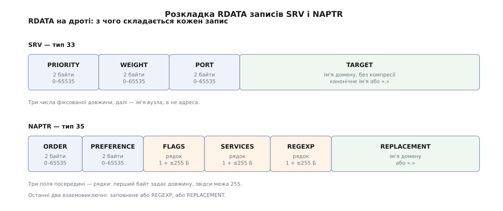

# 📋 SRV і NAPTR: поля, діапазони, синтаксис зони

Це довідка по обох записах на рівні окремого поля: що лежить у RDATA, як воно пишеться у файлі зони, які значення дозволені та які поєднання заборонені. Вона потрібна рівно тоді, коли ви правите зону власного домену або розбираєте чужу відповідь і хочете відрізнити законний запис від помилки адміністратора.


*Рядкові поля NAPTR починаються октетом довжини — звідси й межа 255 байтів на кожне. Імена доменів в обох записах ідуть без компресії, тому відповідь із довгими цілями буває несподівано важкою.*

## SRV: тип 33 (RFC 2782)

Автори — Арнт Ґульбрандсен, Пол Віксі та Левон Есібов, лютий 2000.

```
_служба._транспорт.ім'я.  TTL   IN  SRV  пріоритет  вага  порт  ціль.
_sips._tcp.example.com.   3600  IN  SRV  10         60    5061  sip1.example.com.
```

| поле | тип | діапазон | зміст |
| --- | --- | --- | --- |
| `пріоритет` | 16 біт без знаку | 0–65535 | Клієнт бере всі записи з найменшим числом; до наступного числа переходить, лише коли жоден із них не відповів. |
| `вага` | 16 біт без знаку | 0–65535 | Частка потоку всередині одного пріоритету. Коли вибирати нема з чого, ставлять 0 усім записам. |
| `порт` | 16 біт без знаку | 0–65535 | Звично збігається з реєстровим для служби, але не мусить. |
| `ціль` | ім'я домену | — | Вузол, до якого йти. Компресія імені тут заборонена. |

Правила, які файл зони не перевіряє, а клієнт відчує:

- **Ціль мусить мати власні адресні записи й не бути псевдонімом** — `MUST NOT be an alias`. CNAME на цьому місці або зайвий обмін, або відверта поломка, залежно від резолвера.
- **Ціль `.`** — не «не знаю», а «цієї служби домен не надає». Пишеться з нульовими числами: `_imap._tcp SRV 0 0 0 .`
- **Ціль — ім'я, не адреса.** Літерал `198.51.100.9` тут недійсний, порт у цілі (`host:5060`) — теж.
- **Мітки служби й транспорту нечутливі до регістру**, `_SIP._TCP` дорівнює `_sip._tcp`.
- **Ім'я-власник із CNAME не може мати SRV** — загальне правило DNS про співіснування записів.

## NAPTR: тип 35 (RFC 3403)

Майкл Меллінґ, жовтень 2002; частина набору DDDS (RFC 3401–3404).

```
example.com.  IN  NAPTR  order  pref  "flags"  "service"  "regexp"  replacement.
example.com.  IN  NAPTR  10     50    "S"      "SIPS+D2T" ""        _sips._tcp.example.com.
```

| поле | тип | зміст |
| --- | --- | --- |
| `order` | 16 біт без знаку | Обов'язковий порядок розгляду правил, від меншого до більшого. |
| `pref` | 16 біт без знаку | Розводить записи з однаковим `order`; порушити цей порядок клієнту дозволено, порушити `order` — ні. |
| `flags` | рядок ≤255 Б | Літери A–Z і цифри 0–9, регістр не важить. Порожній рядок означає, що правило нетермінальне: наступний крок — знову NAPTR. |
| `service` | рядок ≤255 Б | Назва того, що пропонується; синтаксис задає застосування, не сам запис. |
| `regexp` | рядок ≤255 Б | Підстановка за регулярним виразом. |
| `replacement` | ім'я домену | Готове наступне ім'я. Без компресії. |

**`regexp` і `replacement` взаємовиключні.** Заповнені обидва — запис помилковий, і клієнт має його або відкинути, або повернути помилку. Коли працює `regexp`, у `replacement` пишуть корінь `.`; коли працює `replacement`, `regexp` порожній — `""`.

### Прапорці

Сам запис прапорців не визначає — їх визначає застосування. Для пошуку серверів уживані такі:

| прапорець | що це означає | результат |
| --- | --- | --- |
| `""` | правило нетермінальне | наступний запит — знову NAPTR за отриманим іменем |
| `S` | термінальне | результат — ім'я, за яким лежать записи SRV |
| `A` | термінальне | результат — ім'я, для якого треба взяти A/AAAA |
| `U` | термінальне | результат — готовий URI, зібраний підстановкою; так працює [ENUM](book:communications/enum-e164) |
| `P` | термінальне | далі все віддано на розсуд застосування |

Схема S-NAPTR (RFC 3958) звужує набір до `S` і `A` і забороняє регулярні вирази взагалі — саме її беруть, коли DDDS у всій повноті надмірний.

### Синтаксис підстановки

Граматика — RFC 3402:

```
subst-expr   = роздільник  ere  роздільник  заміна  роздільник  *прапорці
роздільник   = "/" / "!" / будь-який октет, що не цифра 1–9 і не літера прапорця
ere          = розширений регулярний вираз POSIX
заміна       = послідовність символів і зворотних посилань
зворотне пос.= "\" ("1" … "9")
прапорці     = "i"        ; звіряти без урахування регістру
```

Роздільників мусить бути **рівно три** неекранованих. Цифри роздільником бути не можуть — вони плутаються зі зворотними посиланнями. `\1`…`\9` підставляють те, що ERE захопив у круглі дужки; `\0` не існує.

**Умова: телефонний номер +380 44 123 45 67 треба перетворити на SIP-URI, зберігши все після коду країни.**

```
$ORIGIN 7.6.5.4.3.2.1.4.4.0.8.3.e164.arpa.
  IN NAPTR 100 10 "u" "E2U+sip" "!^\\+380(.*)$!sip:\\1@pbx.example.com!" .

вхідний ключ:  +380441234567
ERE  ^\+380(.*)$  →  \1 = 441234567
результат:     sip:441234567@pbx.example.com
```

Зворотні слеші у файлі зони **подвоюються**: один слеш зникає при читанні файлу, а до застосування має дійти саме `\+` і `\1`. Це найтихіша помилка з усіх — запис завантажується без нарікань і мовчки дає не той URI.

## Уживані імена `_служба._транспорт`

| ім'я | звичний порт | джерело |
| --- | --- | --- |
| `_sip._udp`, `_sip._tcp` | 5060 | RFC 3263 |
| `_sips._tcp` | 5061 | RFC 3263 |
| `_xmpp-client._tcp` | 5222 | RFC 6120 |
| `_xmpp-server._tcp` | 5269 | RFC 6120 |
| `_submission._tcp` | 587 | RFC 6186 |
| `_imaps._tcp` | 993 | RFC 6186 |
| `_pop3s._tcp` | 995 | RFC 6186 |
| `_caldavs._tcp`, `_carddavs._tcp` | 443 | RFC 6764 |
| `_ldap._tcp` | 389 | RFC 4386; у Active Directory — `_ldap._tcp.dc._msdcs.<домен>` |
| `_kerberos._udp`, `_kerberos._tcp` | 88 | RFC 4120 §7.2.3 |
| `_kerberos-master._udp` | 88 | RFC 4120 — вузол, що бачить зміну пароля негайно |
| `_kpasswd._udp` | 464 | RFC 4120 |
| `_kerberos-adm._tcp` | 749 | RFC 4120 |
| `_stun._udp`, `_stuns._tcp` | 3478, 5349 | RFC 8489 |
| `_turn._udp`, `_turns._tcp` | 3478, 5349 | RFC 8656 |
| `_autodiscover._tcp` | 443 | Microsoft Exchange, поза IETF |
| `_matrix-fed._tcp` | 8448 | специфікація Matrix, з версії 1.8 (раніше `_matrix._tcp`) |

Реєстрів насправді два, і плутати їх легко. Назви служб живуть у реєстрі імен служб і портів IANA (RFC 6335), а окремий реєстр підкреслених імен вузлів (RFC 8552) стежить за тим, щоб дві різні технології не претендували на одну підкреслену мітку в одному типі запису. Другий реєстр короткий: для SRV у ньому всього чотирнадцять імен — `_dccp`, `_http`, `_ipv6`, `_ldap`, `_ocsp`, `_sctp`, `_sip`, `_stun`, `_stuns`, `_tcp`, `_turn`, `_turns`, `_udp`, `_xmpp`. Тобто більшість того, що реально лежить у зонах, у нього не потрапила: за `_xmpp` там стоїть посилання на RFC 3921, а працюють у зонах `_xmpp-client` і `_xmpp-server` з RFC 6120. Відсутність імені в реєстрі не робить запис недійсним — вона лише не захищає від зіткнення.

## Рядки `service` для SIP

Синтаксис `протокол+D2транспорт` читається як «domain to X» — з домену до вказаного транспорту.

| рядок | транспорт | ім'я SRV | джерело |
| --- | --- | --- | --- |
| `SIP+D2U` | UDP | `_sip._udp` | RFC 3263 |
| `SIP+D2T` | TCP | `_sip._tcp` | RFC 3263 |
| `SIP+D2S` | SCTP | `_sip._sctp` | RFC 3263 |
| `SIPS+D2T` | TLS поверх TCP | `_sips._tcp` | RFC 3263 |
| `SIP+D2W`, `SIPS+D2W` | WebSocket | — | RFC 7118 |

RFC 3263 прямо каже: записи з `SIPS` у полі service мають діставати менший `order`, тобто розглядатися раніше. Пара для WebSocket зареєстрована самим RFC 7118 (§10.2), але власних імен SRV він не задає — на час написання клієнтські стеки WebSocket не вміли робити ні NAPTR-, ні SRV-запитів. Повний ланцюг для [SIP](book:communications/sip) через це виглядає так: NAPTR за доменом → SRV за отриманим іменем → адресний запит за ціллю.

## Додаткова секція відповіді

RFC 2782 радить серверові класти адресні записи цілей у додаткову секцію тієї самої відповіді, але **не вимагає** цього. RFC 3403 щодо NAPTR формулює жорсткіше: застосування не сміє вимагати, щоб будь-які записи були в додатковій секції.

На практиці розраховувати на неї не можна з третьої причини: коли ціль лежить у чужій зоні, резолвер відкине надіслані адреси як неавторитетні, і адресний запит однаково доведеться зробити окремо. Плануйте затримку так, ніби додаткової секції немає; коли вона є — це подарунок, а не контракт.

## Перевірка й типові помилки

```
$ dig +short SRV _sips._tcp.example.com
10 60 5061 sip1.example.com.

$ dig +short NAPTR example.com
10 50 "S" "SIPS+D2T" "" _sips._tcp.example.com.

$ dig +short SRV _imap._tcp.example.com
0 0 0 .                      # службу оголошено відсутньою
```

| помилка | як виглядає | наслідок |
| --- | --- | --- |
| немає кінцевої крапки в цілі | `… 5061 sip1.example.com` | `$ORIGIN` дописується: ціллю стає `sip1.example.com.example.com.` |
| мітки навпаки | `_tcp._sip.example.com` | імені просто немає; клієнт мовчки відкочується на вшитий порт |
| ціль — псевдонім CNAME | `… 5061 alias.example.com.` | зайвий обмін, частина клієнтів не дає ради |
| порожній `regexp` пропущено замість `""` | `… 10 50 "S" "SIPS+D2T" _sips…` | розбір зсувається на поле, ім'я потрапляє в `regexp` |
| один зворотний слеш у `regexp` | `"!^\+380(.*)$!…!"` | слеш зникає при читанні, підстановка дає не той результат |
| заповнені й `regexp`, і `replacement` | `… "!…!" _sips._tcp.example.com.` | запис помилковий, клієнт має його відкинути |
| вага 0 поряд із ненульовими | `SRV 10 0 5061 …` та `SRV 10 60 5061 …` | нульовий вузол вибирається практично ніколи, а не «нарівні» |
| SRV для HTTP | `_http._tcp.example.com` | браузери такого запиту не роблять узагалі |

Останній рядок таблиці — не дрібниця, а окремий клас помилок: **опублікований запис працює лише там, де клієнт свідомо його шукає**. У локальній мережі те саме зроблено через [DNS-SD](book:programming/mdns-dns-sd), де до SRV додають TXT із параметрами й PTR для переліку примірників; у решті випадків спершу переконайтеся, що ваш клієнт узагалі питає SRV, і лише потім доводьте зону до ладу.
