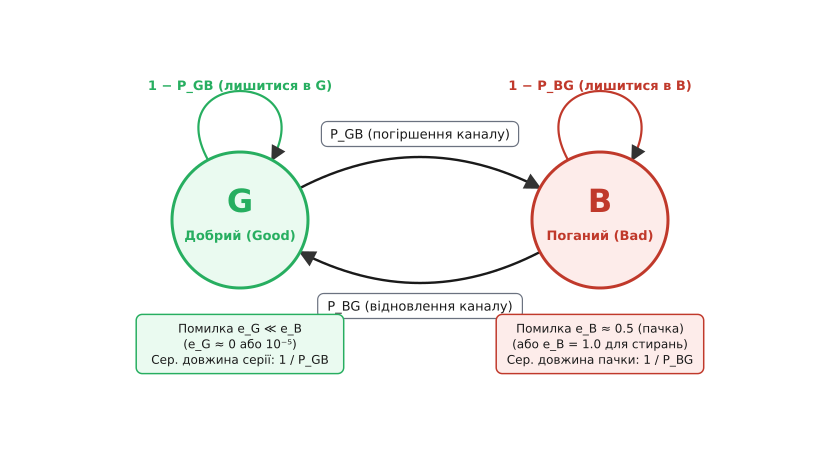
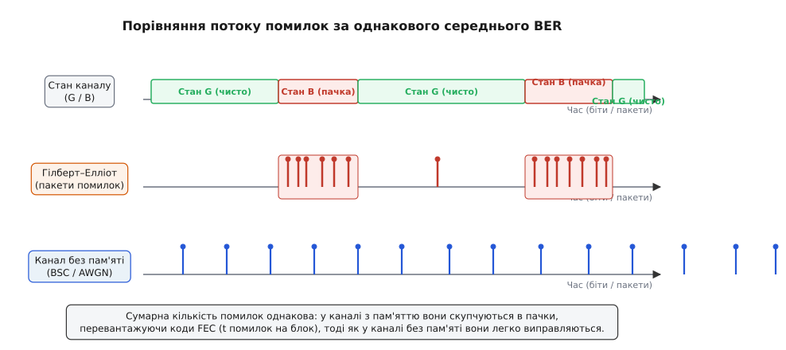
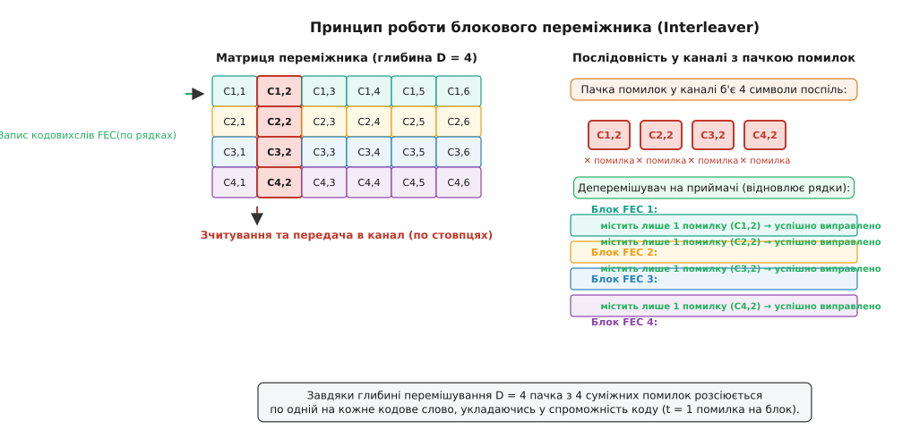
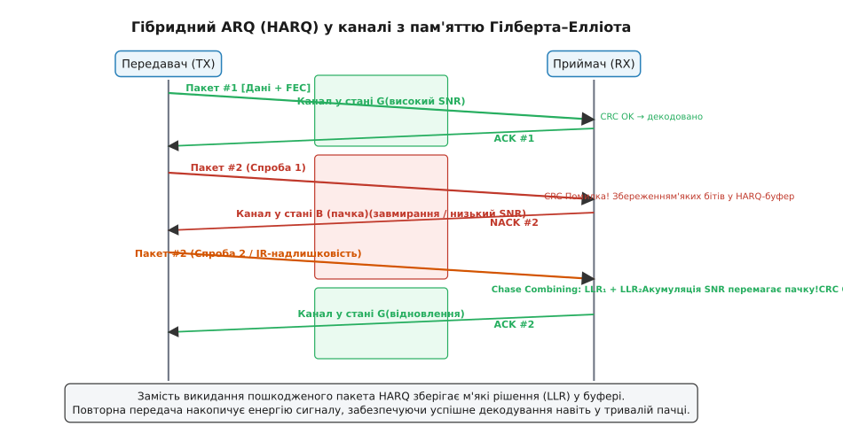

# Модель каналу Гілберта–Елліота

<preknowlist>
- [Ланцюги Маркова](book:math/markov-chain) — дискретні стани, ймовірності переходів, властивість без пам'яті та стаціонарний розподіл.
- [Двійковий симетричний канал](book:communications/binary-symmetric-channel) — модель каналу без пам'яті з незалежними помилками бітів.
- [Пакетна помилка](book:communications/burst-error) — згруповані спотворення символів та їхній вплив на блокові коди.
- [Канальне кодування (FEC)](book:communications/fec-channel-coding) — введення надлишковості для виправлення спотворень у каналі зв'язку.
- [Протоколи ARQ](book:communications/arq-protocol) — автоматичний запит повторної передачі при виявленні помилок.
</preknowlist>

Коли інженер проєктує захист від помилок для бездротового лінка чи мережевого протоколу, першою спокусою є взяти єдине число — середню частоту бітових помилок (Bit Error Rate, BER) або коефіцієнт втрати пакетів (Packet Loss Rate, PLR). Якщо вимірювання показують `BER = 10⁻³`, здається природним розбити потік на блоки по 100 бітів і застосувати код із виправленням двох помилок (`t = 2`). Розрахунок виглядає бездоганно: на 100 бітів припадає в середньому лише 0.1 помилки, тому подвійний запас надійно захистить передачу. Проте в реальному радіоефірі з багатопроменевими завмираннями або на крученій парі з промисловими наведеннями такий код несподівано відмовляє: рівень втрат блоків сягає 10–20%, а корисна швидкість передачі падає до нуля.

Причина цієї катастрофи полягає в тому, що середній рівень помилок приховує часову структуру завад. Реальний канал 99% часу працює бездоганно, не спотворюючи жодного біта, але решта 1% часу припадає на глибокі інтерференційні провали або спалахи напруги. У ці моменти помилки не розсипаються поодинці, а летять густою пачкою по 20–50 бітів поспіль. Однобітна чи дводіапазонна корекція коду захлинається в першому ж блоці, що потрапив під пачку, тоді як наступні двадцять блоків марно витрачають свою надлишковість на абсолютно чисті дані.

Щоб проєктувати життєздатні мережеві протоколи, переміжники даних та алгоритми повторної передачі, потрібна математична модель, яка враховує **пам'ять каналу** — схильність завад утримуватися в часі та збиватися в пачки. Найпростішою, найелегантнішою та найпоширенішою в інженерній практиці моделлю такого типу є двостанова марковська модель Гілберта–Елліота.

## Фізична природа пам'яті каналу в мережах

У класичній теорії інформації Шеннона базовим об'єктом є канал без пам'яті (Memoryless Channel), де кожне спостереження на виході залежить виключно від поточного вхідного символу:

```
P(E[t] | E[t-1], E[t-2], …, E[0]) = P(E[t])
```

У фізичних лініях передачі даних ця рівність майже ніколи не справджується. Помилка в момент часу `t` різко підвищує ймовірність помилки в момент часу `t+1`. Залежно від рівня мережевого стеку, ця часова пам'ять має різне фізичне та апаратне походження.

На фізичному рівні (PHY) бездротових мереж (LTE, 5G, Wi-Fi, супутниковий зв'язок) головною причиною пам'яті є швидкі та повільні завмирання (Fading). Сигнал від антени передавача досягає приймача багатьма шляхами, відбиваючись від будівель, рельєфу та рухомих об'єктів. Взаємне додавання променів зі зсунутими фазами створює просторову картину інтерференційних максимумів і глибоких нулів. Коли приймач або відбивачі рухаються зі швидкістю `v`, частота сигналу зазнає доплерівського зсуву `f_d = v / λ`, де `λ` — довжина хвилі. Час, протягом якого амплітуда сигналу залишається корельованою, називають часом когерентності каналу (Coherence Time):

```
T_c ≈ 1 / (2 · f_d) = λ / (2 · v)
```

Якщо швидкість передачі становить 100 Мбіт/с (тривалість одного біта — 10 нс), а автомобіль рухається зі швидкістю 60 км/год на частоті 2.4 ГГц (`λ = 0.125` м, `f_d ≈ 133` Гц, `T_c ≈ 3.75` мс), то період глибокого провалу сигналу триває близько 3.75 мілісекунди. За цей короткий проміжок часу передавач встигає відправити 375 000 бітів. Усі ці біти потрапляють у зону деструктивної інтерференції, де відношення сигнал/шум (SNR) падає нижче порогу демодулятора, породжуючи велетенську пачку помилок.

У системах зв'язку з рухомими об'єктами (V2X, зв'язок поїздів або дронів) завмирання доповнюються затіненням (Shadowing) від мостів, споруд чи дерев. Затінення викликає повільні варіації потужності сигналу (Log-normal Shadowing), які занурюють лінк у деградований стан на сотні мілісекунд, що на швидкостях гігабітного діапазону відповідає мільйонам спотворених символів поспіль.

На дротовому фізичному рівні (DSL, Ethernet по мідних парах, польові шини CAN та RS-485) пам'ять каналу спричинена імпульсними завадами (Impulse Noise). Спрацьовування реле, запуск потужних електродвигунів або грозові розряди наводять на кабелі електромагнітні перехідні процеси тривалістю від кількох мікросекунд до кількох мілісекунд. Поки затухають коливання в контурі лінії, демодулятор стабільно фіксує помилкові біти.

На мережевому та транспортному рівнях (IP, UDP, TCP) пам'ять каналу виникає через динаміку черг у буферах маршрутизаторів. Якщо трафік надходить пульсаціями (Bursty Traffic), буфер комутатора переповнюється. За використання простого алгоритму відкидання хвоста (Drop-Tail) комутатор викидає не один випадковий пакет, а цілу серію з 5–20 пакетів, що надійшли поспіль, поки черга не звільниться. Для транспортного протоколу TCP це виглядає точно як пачковий канал стирання (Packet Erasure Channel) з вираженою пам'яттю.

## Двостанова модель: стани Good та Bad

У 1960 році дослідник Bell Labs Едгар Гілберт (Edgar Gilbert) запропонував описати пачковий канал за допомогою дискретного в часі марковського ланцюга (Discrete Time Markov Chain, DTMC) з двома станами:
- **Стан G (Good — добрий стан або проміжок):** Канал перебуває у сприятливих умовах передачі (високий рівень сигналу, відсутність інтерференції, вільні мережеві буфери). Помилки виникають вкрай рідко або відсутні зовсім.
- **Стан B (Bad — поганий стан або пачка завади):** Канал зазнає глибокого завмирання, дії імпульсної завади чи переповнення буфера. Помилки летять із високою щільністю.

Канал здійснює переходи між цими двома станами синхронно з дискретними тактами передачі (на кожному переданому біті, символі чи пакеті).

Динаміка переходів визначається двома параметрами:
- `P_GB = P(S[t+1] = B | S[t] = G)` — ймовірність того, що канал у наступному такті деградує і перейде з доброго стану `G` у поганий стан `B`. У реальних лініях це мале число (наприклад, `10⁻³ … 10⁻⁵`).
- `P_BG = P(S[t+1] = G | S[t] = B)` — ймовірність того, що канал відновиться і перейде з поганого стану `B` назад у добрий стан `G`.

Відповідно, ймовірності зберегти свій поточний стан становлять `P_GG = 1 - P_GB` та `P_BB = 1 - P_BG`.

Матриця ймовірностей переходу `P` записується у вигляді:

```
P = [ 1 - P_GB    P_GB   ]
    [   P_BG    1 - P_BG ]
```


*Двостанова модель Гілберта–Елліота: переходи між станами G та B задаються ймовірностями P_GB і P_BG, а ймовірності помилок e_G та e_B визначають рівень спотворень у кожному настрої каналу.*

Головна властивість цієї моделі — **інерційність (липкість) станів**. Якщо значення `P_GB` та `P_BG` малі (тобто `1 - P_GB ≈ 1` та `1 - P_BG ≈ 1`), система має високу схильність затримуватися в поточному стані. Увійшовши в стан `B`, канал не виходить із нього на наступному ж такті, а перебуває в ньому протягом серії кроків, формуючи пачку помилок.

## Ймовірності помилки: модель Гілберта проти моделі Елліота

Самі по собі марковські стани `G` та `B` описують лише внутрішній стан фізичного середовища, але не показують безпосередньо, чи спотвориться конкретний переданий біт. Для повного опису вводять умовні ймовірності помилки всередині кожного зі станів:
- `e_G = P(помилка | S[t] = G)` — ймовірність спотворення біта в доброму стані.
- `e_B = P(помилка | S[t] = B)` — ймовірність спотворення біта в поганому стані.

Завжди виконується фундаментальна нерівність: `e_G ≪ e_B`.

Історично склалися два варіанти моделі:
1. **Первісна модель Гілберта (Gilbert, 1960):** Гілберт припустив, що в доброму стані канал є абсолютно бездоганним: `e_G = 0`. У поганому стані біти спотворюються з імовірністю `e_B = 1 - h` (де `h` — коефіцієнт прозорості каналу). Найчастіше беруть `e_B = 0.5`, що відповідає повному руйнуванню сигналу: приймач втрачає синхронізацію або когерентність і вгадує біти навмання (кидає симетричну монету).
2. **Узагальнена модель Елліота (Elliott, 1963):** Елліот зауважив, що реальний «добрий» канал усе одно має фоновий тепловий шум (AWGN), тому навіть у стані `G` зрідка трапляються поодинокі незалежні помилки (`e_G > 0`, наприклад `e_G = 10⁻⁶`). З іншого боку, у поганому стані `B` сигнал не обов'язково знищується повністю: сильні коди або часткове завмирання залишають шанс прийняти біт правильно, тому `e_B` може дорівнювати, наприклад, `0.3` або `0.4`.

У мережевих протоколах передачі пакетів поширений окремий крайній випадок моделі Гілберта–Елліота — **пакетний канал стирання (Packet Erasure Channel)**. Якщо стан `G` відповідає нормальній доставці пакета без втрат (`e_G = 0`), а стан `B` — переповненню буфера або відкиданню через неправильну контрольну суму CRC, то `e_B = 1.0` (пакет втрачається гарантовано).

Узагальнена модель Гілберта–Елліота з чотирма параметрами `(P_GB, P_BG, e_G, e_B)` належить до класу **прихованих марковських моделей (Hidden Markov Model, HMM)**. Приймач спостерігає лише послідовність помилок `E[t] ∈ {0, 1}`, але не знає напевно, у якому саме стані перебував канал, оскільки нульова помилка може випадково виникнути навіть у поганому стані (з імовірністю `1 - e_B`), а одинична помилка — у доброму стані (з імовірністю `e_G`).

## Стаціонарні ймовірності та тривалість пачок

Оскільки двостановий марковський ланцюг є ергодичним та неперіодичним (за умови `P_GB > 0` та `P_BG > 0`), він має єдиний стаціонарний розподіл імовірностей `π = [π_G, π_B]`. Вектор `π` показує асимптотичну частку часу, яку канал проводить у кожному зі станів на нескінченному інтервалі спостереження.

З умови збереження балансу потоків імовірностей між станами `G` та `B` (середня кількість переходів `G → B` дорівнює середній кількості зворотних переходів `B → G`) отримуємо:

```
π_G · P_GB = π_B · P_BG
```

Враховуючи умову нормування `π_G + π_B = 1`, стаціонарні ймовірності виражаються у замкненому вигляді:

```
π_G = P_BG / (P_GB + P_BG)    [частка часу в доброму стані]
π_B = P_GB / (P_GB + P_BG)    [частка часу в поганому стані]
```

### Статистика тривалості пачок завади

Нехай канал перейшов у стан `B`. Оскільки марковський ланцюг не має довготривалої передісторії, на кожному наступному кроці він виходить із поганого стану з постійною ймовірністю `P_BG` незалежно від того, скільки часу він уже там пробув.

Це означає, що випадкова величина тривалості перебування в поганому стані `L_B` (довжина пачки завади в бітах або пакетах) має **дискретний геометричний розподіл**:

```
P(L_B = k) = (1 - P_BG)ᵏ⁻¹ · P_BG,    k = 1, 2, 3, …
```

Математичне сподівання тривалості перебування в поганому стані дає фундаментальну формулу для **середньої довжини пачки помилок**:

```
⟨L_B⟩ = E[L_B] = 1 / P_BG
```

Симетрично, випадкова величина тривалості перебування в доброму стані `L_G` (інтервал безперешкодної передачі між пачками) також розподілена геометрично з математичним сподіванням:

```
⟨L_G⟩ = E[L_G] = 1 / P_GB
```

### Середня ймовірність помилки (BER / PLR)

Безумовний середній рівень помилок каналу `⟨e⟩` є зваженою сумою ймовірностей помилок у кожному стані з вагами, рівними стаціонарним часткам часу:

```
⟨e⟩ = π_G · e_G + π_B · e_B
    = (P_BG · e_G + P_GB · e_B) / (P_GB + P_BG)
```

Детальне матричне виведення цих співвідношень, розрахунок дисперсій тривалості перебування та аналіз пропускної здатності за Шенноном наведено в [математичній вставці](book:communications/gilbert-elliott-channel/math-markov-channel.md).

### Числовий приклад розрахунку

Розглянемо практичний приклад бездротового каналу з параметрами:
- `P_GB = 0.001` (перехід у поганий стан відбувається в середньому раз на 1000 бітів).
- `P_BG = 0.05` (ймовірність виходу з поганого стану становить 5% на кожен такт).
- `e_G = 0` (у доброму стані помилок немає).
- `e_B = 0.5` (у поганому стані біти повністю спотворюються).

Обчислимо ключові характеристики лінії:
1. Частка часу в поганому стані: `π_B = 0.001 / (0.001 + 0.05) = 0.001 / 0.051 ≈ 0.0196` (1.96% часу).
2. Частка часу в доброму стані: `π_G = 0.05 / 0.051 ≈ 0.9804` (98.04% часу).
3. Середня довжина пачки завади: `⟨L_B⟩ = 1 / P_BG = 1 / 0.05 = 20` бітів.
4. Середній чистий проміжок: `⟨L_G⟩ = 1 / P_GB = 1 / 0.001 = 1000` бітів.
5. Загальний середній рівень помилок: `⟨e⟩ = 0.9804 · 0 + 0.0196 · 0.5 = 0.0098 ≈ 10⁻²` (1% спотворених бітів).

Ці числа розкривають суть проблеми: наївний спостерігач бачить канал із `BER = 1%`. Але цей 1% складається не з поодиноких помилок через кожні 100 бітів, а з рідкісних ударів тривалістю по 20 бітів, де спотворюється приблизно 10 бітів за пачку.


*Розподіл помилок у часі за однакового сумарного BER: у каналі без пам'яті помилки розсіяні поодинці, а в моделі Гілберта–Елліота збиваються в густі пачки під час перебування в стані B.*

## Пам'ять каналу та автокореляція

Кількісною мірою пам'яті каналу є автокореляційна функція послідовності помилок `E[t]`.

Коефіцієнт коваріації між помилкою на такті `t` та помилкою на такті `t+k` визначається другим власним числом матриці переходів `λ₂ = 1 - P_GB - P_BG`:

```
Cov(E[t], E[t+k]) = π_G · π_B · (e_B - e_G)² · (1 - P_GB - P_BG)ᵏ
```

Величина `μ = 1 - P_GB - P_BG` називається **коефіцієнтом пам'яті каналу**:
- Якщо `P_GB + P_BG = 1` (тобто `μ = 0`), коваріація дорівнює нулю для всіх `k ≥ 1`. Канал миттєво забуває свій попередній стан і вироджується у двійковий симетричний канал без пам'яті (BSC).
- Якщо `P_GB + P_BG < 1` (тобто `0 < μ < 1`), канал має позитивну пам'ять: стан `B` притягує стан `B`, а стан `G` притягує стан `G`.

Характерний час кореляції каналу (час, за який взаємний зв'язок між помилками зменшується в `e ≈ 2.718` разів) становить:

```
τ_corr = -1 / ln(1 - P_GB - P_BG) ≈ 1 / (P_GB + P_BG)
```

Чим більший час кореляції `τ_corr`, тим триваліші пачки генерує канал і тим глибші структури захисту потрібні для боротьби з ними.

## Чому пам'ять руйнує класичні коди FEC

Більшість класичних лінійних блокових кодів (коди Хеммінга, Голея, БЧХ, Ріда–Мюллера) та згорткових кодів оптимізовані під канал без пам'яті. Код із довжиною кодового слова `N` та кількістю інформаційних бітів `K` має фіксовану мінімальну кодову відстань за Хеммінгом `d_min` і гарантує виправлення не більше ніж `t` помилок у блоці:

```
t = ⌊ (d_min - 1) / 2 ⌋
```

У каналі без пам'яті з імовірністю бітової помилки `p` кількість спотворень у блоці описується біноміальним розподілом із математичним сподіванням `N · p`. Ймовірність того, що кількість помилок перевищить `t`, спадає експоненційно зі зростанням `t`.

У каналі Гілберта–Елліота ця логіка ламається. Якщо довжина пачки `⟨L_B⟩ = 20` бітів, а кодове слово має довжину `N = 31` з корекцією `t = 2`, то потрапляння кодового слова під пачку завади призводить до появи в ньому в середньому 10 помилок. Код з `t = 2` зазнає повної аварії (Uncorrectable Error) і часто декодує блок у хибне кодове слово (Undetected Error).

Щоб подолати руйнівний вплив пам'яті каналу, інженерія зв'язку розробила дві фундаментальні відповіді: **перемішування (Interleaving)** та **гібридний повторний запит (HARQ)**.

## Відповідь 1: Переміжники (Interleavers)

Головна ідея перемішування — **перетворити канал із пам'яттю на псевдоканал без пам'яті** для декодера шляхом перестановки символів у часі.

### Принцип блокового матричного переміжника

Блоковий переміжник організовується у вигляді буферної матриці розміром `M` рядків на `N` стовпців:
1. **Запис (на передавачі):** Кодер формує `M` незалежних кодових слів FEC довжиною `N` бітів кожне і записує їх у матрицю **по рядках**.
2. **Передача в канал:** Передавач зчитує біти з матриці та відправляє їх в ефір **по стовпцях** (спершу нульові біти всіх `M` слів, потім перші біти всіх `M` слів і так далі).
3. **Дія каналу:** Пачка помилок у каналі б'є по послідовних бітах переданого потоку, спотворюючи символи одного або кількох стовпців.
4. **Деперемішування (на приймачі):** Приймач записує отримані символи у зворотну матрицю по стовпцях, а зчитує по рядках, передаючи їх на вхід декодера FEC.


*Блоковий переміжник розсіює суміжну пачку помилок у каналі по одному символу на різні кодові слова FEC, укладаючи пошкодження в межі корекційної спроможності коду.*

Величина `D = M` називається **глибиною перемішування (Interleaving Depth)**. Завдяки перестановці будь-які два символи, що належали одному кодовому слову, після виходу з переміжника виявляються рознесеними в часі передачі на відстань рівно `D` тактів.

Якщо глибину перемішування обрати більшою за середню тривалість пачки:

```
D ≥ ⟨L_B⟩ = 1 / P_BG
```

то суцільна пачка помилок довжиною `L_B` потрапить рівно по одному біту в кожне з `M` різних кодових слів. Для кожного окремого декодера пачка розпадеться на поодинокі, ізольовані помилки, з якими легко впорається навіть найпростіший код з `t = 1`.

### Згорткові переміжники та ціна затримки

Окрім блокових матриць, у цифровому телебаченні (DVB-T) та супутниковому зв'язку широко застосовують згорткові переміжники Рамсея–Форні (Ramsey-Forney Interleaver). Вони побудовані на наборі паралельних зсувних регістрів із наростаючою затримкою `0, M, 2M, …, (I-1)M`. Згортковий переміжник забезпечує ту саму стійкість до пачок, але потребує вдвічі менше пам'яті та вносить удвічі меншу наскрізну затримку порівняно з блоковим.

Проте за перемішування завжди доводиться платити **затримкою доставки (Latency)**. Щоб заповнити матрицю `M × N`, передавач мусить накопичити дані, а приймач не може розпочати декодування, доки не отримає весь блок цілком. Загальна наскрізна затримка блокового переміжника становить `2 · M · N` тактів. У голосовому зв'язку (VoIP) або в системах керування реального часу (URLLC), де затримка обмежена 1–5 мілісекундами, глибокий переміжник застосувати неможливо.

## Відповідь 2: Гібридний ARQ (HARQ)

Коли затримка жорстко обмежена або довжина пачки завади перевищує будь-які розумні розміри переміжника, на допомогу приходить протокол **гібридного автоматичного запиту повторної передачі (Hybrid Automatic Repeat reQuest, HARQ)**.

Звичайний протокол ARQ працює неефективно в каналі з пам'яттю: якщо кадр пошкоджено, приймач надсилає негативне підтвердження (NACK), і передавач миттєво відправляє кадр повторно. Але оскільки канал залишається в поганому стані `B` протягом `⟨L_B⟩` тактів, повторна передача потрапляє під ту саму заваду і знову гине. До того ж, звичайний ARQ повністю відкидає пошкоджений пакет, втрачаючи всю частково прийняту інформацію.

HARQ кардинально змінює цей процес за рахунок використання м'яких рішень демодулятора (Soft Decision):

1. **Збереження енергії сигналу (Soft Buffering):** При отриманні пошкодженого пакета приймач не видаляє його з пам'яті, а зберігає неперервні логарифмічні відношення правдоподібності (LLR) кожного біта в спеціальному буфері.
2. **М'яке об'єднання Чейза (Chase Combining, Type II HARQ):** При отриманні повторної копії того самого пакета приймач додає нові значення LLR до раніше збережених:
   ```
   LLR_{total} = LLR_1 + LLR_2 + … + LLR_k
   ```
   Це еквівалентно когерентному накопиченню потужності сигналу (Maximum Ratio Combining). Навіть якщо обидві спроби передачі пройшли крізь глибоке завмирання зі зниженим SNR, їхня сумарна енергія перевищує поріг декодування, і блок успішно відновлюється.
3. **Інкрементна надлишковість (Incremental Redundancy, IR-HARQ):** Замість точної копії передавач під час кожної наступної спроби надсилає нові перевірочні біти, згенеровані низькошвидкісним кодом (Turbo або LDPC) шляхом зміни схеми перфорації (Puncturing). Кожна спроба поступово знижує ефективну швидкість коду, посилюючи його корекційну здатність рівно настільки, наскільки цього вимагає поточний стан каналу.


*Протокол HARQ у каналі з пам'яттю: замість відкидання пошкодженого кадру приймач накопичує LLR, забезпечуючи швидке декодування при повторній передачі.*

Повний симулятор каналу Гілберта–Елліота, матричного переміжника та алгоритму Chase Combining HARQ мовами C та C++ наведено у [вставці з реалізацією та симуляцією](book:communications/gilbert-elliott-channel/proj-burst-harq-sim.md).

## Модель Гілберта–Елліота на різних рівнях стеку

Універсальність моделі Гілберта–Елліота полягає в тому, що її математичний апарат масштабується на всі рівні мережевої ієрархії:

1. **Фізичний рівень (PHY):**
   Дискретний крок `t` відповідає одному біту або символу модуляції. Стани `G` та `B` моделюють відношення сигнал/шум вище чи нижче порогу демодуляції. Модель використовується для вибору схеми модуляції, розрахунку FEC та розміру матриці переміжника.

2. **Канальний рівень (MAC/Data Link):**
   Крок `t` відповідає фрейму канального рівня (наприклад, фрейму Wi-Fi 802.11 або транспортному блоку LTE/5G TB). Стан `B` моделює тимчасову колізію в радіоефірі через конкуренцію за доступ (CSMA/CA) або короткочасне затінення антени. Модель диктує розміри буферів перевпорядкування HARQ та параметри таймера повторної передачі.

3. **Мережевий та транспортний рівні (IP/TCP):**
   Крок `t` відповідає IP-пакету. Стан `B` моделює переповнення черги маршрутизатора на вузькому місці мережі.
   Для протоколу TCP модель Гілберта–Елліота має вирішальне значення: алгоритми контролю перевантаження (TCP Reno, Cubic, BBR) по-різному реагують на поодинокі втрати та на пачки втрат. Одиночна втрата інтерпретується як випадковий збій, тоді як пачкова втрата кількох пакетів поспіль свідчить про глибокий затор (Congestion Collapse), змушуючи TCP скидати вікно передачі `cwnd` до мінімуму та переходити в режим повільного старту (Slow Start).

## Крос-рівнева оптимізація: адаптивна модуляція (AMC) та V2X

У сучасних стільникових мережах 5G New Radio та бездротових мережах стандарту Wi-Fi 7 захист від пачкових помилок реалізується як дворівнева система зворотного зв'язку, що безпосередньо спирається на оцінку марковського стану каналу:
1. **Швидкий внутрішній контур (HARQ на рівні мілісекунд):** Коли канал на короткий час занурюється в стан `B`, процес HARQ утримує кадр, запитує ретрансмісію та накопичує LLR. Для вищих рівнів стеку (IP/TCP) цей короткочасний спалах завад залишається абсолютно непомітним, оскільки пакет успішно відновлюється за 2–3 мс.
2. **Повільний зовнішній контур (Adaptive Modulation and Coding, AMC на рівні десятків мілісекунд):** Базова станція аналізує статистику підтверджень ACK/NACK та вимірювань CQI (Channel Quality Indicator). Якщо частота переходів у стан `B` (`P_GB`) зростає, базовий планувальник знижує порядок модуляції (переходячи, наприклад, з 256-QAM на 16-QAM чи QPSK) та збільшує частку перевірочних бітів у кодовому слові LDPC.

У мережах зв'язку між транспортними засобами (Vehicle-to-Everything, C-V2X) або при керуванні безпілотними літальними апаратами (БПЛА) параметри моделі Гілберта–Елліота динамічно змінюються зі швидкістю руху. Коли дрон маневрує серед міських будівель, швидкість переходу `P_GB` різко зростає при вході в зону затінення. Використання моделі Гілберта–Елліота дозволяє автопілоту заздалегідь оцінити ймовірність зриву телеметричного каналу керування і вчасно активувати режим локального зависання чи перемкнутися на резервний супутниковий лінк.

## Безфонтанні коди проти переміжників у пакетних мережах

У широкомовних мережах передачі даних (IP-мультимедіа, супутникове мовлення, багатоадресні оновлення прошивок IoT) традиційний переміжник у поєднанні з ARQ стає неефективним через явище зворотного шторму підтверджень (NACK Implosion). Коли тисячі приймачів одночасно потрапляють у стан `B` у різні моменти часу, передавач захлинається від повторних запитів.

У таких сценаріях пачковий канал Гілберта–Елліота ефективно долається **фонтанними кодами (Fountain Codes / Rateless Codes, наприклад, кодами Любі LT або кодами Raptor)**:
- Передавач генерує нескінченний потік випадкових лінійних комбінацій вихідних пакетів.
- Приймач, перебуваючи в стані `B`, може втрачати пачки по 20–50 пакетів поспіль без жодних запитів на повторну передачу.
- Щойно приймач сумарно накопичує `K · (1 + ε)` будь-яких непошкоджених пакетів (де `ε ≈ 0.02 … 0.05`), він розв'язує систему лінійних рівнянь і миттєво декодує весь вихідний масив даних.

Фонтанні коди повністю позбавляють систему необхідності знати точні моменти початку й завершення пачок завади, забезпечуючи максимальну стійкість до будь-якої нестаціонарності каналу.

## Межі застосовності та розширення моделі

Попри свою популярність, класична двостанова модель Гілберта–Елліота має певні обмеження:
1. **Геометричний закон спадання пачок:** У реальних радіоканалах через затінення будівлями (Shadowing) та багатомасштабні рухи об'єктів розподіл тривалості перебування в заваді часто має «важкі хвости» (Heavy-tailed distribution, наприклад, степеневий розподіл Парето). Геометричний розподіл `(1 - P_BG)^{k-1}` недооцінює ймовірність наддовгих пачок.
2. **Дворівнева дискретизація якості:** Реальний радіоканал не перемикається стрибком між «ідеальним» та «жахливим» станами. Зміна SNR відбувається неперервно.

Для подолання цих обмежень інженери використовують узагальнені моделі:
- **Модель Фрічмана (Fritchman, 1967):** Розбиває простір станів на `K` станів, з яких `k` станів є безпомилковими, а `K - k` станів генерують помилки. Сума кількох геометричних розподілів дозволяє апроксимувати довільні емпіричні функції довжин пачок.
- **Марковські ланцюги зі скінченним числом станів (FSMC):** Розбивають діапазон SNR на 5–10 дискретних інтервалів, кожен із яких відповідає конкретній схемі модуляції та кодування (MCS).
- **Напівмарковські процеси (Semi-Markov Processes):** Дозволяють задавати довільні функції розподілу тривалості перебування в станах замість строго геометричних.

Проте саме двостанова модель Гілберта–Елліота залишається золотим стандартом первинного інженерного аналізу: маючи лише чотири параметри, які легко виміряти за тестовими трасами передачі, вона дає замкнені аналітичні формули та дозволяє за лічені секунди оцінити працездатність створюваної мережевої системи.

> 🔧 **Навіщо це.** Без моделі Гілберта–Елліота неможливо спроєктувати сучасний бездротовий стек. Вона дає відповідь на три головні питання інженера: якої глибини `D` має бути переміжник, щоб розсіяти типову пачку завмирання `1 / P_BG`; скільки процесів HARQ та якої ємності буфер м'яких відліків LLR потрібні приймачу; і через який таймаут слід відправляти повторний пакет, щоб він не потрапив у той самий інтервал завади.

---

Підсумок: **модель каналу Гілберта–Елліота** описує канали зв'язку з часовою пам'яттю за допомогою двостанового ланцюга Маркова: доброго стану `G` з рідкісними помилками `e_G` та поганого стану `B` зі щільними пачками помилок `e_B`. Чотири параметри моделі — ймовірності переходів `P_GB, P_BG` та рівні шуму `e_G, e_B` — визначають стаціонарні частки часу `π_G, π_B`, середню довжину пачки `1 / P_BG` та час кореляції каналу `τ_corr`. Модель пояснює, чому класичні блокові коди FEC зазнають аварії в каналах із пам'яттю, та обґрунтовує необхідність застосування переміжників (які перетворюють пачкові помилки на розсіяні) та протоколів HARQ (які накопичують енергію LLR при повторних спробах), забезпечуючи надійну роботу мереж від фізичного рівня до протоколу TCP.
