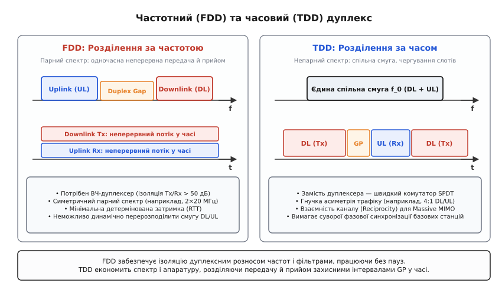
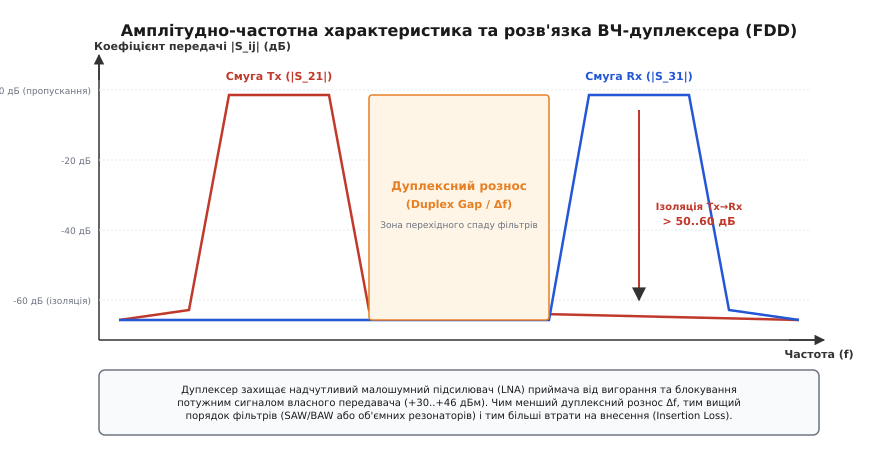
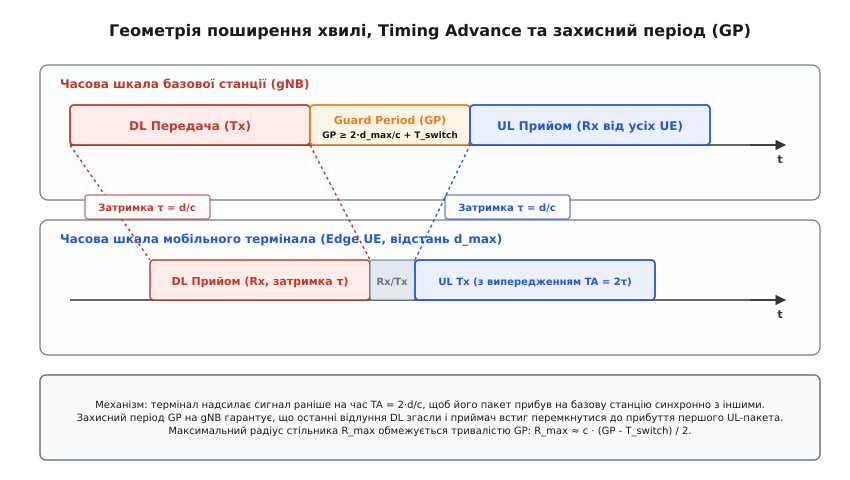
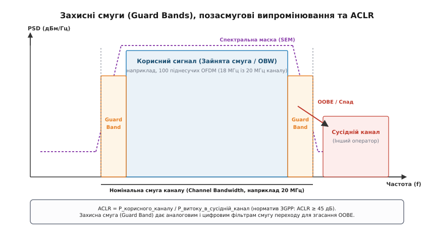

# Захисні смуги і дуплекс

<preknowlist>
- [Смуга і межа Шеннона](book:communications/bandwidth-capacity) — зв'язок ширини смуги частот, відношення сигнал/шум і граничної швидкості передачі інформації.
- [OFDM](book:communications/ofdm) — принцип ортогонального частотного мультиплексування та розподіл піднесучих.
- [Супергетеродин](book:communications/superheterodyne) — перетворення радіочастотного спектра та фільтрація дзеркальних завад.
- [Частотні діапазони](book:communications/frequency-bands) — особливості поширення радіохвиль у різних ділянках електромагнітного спектра.
</preknowlist>

Коли передавач базової станції стільникового зв'язку випромінює в антену потужність `+43 дБм` (20 Вт), розташований поруч власний приймач намагається вловити слабкий сигнал від віддаленого смартфона з рівнем `-100 дБм` (0.1 пВт). Різниця рівнів між цими двома сигналами на одній щоглі становить `143 дБ` — це фактор у `20 трильйонів разів`. Якщо енергія вихідного каскаду потрапить безпосередньо у вхідний малошумний підсилювач (LNA), чутливий напівпровідниковий перехід миттєво увійде в глибоке насичення або зазнає незворотного теплового пробою.

Ця фізична прірва між потужністю передачі та чутливістю прийому робить неможливим наївне підключення приймача й передавача до спільної антени на одній частоті. Щоб двосторонній радіозв'язок узагалі міг функціонувати, радіосистеми застосовують два взаємодоповнюючі механізми просторово-спектральної ізоляції: дуплексування (розділення напрямків передачі за частотою або за часом) та захисні смуги (виділення смуг мовчання між сусідніми частотними каналами для згасання неминучих позасмугових випромінювань).


*Частотний дуплекс (FDD) вимагає парного спектра й неперервно передає та приймає на різних частотах, тоді як часовий дуплекс (TDD) використовує єдину смугу, розділяючи слоти передачі й прийому захисними періодами.*

---

### Частотний дуплекс (FDD): ізоляція за спектром

Частотний дуплекс (англ. *Frequency Division Duplexing*, FDD, від латинського *duplex* — подвійний) вирішує проблему самоінтерференції шляхом рознесення напрямків передачі на дві різні центральні несучі частоти:
- **Висхідний канал** (англ. *Uplink*, UL) — передача від абонентського термінала до базової станції на частоті `f_UL`;
- **Низхідний канал** (англ. *Downlink*, DL) — передача від базової станції до абонентського термінала на частоті `f_DL`.

Обидва тракти працюють абсолютно одночасно й неперервно в часі: передавач базової станції випромінює дані 100% часу, і в цей самий момент приймач базової станції безперервно оцифровує вхідний ефір.

```
       ┌─────────────────────────────────────────────────────────────┐
       │                   СПЕКТРАЛЬНИЙ РОЗПОДІЛ FDD                 │
       └─────────────────────────────────────────────────────────────┘

       Потужність
           ▲
           │   ┌─────────────┐     Дуплексний рознос     ┌─────────────┐
           │   │   Uplink    │   (Duplex Gap / Δf_gap)   │  Downlink   │
           │   │    (UL)     │   ░░░░░░░░░░░░░░░░░░░░░   │    (DL)     │
           │   │             │   ░░░░░░░░░░░░░░░░░░░░░   │             │
           └───┴─────────────┴───┴───────────────────┴───┴─────────────┴──► Частота
               ▲             ▲                           ▲             ▲
               │             │                           │             │
              f1            f2                          f3            f4
               └──────┬──────┘                           └──────┬──────┘
                  Смуга UL                                  Смуга DL
```

#### Дуплексний рознос (Duplex Gap)
Ділянка спектра між верхньою межею смуги висхідного каналу `f2` та нижньою межею смуги низхідного каналу `f3` називається дуплексним розносом (англ. *Duplex Gap* або *Duplex Spacing*):

```
Δf_gap = f3 - f2
```

Дуплексний рознос — це не втрачений спектр, а фізично необхідна зона спаду амплітудно-частотної характеристики аналогових смугових фільтрів. Жоден реальний аналоговий фільтр не здатний забезпечити прямокутний зріз із нескінченною крутизною на одній частоті. Щоб передавальний фільтр послабив сигнал на `60..80 дБ` на частоті вхідного приймача, йому потрібен певний частотний інтервал перехідної смуги (англ. *Transition Band*).

Якщо дуплексний рознос занадто малий (наприклад, менше 2–3% від центральної частоти), порядок необхідного фільтра зростає до неприйнятних значень. Це різко збільшує кількість резонаторних секцій, габарити пристрою та втрати на внесення.

#### Апаратний радіочастотний дуплексер
Для підключення окремих передавача (Tx) і приймача (Rx) до єдиної спільної антени в FDD-системах використовують радіочастотний дуплексер (англ. *RF Duplexer*). Це трипортовий пасивний вузол, який об'єднує два незалежних смугових фільтри з високою добротністю:

1. **Фільтр передавача (Tx Bandpass Filter):** розташований між виходом підсилювача потужності (PA) та антеною. Він вільно пропускає частоти передачі `f_DL` (коефіцієнт передачі `|S_21| ≈ -1..-1.5 дБ`) і глибоко пригнічує будь-який шум на частоті прийому `f_UL` (коефіцієнт передачі `|S_21| < -60 дБ`).
2. **Фільтр приймача (Rx Bandpass Filter):** розташований між антеною та входом малошумного підсилювача (LNA). Він пропускає слабкий сигнал `f_UL` (коефіцієнт `|S_31| ≈ -1.5..-2 дБ`) і блокує сигнал потужного передавача `f_DL` (коефіцієнт `|S_31| < -60..-70 дБ`).


*АЧХ фільтрів дуплексера показує глибоке пригнічення (понад 60 дБ) на частоті сусіднього тракту та роль дуплексного розносу як зони перехідного спаду фільтрів.*

Технологія виготовлення дуплексера залежить від робочої частоти та потужності:
- **У смартфонах та мобільних терміналах** застосовують мікроелектромеханічні акустичні резонатори — фільтри на поверхневих акустичних хвилях (SAW, Surface Acoustic Wave) або на об'ємних акустичних хвилях (BAW, Bulk Acoustic Wave). BAW-фільтри мають добротність `Q > 1500..2500` на частотах до 3 ГГц, що дозволяє реалізувати крутий спад у корпусі розміром `2×1.6 мм`.
- **На базових станціях**, де потужність передавача сягає 40–80 Вт, акустичні фільтри руйнуються від нагріву. Там застосовують масивні металеві або керамічні об'ємні коаксіальні діелектричні резонатори (англ. *Cavity Filters*), налаштовані за допомогою підлаштовних гвинтів.

Втрати на внесення (Insertion Loss, IL) дуплексера становлять від 1.5 до 2.5 дБ. Це означає, що понад 30% вихідної потужності підсилювача марно перетворюється на тепло, а коефіцієнт шуму приймача погіршується на ті самі 1.5–2.5 дБ (`NF_sys = NF_LNA + IL_duplexer`), що безпосередньо зменшує граничну дальність зв'язку. Крім того, у металевих контактах та роз'ємах дуплексера через високу потужність виникає пасивна інтермодуляція (Passive Intermodulation, PIM). Продукти нелінійної взаємодії 3-го порядку (`2·f_DL1 - f_DL2`) можуть потрапити точно в смугу прийому `f_UL`, створюючи нездоланний внутрішній рівень шуму. Для запобігання цьому вузли базових станцій вимагають сертифікації за рівнем PIM нижче `-160..-165 дБн`.

> 🔧 **Навіщо це.** Дуплексер дозволяє базовій станції та смартфону використовувати один кабель живлення та одну спільну антену для одночасної передачі й прийому на гігабітних швидкостях без випалювання вхідних кіл.

---

### Часовий дуплекс (TDD): ізоляція за часом

Часовий дуплекс (англ. *Time Division Duplexing*, TDD) відмовляється від частотного розділення. І передача Downlink, і прийом Uplink відбуваються на **одній і тій самій центральній частоті** `f₀`, але рознесені в часі на неперетинні інтервали — часові слоти (англ. *Time Slots*).

```
       ┌─────────────────────────────────────────────────────────────┐
       │                     ЧАСОВА СТРУКТУРА TDD                    │
       └─────────────────────────────────────────────────────────────┘

       Час (t) ──►
       ┌───────────────┬──────┬───────────────┬───────────────┬──────┐
       │   Downlink    │  GP  │    Uplink     │   Downlink    │  GP  │
       │     (Tx)      │  ░░  │     (Rx)      │     (Tx)      │  ░░  │
       └───────────────┴──────┴───────────────┴───────────────┴──────┘
       ◄──────────────►◄─────►◄──────────────►◄──────────────►◄─────►
           Слот DL       GP       Слот UL         Слот DL       GP
```

У системі TDD важкий і дорогий дуплексер повністю відсутній. Його замінює надшвидкий напівпровідниковий радіочастотний комутатор SPDT (Single Pole Double Throw) на основі кремній-на-ізоляторі (RF SOI), арсеніду галію (GaAs pHEMT) або нітриду галію (GaN HEMT). Коли базова станція передає блок DL, комутатор підключає антену до виходу підсилювача потужності (PA), ізолюючи вхідний LNA на `40..50 дБ`. Коли настає слот прийому UL, комутатор за менш ніж `0.5..1.0 мкс` перемикає антену на вхід LNA, а живлення з вихідних каскадів PA знімається.

Втрати комутатора TDD становлять лише `0.3..0.6 дБ`, що зберігає потужність передавача та коефіцієнт шуму приймача. Проте комутація потужного радіосигналу вимагає ретельного контролю динамічних фронтів: зняття потужності з PA (Ramp-down) та набір потужності (Ramp-up) тривають близько `1..2 мкс`. Якщо комутатор розімкне коло до повного спаду напруги PA, виникає імпульсний спектральний сплеск (англ. *Transient Splatter*), який засмічує сусідні частотні канали.

#### Захисний період (Guard Period, GP) та затримка поширення
Перемикання між передачею та прийомом не може відбуватися миттєво через скінченну швидкість поширення радіохвиль. Електромагнітна хвиля долає 1 кілометр у просторі за `3.33 мкс` (зі швидкістю світла `c ≈ 3·10⁸ м/с`).

Якщо абонент перебуває на краю стільника на відстані `R = 15 км` від базової станції, сигнал низхідного каналу DL дійде до нього із затримкою:

```
τ = R / c = 15 000 м / 3·10⁸ м/с = 50 мкс
```

Термінал приймає останній символ DL, перемикає свій тракт на передачу за час `T_switch,UE` (близько 10–15 мкс) і починає передавати пакет UL. Щоб цей пакет прибув на базову станцію синхронно з пакетами інших абонентів (вирівнювання за часом), термінал випромінює його з часовим випередженням — Timing Advance:

```
TA = 2 · τ = 2 · 50 мкс = 100 мкс
```


*Захисний період (GP) поглинає подвійну затримку поширення сигналу до найвіддаленішого абонента стільника та час апаратного перемикання трансиверів.*

Щоб відлуння передачі DL базової станції повністю згасли, а сигнал від найвіддаленішого абонента встиг повернутися до початку вікна прийому, між блоками DL та UL вводиться пауза повного радіомовчання — захисний період (англ. *Guard Period*, GP). Тривалість захисного періоду обмежує граничний радіус стільника `R_max`:

```
T_GP ≥ 2 · R_max / c + T_switch + τ_ds
```

де `τ_ds` — розкид затримок багатопроменевості (Delay Spread). Детальне математичне виведення цієї формули, розрахунок для конфігурацій LTE та 5G NR і оцінка втрат ємності розібрані у вставці [Розрахунок захисного періоду і радіуса стільника в TDD](book:communications/guard-band-duplexing/math-guard-period.md).

#### Взаємність каналу (Reciprocity) і прорив Massive MIMO
Головною фундаментальною перевагою TDD над FDD є принцип взаємності радіоканалу (англ. *Channel Reciprocity*).

Оскільки передача DL і прийом UL відбуваються на **одній і тій самій частоті** `f₀`, просторові амплітудно-фазові спотворення сигналу на шляху «базова станція → смартфон» точно дорівнюють спотворенням на шляху «смартфон → базова станція»:

```
H_DL = (H_UL)ᵀ
```

Базовій станції 5G з масивною решіткою на 64 антени (Massive MIMO 64T64R) достатньо прийняти від смартфона один короткий зондувальний пілот-сигнал (Sounding Reference Signal, SRS). Вимірявши вектор `H_UL` на своїх 64 приймачах, станція миттєво отримує точну матрицю каналу `H_DL` і формує сфокусований вузький промінь (Beamforming) безпосередньо в напрямку користувача.

У системі FDD частоти DL і UL рознесені на десятки мегагерц. Багатопроменеві завмирання на цих частотах є повністю незалежними, взаємність не діє, і смартфон змушений самостійно вимірювати 64 пілот-сигнали та надсилати важкі цифрові звіти CSI назад по висхідному каналу, що робить повноцінний цифровий Massive MIMO у FDD вкрай неефективним.

#### Вимоги до синхронізації та міжстільникова інтерференція (CLI)
Оскільки в TDD передача та прийом сусідніх базових станцій відбуваються на одній частоті, будь-яка асинхронність призводить до катастрофічної перехресної інтерференції (Cross-Link Interference, CLI). Якщо одна станція випромінює `+46 дБм` у слоті DL, а сусідня станція на тій самій щоглі намагається приймати слабкий сигнал UL `-100 дБм`, пряме випромінювання засліплює приймач на відстані десятків кілометрів.

Щоб запобігти цьому, мережі TDD вимагають суворої синхронізації часу й фази:
- точність синхронізації між усіма базовими станціями повинна становити `|Δt| ≤ ±1.5 мкс`;
- опорний сигнал часу отримують від супутникових систем GNSS (GPS/Galileo) або через наземну мережу за протоколом IEEE 1588v2 PTP (профіль G.8275.1);
- у разі втрати сигналу супутників генератори станції (термостатовані кварцові генератори OCXO або рубідієві стандарти) зобов'язані утримувати фазовий зсув (Holdover) у межах нормативу протягом 4–24 годин.

#### Динамічний TDD (Dynamic TDD) та координація CLI у 5G-Advanced
У класичному TDD конфігурація чергування слотів є статичною для всієї мережі. Проте реальне абонентське навантаження в місті флуктує: в одному офісному стільнику потрібен максимальний Downlink для завантаження презентацій, а в сусідньому — максимальний Uplink для прямої трансляції відео.

Технологія Dynamic TDD (3GPP Release 16/17) дозволяє кожній базовій станції автономно перемикати напрямок окремих гнучких слотів залежно від черги пакетів. Для боротьби з неминучою міжстільниковою інтерференцією базові станції обмінюються інформацією про конфігурацію слотів через інтерфейс `Xn` і призначають терміналам вимірювання завад за двома новими метриками:
- **CLI-RSSI** (*Cross-Link Received Signal Strength Indicator*) — вимір сумарної потужності завади в слотах мовчання;
- **CLI-RSRP** (*Cross-Link Reference Signal Received Power*) — селективний вимір потужності пілотів SRS, випромінених терміналами сусідніх стільників.

Якщо виявляється ризик перехресного засліплення, планувальник базової станції або формує нулі просторової діаграми спрямованості (Spatial Nulling) у бік джерела завади, або тимчасово повертає слот до загального статичного формату.

Детальне порівняння параметрів, спектральної ефективності, втрат на комутаторах та експлуатаційних особливостей обох технологій наведено у вставці [Порівняння FDD і TDD: архітектура, спектр та ефективність](book:communications/guard-band-duplexing/comp-fdd-tdd.md).

---

### Захисні смуги (Guard Bands) у частотній області

Якщо дуплексування розділяє зустрічні потоки всередині однієї системи, то захисні смуги (англ. *Guard Bands*) запобігають взаємним завадам між сусідніми частотними каналами різних операторів або різних радіотехнологій.

```
       ┌─────────────────────────────────────────────────────────────┐
       │              ЗАХИСНІ СМУГИ ТА СУСІДНІ КАНАЛИ                │
       └─────────────────────────────────────────────────────────────┘

       PSD
        ▲
        │          ┌───────────────────────┐
        │          │    Корисний сигнал    │
        │          │   (Occupied BW, OBW)  │
        │      ┌───┤                       ├───┐
        │      │GB │                       │GB │    Сусідній канал
        │   ───┴───┴───────────────────────┴───┴───┌───────────────┐
        └───░░░░░░░────────────────────────░░░░░░░─┴───────────────┴──► f
            ◄─GB──►◄────── 18.0 МГц ──────►◄─GB──►
            ◄────────────── 20.0 МГц ────────────►
```

#### Неможливість ідеального спектрального обмеження
З теореми Фур'є випливає фундаментальний принцип: сигнал не може бути одночасно строго обмеженим у часі і строго обмеженим за частотою.

Будь-який цифровий символ, що передається за скінченний час `T`, має прямокутне або згладжене вікно у часовій області. Його спектр являє собою згортку з функцією `sinc(f)`, бічні пелюстки якої спадають дуже повільно (`1/f`).

Крім того, вихідні транзистори підсилювача потужності (PA) мають нелінійну вольт-амперну характеристику. При підсиленні багаточастотних сигналів OFDM із високим відношенням пікової потужності до середньої (PAPR 8–11 дБ) нелінійність 3-го порядку породжує інтермодуляційні складові виду `2·f₁ - f₂`. Цей процес називається відростанням спектра (англ. *Spectral Regrowth*). Енергія сигналу вихлюпується за межі номінальної смуги, створюючи позасмугові випромінювання (Out-Of-Band Emissions, OOBE).

Міжнародний союз електрозв'язку (ITU-R SM.329) строго розмежовує дві області небажаних випромінювань:
1. **Позасмугова область (Out-Of-Band Domain):** ділянка спектра безпосередньо біля краю каналу в межах від 0 до 250% ширини смуги сигналу. Тут домінує інтермодуляційне відростання спектра та хвости передавальних фільтрів.
2. **Область побічних випромінювань (Spurious Domain):** ділянка спектра на віддаленні понад 250% від ширини каналу, де нормуються паразитичні гармоніки гетеродина (`2·f₀`, `3·f₀`) та паразитні коливання синтезаторів частоти (жорстке обмеження потужності до `-30..-36 дБм`).


*Захисні смуги по краях каналу надають фізичний простір для спаду позасмугових випромінювань (OOBE) передавача, забезпечуючи виконання нормативів маски SEM та показника ACLR.*

#### Спектральна маска випромінювання (SEM) та ACLR
Для захисту сусідніх смуг регулятори стандартизують два ключових критерії чистоти передавача:

1. **Спектральна маска випромінювання (Spectral Emission Mask, SEM):** жорстка ступінчаста гранична лінія максимальної потужності залежно від частотного відступу `Δf` від краю каналу. Жодна точка спектра передавача не має права перетнути цю межу.
2. **Коефіцієнт витоку потужності в сусідній канал (Adjacent Channel Leakage Ratio, ACLR):** інтегральне відношення потужності, випроміненої в призначеному каналі, до потужності, що витекла в сусідній канал іншого оператора:

```
ACLR = 10 · log₁₀(P_carrier / P_adjacent)
```

Норматив 3GPP вимагає, щоб для базових станцій `ACLR ≥ 45 дБ`. Це означає, що енергія завади в сусідньому каналі повинна бути щонайменше в 31 600 разів нижчою за корисний сигнал.

#### Роль захисних смуг (Guard Bands)
Захисна смуга — це незайнятий інтервал спектра по краях номінального каналу, всередині якого базова станція навмисно не розміщує активні піднесучі.

Захисна смуга виконує роль «буферної зони»:
- вона надає цифровим фільтрам передавача (Root-Raised Cosine, поліфазним фільтрам f-OFDM) частотний інтервал для плавного спаду потужності нижче маски SEM;
- вона компенсує спад інтермодуляційних плечей підсилювача потужності після роботи системи цифрового передіспотворення (DPD);
- вона захищає аналогові вхідні фільтри сусіднього приймача від блокування.

У стандарті 4G LTE для каналу 20 МГц під захисні смуги відведено рівно `10%` спектра: 100 активних ресурсних блоків займають `18.0 МГц`, а по `1.0 МГц` зліва та справа залишаються порожніми.

У стандарті 5G NR завдяки впровадженню субсмугової цифрової фільтрації (Filtered-OFDM) крутизна спаду спектра на краях каналу зросла. Це дозволило скоротити захисні смуги до менш ніж `2%`: у каналі 100 МГц (Band n78) корисний сигнал займає `98.28 МГц` (273 ресурсні блоки).

Повний алгоритм розрахунку ACLR методом Велча, верифікація кусково-лінійної маски SEM та працюючий вихідний код мовами C і C++ наведені у практичній вставці [Розрахунок ACLR та перевірка спектральної маски випромінювання](book:communications/guard-band-duplexing/proj-spectral-mask-aclr.md).

---

### Агрегація несучих (Carrier Aggregation) та захисні інтервали

При об'єднанні кількох несучих у технології Carrier Aggregation (CA) розрізняють два сценарії формування спектра:

1. **Неперервна внутрішньосмугова агрегація (Intra-Band Contiguous CA):**
   Два або більше сусідніх каналів одного оператора об'єднуються в єдиний широкий логічний блок. Захисні смуги між внутрішніми несучими повністю усуваються. Центральні частоти каналів підбираються за формулою номінального розносу несучих:

```
f_spacing = ⌊ (BW₁ + BW₂ - 0.1 · |BW₁ - BW₂|) / (2 · 0.3) ⌋ · 0.3 МГц
```

   Крок сітки `300 кГц` узгоджує піднесучі OFDM (кратні 15 кГц та 100 кГц растру каналів), що забезпечує повну взаємну ортогональність сигналів без потреби у внутрішніх захисних смугах. Зовнішні захисні смуги залишаються лише на зовнішніх краях об'єднаного блоку.

2. **Розрізнена агрегація (Inter-Band та Intra-Band Non-Contiguous CA):**
   Якщо смуги оператора розділені спектром іншого провайдера, кожна несуча розглядається як автономний передавач і вимагає повного набору захисних смуг та власної перевірки SEM з обох боків.

---

### Гібридні схеми: Додатковий низхідний і висхідний канал (SDL та SUL)

Для подолання природного дисбалансу між радіусом дії низьких та високих частот у 5G NR впроваджено гібридні архітектури, що поєднують FDD та TDD:

1. **Додатковий висхідний канал (Supplementary Uplink, SUL):**
   Основний трафік передається у високошвидкісному TDD-діапазоні n78 (3.5 ГГц) із широкою смугою 100 МГц та антенами Massive MIMO. Оскільки потужність передавача смартфона обмежена акумулятором (+23 дБм або 200 мВт), на краю стільника передача UL на частоті 3.5 ГГц зазнає високого згасання. Для вирішення цієї проблеми термінал динамічно перемикає передачу Uplink на низькочастотний FDD-діапазон (наприклад, Band n28 700 МГц або Band n20 800 МГц), тоді як важкий Downlink продовжує надходити на частоті 3.5 ГГц. Це ліквідує «розрив покриття» TDD, збільшуючи дальність дії стільника на 50–100%.
2. **Додатковий низхідний канал (Supplementary Downlink, SDL):**
   Оператор використовує непарний блок низькочастотного спектра (наприклад, 1400 МГц, Band n75) виключно для односторонньої передачі Downlink на додаток до основного FDD-тракту. Оскільки на цій смузі немає прийому UL, дуплексер відсутній, що спрощує проектування RF-тракту.

---

### Співіснування на межах діапазонів: практичні інженерні кейси

Захисні смуги є головним інструментом регулювання радіочастотних конфліктів між несумісними радіослужбами:

#### 1. Мережі 5G C-Band проти авіаційних радіовисотомірів
При розгортанні 5G NR у діапазоні n77/n78 (3.7–3.98 ГГц) у США виникла гостра суперечка між операторами зв'язку та Федеральним авіаційним управлінням (FAA). Радіовисотоміри пасажирських літаків працюють у смузі 4.2–4.4 ГГц. Застарілі аналогові фільтри вхідних трактів висотомірів мали пологий спад АЧХ, через що потужні сигнали 5G з щогл поблизу аеропортів могли перевантажити їхні приймачі.

Рішенням регулятора FCC стало створення обов'язкової **захисної смуги шириною 220 МГц** (інтервал 3.98–4.20 ГГц залишено вільним від стільникового зв'язку) та обмеження кутів нахилу антен біля злітно-посадкових смуг.

#### 2. Спеціальний діапазон громадської безпеки Band 14 (FirstNet 700 MHz)
У США діапазон 758–768 МГц (DL) / 788–798 МГц (UL) виділено для Національної мережі служб екстреної допомоги (FirstNet). Безпосередньо поруч розташовані комерційні смуги мобільних операторів та телевізійні передавачі DVB/ATSC. Щоб виключити блокування рацій поліції та швидкої допомоги комерційними смартфонами, у стандарті 3GPP для Band 14 було впроваджено спеціальні фільтри BAW підвищеної добротності та розширені внутрішні захисні смуги.

---

### Порівняльна панорама технологій бездротового зв'язку

Різні стандарти бездротового зв'язку обирають дуплексні схеми відповідно до фізики поширення радіохвиль, доступності частотного ресурсу та характеру абонентського трафіку:

#### 1. Мобільний зв'язок 4G LTE та 5G NR
- **Діапазони нижче 1 ГГц (LTE Band 20 800 МГц, Band 28 700 МГц, Band 8 900 МГц):** побудовані за схемою **FDD**. Довгі радіохвилі мають низьке згасання і велику дальність покриття (до 15–30 км). Неперервна передача FDD без пауз GP максимізує енергетичний потенціал лінії зв'язку для віддалених абонентів.
- **Середні діапазони C-Band (5G Band n77/n78 3.3–3.8 ГГц):** побудовані виключно за схемою **TDD** із широкими смугами 100 МГц. Поєднання непарного спектра, гнучкої асиметрії трафіку (наприклад, 4:1 на користь завантаження) та антенних решіток Massive MIMO 64T64R на основі взаємності каналу забезпечує гігабітні пікові швидкості.
- **Міліметрові хвилі mmWave (5G Band n257/n258 26–28 ГГц):** виключно **TDD**. Смуги шириною 400–800 МГц роблять побудову аналогових дуплексерів неможливою, тоді як високочастотні комутатори перемикаються за наносекунди.

#### 2. Бездротові мережі Wi-Fi (IEEE 802.11a/b/g/n/ac/ax/be)
Усі покоління Wi-Fi використовують **напівдуплексний TDD-доступ** у неліцензованих смугах 2.4 ГГц, 5 ГГц та 6 ГГц. Оскільки спектр є відкритим для всіх пристроїв, жорстка синхронізація кадрів неможлива. Замість неї застосовують протокол випадкового доступу CSMA/CA (Listen-Before-Talk): точка доступу та клієнти слухають ефір і передають пакети почергово, розділяючи передачі часовими захисними інтервалами SIFS (Short Interframe Space) та DIFS (DCF Interframe Space).

#### 3. Магістральні радіорелейні лінії (РРЛ)
Радіорелейний зв'язок «точка-точка» на частотах 13, 18, 23 та 80 ГГц (E-band) традиційно використовує **FDD** із масивним дуплексним розносом (від 1000 МГц до 10 ГГц). Це забезпечує симетричну передачу магістрального трафіку базових станцій із гарантованою фіксованою затримкою менше 0.1 мс без жодних часових колізій.

---

### Горизонт розвитку: повнодуплексний зв'язок на одній частоті (IBFD)

Історично радіоінженерія вважала одночасну передачу й прийом на одній частоті неможливою. Проте в стандартах майбутніх поколінь (5G-Advanced та 6G) активно досліджується технологія повнодуплексного зв'язку в єдиній смузі (англ. *In-Band Full Duplex*, IBFD).

```
       ┌─────────────────────────────────────────────────────────────┐
       │                  БАГАТОСТУПЕНЕВА СИСТЕМА SIC                │
       └─────────────────────────────────────────────────────────────┘

       Передавач (+40 дБм) ───┬───────────────────────────────► Антена
                              │
                      Опорна копія Tx
                              │
                              ▼
                     ┌─────────────────┐
                     │ Аналоговий SIC  │  (подавлення на 50 дБ)
                     └────────┬────────┘
                              │
                              ▼
        Антена ────────► [ Змішувач ] ──► [ АЦП ] ──► ┌─────────────────┐
       (Прийом Rx:            ▲                       │  Цифровий SIC   │ (подавлення на 45 дБ)
        -95 дБм)              │                       └────────┬────────┘
                              │                                │
                       Опорний сигнал                          ▼
                                                        Чистий корисний
                                                          сигнал Rx
```

Щоб реалізувати IBFD, приймач повинен придушити сигнал власного передавача на `100..115 дБ` за допомогою триступеневої системи придушення самоінтерференції (Self-Interference Cancellation, SIC):
1. **Просторова ізоляція антен:** використання роздільних антен передавача й прийому з крос-поляризацією або екрануванням (дає `30..40 дБ` розв'язки).
2. **Аналогове радіочастотне віднімання (RF SIC):** відгалуження частини вихідного сигналу PA через регульовані фазообертачі та атенюатори і віднімання його в протифазі безпосередньо на вході LNA до потрапляння в АЦП (дає додаткові `45..55 дБ` пригнічення).
3. **Цифровий нелінійний компенсатор (Digital SIC):** після оцифрування в сигнальному процесорі залишкова завада фільтрується за адаптивними поліноміальними моделями з пам'яттю (дає ще `35..45 дБ`).

Сумарне придушення сягає `115–120 дБ`, що дозволяє приймати слабкий сигнал на тлі власної передачі на тій самій несучій, теоретично подвоюючи спектральну ємність каналу без розширення смуги частот.

---

### Підсумковий інженерний висновок

Ізоляція напрямків зв'язку та спектральних каналів — це фундамент радіозв'язку. FDD забезпечує неперервність і детерміновану затримку ціною громіздких пасивних фільтрів дуплексера та необхідності пошуку парного спектра. TDD оптимізує використання непарного спектра й відкриває шлях до адаптивного формування променів Massive MIMO, вимагаючи натомість суворої фазової мікросекундної синхронізації та виділення захисних періодів GP. Захисні смуги (Guard Bands) забезпечують фізичний буфер для реальних фільтрів та нелінійних підсилювачів, гарантуючи співіснування тисяч незалежних радіомереж у спільному просторі ефіру.
