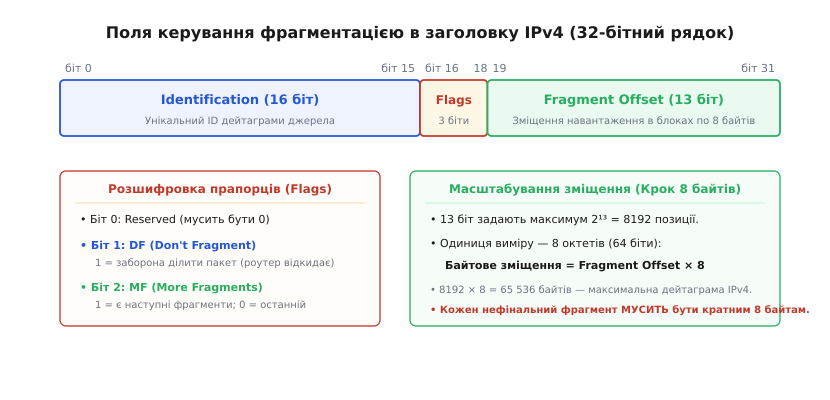
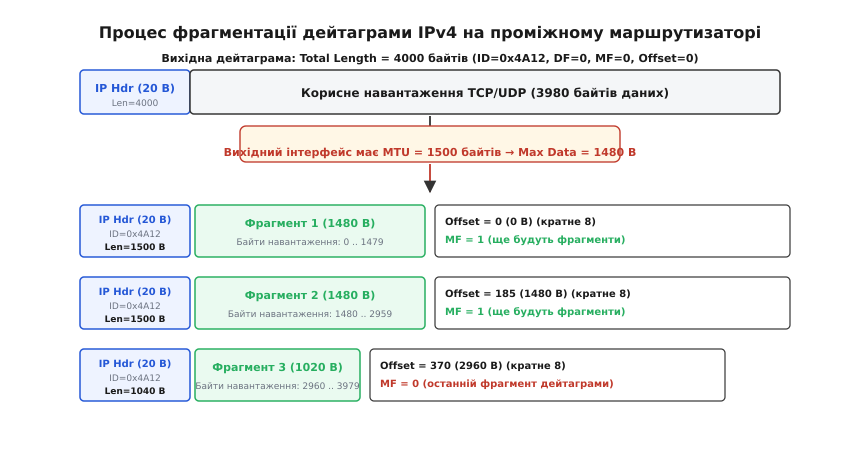
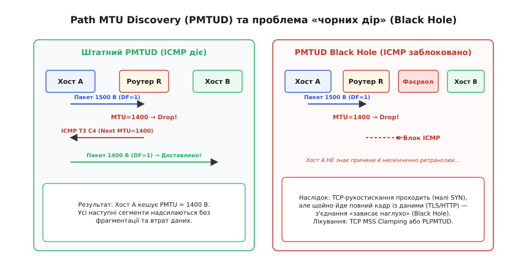
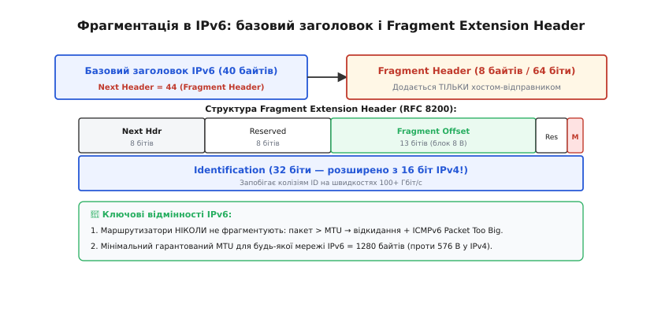
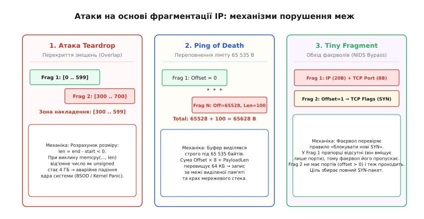

# MTU і фрагментація IP: механіка, Path MTU та вразливості

<preknowlist>
- [Кадр Ethernet](topic:communications/ethernet-frame) — максимальний розмір корисного навантаження канального рівня (MTU 1500 байтів) та структура кадру.
- [IP-маршрутизація](topic:communications/ip-routing) — просування пакетів між мережами через проміжні маршрутизатори (next-hop).
- [Контрольна сума CRC](topic:communications/crc) — виявлення пошкодження кадрів на канальному рівні.
- [Затримка й надійність](topic:communications/latency-reliability) — вплив втрат окремих пакетів на пропускну здатність та повторні передачі.
</preknowlist>

Сервер у дата-центрі генерує відповідь розміром 4000 байтів і передає її мережевому адаптеру з підтримкою гігабітного зв'язку. Локальний комутатор працює зі стандартними кадрами, де максимальний блок корисних даних обмежено 1500 байтами. На шляху до клієнта трафік проходить крізь тунель провайдера PPPoE, де через додаткові службові заголовки доступний простір звужується до 1492 байтів, а згодом — крізь мобільну мережу LTE. Якщо мережевий рівень не узгодить розміри блоків або не зможе адаптувати великий пакет до вузьких каналів зв'язку, передача даних повністю зупиниться: пакети відкидатимуться проміжним обладнанням, а застосунок зависне в очікуванні підтвердження.

Щоб об'єднати тисячі несумісних фізичних середовищ у глобальну систему, мережевий протокол IP використовує два взаємодоповнюючі механізми: узгодження максимального розміру блоку передачі даних та примусове розрізання дейтаграм на частини.

### Анатомія обмеження: що таке MTU і чому він різний

Кожне фізичне середовище передачі даних має межу максимального обсягу інформації, яку можна помістити в один неподільний кадр канального рівня. Ця величина зветься **MTU** (англ. *Maximum Transmission Unit* — «максимальна одиниця передачі»). Важливо розрізняти повний розмір кадру канального рівня та його MTU: заголовок Ethernet (14 байтів), тег [VLAN 802.1Q](topic:communications/vlan-and-trunking) (4 байти) та кінцева [контрольна сума CRC](topic:communications/crc) (4 байти) формують обрамлення кадру, тоді як MTU визначає виключно простір для вкладеного IP-пакета.

```
+-------------------+---------------------------------------------+---------+
| Ethernet Header   | IP Packet Payload (MTU = 1500 байтів)       | FCS/CRC |
| 14 байтів         | IP Header (20 B) + TCP/UDP Data (1480 B)    | 4 байти |
+-------------------+---------------------------------------------+---------+
|<-------------------------- Повний кадр = 1518 байтів -------------------->|
```

Фізична та інженерна необхідність обмеження MTU зумовлена трьома факторами:
1. **Ймовірність бітової помилки (Bit Error Rate, BER):** Чим довший безперервний блок передається фізичним каналом, тим вища ймовірність того, що випадкова завада спотворить хоча б один біт. При пошкодженні одного біта канальний рівень відкидає весь кадр цілком. Для мідного кабелю [Ethernet](topic:communications/ethernet-frame) компроміс між накладними витратами заголовків та надійністю було знайдено на рівні 1500 байтів.
2. **Монополізація каналу та затримка (Serialization Delay):** Передача гігантського кадру на низькошвидкісному лінку (наприклад, 64 кбіт/с) блокує лінію на сотні мілісекунд, унеможливлюючи своєчасну доставку чутливого до затримок голосового або керуючого трафіку.
3. **Обмеження апаратних буферів:** Мережеві комутатори та маршрутизатори виділяють швидку буферну пам'ять (SRAM) фіксованими сторінками під кожен порт. Фіксація стелі MTU гарантує передбачуваність споживання пам'яті.

Різні технології канального рівня історично обрали власні ліміти MTU: класичний Ethernet — 1500 байтів, Wi-Fi (802.11) — до 2304 байтів, тунелі PPPoE — 1492 байти, оптичні магістралі FDDI — 4352 байти, а віртуальні комутатори сучасних дата-центрів із підтримкою *Jumbo Frames* — 9000 байтів. Оскільки [IP-маршрутизація](topic:communications/ip-routing) пересилає пакети крізь довільні комбінації цих мереж, протокол IP змушений вирішувати проблему невідповідності розмірів на льоту.

> 🔧 **Навіщо це.** Якщо ви налаштовуєте VPN-тунель (WireGuard, OpenVPN, IPsec) або оверлейну мережу контейнерів (VXLAN у Kubernetes), додаткові заголовки інкапсуляції відбирають від 50 до 80 байтів від стандартного MTU 1500. Якщо не скоригувати MTU на віртуальних інтерфейсах, пакети почнуть фрагментуватися або губитися, що призведе до раптового падіння швидкості завантаження файлів при збереженні видимості відмінного пінгу.

### Поля керування фрагментацією в заголовку IPv4

Щоб забезпечити можливість розбиття пакета на частини та його наступного відновлення, у базовий 20-байтний заголовок IPv4 було закладено спеціальний 32-бітний рядок параметрів. Процес розбиття дейтаграми на менші частини отримав назву **фрагментація** (лат. *fragmentum* — «уламок, шматок»).


*32-бітний рядок заголовка IPv4 містить поле Identification (16 біт), 3 біти прапорців Flags (Reserved, DF, MF) та поле Fragment Offset (13 біт). Зміщення вимірюється блоками по 8 байтів, що дозволяє адресувати весь простір 65 536 байтів дейтаграми за допомогою 13 бітів.*

Цей рядок складається з трьох ключових полів:

1. **Ідентифікатор (Identification, 16 біт):** Унікальне число, яке призначається вихідною операційною системою для кожної нової дейтаграми. Коли маршрутизатор розрізає пакет на кілька частин, він копіює це значення в заголовки **всіх** утворених фрагментів. Отримувач використовує `Identification` у поєднанні з IP-адресою джерела, IP-адресою призначення та номером протоколу, щоб відокремити фрагменти одного пакета від фрагментів інших потоків.

2. **Прапорці (Flags, 3 біти):**
   - *Біт 0 (Reserved):* Зарезервований, обов'язково встановлюється в `0`.
   - *Біт 1 — DF (Don't Fragment — «не фрагментувати»):* Якщо `DF = 1`, відправник прямо забороняє будь-якому проміжному маршрутизатору фрагментувати цей пакет. Якщо дейтаграма з `DF = 1` перевищує MTU вихідного порту, роутер зобов'язаний негайно відкинути її та згенерувати повідомлення про помилку. Якщо `DF = 0`, маршрутизаторам дозволено ділити пакет.
   - *Біт 2 — MF (More Fragments — «ще є фрагменти»):* Вказує, чи є цей фрагмент проміжним. Значення `MF = 1` сигналізує: «це не кінець дейтаграми, позаду йдуть наступні частини». Значення `MF = 0` означає: «це останній (фінальний) фрагмент дейтаграми» (або пакет взагалі не був фрагментований, якщо при цьому зміщення дорівнює нулю).

3. **Зміщення фрагмента (Fragment Offset, 13 біт):** Вказує позицію початку корисних даних поточного фрагмента відносно початку вихідного нефрагментованого навантаження.
   
   Оскільки поле зміщення має довжину лише 13 біт, воно може приймати значення від 0 до `2¹³ - 1 = 8191`. Проте максимальна довжина дейтаграми IPv4 становить 65 535 байтів. Щоб адресувати 64 кілобайти тринадцятьма бітами, розробники IPv4 застосували масштабування: **одиницею виміру зміщення є блок із 8 байтів (64 біти)**.

```
Байтове зміщення в дейтаграмі = Fragment Offset × 8
```

Звідси випливає залізне інженерне правило: **корисне навантаження будь-якого проміжного фрагмента (`MF = 1`) зобов'язане мати довжину, строго кратну 8 байтам**. Тільки останній фрагмент (`MF = 0`) може мати довільну довжину, оскільки за ним більше немає зміщень.

### Механіка проміжної фрагментації маршрутизатором

Коли транзитний маршрутизатор приймає IP-пакет, він звіряє значення поля `Total Length` із MTU того інтерфейсу, у який пакет має бути спрямований згідно з таблицею маршрутизації. Якщо довжина перевищує MTU, а біт `DF` дорівнює нулю, запускається процедура фрагментації на льоту.


*Розрізання дейтаграми розміром 4000 байтів при переході на лінк із MTU 1500 байтів. Максимальний обсяг даних на фрагмент становить 1480 байтів (кратно 8). Перші два фрагменти мають MF=1 та зміщення 0 і 185 (1480 B), третій фрагмент містить залишок 1020 байтів з MF=0 та зміщенням 370 (2960 B).*

Алгоритм розрізання дейтаграми виконується за такими кроками:

1. **Визначення максимального розміру навантаження (`MaxPayload`):**
   Маршрутизатор бере вихідний MTU (наприклад, 1500 байтів), віднімає довжину IP-заголовка (20 байтів) і округлює результат униз до найближчого числа, кратного 8:
   ```
   MaxPayload = floor((1500 - 20) / 8) * 8 = floor(1480 / 8) * 8 = 1480 байтів
   ```

2. **Поділ корисних даних:**
   Якщо вихідна дейтаграма мала `Total Length = 4000` байтів (20 байтів заголовок + 3980 байтів корисних даних TCP), дані розбиваються на три порції:
   - Порція 1: 1480 байтів (діапазон байтів `0 .. 1479`);
   - Порція 2: 1480 байтів (діапазон байтів `1480 .. 2959`);
   - Порція 3: 1020 байтів (діапазон байтів `2960 .. 3979`).

3. **Формування заголовків фрагментів:**
   Кожен фрагмент отримує повноцінний заголовок IP:
   - *Фрагмент 1:* `Total Length = 1500` (20 + 1480), `ID = 0x4A12`, `Flags: MF = 1`, `Offset = 0 / 8 = 0`.
   - *Фрагмент 2:* `Total Length = 1500` (20 + 1480), `ID = 0x4A12`, `Flags: MF = 1`, `Offset = 1480 / 8 = 185`.
   - *Фрагмент 3:* `Total Length = 1040` (20 + 1020), `ID = 0x4A12`, `Flags: MF = 0`, `Offset = 2960 / 8 = 370`.

4. **Копіювання опцій заголовка:**
   Якщо вихідний пакет містив додаткові опції IP (поле *Options*), не всі вони потрапляють у кожен фрагмент. Старший біт байта типу кожної опції (*Copied Flag*) визначає: копіювати цю опцію в усі фрагменти (наприклад, опції безпеки) чи залишити її виключно в першому фрагменті (наприклад, опції маршрутизації від джерела та штампи часу).

5. **Каскадна фрагментація:**
   Якщо утворений фрагмент розміром 1500 байтів далі на своєму шляху потрапляє в мережу з MTU 576 байтів, наступний маршрутизатор розрізає його повторно. При цьому значення `Fragment Offset` обчислюються відносно початкової дейтаграми, а прапорець `MF` успадковується. Детальний математичний та історичний аналіз еволюції цього підходу наведено у вставці [hist-fragmentation-evolution.md](topic:communications/ip-fragmentation-mtu/hist-fragmentation-evolution.md).

### Збирання дейтаграми на кінцевому хості (Reassembly)

Проміжні маршрутизатори ніколи не збирають фрагменти назад. Це фундаментальний наслідок принципу кінцевого зв'язку (англ. *end-to-end principle*): у дейтаграмних мережах фрагменти одного пакета можуть рухатися різними географічними маршрутами через динамічне балансування трафіку. Збирання дейтаграми здійснюється **виключно кінцевим отримувачем**.

Отримувач ідентифікує належність вхідного фрагмента за 4-кортежем `(Source IP, Destination IP, Protocol, Identification)`. У ядрі операційної системи (наприклад, у підсистемі `net/ipv4/ip_fragment.c` ядра Linux) створюється окрема черга збирання `ipq` (IPv4 Queue).

```
Вхідний фрагмент ---> [ Хеш-таблиця черг inet_frags ]
                             |
                             +---> Черга (Src, Dst, ID, Proto)
                                     |
                                     +-- [0 .. 1479]   (Frag 1)
                                     +-- [1480 .. 2959] (Frag 2)
                                     +-- [2960 .. 3979] (Frag 3, MF=0)
                                     |
                                     v
                        Дірок немає? -> Зібрати дейтаграму (4000 B)
```

Логіка збирання спирається на такі правила:
- **Відстеження прогалин:** Ядро веде карту отриманих інтервалів або список незаповнених проміжків (дірок). Щойно надійшов фрагмент із `MF = 0`, фіксується очікувана кінцева довжина навантаження (`Offset × 8 + PayloadLength`).
- **Таймер збирання (Reassembly Timer):** Пам'ять хоста обмежена, тому черга не може чекати вічно. Стандарт RFC 791 / RFC 1122 встановлює таймаут збирання від 30 до 60 секунд. Якщо за цей час хоча б один фрагмент не долетів, ядро повністю знищує всю чергу і вивільняє буфери.
- **Повідомлення про таймаут:** Якщо черга згоріла за таймаутом, а нульовий фрагмент (`Offset = 0`) був успішно отриманий, хост надсилає відправнику службове повідомлення `ICMP Type 11 Code 1` (*Time Exceeded: Fragment Reassembly Time Exceeded*). Якщо нульовий фрагмент було втрачено, ICMP не надсилається взагалі, оскільки отримувач не має заголовка вищого рівня для повернення контексту.

Програмну реалізацію алгоритму дефрагментатора мовами C та C++ з детальним аналізом безпеки буферів розібрано у вставці [proj-ip-reassembly.md](topic:communications/ip-fragmentation-mtu/proj-ip-reassembly.md).

### Чому фрагментацію вважають шкідливою

Хоча динамічна фрагментація вирішує проблему сумісності каналів, вона створює важкі побічні ефекти для надійності та безпеки мережі:

1. **Мультиплікація втрат:** Протокол IP не має механізму повторного запиту окремого фрагмента. Якщо дейтаграма розбита на 4 фрагменти, і на лінії втрачається лише один із них, кінцевий хост відкидає всі три успішно отримані фрагменти. Протокол TCP змушений повторно надсилати весь вихідний сегмент цілком. Якщо ймовірність втрати пакета на каналі дорівнює `p`, то ймовірність успішної доставки дейтаграми з `k` фрагментів падає до `(1 - p)^k`.
2. **Втрата контексту для фаєрволів (L4 Middleboxes):** Заголовки транспортного рівня (порти TCP/UDP, послідовні номери, прапорці `SYN`/`ACK`) містяться **виключно у першому фрагменті** (`Offset = 0`). Усі наступні фрагменти (`Offset > 0`) мають лише заголовок IP та сирі байти навантаження. Простий міжмережевий екран без підтримки стану (Stateless Firewall) не здатний визначити номер порту призначення для неперших фрагментів і змушений або пропускати їх наосліп, або блокувати весь фрагментований трафік.
3. **Проблема шлюзів [NAT](topic:communications/nat):** Шлюз трансляції адрес зобов'язаний переписувати порти. Якщо неперший фрагмент приходить раніше за перший через зміну маршруту, NAT-шлюз не знає, якому внутрішньому хосту належить цей фрагмент, і просто знищує його.

### Path MTU Discovery (PMTUD, RFC 1191)

Щоб усунути проміжну фрагментацію, у 1990 році було стандартизовано алгоритм **Path MTU Discovery (PMTUD, RFC 1191)**. Його мета — динамічно визначити мінімальний MTU на всьому шляху між двома хостами (**Path MTU, PMTU**) і змусити транспортний рівень відправника одразу генерувати пакети такого розміру, який пройде крізь усі проміжні канали без жодного розрізання.

Механізм PMTUD працює так:
1. Хост-відправник встановлює прапорець `DF = 1` у всіх вихідних пакетах IP і надсилає сегменти максимального розміру (наприклад, 1500 байтів).
2. Якщо на шляху трапляється вузький лінк (наприклад, тунель із MTU 1400 байтів), маршрутизатор бачить, що пакет завеликий, а біт `DF = 1` забороняє його ділити.
3. Маршрутизатор **відкидає пакет** і відправляє назад хосту-джерелу повідомлення `ICMP Type 3 Code 4` (*Destination Unreachable: Fragmentation Needed and DF set*).
4. Згідно з RFC 1191, у заголовок цього ICMP-повідомлення маршрутизатор обов'язково записує 16-бітне поле **Next-Hop MTU** (у нашому випадку — 1400).
5. Отримавши це повідомлення, стек протоколів хоста-відправника зберігає значення `PMTU = 1400` у своєму кеші маршрутизації (FIB cache).
6. Транспортний рівень (TCP) зменшує свій параметр Maximum Segment Size (MSS) і надсилає наступні пакети розміром не більше 1400 байтів.


*Ліворуч: штатний алгоритм PMTUD (RFC 1191) — роутер повертає ICMP Type 3 Code 4 з Next-Hop MTU, хост зменшує розмір кадру. Праворуч: PMTUD Black Hole — фаєрвол блокує службовий ICMP, джерело не отримує сигналу про помилку, TCP-сесія нескінченно зависає після передачі великих пакетів даних.*

Кеш PMTU у системі не є вічним: кожні 10 хвилин операційна система скидає обмеження та намагається надіслати більший пакет, щоб перевірити, чи не змінився маршрут на більш пропускний.

### Проблема «чорних дір» PMTUD та методи захисту

Слабким місцем класичного PMTUD є абсолютна залежність від протоколу ICMP. У реальному інтернеті багато адміністраторів безпеки некоректно налаштовують фаєрволи, повністю блокуючи всі типи повідомлень ICMP (включно зі службовими повідомленнями про помилки маршрутизації).

Коли пакет із `DF = 1` відкидається роутером, а згенерований `ICMP Type 3 Code 4` блокується фаєрволом на зворотному шляху, виникає явище **PMTUD Black Hole** («чорна діра PMTUD»):
- Початкове встановлення TCP-з'єднання (пакети `SYN` та `SYN-ACK`) проходить успішно, оскільки службові пакети мають невеликий розмір (60 байтів);
- Щойно клієнт або сервер починає передавати корисні дані (наприклад, TLS-сертифікат або HTTP-відповідь розміром 1460 байтів), пакет мовчки відкидається проміжним вузлом;
- Відправник не отримує повідомлення ICMP, вважає, що сталася звичайна втрата пакета, і повторює передачу того самого великого пакета з `DF = 1`;
- З'єднання зависає назавжди: браузер показує нескінченне завантаження сторінки, хоча статус підключення лишається активним.

Для боротьби з «чорними дірами» інженерна практика виробила два фундаментальні рішення:

#### 1. TCP MSS Clamping на маршрутизаторах

Це спеціальне правило міжмережевого екрана на транзитному маршрутизаторі, який обслуговує вузький канал (наприклад, домашній роутер із підключенням PPPoE):
- Роутер інспектує всі прохідні TCP-пакети зі встановленим прапорцем `SYN`;
- Він знаходить у заголовку TCP опцію **MSS** (Maximum Segment Size);
- Якщо клієнт або сервер оголошує `MSS = 1460` (розрахований під MTU 1500), роутер примусово переписує це число на менше: `MSS = Outgoing_MTU - 40` (наприклад, `1492 - 40 = 1452` для PPPoE);
- Обидва кінцеві вузли вважають, що їхній співрозмовник не здатний приймати сегменти понад 1452 байти, і добровільно обмежують розмір своїх пакетів без потреби в ICMP.

#### 2. PLPMTUD (Packetization Layer PMTUD, RFC 4821 та RFC 8899)

Це механізм виявлення MTU безпосередньо транспортним рівнем (TCP, QUIC, SCTP) без покладання на ICMP. Відправник використовує двійковий пошук: він надсилає тестові пакети різного розміру. Якщо пакет підтверджено прапорцем TCP ACK — розмір вважається безпечним; якщо пакет втрачено без сигналу ICMP, протокол автоматично знижує MSS до базового мінімуму (наприклад, 1024 або 536 байтів) і починає повільний пошук реальної пропускної межі. Усі сокетні інтерфейси та параметри ядра Linux для керування цими режимами зібрано у вставці [api-ip-fragmentation.md](topic:communications/ip-fragmentation-mtu/api-ip-fragmentation.md).

### Фрагментація в IPv6 (RFC 8200): повна відмова від ділення на роутерах

У процесі стандартизації IPv6 розробники IETF врахували весь негативний досвід двадцяти років експлуатації IPv4 і кардинально переглянули архітектуру фрагментації:


*В IPv6 базовий 40-байтний заголовок позбавлений полів фрагментації. Розрізання виконується виключно джерелом через додавання Fragment Extension Header (Next Header = 44). Поле Identification розширено до 32 бітів.*

Ключові відмінності архітектури IPv6:

1. **Маршрутизатори НІКОЛИ не фрагментують пакети:** Проміжні вузли IPv6 апаратно позбавлені можливості розрізати транзитні дейтаграми. Якщо пакет перевищує MTU вихідного порту, роутер завжди відкидає його та надсилає повідомлення `ICMPv6 Type 2` (*Packet Too Big, PTB*), у якому повідомляє актуальний MTU лінку.
2. **Фрагментація виключно на джерелі:** Якщо застосунок генерує блок даних понад відомий PMTU, розрізання виконує сам вузол-відправник перед передачею в мережевий адаптер.
3. **Заголовок розширення Fragment Extension Header (тип 44):** Базовий заголовок IPv6 має фіксовану довжину 40 байтів і не містить полів фрагментації. Якщо дейтаграма фрагментується джерелом, між базовим заголовком IPv6 та заголовком транспортного рівня вставляється окремий 8-байтний заголовок розширення:
   - *Next Header (8 біт):* ідентифікує тип вкладеного протоколу (TCP, UDP);
   - *Reserved (8 біт):* зарезервовано нулями;
   - *Fragment Offset (13 біт):* зміщення у блоках по 8 байтів;
   - *Res (2 біти):* резерв;
   - *M flag (1 біт):* 1 = More Fragments, 0 = Last Fragment;
   - *Identification (32 біти):* **розширено з 16 до 32 бітів**.
4. **Запобігання колізіям на високих швидкостях:** У високошвидкісних мережах 100 Гбіт/с 16-бітний лічильник IPv4 (65 536 комбінацій) переповнювався менш ніж за секунду, що призводило до випадкового склеювання фрагментів від різних дейтаграм з однаковим ID. 32-бітний ідентифікатор IPv6 надає понад 4.29 мільярда комбінацій, усуваючи ризик колізій.
5. **Мінімальний гарантований MTU 1280 байтів:** Стандарт RFC 8200 вимагає, щоб **кожна** мережева ланка, яка підтримує IPv6, гарантовано вміщувала щонайменше 1280 байтів. Якщо фізичне середовище має менший кадр (наприклад, радіопротокол 6LoWPAN для IoT з кадром 127 байтів), канальний рівень зобов'язаний сам фрагментувати та збирати кадри на рівні L2, надаючи IPv6 ілюзію повноцінного каналу з MTU 1280 байтів.

### Фрагментація у прикладних протоколах та мобільних мережах (DNS та LTE/5G)

Вплив фрагментації на реальні мережеві сервіси особливо помітний у протоколах, що традиційно використовують UDP без вбудованого контролю з'єднання:

#### 1. Криза фрагментації у системі DNS та рекомендації DNS Flag Day

Класичний протокол DNS (RFC 1035) обмежував розмір дейтаграми UDP скромними 512 байтами. Щойно розмір відповіді перевищував цей поріг, сервер встановлював прапорець усічення `TC` (*Truncated*), змушуючи клієнта перепідключатися через повноцінний протокол TCP.

З появою криптографічного розширення безпеки DNSSEC та розширеного механізму **EDNS0 (RFC 6891)** сервери та резолвери отримали змогу оголошувати великі розміри буферів прийому (до 4096 байтів). Відповіді DNS із довгими ланцюжками відкритих ключів та цифрових підписів RRSIG почали досягати 1500–3000 байтів.
- Коли така DNS-відповідь надсилається через UDP, протокол IP розрізає її на 2–3 фрагменти.
- Якщо на шляху між авторитетним сервером і резолвером проміжний фаєрвол блокує неперші фрагменти (як підозрілий stateless-трафік без порту 53), резолвер ніколи не отримує відповіді.
- Виникає важкодіагностована помилка таймауту DNS, яка сповільнює відкриття сайтів на 5–10 секунд, доки клієнт не перейде на резервний TCP-запит.

Для розв'язання цієї проблеми спільнота інженерів у межах ініціативи **DNS Flag Day 2020** ухвалила спільне рішення: встановити стандартний максимальний розмір буфера EDNS0 на рівні **1232 байти**. Це гарантує, що DNS-пакет разом із заголовками IPv6 (40 B) та UDP (8 B) складе рівно `1232 + 40 + 8 = 1280` байтів — і пройде крізь будь-який вузол Інтернету без потреби у фрагментації.

#### 2. Тунелювання GTP-U у стільникових мережах 4G LTE та 5G NR

У мобільних мережах зв'язку весь призначений для користувача інтернет-трафік від смартфона до ядра мережі (PGW у LTE або UPF у 5G) передається всередині службового тунелю **GTP-U** (GPRS Tunneling Protocol User Plane, порт UDP 2152).
- Тунель додає значні накладні витрати: зовнішній IP-заголовок (20 або 40 байтів), заголовок UDP (8 байтів) та заголовок GTP-U (8–12 байтів).
- Якщо базовий канал між вишкою стільникового зв'язку (eNodeB / gNodeB) та ядром оператора налаштовано на стандартний MTU 1500 байтів, корисний простір для пакета смартфона скорочується до 1420–1440 байтів.
- Щоб запобігти масовій фрагментації всередині опорної мережі оператора, базова станція під час активації контексту зв'язку передає смартфону обов'язковий параметр **PCO** (*Protocol Configuration Options*), який директивно встановлює MTU мобільного інтерфейсу пристрою на рівні 1420 або 1440 байтів.

### Вразливості та атаки на основі фрагментації IP

Через складність логіки відновлення пакетів та слабкість перевірки меж підсистеми дефрагментації історично ставали мішенню для цілого класу небезпечних мережевих атак:


*Класичні атаки: Teardrop експлуатує від'ємне значення розміру при перекритті зміщень; Ping of Death переповнює 16-бітний ліміт 65 535 байтів; Tiny Fragment ховає прапорці TCP у другий фрагмент для обходу міжмережевих екранів.*

Розгляньмо механіку головних атак:

1. **Атака Teardrop (Overlapping Offset Vulnerability):**
   Зловмисник надсилає два фрагменти, у яких зміщення другого фрагмента вказує на позицію **всередині** першого фрагмента, але його задекларована довжина менша за довжину перекриття:
   ```
   Фрагмент 1: зміщення 0, довжина 600 байтів  (охоплює діапазон 0 .. 599)
   Фрагмент 2: зміщення 300 / 8 = 37, довжина 200 байтів (задекларовано діапазон 300 .. 499)
   ```
   При спробі розрахувати розмір нових даних для копіювання старі мережеві стеки (Windows 95/NT, старі версії Linux) виконували операцію `copy_len = end - start = 499 - 599 = -100`. Оскільки параметр довжини у функції `memcpy()` передається як беззнакове число (`size_t`), число `-100` перетворювалося на `4 294 967 196` байтів (4 ГБ), що спричиняло миттєвий крах пам'яті ядра та екран смерті (BSOD / Kernel Panic).

2. **Ping of Death (Переповнення 64 КБ):**
   Зловмисник генерує фрагментований ICMP Echo Request, у якому останній фрагмент має максимальне зміщення: `Offset = 8190` (байт 65520) та довжину навантаження 1000 байтів. При збиранні сумарний розмір пакета досягає `65520 + 1000 = 66520` байтів, що перевищує максимальну місткість 16-бітного поля `Total Length` (65 535 байтів). Буфер пам'яті, виділений строго під 64 КБ, переповнювався, викликаючи зависання мережевого стека.

3. **Атака вичерпання черг (Rose Attack / Fragment Exhaustion DoS):**
   Атакуючий бомбардує жертву тисячами незавершених дейтаграм, надсилаючи для кожної з них лише фрагмент 1 (Offset 0) та фінальний фрагмент (MF = 0), навмисно пропускаючи середину. Хост-жертва змушений тримати відкритими тисячі черг збирання у пам'яті протягом усього таймауту (30 секунд). Це вичерпує ліміт пам'яті `net.ipv4.ipfrag_high_thresh` та блокує прийом легітимних фрагментованих пакетів для всіх користувачів.

4. **Tiny Fragment Attack (Обхід фільтрації портів):**
   Зловмисник створює перший фрагмент дейтаграми настільки крихітним (наприклад, корисне навантаження всього 8 байтів), що в ньому вміщуються лише поля портів джерела та призначення заголовка TCP, а поле прапорців (`Flags: SYN, ACK, FIN`) витісняється у другий фрагмент (`Offset = 1`).
   Міжмережевий екран, налаштований блокувати вхідні з'єднання (пакети зі встановленим прапорцем `SYN`), перевіряє перший фрагмент: порт відкритий, але прапорця `SYN` у ньому немає (він у другому фрагменті). Фаєрвол пропускає перший фрагмент. Другий фрагмент не містить номерів портів, тому фаєрвол без збереження стану пропускає і його. Кінцевий сервер збирає фрагменти докупи та успішно відкриває шкідливу TCP-сесію.

5. **Overlapping Fragment Injection (Підміна даних у NIDS):**
   Зловмисник шле два фрагменти з однаковим зміщенням, але різним навантаженням. Система виявлення вторгнень (NIDS) збирає пакет, зберігаючи перший варіант даних (політика BSD), і вважає трафік безпечним. Кінцевий сервер під керуванням Windows перезаписує старі дані новими (політика Last-Fragment Priority) і виконує шкідливий шелкод. Сучасні системи захисту нормалізують потік фрагментів (IP Defragmentation Scrubbing) ще на периметрі мережі, нейтралізуючи будь-які розбіжності.

---

### Підсумок та інженерні висновки

1. **MTU — це фізична межа каналу**, тоді як фрагментація IP — це аварійний механізм адаптації великих дейтаграм до вузьких середовищ.
2. **Проміжна фрагментація в IPv4 шкодить продуктивності:** вона викликає лавиноподібне зростання втрат трафіку, навантажує маршрутизатори та ламає логіку фільтрації фаєрволів.
3. **PMTUD (RFC 1191) усуває фрагментацію**, узгоджуючи розмір пакетів через прапорець `DF = 1` та зворотний зв'язок ICMP.
4. **Блокування ICMP породжує «чорні діри»**, для лікування яких на маршрутизаторах застосовують TCP MSS Clamping, а в транспортних протоколах — незалежне зондування PLPMTUD (RFC 4821 / RFC 8899).
5. **IPv6 повністю забороняє фрагментацію на роутерах**, переносить керування розміром дейтаграм на кінцеві хости, розширює поле Identification до 32 бітів та гарантує базовий мінімум MTU у 1280 байтів.
