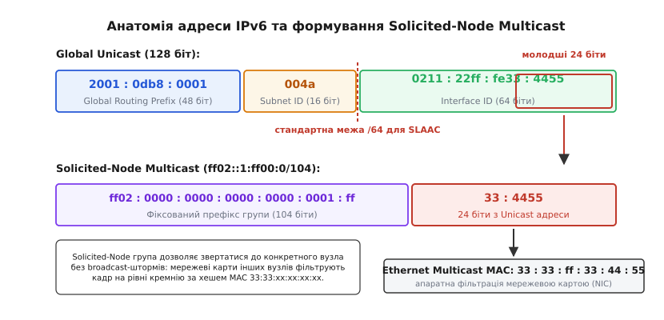
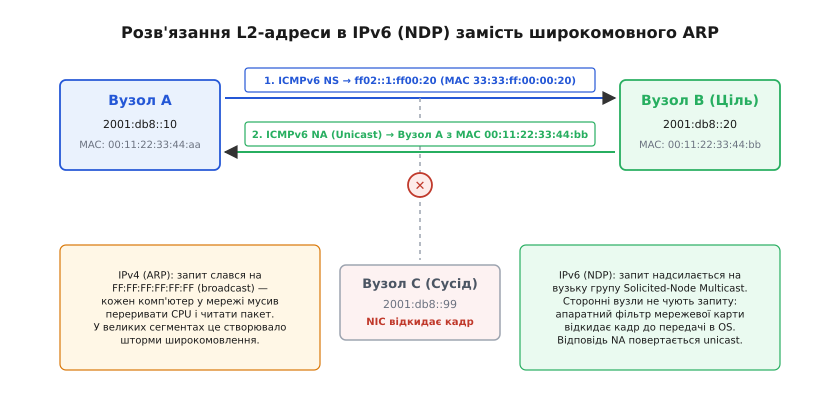
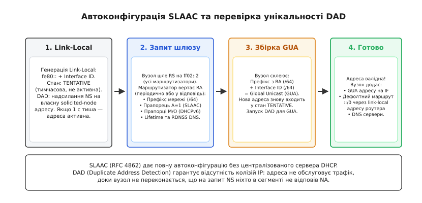
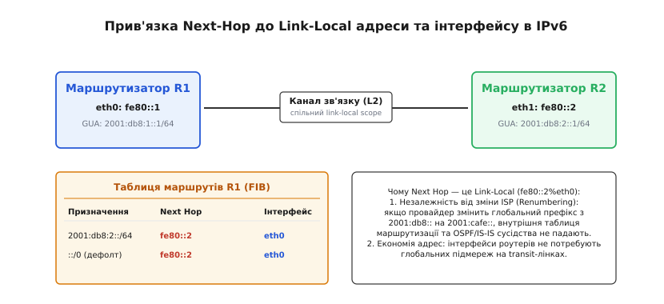
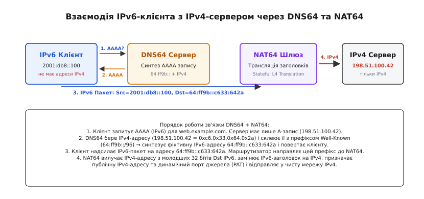

# Маршрутизація IPv6

<preknowlist>
- [Маршрутизація IP](topic:communications/ip-routing) — таблиця маршрутів, метрика, longest prefix match та передача наступному кроку.
- [MAC, IP і ARP](topic:communications/mac-ip-arp) — розв'язання L3 у фізичні кадри L2 та широкомовні обмеження.
- [CIDR і префікси](topic:communications/cidr) — ієрархія префіксів підмереж та маски змінної довжини.
- [OSPF: протокол стану каналів](topic:communications/ospf) — алгоритм Дейкстри, розповсюдження LSA та розрахунок найкоротших шляхів.
- [BGP: протокол між провайдерами](topic:communications/bgp) — міждоменний обмін префіксами та атрибути шляху AS-Path.
</preknowlist>

У січні 2011 року глобальний пул вільних адрес IPv4 агенції IANA повністю вичерпався: 4 294 967 296 адрес виявилося недостатньо для світу, де кожен смартфон, сервер та сенсор вимагає власного мережевого підключення. Трансляція адрес NAT44, яка два десятиліття рятувала мережу, зламала базовий інваріант Інтернету — наскрізну зв'язність між кінцевими вузлами (англ. *end-to-end connectivity*), перетворивши хости за шлюзами на пасивних клієнтів, нездатних без складних обхідних тунелів приймати прямі вхідні з'єднання. Одночасно магістральні маршрутизатори зіткнулися з вибуховим зростанням таблиць BGP через фрагментацію адресного простору, а комутатори локальних мереж захлиналися від штормів широкомовних ARP-запитів, які змушували кожен підключений процесор переривати роботу й аналізувати чужі кадри.

Протокол IPv6 (фіналізований у стандарті RFC 8200) став не просто збільшенням розрядності адрес із 32 до 128 бітів. Він повністю реорганізував архітектуру мережевого рівня: скасував широкомовлення на користь апаратно фільтрованого мультикасту, замінив ненадійний ARP на протокол Neighbor Discovery Protocol (NDP), ввів автоматичне безсерверне конфігурування адрес (SLAAC) і відділив локальну топологію каналу від глобальної маршрутизації інтернету.

Деталі історичної боротьби архітектур, суперечки між 64-бітними та 128-бітними адресами та вибору стандарту IETF розібрано у вставці [Як народжувався IPv6: від кризи адресного простору до стандарту](topic:communications/ipv6-routing/hist-ipv6-birth.md).

---

### Формат 128-бітної адреси та правила запису

Адреса IPv6 має довжину рівно 128 бітів (16 байтів), що забезпечує 2¹²⁸ ≈ 3.4 × 10³⁸ унікальних адрес (понад 6.6 × 10²³ адрес на кожен квадратний метр поверхні Землі).

За стандартом RFC 4291 адреса записується у вигляді восьми 16-бітних шістнадцяткових блоків (хекстетів), розділених двокрапками:

```
2001:0db8:0001:004a:0211:22ff:fe33:4455
```

Для полегшення читання та усунення неоднозначностей стандарт RFC 5952 визначає строгі канонічні правила стиснення запису:

1. **Відкидання провідних нулів:** у кожному 16-бітному блоці нулі на початку відкидаються: `0db8` записується як `db8`, `0001` — як `1`, `004a` — як `4a`, `0000` — як `0`.
2. **Стиснення послідовностей нулів (`::`):** найдовша послідовність із двох або більше сусідніх нульових блоків замінюється на подвійну двокрапку `::`. Символ `::` може зустрічатися в адресі **лише один раз**, інакше неможливо однозначно визначити, скільки саме нульових блоків пропущено в кожному місці.
3. **Вибір регістру літер:** шістнадцяткові літери `a–f` завжди записуються лише в нижньому регістрі (малими літерами).

```
Повний вигляд :  2001:0db8:0000:0000:0000:0000:0000:0001
Відкидання 0  :  2001:db8:0:0:0:0:0:1
Стиснення ::  :  2001:db8::1                          (/128)

Петльова адреса (Loopback)  :  0000:0000:0000:0000:0000:0000:0000:0001  →  ::1
Невизначена адреса (Unspecified):  0000:0000:0000:0000:0000:0000:0000:0000  →  ::
```

Маска підмережі в IPv6 записується виключно у префіксній формі (CIDR) через скісну риску: `/64`, `/48`, `/32`. Десятковий запис масок на кшталт `255.255.255.0` у новому протоколі повністю ліквідовано.

---

### Ієрархія та класифікація адресного простору

128-бітна Unicast-адреса чітко розділена на дві логічні половини по межі **/64**:

```
 0                                64                               128 бітів
+--------------------------------+----------------------------------+
|    Префікс мережі (64 біти)    |  Ідентифікатор інтерфейсу (64)   |
+--------------------------------+----------------------------------+
| Global Routing Prefix | Subnet |           Interface ID           |
|       (48 бітів)      | (16 б) |            (64 біти)             |
+-----------------------+--------+----------------------------------+
```

* **Global Routing Prefix (типово 48 бітів):** блок адрес, що виділяється регіональним реєстратором (RIR) або провайдером конкретній організації чи кінцевому клієнту.
* **Subnet ID (типово 16 бітів):** внутрішній номер підмережі всередині організації. 16 бітів дають можливість створити 65 536 незалежних підмереж `/64` у межах одного клієнтського підключення `/48`.
* **Interface ID (рівно 64 біти):** унікальний ідентифікатор хоста або інтерфейсу всередині підмережі. Фіксація розміру в 64 біти є фундаментальним інваріантом стандарту: протокол безсерверної автоконфігурації SLAAC функціонує **виключно** на префіксах довжиною `/64`.


*128-бітна адреса ділиться на 64-бітний префікс маршрутизації та 64-бітний ідентифікатор інтерфейсу. Молодші 24 біти відображаються на групову адресу Solicited-Node Multicast та апаратний MAC-фільтр 33:33:xx:xx:xx:xx.*

#### Типи адрес за областю дії (Scope)

Усі адреси IPv6 поділяються на чотири основні класи залежно від призначення та області поширення:

| Діапазон префіксів | Тип адреси | Область дії (Scope) | Призначення |
| :--- | :--- | :--- | :--- |
| `2000::/3` | Global Unicast (GUA) | Глобальна (весь Інтернет) | Публічні адреси з глобальною маршрутизацією у всесвітній мережі. |
| `fe80::/10` | Link-Local (LLA) | Локальний канал (Link-Local) | Зв'язок у межах одного фізичного L2-сегмента. Не маршрутизуються. |
| `fc00::/7` | Unique Local (ULA) | Організація (Site-Local) | Приватні адреси компанії (аналог RFC 1918). Практично `fd00::/8`. |
| `ff00::/8` | Multicast | Визначається полем Scope | Групова розсилка для хостів, маршрутизаторів та протоколів. |
| `::1/128` | Loopback | Локальний хост | Внутрішній інтерфейс зворотного зв'язку (аналог `127.0.0.1`). |
| `::/128` | Unspecified | Невизначена адреса | Адреса джерела хоста до проходження перевірки DAD. |

#### Особливості Link-Local адрес (`fe80::/10`)

Кожен мережевий інтерфейс з увімкненим стеком IPv6 **зобов'язаний** мати хоча б одну Link-Local адресу. Вона генерується ядром операційної системи автоматично при піднятті лінка (префікс `fe80::/64` + Interface ID) і не потребує наявності маршрутизатора чи сервера конфігурації.

Оскільки діапазон `fe80::/64` однаковий на всіх мережевих картах у світі, Link-Local адреса має неоднозначність без вказівки фізичного інтерфейсу. Тому в операційних системах використовується **зональний індекс** (англ. *Zone Index*):

```bash
# Звернення до сусіда на конкретному мережевому адаптері:
ping fe80::1ff:fe22:3344%eth0
```

Маршрутизатори категорично забороняють пересилати пакети з Link-Local адресами в інші інтерфейси. Вони використовуються виключно для взаємодії всередині сегмента, роботи протоколу виявлення сусідів (NDP) та як адреси наступного кроку (Next-Hop) у таблицях маршрутизації.

#### Приватні адреси Unique Local (ULA, `fc00::/7`)

ULA є прямою заміною приватних діапазонів IPv4 (`10.0.0.0/8`, `192.168.0.0/16`). За стандартом RFC 4193 на практиці використовується блок `fd00::/8`, де 8-й біт встановлено в 1 (локально згенеровані адреси):

* **Global ID (40 бітів):** псевдовипадкове число, що генерується кожною організацією за криптографічним алгоритмом. Це гарантує, що при злитті мереж двох різних компаній чи підключенні через VPN адреси ULA не перетнуться з імовірністю понад 99.9999%.
* **Subnet ID (16 бітів):** внутрішні підмережі організації.
* **Interface ID (64 біти):** адреси хостів.

---

### Спрощений базовий заголовок та ланцюжки розширень (Extension Headers)

Однією з найважливіших архітектурних оптимізацій IPv6 стало проектування фіксованого базового заголовка довжиною рівно **40 байтів**.

```
 0                   1                   2                   3
 0 1 2 3 4 5 6 7 8 9 0 1 2 3 4 5 6 7 8 9 0 1 2 3 4 5 6 7 8 9 0 1
+-+-+-+-+-+-+-+-+-+-+-+-+-+-+-+-+-+-+-+-+-+-+-+-+-+-+-+-+-+-+-+-+
|Version| Traffic Class |           Flow Label                  |
+-+-+-+-+-+-+-+-+-+-+-+-+-+-+-+-+-+-+-+-+-+-+-+-+-+-+-+-+-+-+-+-+
|         Payload Length        |  Next Header  |   Hop Limit   |
+-+-+-+-+-+-+-+-+-+-+-+-+-+-+-+-+-+-+-+-+-+-+-+-+-+-+-+-+-+-+-+-+
|                                                               |
+                                                               +
|                                                               |
+                         Source Address                        +
|                           (128 бітів)                         |
+                                                               +
|                                                               |
+-+-+-+-+-+-+-+-+-+-+-+-+-+-+-+-+-+-+-+-+-+-+-+-+-+-+-+-+-+-+-+-+
|                                                               |
+                                                               +
|                                                               |
+                      Destination Address                      +
|                           (128 бітів)                         |
+                                                               +
|                                                               |
+-+-+-+-+-+-+-+-+-+-+-+-+-+-+-+-+-+-+-+-+-+-+-+-+-+-+-+-+-+-+-+-+
```

Порівняно з IPv4 розробники видалили або перенесли другорядні поля:
1. **Видалено IHL (Header Length):** заголовок завжди має фіксований розмір 40 байтів, тому апаратний конвеєр комутатора (ASIC) читає поля за жорстко фіксованими зміщеннями без розрахунку довжини заголовка.
2. **Видалено Header Checksum:** усунено необхідність перераховувати контрольну суму заголовка на кожному проміжному маршрутизаторі при зменшенні Hop Limit. Цілісність даних контролюється апаратними контрольними сумами CRC32 на канальному рівні (Ethernet) та обов'язковими контрольними сумами на транспортному рівні (TCP, UDP, ICMPv6).
3. **Flow Label (20 бітів):** мітка потоку дозволяє маршрутизаторам виконувати балансування трафіку (ECMP / LAG) без необхідності глибокого розбору заголовків TCP/UDP (Deep Packet Inspection), навіть якщо корисне навантаження зашифроване.

Будь-які додаткові опції передаються у вигляді **ланцюжка заголовків розширень (Extension Headers)**, де поле `Next Header` вказує на тип наступного блоку:

```
[IPv6 Header (Next=43)] ──> [Routing Header (Next=6)] ──> [TCP Header] ──> [Payload]
```

Типові заголовки розширень:
* `Hop-by-Hop Options` (код 0) — інформація, яку зобов'язаний обробити кожен проміжний маршрутизатор на шляху (наприклад, Jumbo Payload).
* `Routing Header` (код 43) — маршрутизація від джерела (Source Routing). Старий небезпечний заголовок RH0 було заборонено в RFC 5095 через можливість створення петель і посилення атак, а в сучасних мережах використовується Segment Routing IPv6 (**SRv6**, RFC 8754).
* `Fragment Header` (код 44) — інформація про фрагменти для великих пакетів.
* `Destination Options` (код 60) — опції для кінцевого адресата пакета.

---

### Path MTU Discovery (RFC 8201) та заборона фрагментації на маршрутизаторах

У протоколі IPv4 проміжний маршрутизатор мав право самостійно фрагментувати пакет, якщо розмір кадру перевищував MTU вихідного інтерфейсу. Це створювало величезне навантаження на процесори маршрутизаторів та призводило до втрати цілих TCP-сесій у разі втрати навіть одного фрагмента.

У протоколі IPv6 діє фундаментальне залізне правило: **проміжним маршрутизаторам категорично заборонено фрагментувати пакети**.

* **Мінімальний MTU каналу в IPv6 становить 1280 байтів** (у IPv4 було 576 байтів). Будь-який канальний протокол зобов'язаний вміщувати щонайменше 1280 байтів без фрагментації.
* **Механізм Path MTU Discovery (PMTUD):**
  1. Хост-відправник надсилає пакети розміром свого локального MTU (наприклад, 1500 байтів).
  2. Якщо на шляху слідування трапляється лінк із меншим MTU (наприклад, тунель PPPoE чи GRE з MTU 1420 байтів), маршрутизатор перед цим лінком **скидає пакет**.
  3. Маршрутизатор відправляє назад хосту-джерелу повідомлення **ICMPv6 Packet Too Big** (Type 2, Code 0), у полі якого явно вказує точний розмір MTU вузького місця (`Next-Hop MTU = 1420`).
  4. Хост-відправник зменшує розмір вихідних пакетів для цієї конкретної адреси у своєму кеші ядра (Routing Cache) та повторює передачу.

Фрагментація в IPv6 виконується **виключно самим хостом-відправником** за допомогою додавання заголовка розширення Fragment Header.

---

### Відмова від Broadcast та групова розсилка (Multicast)

У протоколі IPv6 **повністю відсутні широкомовні адреси (Broadcast)**. Усі сервісні операції, які в IPv4 спиралися на broadcast, переведені на цільову групову розсилку (Multicast, префікс `ff00::/8`).

Заголовок адреси Multicast містить 4-бітне поле прапорців та 4-бітне поле області дії (Scope):

```
 0        8   12   16                                              128 бітів
+--------+---+----+--------------------------------------------------+
|11111111|Flg|Scop|                     Group ID                     |
+--------+---+----+--------------------------------------------------+
```

Значення поля Scope визначає межі поширення пакета: `1` — Interface-Local (у межах хоста), `2` — Link-Local (у межах L2-сегмента), `5` — Site-Local (у межах філії), `8` — Organization-Local, `e` — Global.

Найважливіші системні мультикаст-групи Link-Local scope (`ff02::`):
* `ff02::1` — **All Nodes:** усі активні вузли локального каналу (хости та маршрутизатори).
* `ff02::2` — **All Routers:** усі активні маршрутизатори локального каналу.
* `ff02::5` та `ff02::6` — маршрутизатори протоколу OSPFv3 (All OSPF Routers та All Designated Routers).
* `ff02::1:2` — усі агенти ретрансляції та сервери DHCPv6 (All DHCP Agents).
* `ff02::1:ff00:0/104` — адреси **Solicited-Node Multicast**.

#### Механізм Solicited-Node Multicast

Solicited-Node адреса генерується для кожної призначеної хосту Unicast-адреси. Вона формується шляхом склеювання 104-бітного префікса `ff02::1:ff` та молодших 24 бітів самої Unicast-адреси.

На канальному рівні Ethernet кожна мультикаст-адреса IPv6 однозначно транслюється у фізичну MAC-адресу за правилом: перші два байти дорівнюють `33:33`, а решта чотири байти копіюються з останніх чотирьох байтів IPv6-мультикасту.

```
IPv6 Unicast :  2001:db8::11:2233:4455
Solicited IP :  ff02::1:ff33:4455
Ethernet MAC :  33:33:ff:33:44:55
```

Мережева карта (NIC) при налаштуванні адреси прописує хеш MAC-адреси `33:33:ff:33:44:55` в апаратний фільтр мікросхеми. Коли в мережі надходить кадр Neighbor Solicitation для хоста `2001:db8::11:2233:4455`, усі сусідні комп'ютери відкидають цей кадр ще на рівні кремнію мережевого контролера, не витрачаючи жодного такту центрального процесора.

---

### Протокол виявлення сусідів (NDP, RFC 4861)

NDP об'єднує всі функції взаємодії між вузлами в одному L2-сегменті за допомогою повідомлень ICMPv6 (Type 133–137) із обов'язковою вимогою `Hop Limit = 255`.


*Запит Neighbor Solicitation прямує на вузьку мультикаст-групу Solicited-Node, тому сторонні вузли відкидають кадр апаратно на рівні мережевої карти без переривання ОС, а відповідь Neighbor Advertisement повертається напряму unicast-пакетом.*

1. **Neighbor Solicitation (NS, Type 135) та Neighbor Advertisement (NA, Type 136):** заміна ARP. Вузол надсилає NS на solicited-node адресу цілі, вказуючи власну MAC-адресу в опції Source Link-Layer Address. Цільовий хост відповідає Unicast-пакетом NA, вказуючи свою MAC-адресу та бітові прапорці:
   * `R` (Router) — відправник є маршрутизатором.
   * `S` (Solicited) — повідомлення є відповіддю на конкретний запит NS.
   * `O` (Override) — дозволяє перезаписати наявний у кеші запис MAC-адреси.
2. **Router Solicitation (RS, Type 133) та Router Advertisement (RA, Type 134):** автоконфігурація та виявлення шлюзів. При підключенні хост шле RS на адресу `ff02::2`. Маршрутизатор відповідає повідомленням RA на адресу `ff02::1`, передаючи префікси підмережі, час життя маршруту, розмір MTU та DNS-сервери.
3. **Redirect (Type 137):** оптимізація маршруту. Маршрутизатор повідомляє хосту кращу Link-Local адресу сусіднього маршрутизатора в тому самому сегменті.

Детальний двійковий формат усіх п'яти типів повідомлень ICMPv6, структуру опцій RDNSS і Prefix Info та системний інтерфейс ядра наведено у вставці [Специфікація протоколу NDP та структури повідомлень ICMPv6](topic:communications/ipv6-routing/api-ndp-icmpv6.md).

Практичну реалізацію низькорівневого мережевого інструменту зондування сусідів через сирі сокети на C та C++ розібрано у вставці [Низькорівневий зонд NDP: розв'язання L2-адреси через сокети ICMPv6](topic:communications/ipv6-routing/proj-ndp-neighbor-probe.md).

---

### Автоконфігурація SLAAC (RFC 4862) та перевірка DAD

Безсерверна автоконфігурація (SLAAC — Stateless Address Autoconfiguration) дозволяє хосту отримати повноцінне підключення до Інтернету без розгортання та адміністрування серверів DHCP.


*Життєвий цикл SLAAC: формування Link-Local адреси, перевірка DAD через нульовий запит NS, отримання префікса підмережі через RA від маршрутизатора та збирання глобальної адреси GUA без участі сервера DHCP.*

#### Послідовність кроків SLAAC:

1. **Генерація Link-Local адреси:** хост бере префікс `fe80::/64` і додає до нього свій 64-бітний ідентифікатор інтерфейсу (Interface ID). Адреса переходить у стан **TENTATIVE** (тимчасова, не готова приймати трафік).
2. **Перевірка унікальності (Duplicate Address Detection, DAD):**
   * Хост надсилає запит Neighbor Solicitation (NS) на Solicited-Node адресу своєї згенерованої IP-адреси.
   * Поле IPv6 Source заповнюється нулями (`::`), оскільки адреса ще не підтверджена.
   * Якщо протягом 1 секунди надходить відповідь NA (або зустрічний NS), адреса вважається дубльованою, вимикається (стан `DADFAILED`), а стек видає попередження в системний журнал ядра.
   * Якщо відповіді немає — адреса стає активною.
3. **Отримання мережевого префікса через RS/RA:**
   * Хост надсилає RS на групу `ff02::2`.
   * Маршрутизатор надсилає RA з опцією Prefix Information Option (PIO, наприклад `2001:db8:1::/64`) із прапорцем `A = 1` (Autonomous Address Configuration).
4. **Формування глобальної адреси (GUA):** хост комбінує отриманий префікс `/64` зі своїм Interface ID, переводить нову адресу у стан `TENTATIVE`, повторює процедуру DAD і, переконавшись у її унікальності, вмикає адресу на інтерфейсі.

#### Генерація Interface ID: від EUI-64 до Opaque Privacy

* **Застарілий метод EUI-64:** 48-бітна MAC-адреса `00:11:22:33:44:55` розбивалася навпіл, посередині вставлялося фіксоване 16-бітне значення `0xfffe` (`0011:22ff:fe33:4455`), після чого інвертувався 7-й біт першого байта (біту Universal/Local) → `0211:22ff:fe33:4455`. Цей метод розкривав заводську MAC-адресу пристрою в Інтернеті та дозволяв глобально відстежувати переміщення користувача між мережами.
* **Стабільні приватні адреси (Stable Privacy / Opaque IID, RFC 7217):** Interface ID обчислюється як криптографічний хеш від префікса підмережі, імені інтерфейсу, лічильника перезавантажень та секретного ключа хоста. Адреса лишається постійною всередині однієї підмережі, але повністю змінюється при переході до іншої мережі Wi-Fi.
* **Тимчасові приватні адреси (Temporary Privacy Extensions, RFC 4941):** операційна система генерує додаткові випадкові адреси з коротким терміном життя (24 години), які використовуються виключно для вихідних з'єднань веб-браузера, повністю приховуючи реальний ідентифікатор хоста.

#### Делегування префіксів через DHCPv6-PD (Prefix Delegation, RFC 3633)

У багаторівневих мережах та підключеннях домашніх або офісних маршрутизаторів використовується механізм DHCPv6 Prefix Delegation:

* Маршрутизатор клієнта запитує у вищестоящого провайдера не окрему IP-адресу, а цілий блок адрес — наприклад, префікс `/56` (містить 256 підмереж `/64`) за допомогою опції `IA_PD` (Identity Association for Prefix Delegation).
* Отримавши блок `/56`, клієнтський маршрутизатор самостійно нарізає його на підмережі `/64`, призначає їх своїм внутрішнім інтерфейсам (LAN, Wi-Fi, Guest VLAN, IoT VLAN) і починає розсилати повідомлення Router Advertisement (RA) для підключених хостів у кожному сегменті.

> 🔧 **Навіщо це.** Прапорці `M` (Managed) та `O` (Other) у повідомленнях RA дозволяють гнучко комбінувати SLAAC та DHCPv6. Якщо `M = 0`, `O = 1`, хости отримують IP-адреси через SLAAC, а адреси корпоративних DNS-серверів та доменні суфікси — через легкий безсерверний Stateless DHCPv6 або безпосередньо через опцію RDNSS (RFC 8106) у повідомленні RA.

---

### Особливості маршрутизації в IPv6

Принципи маршрутизації на основі таблиць переходів (FIB) та вибору найдовшого префікса (Longest Prefix Match) у IPv6 ідентичні загальній теорії маршрутизації IP. Проте на рівні внутрішньої структури протоколи зазнали кардинальних змін.

#### Link-Local адреси як Next-Hop

У таблиці маршрутів IPv6 наступний крок (Next-Hop) для всіх маршрутів у межах сегмента прив'язується до **Link-Local адреси сусіднього маршрутизатора та вихідного інтерфейсу**:

```bash
# Приклад таблиці маршрутів у Linux:
$ ip -6 route show
2001:db8:2::/64 via fe80::5054:ff:fe12:3456 dev eth0 metric 1024
default via fe80::21a:4aff:fe12:3456 dev eth0 metric 100 pref medium
```


*Маршрутизатор вказує Link-Local адресу сусіда (fe80::...%eth0) як Next-Hop. Зміна глобального префікса організації (Renumbering) не впливає на внутрішні таблиці маршрутизації та протоколи динамічної маршрутизації.*

Ця архітектура дає три фундаментальні переваги:

1. **Безшовне перенумерування (Renumbering):** якщо організація змінює інтернет-провайдера (ISP) і отримує новий глобальний префікс (наприклад, переходить із `2001:db8::/32` на `2001:cafe::/32`), внутрішня таблиця маршрутизації, зв'язки OSPF/IS-IS та Next-Hop маршрутизаторів **не зазнають жодних змін**, оскільки вся внутрішня топологія побудована на стабільних Link-Local адресах `fe80::`.
2. **Економія адресного простору:** транзитні канали між маршрутизаторами (Point-to-Point лінки) взагалі не потребують виділення глобальних підмереж `/64` — маршрутизатори обмінюються трафіком, спираючись виключно на Link-Local адреси інтерфейсів.
3. **Ізоляція Control Plane:** трафік керування протоколів маршрутизації фізично неможливо атакувати ззовні Інтернету, оскільки Link-Local адреси не маршрутизуються між підмережами.

---

### Динамічні протоколи маршрутизації IPv6

#### 1. OSPFv3 (RFC 5340)

Протокол стану каналів OSPFv3 для IPv6 був повністю перероблений порівняно з OSPFv2:

* **Робота на рівні каналу (Per-Link, а не Per-Subnet):** OSPFv2 встановлював сусідство між вузлами лише за умови, що їхні IP-адреси належали одній підмережі з однаковою маскою. OSPFv3 встановлює сусідство суто через спільний фізичний лінк, використовуючи для обміну пакетами Link-Local адреси джерела. Два маршрутизатори на одному дроті стають сусідами навіть за повної відсутності налаштованих глобальних IPv6-адрес.
* **32-бітний Router ID:** ідентифікатор маршрутизатора в OSPFv3 залишається 32-бітним числом (наприклад, `1.1.1.1`), яке записується у форматі IPv4-адреси, але є суто логічним числовим тегом вузла.
* **Розділення топології та адресних префіксів:** у OSPFv2 оголошення стану каналів (LSA типів 1 та 2) містили одночасно інформацію про з'єднання між маршрутизаторами та IP-префікси підмереж. Будь-яка зміна або додавання нової IP-адреси змушувала всю зону перераховувати повне дерево найкоротших шляхів за алгоритмом Дейкстри (SPF calculation).
  
  У OSPFv3 топологію графа відокремлено від префіксів:
  * **Router-LSA (Type 1) та Network-LSA (Type 2)** описують виключно ребра графа та топологічні зв'язки без прив'язки до IP-адрес.
  * Нові **Link-LSA (Type 8)** розповсюджуються лише в межах локального лінка і повідомляють сусідам Link-Local адресу маршрутизатора та список його префіксів.
  * Нові **Intra-Area-Prefix-LSA (Type 9)** переносять префікси підмереж для конкретного маршрутизатора або псевдовузла. Зміна префікса викликає лише легкий перерахунок таблиці маршрутів без ресурсоємного перерахунку топологічного дерева Дейкстри.

#### 2. MP-BGP (Multiprotocol BGP, RFC 4760 та RFC 2545)

Класичний протокол BGP-4 був жорстко прив'язаний до 32-бітних адрес IPv4. Для підтримки інших протоколів IETF стандартизувала розширення MP-BGP на основі адресних сімейств:

* **AFI (Address Family Identifier):** числовий код сімейства адрес. Для IPv6 значення `AFI = 2` (для IPv4 `AFI = 1`).
* **SAFI (Subsequent Address Family Identifier):** тип маршрутної інформації. Значення `SAFI = 1` позначає звичайний Unicast, `SAFI = 2` — Multicast, `SAFI = 128` — L3VPN (MPLS/BGP VPN).
* **Атрибути MP_REACH_NLRI та MP_UNREACH_NLRI:** маршрутна інформація про досяжні мережі IPv6 (NLRI) передається всередині спеціальних нових атрибутів BGP Path Attributes (типи 14 та 15).
* **Подвійний Next-Hop в оголошеннях:** у полі `Network Address of Next Hop` атрибута `MP_REACH_NLRI` маршрутизатор передає одночасно дві адреси: глобальну IPv6-адресу (16 байтів) та Link-Local адресу сусіда (16 байтів). Це дозволяє магістральним шлюзам у межах однієї автономної системи (iBGP) направляти трафік безпосередньо через локальний канал.

#### 3. IS-IS для IPv6 (RFC 5308)

Протокол IS-IS (Intermediate System to Intermediate System), будучи протоколом моделі OSI, спочатку не залежав від форматів IP. Для підтримки IPv6 до стандарту було додано два нових блоки TLV (Type-Length-Value):

* **TLV 236 (IPv6 Reachability):** переносить інформацію про префікси IPv6, метрику маршруту та зовнішні теги (аналог TLV 135 для IPv4).
* **TLV 232 (IPv6 Interface Address):** повідомляє 128-бітну адресу інтерфейсу маршрутизатора для побудови зв'язків між сусідами.

У режимі **Multi-Topology IS-IS (M-ISIS, RFC 5120)** протокол здатний розраховувати два повністю незалежних топологічних графи для IPv4 та IPv6 на тих самих фізичних маршрутизаторах, що критично важливо у випадках, коли частина лінків мережі ще не має налаштованого IPv6.

---

### Перехідні механізми та взаємодія з мережами IPv4

Оскільки IPv4 та IPv6 мають несумісні формати заголовків і розміри адрес, прямий зв'язок між ними неможливий. Процес міграції реалізується трьома основними стратегіями: подвійний стек (Dual Stack), тунелювання та трансляція.

#### 1. Подвійний стек (Dual Stack, RFC 4213)

Найбільш надійний та рекомендований метод міграції: мережеве обладнання, сервери та клієнтські операційні системи одночасно налаштовуються з адресами обох протоколів.

* Маршрутизатори підтримують паралельно дві незалежні таблиці маршрутизації (FIB для IPv4 та FIB для IPv6).
* Клієнт при зверненні до доменного імені запитує через DNS одночасно записи `A` (IPv4) та `AAAA` (IPv6).
* Алгоритм **Happy Eyeballs (RFC 8305)** у клієнтських додатках надсилає запити на встановлення TCP-з'єднання паралельно через обидва стеки (з перевагою IPv6 на кілька сотень мілісекунд), автоматично обираючи найшвидший і найстабільніший шлях.

#### 2. Технології тунелювання

Тунелювання використовується для передачі пакетів IPv6 через проміжну інфраструктуру, яка підтримує виключно IPv4:

* **6in4 (RFC 4213):** статичний тунель «точка-точка». Пакет IPv6 без змін інкапсулюється всередину пакета IPv4 з окремим номером протоколу IP `41` (IPv6 Encapsulation).
* **GRE (Generic Routing Encapsulation, RFC 2473 / RFC 2784):** універсальний тунель (протокол IP `47`), що дозволяє інкапсулювати як IPv6-пакети даних, так і мультикастові пакети протоколів динамічної маршрутизації (OSPFv3, IS-IS).
* **DS-Lite (Dual-Stack Lite, RFC 6333):** технологія для провайдерів широкосмугового доступу. Клієнтський маршрутизатор (B4 — Basic Bridging BroadBand) має виключно глобальну адресу IPv6, а весь трафік IPv4 від домашніх пристроїв інкапсулює у тунель IPv6 до магістрального шлюзу провайдера (AFTR — Address Family Transition Router), де виконується Carrier-Grade NAT (CGNAT).

#### 3. Трансляція адрес: зв'язка NAT64 та DNS64

Технології NAT64 (RFC 6146) та DNS64 (RFC 6147) забезпечують можливість клієнтам у чистих мережах IPv6 (IPv6-only, наприклад у мобільних мережах 4G/5G) прозоро взаємодіяти із серверами, які мають лише стару адресу IPv4.


*Зв'язка DNS64 та NAT64: сервер DNS64 синтезує синтетичну AAAA-адресу з префіксом 64:ff9b::/96, а шлюз NAT64 виконує stateful-трансляцію заголовків між клієнтом IPv6 та чистим IPv4-інтернетом.*

#### Алгоритм роботи DNS64 / NAT64:

1. Клієнт надсилає DNS-запит на отримання запису `AAAA` для домену `legacy.example.com`.
2. Сервер DNS64 з'ясовує, що авторитетний DNS-сервер повертає лише `A`-запис (`198.51.100.42 = 0xc6.0x33.0x64.0x2a`).
3. DNS64 синтезує фіктивну адресу `AAAA`, додаючи 32 біти IPv4-адреси до зарезервованого префікса **Well-Known Prefix** `64:ff9b::/96` (RFC 6052):
   ```
   Префікс NAT64 :  64:ff9b::/96  →  0064:ff9b:0000:0000:0000:0000
   IPv4-адреса    :  198.51.100.42 →  c633:642a
   Синтез AAAA    :  64:ff9b::c633:642a
   ```
4. Клієнт надсилає стандартний TCP/UDP IPv6-пакет на адресу призначення `64:ff9b::c633:642a`.
5. Маршрутизатор направляє префікс `64:ff9b::/96` на шлюз NAT64.
6. Шлюз NAT64 вилучає IPv4-адресу з молодших 32 бітів, перетворює заголовок IPv6 на заголовок IPv4, призначає публічну IPv4-адресу з динамічним портом (PAT) і відправляє пакет цільовому серверу в Інтернет.

---

### Діагностика та адміністрування маршрутизації IPv6 у Linux

Усі операції з налаштування та інспектування таблиць маршрутизації, кешу сусідів та параметрів SLAAC у сучасних дистрибутивах Linux виконуються через пакет `iproute2`:

```bash
# Перегляд налаштованих адрес та їхніх статусів (preferred, tentative, dynamic):
ip -6 address show dev eth0

# Перегляд кешу сусідів (NDP Neighbor Table) та їхніх станів NUD:
ip -6 neighbour show

# Додавання статичного маршруту через Link-Local Next-Hop:
sudo ip -6 route add 2001:db8:50::/64 via fe80::1 dev eth0

# Зондування сусіднього вузла за протоколом NDP:
sudo ndisc6 2001:db8:1::42 eth0

# Відправлення запиту Router Solicitation до маршрутизаторів:
sudo rdisc6 eth0
```

Маршрутизація IPv6 поєднує гігантський адресний простір, що унеможливлює проблему дефіциту IP на століття вперед, із високоефективними алгоритмами апаратного розв'язання адрес на основі мультикасту, оптимізованими фіксованими заголовками для швидкісної комутації в кремнії та гнучкими механізмами автоконфігурації без централізованих серверів.
