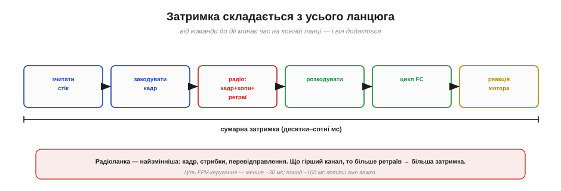
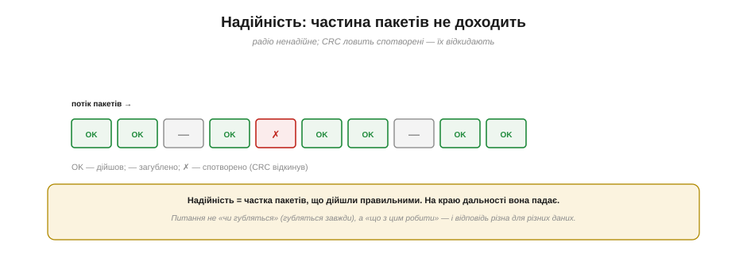
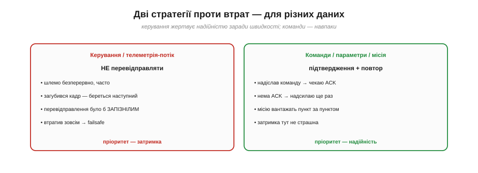
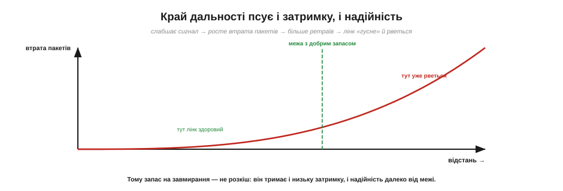

# Затримка й надійність (чому критично)

Дві властивості радіолінії вирішують, **літатиме** апарат чи впаде: **затримка** (як швидко команда доходить до дії) і **надійність** (яка частка повідомлень доходить узагалі). Для звичайного зв'язку — чату, телеметрії на стіл — ці речі бажані. Для **керування апаратом у польоті** вони стають **критичними**, бо дрон — це система зі зворотним зв'язком, де запізнення чи втрата сигналу миттєво обертаються аварією. Розберімо обидві — і чому інженер зв'язку мусить ставитися до них смертельно серйозно.

### Звідки береться затримка

**Затримка** (*latency*) — це повний час від причини до наслідку: від руху стіка до руху мотора (або від показу давача до значка на екрані). І складається вона з **усього ланцюга**.

*Час додається на кожній ланці: зчитати стік → закодувати кадр → радіо (тривалість кадру + стрибки + перевідправлення) → розкодувати → цикл польотного контролера → реакція мотора. Сума — десятки-сотні мілісекунд. Найзмінніша ланка — радіо: що гірший канал, то більше ретраїв, то більша затримка.*

Кожна ланка додає свою частку: зчитування й кодування на пульті, **політ кадру по радіо** (тривалість самого кадру + стрибки частоти + можливі перевідправлення), декодування на приймачі, цикл польотного контролера, інерція мотора. Найпідступніша ланка — **радіо**, бо вона **змінна**: у чистому ефірі кадр пролітає швидко, а на межі дальності чи в завадах починаються перевідправлення, і затримка **стрибає**. Для відчуття масштабу: FPV-керування хоче **менше ~30 мс** «від камери до екрана», а понад ~100 мс літати вже важко — апарат «не слухається» вчасно.

### Чому затримка небезпечна: запізнення в контурі

Чому ж кілька зайвих мілісекунд такі страшні? Бо керування апаратом — це **петля зворотного зв'язку**, а затримка в петлі **розхитує** систему.

*Пілот (чи автопілот) у петлі: дав команду → апарат зреагував → спостерігаєш результат → коригуєш. Якщо затримка мала, петля стабільна. Якщо велика — корекція приходить **запізно**, апарат перелітає ціль, ти коригуєш у відповідь — і коливання **наростають** замість згасати.*

Уяви, що ведеш апарат: даєш команду, бачиш результат, коригуєш. Це класична **петля** «дія → спостереження → корекція». Поки затримка мала, петля **стабільна**: корекції влучні, апарат слухняний. Але варто затримці зрости — і твоя корекція приходить **запізно**, коли апарат уже перелетів ціль; ти реагуєш на застаріле, перелітаєш у інший бік, знову коригуєш — і замість заспокоюватися система **розгойдується** дедалі сильніше. Це фундаментальна властивість усіх контурів зі зворотним зв'язком: затримка з'їдає [запас стійкості](root:embedded/loop-stability). Ось чому в керуванні апаратом затримка — не зручність, а **безпека**.

### Надійність: пакети неминуче губляться

Друга біда — **надійність**. [Радіоканал](topic:communications/on-chip-radio) **ненадійний** за природою: пакети губляться й спотворюються через [багатопроменеве завмирання](topic:communications/multipath-fading).

*У потоці пакетів частина доходить (OK), частина губиться зовсім (—), частина приходить спотвореною — і її відкидає контрольна сума CRC. Надійність — це частка пакетів, що дійшли правильними; на краю дальності вона падає. Питання не «чи губляться» (губляться завжди), а «що з цим робити».*

[Багатопроменевість і завмирання](topic:communications/multipath-fading) раз у раз «топлять» окремі пакети, а ті, що приходять зіпсованими, відкидає [**CRC**](topic:communications/crc) — краще викинути спотворене, ніж послухатися хибної команди. Тому **надійність** — це не «так/ні», а **частка** пакетів, що дійшли правильними, і вона тим менша, чим далі й гірший канал. Ключове усвідомлення: **втрати неминучі**, тож правильне питання — не «як їх позбутися» (не вийде), а «**що робити**, коли пакет загубився». І відповідь — різна для різних даних.

### Дві стратегії проти втрат

Тут — серце інженерного рішення. Для **різних** типів даних застосовують **протилежні** стратегії.

***Керування й потік телеметрії**: НЕ перевідправляти — шлемо безперервно й часто, загубився кадр — береться наступний (перевідправлення прийшло б уже запізно); втратив зовсім → failsafe. **Команди, параметри, місія**: підтвердження + повтор — надіслав → чекаю ACK → нема → шлю ще раз; затримка тут не страшна.*

Перша стратегія — для **керування** й безперервного **потоку телеметрії**: **не перевідправляти**. Сенс у тім, що дані йдуть **часто** (десятки разів на секунду), тож загублений кадр не біда — за мить прийде свіжіший. А перевідправляти **немає сенсу**, бо повторна копія застарілої команди прийшла б **запізно** й лише плутала б. Загубилося все — спрацьовує **failsafe** (англ. *fail-safe* — «безпечний за відмови»): наперед задана безпечна дія на втрату зв'язку. Друга стратегія — для **команд, параметрів, завантаження місії**: тут навпаки, **підтвердження й повтор**. Надіслав команду — чекаєш **ACK** (підтвердження); не прийшло — **надсилаєш ще раз**, поки не дійде. MAVLink так і влаштований: рядові повідомлення (`ATTITUDE`, `GPS`) течуть «вистрелив і забув», а команди (`COMMAND_LONG` → `COMMAND_ACK`) і місія підтверджуються пункт за пунктом. Затримка тут не страшна — головне, щоб команда **точно** дійшла.

### Компроміс: надійність ціною затримки

Чому не зробити **все** надійним через перевідправлення? Бо надійність і затримка — у **компромісі**.

*Кожне перевідправлення додає коло «надіслав-почекав-ще раз» — більше надійності, але більше часу. Тому керування сідає в лівий кут (нуль повторів, мінімум затримки), а завантаження місії — у правий (повтори до успіху, затримка не важить). Одночасно максимум того й того — неможливо.*

Це той самий [інженерний обмін, що й між шириною смуги та пропускною здатністю](topic:communications/bandwidth-capacity): **перевідправлення купує надійність, але платить затримкою**. Кожен повтор — це ще одне коло «надіслав → почекав підтвердження → не дійшло → ще раз», а кола додають час. Тому **не можна** мати одночасно і максимум надійності, і мінімум затримки — доводиться **обирати під дані**. Керування сідає в один кут (жодних повторів, найменша затримка, втрату гасить failsafe), а місія й параметри — в інший (повторюй, доки не дійде, час не критичний). Розуміння цього компромісу — ознака зрілого проєктувальника протоколів.

### Край дальності псує і те, й те

І ще одне важливе: **дальність** б'є по **обох** властивостях одразу.

*Що далі апарат, то слабший сигнал → то більша частка втрачених пакетів → то більше перевідправлень → лінк водночас і «гусне» (росте затримка), і рветься (падає надійність). Запас на завмирання тримає лінк здоровим, доки не підходиш до межі.*

На краю дальності сигнал слабне (тут вирішує [бюджет лінії](root:embedded/link-budget)), SNR падає — і частка втрачених пакетів **росте**. А це б'є по обох фронтах одразу: більше втрат → більше перевідправлень (де вони є) → **росте затримка**; і водночас **падає надійність**. Лінк ніби «гусне» й починає рватися саме там, де ти найдалі від дому. Ось чому **запас на завмирання** — не теоретична розкіш: ті 10–20 дБ резерву тримають і низьку затримку, і високу надійність, доки апарат не наблизиться до самої межі. Бюджет лінії й тут виявляється практичним інструментом.

> 🔧 **Навіщо це.** Проєктуючи чи налаштовуючи систему, розводь дані за **вимогами до часу**. Що мусить діяти **миттєво** (керування, стабілізація) — те шли часто, **без** перевідправлень і обов'язково з **failsafe** на втрату. Що мусить **точно дійти**, але час терпить (зміна параметра, завантаження маршруту) — те шли з **підтвердженням і повтором**. Хочеш більшої дальності без втрати якості — закладай [**запас бюджету лінії**](root:embedded/link-budget), бери [нижчий діапазон](topic:communications/frequency-bands) чи [кращі антени](topic:communications/antenna). І завжди питай себе про **дедлайн** кожного повідомлення: коли воно стає **запізнілим настільки, що вже шкідливе**? Це питання — суть проєктування систем реального часу.

### Коли лінк вважати втраченим

Останнє — як система **розуміє**, що зв'язок зник, і що тоді робить.

*Поки йде **HEARTBEAT** (раз на секунду), лінк живий. Якщо серцебиття нема кілька секунд (таймаут, напр. 2–3 с) — лінк вважають **втраченим**, і автопілот сам виконує failsafe: повернення додому (RTL) чи м'яку посадку. Головна думка: у реальному часі «правильно, але запізно» = неправильно.*

Те саме [**HEARTBEAT**](topic:communications/telemetry-stream) — «серцебиття» раз на секунду — служить **детектором життя** лінка: поки воно надходить, зв'язок є; щойно його **нема кілька секунд** (заданий таймаут, типово 2–3 с), система оголошує **«лінк втрачено»** — і автопілот **сам** виконує заздалегідь налаштований [**failsafe**](topic:communications/rc-link) (RTL чи посадку). Так система не лише ловить окремі втрати, а й має чітке означення «зв'язку більше немає» та безпечну реакцію на нього. І головний урок: у системах **реального часу** правильність — це **правильно й вчасно**; команда, що спізнилася, — це хибна команда. Дані керування живуть із **дедлайном**, і тому інженер зв'язку завжди питає себе про кожне повідомлення: коли воно стає запізнілим настільки, що з корисного робиться шкідливим.
