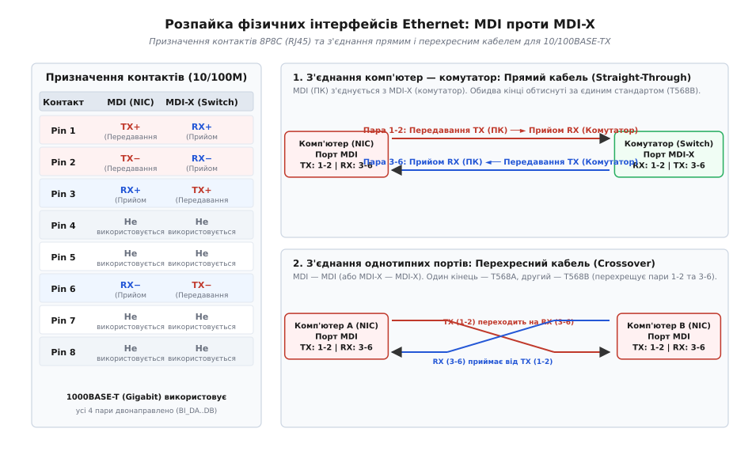
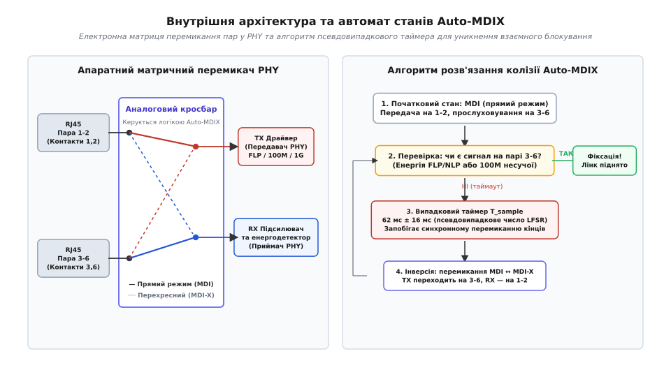
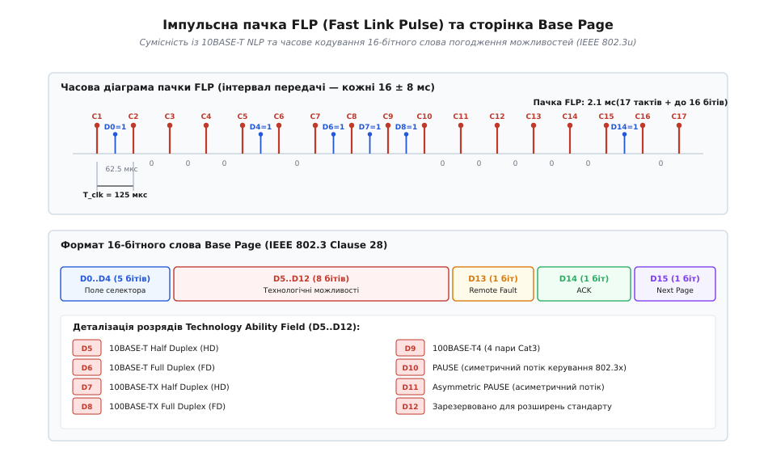
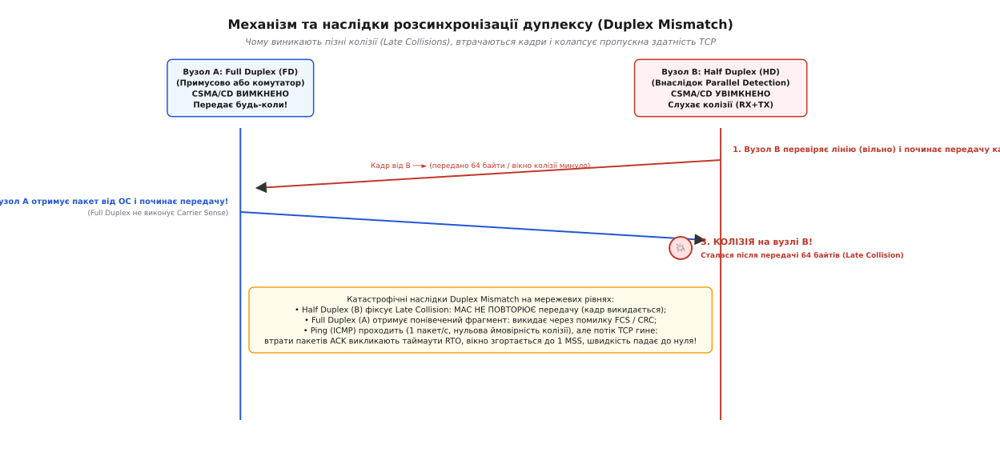

# MDI/MDI-X і авто-погодження Ethernet

<preknowlist>
- [Вита пара](book:electronics/twisted-pair) — диференційне передавання сигналу, симетрія жил та гасіння зовнішніх магнітних наводок.
- [UTP-кабель](book:communications/utp-cable) — категорії неекранованої витої пари (Cat5e, Cat6), колірне маркування T568A/T568B та розкладка контактів.
- [Кадр Ethernet](book:communications/ethernet-frame) — структура L2-пакета: преамбула, MAC-адреси, поле типу, корисне навантаження та контрольна сума FCS.
- [Фізика лінка Ethernet](book:communications/ethernet-link-phy) — лінійне кодування 10BASE-T (Manchester), 100BASE-TX (4B5B, MLT-3) та імпульси перевірки лінка NLP.
- [CSMA/CD](book:communications/csma-cd) — напівдуплексний доступ до спільного середовища, прослуховування несучої, виявлення колізій та тайм-аут експоненційного відкату.
</preknowlist>

Коли два мережеві пристрої з'єднують мідним патч-кордом, на фізичному рівні мають одночасно зійтися три незалежні умови: вихід передавача одного вузла повинен потрапити точно на вхід приймача іншого, обидва чіпи мають домовитися про спільну швидкість передавання бітів (10, 100 чи 1000 Мбіт/с) і узгодити спосіб використання кабелю — напівдуплексний (Half Duplex) чи повнодуплексний (Full Duplex). Якщо хоча б один із цих параметрів розійдеться, зв'язок або не виникне взагалі, або перетвориться на приховану мережеву аварію, коли тестовий пакет `ping` проходить без жодних втрат, а реальна швидкість передавання файлів по TCP падає з гігабіта до кількох кілобайтів на секунду.

За автоматичне вирішення цих трьох завдань відповідають стандартизовані апаратні механізми фізичного рівня: специфікація розпайки **MDI/MDI-X**, технологія електронного перехрещення пар **Auto-MDIX** та протокол погодження можливостей **Auto-Negotiation** (IEEE 802.3u / 802.3ab).

## 1. Фізична асиметрія мідного порту: MDI проти MDI-X

У класичних стандартах Ethernet 10BASE-T та 100BASE-TX восьмижильний кабель витої пари використовується не симетрично. Для передавання даних задіюються лише дві виті пари з чотирьох: одна пара працює виключно на передавання сигналів від локального вузла в лінію, а друга — виключно на прийом вхідного сигналу від віддаленого вузла.

```general
Пара контактів 1–2:  Диференційний канал A (TX+ / TX- або RX+ / RX-)
Пара контактів 3–6:  Диференційний канал B (RX+ / RX- або TX+ / TX-)
Пари 4–5 та 7–8:     Не використовуються у 10/100BASE-TX (вільні для PoE або телефонії)
```

Вихідний каскад лінійного трансивера PHY (англ. *Physical Layer*) містить потужні диференційні ключі, які генерують перепади струму в первинній обмотці імпульсного трансформатора (англ. *magnetics*). Вхідний каскад, навпаки, є високочутливим аналоговим диференційним підсилювачем із високим вхідним опором. Якщо з'єднати вихід передавача одного комп'ютера напряму з виходом передавача іншого комп'ютера (TX до TX), обидва передавачі будуть марно качати струм у паралельні низькоомні обмотки, жоден сигнал не дійде до приймачів (RX), напруга на лінії залишиться хаотичною, а статус лінка (Link Status) ніколи не підніметься.

Вільні пари контактів (4–5 та 7–8) у 100BASE-TX хоч і не передають корисних цифрових бітів, не залишаються висіти в повітрі: на друкованій платі вони підключаються через узгоджувальну схему Боба Сміта (англ. *Bob Smith Termination*) — резистори 75 Ом та високовольтний конденсатор 1000 пФ на шасі пристрою для гасіння синфазних електромагнітних завад і захисту від статичної електрики.

Щоб сигнал із передавача потрапляв у приймач без ручного перепаювання кабелю на платі, стандарт IEEE 802.3 розділив усі мережеві порти на два типи:

1. **MDI** (англ. *Medium Dependent Interface* — інтерфейс, залежний від середовища; лат. *medium* — проміжне середовище). Призначений для кінцевих термінальних пристроїв мережі (DTE — комп'ютери, сервери, мережеві принтери, маршрутизатори). На роз'ємі 8P8C (RJ45) контакти 1–2 виділені під передавач (**TX**), а контакти 3–6 — під приймач (**RX**);
2. **MDI-X** (англ. *MDI Crossover* — перехресний MDI). Призначений для проміжних вузлів комутації (DCE — комутатори, концентратори-хаби). Розпайка контактів усередині комутатора дзеркально перевернута: контакти 1–2 призначені для прийому (**RX**), а контакти 3–6 — для передавання (**TX**).

```general
Контакт RJ45   Порт MDI (Кінцевий ПК / Сервер)   Порт MDI-X (Комутатор / Хаб)
1              TX+ (Диференційне передавання +)  RX+ (Диференційний прийом +)
2              TX− (Диференційне передавання −)  RX− (Диференційний прийом −)
3              RX+ (Диференційний прийом +)      TX+ (Диференційне передавання +)
4              Не використовується               Не використовується
5              Не використовується               Не використовується
6              RX− (Диференційний прийом −)      TX− (Диференційне передавання −)
7              Не використовується               Не використовується
8              Не використовується               Не використовується
```


*Призначення контактів 8P8C (RJ45) для 10/100BASE-TX та схеми комутації прямим і перехресним кабелем*

### Прямий проти перехресного кабелю

Завдяки існуванню двох типів портів стандартне підключення «комп'ютер — комутатор» (MDI до MDI-X) виконується за допомогою **прямого патч-корду** (англ. *Straight-Through Cable*). У прямому кабелі контакт 1 першого конектора з'єднаний із контактом 1 другого конектора, контакт 2 — з контактом 2, і так далі (обидва кінці обтиснуті за єдиною схемою: або обидва T568B, або обидва T568A). Перехрещення ліній `TX → RX` відбувається природно за рахунок різної внутрішньої розпайки портів.

Проте якщо потрібно було з'єднати два однотипні пристрої — наприклад, два комп'ютери напряму між собою (MDI до MDI) або з'єднати два комутатори каскадом (MDI-X до MDI-X), прямий кабель не працював: контакти TX потрапляли на TX, а RX — на RX. Для таких з'єднань був потрібен спеціальний **перехресний кабель** (англ. *Crossover Cable*).

У кросоверному кабелі один кінець обтиснутий за стандартом **T568A**, а інший — за стандартом **T568B**. Схема T568A використовує для контактів 1–2 зелену пару, а для 3–6 — помаранчеву. Схема T568B, навпаки, ставить помаранчеву пару на 1–2, а зелену — на 3–6. У результаті кабель фізично перехрещує контакти 1–2 з одного боку з контактами 3–6 з іншого боку, з'єднуючи передавач першого комп'ютера з приймачем другого.

У 1990-х роках кожен мережевий інженер мусив носити із собою два різні типи кабелів або використовувати на комутаторах спеціальні порти з кнопкою **Uplink** чи ручним перемикачем MDI/MDI-X, який механічно міняв доріжки на друкованій платі.

---

## 2. Технологія Auto-MDIX: електронне самоперемикання пар

Щоб назавжди позбутися потреби в кросоверних кабелях і виключити людські помилки під час монтажу, компанія Hewlett-Packard наприкінці 1990-х років розробила технологію **Auto-MDIX** (англ. *Automatic Medium Dependent Interface Crossover*, запатентована та стандартизована в IEEE 802.3ab / IEEE 802.3u Annex A).

Auto-MDIX переносить функцію перехрещення контактів із кабелю всередину кремнієвого трансивера PHY. На вході мікросхеми перед підсилювачами та драйверами встановлюється високошвидкісна аналогова комутаційна матриця — електронний кросбар на польових транзисторах.


*Схема внутрішнього аналогового кросбару PHY та алгоритм псевдовипадкового таймера для уникнення взаємного блокування*

### Автомат станів і проблема взаємного блокування (Deadlock)

При підключенні кабелю логіка керування Auto-MDIX працює за таким алгоритмом:

1. Трансивер стартує в початковій конфігурації (зазвичай режим MDI: передавач підключено до контактів 1–2, приймач — до контактів 3–6);
2. Передавач починає відправляти в лінію тестові імпульси лінка (FLP/NLP), а приймач слухає пару 3–6;
3. Якщо на парі 3–6 зафіксовано вхідний сигнал (енергію імпульсів або несучу 100 Мбіт/с), полярність визначено вірно: трансивер фіксує поточний стан перемикача і переходить до погодження лінка;
4. Якщо протягом встановленого таймауту на парі 3–6 панує тиша, логіка перемикає матрицю в протилежний стан (режим MDI-X: передавач перемикається на контакти 3–6, а приймач — на контакти 1–2) і повторює спробу.

Тут виникає фундаментальна інженерна проблема: що станеться, якщо з'єднати прямим кабелем два пристрої, на обох з яких увімкнено Auto-MDIX?

Якщо обидва трансивери почнуть перемикати свої матриці одночасно з фіксованим періодом (наприклад, кожні 50 мс), вони потраплять у стан **синхронного блокування** (англ. *deadlock*). Обидва порти одночасно стоятимуть у MDI (обидва слухають пару 3–6 і мовчать на ній), потім одночасно перемкнуться в MDI-X (обидва слухають пару 1–2 і мовчать на ній), і так до нескінченності. Лінк ніколи не підніметься.

Для розв'язання цієї колізії стандарт вимагає використовувати **псевдовипадковий таймер вибірки** (англ. *sample timer*). Час очікування перед зміною конфігурації `T_sample` формується за допомогою внутрішнього регістра зсуву з лінійним зворотним зв'язком (LFSR) і становить:

```general
T_sample = 62 мс ± 16 мс   (інтервал від 46 до 78 мс)
```

Оскільки періоди вибірки двох чіпів гарантовано відрізняються, вже за 1–2 цикли один із трансиверів залишиться в поточному стані трохи довше за інший. У цей момент він зловить сигнал від перемкнутого сусіда, зупинить таймер і зафіксує робочу комбінацію.

### Auto-MDIX у гігабітному Ethernet (1000BASE-T)

У стандарті Gigabit Ethernet 1000BASE-T (IEEE 802.3ab) потреба в роздільних парах TX та RX відпала в принципі. Гігабітний трансивер передає дані **по всіх чотирьох парах одночасно в обох напрямках** (режим *DualDuplex* / *Full-Duplex Transmission*) за допомогою гібридних розв'язувальних мостів та цифрових компенсаторів власного відлуння (Echo Cancellers).

Чотири пари позначаються як `BI_DA`, `BI_DB`, `BI_DC` та `BI_DD` (англ. *Bidirectional Data A..D*). Проте функція Auto-MDIX у гігабітних чіпах стала обов'язковою: вона відповідає не лише за правильне зіставлення пар A/B та C/D (англ. *Pair Swap*), але й за автоматичне виправлення перевернутої полярності провідників усередині однієї пари (англ. *Polarity Correction*, якщо монтажник переплутав біло-помаранчевий провід із суцільно помаранчевим).

---

## 3. Протокол автопогодження (Auto-Negotiation, IEEE 802.3u / 802.3ab)

Навіть якщо фізичні пари контактів зіставлені правильно, два мережеві вузли не можуть розпочати обмін даними, доки не з'ясують можливості один одного. Якщо сервер спробує передавати символи 100BASE-TX MLT-3 (100 Мбіт/с) у порт старого комутатора, який вміє приймати лише манчестерський код 10BASE-T (10 Мбіт/с), приймач комутатора сприйме сигнал як шум лінії.

Для автоматичного вибору найвищої спільної швидкості та оптимального режиму дуплексу комітет IEEE 802.3 розробив протокол **автопогодження** (англ. *Auto-Negotiation*, спочатку створений для 100BASE-TX у Clause 28, а згодом розширений для 1000BASE-T у Clause 40).

Головна вимога до протоколу полягала у **стовідсотковій зворотній сумісності**: процедура погодження повинна відбуватися до підняття основного лінка, без використання Ethernet-кадрів, і не повинна порушувати роботу старого обладнання 10BASE-T.

### Еволюція імпульсів: від NLP до пачок FLP

Стандарт 10BASE-T для перевірки цілісності кабелю використовував імпульси **NLP** (англ. *Normal Link Pulses*). Кожні `16 ± 8 мс` передавач відправляв у лінію короткий позитивний імпульс тривалістю **100 нс**. Приймач 10BASE-T контролював наявність цих імпульсів: якщо вони надходили регулярно, порт вважав лінк активним.

Інженери Auto-Negotiation використали цей часовий механізм, замінивши одиночний імпульс NLP на щільну пачку імпульсів — **FLP** (англ. *Fast Link Pulse*).


*Часова діаграма модуляції пачки FLP та формат 16-бітного слова базової сторінки Base Page (IEEE 802.3 Clause 28)*

Пачка FLP має такі характеристики:
* Загальна тривалість пачки становить **2.1 мс**;
* Пачки передаються з тим самим періодом **16 ± 8 мс**, що й старі імпульси NLP;
* Усередині пачки міститься **17 тактових імпульсів** (англ. *clock pulses*, `C1..C17`), які йдуть із фіксованим інтервалом **125 мкс**;
* Між кожними двома тактовими імпульсами (зі зсувом **62.5 мкс** від попереднього такту) розташовується часовий слот для **імпульсу даних** (англ. *data pulse*, `D0..D15`).

Якщо в інформаційному слоті присутній імпульс напруги 100 нс, це кодує логічну **1**. Якщо імпульс відсутній (пауза) — це логічний **0**. Таким чином, кожна пачка FLP передає 16-бітне двійкове слово (**Page**, сторінку можливостей).

> **Чому це не ламає старі пристрої 10BASE-T:**
> Вхідний фільтр приймача 10BASE-T має смугу пропускання, оптимізовану під низькі частоти. Він не здатний розрізнити окремі 100-наносекундні імпульси всередині швидкої 2-мілісекундної пачки FLP, а інтегрує їхню сумарну енергію і сприймає всю пачку як один дещо розширений імпульс NLP. Старий порт 10BASE-T бачить надходження імпульсів кожні 16 мс і стабільно піднімає лінк.

---

### Структура базової сторінки (Base Page)

Перше 16-бітне слово, яким обмінюються вузли під час автопогодження, називається базовою сторінкою (**Base Page**, IEEE 802.3 Clause 28):

```general
Біти    Назва поля           Призначення та значення
D0..D4  Selector Field       Код типу протоколу: 00001 = IEEE 802.3 Ethernet
D5      10BASE-T HD          1 = підтримка 10 Мбіт/с Half Duplex
D6      10BASE-T FD          1 = підтримка 10 Мбіт/с Full Duplex
D7      100BASE-TX HD        1 = підтримка 100 Мбіт/с Fast Ethernet Half Duplex
D8      100BASE-TX FD        1 = підтримка 100 Мбіт/с Fast Ethernet Full Duplex
D9      100BASE-T4           1 = підтримка 100 Мбіт/с по 4 парах Cat3
D10     PAUSE                1 = симетричний потік керування IEEE 802.3x
D11     Asymmetric PAUSE     1 = асиметричний потік керування Pause
D12     Reserved             Зарезервовано IEEE (передається як 0)
D13     Remote Fault (RF)    1 = повідомлення про апаратну аварію локального вузла
D14     Acknowledge (ACK)    1 = підтвердження прийому 3 послідовних однакових сторінок
D15     Next Page (NP)       1 = запит на обмін додатковими сторінками (потрібно для 1G)
```

### Часові автомати та таймери процедури FLP

Обмін пачками FLP контролюється набором апаратних таймерів фізичного рівня, які захищають трансивер від передчасного встановлення зв'язку на нестабільній лінії:

```general
Таймер                  Значення стандарту  Призначення
link_timer              1.2 ... 1.8 мс      Часове вікно очікування наступного імпульсу всередині пачки FLP
flp_burst_gap_timer     16 ± 8 мс           Інтервал між сусідніми пачками FLP (сумісність з NLP)
break_link_timer        300 ... 400 мс      Час витримування тиші перед скиданням попереднього лінка
link_fail_inhibit_timer 500 ... 1000 мс     Час очікування стабілізації несучої після завершення автопогодження
```

Кінцевий автомат автопогодження проходить чотири обов'язкові фази:
1. **Auto-Negotiation Enable**: Скидання попередніх станів і витримування паузи `break_link_timer` для гарантованого розриву старого лінка на дальньому кінці;
2. **Ability Detect**: Передача власної базової сторінки `Base Page` та очікування прийому трьох послідовних однакових сторінок від партнера. Якщо пачок FLP немає, запускається паралельне детектування;
3. **Acknowledge Detect**: Локальний вузол встановлює біт `ACK (D14 = 1)` у своїх вихідних пачках і чекає отримання сторінки з бітом ACK від партнера;
4. **Complete Acknowledge**: Після взаємного підтвердження запускається `link_fail_inhibit_timer` (500–1000 мс). За цей час трансивер вмикає відповідний передавач (10BASE-T, 100BASE-TX або 1000BASE-T) і очікує переходу лінійного сигналу в робочий стан. Тільки після появи стабільного корисного сигналу біт `BMSR.Link_Status` виставляється в `1`.

Детальний побітовий опис регістрів керування фізичним рівнем наведено у вставці [Регістри керування автопогодженням MII та структура сторінок FLP](book:communications/mdi-mdix/api-autoneg-registers.md).

---

### Обмін додатковими сторінками (Next Page) для 1000BASE-T

Шістнадцяти бітів базової сторінки вистачало для 10 та 100 Мбіт/с, але виявилося замало для Gigabit Ethernet. Для роботи 1000BASE-T потрібно не просто заявити підтримку гігабіта, а узгодити конфігурацію аналогово-цифрових трактів DSP: хто з двох вузлів буде джерелом тактового сигналу (**Clock Master**), а хто підлаштовуватиме свій генератор під фазу вхідного сигналу (**Clock Slave**).

Якщо в базовій сторінці хоча б один вузол виставив біт `Next Page (D15 = 1)`, після Base Page починається обмін додатковими сторінками:
1. **Message Page (Сторінка повідомлення)**: передає код стандарту (для 1000BASE-T це `Message Code = 5`);
2. **Unformatted Page (Неформатована сторінка)**: передає 11-бітне псевдовипадкове число (**Seed Value**), прапорець типу пристрою (комутатор `Multiport` чи одиничний вузол `Single-port`) та конфігурацію ручного вибору Master/Slave.

```general
Алгоритм визначення ролей Master/Slave у 1000BASE-T:
1. Багатопортовий пристрій (комутатор) має пріоритет на роль Master над одиничним комп'ютером (Single-port);
2. Якщо типи пристроїв однакові, порівнюються 11-бітні псевдовипадкові числа Seed: вузол із більшим значенням стає Master;
3. Якщо числа збіглися (імовірність 1/2048), генеруються нові значення Seed і сторінка передається знову.
```

---

### Пріоритетна таблиця розв'язання можливостей (HCD)

Коли обидва пристрої отримали списки підтримуваних технологій один одного, кожен із них незалежно застосовує апаратний алгоритм пошуку **найвищого спільного знаменника** (англ. *Highest Common Denominator*, HCD).

Пріоритет технологій строго зафіксований стандартом від найпродуктивнішої до найслабшої:

```general
Пріоритет   Технологія                  Швидкість    Режим дуплексу
1 (Найвищий) 1000BASE-T Full Duplex      1000 Мбіт/с  Full Duplex (повнодуплексний)
2           1000BASE-T Half Duplex      1000 Мбіт/с  Half Duplex
3           100BASE-TX Full Duplex      100 Мбіт/с   Full Duplex
4           100BASE-T4                  100 Мбіт/с   Half Duplex (4 пари Cat3)
5           100BASE-TX Half Duplex      100 Мбіт/с   Half Duplex
6           10BASE-T Full Duplex        10 Мбіт/с    Full Duplex
7 (Найнижчий) 10BASE-T Half Duplex        10 Мбіт/с    Half Duplex
```

Обидві сторони обирають **першу зверху технологію**, яка одночасно присутня в їхньому власному анонсі (`ANAR`, регістр 4) та в анонсі партнера (`ANLPAR`, регістр 5).

---

## 4. Паралельне детектування (Parallel Detection)

Що відбувається, коли сучасний комп'ютер з увімкненим Auto-Negotiation підключають до старого комутатора або сервера, на якому автопогодження не підтримується або було **примусово вимкнено адміністратором** (наприклад, зафіксовано режим `100 Mbps Full Duplex`)?

Старий пристрій не надсилає пачок FLP — він відразу починає безперервно передавати в лінію робочий сигнал відповідного стандарту. Логіка Auto-Negotiation сучасного вузла чекає на пачки FLP, але, не отримавши їх протягом таймауту `autoneg_wait_timer` (зазвичай 500–1000 мс), активує механізм **паралельного детектування** (англ. *Parallel Detection*).

Трансивер одночасно вмикає три паралельні приймачі:
1. Приймач 10BASE-T (шукає регулярні імпульси NLP);
2. Приймач 100BASE-TX (шукає лінійний трьохрівневий сигнал MLT-3 та неперервний потік символів IDLE `11111`b блокового коду 4B5B);
3. Приймач 100BASE-T4 (шукає багаторівневий сигнал коду 8B6T).

Якщо приймач 100BASE-TX фіксує стабільний потік символів MLT-3, фізичний рівень миттєво робить висновок: на дальньому кінці встановлено швидкість **100 Мбіт/с**. Швидкість визначено безпомилково.

### Фатальна пастка паралельного детектування

Тут криється головне обмеження фізики лінійного кодування: **сигнал 100BASE-TX MLT-3 в стані очікування (IDLE) виглядає абсолютно однаково як у напівдуплексному, так і в повнодуплексному режимі**. В електричному спектрі та формі хвилі немає жодного біта інформації про те, в якому режимі дуплексу сконфігуровано віддалений передавач.

Стандарт IEEE 802.3u дає однозначну й безкомпромісну інструкцію: **якщо зв'язок встановлено через механізм Parallel Detection, трансивер зобов'язаний увімкнути режим НАПІВДУПЛЕКСУ (Half Duplex)**.

Логіка комітету була захисною: якби при паралельному детектуванні вмикався Full Duplex, а на іншому кінці виявився старий напівдуплексний концентратор-хаб 1995 року випуску, передавання даних спричинило б хаос колізій у всьому колізійному домені. Тому безпечним значенням за замовчуванням було обрано Half Duplex.

Саме це правило породжує найвідомішу несправність комп'ютерних мереж — розсинхронізацію дуплексу.

---

## 5. Анатомія аварії: Duplex Mismatch

Розглянемо типовий сценарій: системний адміністратор на керованому комутаторі примусово виставив на порту `Speed = 100 Mbps, Duplex = Full Duplex` (вимкнувши Auto-Negotiation), вважаючи, що ручне налаштування надійніше за автоматику. До цього порту підключають сервер, на якому за замовчуванням увімкнено `Auto-Negotiation`.

Виникає асиметрична конфігурація:
* **Комутатор (Вузол A)**: працює в режимі **100BASE-TX Full Duplex**;
* **Сервер (Вузол B)**: визначив швидкість 100 Мбіт/с через Parallel Detection і, згідно зі стандартом, увімкнув **100BASE-TX Half Duplex**.

Швидкості збіглися (100 Мбіт/с), зелені світлодіоди лінка на обох портах світяться, операційні системи звітують `Link Up`. Але мережа зламана.


*Часова послідовність виникнення пізньої колізії (Late Collision) та колапсу протоколу TCP при розсинхронізації дуплексу*

### Механіка конфлікту MAC-рівнів

Різниця в поведінці двох вузлів полягає у використанні алгоритму доступу до середовища [CSMA/CD](book:communications/csma-cd) (англ. *Carrier Sense Multiple Access with Collision Detection*):

1. **Поведінка комутатора (Full Duplex)**:
   Вузол у режимі Full Duplex вважає, що вита пара повністю належить йому. Механізм CSMA/CD **апаратно вимкнено**. Комутатор не перевіряє зайнятість лінії (Carrier Sense відсутній) і відправляє накопичені кадри в кабель у будь-який момент часу, навіть якщо просто зараз отримує вхідний пакет від сервера.

2. **Поведінка сервера (Half Duplex)**:
   Сервер вважає, що середовище спільне. Механізм CSMA/CD **увімкнено**. Перед відправкою сервер слухає лінію: якщо комутатор мовчить, сервер починає передавати свій кадр. Проте під час передавання сервер безперервно контролює пару RX: якщо комутатор раптом почне передавати зустрічний кадр, сервер фіксує колізію (**Collision**).

### Катастрофа пізніх колізій (Late Collisions)

У нормальній напівдуплексній мережі колізії трапляються лише на початку кадру — протягом перших 64 байтів (**512 бітових інтервалів**, або *Slot Time*). Це час, необхідний для того, щоб фронт сигналу встиг дійти до найвіддаленішого кінця кабелю і повернутися назад. Якщо колізія стається в межах перших 64 байтів, MAC-контролер сервера виконує стандартну процедуру: зупиняє передачу, видає сигнал глушіння (JAM), обирає випадковий тайм-аут за алгоритмом експоненційного відкату (Exponential Backoff) і **автоматично повторює передавання кадру**. Жодні дані не втрачаються.

При розсинхронізації дуплексу комутатор починає передавати не на початку, а в довільний момент часу. Зустрічний сигнал налітає на сервер тоді, коли сервер **вже встиг передати понад 64 байти** тіла кадру.

Така подія називається **пізньою колізією** (англ. *Late Collision*).

> **Чому Late Collision є фатальною для зв'язку:**
> Згідно зі специфікацією IEEE 802.3, при виявленні пізньої колізії апаратний MAC-рівень **НЕ ПОВТОРЮЄ передавання кадру**. Стандарт виходить із того, що в правильно спроектованій мережі пізніх колізій бути не може (вони свідчать про перевищення ліміту довжини кабелю в 100 метрів або апаратне пошкодження лінії).
>
> MAC-контролер сервера просто **викидає пошкоджений кадр у смітник** і збільшує апаратний лічильник `late_collisions`. Кадр втрачено назавжди.
>
> Одночасно комутатор (Full Duplex) отримує спотворений колізією уламок кадру, перевіряє контрольну суму FCS, бачить невідповідність CRC і теж **викидає його**, збільшуючи лічильник `rx_crc_errors` або `frame_align_errors`.

### Парадокс утиліти `ping` та колапс TCP

Найбільша підступність Duplex Mismatch полягає в результатах базової діагностики:

1. **Чому працює `ping`**:
   Утиліта `ping` надсилає один короткий пакет (64–84 байти) раз на секунду. Тривалість передавання 64 байтів на швидкості 100 Мбіт/с становить лише:
   
   ```general
   T = (64 байти · 8 біт) / 100 000 000 біт/с = 5.12 мкс
   ```
   
   Імовірність того, що комутатор вирішить надіслати зустрічний пакет рівно в це вікно тривалістю 5 мікросекунд раз на секунду, становить менше 0.001%. Пакет `ping` долітає неушкодженим, комутатор відповідає, сервер приймає відповідь. Адміністратор бачить `0% packet loss` і вважає, що фізичний рівень справний.

2. **Чому помирає TCP**:
   Щойно клієнт починає передавати файл через TCP (HTTP, SSH, NFS, iSCSI), прямий потік масивних пакетів розміром 1500 байтів стикається з неперервним зустрічним потоком пакетів підтвердження (**TCP ACK**). Починається безперервна генерація пізніх колізій.
   
   Втрата контрольних пакетів ACK змушує відправника чекати закінчення таймера повторного передавання (**RTO**). Алгоритм керування перевантаженням TCP сприймає втрату як ознаку критичного перевантаження мережі й згортає вікно перевантаження (**Congestion Window**) до мінімального розміру `1 MSS` (1460 байтів). Щойно швидкість намагається зрости, нова пізня колізія знову скидає вікно. Пропускна здатність гігабітного чи 100-мегабітного каналу падає до кількох десятків кілобайтів на секунду, сесії SSH зависають, а копіювання файлів завершується помилкою таймауту.

Практичну реалізацію утиліти для автоматичного перехоплення таких станів наведено у вставці [Моніторинг автопогодження та евристичне виявлення Duplex Mismatch](book:communications/mdi-mdix/proj-link-monitor.md).

---

## 6. Діагностика та керування лінком в ОС

Для діагностики фізичного рівня та конфігурації мікросхеми PHY в операційних системах Linux використовується низькорівнева утиліта **ethtool**, яка спілкується з драйвером через системні виклики до шини MDIO.

### Перевірка параметрів через `ethtool`

Команда `ethtool <інтерфейс>` відображає поточний статус погодження:

```console
$ sudo ethtool eth0
Settings for eth0:
	Supported ports: [ TP ]
	Supported link modes:   10baseT/Half 10baseT/Full
	                        100baseT/Half 100baseT/Full
	                        1000baseT/Full
	Supported pause frame use: Symmetric
	Supports auto-negotiation: Yes
	Advertised link modes:  10baseT/Half 10baseT/Full
	                        100baseT/Half 100baseT/Full
	                        1000baseT/Full
	Advertised pause frame use: Symmetric
	Advertised auto-negotiation: Yes
	Speed: 1000Mb/s
	Duplex: Full
	Auto-negotiation: on
	MDI-X: off (straight)
	Link detected: yes
```

### Виявлення розсинхронізації через лічильники помилок

Головним маркером Duplex Mismatch є одночасне зростання лічильників пізніх колізій на напівдуплексній стороні та помилок контрольної суми на повнодуплексній:

```console
$ sudo ethtool -S eth0 | grep -E 'collision|crc|align|drop'
     tx_late_collisions: 14820
     rx_crc_errors: 0
     rx_align_errors: 0
     tx_dropped: 14820
```

Якщо значення `tx_late_collisions` стрімко збільшується під час передавання трафіку, це є беззаперечним доказом розсинхронізації дуплексу (локальний вузол працює в Half Duplex, а віддалений — у Full Duplex).

### Керування режимами лінка

Якщо необхідно примусово змінити параметри лінка (наприклад, для тестування), утиліта дозволяє перевизначити анонси або зафіксувати режим:

:::tabs
```bash
# 1. Примусове вимкнення автопогодження та фіксація 100M Full Duplex
# (УВАГА: вимагає аналогічного налаштування на іншому кінці кабелю!)
sudo ethtool -s eth0 speed 100 duplex full autoneg off

# 2. Повернення в штатний режим автопогодження (рекомендовано)
sudo ethtool -s eth0 autoneg on

# 3. Обмеження анонсованих швидкостей (наприклад, дозволити лише гігабіт)
sudo ethtool -s eth0 advertise 0x020
```
```powershell
# Перевірка статусу лінка та конфігурації у Windows PowerShell
Get-NetAdapter | Select-Object Name, InterfaceDescription, Status, LinkSpeed

# Перевірка розширених налаштувань драйвера (Advanced Properties)
Get-NetAdapterAdvancedProperty -Name "Ethernet" -DisplayName "Speed & Duplex"

# Встановлення автоматичного погодження (Auto-Negotiation)
Set-NetAdapterAdvancedProperty -Name "Ethernet" -DisplayName "Speed & Duplex" -DisplayValue "Auto Negotiation"
```
:::

### Матриця результатів комбінацій налаштувань

У таблиці зведено всі можливі комбінації конфігурації двох з'єднаних портів та результуючий стан мережевого лінка:

```general
Налаштування вузла A     Налаштування вузла B     Результат погодження        Стан мережі
Auto-Negotiation (Auto)  Auto-Negotiation (Auto)  Найвища спільна (HCD) Full  Ідеальна робота (штатний режим)
Auto-Negotiation (Auto)  Forced 100M Full Duplex  100M Half ◄──► 100M Full    Duplex Mismatch (пізні колізії, втрати TCP)
Auto-Negotiation (Auto)  Forced 100M Half Duplex  100M Half ◄──► 100M Half    Працює коректно (CSMA/CD з обох боків)
Forced 100M Full Duplex  Forced 100M Full Duplex  100M Full ◄──► 100M Full    Працює коректно (ручна фіксація)
Forced 100M Full Duplex  Forced 100M Half Duplex  100M Full ◄──► 100M Half    Duplex Mismatch (пізні колізії)
Forced 1000M (без Auto)  Будь-яке налаштування    Link Down                   Аварія (1000BASE-T вимагає FLP Next Page)
```

> 🔧 **Навіщо це в реальній розробці та експлуатації.**
> 
> У сучасних мережах стандарти 1000BASE-T (Gigabit) та 10GBASE-T **взагалі не передбачають роботи без автопогодження**: тактова синхронізація Master/Slave та калібрування DSP-тракту можливі виключно через обмін сторінками Next Page пачок FLP. Спроба примусово вимкнути Auto-Negotiation на гігабітному інтерфейсі гарантовано призведе до стану `Link Down`.
> 
> **Золоте правило проектування мережевих інтерфейсів:**
> 1. Завжди залишайте **Auto-Negotiation увімкненим** на обох кінцях з'єднання;
> 2. Якщо специфікація вимагає обмежити швидкість порту (наприклад, до 100 Мбіт/с), ніколи не вимикайте автопогодження примусово (`autoneg off`) — замість цього змініть маску анонсованих можливостей (**Advertised Link Modes**), заборонивши анонсувати гігабіт. Тоді обидва пристрої коректно домовляться про 100 Мбіт/с Full Duplex через штатний протокол FLP без ризику Duplex Mismatch.
