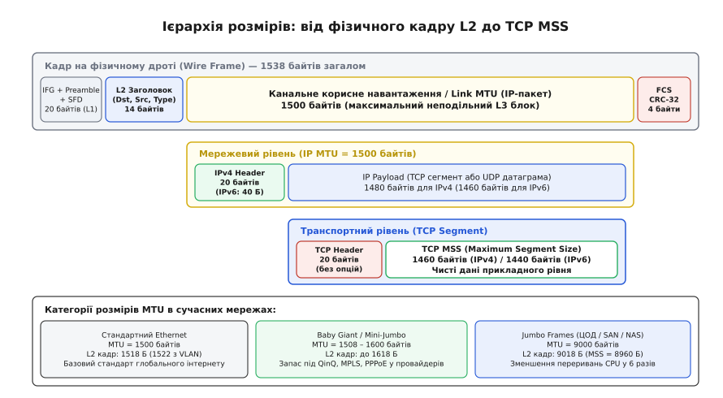
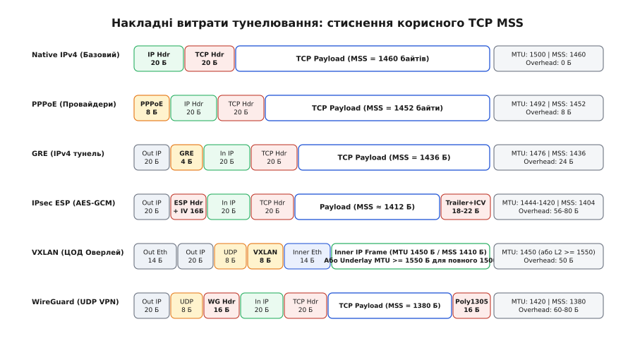
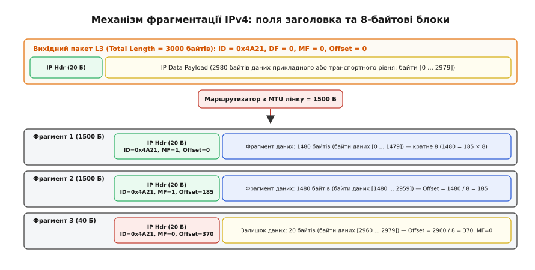
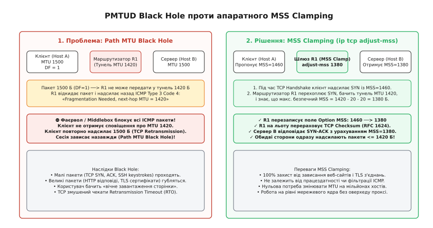

# MTU канального та мережевого рівнів: інкапсуляція, тунелі та MSS

<preknowlist>
- [Кадр Ethernet](topic:communications/ethernet-frame) — структура кадру L2, розмір корисного навантаження, MAC-адреси та FCS.
- [Маршрутизація IP](topic:communications/ip-routing) — передача пакетів L3 між мережами, заголовки IPv4 та IPv6.
- [Життєвий цикл TCP-з'єднання](topic:communications/tcp-connection-lifecycle) — тристороннє рукостискання, опції TCP та обмін сегментами.
</preknowlist>

Коли робоча станція генерує стандартний IP-пакет розміром 1500 байтів і надсилає його у віртуальний тунель (наприклад, WireGuard із допустимим лімітом 1420 байтів або IPsec з лімітом 1440 байтів), маршрутизатор стикається з жорсткою дилемою: пакет фізично не поміщається у вихідний канальний кадр. Якщо прапорець заборони фрагментації не встановлено, маршрутизатор змушений «на льоту» розпилювати пакет на два окремі фрагменти, генеруючи додатковий заголовок, подвоюючи кількість пакетів на секунду в мережі та перевантажуючи центральний процесор приймача операціями зворотного збирання. Якщо ж відправник виставив у заголовку прапорець заборони фрагментації (DF = 1), маршрутизатор зобов'язаний відкинути пакет і повернути службове повідомлення ICMP. Проте якщо проміжний брандмауер безглуздо блокує протокол ICMP, з'єднання потрапляє в невидиму «чорну діру»: дрібні службові пакети проходять безперешкодно, а передача реальних даних зависає назавжди.

Максимальний розмір одиниці передачі (англ. *Maximum Transmission Unit*, MTU) визначає фундаментальну межу неподільності даних на стику канального та мережевого рівнів. Розуміння того, як MTU взаємодіє з накладними витратами тунелювання, фрагментацією IP та максимальним розміром сегмента TCP (MSS), є критичною умовою стабільної роботи сучасних корпоративних мереж, дата-центрів та хмарних оверлеїв.

### Ієрархія розмірів: від фізичного кадру L2 до транспортного TCP MSS

У мережевій інженерії термін «розмір пакета» часто призводить до плутанини, оскільки кожен рівень еталонної моделі оперує власними межами та службовими заголовками. Щоб чітко розрізняти ці величини, розглянемо повний шлях даних від фізичного носія до прикладного сокета.

```
Фізичний дріт (Wire Size, 1538 байтів):
[ IFG (12 Б) + Preamble (7 Б) + SFD (1 Б) ] ──> Фізичний рівень L1
  └── [ L2 Header (14 Б) + L2 Payload (MTU = 1500 Б) + FCS (4 Б) ] ──> Кадр L2 (1518 Б)
        └── [ IPv4 Header (20 Б) + IP Payload (1480 Б) ] ──> Мережевий пакет L3 (1500 Б)
              └── [ TCP Header (20 Б) + TCP Payload (MSS = 1460 Б) ] ──> Сегмент L4
```

1. **Фізичний розмір на дроті (Wire Size):** повна кількість байтів, що передаються фізичним середовищем (витою парою або оптоволокном) для доставки одного кадру. Складається з міжпакетного інтервалу (англ. *Inter-Frame Gap*, IFG, 12 байт-часів), преамбули фізичного рівня (7 байтів), розділювача початку кадру (SFD, 1 байт), кадру канального рівня L2 (1518 байтів) та контрольної суми FCS (4 байти). Для стандартного Ethernet розмір на дроті становить **1538 байтів**.
2. **Розмір кадру канального рівня (L2 Frame Size):** обсяг пам'яті, який займає кадр у буфері комутатора або мережевої карти (від першого байта MAC-адреси призначення до останнього байта FCS). Для базового Ethernet II цей розмір становить **1518 байтів** (14 байтів заголовок + 1500 байтів навантаження + 4 байти FCS). За наявності тега VLAN 802.1Q розмір зростає до **1522 байтів**, а для подвійного тегування QinQ 802.1ad — до **1526 байтів**.
3. **Канальний / мережевий MTU (Link / IP MTU):** максимальний розмір корисного навантаження кадру канального рівня (L2 Payload), у який пакується неподільний пакет мережевого рівня L3 (IPv4 або IPv6). Для класичного Ethernet MTU становить рівно **1500 байтів**. Будь-який IP-пакет разом зі своїм L3-заголовком не може перевищувати це число без застосування фрагментації.
4. **Максимальний розмір сегмента TCP (TCP Maximum Segment Size, MSS):** ліміт корисних даних прикладного рівня, які протокол TCP може помістити в один транспортний сегмент. Оскільки базовий заголовок IPv4 займає 20 байтів, а базовий заголовок TCP — 20 байтів, результуючий стандартний `MSS = 1500 - 20 - 20 = 1460` байтів. Для IPv6 (де базовий заголовок займає 40 байтів) `MSS = 1500 - 40 - 20 = 1440` байтів.


*Повна ієрархія мережевих розмірів: від фізичного кадру L2 на дроті (1538 Б) через канальний IP MTU (1500 Б) до транспортного навантаження TCP MSS (1460 Б для IPv4 та 1440 Б для IPv6).*

Детально історію вибору числа 1500 байтів, обмеження пам'яті комп'ютерів Xerox Alto та компроміси коаксіального кабелю 10BASE5 розкрито у вставці [Чому саме 1500 байтів: компроміс буферів, шуму та затримок](topic:communications/mtu-and-fragmentation/hist-1500-bytes.md).

### Спеціальні категорії розмірів: Baby Giant та Jumbo Frames

У реальних мережах значення MTU 1500 байтів не є єдиним стандартом. Залежно від призначення сегмента мережі використовуються дві розширені категорії кадрів:

#### 1. Baby Giant Frames (Mini-Jumbo, 1508–1600 байтів)
У провайдерських мережах інтернет-доступу та операторських магістралях масовий трафік клієнтів інкапсулюється в додаткові службові заголовки: теги 802.1Q (4 Б), провайдерські теги 802.1ad QinQ (8 Б), мітки MPLS (4–12 Б) або тунелі PPPoE (8 Б).

Якщо комутатори магістралі налаштовані на жорсткий стандартний MTU 1500 байтів, додавання 8 байтів QinQ або 8 байтів PPPoE призводить до того, що сумарний кадр клієнта досягає 1526–1530 байтів і комутатор скидає його як помилку перевищення розміру (англ. *Oversized Frame Drop*). Щоб цього не відбувалося, клієнту довелося б вручну занижувати MTU на домашньому роутері до 1492 або 1460 байтів.

Щоб зберегти для кінцевого абонента повноцінний прозорий `MTU = 1500`, оператори налаштовують на всіх магістральних портах комутаторів та маршрутизаторів розмір кадру **Baby Giant (1508–1600 байтів)**. Цього запасу в 100–108 байтів вистачає для розміщення будь-якої комбінації службових міток без необхідності фрагментувати клієнтський трафік.

#### 2. Jumbo Frames (9000 байтів)
У локальних мережах дата-центрів, кластерах високопродуктивних обчислень (HPC) та мережах зберігання даних (Storage Area Networks, SAN на базі iSCSI, NFSv4 або RoCE — RDMA over Converged Ethernet) стандартний розмір кадру 1500 байтів створює колосальні нераціональні накладні витрати центрального процесора.

Розрахуємо навантаження на процесор при передачі потоку даних зі швидкістю 100 Гбіт/с (12.5 ГБ/с):
* **При стандартному MTU 1500 байтів:** для передачі 12.5 ГБ даних мережева карта повинна сформувати, опрацювати перериваннями та передати приблизно **8.15 мільйона пакетів на секунду (Mpps)**.
* **При Jumbo Frames MTU 9000 байтів:** для передачі того самого обсягу даних потрібно лише **1.36 мільйона пакетів на секунду (Mpps)**.

```
Порівняння інтенсивності переривань на швидкості 100G:
Standard MTU (1500 Б): [■■■■■■■■■■■■■■■■■■■■■■■■] 8.15 Mpps (високе навантаження CPU)
Jumbo Frame  (9000 Б): [■■■■]                     1.36 Mpps (зменшення навантаження у 6 разів)
```

Перехід на Jumbo Frames зменшує кількість пакетних переривань операційної системи та транзакцій у кільцевих буферах DMA рівно в 6 разів, вивільняючи ресурси ядер CPU для прикладних баз даних та систем віртуалізації.

> 🔧 **Навіщо це.** Jumbo Frames можна використовувати **виключно в замкнених, ізольованих L2-сегментах** (всередині серверної стійки або SAN-фабрики). Якщо хоча б один проміжний комутатор у L2-домені матиме MTU 1500, усі 9000-байтові кадри будуть мовчки знищені цим комутатором як апаратні помилки `Giant / Jabber`, що призведе до повної втрати зв'язку між серверами.

### Анатомія інкапсуляції: як тунелі відбирають корисний простір

Коли корпоративні або хмарні системи передають трафік через публічний інтернет, застосовується парадигма «пакет у пакеті» (англ. *packet-in-packet encapsulation*): оригінальний IP-пакет стає корисним навантаженням для нового, зовнішнього транспортного протоколу. 

Оскільки зовнішній пакет сам повинен вкластися у стандартний інтернет-ліміт фізичного MTU (1500 байтів), кожен доданий заголовок інкапсуляції зменшує доступний внутрішній MTU на точну кількість своїх байтів.


*Порівняння структури пакетів та накладних витрат: кожен протокол тунелювання (PPPoE, GRE, IPsec ESP, VXLAN, WireGuard) додає зовнішні заголовки, зменшуючи ефективний внутрішній TCP MSS від базових 1460 байтів до 1410–1380 байтів.*

Розглянемо точну побайтову ціну основних протоколів інкапсуляції:

1. **PPPoE (RFC 2516, 8 байтів оверхеду):**
   * Заголовок PPPoE: 6 байтів;
   * Ідентифікатор протоколу PPP: 2 байти;
   * Ефективний `IP MTU = 1500 - 8 = 1492` байти (`TCP MSS = 1452` байти).
2. **GRE (RFC 2784, 24 байти оверхеду над IPv4):**
   * Зовнішній заголовок IPv4: 20 байтів;
   * Базовий заголовок GRE: 4 байти;
   * Ефективний `IP MTU = 1500 - 24 = 1476` байтів (`TCP MSS = 1436` байтів).
   * Якщо GRE працює над IPv6, зовнішній заголовок займає 40 байтів, сумарний оверхед становить **44 байти**, а `IP MTU = 1456` байтів.
3. **IPsec ESP в тунельному режимі (RFC 4303, 56–74 байти оверхеду):**
   * Зовнішній заголовок IPv4: 20 байтів;
   * Заголовок UDP (для NAT-Traversal): 8 байтів;
   * Заголовок ESP: 8 байтів (`SPI` + `Sequence Number`);
   * Вектор ініціалізації шифру (IV): 16 байтів (для AES-GCM-256);
   * Трейлер ESP та код автентичності (ICV): 18 байтів;
   * Ефективний `IP MTU = 1420–1440` байтів (`TCP MSS = 1380–1400` байтів).
4. **VXLAN (RFC 7348, 50 байтів оверхеду над IPv4):**
   * Зовнішній Ethernet L2: 14 байтів;
   * Зовнішній IP L3: 20 байтів;
   * Зовнішній UDP: 8 байтів (порт 4789);
   * Заголовок VXLAN: 8 байтів (прапорці + ідентифікатор VNI);
   * Сумарний оверхед становить рівно **50 байтів** (над IPv6 — **70 байтів**).
   * *Вимога до ЦОД:* щоб віртуальні машини орендарів мали стандартний `MTU = 1500`, фізична підкладка (Underlay Network) дата-центра зобов'язана підтримувати `MTU >= 1550` байтів (зазвичай на світчах виставляють 9000 або 9216).
5. **GENEVE (RFC 8926, від 50 до 100+ байтів оверхеду):**
   * Базовий оверхед (L2 + IP + UDP + GENEVE) становить 50 байтів, але за наявності опцій змінної довжини TLV (передача контексту безпеки в OVN/NSX-T) оверхед може зростати до 100+ байтів.
6. **WireGuard (60–80 байтів оверхеду):**
   * Зовнішній IP: 20 байтів (IPv4) або 40 байтів (IPv6);
   * Зовнішній UDP: 8 байтів;
   * Заголовок WireGuard: 16 байтів;
   * Автентифікаційний тег Poly1305: 16 байтів;
   * Сумарний оверхед над IPv4 складає **60 байтів**, а над IPv6 — **80 байтів**. Стандартний інтерфейсний MTU WireGuard за замовчуванням встановлюється рівним **1420 байтів**, що гарантує безпомилкову роботу через будь-який тип зовнішнього провайдера.

Повні матриці розрахунку розмірів для всіх типів шифрів та конфігураційні інструкції наведено у [довіднику інкапсуляції, накладних витрат тунелів та конфігурації MTU/MSS](topic:communications/mtu-and-fragmentation/api-tunnel-overhead.md).

### Механізм фрагментації IPv4 та поля заголовка

Коли розмір вхідного IPv4-пакета перевищує MTU вихідного інтерфейсу, а прапорець заборони фрагментації не виставлено (`DF = 0`), маршрутизатор зобов'язаний розбити пакет на кілька менших частин — **фрагментів**.

Керування цим процесом здійснюється за допомогою чотирьох спеціальних полів у базовому заголовку IPv4:

```
Поля фрагментації в заголовку IPv4 (байти 4–7):
 0                   1                   2                   3
 0 1 2 3 4 5 6 7 8 9 0 1 2 3 4 5 6 7 8 9 0 1 2 3 4 5 6 7 8 9 0 1
+-+-+-+-+-+-+-+-+-+-+-+-+-+-+-+-+-+-+-+-+-+-+-+-+-+-+-+-+-+-+-+-+
|        Identification         |Flags|      Fragment Offset    |
+-+-+-+-+-+-+-+-+-+-+-+-+-+-+-+-+-+-+-+-+-+-+-+-+-+-+-+-+-+-+-+-+
```

1. **Ідентифікатор (Identification, 16 бітів):** унікальний числовий маркер, який хост-відправник присвоює оригінальному пакету. Усі фрагменти, утворені з одного вихідного пакета, зберігають однакове значення поля `Identification`. Отримувач використовує комбінацію `{Src IP, Dst IP, Protocol, Identification}` як унікальний ключ для сортування та об'єднання фрагментів.
2. **Прапорці (Flags, 3 біти):**
   * *Біт 0:* зарезервовано (завжди 0).
   * *Біт 1 — DF (Don't Fragment):* заборона фрагментації. Якщо `DF = 1`, маршрутизатору суворо заборонено фрагментувати пакет. Якщо пакет не поміщається в лінк, він негайно знищується.
   * *Біт 2 — MF (More Fragments):* наявність наступних фрагментів. Якщо `MF = 1`, це означає, що за поточним фрагментом слідують інші. Лише в останньому фрагменті виставляється `MF = 0`.
3. **Зміщення фрагмента (Fragment Offset, 13 бітів):** вказує позицію корисних даних поточного фрагмента відносно початку вихідного неподільного блока даних. 
   * **Критичне правило кратності 8:** Оскільки під поле зміщення виділено лише 13 бітів, а максимальний розмір пакета становить `2¹⁶ = 65535` байтів, значення зміщення вимірюється не в окремих байтах, а в **8-байтових блоках (64-бітних квантах)**. Через це розмір корисного навантаження кожного проміжного фрагмента **зобов'язаний бути строго кратним 8**.


*Процес фрагментації пакета розміром 3000 байтів: розбиття на два повнорозмірні фрагменти по 1500 байтів (1480 Б даних, кратні 8) та фінальний хвостовий фрагмент 40 байтів (20 Б залишку даних).*

#### Покроковий приклад фрагментації
Нехай відправник надсилає UDP-пакет загальним розміром 3000 байтів (20 байтів IP-заголовок + 8 байтів UDP-заголовок + 2972 байти даних) через маршрутизатор із вихідним лінком `MTU = 1500` байтів (`DF = 0`):

1. **Фрагмент 1:**
   * Загальна довжина (Total Length): `1500` байтів (20 Б заголовок IP + 1480 Б корисних даних).
   * Зверніть увагу: 1480 ділиться на 8 (`1480 / 8 = 185`).
   * Поля: `ID = 0x4A21`, `DF = 0`, `MF = 1`, `Fragment Offset = 0`.
   * Дані: містить оригінальний UDP-заголовок (8 Б) та перші 1472 байти прикладних даних (діапазон байтів `[0 ... 1479]`).
2. **Фрагмент 2:**
   * Загальна довжина: `1500` байтів (20 Б заголовок IP + 1480 Б даних).
   * Поля: `ID = 0x4A21`, `DF = 0`, `MF = 1`, `Fragment Offset = 185` (`185 × 8 = 1480`).
   * Дані: наступний блок даних (діапазон байтів `[1480 ... 2959]`).
3. **Фрагмент 3 (Останній):**
   * Залишок корисних даних: `2980 - 1480 - 1480 = 20` байтів.
   * Загальна довжина: `40` байтів (20 Б заголовок IP + 20 Б даних).
   * Поля: `ID = 0x4A21`, `DF = 0`, `MF = 0` (маркер завершення), `Fragment Offset = 370` (`370 × 8 = 2960`).
   * Дані: фінальні байти `[2960 ... 2979]`.

### Архітектурна революція IPv6: повна заборона транзитної фрагментації

У протоколі IPv6 (RFC 8200) архітектори інтернету повністю відмовилися від фрагментації пакетів проміжними маршрутизаторами. 

У базовому 40-байтовому заголовку IPv6 **взагалі відсутні поля Identification, Flags та Fragment Offset**. Будь-який пакет IPv6 апріорі вважається таким, що має прапорець `DF = 1`.

Якщо розмір пакета IPv6 перевищує MTU вихідного порту маршрутизатора:
1. Маршрутизатор **негайно знищує пакет**.
2. Маршрутизатор надсилає відправнику службове повідомлення `ICMPv6 Type 2 Code 0` (*Packet Too Big*), у якому обов'язково вказує точний MTU свого вузького лінку.
3. Відправник зобов'язаний самостійно зменшити розмір наступних пакетів або застосувати фрагментацію на хості-джерелі за допомогою спеціального додаткового заголовка розширення — **Fragment Extension Header** (`Next Header = 44`).

Мінімальний гарантований MTU для будь-якого лінку в мережі IPv6 становить **1280 байтів** (на відміну від застарілих 576 байтів у IPv4). Будь-який провайдер або тунель, що не здатний пропустити 1280 байтів, вважається несумісним зі специфікацією IPv6.

### Прихована ціна фрагментації: 5 причин уникати її в продакшені

Хоча фрагментація була створена як механізм прозорої сумісності мереж, у реальній експлуатації вона завдає колосальної шкоди стабільності та продуктивності систем:

```
П'ять руйнівних наслідків IP-фрагментації:
┌─────────────────────────┬──────────────────────────────────────────────────────────┐
│ 1. Витрати пам'яті CPU  │ Буферизація недозібраних пакетів у ядрі до таймауту      │
├─────────────────────────┼──────────────────────────────────────────────────────────┤
│ 2. Подвоєння PPS        │ Зростання кількості пакетних переривань мережевих карт   │
├─────────────────────────┼──────────────────────────────────────────────────────────┤
│ 3. Ампліфікація втрат   │ Втрата 1 фрагмента веде до втрати всього блоку TCP       │
├─────────────────────────┼──────────────────────────────────────────────────────────┤
│ 4. Збій фаєрволів (L4)  │ Фрагменти №2, №3 не мають заголовка портів TCP/UDP       │
├─────────────────────────┼──────────────────────────────────────────────────────────┤
│ 5. Відмова Offload-чипів│ Неможливість апаратного прискорення LRO, GRO, TSO на NIC │
└─────────────────────────┘
```

1. **Вичерпання пам'яті та навантаження CPU на збирання:**
   Проміжний маршрутизатор або кінцевий сервер не може віддати фрагментований пакет у сокет прикладного рівня частинами: ядро ОС зобов'язане виділити блок пам'яті (`sk_buff` у Linux), зберегти перший фрагмент і очікувати на прибуття всіх наступних частин. Якщо через затримки або втрати хоча б один фрагмент запізнюється, виділена пам'ять утримується до вичерпання таймауту `ipfrag_time` (за замовчуванням 30 секунд у Linux). Зловмисники масово використовують це для DoS-атак (*Fragment Flood*, атаки Teardrop та Rose), надсилаючи мільйони недозібраних фрагментів і повністю паралізуючи пам'ять сервера.
2. **Подвоєння інтенсивності пакетного потоку (Packets Per Second, PPS):**
   Продуктивність комутаторів та софтверних маршрутизаторів лімітується не гігабітами на секунду, а кількістю пакетів на секунду, яку здатна опрацювати комутаційна матриця (ASIC) або стек переривань ядра. Розбиття кожного пакета 1500 байтів на два фрагменти миттєво **подвоює навантаження на систему переривань**, викликаючи деградацію пропускної здатності на 40–50%.
3. **Ампліфікація мережевих втрат (Loss Amplification):**
   Якщо пакет розбито на 4 фрагменти, втрата будь-якого одного з них через випадковий шум або переповнення черги робить решту 3 фрагменти абсолютно марними: приймач відкине їх усі після таймауту. При коефіцієнті втрат у каналі `p = 1%` ймовірність втрати вихідного 4-фрагментного пакета зростає майже до `4%`, викликаючи масові таймаути транспортного рівня.
4. **Помилки фільтрації фаєрволів та NAT (L4 Middlebox Breakdown):**
   Заголовки транспортного рівня TCP та UDP (із номерами портів джерела та призначення) містяться **виключно в першому фрагменті** (`Fragment Offset = 0`). Фрагменти №2, №3 і №4 містять лише чисте тіло даних без інформації про порти. Якщо фаєрвол із контролем стану (Stateful Firewall) або транслятор адрес NAT не підтримує глибоке ресурсомістке віртуальне перескладання пакетів у пам'яті, він відкидає всі наступні фрагменти як неідентифіковані або небезпечні, руйнуючи передачу даних.
5. **Розрив апаратного розвантаження мережевих карт (NIC Offloading):**
   Сучасні мережеві адаптери використовують апаратні механізми прискорення: `TSO (TCP Segmentation Offload)` для передачі та `GRO (Generic Receive Offload)` для прийому. При увімкненому TSO операційна система формує єдиний гігантський TCP-буфер розміром до 64 кілобайтів і передає його мережевій карті, де апаратний ASIC самостійно нарізає потік на сегменти заданого розміру MSS і генерує IP-заголовки на повній швидкості порту. 
   Фрагментовані IP-пакети повністю ламають цей конвеєр: чип NIC не може зібрати фрагменти в один потік GRO, змушуючи ядро операційної системи обробляти кожен мікропакет вручну через програмні переривання.

### Транспортний рівень: Розрахунок TCP MSS та вплив розширень

Розрахунок максимального розміру сегмента TCP (MSS) є прямим наслідком розміру мережевого MTU. Під час встановлення з'єднання (TCP 3-Way Handshake) клієнт та сервер обмінюються пакетами `SYN` та `SYN-ACK`, у яких передають опцію TCP Option 2 (`Max Segment Size`).

#### Базовий розрахунок MSS:
```
IPv4: TCP_MSS = IP_MTU - 20 (IPv4 Header) - 20 (TCP Header)
IPv6: TCP_MSS = IP_MTU - 40 (IPv6 Header) - 20 (TCP Header)
```

Для стандартного каналу з MTU 1500 байтів:
* Базовий `MSS (IPv4) = 1500 - 20 - 20 = 1460` байтів.
* Базовий `MSS (IPv6) = 1500 - 40 - 20 = 1440` байтів.

#### Вплив опцій TCP (Timestamps та SACK):
Базовий заголовок TCP має довжину 20 байтів, проте він може бути розширений опціями довжиною до 40 байтів (максимальний заголовок TCP — 60 байтів):
1. **TCP Timestamps (RFC 7323):** додає **12 байтів** службової інформації до кожного TCP-пакета (4 байти вирівнювання NOP/Kind + 4 байти мітки часу відправника `TSval` + 4 байти мітки відлуння отримувача `TSecr`). Опція використовується для точного вимірювання кругового часу RTT та захисту від накладання номерів послідовностей (PAWS). Якщо задіяно Timestamps, ефективний розмір корисних даних зменшується:
   ```
   Ефективний MSS = 1460 - 12 = 1448 байтів (для IPv4)
   ```
2. **TCP SACK (Selective Acknowledgment, RFC 2018):** у моменти виникнення втрат у каналі заголовок TCP розширюється блоками SACK (по 8 байтів на кожен блок підтвердженого діапазону, максимум до 4 блоків / 32 байтів). Якщо відправник сформував сегмент з граничним розміром MSS без урахування появи SACK-блоків, такий пакет може перевищити MTU вихідного інтерфейсу. Сучасні стеки TCP (Linux, Windows) автоматично резервують простір під опції, динамічно зменшуючи розмір корисного навантаження.

> 🔧 **Асиметрія MSS.** Важливо пам'ятати: значення MSS, яке вузол передає у своєму пакеті SYN, позначає **максимальний розмір сегмента, який цей вузол готовий ПРИЙМАТИ**, а не те, що він збирається відправляти. Тому в асиметричних каналах (наприклад, супутниковий лінк або мобільний зв'язок) значення MSS у прямому та зворотному напрямках можуть законно відрізнятися.

### Path MTU Discovery (PMTUD), Black Holes та MSS Clamping

Щоб повністю виключити фрагментацію в глобальному інтернеті, було розроблено стандарт **Path MTU Discovery (PMTUD, RFC 1191)**.

#### Принцип роботи PMTUD
1. Хост-відправник виставляє на всіх вихідних TCP-пакетах прапорець `DF = 1` і починає передачу з максимальним розміром сегмента, що відповідає локальному MTU (наприклад, 1500 байтів).
2. Якщо на шляху трапляється вузький лінк (наприклад, тунель PPPoE з MTU 1492), проміжний маршрутизатор відкидає пакет і надсилає назад повідомлення `ICMP Type 3 Code 4` (*Fragmentation Needed*), де вказує: *«Мій MTU = 1492»*.
3. Отримавши це повідомлення, ядро операційної системи відправника оновлює свій локальний кеш маршрутизації (`Routing Table / PMTU Cache`), зменшує робочий розмір TCP MSS до 1452 байтів і прозоро повторює передачу.


*Проблема Path MTU Black Hole: блокування ICMP фаєрволами призводить до зависання сесії. Рішення: транзитний шлюз виконує MSS Clamping, модифікуючи опцію MSS у TCP SYN на льоту.*

#### Проблема «чорної діри» (Path MTU Black Hole)
У реальному інтернеті бездоганна теорія PMTUD розбивається об некваліфіковане адміністрування брандмауерів. Багато системних адміністраторів з міркувань так званої «безпеки» повністю блокують весь вхідний та вихідний трафік ICMP на фаєрволах.

Коли маршрутизатор намагається повідомити відправника про необхідність зменшити пакет, його ICMP-повідомлення відкидається брандмауером. Відправник не знає, що пакет відкинуто, і безкінечно повторює передачу 1500-байтового блока за тайм-аутом ретрансмісії (RTO). Користувач бачить, що веб-сайт пінгується, TCP-з'єднання встановлюється, але сама веб-сторінка або TLS-сертифікат ніколи не завантажуються.

Практичний інструмент для виявлення чорних дір та бінарного зондування каналу реалізовано у вставці [Сканер Path MTU: зондування сирими сокетами та виявлення чорних дір](topic:communications/mtu-and-fragmentation/proj-pmtud-probe.md).

#### Інженерне рішення: MSS Clamping (Затискання MSS)
Оскільки змусити всіх провайдерів світу коректно пропускати ICMP неможливо, мережеві інженери застосовують безвідмовний обхідний механізм — **MSS Clamping (ip tcp adjust-mss)**.

Механізм працює безпосередньо на транзитному маршрутизаторі або шлюзі доступу (наприклад, на домашньому роутері чи VPN-концентраторі):
1. Під час встановлення TCP-з'єднання клієнт та сервер обмінюються пакетами `SYN` та `SYN-ACK`, у яких передають опцію TCP `Maximum Segment Size` (наприклад, клієнт заявляє `MSS = 1460`).
2. Маршрутизатор, що стоїть на межі тунелю (де `MTU = 1420`), інспектує всі транзитні пакети з прапорцем `SYN`.
3. Маршрутизатор бачить, що заявлений `MSS = 1460` є небезпечним для його тунелю (максимальний безпечний `MSS = 1420 - 40 = 1380`).
4. Маршрутизатор **«на льоту» перезаписує 16-бітове поле опції MSS у заголовку TCP**, змінюючи 1460 на 1380, та миттєво перераховує контрольну суму TCP за алгоритмом швидкого інкрементного оновлення (RFC 1624).
5. Обидві сторони з'єднання вважають, що віддалений співрозмовник добровільно запросив розмір сегмента 1380 байтів, і від самого початку надсилають пакети, які ідеально проходять крізь тунель без найменшого ризику фрагментації чи залежності від ICMP.

### Розбір реального інциденту: деградація оверлею в кластері Kubernetes

Розглянемо типовий виробничий збій, з яким регулярно стикаються DevOps- та мережеві інженери під час розгортання кластерів Kubernetes на базі CNI-плагіна Calico з інкапсуляцією VXLAN.

#### Сценарій збою:
* Фізична мережа дата-центру (Underlay) налаштована на стандартний `MTU = 1500` на портах комутаторів.
* Адміністратор розгорнув Calico CNI без явного вказання параметрів MTU, через що віртуальні інтерфейси контейнерів `cali*` та мости `cni0` отримали дефолтний `MTU = 1500`.
* При відправці контейнером пакета розміром 1500 байтів ядро хоста додає 50 байтів заголовків VXLAN (Outer IP + UDP + VXLAN). Загальний розмір пакета стає `1550` байтів.
* Оскільки на фізичному інтерфейсі хоста `eth0` встановлено MTU 1500, а на оверлейному трафіку виставлено `DF = 1`, ядро Linux не може надіслати пакет 1550 байтів і відкидає його.

```
Схема збою в оверлеї Kubernetes:
[ Контейнер Pod A ] ──> Пакет 1500 Б (DF=1)
                              │
[ Ядро Node 1 (VXLAN) ] ──> Додає 50 Б оверхеду (Разом 1550 Б)
                              │
[ Фізичний порт eth0 ] ──> MTU 1500 Б (⛔ Пакет 1550 Б DROP!)
                              │
                    [ Жодного ICMP до Pod A ]
                              │
               [ Каскадний таймаут gRPC / HTTP ]
```

#### Симптоми в продакшені:
1. Базові перевірки готовності (Kubernetes Readiness / Liveness Probes) успішно проходять, оскільки запит `GET /healthz` має розмір лише 120 байтів і вільно проходить через тунель.
2. Мікросервіси успішно підключаються до баз даних і надсилають дрібні запити.
3. Проте щойно сервіс надсилає великий JSON-документ або виконує gRPC-виклик розміром понад 1450 байтів, запит зависає до таймауту, викликаючи каскадне падіння залежних сервісів.

#### Діагностика та усунення:
Перевірка лічильників відкинутих фрагментів у системі виявляє стрімке зростання помилок:
```bash
# Перевірка статистики фрагментації в ядрі Linux
cat /proc/net/snmp | grep -i ip:
# Значення ReasmFails та FragFails стрімко зростають
```

Правильне архітектурне вирішення інциденту полягає в одному з двох кроків:
1. **Ідеальне рішення (на рівні заліза):** Збільшити фізичний MTU на всіх комутаторах фабрики ЦОД до `9000` або `1600` байтів.
2. **Програмне рішення (на рівні CNI):** Явно задати в конфігурації Calico / Flannel параметри оверлею `MTU = 1450` (для VXLAN) або `MTU = 1440` (для WireGuard). Після цього CNI автоматично призначить віртуальним інтерфейсам подів безпечний MTU, усунувши перевищення розміру на фізичному порту.

### Практичні правила конфігурації та експлуатації мереж

Для запобігання аваріям зв'язку та досягнення максимальної продуктивності мережевої інфраструктури діють чотири непорушні інженерні правила:

1. **Jumbo Frames конфігуруються виключно End-to-End:**
   Якщо ви вмикаєте `MTU = 9000` на серверах сховищ SAN, ви зобов'язані увімкнути MTU 9000 або 9216 на кожному фізичному порті кожного комутатора між ними. Навіть один комутатор зі стандартним MTU 1500 розірве зв'язок.
2. **Underlay мережа оверлеїв повинна мати запас не менше 50–100 байтів:**
   У будь-якій фабриці ЦОД з використанням VXLAN або GENEVE фізичні комутатори Spine-Leaf повинні мати `MTU >= 1600` байтів (рекомендовано `9000`), щоб віртуальні машини орендарів могли вільно працювати зі стандартним `MTU = 1500` без падіння продуктивності.
3. **MSS Clamping є обов'язковим для всіх VPN-шлюзів та PPPoE-підключень:**
   На будь-якому маршрутизаторі, що термінує тунелі PPPoE, GRE, IPsec чи WireGuard, має бути налаштовано правило затискання MSS (`ip tcp adjust-mss` у Cisco або `--clamp-mss-to-pmtu` в Linux iptables).
4. **Сувора заборона блокування ICMP Type 3 Code 4 та ICMPv6 Type 2:**
   У конфігураціях фаєрволів ніколи не блокуйте повідомлення *Destination Unreachable: Fragmentation Needed* (IPv4) та *Packet Too Big* (IPv6). Вони є фундаментом працездатності світового інтернету.
