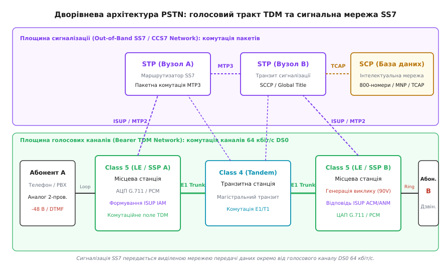
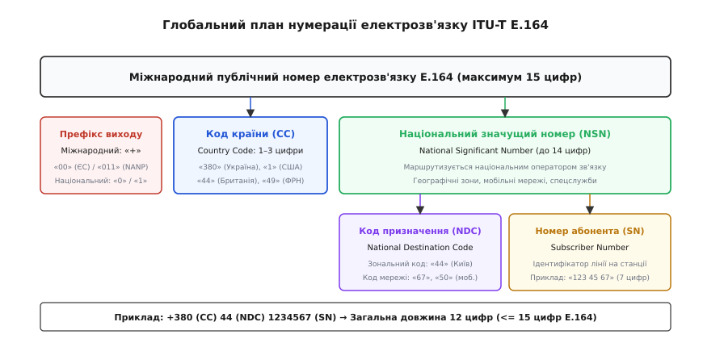
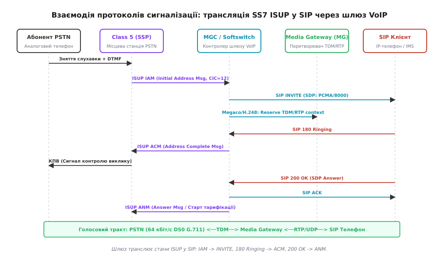
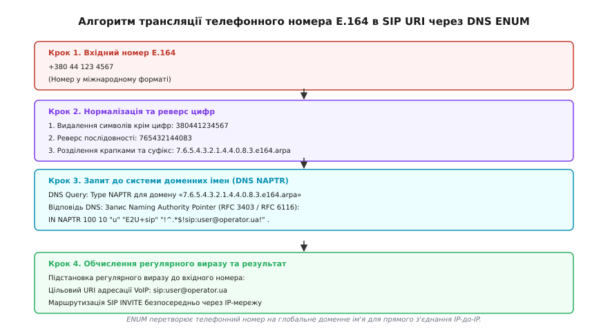

# Телефонна мережа й нумерація E.164: від комутації каналів до DNS ENUM

<preknowlist>
- [Комутація каналів проти комутації пакетів](topic:communications/circuit-vs-packet-switching) — фундаментальні відмінності між виділеним фізичним трактом та дейтаграмною передачею даних.
- [Транспортні протоколи TCP і UDP](topic:communications/tcp-vs-udp) — потоковий транспорт із гарантією доставки проти дейтаграмного протоколу без встановлення з'єднання.
- [Записи DNS SRV і NAPTR](topic:communications/dns-srv-naptr) — механізми виявлення мережевих служб за допомогою ієрархічної системи доменних імен.
- [Протокол SIP](topic:communications/sip) — текстова сигналізація встановлення, модифікації та завершення мультимедійних сеансів зв'язку поверх IP.
</preknowlist>

Коли абонент у Києві підіймає слухавку аналогового телефонного апарата і набирає номер `+1 212 555 0199`, замикання електричного кола фіксується місцевою комутаційною станцією за наростанням постійного струму в абонентському шлейфі. Менш ніж за 800 мілісекунд у глобальній мережі виділяються синхронні часові інтервали зі швидкістю 64 кбіт/с крізь мідні проводи останньої милі, цифрові магістралі E1/T1, транзитні комутаційні центри, трансатлантичні оптичні підводні кабелі та прикінцеві телефонні шлюзи на Мангеттені, а на протилежному кінці лінії запускається високовольтний генератор виклику.

Здатність з'єднувати мільярди незалежних терміналів за єдиним детермінованим алгоритмом без централізованої глобальної бази даних спирається на дві взаємопов'язані системи: комутовану телефонну мережу загального користування (**PSTN**, англ. *Public Switched Telephone Network*, у вітчизняній інженерній традиції — ТМЗК) та міжнародний план нумерації електрозв'язку **ITU-T E.164**.

---

### Фізичний рівень абонентського шлейфу та оцифрування голосового тракту

Класична абонентська лінія (англ. *Local Loop* або *Last Mile*) становить двопровідну мідну пару (дроти `Tip` та `Ring`), що з'єднує телефонний апарат користувача з лінійним комплектом місцевої телефонної станції.

```
[ Телефонний апарат ] ─── Двопровідна мідна пара (Tip/Ring) ─── [ Лінійний комплект АТС (SLIC) ]
     (Трансформатор,                 -48 В постійного струму           (BORSCHT-функції,
     важільний перемикач,            Зняття слухавки: 20-30 мА         Джерело живлення, АЦП,
     DTMF-генератор)                 Сигнал виклику: 90 В ~ 20 Гц      Фільтр низьких частот)
```

Інтерфейс абонентської лінії виконує комплекс апаратних операцій, стандартизованих під мнемонічною назвою **BORSCHT** (*Battery, Overvoltage, Ringing, Supervision, Codec, Hybrid, Test*):

1. **Живлення лінії (Battery Feed):** станція постійно подає на лінію напругу -48 В (або -60 В у деяких європейських мережах) постійного струму від акумуляторних батарей. Негативна полярність відносно заземлення захищає підземні мідні провідники від прискореної електрохімічної корозії у вологому ґрунті.
2. **Контроль стану шлейфу (Supervision):** 
   * У стані спокою (слухавка покладена, On-Hook) ланцюг розірвано постійному струму через конденсатор усередині телефона, струм у лінії дорівнює нулю.
   * Коли абонент знімає слухавку (Off-Hook), контакти важільного перемикача замикають лінію через опір телефонного трансформатора (близько 600 Ом). У колі починає протікати постійний струм величиною 20–30 мА. Станційне реле або електронний датчик струму фіксує перепад і надсилає в лінію безперервний акустичний сигнал готовності станції (Dial Tone, 425 Гц у європейських мережах або комбінація 350 + 440 Гц у Північній Америці).
3. **Генерація виклику (Ringing):** для створення дзвінка станція комутує в лінію напругу 90–110 В змінного струму частотою 20–25 Гц поверх постійної зміщувальної напруги -48 В, подаючи її короткими посилками (1 секунда дзвінка, 4 секунди паузи).
4. **Диференційна розв'язка (Hybrid 2-wire / 4-wire):** абонентська лінія передає звук в обох напрямках по одній парі дротів (2-провідний тракт), тоді як цифрові кодеки та підсилювачі станції вимагають роздільних каналів передачі та прийому (4-провідний тракт: Tx+, Tx-, Rx+, Rx-). Для розділення сигналів застосовується диференційний трансформатор або електронна гібридна схема (англ. *Hybrid Coil*). Неідеальне узгодження імпедансу лінії (600 Ом) з балансним контуром призводить до просочування вихідного сигналу у зворотний тракт, породжуючи електричне ехо. При міжміських викликах із затримкою понад 25 мс станції вмикають цифрові ехокомпенсатори (ITU-T G.168).
5. **Набір номера:** історичний імпульсний набір (переривання струму частотою 10 Гц) витіснено двотональним багаточастотним набором **DTMF** (англ. *Dual-Tone Multi-Frequency*). Кожна клавіша генерує одночасне звучання двох синусоїдальних частот: однієї з нижньої групи (рядки: 697, 770, 852, 941 Гц) та однієї з верхньої групи (стовпчики: 1209, 1336, 1477, 1633 Гц). Станційний матричний DSP-декодер розпізнає натиснуту цифру менш ніж за 40 мс.

#### Оцифрування голосу: PCM та стандарт ITU-T G.711

На рівні лінійного комплекту станції аналоговий сигнал перетворюється на цифровий потік за стандартом імпульсно-кодової модуляції **PCM** (англ. *Pulse Code Modulation*, рекомендація ITU-T G.711):

* Смуга пропускання людського голосу, достатня для розбірливого мовлення, обмежується аналоговим фільтром у діапазоні 300–3400 Гц.
* Відповідно до теореми Котельникова-Найквіста, частота дискретизації вибирається рівною `8000 Гц` (інтервал вибірки 125 мікросекунд).
* Кожна миттєва амплітуда квантується 8-бітним кодом. Швидкість отриманого базового цифрового каналу становить:

```
8000 вибірок/с × 8 бітів/вибірку = 64 000 біт/с (64 кбіт/с)
```

Цей елементарний цифровий потік 64 кбіт/с позначається як **DS0** (Digital Signal 0) і є неподільним квантом комутації в усій світовій телефонній інфраструктурі.

Для мінімізації шуму квантування при малих рівнях сигналу застосовується логарифмічне нелінійне квантування (компандерне стиснення):
* **A-law:** використовується в Європі, Україні та більшості країн світу (параметр стиснення `A = 87.6`);
* **µ-law (mu-law):** використовується в США, Канаді та Японії (параметр `µ = 255`).

При з'єднанні абонентів між різними континентами міжнародні шлюзи виконують автоматичне перекодування A-law ↔ µ-law за нормативними таблицями перетворення.

---

### Цифрові магістралі TDM: структури потоків E1 та T1

Для передачі тисяч телефонних розмов між комутаційними станціями канали DS0 мультиплексуються в часі за технологією **TDM** (англ. *Time-Division Multiplexing*). Залежно від географічного регіону діють два несумісні на фізичному рівні первинні цифрові стандарти:

```
Ієрархія цифрових потоків TDM:
┌────────────────────────────────────────────────────────────────────────────────────────┐
│ Європейський стандарт E1 (ITU-T G.704):                                               │
│ 1 кадр = 125 мкс = 32 часові інтервали (Timeslots, TS0..TS31) по 8 бітів = 256 бітів   │
│ [ TS0: Синхронізація/CRC-4 ] [ TS1..TS15: Голос ] [ TS16: Сигналізація ] [ TS17..TS31: Голос ]│
│ Загальна швидкість: 256 бітів × 8000 кадрів/с = 2.048 Мбіт/с (30 голосових каналів)   │
└────────────────────────────────────────────────────────────────────────────────────────┘

┌────────────────────────────────────────────────────────────────────────────────────────┐
│ Американський стандарт T1 / DS1 (ANSI T1.403):                                        │
│ 1 кадр = 125 мкс = 24 канали по 8 бітів + 1 біт синхронізації (F-bit) = 193 біти       │
│ [ F-bit ] [ Канал 1 ] [ Канал 2 ] ... [ Канал 24 ]                                     │
│ Загальна швидкість: 193 біти × 8000 кадрів/с = 1.544 Мбіт/с (24 голосові канали)       │
└────────────────────────────────────────────────────────────────────────────────────────┘
```

1. **Потік E1 (Європа/Світ):**
   * Частота кадрів — 8000 Гц (тривалість кадру 125 мкс).
   * Кадр розбито на 32 часові інтервали (таймслоти) від `TS0` до `TS31` по 8 бітів кожен.
   * `TS0` виділено для кадрової синхронізації (FAS/NFAS) та контролю помилок CRC-4.
   * `TS16` виділено для сигнальних повідомлень (позасмугова сигналізація SS7 або ISDN PRI).
   * Решта 30 таймслотів (`TS1`–`TS15` та `TS17`–`TS31`) несуть незалежні оцифровані голосові розмови DS0.
2. **Потік T1 (США/Японія):**
   * Містить 24 голосові канали по 8 бітів plus 1 біт обрамлення (Framing Bit).
   * Розмір кадру становить `24 × 8 + 1 = 193 біти`, що дає швидкість 1.544 Мбіт/с.
   * Для сигналізації застосовується механізм "вкраденого біта" (Robbed-Bit Signaling, де кожний 6-й кадр молодший біт вибірки замінюється сигнальним станом) або виділений 24-й канал у стандарті ISDN PRI.

Для формування магістралей вищої місткості потоки E1 об'єднуються в ієрархії плезіохронної цифрової ієрархії **PDH** (E2 = 8.448 Мбіт/с, E3 = 34.368 Мбіт/с, E4 = 139.264 Мбіт/с) або безпосередньо транслюються в оптичні контейнери синхронної цифрової ієрархії **SDH/SONET** (STM-1 на швидкості 155.52 Мбіт/с вміщує рівно 63 потоки E1).

---

### Архітектура та ієрархія телефонних станцій (PSTN Switch Hierarchy)

Мережа PSTN організована за суворою багаторівневою ієрархією комутаційних центрів, що оптимізує витрати на прокладання міжміських ліній зв'язку.


*Архітектура класичної телефонної мережі. Нижня площина здійснює комутацію фізичних каналів TDM 64 кбіт/с через цифрові потоки E1, тоді як верхня площина SS7 передає сигнальні пакети встановлення виклику незалежно від голосового тракту.*

Ієрархічна структура класифікує комутаційні вузли за класами (відповідно до класифікації Bell System та стандартів ITU-T):

1. **Місцева станція (Class 5 / Local Exchange / End Office / Central Office):**
   * Безпосередньо обслуговує кінцевих абонентів (квартирні телефони, аналогові лінії, цифрові інтерфейси ISDN).
   * Виконує аналогово-цифрове перетворення, перевірку прав доступу, підрахунок тривалості місцевих розмов та генерацію тональних сигналів.
   * Ємність станції Class 5 зазвичай становить від 5 000 до 100 000 абонентських ліній.
2. **Транзитна / Внутрішньозонова станція (Class 4 / Tandem / Toll / Transit Exchange):**
   * Не має підключених кінцевих користувачів.
   * Комутує цифрові магістральні потоки E1/T1/STM-1 виключно між станціями Class 5 усередині одного міста чи агломерації або спрямовує виклики на магістральну міжміську мережу.
3. **Міжміські та Міжнародні комутаційні центри (Class 3 / Class 2 / Class 1 / International Gateway / IGW):**
   * Виконують маршрутизацію міжміського та міжнародного трафіку між різними національними операторами зв'язку.
   * Здійснюють трансляцію протоколів сигналізації, компенсацію акустичного та електричного еха на міжконтинентальних лініях із затримкою понад 25 мс, конвертацію форматів A-law/µ-law та взаєморозрахунки між операторами (Billing/Interconnect).
4. **Офісна телефонна станція (PBX / Private Branch Exchange):**
   * Корпоративний комутатор, що встановлюється на підприємстві для внутрішнього зв'язку співробітників без залучення ресурсів публічної мережі.
   * Підключається до міської АТС Class 5 за допомогою цифрових транків ISDN PRI або аналогових ліній.

Історію того, як електромеханічні крокові перемикачі Строуджера поступилися місцем цифровій комутації та чому внутрішньосмугові акустичні тони зазнали краху через телефонний фрікінг, детально висвітлює [еволюція від ручних комутаторів до позасмугової сигналізації SS7](topic:communications/pstn-e164/hist-pstn-evolution.md).

---

### Глобальний план нумерації електрозв'язку ITU-T E.164

Для адресації будь-якого телефонного апарата на планеті Міжнародний союз електрозв'язку (ITU-T) ухвалив рекомендацію **E.164** («Міжнародний план нумерації електрозв'язку загального користування»).


*Структура міжнародного телефонного номера E.164: розподіл на код країни (CC), національний код призначення (NDC) та номер абонента (SN).*

#### Структура та правила формату E.164

Номер E.164 є строго десятковим рядком змінної довжини, що не перевищує **15 цифр** (без урахування міжнародних префіксів виходу).

Загальна структура номера складається з трьох послідовних компонентів:

```
+-------------------------------------------------------------------------+
| Міжнародний номер ITU-T E.164 (Максимум 15 десяткових цифр)             |
+-------------------+-----------------------------------------------------+
| Код країни (CC)   | Національний значущий номер (NSN, National Number)  |
| 1 – 3 цифри       +---------------------------+-------------------------+
|                   | Код призначення (NDC)     | Номер абонента (SN)     |
|                   | 1 – 6 цифр                | Залишкова довжина       |
+-------------------+---------------------------+-------------------------+
```

1. **Код країни (Country Code, CC):**
   * Складається з 1, 2 або 3 десяткових цифр.
   * Призначається виключно ITU-T.
   * Світ поділено на 9 географічних зон нумерації (перша цифра коду):
     * `1` — Північноамериканський план нумерації (NANP: США, Канада та країни Карибського басейну);
     * `2` — Африка (наприклад, Єгипет `20`, ПАР `27`);
     * `3` та `4` — Європа (Україна `380`, Велика Британія `44`, Німеччина `49`, Франція `33`, Польща `48`);
     * `5` — Південна та Центральна Америка (Бразилія `55`, Аргентина `54`);
     * `6` — Австралія та Океанія (Австралія `61`, Нова Зеландія `64`);
     * `7` — Казахстан (`76xx`, `77xx`);
     * `8` — Східна Азія та спеціальні служби (Японія `81`, Китай `86`, супутниковий зв'язок Inmarsat `870`);
     * `9` — Близький Схід та Південна Азія (Індія `91`, Туреччина `90`).
2. **Національний код призначення (National Destination Code, NDC):**
   * Визначає географічну зону всередині країни (код міста, Area Code) або логічну мережу оператора мобільного зв'язку (Mobile Network Code, MNC).
   * Приклади для України (`CC = 380`):
     * Географічний код: `44` (Київ), `32` (Львів), `48` (Одеса);
     * Код мобільного оператора: `50`, `66`, `95`, `99` (Vodafone), `67`, `68`, `96`, `97`, `98` (Kyivstar), `63`, `73`, `93` (lifecell).
3. **Номер абонента (Subscriber Number, SN):**
   * Унікальний номер лінії абонента в межах конкретного комутаційного вузла чи мобільної мережі.
   * Довжина підбирається національним регулятором так, щоб сумарна довжина `CC + NDC + SN` ніколи не перевищувала 15 цифр.
4. **Національний значущий номер (National Significant Number, NSN):**
   * Комбінація `NDC + SN`. Національні мережі маршрутизують виклики на основі аналізу цифр NSN без необхідності перевірки коду власної країни.

#### Префікси виходу та нормалізація запису

У людській нотації міжнародний формат позначається знаком `+` перед кодом країни (наприклад, `+380 44 123 4567`). Символ `+` не є цифрою і не передається телефонними протоколами; він означає вимогу набрати локальний **префікс виходу на міжнародну мережу** (International Call Prefix / Escape Code):

* `00` — стандартний префікс у більшості країн світу (ЄС, Україна, Азія): набір `00 1 212 555 0199`;
* `011` — префікс у Північній Америці (NANP): набір `011 380 44 123 4567`;
* `8~10` — застарілий префікс виходу в пострадянських мережах.

Аналогічно, для дзвінків усередині країни перед кодом NDC набирається **міжміський національний префікс** (Trunk Prefix): `0` в Україні та країнах Європи (наприклад, `0 44 123 4567`), або `1` у США/Канаді.

#### Алгоритми маршрутизації за планом нумерації (Dial Plan Engine)

Комутаційні станції PSTN виконують маршрутизацію викликів за принципом **найдовшого збігу префікса** (англ. *Longest Prefix Match*), використовуючи префіксні дерева (Trie-структури):

1. **Аналіз цифр (Digit Analysis):** у міру введення номера комутатор зіставляє початкові цифри з таблицею напрямків (Routing Table). Щойно накопичено достатню кількість цифр для однозначного вибору напрямку (наприклад, префікс `38044` однозначно визначає Київську міську телефонну мережу), станція обирає транзитний транк.
2. **Маршрутизація за найменшою вартістю (Least Cost Routing, LCR):** комутатор оцінює таблиці тарифів міжоператорського з'єднання, час доби та поточне навантаження магістралей, обираючи оптимальний транк із пулу доступних напрямків.
3. **Алгоритми вибору каналу в групі (Trunk Hunting):** для запобігання зустрічним блокуванням (Dual Seizure, коли обидві станції одночасно намагаються зайняти один і той самий канал DS0 на протилежних кінцях транку E1) застосовуються різні правила сканування: станція А займає канали у висхідному порядку (від 1 до 30), а станція Б — у низхідному (від 30 до 1).

---

### Сигналізація SS7 (ОКС-7) та підсистема користувача ISUP

Сигналізація в сучасній PSTN реалізована за стандартом **SS7** (англ. *Signaling System No. 7*, Загальноканальна система сигналізації № 7 / ОКС-7). Вона відокремлює передачу команд керування від голосових каналів, використовуючи окрему пакетну мережу передачі даних.

```
Стек протоколів SS7 порівняно з моделлю OSI:
+------------------------------------------+------------------------------+
| Рівень 7 (Application Layer)             | ISUP, TCAP, MAP, INAP, CAMEL |
+------------------------------------------+------------------------------+
| Рівень 4–6 (Transport / Session / Pres.) | SCCP (Signaling Connection)  |
+------------------------------------------+------------------------------+
| Рівень 3 (Network Layer)                 | MTP3 (Routing / Point Codes) |
+------------------------------------------+------------------------------+
| Рівень 2 (Data Link Layer)               | MTP2 (HDLC Framing, CRC-16)  |
+------------------------------------------+------------------------------+
| Рівень 1 (Physical Layer)                | MTP1 (E1 TS16 / DS0 64 kbps) |
+------------------------------------------+------------------------------+
```

#### Вузли сигнальної мережі SS7:

1. **SSP (Service Switching Point):** комутаційна станція (Class 5 або Class 4), що фіксує події в абонентських лініях, перетворює їх на цифрові сигнальні повідомлення ISUP та виконує безпосередню комутацію голосових таймслотів TDM.
2. **STP (Signal Transfer Point):** високопродуктивний пакетний маршрутизатор сигнальної мережі. STP пересилає повідомлення MTP3/SCCP між станціями SSP на основі двійкових адрес — кодів сигнальних точок (**Point Codes**: OPC — Originating Point Code, DPC — Destination Point Code).
3. **SCP (Service Control Point):** централізований сервер баз даних інтелектуальної мережі (IN). Обробляє транзакційні запити TCAP для послуг безкоштовного виклику (Toll-Free 800), маршрутизації перенесених номерів (MNP) та перевірки балансу передплатних абонентів.

#### Сценарій встановлення та завершення виклику через ISUP

Протокол **ISUP** (англ. *ISDN User Part*, ITU-T Q.761–Q.764) керує резервуванням та комутацією голосових каналів. Зв'язок між сигналізацією та голосовим трактом встановлюється через 14-бітне число — **CIC** (Circuit Identification Code), що однозначно визначає номер часового інтервалу DS0 в цифровому тракті E1/T1 між двома станціями.


*Послідовність сигнальних повідомлень ISUP при встановленні та розриві телефонного з'єднання в мережі PSTN з трансляцією в протокол SIP.*

1. **Ініціалізація виклику (`IAM` — Initial Address Message):**
   * Станція абонента А (SSP-A) після набору номера формує повідомлення `IAM` і надсилає його через сигнальну мережу до SSP-B.
   * `IAM` містить: номер абонента Б (`Called Party Number` у форматі E.164), номер абонента А (`Calling Party Number` / Caller ID), код голосового каналу `CIC`, категорію абонента та вимоги до середовища (`TMR = Speech`).
   * Станції по маршруту тимчасово резервують відповідний таймслот CIC у комутаційній матриці TDM.
2. **Підтвердження адреси (`ACM` — Address Complete Message):**
   * Станція SSP-B аналізує номер, перевіряє стан лінії абонента Б і, переконавшись, що лінія вільна, подає в неї високовольтний сигнал виклику 90 В.
   * У бік SSP-A станція надсилає повідомлення `ACM` (Called Party Status = Subscriber Free).
   * Станція SSP-A замикає голосовий канал у зворотному напрямку, і абонент А чує в слухавці акустичний сигнал контролю посилки виклику (КПВ / Ringback Tone), що генерується віддаленою станцією SSP-B.
3. **Відповідь абонента (`ANM` — Answer Message):**
   * Абонент Б знімає слухавку (Off-Hook). Станція SSP-B вимикає генератор дзвінка і надсилає повідомлення `ANM`.
   * Отримання `ANM` активує двосторонній голосовий тракт і запускає лічильник тривалості розмови в білінговій системі. Починається фаза розмови (Conversation).
4. **Роз'єднання виклику (`REL` — Release та `RLC` — Release Complete):**
   * Коли будь-який абонент кладе слухавку (наприклад, абонент А), його станція надсилає повідомлення `REL`, у якому передається числовий код причини завершення розмови за рекомендацією **ITU-T Q.850** (наприклад, `Cause = 16: Normal call clearing` або `Cause = 17: User busy`).
   * Протилежна станція звільняє фізичний канал, зупиняє тарифікацію і повертає квитанцію `RLC`. Тільки після отримання `RLC` даний CIC стає доступним для нових викликів.

Повний перелік типів двійкових повідомлень, формат кодування BCD-напівбайтів та реєстр кодів роз'єднання Q.850 зафіксовано у [довіднику специфікації повідомлень ISUP та параметрів E.164](topic:communications/pstn-e164/api-isup-messages.md).

---

### Конвергенція з Voice over IP: шлюзи FXS/FXO, ISDN PRI та SIP

В епоху пакетних мереж традиційна телефонна інфраструктура інтегрується з мережами передачі даних за допомогою шлюзів телефонії (Media Gateway / Signaling Gateway) та програмних комутаторів (**Softswitch** / IMS).

#### Апаратні інтерфейси перехідного періоду

```
┌────────────────────────────────────────────────────────────────────────┐
│ FXS (Foreign Exchange Station):                                        │
│ Емулює порт телефонної станції АТС.                                    │
│ Подає напругу -48 В DC, генерує виклик 90 В AC, детектує струм шлейфу. │
│ До порту FXS підключається звичайний телефонний апарат або факс.       │
└────────────────────────────────────────────────────────────────────────┘
                               ▲
                               │ 2-провідний мідний шлейф (RJ-11)
                               ▼
┌────────────────────────────────────────────────────────────────────────┐
│ FXO (Foreign Exchange Office):                                         │
│ Емулює телефонний апарат.                                              │
│ Детектує напругу виклику, замикає шлейф (Off-Hook), передає DTMF.      │
│ Порт FXO підключається до міської телефонної розетки провайдера PSTN.  │
└────────────────────────────────────────────────────────────────────────┘
```

1. **FXS (Foreign Exchange Station):** порт шлюзу VoIP або абонентського маршрутизатора, що надає телефонне живлення -48 В, надсилає зумер готовності лінії та струм виклику. До порту FXS підключається аналоговий телефонний апарат (роз'єм RJ-11).
2. **FXO (Foreign Exchange Office):** порт пристрою (наприклад, плати в сервері IP-АТС Asterisk), що виступає в ролі клієнтського термінала. FXO підключається до зовнішньої міської телефонної лінії від оператора зв'язку, детектує напругу виклику та споживає струм лінії при з'єднанні.
3. **Цифровий стик ISDN PRI (Primary Rate Interface):** використовує цифровий потік E1 (30B+D, 30 голосових каналів B по 64 кбіт/с + 1 сигнальний канал D у TS16) або T1 (23B+D). Для керування викликами на каналі D застосовується протокол сигналізації **ITU-T Q.931**, який став структурною основою для сучасних пакетних протоколів.

#### Протоколи VoIP: протистояння H.323 та SIP

На етапі переходу до пакетної телефонії конкурували дві концепції сигналізації:

* **Стек ITU-T H.323:** створювався телекомунікаційними інженерами як пряме перенесення концепцій ISDN/SS7 на мережі IP. Використовував двійкове кодування ASN.1 PER, протокол керування викликами H.225.0 (нащадок Q.931), протокол узгодження медіа H.245 та централізований контролер Gatekeeper. Стек був функціональним, але надзвичайно важким у розробці та складним для проходження крізь NAT-фаєрволи.
* **Протокол IETF SIP (RFC 3261):** побудований фахівцями інтернет-індустрії за принципами HTTP та SMTP. Текстовий людиночитаний формат, гнучка модель клієнт-сервер (User Agent Client / Server), прозоре узгодження кодеків через протокол опису сесій SDP (RFC 3264) та проста маршрутизація через URI забезпечили абсолютне домінування SIP у світовому VoIP, NGN та мобільних ядрах 4G/5G IMS (VoLTE/VoNR).

#### Декомпозиція медійного шлюзу: MGC, SG та MG

Під час модернізації телефонних станцій монолітний комутатор розбивається на три функціональні блоки:

```
[ Мережа PSTN / SS7 ] ─── TDM E1 ─── [ Media Gateway (MG) ] ─── RTP/UDP ─── [ IP-мережа / SIP ]
         │                                    ▲
      Сигналізація                            │ H.248 / Megaco
      SS7 (ISUP)                              ▼
         │                            [ Media Gateway Controller ]
         ▼                                   (Softswitch)
[ Signaling Gateway (SG) ] ── SIGTRAN ───────┘
```

1. **Контролер медійних шлюзів (Media Gateway Controller, MGC / Softswitch):** обчислювальний центр управління викликами (Call Agent). Виконує аналіз номерів E.164, вибір маршруту, збереження станів сесій та взаємну трансляцію протоколів сигналізації (ISUP ↔ SIP за стандартом RFC 3398).
2. **Шлюз сигналізації (Signaling Gateway, SG):** конвертує фізичні сигнальні канали MTP2/MTP3 поверх TDM E1 у пакети IP-мережі за протоколом **SIGTRAN** (інкапсуляція M3UA поверх надійного потокового транспорту SCTP, RFC 4960).
3. **Медійний шлюз (Media Gateway, MG):** спеціалізований апаратний блок сигнальних процесорів (DSP), який транслює оцифрований голосовий потік 64 кбіт/с G.711 із таймслотів TDM у пакети RTP/UDP через IP-мережу. Керування шлюзом MG з боку MGC здійснюється за протоколами **H.248 / Megaco** (RFC 3525) або MGCP.

---

### Протокол ENUM (RFC 6116): трансляція E.164 у DNS

Головний бар'єр на стику телефонії та інтернету полягає у відмінності адресних просторів: телефонні мережі маршрутизують виклики за десятковими цифрами плану E.164, тоді як інтернет використовує літерні доменні імена та URI (наприклад, `sip:user@operator.com`).

Протокол **ENUM** (англ. *Telephone Number Mapping*, RFC 6116) розв'язує цю задачу шляхом відображення телефонних номерів у глобальне доменне дерево `e164.arpa` з використанням ресурсних записів **NAPTR** (Naming Authority Pointer, RFC 3403).


*Конвеєр трансляції телефонного номера E.164 в уніфікований ідентифікатор SIP URI через систему доменних імен DNS.*

#### Алгоритм перетворення номера на доменне ім'я

1. Номер приводиться до канонічного міжнародного формату E.164 без префіксів та розділювачів: `+380 44 123 4567` → `380441234567`.
2. Послідовність цифр інвертується зліва направо: `765432144083`.
3. Між кожною цифрою ставиться крапка: `7.6.5.4.3.2.1.4.4.0.8.3.`.
4. Додається кореневий суфікс системи ENUM: `7.6.5.4.3.2.1.4.4.0.8.3.e164.arpa.`.

#### Обробка запису DNS NAPTR

Резолвер виконує стандартний DNS-запит типу `NAPTR` (QTYPE=35) для сформованого доменного імені. Відповідь DNS містить одне або кілька правил підстановки:

```
; Доменне ім'я                      TTL  Class Type  Order Pref Flags Service    Regexp                                  Replacement
7.6.5.4.3.2.1.4.4.0.8.3.e164.arpa.  3600 IN    NAPTR 100   10   "u"   "E2U+sip"  "!^\\+38044(.*)$!sip:\\1@voip.kyiv.ua!" .
7.6.5.4.3.2.1.4.4.0.8.3.e164.arpa.  3600 IN    NAPTR 100   20   "u"   "E2U+email" "!^.*$!mailto:support@kyiv.ua!"         .
7.6.5.4.3.2.1.4.4.0.8.3.e164.arpa.  3600 IN    NAPTR 200   10   "u"   "E2U+pstn:tel" "!^.*$!tel:+380441234567!"          .
```

1. **Сортування за пріоритетом (`Order` та `Preference`):** резолвер обирає записи з найменшим значенням `Order` (100 перед 200). За однакового `Order` вибирається найменше значення `Preference` (10 перед 20).
2. **Фільтрація за типом послуги (`Service`):** шукається дескриптор потрібного протоколу (наприклад, `E2U+sip` для телефонного з'єднання VoIP).
3. **Обчислення регулярного виразу (`Regexp`):** регулярний вираз у форматі `!pattern!replacement!` застосовується до вихідного телефонного номера `+380441234567`. Група захоплення `\1` витягує локальну частину `1234567`, формуючи кінцевий результат: `sip:1234567@voip.kyiv.ua`.
4. **Ініціалізація виклику:** Softswitch надсилає пакет `INVITE sip:1234567@voip.kyiv.ua SIP/2.0` безпосередньо через IP-мережу, уникаючи задіяння шлюзів TDM та плати за міжмережеве телефонне з'єднання.

Повний алгоритмічний розбір регулярних виразів, обробку циклів делегування та готову реалізацію парсера мовами C та C++ наведено у [практикумі побудови DNS ENUM-резолвера](topic:communications/pstn-e164/proj-enum-resolver.md).

---

### Системний синтез та безпека нумерації: STIR/SHAKEN

Еволюція електрозв'язку продемонструвала унікальну життєздатність архітектурних рішень:

```
Еволюційний стек телефонного зв'язку:
+-------------------------------------------------------------------------+
| Рівень адресації користувача: План нумерації ITU-T E.164                |
| (Єдиний глобальний 15-значний формат, зрозумілий людині)                |
+------------------------------------+------------------------------------+
| Традиційна архітектура PSTN/TDM:   | Сучасна архітектура NGN/IMS/VoIP:  |
| - Сигналізація: SS7 (ISUP/MTP3)    | - Сигналізація: SIP / SIGTRAN      |
| - Комутація: TDM часові слоти DS0  | - Трансляція адрес: DNS ENUM       |
| - Медіа: G.711 PCM 64 кбіт/с       | - Медіа: RTP (G.711, AMR-WB, Opus) |
| - Мережа: E1/T1/SDH фізичні канали | - Мережа: IP/MPLS комутація пакетів|
+------------------------------------+------------------------------------+
```

#### Проблема Caller ID Spoofing та криптографічний захист STIR/SHAKEN

Масовий перехід на відкриті VoIP-мережі створив критичну вразливість: зловмисники отримали змогу вільно підставляти будь-які чужі номери E.164 (банків, державних установ, поліції) у заголовки `From` SIP-повідомлень. У традиційній PSTN підміна номера була неможливою, оскільки оператор станції жорстко контролював поле `Calling Party Number` у закритій мережі SS7.

Для подолання телефонного шахрайства стандартизовано криптографічний фреймворк **STIR/SHAKEN** (IETF RFC 8224, RFC 8588 та ATIS-1000074):

1. **STIR (Secure Telephony Identity Revisited):** визначає структуру криптографічного цифрового паспорта (PASSporT на базі JSON Web Signature), що інкапсулюється в новий заголовок SIP `Identity`. Паспорт містить підписаний геш від номера абонента А, номера абонента Б та поточної мітки часу.
2. **SHAKEN (Signature-based Handling of Asserted information using toKENs):** регламентує обов'язки операторів зв'язку щодо перевірки прав клієнта на використання номера та присвоєння одного з трьох рівнів атестації (Attestation Levels):
   * **Full Attestation (Рівень A):** оператор особисто знає клієнта і гарантує, що клієнт має юридичне право використовувати даний номер E.164;
   * **Partial Attestation (Рівень B):** оператор знає клієнта (свого контрактного абонента), але не може підтвердити право на конкретний підставлений номер;
   * **Gateway Attestation (Рівень C):** виклик надійшов із зовнішнього міжнародного шлюзу без можливості верифікації першоджерела.

Фізичні канали TDM та виділені мідні пари абонентського шлейфу витісняються оптоволоконними мережами GPON, мобільними ядрами 4G/5G IMS та пакетними протоколами SIP/RTP. Проте ієрархічний адресний простір **ITU-T E.164** зберіг роль єдиного глобального ідентифікатора абонента. Завдяки шлюзам сигналізації SIGTRAN, трансляції ISUP-to-SIP, системі доменних імен ENUM та криптографічній верифікації STIR/SHAKEN телефонний номер перетворився з інструкції для електромеханічного шукача на універсальний захищений мережевий покажчик для глобальної інтернет-маршрутизації.
