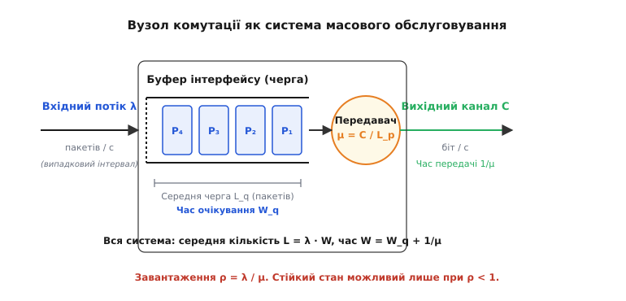
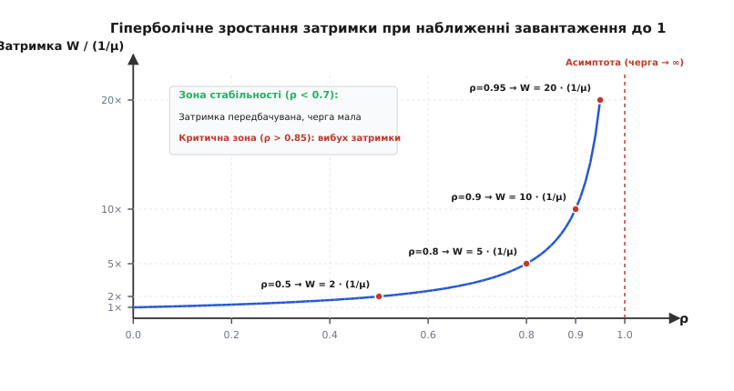
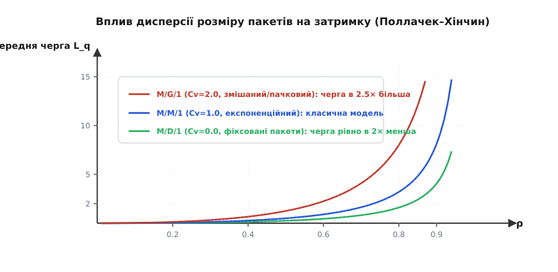
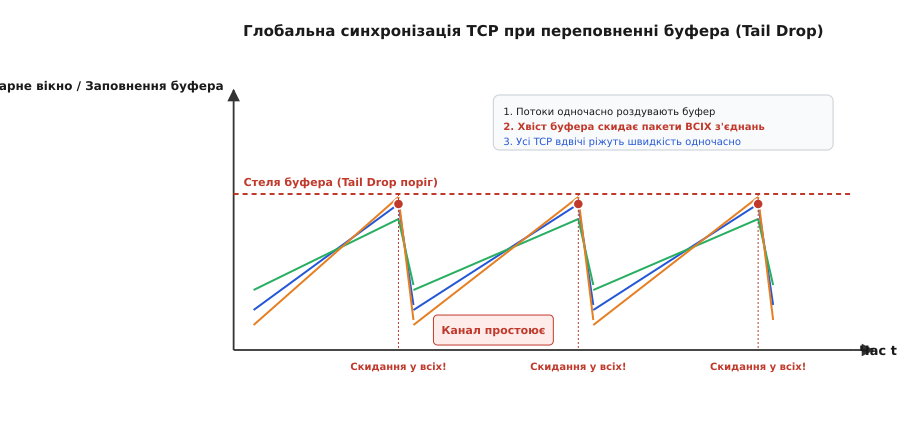
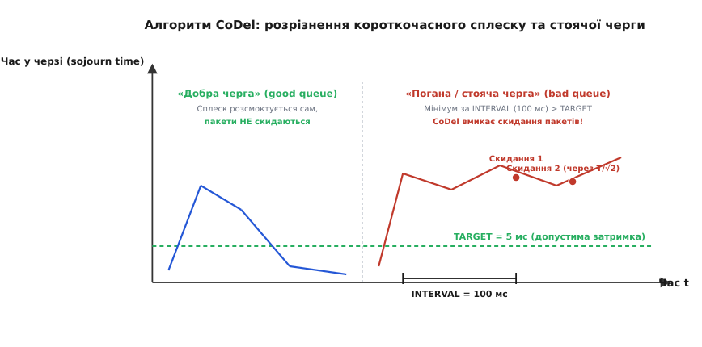
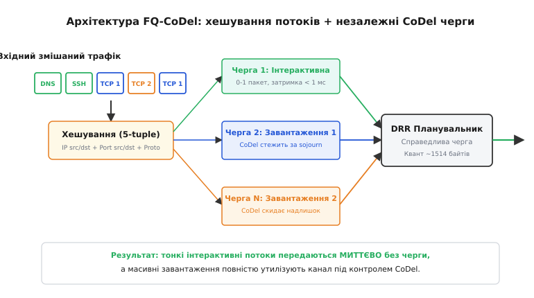

# Черги в мережах: затримка і втрати

<preknowlist>
- [Затримка й надійність](book:communications/latency-reliability) — складові мережевої затримки, компроміс між часом очікування та повторними передачами.
- [Смуга і межа Шеннона](book:communications/bandwidth-capacity) — зв'язок між бітовою швидкістю каналу, тривалістю передачі та пропускною здатністю.
</preknowlist>

Коли на вхідний комутатор надходять одночасно два пакети по 1500 байтів, призначені для передачі в один вихідний канал зі швидкістю 100 Мбіт/с, фізичний передавач здатен випромінювати біти лише послідовно: один пакет займає лінію протягом 120 мікросекунд, а другий пакет змушений очікувати в оперативній пам'яті інтерфейсу. Якщо в цей же проміжок часу надійдуть пакети ще від трьох сусідніх портів, буфер почне наповнюватися швидше, ніж лінія встигає звільнятися. Без математичного розуміння законів формування черг мережевий пристрій або втрачає критичні дані через переповнення пам'яті, або затримує доставку пакетів на сотні мілісекунд, руйнуючи інтерактивний голосовий зв'язок та керування в реальному часі.

### Статистичне мультиплексування і неминучість черг

У класичних телефонних мережах із комутацією каналів (TDM, *Time-Division Multiplexing*) кожному з'єднанню виділяється суворо фіксована смуга частот або регулярний часовий інтервал. За такої архітектури черги принципово відсутні: якщо ресурс зайнятий, новий абонент отримує сигнал «зайнято», а якщо виділений канал мовчить, його пропускна здатність просто марнується.

Комп'ютерні мережі побудовані на діаметрально протилежному принципі — **статистичному мультиплексуванні** (від латинського *multus* — численний та *plex* — сплетіння). Користувачі не резервують виділені смуги, а надсилають дані дискретними порціями — **пакетами**. Оскільки трафік більшості додатків має виражений імпульсний характер (пачковий трафік, англ. *burstiness*): веб-сторінка завантажується сплеском за 50 мс, після чого канал простоює кілька секунд, доки людина читає текст.

Статистичне мультиплексування дозволяє об'єднати сотні таких нерівномірних джерел у єдиний фізичний канал, розрахований не на суму пікових швидкостей, а лише на їхнє середнє значення. Проте за це доводиться платити виникненням конкуренції: коли два незалежні комп'ютери випадково надсилають сплески трафіку в ту саму мілісекунду, на вихідному порту маршрутизатора утворюється черга.

Для збереження пакетів під час таких сплесків маршрутизатори використовують пам'ять інтерфейсів за принципом збереження та подальшої передачі (**store-and-forward**). Буфер є акумулятором часу: він приймає надлишок бітів, коли миттєва швидкість надходження перевищує пропускну здатність лінії, і поступово спорожнюється, коли надходження припиняється.

У сучасній архітектурі мережевих пристроїв пакет проходить багаторівневий конвеєр черг:
1. **Вхідні черги мережевої карти (RX Ring Buffer)**: апаратні кільцеві дескриптори, куди мережевий адаптер записує кадри через прямий доступ до пам'яті (DMA).
2. **Черги операційної системи (qdisc / IP stack)**: підсистема планування ядра (наприклад, у Linux підсистема Traffic Control), де реалізуються алгоритми шейпінгу, пріоритезації та активного керування чергами.
3. **Вихідні черги передавача (TX Ring Buffer)**: кільцевий апаратний буфер мережевого контролера, звідки пакети безпосередньо вичитуються MAC/PHY рівнями для модуляції та випромінювання у фізичний кабель чи радіоефір.


*Складові вузла комутації: вхідний потік з інтенсивністю λ надходить до буфера ємністю K пакетів, де формується черга очікування L_q. Передавач із продуктивністю μ видає пакети у вихідний канал зі швидкістю C біт/с. Повний час перебування пакета у вузлі W складається з часу очікування в черзі W_q та часу серіалізації 1/μ.*

### Базові параметри та закон Літтла

Для математичного аналізу мережевих вузлів використовують апарат теорії масового обслуговування (ТМО, англ. *Queueing Theory*), започаткованої данським математиком Агнером Ерлангом (Agner Erlang) на початку XX століття. У стандартній нотації Кендалла (Девід Кендалл, 1953) система позначається кортежем `A/S/c/K/N/D`, де:
- `A` — розподіл інтервалів часу між надходженнями пакетів;
- `S` — розподіл часу обслуговування (передачі пакета);
- `c` — кількість паралельних обслуговуючих пристроїв (передавачів на порту, зазвичай `c = 1`);
- `K` — місткість буфера разом із передавачем (якщо не вказано, `K = ∞`);
- `N` — обсяг генеральної сукупності джерел (за замовчуванням `∞`);
- `D` — дисципліна обслуговування черги (за замовчуванням FIFO — *First In, First Out*).

Основними величинами системи є:
1. **Інтенсивність вхідного потоку `λ`** (пакетів/с) — середня кількість пакетів, що прибувають до інтерфейсу за одиницю часу. Середній інтервал між пакетами дорівнює `1 / λ`.
2. **Середня довжина пакета `L_p`** (байтів).
3. **Швидкість вихідної лінії `C`** (біт/с).
4. **Інтенсивність обслуговування `μ`** (пакетів/с) — максимальна кількість пакетів, яку передавач здатен видати в лінію за секунду:

```
μ = C / (8 · L_p)
```

Час безпосередньої передачі одного пакета в кабель (час серіалізації) становить:

```
1 / μ = (8 · L_p) / C
```

Ключовим безрозмірним параметром будь-якої черги є **коефіцієнт завантаження каналу `ρ`** (грецька літера «ро», англ. *traffic intensity* або *utilization*):

```
ρ = λ / μ = (λ · 8 · L_p) / C
```

Коефіцієнт `ρ` показує середню частку часу, протягом якого передавач зайнятий відправленням бітів. Для стабільної роботи системи з нескінченним буфером обов'язково має виконуватися фундаментальна нерівність:

```
ρ < 1  (тобто λ < μ)
```

Якщо `ρ ≥ 1`, швидкість надходження даних перевищує або дорівнює граничній швидкості каналу. За такого режиму буфер будь-якого розміру неминуче переповниться, а час очікування нових пакетів зростатиме до нескінченності.

Зв'язок між кількістю пакетів у системі та часом їхньої затримки встановлює **закон Літтла** (доведений Джоном Літтлом у 1961 році). Цей закон є строгим і універсальним: він виконується для будь-якого розподілу надходжень, будь-якого розподілу розмірів пакетів і будь-якої дисципліни обслуговування.

```
L = λ · W
L_q = λ · W_q
```

де:
- `L` — середня кількість пакетів у всьому вузлі (в черзі та на передавачі);
- `L_q` — середня кількість пакетів, які лише очікують у черзі буфера;
- `W` — повний середній час перебування пакета у вузлі (*sojourn time*);
- `W_q` — середній час очікування пакета в черзі до початку його передачі.

Повний час перебування пакета складається з часу очікування в буфері та часу його фізичної передачі:

```
W = W_q + 1 / μ
```

Помноживши цей вираз на `λ` і застосувавши закон Літтла, отримуємо зв'язок між розмірами черг:

```
L = λ · (W_q + 1 / μ)
L = L_q + λ / μ
L = L_q + ρ
```

Цей результат інтуїтивно зрозумілий: середня кількість пакетів у системі дорівнює кількості пакетів у черзі `L_q` плюс середній стан зайнятості самого передавача `ρ`.

### Класична модель M/M/1: асимптотична стіна затримки

Найпростішою аналітичною моделлю черги є система **M/M/1** (за нотацією Кендалла: марковський вхідний потік, марковський час обслуговування, один передавач). Вона спирається на три припущення:
1. Вхідний потік пакетів є Пуассонівським (інтервали між пакетами розподілені за експоненційним законом `P(t) = λ · e^(-λ·t)`).
2. Довжина пакетів розподілена за експоненційним законом із середнім значенням `L_p`, що дає експоненційний розподіл часу передачі із середнім `1 / μ`.
3. Буфер має необмежену місткість (`K = ∞`).

У моделі M/M/1 стан системи визначається цілим числом `k` — кількістю пакетів, що перебувають у вузлі. Переходи між станами описуються одновимірним марковським процесом народження і загибелі (birth-death process). Рівняння глобального балансу ймовірностей для кожного стану `k` мають вигляд:

```
λ · p_0 = μ · p_1                     [для стану k = 0]
(λ + μ) · p_k = λ · p_(k-1) + μ · p_(k+1)   [для станів k ≥ 1]
```

Розв'язуючи систему методом підстановки з урахуванням умови нормування `∑ p_k = 1`, отримуємо геометричний розподіл ймовірностей:

```
p_k = (1 - ρ) · ρ^k
```

Звідси ймовірність того, що передавач вільний і черги немає (`k = 0`):

```
p_0 = 1 - ρ
```

Середня кількість пакетів у системі `L` обчислюється як математичне сподівання:

```
L = ∑ [ k · p_k ]                      [за означенням середнього для k від 0 до ∞]
  = ∑ [ k · (1 - ρ) · ρ^k ]            [підстановка p_k]
  = (1 - ρ) · ρ · ∑ [ k · ρ^(k-1) ]    [винесення спільного множника]
  = (1 - ρ) · ρ · [ 1 / (1 - ρ)² ]     [сума похідної геометричної прогресії]
  = ρ / (1 - ρ)
```

Застосовуючи закон Літтла `W = L / λ`, знаходимо середній повний час перебування пакета у вузлі:

```
W = L / λ = (ρ / (1 - ρ)) / λ = (λ / μ) / (λ · (1 - ρ)) = 1 / (μ · (1 - ρ)) = 1 / (μ - λ)
```

Середній час очікування безпосередньо в черзі `W_q`:

```
W_q = W - 1 / μ = 1 / (μ · (1 - ρ)) - 1 / μ = ρ / (μ · (1 - ρ))
```

А середня довжина самої черги `L_q`:

```
L_q = λ · W_q = ρ² / (1 - ρ)
```

Головний наслідок формули `W = 1 / (μ · (1 - ρ))` полягає в **гіперболічному зростанні затримки** при наближенні завантаження каналу `ρ` до одиниці. Залежність має виражену нелінійність:

```
ρ = 0.20  ⇒  W = 1.25 · (1/μ)   (черга майже відсутня, W_q = 0.25 · (1/μ))
ρ = 0.50  ⇒  W = 2.00 · (1/μ)   (затримка подвоюється, L = 1 пакет)
ρ = 0.80  ⇒  W = 5.00 · (1/μ)   (затримка зростає у 5 разів, L = 4 пакети)
ρ = 0.90  ⇒  W = 10.0 · (1/μ)   (затримка зростає у 10 разів, L = 9 пакетів)
ρ = 0.95  ⇒  W = 20.0 · (1/μ)   (затримка зростає у 20 разів, L = 19 пакетів)
ρ = 0.99  ⇒  W = 100.0 · (1/μ)  (затримка зростає у 100 разів, L = 99 пакетів)
```


*Залежність середньої затримки пакета від коефіцієнта завантаження лінії ρ. До рівня ρ ≈ 0.7 затримка зростає повільно й лінійно. Після точки перегину ρ > 0.85 настає режим експоненційного вибуху черги, де будь-яке незначне коливання вхідного трафіку викликає стрибок часу очікування у десятки разів.*

Ця гіперболічна залежність пояснює залізне правило проєктування телекомунікаційних мереж: **магістральні канали ніколи не навантажують понад 70–80% у середньому**. Інтервал між `ρ = 0.8` та `ρ = 1.0` називають зоною нестабільності («асимптотичною стіною»), де випадковий мікросплеск трафіку миттєво паралізує вузол.

### Дисперсія розміру пакетів і формула Поллачека–Хінчина

Припущення моделі `M/M/1` про експоненційний розподіл розміру пакетів рідко виконується на практиці. У реальному інтернеті розподіл довжини пакетів є **бімодальним**: понад 40% усіх пакетів — це крихітні службові сегменти (TCP ACK, DNS-запити, ICMP, синапси SYN/FIN) розміром 40–64 байти, а близько 50% — це повні кадри корисного навантаження розміром MTU 1500 байтів.

Для довільного розподілу тривалості передачі пакетів використовують загальну модель **M/G/1**. Середній час очікування в черзі для системи `M/G/1` описується **формулою Поллачека–Хінчина** (виведена незалежно Феліксом Поллачеком у 1930 та Олександром Хінчиним у 1932 році):

```
W_q = (ρ / (1 - ρ)) · [ (1 + C_v²) / 2 ] · (1 / μ)
```

де `C_v` — коефіцієнт варіації тривалості обслуговування (відношення стандартного відхилення `σ` до середнього часу передачі `1 / μ`):

```
C_v = σ / (1 / μ) = σ · μ
```

Повне математичне виведення цієї формули через аналіз залишкового часу передачі (*residual service time*) та аналіз розподілів наведено у вставці [Виведення формули Поллачека–Хінчина](book:communications/queue-theory-networks/math-pollaczek-khinchine.md).

Множник `(1 + C_v²) / 2` визначає фундаментальний вплив варіації розміру пакетів на мережеву затримку:

1. **Детермінований розмір пакетів (модель M/D/1, `C_v = 0`)**:
   Якщо всі пакети мають суворо однакову довжину (наприклад, комірки ATM по 53 байти або фіксовані голосові кадри):
   ```
   (1 + 0) / 2 = 1 / 2
   W_q(M/D/1) = (1 / 2) · W_q(M/M/1)
   ```
   Середня довжина черги й затримка очікування в системі `M/D/1` рівно **вдвічі менші**, ніж у системі `M/M/1` за того ж коефіцієнта завантаження `ρ`.

2. **Експоненційний розмір пакетів (модель M/M/1, `C_v = 1`)**:
   Для експоненційного розподілу стандартне відхилення дорівнює математичному сподіванню (`σ = 1/μ`), тому `(1 + 1) / 2 = 1`, що повертає класичну формулу Клейнрока.

3. **Пачковий та змішаний трафік (`C_v > 1`)**:
   Коли лінією одночасно передаються гігантські пакети та дрібні квитанції, стандартне відхилення перевищує середнє (`C_v ≈ 1.5 - 2.5`). За таких умов черга зростає у 2–4 рази сильніше, ніж передбачає модель `M/M/1`.


*Порівняння середньої довжини черги L_q для різних розподілів довжини пакета. Фіксований розмір (M/D/1, зелена крива) скорочує чергу вдвічі порівняно з випадковим (M/M/1, синя крива). Суміш дрібних ACK та великих MTU-пакетів (M/G/1, червона крива) різко погіршує затримку через високу дисперсію.*

### Скінченний буфер і ймовірність втрат: модель M/M/1/K

У реальному мережевому обладнанні обсяг оперативної пам'яті завжди обмежений. Система зі скінченною місткістю буфера позначається як **M/M/1/K**, де `K` — максимальна кількість пакетів, які одночасно можуть перебувати у вузлі (1 на передавачі + `K - 1` у черзі).

Якщо новий пакет надходить у момент, коли в системі вже перебуває `K` пакетів, буфер переповнений, і пакет **відкидається** (скидається).

Розподіл імовірностей кількості пакетів для системи M/M/1/K має вигляд:

```
p_k = [ (1 - ρ) · ρ^k ] / [ 1 - ρ^(K+1) ]    (для ρ ≠ 1, k = 0, 1, ..., K)
p_k = 1 / (K + 1)                            (для ρ = 1)
```

Оскільки новий пакет відкидається лише тоді, коли система повністю заповнена (`k = K`), **імовірність втрати пакета `P_loss`** (імовірність блокування) дорівнює граничній імовірності `p_K`:

```
P_loss = p_K = [ (1 - ρ) · ρ^K ] / [ 1 - ρ^(K+1) ]
```

Фактична інтенсивність потоку, який успішно приймається вузлом і передається в канал, становить:

```
λ_eff = λ · (1 - P_loss)
```

Розглянемо числовий приклад поведінки буфера `K = 10` та `K = 50` за перевантаження `ρ = 0.95`:
- Для `K = 10`: `P_loss = (0.05 · 0.95¹⁰) / (1 - 0.95¹¹) = (0.05 · 0.5987) / (1 - 0.5688) ≈ 6.94%`.
- Для `K = 50`: `P_loss = (0.05 · 0.95⁵⁰) / (1 - 0.95⁵¹) = (0.05 · 0.0769) / (1 - 0.0731) ≈ 0.41%`.

Модель M/M/1/K демонструє головний інженерний компроміс вибору розміру буфера:
- **Малий буфер `K`**: час перебування пакета в черзі суворо обмежений зверху величиною `K / μ`, затримка мінімальна, але за найменшого сплеску різко зростає відсоток втрачених пакетів `P_loss`.
- **Великий буфер `K`**: імовірність втрат `P_loss` падає майже до нуля, проте за високого навантаження `ρ → 1` час очікування в буфері роздувається до сотень мілісекунд.

### Пасивне скидання Tail Drop та його вади

Найпростішим і історично найпоширенішим алгоритмом обслуговування черги в маршрутизаторах є **Tail Drop** («скидання з хвоста»). Його логіка пасивна: пакети записуються в буфер у порядку надходження; коли кількість пакетів досягає ліміту `K`, усі наступні прибулі пакети відкидаються, доки в буфері не звільниться місце.

Незважаючи на простоту апаратної реалізації, Tail Drop створює три руйнівні системні ефекти в масштабах усієї мережі:

#### 1. Глобальна синхронізація TCP (TCP Global Synchronization)

Коли буфер маршрутизатора переповнюється, Tail Drop скидає не один випадковий пакет, а цілу пачку поспіль прибулих пакетів, що належать десяткам різних незалежних TCP-з'єднань. Усі ці TCP-джерела одночасно фіксують втрату і за алгоритмом Reno/Cubic одночасно зменшують своє вікно перевантаження `cwnd` вдвічі.

У результаті сумарний потік трафіку різко падає, і вихідний канал маршрутизатора на деякий час спустошується, втрачаючи пропускну здатність. Потім усі джерела починають синхронно лінійно нарощувати свої вікна `cwnd`, знову одночасно наповнюють буфер до переповнення, знову отримують скидання пачки пакетів і знову синхронно падають.


*Глобальна синхронізація TCP: періодичні хвилі одночасного переповнення буфера різними потоками викликають масове скидання пакетів, після чого всі з'єднання синхронно знижують швидкість, залишаючи канал напівпорожнім.*

Замість плавної 100% утилізації лінії мережа входить у режим автоколивань (пилкоподібний профіль швидкості), де середня пропускна здатність каналу падає на 30–50%.

#### 2. Монополізація черги (Lock-out)

Один агресивний потік, що генерує пакети з високою частотою без реакції на перевантаження (наприклад, неконтрольований UDP-відеопотік або шкідливий трафік), здатний повністю зайняти всі вільні комірки в буфері Tail Drop, не залишаючи місця для пакетів інших з'єднань.

#### 3. Явище Bufferbloat

Коли виробники маршрутизаторів збільшили розмір буферів із десятків кілобайтів до кількох мегабайтів, Tail Drop перестав скидати пакети під час сплесків. Замість цього TCP-з'єднання роздували чергу до повного обсягу пам'яті, утворюючи гігантську **стоячу чергу** (*standing queue*).

Пакети інтерактивних додатків (SSH, DNS, онлайн-ігри, аудіозв'язок) опинялися в кінці багатомегабайтної черги за масивними завантаженнями файлів, накопичуючи затримку в 1–3 секунди. Детально історію виявлення цієї кризи та її подолання описано у вставці [Відкриття Bufferbloat](book:communications/queue-theory-networks/hist-bufferbloat.md).

### Дисципліни планування трафіку: від FIFO до Fair Queuing

Для запобігання монополізації черги одним потоком у мережевих пристроях розроблено алгоритми планування (англ. *Scheduling Disciplines*):

1. **Priority Queuing (PQ)**: поділ трафіку на фіксовані рівні пріоритетів (High, Medium, Low). Пакети з низьким пріоритетом ніколи не передаються, доки є хоч один пакет у черзі з вищим пріоритетом. Це створює небезпеку голодування (*starvation*) для звичайного трафіку.
2. **Weighted Fair Queuing (WFQ)**: математична емуляція біт-за-бітової справедливої передачі (GPS, *Generalized Processor Sharing*). Кожному з'єднанню виділяється вага, яка гарантує частку смуги пропускання.
3. **Deficit Round Robin (DRR)**: практичний і обчислювально дешевий алгоритм `O(1)`, що чергує обслуговування черг квантами байтів (наприклад, по 1500 байтів за коло), зберігаючи залишок невикористаного дефіциту для кожного потоку на наступний раунд.

Проте саме по собі справедливе планування (DRR / WFQ) не розв'язує проблему затримки всередині кожного окремого потоку: якщо один потік завантажує файл, його індивідуальна черга все одно роздувається до максимуму. Для контролю затримки всередині черг необхідні алгоритми активного керування чергами.

### Багатоядерна обробка черг та апаратні обмеження (BQL, RSS, XPS)

У високошвидкісних маршрутизаторах (10G, 40G, 100GbE) пакети обробляються паралельно на багатьох ядрах центрального процесора. Для запобігання між'ядерним блокуванням застосовуються такі механізми:

1. **RSS (Receive Side Scaling)**: мережевий адаптер обчислює апаратний Toeplitz-хеш від заголовків пакета (IP та порти) і спрямовує пакет до одного з кількох апаратних кілець прийому RX, прив'язаних до конкретного ядра CPU.
2. **XPS (Transmit Packet Steering)**: прив'язка потоків відправлення до конкретних передавальних черг TX на мережевій карті, що виключає конкуренцію за спинлоки черги між процесорними ядрами.
3. **BQL (Byte Queue Limits)**: динамічний алгоритм у драйверах ядра Linux, який автоматично обмежує кількість байтів, що передаються в апаратне кільце TX Ring мережевої карти. BQL гарантує, що апаратний буфер карти містить рівно стільки байтів, скільки необхідно для запобігання простою передавача (типово 1-2 пакети), передаючи весь контроль над чергою програмним алгоритмам AQM.

### Алгоритми активного керування чергами (AQM)

Для вирішення проблем Tail Drop було розроблено концепцію **активного керування чергами** (AQM — *Active Queue Management*). Її головний принцип: маршрутизатор не чекає фатального переповнення пам'яті, а починає завчасно надсилати сигналами скидання (або ECN-позначками) попередження джерелам трафіку про початок зростання черги.

#### RED (Random Early Detection)

Запропонований у 1993 році Саллі Флойд та Ваном Джейкобсоном. RED періодично вимірює експоненційно зважений середній розмір черги `avg`:

```
avg = (1 - w_q) · avg + w_q · q_current
```

- Якщо `avg < min_th`: усі пакети приймаються без скидань.
- Якщо `min_th ≤ avg < max_th`: кожен новий пакет скидається з імовірністю `p`, яка лінійно зростає від 0 до `max_p`.
- Якщо `avg ≥ max_th`: усі пакети скидаються примусово (як у Tail Drop).

Стохастичне скидання поодиноких пакетів розбиває глобальну синхронізацію: втрату відчуває лише одне випадкове TCP-з'єднання (імовірність пропорційна його частці в смузі), воно одне зменшує вікно, а решта потоків продовжують роботу без зупинки. Проте RED виявився надзвичайно чутливим до ручного налаштування параметрів `min_th`, `max_th`, `w_q` під конкретну швидкість лінії та RTT.

#### CoDel (Controlled Delay)

Створений у 2012 році Ваном Джейкобсоном і Кетлін Ніколс. Алгоритм відмовився від вимірювання розміру черги в байтах чи пакетах на користь фундаментальної метрики: **часу перебування пакета в буфері** (*sojourn time*).

CoDel розділяє чергу на два принципові типи:
1. **«Добра черга» (*good queue*)**: короткочасний сплеск пакетів, за якого час перебування перевищує цільовий поріг `TARGET = 5` мс, проте розсмоктується швидше, ніж за контрольний інтервал `INTERVAL = 100` мс. CoDel не чіпає таку чергу, дозволяючи сплеску пройти без втрат.
2. **«Погана / стояча черга» (*bad queue*)**: черга, мінімальний час перебування в якій не опускається нижче `TARGET` протягом усього інтервалу `INTERVAL`.


*Принцип розпізнавання стану в CoDel: тимчасовий сплеск затримки розсмоктується сам без втрати пакетів. Якщо мінімальний час перебування перевищує поріг TARGET довше ніж INTERVAL, вмикається активне скидання за законом зворотного кореня.*

Коли CoDel виявляє стоячу чергу, він переходить у стан активного скидання (`dropping`), викидаючи перший пакет і плануючи наступні скидання за законом зворотного квадратного кореня:

```
t_next = t_now + INTERVAL / √count
```

де `count` — лічильник скинутих пакетів. Завдяки цьому частота скидань наростає нелінійно, швидко змушуючи агресивне TCP-джерело зменшити швидкість до рівня пропускної здатності каналу.

#### FQ-CoDel (Fair Queuing with CoDel)

Стандартизований в RFC 8290, FQ-CoDel об'єднує розділення трафіку на окремі потоки з алгоритмом CoDel.


*Архітектура FQ-CoDel: вхідний потік класифікується за 5-tuple хешем у 1024 підчерги. Планувальник DRR чергує видачу квантами, а CoDel контролює час перебування всередині кожної активної підчерги окремо.*

Механізм роботи FQ-CoDel:
1. Вхідний пакет хешується за полями 5-tuple (IP-адреси джерела і призначення, порти TCP/UDP, номер протоколу) і спрямовується в одну з 1024 внутрішніх підчерг.
2. Планувальник Deficit Round Robin (DRR) опитує підчерги по колу, надаючи кожній фіксований квант передачі (зазвичай 1514 байтів).
3. «Тонкі» інтерактивні потоки (голос VoIP, ігрові пакети, DNS, SSH, TCP ACK) надсилають рідкісні пакети, тому їхні черги майже завжди містять 0–1 пакет. DRR негайно віддає їм пріоритет із затримкою `< 1` мс.
4. «Товсті» потоки завантаження файлів формують власні окремі черги, які регулюються алгоритмом CoDel незалежно від інших користувачів.

Програмну реалізацію та результати порівняльного тестування моделей Tail Drop і CoDel розібрано в проєктній вставці [Симуляція CoDel](book:communications/queue-theory-networks/proj-codel-simulation.md).

#### CAKE (Common Applications Kept Enhanced)

Сучасним розвитком FQ-CoDel став планувальник CAKE, інтегрований у ядро Linux. CAKE поєднує в собі:
- Справжній шейпер трафіку на базі маркерного кошика (Token Bucket);
- 8-позиційне множинне хешування (set-associative flow hashing) для мінімізації колізій між потоками;
- Автоматичну фільтрацію надлишкових пакетів TCP ACK у зворотному напрямку (*ACK filter*);
- Компенсацію накладних витрат фізичного каналу (framing overhead) для ліній DSL (ATM cell tax, PTM) та DOCSIS;
- Автоматичну диференціацію сервісу (DiffServ / ToS) з чотирма пріоритетними осередками (Voice, Video, Best Effort, Bulk).

#### Взаємодія з ECN (Explicit Congestion Notification)

Замість фізичного скидання пакета сучасні алгоритми AQM можуть використовувати протокол ECN (RFC 3168). В IP-заголовку виділено два біти:
- `00` — ECN не підтримується кінцевими вузлами (Non-ECT);
- `01` або `10` — джерело підтримує ECN (ECT(1) / ECT(0));
- `11` — зафіксовано перевантаження (CE — *Congestion Experienced*).

Коли черга CoDel або RED переходить у стан скидання, маршрутизатор перевіряє заголовок: якщо пакет позначено як ECT, маршрутизатор не відкидає його, а лише виставляє біти `CE = 11`. Отримувач копіює цей сигнал у заголовок TCP ACK (прапорець `ECE — ECN-Echo`), а відправник зменшує вікно `cwnd` і підтверджує реакцію прапорцем `CWR` (*Congestion Window Reduced*). Це забезпечує нульові втрати пакетів при нульовій затримці черги.

### Діагностика та вимірювання затримки черг

Для виявлення прихованого Bufferbloat у мережі використовують тест RRUL (*Realtime Response Under Load*), реалізований в утиліті `flent`. Методологія тесту полягає в одночасному запуску кількох двонаправлених потоків TCP завантаження та вимірюванні кругової затримки ICMP/UDP ping з високою частотою (кожні 10–50 мс).

Якщо затримка ping під час повного навантаження каналу зростає менше ніж на 5–10 мс, черги у вузлі працюють ідеально під контролем AQM. Якщо ж затримка підскакує на сотні мілісекунд, мережевий вузол страждає на класичний Bufferbloat через некерований Tail Drop.

> 🔧 **Навіщо це.** У реальній експлуатації мереж затримка черг та втрати безпосередньо контролюються через підсистему планування трафіку ядра Linux (**Traffic Control / qdisc**). За замовчуванням багато застарілих систем використовують чергу `pfifo_fast` (простий трирівневий Tail Drop).
>
> Щоб повністю усунути Bufferbloat на гігабітному маршрутизаторі або сервері, стандартну дисципліну черги замінюють на `fq_codel` або `cake` однією командою:
>
> ```bash
> # Увімкнення FQ-CoDel на вихідному інтерфейсі eth0
> sudo tc qdisc replace dev eth0 root fq_codel target 5ms interval 100ms
>
> # Перевірка поточної статистики черги та скинутих пакетів
> tc -s qdisc show dev eth0
> ```
>
> У виводі команди звертають увагу на такі ключові лічильники:
> - `drops` — кількість скинутих пакетів через тривале перевантаження;
> - `ecn_mark` — кількість пакетів, маркованих прапорцем CE без фізичного скидання;
> - `maxq` — максимальна довжина черги в пакетах, досягнута за весь час;
> - `new_flows_len` — кількість активних інтерактивних («тонких») підчерг;
> - `memory_used` — фактичний обсяг оперативної пам'яті, зайнятий буфером.
>
> При розрахунку апаратних буферів для магістральних комутаторів ядра використовують модифіковане правило Стенфордського університету: замість класичного правила BDP `B = C · RTT` для лінії з `N` незалежними TCP-потоками достатньо буфера обсягом:
>
> ```
> B = (C · RTT) / √N
> ```
>
> Для магістралі 100 Гбіт/с із RTT = 100 мс та `N = 10 000` з'єднань це дозволяє зменшити вимоги до надшвидкої пам'яті SRAM комутатора з 1.25 ГБ до 12.5 МБ без жодної втрати пропускної здатності.
