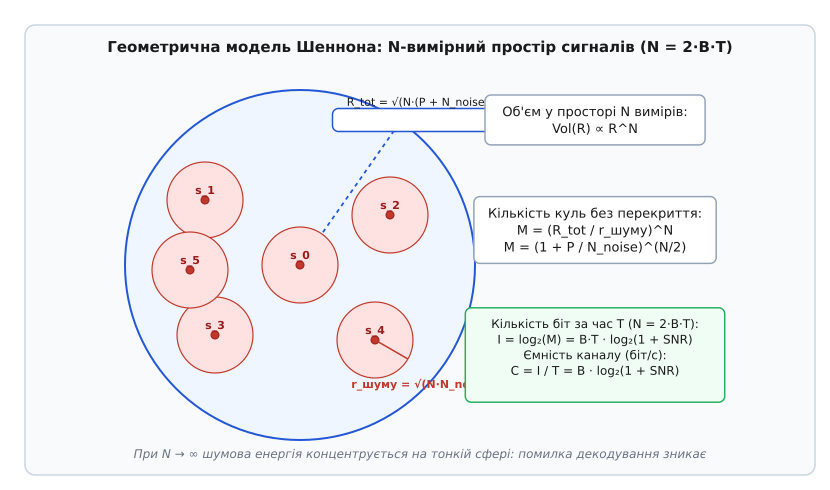
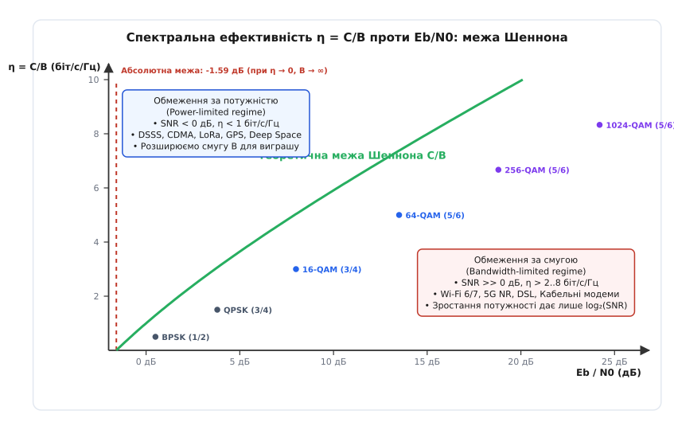
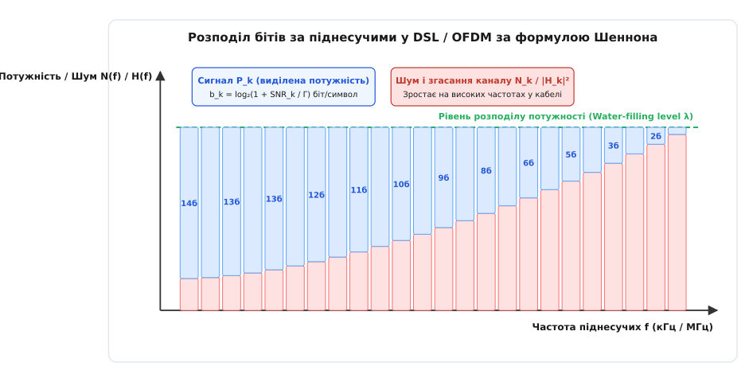
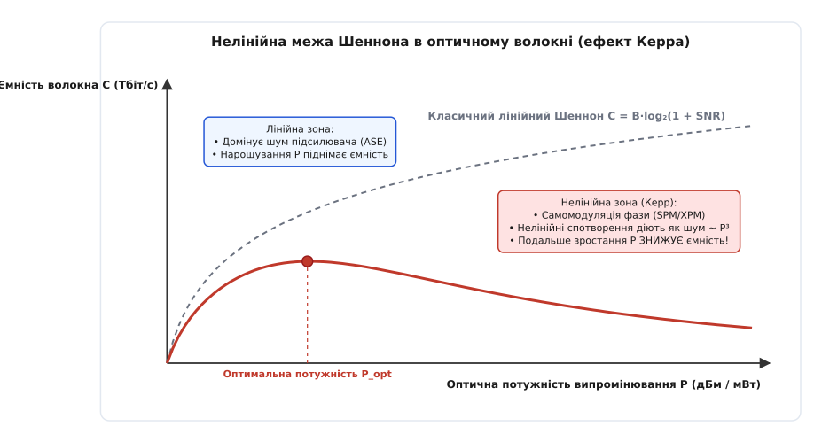

# Ємність каналу за Шенноном

<preknowlist>
- [Тепловий шум](book:electronics/resistor-noise) — тепловий рух електронів, що утворює непереборний шумовий поріг у будь-якому провіднику.
- [Смуга і межа Шеннона](book:communications/bandwidth-capacity) — фундаментальне поняття пропускної здатності та залежність від ширини частотного спектра.
- [Децибели потужності](book:communications/power-decibels) — логарифмічна шкала для вимірювання рівнів сигналу, затухання та відношення сигнал/шум.
- [Квадратурна амплітудна модуляція QAM](book:communications/qam) — спосіб пакування багатьох бітів в один символ за допомогою амплітуди й фази.
- [Ортогональне частотне мультиплексування OFDM](book:communications/ofdm) — розбиття широкої смуги на множину вузьких ортогональних піднесучих.
- [Коди виправлення помилок FEC](book:communications/fec-codes) — внесення керованої надлишковості для відновлення спотворених шумом бітів.
</preknowlist>

Будь-яке фізичне середовище передачі даних — від мідної витої пари та радіоефіру до скловолокна магістральних мереж — ставить перед передавачем два нездоланні обмеження: скінченну смугу частот, яку середовище здатне пропустити без критичного згасання, та невпинне накладання непереборного теплового шуму. Якщо намагатися передавати дискретні імпульси швидше, ніж дозволяє ширина спектра, сусідні символи розпливаються в часі й накладаються один на одного; якщо ж намагатися розрізняти надто дрібні градації напруги для передачі більшої кількості бітів в одному імпульсі, хаотичні теплові коливання електронів спотворюють амплітуду й породжують помилки декодування. Теорема Шеннона — Гартлі встановлює точну математичну межу швидкості передачі інформації, вище за яку надійний зв'язок неможливий за жодних технічних хитрощів, але нижче за яку ймовірність помилки можна звести до абсолютного нуля завдяки завадостійкому кодуванню.

### Анатомія формули Шеннона–Гартлі: смуга та шум як два фізичні бар'єри

Фундаментальний закон пропускної здатності неперервного каналу зв'язку з адитивним білим гаусовим шумом (англ. *Additive White Gaussian Noise*, AWGN) описується рівнянням, виведеним американським математиком Клодом Шенноном (англ. *Claude Shannon*) у 1948 році:

```
C = B · log₂(1 + SNR)    [теорема Шеннона — Гартлі]
```

У цьому рівнянні кожен символ має прямий фізичний зміст, що випливає із законів електродинаміки, термодинаміки та теорії ймовірностей:

1. **`C` (англ. *channel capacity* — «місткість, ємність каналу»)** — теоретична верхня межа швидкості передачі інформації у бітах за секунду (біт/с), за якої існує математичний завадостійкий код, здатний забезпечити як завгодно малу ймовірність виникнення бітової помилки (`P_err → 0`).
2. **`B` (англ. *bandwidth* — «ширина смуги пропускання»)** — діапазон неперервного частотного спектра у герцах (Гц), який фізичний канал передає без критичного згасання. Згідно з [теоремою відліків Найквіста](book:communications/channel-band-packet), аналогова смуга шириною `B` герців надає рівно `2B` незалежних дійсних ступенів вільності (відліків сигналу) на кожну секунду часу передачі.
3. **`SNR` (англ. *signal-to-noise ratio*, SNR — «відношення сигналу до шуму»)** — безрозмірне відношення середньої потужності корисного сигналу `P` (або `S`, від англ. *signal*) до середньої потужності шуму `N` (англ. *noise*) у межах смуги `B`, виражене **у разах** (лінійній шкалі), а не в децибелах:

```
SNR = P / N = P / (N₀ · B)    [лінійне відношення сигнал/шум]
```

Потужність шуму `N` у каналі не є фіксованою величиною: вона прямо пропорційна ширині смуги `B`. Броунівський хаотичний рух вільних носіїв заряду (електронів) у провідниках приймача породжує фундаментальний [тепловий шум Джонсона — Найквіста](book:electronics/resistor-noise). Згідно з теоремою рівнорозподілу енергії за ступенями вільності, середня теплова енергія на один герц смуги частот залежить лише від універсальної сталої Больцмана `k_B = 1.380649 · 10⁻²³ Дж/К` та абсолютної температури `T` у кельвінах:

```
N₀ = k_B · T [Вт/Гц]
N = N₀ · B = k_B · T · B [Вт]    [теплова потужність білого шуму у смузі B]
```

При стандартній кімнатній температурі `T = 290 К` спектральна густина теплового шуму становить `N₀ ≈ 4.0039 · 10⁻²¹ Вт/Гц`, що в інженерній практиці виражають у [логарифмічних децибелах потужності](book:communications/power-decibels) як `-174.0 дБм/Гц` (де 0 дБм відповідає потужності в 1 міліват на навантаженні 50 Ом).

Це означає фундаментальну істину радіофізики: кожен додатковий герц смуги пропускання неминуче втягує в приймальний тракт додаткову порцію теплового шуму. Якщо розширювати смугу каналу `B`, не збільшуючи потужність передавача `P`, лінійне відношення `SNR = P / (N₀ · B)` пропорційно зменшується.

Два головні важелі формули — смуга `B` та відношення `SNR` — входять у вираз несиметрично. Смуга `B` виступає прямим лінійним множником перед логарифмом: подвоєння доступного частотного діапазону за незмінного `SNR` подвоює потенційну швидкість передачі даних. Натомість потужність сигналу захована всередині двійкового логарифма: щоб збільшити пропускну здатність каналу на фіксовану величину при сталій смузі, потужність передавача необхідно не додавати, а багаторазово множити.

### Спектральна ефективність та геометрія n-вимірного пакування

Щоб порівнювати між собою якість різних технологій зв'язку незалежно від виділеної їм ширини частотного спектра, використовують нормалізовану питому величину — **спектральну ефективність** (позначається грецькою літерою `η`, вимірюється в бітах за секунду на один герц смуги, біт/с/Гц):

```
η = C / B = log₂(1 + SNR)    [спектральна ефективність за Шенноном, біт/с/Гц]
```

Ця величина показує, скільки бітів корисної інформації система зв'язку здатна передати крізь один герц смуги за кожну секунду часу.


*Геометрична модель Шеннона. Сигнал тривалістю T у смузі B утворює вектор в N = 2BT-вимірному просторі. Завдяки закону великих чисел шум з імовірністю, близькою до одиниці, лежить у тонкій оболонці радіуса √(N·N_noise) навколо переданої точки. Сумарний прийнятий сигнал обмежений кулею радіуса √(N·(P + N_noise)). Максимальне число повідомлень M дорівнює відношенню об'ємів цих куль, що приводить до логарифмічної формули ємності.*

Щоб зрозуміти, чому у формулі виникає саме логарифм і чому передача без помилок можлива навіть за наявності сильного випадкового шуму, Клод Шеннон застосував геометрію високих вимірностей. Будь-який блок сигналу тривалістю `T` секунд у смузі `B` повністю описується послідовністю з `N = 2BT` незалежних відліків. Ці відліки можна розглядати як координати однієї точки у багатовимірному евклідовому просторі `ℝᴺ`.

Корисний сигнал середньої потужності `P` утворює вектор довжиною `√(N · P)`. Коли до сигналу додається незалежний гаусовий шум потужністю `N_noise`, вектор шуму за законом великих чисел при великих `N` має майже строго фіксовану довжину `√(N · N_noise)`. Прийнятий вектор (сигнал разом із завадою) опиняється всередині великої `N`-вимірної кулі радіуса `R_tot = √(N · (P + N_noise))`.

Навколо кожної кодової точки в просторі утворюється сферична «хмара шуму» радіуса `r_noise = √(N · N_noise)`. Якщо кодові слова на передавачі обрати так, щоб їхні шумові сфери не перетиналися між собою, приймач завжди зможе однозначно визначити, яку саме точку було надіслано, просто знайшовши найближчий центр сфери до прийнятого вектора.

Об'єм кулі в просторі `N` вимірів пропорційний її радіусу в степені `N`: `Vol(R) ∝ Rᴺ`. Кількість шумових куль `M`, які можна спакувати всередину великої кулі сигналу без взаємного перекриття, дорівнює відношенню їхніх об'ємів:

```
M = Vol(R_tot) / Vol(r_noise)
M = ( √(N · (P + N_noise)) / √(N · N_noise) )ᴺ
M = ( (P + N_noise) / N_noise )^(N / 2)
M = ( 1 + P / N_noise )^(B · T)    [кількість розрізнюваних кодових слів за час T]
```

Кількість інформаційних бітів, закодованих цими `M` станами, становить `I = log₂(M) = B · T · log₂(1 + SNR)`. Поділивши кількість бітів на час передачі `T`, отримуємо точний вираз ємності каналу `C = B · log₂(1 + SNR)`. Повне математичне розгортання цієї геометричної конструкції та строгий перехід до границі наведено у [математичному виведенні формули ємності](book:communications/shannon-capacity/math-shannon-limit.md).

### Частотно-селективні канали та інтервал когерентності

У реальних радіоканалах сигнал досягає антени приймача не одним прямим променем, а сотнями відбитих від будівель, дерев і ґрунту копій із різними затримками у часі (багатопроменеве поширення, англ. *multipath propagation*). Різниця між приходом першого та останнього відбитого променя визначає середньоквадратичне розширення затримки `τ_{rms}`.

Це розширення затримки породжує інтервал частотної когерентності каналу:

```
B_c ≈ 1 / (5 · τ_{rms})    [інтервал когерентності каналу]
```

Якщо ширина смуги сигналу `B` набагато менша за `B_c` (`B ≪ B_c`), усі частотні компоненти сигналу згасають синхронно — канал є **частотно-плоским** (англ. *flat fading*), і формула Шеннона застосовується безпосередньо.

Якщо ж смуга сигналу набагато ширша за інтервал когерентності (`B ≫ B_c`), різні частоти інтерферують по-різному: одні частоти підсилюються, а інші зазнають глибоких провалів згасання (до 30–40 дБ). Канал стає **частотно-селективним** (англ. *frequency-selective fading*). У цьому випадку сумарна ємність каналу виражається інтегралом Шеннона від частотно-залежного відношення сигнал/шум:

```
C = ∫₀ᴮ log₂( 1 + (P(f) · |H(f)|²) / N₀ ) df    [інтегральна ємність селективного каналу]
```

Саме тому сучасні широкосмугові технології (Wi-Fi, 4G LTE, 5G NR, DSL) використовують [OFDM](book:communications/ofdm): вони розбивають широку селективну смугу `B` на тисячі вузьких ортогональних піднесучих із шириною `Δf ≪ B_c`. На кожній окремій піднесучій канал стає ідеально плоским, повертаючи точну справедливість класичної формули Шеннона для кожної піднесучої.

### Два режими зв'язку: компроміс між потужністю та смугою частот

Залежно від фізичних обмежень лінії передачі всі системи електрозв'язку поділяються на два принципово різні інженерні режими: режим обмеження за смугою та режим обмеження за потужністю.


*Спектральна ефективність η = C/B проти нормалізованого відношення Eb/N0. Ліворуч — область обмеження за потужністю, де зв'язок можливий навіть при SNR < 0 дБ завдяки розширенню смуги (асимптота -1.59 дБ). Праворуч — область обмеження за смугою, де висока швидкість купується високими порядками QAM та експоненційним нарощуванням потужності.*

#### 1. Режим обмеження за смугою (Bandwidth-Limited Regime)

Цей режим виникає тоді, коли частотний ресурс суворо обмежений регулятором або фізикою кабелю (наприклад, смуга 20–160 МГц у Wi-Fi, смуга каналу DSL, коаксіальні кабелі DOCSIS або ліцензований діапазон стільникового зв'язку), проте відношення сигнал/шум є високим (`SNR ≫ 1`, або `SNR > 15–30 дБ`).

У таких умовах одиниця під логарифмом стає нехтовно малою, і спектральна ефективність наближається до простого логарифмічного закону:

```
η ≈ log₂(SNR) = log₂(P / N)    [спектральна ефективність при сильному сигналі]
```

Звідси випливає фундаментальний закон спадної віддачі від потужності передавача:
- Збільшення потужності сигналу вдвічі (`+3 дБ`) додає до спектральної ефективності лише `log₂(2) = 1 біт/с/Гц`.
- Збільшення потужності вдесятеро (`+10 дБ`) додає лише `log₂(10) ≈ 3.32 біт/с/Гц`.
- Збільшення потужності у 100 разів (`+20 дБ`) додає `log₂(100) ≈ 6.64 біт/с/Гц`.

У цьому режимі для зростання швидкості застосовують багатопозиційні квадратурні модуляції ([QAM-64, QAM-256, QAM-1024 та QAM-4096](book:communications/qam)), які пакують від 6 до 12 бітів в один модуляційний символ. Проте плата за кожен наступний біт стає експоненційно високою: перехід від 256-QAM (8 біт/символ) до 1024-QAM (10 біт/символ) вимагає підвищення відношення `SNR` щонайменше на 6 дБ (у 4 рази за потужністю), що на межі дальності робить сигнал вкрай вразливим до найменших перешкод.

Наприклад, у кабельних мережах стандарту DOCSIS 3.1 та DOCSIS 4.0 коаксіальний кабель має смугу до 1.2–1.8 ГГц з відмінним екрануванням і високим рівнем сигналу (`SNR > 42 дБ`). Завдяки цьому модеми використовують модуляцію 4096-QAM (12 біт/символ) на тисячах ортогональних піднесучих OFDM, досягаючи пропускної здатності до 10 Гбіт/с на одній кабельній магістралі.

#### 2. Режим обмеження за потужністю (Power-Limited Regime)

Цей режим виникає в ситуаціях, де передавач має жорстко обмежену енергію (автономні сенсори IoT, космічні апарати глибокого космосу, супутники GPS/Galileo), або коли сигнал занурений глибоко під рівень теплового шуму через гігантське згасання на трасі (`SNR ≪ 1`, тобто `SNR < 0 дБ` або `P / N ≪ 1`).

Скориставшись розкладом логарифма в ряд Тейлора при малих значеннях аргументу (`ln(1 + x) ≈ x` при `x → 0`, або `log₂(1 + x) = ln(1 + x) / ln 2 ≈ x / ln 2`), отримуємо наближення для пропускної здатності:

```
C = B · log₂(1 + P / (N₀ · B))
C ≈ B · ( (P / (N₀ · B)) / ln 2 )
C ≈ P / (N₀ · ln 2) ≈ 1.4427 · (P / N₀)    [ємність при слабкому сигналі SNR << 1]
```

У цьому режимі пропускна здатність каналу перестає залежати від ширини смуги `B` і повністю визначається виключно відношенням повної потужності сигналу до спектральної густини шуму `P / N₀`. Тут розширення смуги частот стає рятівним інструментом: технології розширення спектра (англ. *Direct Sequence Spread Spectrum*, DSSS, лінійна частотна модуляція Chirp Spread Spectrum у протоколі [LoRa](book:communications/lora), надширокосмуговий зв'язок UWB IEEE 802.15.4z) «розмазують» слабкий сигнал по гігантській смузі, дозволяючи надійно декодувати дані навіть при від'ємних значеннях `SNR` від `-10` до `-30 дБ`.

Яскравим прикладом є космічний апарат «Вояджер-1» (*Voyager 1*), що перебуває на відстані понад 24 мільярди кілометрів від Землі. Його передавач потужністю лише 22 вати випромінює радіосигнал діапазону 8.4 ГГц, який на Землі вловлюється 70-метровими антенами Deep Space Network із рівнем потужності порядку `10⁻²¹ Вт` (`-180 дБм`). Сигнал виявляється на десятки децибелів нижчим за шум космічного фону та атмосфери. Завдяки каскадному кодуванню (код Ріда — Соломона разом зі згортковим кодом швидкості 1/6) та розширенню смуги, система підтримує надійну передачу наукової телеметрії зі швидкістю 160 біт/с.

Аналогічно працює глобальна супутникова навігація GPS/Galileo: супутники на орбіті 20 000 км випромінюють сигнал потужністю лише близько 25–50 Вт. На поверхні Землі рівень сигналу становить близько `-130 дБм`, тоді як тепловий шум у смузі 2 МГц становить `-111 дБм` (`SNR = -19 дБ`). Завдяки псевдовипадковим послідовностям Голда (DSSS) приймач у смартфоні «витягує» навігаційні біти з-під шуму з коефіцієнтом підсилення обробки понад 30 дБ.

### Абсолютна межа Шеннона: -1.59 дБ та гранична ємність нескінченної смуги

Якщо пропускна здатність при малих `SNR` залежить лише від потужності, виникає природне питання: що станеться, якщо взяти скінченну потужність передавача `P` і розширювати смугу пропускання `B` до нескінченності (`B → ∞`)? Чи можна отримати нескінченну швидкість передачі даних?

Математичний аналіз границі дає категоричну негативну відповідь:

```
C_∞ = lim_{B → ∞} B · log₂(1 + P / (N₀ · B)) = (P / N₀) · log₂(e) = (P / N₀) / ln(2)
```

При розширенні смуги `B` кількість незалежних відліків на секунду зростає як `2B`, проте сумарний тепловий шум у смузі `N = N₀ · B` зростає точно з такою ж швидкістю. Енергія кожного відліку тане, і в границі при `B → ∞` пропускна здатність виходить на горизонтальне плато:

```
C_max ≈ 1.442695 · (P / N₀)    [стеля ємності при нескінченній смузі]
```

Цей фундаментальний результат дозволяє обчислити **абсолютний фізичний мінімум енергії**, необхідний для передачі одного біта інформації. Якщо корисна інформація передається зі швидкістю `C` біт/с при середній потужності передавача `P`, то середня енергія, витрачена на один переданий біт, становить `E_b = P / C` (джоулів на біт).

Підставивши вираз `P = C · E_b` у формулу граничної ємності, отримуємо:

```
C ≤ (C · E_b / N₀) / ln(2)
1 ≤ (E_b / N₀) / ln(2)
E_b / N₀ ≥ ln(2) ≈ 0.693147    [мінімальне лінійне відношення енергії біта до шуму]
```

Перевівши це граничне число у логарифмічні децибели, отримуємо константу:

```
(E_b / N₀)_min [дБ] = 10 · log₁₀(ln 2) = 10 · log₁₀(0.693147) ≈ -1.5917 дБ ≈ -1.59 дБ
```

Величина **`-1.59 дБ`** називається **абсолютною межею Шеннона** (англ. *ultimate Shannon limit*). Вона стверджує: якщо енергія, витрачена на передачу одного біта інформації, становить менше ніж `0.693` від спектральної густини потужності теплового шуму середовища (`E_b / N₀ < -1.59 дБ`), безпомилкова передача інформації неможлива фізично, хоч би які коди, модуляції чи обчислювальні потужності використовувалися. Історію відкриття цього закону та протистояння наукових ідей описано у [нарисі про зародження теорії зв'язку](book:communications/shannon-capacity/hist-shannon-hartley.md).

### Теорема Шеннона в архітектурі сучасних мереж

Формула Шеннона — Гартлі є не просто абстрактним математичним законом: на ній базуються алгоритми динамічного розподілу ресурсів у всіх ключових протоколах локальних, стільникових та магістральних мереж.

#### 1. Дротові лінії DSL: розподіл бітів за методом Water-Filling

Мідна телефонна пара довжиною в декілька сотень метрів має вкрай нерівномірну амплітудно-частотну характеристику: низькі частоти (до 100 кГц) мають мале згасання і високий `SNR`, тоді як на високих частотах (вище 10–30 МГц у стандартах VDSL2 та G.fast) згасання сягає десятків децибелів на метр через скін-ефект і діелектричні втрати в ізоляції.


*Дискретна багаточастотна модуляція (DMT). Смуга каналу ділиться на сотні вузьких ортогональних піднесучих. Алгоритм Water-filling за формулою Шеннона розподіляє загальну потужність передавача: сприятливі низькочастотні канали з високим SNR отримують до 12 біт на символ (4096-QAM), а зашумлені високі частоти — лише 1-2 біти (BPSK/QPSK) або вимикаються взагалі.*

У технологіях DSL уся смуга розбивається на сотні або тисячі незалежних паралельних підканалів (технологія Discrete Multi-Tone, DMT — аналог [OFDM](book:communications/ofdm)). Модем постійно вимірює відношення сигнал/шум `SNR_k` на кожній окремій піднесучій частоті `f_k` і за формулою Шеннона обчислює, скільки бітів `b_k` здатна пропустити ця піднесуча:

```
b_k = log₂(1 + SNR_k / Γ)    [розподіл бітів на k-ту піднесучу]
```

На низьких частотах, де `SNR_k > 40 дБ`, модем призначає сузір'я 4096-QAM (`12 біт/символ`); на середніх частотах (де `SNR_k ≈ 20 дБ`) — 64-QAM (`6 біт/символ`); на зашумлених високих частотах — QPSK (`2 біти/символ`), а на частотах з сильними радіозавадами кількість бітів встановлюється рівною `0`, і піднесуча просто вимикається. Сумарна швидкість лінії є інтегралом Шеннона за всіма піднесучими.

#### 2. Бездротові стандарти Wi-Fi 6/7 та 4G/5G: адаптивна модуляція та кодування (AMC)

У мобільних та бездротових мережах параметри радіоканалу невпинно коливаються через рух абонентів, багатопроменеву інтерференцію та зміну просторових перешкод. Базова станція 5G (gNodeB) або точка доступу Wi-Fi не працюють на сталій швидкості: вони реалізують замкнений контур адаптації лінії зв'язку (англ. *Link Adaptation*).

Кожні 0.5–1 мілісекунди (в межах одного слота передачі) виконується такий цикл:
1. Приймач смартфона вимірює пілотні сигнали опорного каналу (CSI-RS або DMRS), оцінює миттєвий вектор `SNR` і передає базовій станції індикатор якості каналу (англ. *Channel Quality Indicator*, CQI) зі значенням від 1 до 15.
2. Базова станція за таблицею MCS (англ. *Modulation and Coding Scheme*, стандарт 3GPP TS 38.212) вибирає максимальну комбінацію модуляції (від QPSK до 1024-QAM) та швидкості завадостійкого кодування LDPC (від `R = 1/3` до `R = 9/10`), що лежить у межах шеннонівської ємності для поточного `SNR` із запасом на ймовірність блокової помилки `BLER ≤ 10%`.
3. Якщо користувач перебуває у зоні прямої видимості антени (`SNR > 38 дБ`), станція передає 1024-QAM зі швидкістю коду `5/6`, досягаючи швидкості понад `1 Гбіт/с` на абонента; якщо користувач заходить у ліфт чи підвал (`SNR ≈ 0 дБ`), система плавно знижує модуляцію до QPSK `1/3`, зберігаючи голосовий зв'язок без розриву сесії.

#### 3. Полярні коди Арікана: досягнення ємності з низькою складністю

Окремим тріумфом теорії Шеннона стало відкриття полярних кодів (англ. *Polar Codes*) турецьким професором Ердалом Аріканом у 2008 році. Арікан математично довів ефект поляризації каналів: якщо взяти `N` однакових фізичних копій двійкового зашумленого каналу та об'єднати їх за допомогою рекурсивного лінійного перетворення на основі матриці Кронекера, то при `N → ∞` ці підканали розщеплюються на два граничні типи: частина каналів стає повністю чистими від шуму (їхня ємність `C → 1`), а решта каналів — абсолютно зашумленими (`C → 0`).

Інформаційні біти передаються виключно по чистих підканалах, а по зашумлених передаються фіксовані нулі («заморожені біти»). Полярні коди стали першими в історії кодами з явною конструкцією та низькою поліноміальною складністю декодування `O(N · log N)`, які строго математично доводять досягнення ємності Шеннона. Сьогодні полярні коди стандартизовані в мережах 5G NR для передачі службових каналів управління (PDCCH/PUCCH).

#### 4. Магістральні волоконно-оптичні мережі: нелінійна межа Шеннона

У скловолокні, де використовується спектральне мультиплексування (англ. *Dense Wavelength Division Multiplexing*, DWDM), світло поширюється у смузі десятків терагерців (діапазони C-band та L-band). Лінійна формула Шеннона передбачає, що необмежене нарощування оптичної потужності лазера `P` мало б давати логарифмічне зростання ємності до терабіт і петабіт за секунду.


*Нелінійна межа Шеннона в оптичному волокні. При малій потужності діє класичний лінійний закон Шеннона. Але при зростанні потужності P понад кілька міліватів нелінійний ефект Керра викликає самомодуляцію фази та чотирихвильове змішування, які генерують нелінійний шум з потужністю ~ P³. Ємність досягає максимуму P_opt і падає при подальшому накачуванні енергії.*

Проте в діелектричному склі волокна при високих густинах випромінювання проявляється оптичний ефект Керра (залежність показника заломлення скла від напруженості електричного поля світлової хвилі: `n(I) = n₀ + n₂ · I`). Нелінійність викликає самомодуляцію фази (SPM), крос-фазову модуляцію (XPM) та чотирихвильове змішування (FWM), які змішують сусідні оптичні канали й діють як потужний додатковий стохастичний шум, чия потужність зростає пропорційно **кубу оптичної потужності**: `N_nl ∝ γ² · P³`.

Підставивши цей нелінійний шум у формулу ємності, отримуємо реальну оптичну ємність:

```
C_opt ≈ B · log₂( 1 + P / (N_ase + γ² · P³) )    [нелінійна ємність оптичного волокна]
```

Де `N_ase` — шум спонтанного випромінювання оптичних підсилювачів EDFA. При перевищенні оптимальної потужності `P_opt` кубічний нелінійний шум починає зростати швидше за корисний сигнал, і ємність волокна не росте, а падає. Цей феномен отримав назву **нелінійної межі Шеннона** (англ. *non-linear Shannon limit*), і саме він визначає максимальну пропускну здатність сучасних трансокеанських магістралей Інтернету. Для її подолання інженери переходять від одномодових волокон до просторового мультиплексування (англ. *Space Division Multiplexing*, SDM) у багатосерцевинних волокнах (Multi-Core Fiber).

### Багатоантенні системи MIMO: розмноження шеннонівських каналів

Коли система зв'язку вичерпує можливості розширення смуги `B` та нарощування потужності `P`, єдиним способом подолати обмеження одиночного радіоканалу стає використання просторової розмірності — технології багатоантенної передачі MIMO (англ. *Multiple-Input Multiple-Output*).

Якщо передавач має `N_tx` передавальних антен, а приймач — `N_rx` приймальних антен, і радіосередовище багате на відбиття (багатопроменеве розсіювання), простір між антенами утворює матрицю передавальних характеристик каналу `H` розмірності `N_rx × N_tx`. Завдяки сингулярному розкладу матриці каналу (`SVD: H = U · Σ · V*`), фізичний простір розпадається на `r = min(N_tx, N_rx)` незалежних ортогональних просторових підканалів.

У цьому випадку сумарна ємність системи MIMO є сумою ємностей окремих просторових потоків:

```
C_MIMO = ∑_{i=1}^{r} B · log₂(1 + (P_i / N) · σ_i²)    [ємність багатоантенної системи MIMO]
```

Де `σ_i` — сингулярні числа матриці каналу `H`, а `P_i` — потужність, виділена на `i`-й просторовий потік за алгоритмом water-filling.

При високих значеннях відношення сигнал/шум (`SNR ≫ 1`) ємність MIMO наближається до простого масштабування:

```
C_MIMO ≈ min(N_tx, N_rx) · B · log₂(SNR / N_tx)    [лінійне масштабування ємності]
```

У масивних багатоантенних системах (Massive MIMO з сотнями антен на базовій станції) проявляється ефект **затвердіння каналу** (англ. *channel hardening*): випадкові швидкі завмирання окремих антен усереднюються, і матричний добуток `(1 / N_tx) · Hᴴ · H` прямує до одиничної діагональної матриці. Складний стохастичний радіоефір перетворюється на детерміністичний набір паралельних неколізійних AWGN-труб.

Це одне з найважливіших досягнень сучасної теорії зв'язку: замість того, щоб купувати додаткові біти подвоєнням потужності передавача за логарифмічним законом, технологія MIMO множить усю ємність Шеннона на кількість незалежних антенних просторових потоків `min(N_tx, N_rx)`.

### Розрахунок практичного лінка та розрив Шеннона (Shannon Gap)

У реальних системах зв'язку через скінченну довжину кодових блоків, неідеальність аналогових фільтрів і фазові шуми гетеродинів фактично досяжна бітова швидкість відстає від теоретичної межі Шеннона на певну фіксовану величину. Цей розрив описується інженерним коефіцієнтом Гапа (англ. *Shannon gap*, позначається як `Γ`):

```
C_practical = B · log₂(1 + SNR / Γ)    [практична бітова швидкість лінії]
```

Для незкодованої передачі `M-QAM` за умови стандартної ймовірності бітової помилки `BER = 10⁻⁵` розрив становить значні `Γ ≈ 9.0 дБ` (у разах `Γ ≈ 7.94`). Застосування сучасних завадостійких кодів [LDPC (Low-Density Parity-Check)](book:communications/fec-codes) та полярних кодів Арікана скорочує цей розрив до мінімальних `Γ ≈ 1.5 – 2.5 дБ` у стандартах Wi-Fi 6 і 5G NR, дозволяючи системам зв'язку вилучати понад 90–95% теоретичного інформаційного потенціалу каналу.

Параметри розрахунку реального радіоканалу та оцінку граничної швидкості з урахуванням розриву Шеннона реалізовано у [практичному калькуляторі енергетичного бюджету](book:communications/shannon-capacity/proj-link-budget-capacity.md).

Розгляньмо розрахунок для каналу Wi-Fi 6 у діапазоні 5 ГГц:
- Ширина смуги каналу: `B = 80 МГц` (`80 · 10⁶ Гц`).
- Потужність сигналу на вході приймача: `P_rx = -48 дБм` (`1.58 · 10⁻⁸ Вт`).
- Повний рівень теплового шуму у смузі 80 МГц (з урахуванням коефіцієнта шуму приймача `NF = 6 дБ`): `N = -174 + 10 · log₁₀(80 · 10⁶) + 6 = -174 + 79.03 + 6 = -88.97 дБм` (`1.27 · 10⁻¹² Вт`).
- Відношення сигнал/шум: `SNR [дБ] = -48 - (-88.97) = +40.97 дБ` (`SNR_lin = 10^(4.097) ≈ 12502.6`).

Обчислюємо теоретичну ємність Шеннона:

```
C = 80 · 10⁶ · log₂(1 + 12502.6)
C = 80 · 10⁶ · log₂(12503.6)
C = 80 · 10⁶ · 13.61    [спектральна ефективність 13.61 біт/с/Гц]
C ≈ 1.0888 · 10⁹ біт/с ≈ 1089 Мбіт/с ≈ 1.09 Гбіт/с
```

З урахуванням практичного розриву Шеннона для коду LDPC `Γ = 2.0 дБ` (`Γ_lin = 1.585`):

```
C_practical = 80 · 10⁶ · log₂(1 + 12502.6 / 1.585)
C_practical = 80 · 10⁶ · log₂(1 + 7888.1)
C_practical = 80 · 10⁶ · 12.95
C_practical ≈ 1036 Мбіт/с ≈ 1.04 Гбіт/с
```

Практична швидкість становить понад 95% від теоретичної стелі Шеннона.

> 🔧 **Навіщо це.** Теорема Шеннона рятує інженера від двох найдорожчих помилок проектування: спроби досягти неможливого та марної трати ресурсів там, де вони не дають ефекту. Якщо розрахунок показує, що для бажаної швидкості у виділеній смузі частот потрібен `SNR = 50 дБ`, а радіотракт дає лише `20 дБ`, жодні зміни мікроконтролера чи протоколу не змусять лінк працювати — необхідно або розширювати смугу, або скорочувати дистанцію. З іншого боку, коли система вже працює при `SNR > 30 дБ`, подвоєння потужності передавача (+3 дБ) додасть до швидкості менше ніж 5–10% — замість спалювання батареї живлення набагато вигідніше перейти на ширший канал чи застосувати багатоантенні технології просторового мультиплексування MIMO.
