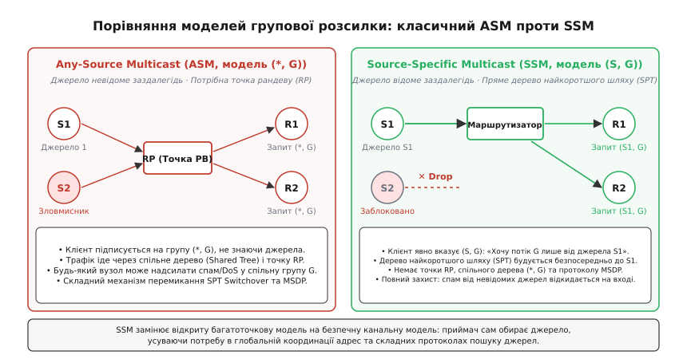
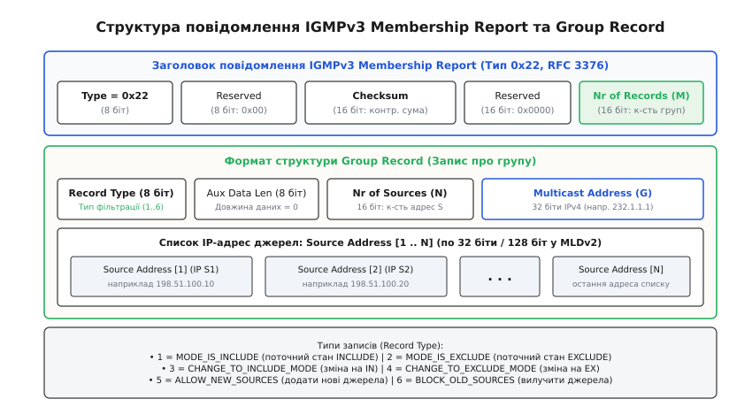
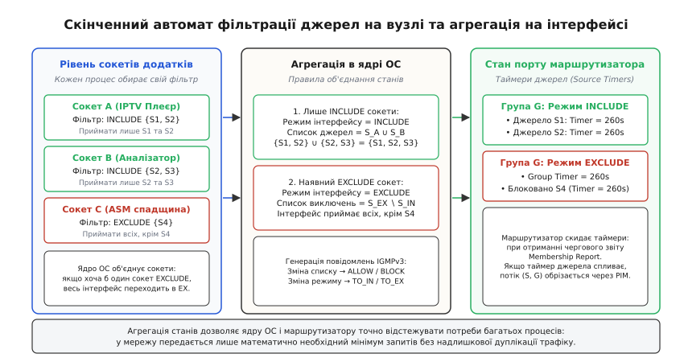
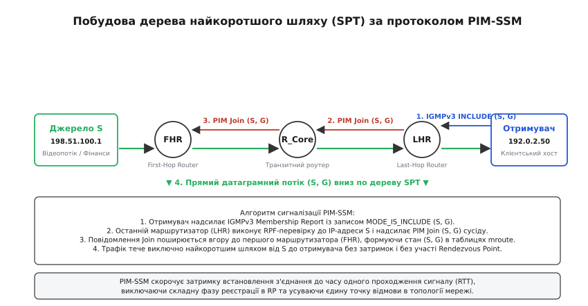

# Фільтрація за джерелом: IGMPv3, MLDv2 і SSM

<preknowlist>
- [Маршрутизація IP](book:communications/ip-routing) — префікси підмереж, таблиці маршрутизації, шлюз за замовчуванням, перевірка зворотного шляху (RPF).
- [Підмережі та префікси](book:communications/subnet-addressing) — адресація Class D, діапазони групових адрес IPv4 та структура префіксів IPv6.
- [MAC, IP і ARP](book:communications/mac-ip-arp) — канальний та мережевий рівні, відображення 28 біт IPv4 multicast на 23 біти OUI 01:00:5E та префікс 33:33 в IPv6.
- [TCP проти UDP](book:communications/tcp-vs-udp) — датаграмна передача даних без встановлення з'єднання, доставка мультимедіа та біржових котирувань.
- [Алгоритм Дейкстри](book:algorithms/dijkstra) — пошук найкоротших шляхів у графі та побудова дерев найкоротших шляхів (SPT).
</preknowlist>

Коли постає завдання одночасно доставити високобітрейтний цифровий відеопотік 4K або високочастотні біржові котирування тисячам абонентів, одноадресна передача (Unicast) вичерпує пропускну здатність серверного каналу, дублюючи один і той самий пакет `N` разів. Якщо сто тисяч глядачів одночасно дивляться трансляцію футбольного матчу з бітрейтом 25 Мбіт/с, серверний центр обробки даних змушений генерувати сумарний вихідний потік у 2,5 Тбіт/с, що призводить до колапсу каналів зв'язку та величезних фінансових витрат на інфраструктуру.

Класична технологія багатоадресної розсилки IP Multicast вирішувала цю проблему за допомогою моделі Any-Source Multicast (ASM, модель `(*, G)`), де клієнт підписується виключно на групову адресу `G` (наприклад, `239.1.1.1`), не вказуючи, хто саме має право транслювати дані. У такій відкритій моделі будь-який сторонній вузол мережі міг несанкціоновано надіслати терабайти сміттєвого трафіку на адресу `G`, спричиняючи відмову в обслуговуванні (DoS) та засмічуючи абонентські канали, а транзитні маршрутизатори були змушені підтримувати громіздкі точки рандеву (Rendezvous Point, RP), спільні дерева розподілу та міждоменні протоколи зв'язку (MSDP) для динамічного пошуку відправників. Щоб усунути ці архітектурні обмеження, реалізувати апаратну фільтрацію джерел на рівні ядра та забезпечити нескінченний незалежний адресний простір, було створено технологію **Source-Specific Multicast (SSM)**.

---

### 1. Криза відкритої моделі ASM та перехід до канальної парадигми SSM

Фундаментальна ідея класичного IP-мультикасту, сформульована Стівом Дірінгом у 1989 році (RFC 1112), базувалася на метафорі радіоефіру: існує певна частота — групова IP-адреса класу D (`224.0.0.0/4`), на яку будь-хто може транслювати сигнал, а будь-який слухач може налаштувати свій приймач, не знаючи фізичного розташування передавача. Ця модель отримала назву **Any-Source Multicast (ASM)** і позначається як `(*, G)`, де зірочка `*` виступає універсальним шаблоном для будь-якого можливого джерела.

```
       [Джерело S1]          [Джерело S2]          [Зловмисник S_evil]
            \                     |                     /
             \                    |                    /
              ▼                   ▼                   ▼
            +-------------------------------------------+
            |      Групова IP-адреса G (239.1.1.1)      |
            |        (Відкритий радіоефір ASM)          |
            +-------------------------------------------+
                                  |
                                  ▼
                        [Отримувач (*, G)]
```

Для реалізації моделі ASM у розподілених мережах протокол маршрутизації PIM-SM (Protocol Independent Multicast — Sparse Mode) використовує триступеневу архітектуру:
1. **Точка рандеву (RP, Rendezvous Point):** спеціальний виділений маршрутизатор, який виступає центральним координатором групи. Коли нове джерело починає мовлення, перший маршрутизатор джерела (First-Hop Router, FHR) перехоплює необроблені UDP-пакети, запаковує їх в одноадресний IP-тунель у вигляді службових повідомлень `PIM Register` і відправляє на IP-адресу точки рандеву. Процесор RP зобов'язаний програмно розпакувати кожен пакет, перевірити наявність активних підписників та переслати дані вниз по дереву.
2. **Спільне дерево (Shared Tree, `(*, G)-tree`):** коли новий клієнт підключається до групи, його маршрутизатор (Last-Hop Router, LHR) будує спільне дерево розсилки з коренем у точці рандеву, надсилаючи періодичні повідомлення `PIM Join (*, G)`. Дані від RP спускаються вниз по спільному дереву до всіх зацікавлених хостів.
3. **Перемикання на найкоротший шлях (SPT Switchover):** спільне дерево майже ніколи не є оптимальним топологічно (явище трикутної маршрутизації / Triangle Routing), оскільки точка рандеву може знаходитися на іншому континенті, змушуючи трафік двічі перетинати магістральні канали зв'язку. Тому щойно маршрутизатор отримувача фіксує перевищення порогу швидкості трафіку від конкретного джерела `S`, він запускає процедуру перемикання зі спільного дерева на пряме **дерево найкоротшого шляху** (Shortest Path Tree, `(S, G)-tree`). Маршрутизатор LHR надсилає `PIM Join (S, G)` безпосередньо у бік джерела `S` та одночасно відправляє `PIM Prune (*, G)` у бік точки рандеву.


*Порівняння моделей групової розсилки: класичний ASM вимагає точки рандеву (RP) та спільного дерева (*, G), тоді як SSM будує пряме дерево найкоротшого шляху (SPT) безпосередньо до джерела S.*

#### Чому модель ASM зазнала краху у глобальному масштабі

Практична експлуатація мереж ASM виявила три критичні інженерні проблеми, які унеможливили масове розгортання мультикасту в масштабах глобального інтернету:
- **Колізії та дефіцит адресного простору:** простір адрес класу D містить лише 268 мільйонів адрес. Оскільки адреса `G` у моделі ASM є глобальним ідентифікатором групи, два незалежні телевізійні мовники в різних країнах не могли використовувати однакову адресу `239.1.1.1` без взаємного змішування потоків. Спроби створення протоколів динамічного виділення та координації адрес (MADCAP, GLOP) виявилися занадто повільними, вразливими до збоїв і надзвичайно складними в адмініструванні.
- **Вразливість до атак на відмову в обслуговуванні (Multicast DoS):** у моделі ASM будь-який хост в інтернеті може згенерувати гігабітний потік на адресу `239.1.1.1`. Маршрутизатори за стандартом зобов'язані зареєструвати це джерело на точці рандеву та доставити трафік усім підписникам групи `(*, G)`, що призводило до миттєвого перевантаження каналів абонентів, переповнення черг комутаторів та падіння процесорів RP.
- **Нежиттєздатність міждоменної маршрутизації (глухий кут MSDP):** для передачі мультикасту між незалежними операторами (Autonomous Systems) точка рандеву одного провайдера повинна була миттєво дізнаватися про активні джерела в інших мережах. Для цього застосовувався протокол MSDP (Multicast Source Discovery Protocol), який транслював лавиною повідомлення `Source Active` (SA) через повнозв'язну мережу TCP-сесій (порт 639). Це спричиняло колосальні затримки старту мовлення (від 30 секунд до кількох хвилин), високий джитер та регулярні збої маршрутизаторів через вичерпання пам'яті під SA-кеш.

#### Парадигма Source-Specific Multicast (SSM)

Аналіз реальних сценаріїв показав, що понад 95% застосувань мультикасту є трансляціями типу «один до багатьох» (One-to-Many): кабельне телебачення, трансляція концертів, оновлення ПЗ та біржові котирування. У таких системах клієнт завжди заздалегідь знає, який канал він обирає, завантажуючи опис сесії (SDP, маніфест або електронний розклад програм EPG), де чітко зазначено і групову адресу `G`, і точну IP-адресу сервера мовлення `S`.

Технологія **Source-Specific Multicast (SSM)**, стандартизована IETF у RFC 3569 та RFC 4607, визначила фундаментальну одиницю мовлення як впорядковану пару **`(S, G)`**, яку називають **каналом SSM** (SSM Channel). Отримувач більше не підписується на абстрактну групу: він надсилає запит виду «Я хочу отримувати трафік групи `G` виключно від джерела `S`».

Це рішення миттєво ліквідувало потребу в точках рандеву (RP), спільних деревах `(*, G)` та протоколі MSDP. Маршрутизатор отримувача, знаючи адресу джерела `S`, негайно будує пряме дерево найкоротшого шляху (SPT) до відправника за стандартними одноадресними таблицями маршрутизації.

Детальніше про те, як наукові експерименти в оверлейній мережі MBone та інженерні суперечки довкола протоколу PIM-SM привели до створення стандарту SSM під керівництвом Х'ю Холбрука та Девіда Черітона, розповідає [історія еволюції мультикасту](book:communications/source-specific-multicast/hist-multicast-evolution.md).

---

### 2. Адресний простір SSM: виділені діапазони IPv4 та IPv6

Для того щоб маршрутизатори та комутатори могли однозначно відрізняти запити SSM від класичного ASM без додаткових налаштувань, організація IANA зарезервувала спеціальні діапазони IP-адрес.

```
       +-------------------------------------------------------------+
       | IPv4 SSM: 232.0.0.0/8 (232.0.0.0 - 232.255.255.255)         |
       | Локальний адресний простір: кожне джерело S має 16.7M груп  |
       +-------------------------------------------------------------+
       | IPv6 SSM: FF3x::/32 (Flags=0011, Scope=x, Group ID=96 біт)  |
       | Автоматична глобальна унікальність через Unicast-Prefix     |
       +-------------------------------------------------------------+
```

#### Адресний діапазон IPv4 SSM (`232.0.0.0/8`)

У просторі адрес IPv4 стандартом RFC 4607 для SSM виділено весь блок класу D **`232.0.0.0/8`** (від `232.0.0.0` до `232.255.255.255`, що становить `2²⁴ = 16 777 216` адрес).

Головна властивість простору `232.0.0.0/8` — **локальність адресного простору джерела**. Оскільки канал ідентифікується повною парою `(S, G)`, кожна IP-адреса відправника у світі володіє всіма 16,7 мільйонами адрес діапазону. Канал `(198.51.100.1, 232.1.1.1)` компанії «Альфа» та канал `(203.0.113.5, 232.1.1.1)` компанії «Бета» є для мережевого обладнання повністю незалежними сутностями. Жодної глобальної реєстрації чи узгодження групових адрес більше не потрібно.

#### Адресний діапазон IPv6 SSM (`FF3x::/32`)

У протоколі IPv6 групові адреси починаються з префікса `FF00::/8`. Формат адреси IPv6 Multicast (RFC 4291) має таку бінарну структуру:

```
|   8 біт   |  4 біти  |  4 біти  |            112 біт             |
+-----------+----------+----------+--------------------------------+
| 1111 1111 |  Flags   |  Scope   |            Group ID            |
```

- **Поле Flags (4 біти):** кодується як `0 R P T`.
  - Біт `T` (Transient): `0` — постійна (well-known) адреса IANA, `1` — динамічна (non-permanent).
  - Біт `P` (Prefix-based): `1` вказує, що адреса згенерована на основі одноадресного префікса організації (RFC 3306).
  - Біт `R` (Rendezvous Point): `1` означає наявність вбудованої адреси RP (для ASM).
- **Поле Scope (4 біти):** визначає межі поширення пакетів:
  - `0x2` — Link-Local (у межах одного фізичного каналу зв'язку);
  - `0x5` — Site-Local (у межах кампусу або підприємства);
  - `0x8` — Organization-Local (у межах автономної системи компанії);
  - `0xE` — Global (глобальний інтернет).

Для SSM біти прапорців встановлюються у комбінацію `Flags = 0011` (тобто `P = 1` та `T = 1`), що утворює префікс **`FF3x::/32`**, де `x` позначає область видимості (Scope). Наприклад:
- `FF32::/32` — Link-Local SSM;
- `FF3E::/32` — Global SSM.

Крім того, стандарт RFC 3306 визначає формат **Unicast-Prefix-Based Multicast Address**, де у групову адресу вбудовується 64-бітний маршрутизований префікс власника джерела:
```
| 8 біт | 4 біти | 4 біти | 8 біт | 8 біт |      64 біти      |  32 біти  |
+-------+--------+--------+-------+-------+-------------------+-----------+
|  FF   |  0011  | Scope  | Resv  | Plen  |  Network Prefix   |  GroupID  |
```
Якщо організація володіє одноадресним блоком `2001:db8:1234::/48`, вона може сформувати глобальну SSM-адресу `FF3E:0030:2001:0DB8:1234:0000:0000:0001`. Це математично гарантує глобальну унікальність мультикаст-адрес у масштабах планети без використання будь-яких централізованих серверів розподілу адрес.

#### Відображення на канальний рівень (Layer 2 MAC Addressing) та проблема аліасингу

При передачі IP-мультикасту через мережі Ethernet комутатори та мережеві карти повинні транслювати мережеву IP-адресу в канальну MAC-адресу:

1. **IPv4 Multicast MAC:** згідно з RFC 1112, молодші 23 біти IP-адреси копіюються в OUI `01:00:5E:00:00:00` (діапазон `01:00:5E:00:00:00` – `01:00:5E:7F:FF:FF`). Оскільки в IPv4 мультикаст-адреса має 28 змінних бітів, старші 5 бітів втрачаються при відображенні, створюючи неоднозначність (аліасинг) у співвідношенні `32:1`. Тобто 32 абсолютно різні групові IP-адреси транслюються в одну й ту саму фізичну MAC-адресу на канальному рівні. Мережева карта приймача, налаштована на MAC-фільтрацію, пропускає всі 32 потоки в пам'ять операційної системи, де ядро змушене витрачати процесорний час на перевірку IP-заголовка. В SSM фільтрація за парою `(S, G)` на рівні сокета повністю ізолює процеси від чужих аліасів.
2. **IPv6 Multicast MAC:** молодші 32 біти IPv6-адреси копіюються в префікс `33:33:xx:xx:xx:xx`, що забезпечує значно менший рівень колізій на канальному рівні Ethernet.

---

### 3. Сигналізація хост-маршрутизатор: IGMPv3 та MLDv2

Щоб технологія SSM функціонувала, хост повинен мати можливість повідомити своєму шлюзу не лише адресу групи `G`, а й список бажаних або небажаних джерел `S`.

Попередні версії протоколів — IGMPv1 (RFC 1112), IGMPv2 (RFC 2236) для IPv4 та MLDv1 (RFC 2710) для IPv6 — не підтримували передачу списків джерел. Їхні повідомлення Membership Report містили виключно групову адресу `G`.

Для підтримки фільтрації за джерелом IETF стандартизував нові протоколи сигналізації: **IGMPv3** для IPv4 (RFC 3376, 2002 р.) та **MLDv2** для IPv6 (RFC 3810, 2004 р.).

#### Режими фільтрації джерел: INCLUDE та EXCLUDE

На рівні інтерфейсу хоста та мережевого драйвера IGMPv3 запроваджує поняття фільтра джерел (Source Filter), який функціонує у двох взаємовиключних режимах:

1. **Режим `INCLUDE (S_list)`:** інтерфейс бажає отримувати трафік для групи `G` **виключно** від відправників, чиї IP-адреси явно перелічені у списку `S_list`. Усі пакети від будь-яких інших джерел ігноруються та відкидаються. Чистий режим SSM працює виключно за моделлю `INCLUDE` з непорожнім списком джерел.
2. **Режим `EXCLUDE (S_list)`:** інтерфейс приймає трафік для групи `G` від **усіх джерел у мережі**, за винятком тих, які зазначені у списку блокування `S_list`. Порожній список `EXCLUDE (∅)` еквівалентний класичній відкритій підписці ASM `(*, G)` («приймати від усіх без винятку»).


*Формат повідомлення IGMPv3 Membership Report: заголовок з типом 0x22 та масив записів Group Record, що містять тип фільтрації, групову адресу та перелік IP-адрес джерел.*

#### Типи записів Group Record у повідомленнях IGMPv3/MLDv2

Коли хост надсилає повідомлення **Membership Report** (тип `0x22` в IGMPv3 або ICMPv6 тип `143` в MLDv2), воно містить масив структур **Group Record**. Кожен запис належить до одного з шести стандартизованих типів:

| Категорія | Тип запису | Назва запису | Призначення та реакція маршрутизатора |
| :--- | :---: | :--- | :--- |
| **Current-State** | `1` | **`MODE_IS_INCLUDE`** | Відповідь на опитування Query: інтерфейс перебуває в режимі `INCLUDE` зі списком джерел `S_list`. |
| | `2` | **`MODE_IS_EXCLUDE`** | Відповідь на опитування Query: інтерфейс перебуває в режимі `EXCLUDE` зі списком виключень `S_list`. |
| **Filter-Mode-Change** | `3` | **`CHANGE_TO_INCLUDE_MODE`** (`TO_IN`) | Подієвий звіт: інтерфейс перемкнувся з режиму `EXCLUDE` в режим `INCLUDE`. Вказує новий список дозволених джерел. |
| | `4` | **`CHANGE_TO_EXCLUDE_MODE`** (`TO_EX`) | Подієвий звіт: інтерфейс перемкнувся з режиму `INCLUDE` в режим `EXCLUDE`. Вказує список виключень. |
| **Source-List-Change** | `5` | **`ALLOW_NEW_SOURCES`** (`ALLOW`) | Подієвий звіт: додати перелічені джерела до поточного дозволеного списку (без зміни режиму фільтра). |
| | `6` | **`BLOCK_OLD_SOURCES`** (`BLOCK`) | Подієвий звіт: заблокувати/видалити перелічені джерела з поточного списку. |

#### Вибори активного опитувача (Querier Election) та кодування таймерів

Якщо в одному фізичному сегменті Ethernet знаходяться два або більше маршрутизаторів, активним опитувачем (Active Querier) стає пристрій із найменшою числовою IP-адресою. Інші маршрутизатори переходять у режим Non-Querier і запускають таймер `Other Querier Present Timer`. Якщо активний опитувач виходить із ладу і перестає надсилати General Query кожні `Query Interval` секунд, резервний маршрутизатор перехоплює роль опитувача.

Для підтримки великих широкомовних мереж (наприклад, супутникових або кабельних телевізійних мереж із тисячами абонентських приставок) поле `Max Resp Code` у запитах IGMPv3 використовує формат із рухомою комою, якщо значення перевищує 128:
```
Якщо Max_Resp_Code < 128:
  Час_відповіді = Max_Resp_Code / 10 секунд

Якщо Max_Resp_Code >= 128:
  Мантиса = Max_Resp_Code & 0x0F
  Експонента = (Max_Resp_Code >> 4) & 0x07
  Час_відповіді = ((Мантиса | 0x10) << (Експонента + 3)) / 10 секунд
```
Це дозволяє маршрутизатору встановлювати максимальний час очікування відповіді до 3174,4 секунди (~53 хвилини), ефективно запобігаючи перевантаженню абонентського лінку штормом відповідей (Query Response Storm).

Повний бінарний розклад кожного поля заголовків та детальний опис сокетних викликів `setsockopt()` стандарту RFC 3678 наведено у вставці [бінарний формат IGMPv3/MLDv2 та системне сокетне API](book:communications/source-specific-multicast/api-igmpv3-mldv2-records.md).

---

### 4. Агрегація станів у ядрі ОС та скінченний автомат фільтрації

В операційних системах на одному хості одночасно можуть працювати десятки мережевих додатків, кожен із яких створює власні сокети та встановлює індивідуальні правила фільтрації для однієї й тієї самої мультикаст-групи `G`.

Ядро операційної системи виконує функцію координатора: воно обчислює теоретико-множинне об'єднання фільтрів усіх локальних сокетів і підтримує єдиний агрегований стан для фізичного мережевого інтерфейсу.


*Скінченний автомат фільтрації: об'єднання запитів окремих сокетів додатків у ядрі операційної системи та формування відповідних звітів IGMPv3 для оновлення таймерів маршрутизатора.*

#### Булева алгебра агрегації сокетів у ядрі:
1. **Якщо всі сокети використовують режим `INCLUDE`:**
   - Режим інтерфейсу встановлюється в `INCLUDE`.
   - Результуючий список джерел є простим об'єднанням множин:
     ```
     S_iface = S_sock1 ∪ S_sock2 ∪ ... ∪ S_sockN
     ```
     Хост надсилає у фізичну мережу запит на отримання трафіку від усіх джерел, які потрібні хоча б одному локальному процесу.
2. **Якщо хоча б один сокет переходить у режим `EXCLUDE`:**
   - Режим усього інтерфейсу негайно стає `EXCLUDE`.
   - Результуючий список джерел обчислюється як перетин списків виключень усіх `EXCLUDE`-сокетів без джерел, які явно запитуються `INCLUDE`-сокетами:
     ```
     S_iface = (S_ex1 ∩ S_ex2) ∖ (S_in1 ∪ S_in2)
     ```
     Тобто інтерфейс пропускає все, що потрібно `EXCLUDE`-додаткам, і водночас гарантує надходження потоків для `INCLUDE`-процесів.

#### Обробка станів на боці маршрутизатора

Маршрутизатор, підключений до абонентського сегмента Ethernet, відстежує стан фільтрації для кожного свого інтерфейсу. На відміну від IGMPv2, де маршрутизатор пам'ятав лише факт наявності слухачів групи `G`, в IGMPv3 маршрутизатор підтримує матрицю таймерів:
- **Group Timer (GT):** таймер існування групи у режимі `EXCLUDE`. Скидається при отриманні звітів `TO_EX` або `MODE_IS_EXCLUDE`.
- **Source Timers (ST):** індивідуальні таймери для кожного джерела `S`. Щоразу, коли від хоста надходить звіт `ALLOW` або `MODE_IS_INCLUDE`, маршрутизатор скидає таймер `ST(S)` до значення `Group Membership Interval (GMI = QRV × Query_Interval + Query_Response_Interval)`.

Якщо таймер джерела `ST(S)` спливає до нуля і жоден інший хост не надіслав звіт про зацікавленість у джерелі `S`, маршрутизатор негайно відправляє повідомлення обрізання гілки `PIM Prune (S, G)` у бік джерела, зупиняючи надходження непотрібного трафіку в локальний сегмент.

#### Відстеження хостів на комутаторах L2 (IGMPv3 Snooping та Explicit Tracking)

Класичні комутатори Ethernet передають мультикаст-кадри як широкомовні (Flooding) на всі активні порти VLAN. Технологія **IGMPv3 Snooping** дозволяє комутатору перехоплювати пакети IGMPv3 Membership Report, декодувати записи Group Record і вносити в апаратну таблицю комутації (TCAM) точні правила:
- На порт 1 пересилати потік `(198.51.100.1, 232.1.1.1)`.
- На порт 2 пересилати потік `(198.51.100.2, 232.1.1.1)`.

Крім того, оскільки звіти IGMPv3 Report надсилаються на групову адресу `224.0.0.22`, хости більше не пригнічують власні звіти (Report Suppression вимкнено). Це дозволяє комутаторам та маршрутизаторам реалізувати **Explicit Host Tracking** — точний поіменний облік усіх хостів підмережі, підписаних на кожен канал SSM. Коли абонент надсилає `BLOCK_OLD_SOURCES`, комутатор знає, чи залишилися на цьому порту інші слухачі, і виконує миттєве вимкнення порту (Fast Leave) без додаткових уточнюючих опитувань.

---

### 5. Маршрутизація PIM-SSM: побудова дерева найкоротшого шляху (SPT) без RP

Поява протоколів IGMPv3 та MLDv2 дозволила радикально спростити протокол маршрутизації багатоадресного мовлення PIM-SM. Режим роботи протоколу PIM для адресного простору `232.0.0.0/8` (IPv4) та `FF3x::/32` (IPv6) отримав офіційну назву **PIM-SSM**.

У режимі PIM-SSM повністю вилучено такі компоненти класичного PIM-SM:
- Точки рандеву (RP) та протокол автовиявлення RP (Auto-RP, BSR);
- Спільні дерева розсилки `(*, G)`;
- Процедура інкапсуляції датаграм у пакети `PIM Register` та відправка `Register-Stop`;
- Механізм перемикання SPT Switchover;
- Міждоменний протокол узгодження джерел MSDP.


*Побудова дерева найкоротшого шляху в PIM-SSM: отримавши запит IGMPv3 INCLUDE від хоста, маршрутизатор виконує RPF-перевірку до джерела S і будує пряме дерево без участі точки рандеву.*

#### Покроковий алгоритм побудови дерева в PIM-SSM:

1. **Ініціалізація підписки на клієнті:** хост генерує повідомлення IGMPv3 Membership Report із записом `MODE_IS_INCLUDE` або `CHANGE_TO_INCLUDE_MODE`, вказуючи канал `(S, G)`, де `S = 198.51.100.1`, а `G = 232.1.1.1`.
2. **Перевірка адресного діапазону останнім маршрутизатором (LHR):** маршрутизатор отримує звіт IGMPv3. Побачивши, що адреса `232.1.1.1` належить діапазону SSM, маршрутизатор ігнорує будь-які налаштування точок рандеву RP.
3. **Перевірка зворотного шляху (RPF Check):** маршрутизатор виконує пошук IP-адреси джерела `198.51.100.1` у своїй одноадресній таблиці маршрутизації (Unicast RIB). Визначається вихідний інтерфейс RPF (RPF Interface) та IP-адреса наступного сусіднього маршрутизатора у бік джерела (RPF Neighbor). Якщо в таблиці маршрутизації існує кілька маршрутів з однаковою вартістю (ECMP), PIM обирає сусіда з найбільшою числовою IP-адресою (Tie-breaker).
4. **Надсилання повідомлення PIM Join `(S, G)`:** маршрутизатор створює запис `(S, G)` у своїй таблиці пересилання багатоадресного мовлення (mroute) і надсилає повідомлення `PIM Join (S, G)` у вихідний RPF-інтерфейс. У структурі повідомлення PIM прапорці встановлюються як `W-bit = 0` (не спільне дерево) та `R-bit = 0` (не точка рандеву).
5. **Поширення по ланцюжку (Hop-by-Hop):** кожен проміжний транзитний маршрутизатор повторює RPF-перевірку до джерела `S` і передає `PIM Join (S, G)` далі вгору по топології аж до першого маршрутизатора (First-Hop Router, FHR), до якого фізично підключено сервер мовлення.
6. **Вирішення колізій на спільних сегментах (PIM Assert Mechanism):** якщо в один Ethernet-сегмент підключено два транзитних маршрутизатори і обидва починають пересилати трафік `(S, G)`, вони виявляють дублювання пакетів і надсилають повідомлення `PIM Assert`. Переможець обирається за найменшою адміністративною відстанню одноадресного маршруту (Administrative Distance), найменшою метрикою до джерела `S`, а при рівності — за найбільшою числовою IP-адресою інтерфейсу. Переможений маршрутизатор негайно блокує свій вихідний порт для цього потоку.
7. **Трансляція даних по найкоротшому шляху:** дерево найкоротшого шляху (SPT) побудовано. Сервер мовлення відправляє стандартні UDP-пакети, які транслюються вниз по гілках дерева і досягають клієнта за мінімально можливий час без додаткових затримок на інкапсуляцію чи проміжну обробку.

---

### 6. Безпека, ізоляція каналів та практичне застосування

Перехід на архітектуру SSM забезпечив фундаментальний прорив у надійності та кібербезпеці мультикаст-мереж.

#### 1. Захист від несанкціонованих джерел та DoS-атак
У класичній моделі ASM зловмисник міг надсилати сміттєві пакети на адресу групи `239.1.1.1`. Маршрутизатори доставляли цей спам усім слухачам спільного дерева `(*, G)`.

В SSM несанкціоноване джерело `S_rogue`, яке надсилає трафік на групу `232.1.1.1`, виявляється повністю ізольованим:
- Клієнти підписані строго на пару `(S_legit, 232.1.1.1)`.
- Маршрутизатори побудували дерево розсилки виключно для `(S_legit, 232.1.1.1)`.
- Для джерела `S_rogue` стан пересилання відсутній: перший же маршрутизатор на вході в мережу відкидає пакети зловмисника на апаратному рівні драйвера мережевої карти, захищаючи транзитні канали та кінцевих абонентів.

#### 2. Цифрове телебачення (IPTV) та операторські мережі
У сучасних мережах провайдерів кожен телевізійний канал транслюється як окремий SSM-потік (наприклад, канал новин — `(10.0.10.1, 232.0.1.1)`, спортивний канал — `(10.0.10.2, 232.0.1.2)`).

Коли абонент перемикає телеканал за допомогою пульта приставки Set-Top Box, пристрій відправляє один комбінований звіт IGMPv3:
- `BLOCK_OLD_SOURCES {10.0.10.1}` для старого каналу;
- `ALLOW_NEW_SOURCES {10.0.10.2}` для нового каналу.

Завдяки підтримці швидкого відключення (Fast Leave / Explicit Host Tracking) на комутаторах доступу затримка перемикання телеканалів (Channel Zapping Time) скоротилася до 20–50 мілісекунд, забезпечуючи миттєву зміну картинки без артефактів та зависань.

#### 3. Фінансові біржові стрічки (Market Data Feeds)
Провідні світові фінансові біржі (NASDAQ, CME Group, NYSE, Eurex) транслюють біржові котирування в режимі реального часу через потоки UDP SSM.

У біржовій торгівлі, де кожна мікросекунда затримки визначає мільйонні прибутки або збитки торгових роботів (High-Frequency Trading), використання SSM є обов'язковим стандартом:
- Відсутність точок рандеву RP виключає непередбачувані затримки буферизації та джитер.
- Резервування за стандартом **A/B Feed Arbitration** транслює дві паралельні копії стрічки котирувань через незалежні фізичні оптоволоконні траси: `Feed A (S1, 232.1.1.1)` та `Feed B (S2, 232.1.1.2)`. Торговий сервер підключається до обох потоків одночасно, обробляючи перший прибулий пакет і забезпечуючи нульову втрату котирувань навіть у разі аварії одного з оптичних лінків.

#### 4. Механізм SSM Mapping для застарілих клієнтів (RFC 4578)
У перехідний період, коли частина абонентських пристроїв підтримувала лише протоколи IGMPv1 або IGMPv2 і не могла передавати списки джерел, на маршрутизаторах доступу застосовувався механізм **SSM Mapping**. Коли маршрутизатор отримував від застарілого хоста звіт `(*, G)`, де адреса `G` потрапляла в діапазон `232.0.0.0/8`, він звертався до локальної статичної таблиці або відправляв DNS-запит типу SRV, щоб знайти авторизовану IP-адресу джерела `S` для цієї групи. Отримавши `S`, маршрутизатор самостійно синтезував запис `(S, G)` і будував дерево PIM-SSM, забезпечуючи плавну міграцію інфраструктури без необхідності одночасної заміни мільйонів клієнтських терміналів.

#### 5. SSM у сучасних хмарних центрах обробки даних (EVPN-VXLAN)
У сучасних дата-центрах на базі оверлейних фабрик EVPN-VXLAN протокол PIM-SSM використовується на фізичному рівні (Underlay Network) для оптимізації передачі широкомовного, невідомого одноадресного та багатоадресного трафіку (BUM Traffic). Замість марнотратної одноадресної реплікації (Ingress Replication), комутатори Leaf формують динамічні дерева SSM для кожного VXLAN Network Identifier (VNI), скорочуючи навантаження на фабрику комутації в десятки разів.

Повний покроковий розбір реалізації SSM-клієнта мовами C та C++, конфігурацію тестового стенду в Network Namespaces Linux, налаштування демона FRRouting та аналіз дампів сигналізації наведено у вставці [практичний проект та діагностика SSM у Linux](book:communications/source-specific-multicast/proj-ssm-receiver.md).

---

### 7. Порівняльний синтез: Any-Source Multicast проти Source-Specific Multicast

Підсумкове порівняння двох архітектурних моделей групової розсилки наочно демонструє причини повної відмови індустрії від міждоменного ASM на користь моделі SSM:

| Характеристика | Класичний Any-Source Multicast (ASM) | Source-Specific Multicast (SSM) |
| :--- | :--- | :--- |
| **Базова модель сигналізації** | Невизначене джерело: `(*, G)` | Впорядкована пара: `(S, G)` |
| **Адресний діапазон IPv4** | `224.0.0.0/4` (за винятком `232/8`) | Суворо виділений блок **`232.0.0.0/8`** |
| **Адресний діапазон IPv6** | `FF0x::/16` (за винятком `FF3x`) | Суворо виділений префікс **`FF3x::/32`** |
| **Протоколи сигналізації хоста** | IGMPv1, IGMPv2, MLDv1 (також IGMPv3/MLDv2) | Суворо **IGMPv3** (IPv4) та **MLDv2** (IPv6) |
| **Режим фільтрації сокета** | За замовчуванням `EXCLUDE (порожній)` | Суворо **`INCLUDE (S_list)`** |
| **Маршрутизація в домені** | PIM-SM з точками рандеву (RP) та спільними деревами | Чистий **PIM-SSM** (виключно прямі дерева SPT) |
| **Пошук джерел між AS** | Потребує складного протоколу **MSDP** | **Не потрібен:** дерево будується за Unicast RIB |
| **Глобальний розподіл адрес** | Складний (колізії в просторі класу D) | **Не потрібен:** кожне джерело має 16.7M власних груп |
| **Захист від DoS та спаму** | Відсутній (будь-хто може надсилати в групу `G`) | **Повний:** несанкціоновані джерела відкидаються на вході |
| **Затримка старту потоку** | Висока (350–1200 мс через фазу реєстрації в RP) | **Мінімальна** (15–45 мс, прямий час одного RTT) |
| **Оптимальна сфера застосування** | Багатоточкові наради без фіксованого мовника | Трансляція IPTV, фінансові біржі, CDN-стрімінг |

Source-Specific Multicast став фундаментальною віхою в еволюції мережевих протоколів: відкинувши надлишкову концепцію відкритого радіоефіру та узгодивши модель передачі даних із реальними потребами індустрії (трансляція від одного джерела до багатьох слухачів), SSM перетворив складний і нестабільний багатоадресний зв'язок на надійний, безпечний та високопродуктивний інструмент доставки інформації в глобальних IP-мережах.
