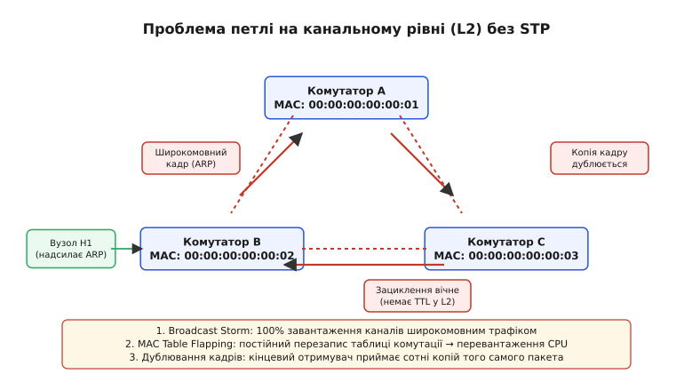
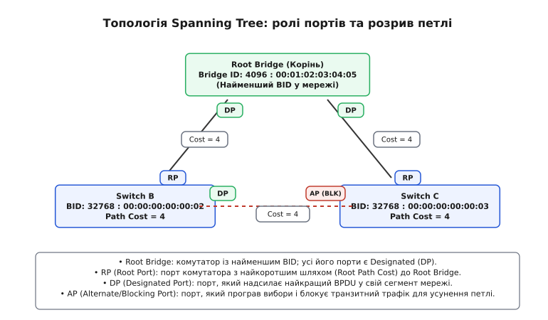
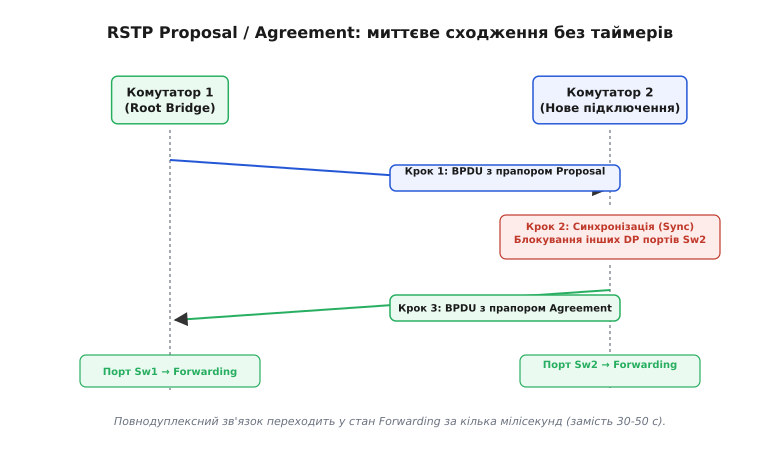

# Spanning Tree Protocol (STP) та Rapid Spanning Tree Protocol (RSTP): захист від мережевих петель у комутованих мережах L2

<preknowlist>
- [MAC, IP і ARP](book:communications/mac-ip-arp) — принципи роботи комутатора, таблиці MAC-адрес (CAM) та широкомовного розсилання кадрів.
- [Затримка й надійність](book:communications/latency-reliability) — концепції пропускної здатності, пакетних втрат та характеристики ліній зв'язку.
- [VLAN та транкінг](book:communications/vlan-and-trunking) — віртуальні локальні мережі, тегування кадрів IEEE 802.1Q та варіанти PVST+ / MSTP.
</preknowlist>

Підключення кількох фізичних ліній між комутаторами Ethernet є природним та необхідним інженерним рішенням у корпоративних мережах. Фізичне резервування гарантує, що при виході з ладу один з кабелів, обриві оптичного волокна або поломці конкретного порту комутатора, резервний канал миттєво перебере на себе транзит даних. Проте з'єднання двох або більше комутаторів у закритий зациклений контур без спеціальних протоколів управління призводит до негайної катастрофи: мережа повністю паралізується протягом кількох секунд.

Проблема полягає у фундаментальній архітектурній відмінності між канальним (L2) та мережевим (L3) рівнями моделі OSI. Заголовок IP-пакета обов'язково містить поле `TTL` (Time To Live — час життя), значення якого зменшується на одиницю кожним проміжним маршрутизатором. Коли `TTL` досягає нуля, пакет знищується, а відправнику надсилається повідомлення ICMP. Натомість заголовок Ethernet-кадру **не має жодного лічильника тривалості життя чи кількості транзитних переходів**. Кадр Ethernet, потрапивши в замкнений контур L2, циркулює по ньому вічно.


*Виникнення широкомовного шторму, перезапис таблиці MAC-адрес та дублювання кадрів у замкненому контурі L2 без протоколу захисту.*

---

## Анатомія руйнування L2-мережі без протоколу захисту

Щоб зрозуміти масштаби руйнування, яке викликає петля на канальному рівні, слід розглянути базовий механізм обробки кадрів комутатором. Коли комутатор отримує кадр Ethernet, він здійснює дві операції:
1. **Навчання (Learning)**: запам'ятовує `Source MAC` (MAC-адресу відправника) та номер порту, з якого прийшов кадр, заносячи цей запис у таблицю комутації (CAM-таблицю).
2. **Просування (Forwarding)**: шукає `Destination MAC` (MAC-адресу призначення) у CAM-таблиці. Якщо адреса знайдена, кадр відправляється на конкретний порт (Unicast). Якщо адреса невідома або є широкомовною (`FF:FF:FF:FF:FF:FF`), комутатор застосовує **лавинне розсилання (Flooding)** — дублює кадр на всі активні порти, крім того, з якого кадр був отриманий.

Коли будь-який пристрій у мережі надсилає широкомовний кадр (наприклад, ARP-запит для пошуку IP-адреси або DHCP Discover для отримання конфігурації), виникає три руйнівних явища:

### 1. Широкомовний шторм (Broadcast Storm)
Сусідні комутатори приймають широкомовний кадр і ретранслюють його на всі свої порти. Кадр повертається на початковий комутатор через дубльовану лінію, розмножується в геометричній прогресії та розганяє широкомовний шторм. За частки секунди 100% смуги пропускання всіх фізичних ліній заповнюється мільйонами дубльованих копій того самого кадру.

### 2. Нестабільність таблиці MAC-адрес (MAC Table Churn / Flapping)
Комутатор оновлює свої знання про прив'язку пристроїв за кожним вхідним кадром. Коли копії того самого кадру від вузла H1 надходять то з порту 1, то з порту 2, комутатор безперервно перезаписує запис для MAC-адреси H1. Оскільки оновлення таблиці координується процесором комутатора, навантаження на CPU досягає 100%, вимикаючи будь-яку можливість обробки керуючого трафіку та припиняючи нормальну комутацію.

### 3. Багаторазова дубльована доставка кадрів (Multiple Frame Transmission)
Кінцевий отримувач приймає не один кадр, а десятки тисяч його копій. Це викликає збої в стекі мережевих протоколів операційної системи та аварійне завершення мережевих застосунків.

Реальна історія створення алгоритму, який врятував мережі Ethernet від цієї проблеми в 1985 році, детально висвітлена в [Історія Spanning Tree: від ідеї Раді Перлман до IEEE 802.1w](book:communications/stp-rstp#hist-spanning-tree.md).

---

## Графова модель покривального дерева

Для усунення петель без фізичного відключення резервних кабелів необхідно перетворити довільний граф мережевої топології `G = (V, E)`, де `V` — комутатори (вершини), а `E` — фізичні лінії зв'язку (ребра), на дерево `T ⊂ G`. Дерево за означенням є зв'язним графом без циклів, який об'єднує всі вершини `V`.

Щоб збудувати таке дерево, комутатори повинні узгодити блокування певних портів для звичайного трафіку користувачів. Блокований порт залишається фізично підключеним та здатним приймати й надсилати спеціальні службові кадри управління. Проте він припиняє пересилку будь-яких кадрів даних (unicast, multicast, broadcast) та не вивчає MAC-адреси із вхідного трафіку. При аварії на основній лінії блокований порт миттєво розблоковується, відновлюючи зв'язність топології.

Цей процес реалізує протокол **Spanning Tree Protocol (STP)**, стандартизований комітетом IEEE як **IEEE 802.1D**.

---

## Механіка виборів та обчислення топології в 802.1D

Обчислення покривального дерева відбувається шляхом безперервного обміну службовими кадрами **BPDU (Bridge Protocol Data Unit)**. Повна побайтова структура кадрів BPDU наведена в [Структура та поля кадрів BPDU у STP та RSTP](book:communications/stp-rstp#api-bpdu-frame.md).

Для побудови єдиної топології без петель алгоритм проходить чотири послідовні фази.

```
Крок 1: Вибір Root Bridge (найменший Bridge ID в усій мережі)
  ↓
Крок 2: Вибір Root Port (RP) на кожному не-кореневому комутаторі
  ↓
Крок 3: Вибір Designated Port (DP) для кожного сегмента мережі
  ↓
Крок 4: Блокування решти портів (Alternate / Blocking Port)
```

### 1. Вибір Кореневого Комутатора (Root Bridge)

На початку роботи кожен комутатор вважає себе "коренем" мережі і починає кожні 2 секунди розсилати кадри BPDU, у яких вказує власний ідентифікатор **Bridge ID (BID)** як ідентифікатор кореня.

Структура Bridge ID складається з 8 байтів:
* **Пріоритет (Bridge Priority)**: 2 байти (значення за замовчуванням `32768`).
* **MAC-адреса**: 6 байтів (базова апаратна адреса комутатора).

Коли комутатор отримує від сусіда BPDU з меншим (кращим) значенням BID, він визнає чужу перевагу, припиняє оголошувати себе коренем і починає ретранслювати BPDU з оголошенням цього кращого кореня.

Оскільки порівняння відбувається від старших байтів до молодших, комутатор із найменшим значенням `Bridge Priority` стає **Root Bridge**. Якщо пріоритети однакові, переможцем стає комутатор із найменшою фізичною MAC-адресою.


*Розподіл ролей портів у топології STP: Root Bridge має лише Designated-порти, інші комутатори вибирають один Root Port та блокують дублюючий Alternate Port.*

---

### 2. Вибір Кореневих Портів (Root Port)

Після визначення Root Bridge кожен інший (не-кореневий) комутатор має обрати один порт, який надає найкоротший та найдешевший шлях до кореня. Цей порт отримує роль **Root Port (RP)**.

Для обчислення довжини шляху використовується параметр **Root Path Cost**. Коли Root Bridge генерує BPDU, він вказує значення `Root Path Cost = 0`. Кожен комутатор, приймаючи BPDU через певний порт, додає до вказаної у кадрі вартості внутрішню **вартість порту (Port Cost)**, яка залежить від швидкості каналу.

```
Вхідний BPDU (Root Path Cost = X)
  → Прийом на порту зі швидкістю 1 Гбіт/с (Port Cost = 4)
  → Новий Root Path Cost = X + 4
```

#### Таблиця розрахунку вартості портів за стандартами IEEE:

| Швидкість каналу | IEEE 802.1D-1998 (16-бітне кодування) | IEEE 802.1t / 802.1w (32-бітне кодування) |
| :--- | :---: | :---: |
| **10 Мбіт/с** | `100` | `2 000 000` |
| **100 Мбіт/с (Fast Ethernet)** | `19` | `200 000` |
| **1 Гбіт/с (Gigabit Ethernet)** | `4` | `20 000` |
| **10 Гбіт/с** | `2` | `2 000` |
| **100 Гбіт/с** | `1` | `200` |

#### Алгоритм розв'язання нічиїх (Tie-Breakers) при виборі Root Port:

Якщо комутатор має два або більше портів із **абсолютно однаковою сумарною вартістю** до Root Bridge, вибір Root Port здійснюється шляхом послідовної перевірки критеріїв-краваток:

1. **Найменший Root Path Cost**: перемагає порт із найменшою вартістю шляху.
2. **Найменший Designated Bridge ID (Sender BID)**: якщо вартості однакові, перемагає порт, підключений до сусіднього комутатора з меншим BID.
3. **Найменший Designated Port ID (Sender PID)**: якщо обидва порти підключені до одного й того самого сусіднього комутатора, перемагає порт, з'єднаний із портом сусіда, який має менший `Port ID` (наприклад, `Port 1` кращий за `Port 2`).
4. **Найменший власний Port ID (Receiver PID)**: якщо порти з'єднані через паралельні лінії до одного хаба, перемагає власний порт із меншим логічним номером.

---

### 3. Вибір Призначених Портів (Designated Port)

На кожному фізичному сегменті (лінії між двома комутаторами) повинен бути обраний один порт, відповідальний за просування трафіку від цього сегмента у напрямку Root Bridge. Цей порт називається **Designated Port (DP)**.

На самому Кореневому Комутаторі (Root Bridge) **УСІ активні порти є Designated Ports**, оскільки вартість до кореня від них дорівнює нулю.

Для інших сегментів статус DP отримує порт того комутатора, який випромінює у цей сегмент BPDU з меншою вартістю `Root Path Cost`. Якщо вартості двох комутаторів однакові, порівнюються їхні `Bridge ID`. Порт комутатора з меншим BID стає Designated Port, а порт іншого комутатора програє вибори.

---

### 4. Блокування решти портів (Alternate / Blocking Port)

Усі порти, які не стали ані Root Port, ані Designated Port, переходять у стан блокування — **Blocking Port (або Alternate Port)**. Вони припиняють транзит кадрів і розривають фізичні петлі мережі.

---

## Стани портів та затримки сходження в 802.1D

Щоб запобігти тимчасовому виникненню петель у момент зміни топології, класичний STP 802.1D не переводить порт із стану блокування в стан просування трафіку миттєво. Замість цього порт послідовно проходить через п'ять станів.

| Стан порту | Прийом BPDU | Надсилання BPDU | Вивчення MAC-адрес | Просування даних | Тривалість стану |
| :--- | :---: | :---: | :---: | :---: | :--- |
| **Disabled** | Ні | Ні | Ні | Ні | Необмежено (порт вимкнено адміністратором) |
| **Blocking** | Так | Ні | Ні | Ні | Пасивно (до 20 сек `Max Age`) |
| **Listening** | Так | Так | Ні | Ні | 15 секунд (`Forward Delay`) |
| **Learning** | Так | Так | Так | Ні | 15 секунд (`Forward Delay`) |
| **Forwarding** | Так | Так | Так | Так | Постійна робота |

### Математичний розрахунок таймерів 802.1D

Значення таймерів у 802.1D були розраховані під застарілу мережеву модель із максимальним діаметром у 7 хопів (7 комутаторів поспіль):

```
Max Age = 20 секунд (2 * Hello + згасання 7 хопів)
Forward Delay = 15 секунд (очікування поширення BPDU та очищення CAM)
```

При обриві основної лінії:
1. Сусідній комутатор припиняє отримувати періодичні кадри BPDU від кореня. Він чекає закінчення таймера **Max Age** (`20 секунд`).
2. Порт переходить у стан **Listening** на `15 секунд` (`Forward Delay`), беручи участь у виборах.
3. Порт переходить у стан **Learning** ще на `15 секунд` (`Forward Delay`), вивчаючи MAC-адреси.
4. Порт стає **Forwarding**.

```
Загальний час сходження 802.1D = 20 с + 15 с + 15 с = 50 секунд
```

У сучасних мережах зупинка зв'язку на 50 секунд є неприпустимою. Це змусило розробити протокол швидкого сходження.

---

## Механізм повідомлення про зміну топології (TCN BPDU)

Коли в мережі 802.1D змінюється стан порту, комутатор не може чекати 300 секунд (стандартний `MAC Aging Time`) для оновлення таблиць MAC-адрес на інших пристроях.

Для вирішення цієї проблеми винайдено механізм **TCN (Topology Change Notification)**:
1. Комутатор, на якому сталася зміна, випускає кадр **TCN BPDU** через свій Root Port у напрямку Root Bridge.
2. Кожен транзитний комутатор підтверджує прийом кадру прапором `TCA (Topology Change Acknowledgment)` у своєму наступному BPDU і передає TCN вище.
3. Досягнувши Root Bridge, корінь встановлює прапор **TC (Topology Change)** у своїх звичайних BPDU і розсилає його по всій мережі протягом часу `Max Age + Forward Delay` (35 секунд).
4. Отримавши BPDU з прапором TC, усі комутатори в мережі тимчасово зменшують свій `MAC Aging Time` з 300 секунд до `Forward Delay` (15 секунд). Це змушує комутатори за 15 секунд очистити неактивні записи в CAM-таблиці та заново вивчити реальне розташування пристроїв за новою топологією.

---

## Rapid Spanning Tree Protocol (RSTP / IEEE 802.1w)

Стандарт **IEEE 802.1w (RSTP)** вирішує проблему повільності, скорочуючи час відновлення зв'язку з 50 секунд до **кількох мілісекунд**.

### Спрощення станів портів

RSTP об'єднав неінформативні стани Disabled, Blocking та Listening у єдиний стан — **Discarding**.

| Стан порту у 802.1D | Стан порту у RSTP (802.1w) | Операційна поведінка |
| :--- | :--- | :--- |
| **Disabled** | **Discarding** | Кадри даних відкидаються, MAC-адреси не вивчаються. |
| **Blocking** | **Discarding** | Трафік блоковано, вивчаються лише кадри BPDU. |
| **Listening** | **Discarding** | Трафік блоковано, відбувається обмін BPDU. |
| **Learning** | **Learning** | Вивчаються MAC-адреси, але кадри даних НЕ просуваються. |
| **Forwarding** | **Forwarding** | Повноцінна робота: вивчення MAC та просування даних. |

### Уточнення ролей портів

RSTP чітко розрізняє причини, з яких порт не став Root або Designated:
* **Root Port (RP)**: порт із найкращим шляхом до Root Bridge.
* **Designated Port (DP)**: порт, призначений для обслуговування сегмента.
* **Alternate Port (AP)**: резервний порт, який отримує кращі BPDU від іншого комутатора. Він є прямою заміною для Root Port і миттєво стає RP при відмові основного каналу.
* **Backup Port (BP)**: резервний порт, який отримує кращі BPDU від того самого комутатора (дубльовані лінії до хаба).

---

## Механізм швидкого сходження Proposal / Agreement

Головним технологічним проривом RSTP є відмова від пасивного очікування таймерів `Forward Delay`. Замість цього на повнодуплексних точкових лініях **Point-to-Point** застосовується активне рукостискання **Proposal / Agreement (Пропозиція / Узгодження)**.


*Послідовність миттєвого рукостискання Proposal/Agreement у RSTP між двома комутаторами.*

### Алгоритм роботи Proposal / Agreement:

1. **Крок 1 (Proposal)**: При підключенні нової лінії між Комутатором 1 та Комутатором 2, порт Комутатора 1 переходить у стан Designated та відразу надсилає BPDU із встановленими прапорами `Proposal` та `Designated Role`.
2. **Крок 2 (Синхронізація / Sync)**: Отримавши Proposal, Комутатор 2 негайно розпочинає процес синхронізації: він превентивно блокує (переводить у стан Discarding) усі свої інші не-граничні Designated-порти, щоб унеможливити виникнення тимчасової петлі.
3. **Крок 3 (Agreement)**: Переконавшись, що всі потенційні петлі ізольовані, Комутатор 2 відправляє у відповідь BPDU із встановленим прапором `Agreement`.
4. **Крок 4 (Миттєвий перехід)**: Отримавши Agreement, Комутатор 1 **негайно** переводить свій порт у стан **Forwarding** без жодних часових затримок. Порт Комутатора 2 також стає **Forwarding**.

Уся процедура займає від 1 до 10 мілісекунд. Програмний приклад реалізації виборів та оцінки векторів BPDU наведено в [Реалізація алгоритму RSTP та обробка BPDU мовами C та C++](book:communications/stp-rstp#proj-rstp-state-machine.md).

---

## Типи портів: Edge Ports та Point-to-Point

Ефективність RSTP залежить від фізичного типу підключення та конфігурації портів:

1. **Edge Ports (Граничні порти / PortFast)**:
   Пори, до яких підключено кінцеві пристрої (персональні комп'ютери, сервери, принтери). Граничний порт переходить у стан Forwarding **миттєво** при підключенні кабелю. Якщо на Edge Port раптом приходить BPDU, він втрачає статус граничного і перетворюється на звичайний порт RSTP.
2. **Point-to-Point (Повнодуплексні лінії)**:
   З'єднання типу "комутатор-комутатор", що працюють у режимі Full-Duplex. Тільки вони підтримують швидке рукостискання Proposal / Agreement.
3. **Shared (Напівдуплексні лінії)**:
   Застарілі з'єднання через хаби (Half-Duplex). Вони не спроможні підтримувати Proposal / Agreement і відкочуються до повільної поведінки з таймерами 802.1D.

---

> 🔧 **Навіщо це: Захист мережі від атак та помилок конфігурації (STP Toolkit)**
> 
> У реальних корпоративних мережах випадкове або зловмисне підключення нового комутатора чи роутера може перехопити роль Root Bridge та перенаправити трафік усієї компанії через слабкий пристрій. Для захисту топології застосовують механізми безпеки:
> 
> * **BPDU Guard**: встановлюється на граничні порти (Edge Ports). Якщо якийсь користувач підключить до розетки в офісі власний комутатор або хак-пристрій, порт при отриманні першого ж BPDU миттєво вимикається (переходить у стан `err-disable`).
> * **Root Guard**: встановлюється на порти, які ведуть до нижчих комутаторів. Якщо через такий порт прийде BPDU із кращим BID (хтось намагається стати новим Root Bridge), Root Guard переведе порт у стан `root-inconsistent` (блокування трафіку) доти, доки нечесні BPDU не припиняться.
> * **BPDU Filter**: повністю блокує відправу та прийом BPDU на вибраному порту.
> * **Loop Guard / UDLD**: захищають мережу від помилок односпрямованої передачі кабелю (Unidirectional Link), коли оптоволокно пошкоджено так, що прийом працює, а передача ні.

---

## Балансування навантаження: PVST+ та MSTP (802.1s)

У класичному STP/RSTP створюється єдине покривальне дерево для всієї фізичної мережі. Це означає, що резервні лінії блокуються абсолютно для всіх кадрів. Якщо в мережі налаштовано віртуальні локальні мережі (VLAN), ресурси блокованих ліній простоюють.

```
Mono Spanning Tree (CST):
VLAN 10  ----> [ Лінія A: Active ]   [ Лінія B: Blocked ]
VLAN 20  ----> [ Лінія A: Active ]   [ Лінія B: Blocked ] (Лінія B розвантажена на 0%)
```

Для вирішення цієї проблеми розроблено дві технології:

### 1. Per-VLAN Spanning Tree (PVST+ / R-PVST+)
Фірмова технологія Cisco, яка запускає **окремий екземпляр RSTP для кожного VLAN**. 
Це дозволяє зробити Комутатор 1 коренем для VLAN 10 (блокуючи лінію B), а Комутатор 2 — коренем для VLAN 20 (блокуючи лінію A).
* **Перевага**: Ідеальне балансування навантаження по всіх каналах.
* **Недолік**: Високе навантаження на процесор комутатора при наявності сотень VLAN (генерація сотень BPDU щосекунди).

### 2. Multiple Spanning Tree Protocol (MSTP / IEEE 802.1s)
Відкритий стандарт, який розв'язує проблему масштабованості. MSTP дозволяє об'єднувати довільну кількість VLAN (наприклад, 4000 VLAN) у кілька логічних екземплярів **MSTI (Multiple Spanning Tree Instance)** — зазвичай 2–4 екземпляри.
* **Перевага**: Ефективне балансування навантаження при мінімальному навантаженні на CPU та мережевий трафік.

---

## Альтернативи Spanning Tree у дата-центрах та фабриках L3

Хоч STP та RSTP залишаються стандартом де-факто в кампусних мережах, у сучасних центрах обробки даних (ЦОД) блокування 50% каналів зв'язку є неприпустимим марнотратством. 

Для побудови високопродуктивних ЦОД використовуються технології, які повністю усувають потребу в STP на канальному рівні:

1. **MLAG / MC-LAG (Multi-Chassis Link Aggregation)**:
   Дозволяє підключати сервер двома кабелями до двох різних фізичних комутаторів так, ніби вони є одним логічним комутатором. Обидві лінії працюють у режимі Active-Active за допомогою стандарту LACP (802.3ad).
2. **Мережеві фабрики Spine-Leaf на L3 (Routed Clos Topologies)**:
   Межа L2 блокується безпосередньо на комутаторі Leaf. Усі з'єднання між Leaf та Spine комутаторами переводяться у маршрутизовані лінії L3 з протоколами BGP або OSPF. Це дозволяє використовувати технологію **ECMP (Equal-Cost Multi-Path)** для одночасної передачі трафіку по всіх наявних шляхах.
3. **EVPN-VXLAN**:
   Накладена мережа (Overlay), яка тунелює кадри L2 всередині UDP-пакетів IP L3. Завдяки цьому комутована мережа розширюється на довільну відстань без ризику виникнення петель L2.

---

## Підсумок: порівняльна характеристика протоколів

| Характеристика | STP (IEEE 802.1D) | RSTP (IEEE 802.1w / 802.1D-2004) | MSTP (IEEE 802.1s) |
| :--- | :---: | :---: | :---: |
| **Час сходження** | 30 – 50 секунд | Кілька мілісекунд (sub-second) | Кілька мілісекунд |
| **Стани портів** | Disabled, Blocking, Listening, Learning, Forwarding | Discarding, Learning, Forwarding | Discarding, Learning, Forwarding |
| **Ролі портів** | Root, Designated, Alternate | Root, Designated, Alternate, Backup | Root, Designated, Master, Alternate, Backup |
| **Механізм переходу** | Пасивні таймери `Forward Delay` | Активне рукостискання Proposal / Agreement | Активне рукостискання |
| **Кількість дерев** | 1 (Mono Spanning Tree / CST) | 1 (або 1 на VLAN у R-PVST+) | Кілька екземплярів (MSTI) для груп VLAN |
| **Сфера застосування** | Застарілі мережі | Сучасні L2-мережі малого та середнього масштабу | Великі корпоративні мережі та ЦОД |
