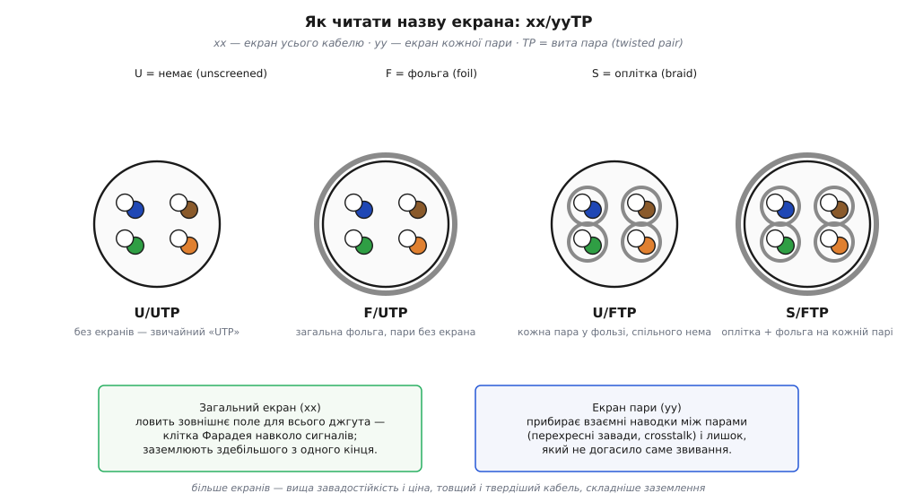

# UTP-кабель

UTP (англ. *Unshielded Twisted Pair* — неекранована вита пара) — найпоширеніший сигнальний кабель планети: блакитна оболонка, восьмиконтактний конектор на кінці, ним з'єднано майже кожен комп'ютер у світі. Усередині немає ні екрана, ні хитрої електроніки — лише вісім мідних жил, скручених у чотири пари. Уся його завадостійкість тримається на одному фізичному прийомі — [витій парі](book:electronics/twisted-pair): дві скручені жили перетворюють велику петлю-антену на ланцюг дрібних петель, що чергують знак, і наводки в них скасовуються. Лишається зрозуміти, що дає різний крок звивання в сусідніх пар, що означають позначки Cat5e/Cat6, навіщо одним кабелям екран, а іншим — ні, і як це все вмикати на макетці.

## Чотири пари в одній оболонці

Під оболонкою звичайного мережевого шнура — **чотири виті пари** (англ. *twisted pair*), вісім мідних жил завтовшки близько 0.5 мм. Кожна пара має свій колір за стандартом TIA-568: помаранчева, зелена, синя, бура — і до кожної кольорової жили йде її біло-смугаста «напарниця». Пари не просто скручені поодинці: усі чотири ще й сплетені між собою в джгут, щоб не розповзалися.

Найважливіша, але непомітна деталь — **крок звивання** (англ. *twist pitch*, від *pitch* — крок гвинта): у різних пар він **навмисно різний**, приблизно 13–19 мм на оберт. Це не недбалість виробника, а захист від перехресних завад. Якби всі пари були скручені однаково й лежали паралельно, їхні петлі йшли б у такт — і одна пара щедро наводила б сигнал на сусідню. Різний крок розсинхронізовує петлі, тож наводка пари на пару теж починає скасовуватися, як і зовнішня.


*Нескручена пара — одна велика петля, яка ловить усю заваду через [індуктивне зв'язування](book:physics/inductive-coupling). Скручена — ланцюг дрібних петель, де сусідні «вічка» пронизані зовнішнім полем з протилежних боків, тож наведені ЕРС чергують знак і майже точно гасять одна одну. Що менший крок звивання, то дрібніші петлі й точніша компенсація.*

## Категорії: те саме мідне ядро, інша точність

Саме точність звивання розводить кабелі по категоріях. Категорія (англ. *Category*, скорочено Cat) — це **частотна стеля** кабелю, тобто до якої частоти звивання й геометрія тримають пари достатньо «тихими». Фізика проста: що вища частота сигналу, то коротша його довжина хвилі — і то дрібнішою має бути кожна петля звивання, щоб лишатися «електрично малою». Звідси й сходинки:

```general
Cat5e   до 100 МГц         1 Гбіт/с                базова вита пара, ще всюди жива
Cat6    до 250 МГц         1 Гбіт/с (10 — до ~55 м)
Cat6a   до 500 МГц         10 Гбіт/с на повні 100 м
Cat8    до 2000 МГц        25–40 Гбіт/с, лише з екраном і до ~30 м
```

Мідь у всіх однакова — різниця в **щільності й рівномірності звивання**, у точності витримування геометрії та (з вищих категорій) в екрані. Тому кабель вищої категорії товщий і жорсткіший: менший крок, часто роздільник-«хрестик» між парами й нерідко фольга.

Звідки сама межа в **100 метрів**, спільна для всіх цих категорій? Це не властивість міді, а домовленість стандарту TIA-568: 90 м постійної лінії в стіні плюс 10 м на гнучкі патч-корди з обох боків. На цій довжині сигнал слабшає (загасання росте з частотою), а перехресні завади накопичуються — і виробник гарантує параметри саме до 100 м. Довша лінія фізично працюватиме, але вже без гарантії.

> 🔧 **Навіщо це.** Підбираючи кабель для гігабітної лінії на короткій дистанції (стійка, кімната), не переплачуйте за Cat6a — звичайний Cat5e чи Cat6 дасть той самий 1 Гбіт/с. Вища категорія потрібна, коли треба 10 Гбіт/с на повні 100 метрів або коли поруч сильні завади.

## Екран: коли звивання замало

Звивання — захист від **магнітної** наводки: петля стає малою, тож [індуктивне зв'язування](book:physics/inductive-coupling) скасовується. Але є ще наводка через **електричне** поле ([ємнісне зв'язування](book:physics/capacitive-coupling)) і чужі радіохвилі — від них рятує екран, тобто клітка Фарадея навколо сигналу ([екранування](book:electronics/shielding)). Звідси сім'я позначень `xx/yyTP`: перша літера — екран **усього** кабелю, друга — екран **кожної пари**.


*Літери в назві: U — екрана немає, F — фольга (англ. *foil*), S — оплітка (англ. *braid*). U/UTP — голі виті пари (звичайний «UTP»); F/UTP — спільна фольга поверх усіх пар; U/FTP — фольга на кожній парі окремо; S/FTP — оплітка по всьому кабелю плюс фольга на кожній парі (максимум захисту). Загальний екран ловить зовнішнє поле для всього джгута; екран пари додатково гасить перехресні завади між парами.*

## Підключення й «перший байт»

Виту пару рідко вмикають у схему «голими» жилами — її обтискають у стандартний восьмиконтактний конектор за розкладкою T568B. Цей конектор формально зветься **8P8C** (англ. *8 Position 8 Contact* — вісім позицій, вісім контактів); звична назва «RJ-45» історично позначає інший, телефонний роз'єм, але прижилася в побуті. Для розробника на макетці важать дві речі.

Перше: жили йдуть **парами**, тому сигнал треба пускати **диференційно** — корисний на кольоровій жилі, його дзеркало на біло-смугастій (саме так працює [диференційна пара](book:communications/differential-pair)). Кинути сигнал по одній жилі, а «землю» по жилі з іншої пари — означає викинути весь захист звивання: петля знову стане велика.

Друге — **екран**. Його приєднують до «землі» здебільшого **з одного кінця** (зазвичай із боку приймача), щоб не утворити [земляну петлю](book:electronics/ground-loops): з'єднаний із землею на обох кінцях екран понесе струм від різниці потенціалів двох «земель» — і сам стане джерелом гулу замість захисту.

**Розкладка T568B на 8P8C: куди яка пара.** Стандарт фіксує, на які контакти лягає кожна пара, щоб два кінці кабелю «розмовляли» однією мовою. У прошивці її зручно тримати таблицею — це знімає половину помилок саморобного кабелю:

:::tabs
```cpp
// Розкладка T568B: пара → контакти 8P8C (нумерація контактів 1..8)
struct Pair568B { const char *pair; uint8_t tip; uint8_t ring; };

static const Pair568B t568b[4] = {
    { "orange", 1, 2 },   // помаранчева:  біло-помаранч / помаранч
    { "green",  3, 6 },   // зелена:       біло-зелена / зелена  (контакти 3 і 6 — НЕ поруч!)
    { "blue",   4, 5 },   // синя:         синя / біло-синя
    { "brown",  7, 8 },   // бура:         біло-бура / бура
};

// Перевірка: чи лежать обидві жили сигналу в ОДНІЙ парі?
bool same_pair(uint8_t a, uint8_t b) {
    for (const auto &p : t568b)
        if ((p.tip == a && p.ring == b) ||
            (p.ring == a && p.tip == b))
            return true;
    return false;   // різні пари → захист звивання втрачено
}
```
```py
# Розкладка T568B: пара → контакти 8P8C (нумерація контактів 1..8)
# (назва пари, tip, ring)
T568B = [
    ("orange", 1, 2),   # помаранчева:  біло-помаранч / помаранч
    ("green",  3, 6),   # зелена:       біло-зелена / зелена  (контакти 3 і 6 — НЕ поруч!)
    ("blue",   4, 5),   # синя:         синя / біло-синя
    ("brown",  7, 8),   # бура:         біло-бура / бура
]

# Перевірка: чи лежать обидві жили сигналу в ОДНІЙ парі?
def same_pair(a, b):
    for _, tip, ring in T568B:
        if (tip == a and ring == b) or (ring == a and tip == b):
            return True
    return False        # різні пари → захист звивання втрачено
```
```js
// Розкладка T568B: пара → контакти 8P8C (нумерація контактів 1..8)
const t568b = [
  { pair: "orange", tip: 1, ring: 2 },   // помаранчева:  біло-помаранч / помаранч
  { pair: "green",  tip: 3, ring: 6 },   // зелена:       біло-зелена / зелена  (контакти 3 і 6 — НЕ поруч!)
  { pair: "blue",   tip: 4, ring: 5 },   // синя:         синя / біло-синя
  { pair: "brown",  tip: 7, ring: 8 },   // бура:         біло-бура / бура
];

// Перевірка: чи лежать обидві жили сигналу в ОДНІЙ парі?
function samePair(a, b) {
  return t568b.some(p =>
    (p.tip === a && p.ring === b) ||
    (p.ring === a && p.tip === b));      // різні пари → захист звивання втрачено
}
```
:::

Зелена пара навмисно «розірвана» на контакти 3 і 6 через синю (4–5) — це спадок сумісності з телефонною розкладкою, де центральна пара мусила лишатися поруч. Саме тому на око сусідні контакти 3 і 4 належать **різним** парам: пускати по них сигнал і зворот — класична помилка, яку й ловить `same_pair`.

> 🔧 **Навіщо це.** Прокладаючи довгий сигнал між платами чи давачем і контролером — енкодер, RS-485, диференційна лінія — беріть виту пару й тримайте сигнал із його зворотом **в одній парі**. Це безплатно дає той самий захист, що й дорогий екран: площа петлі мізерна, наводка скасовується сама. Екран додавайте, коли поруч силові кабелі чи передавачі, і заземлюйте з одного кінця.

## Типові граблі

Кожна з цих помилок зводить нанівець той самий захист звивання, заради якого пару й скрутили:

- **Розплести пари біля конектора «щоб зручніше».** Кожен сантиметр розкрученої жили — це знову велика петля; на гігабітних швидкостях розплетення довше ~13 мм уже псує лінію. Знімати оболонку — мінімум, звивати — до самого контакту.
- **Сигнал і зворот у різних парах.** Формально всі вісім жил задіяні, а захисту нема, бо петля сигналу велика. Зворот — завжди в парі зі «своїм» сигналом (саме це й перевіряє `same_pair`).
- **Екран на обидва кінці.** Дає [земляну петлю](book:electronics/ground-loops) і часто гірший результат, ніж зовсім без екрана. Один кінець — правило за замовчуванням.
- **UTP уздовж силового кабелю.** Звивання гасить магнітну наводку, але не рятує від сильного електричного поля поруч 230-вольтової лінії — тут уже потрібен екран (F/UTP чи S/FTP) або відстань.

## Та сама ідея поза мережею

Вита пара живе далеко за межами мережевих шнурів: телефонна «локшина», промислові кабелі для RS-485 і CAN, давачні лінії енкодерів. Скрізь працює один закон — **сигнал зі своїм зворотом скручені разом**, і площа петлі прагне нуля. Тому будь-який багатожильний сигнальний кабель зі скрученими парами читається однаково: пари скручені, щоб погасити наводку; крок у сусідніх пар різний, щоб погасити й перехресну заваду; а літера перед скісною рискою в назві каже, який саме екран додано поверх цього звивання.
