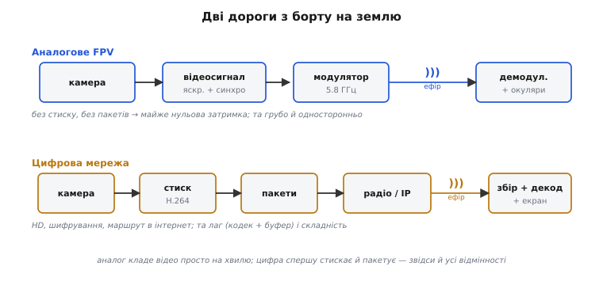
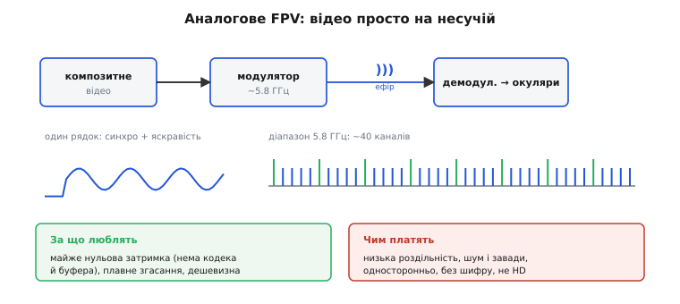
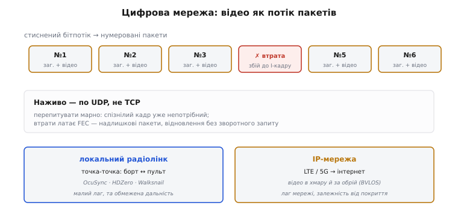
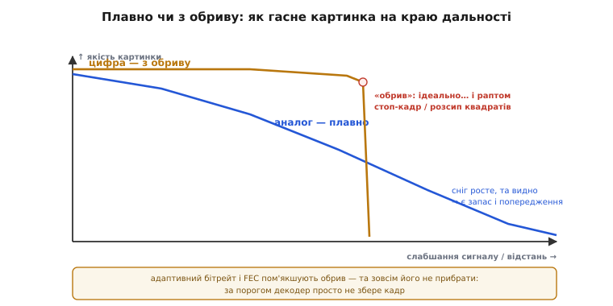

# Передача відео: радіо (аналогове FPV) і мережа

Коли відео з камери дрона вже [стиснене](root:embedded/mjpeg-vs-h264), постає найприземленіше питання: **як ці біти фізично долітають** з борту до тебе на землю? Доріг дві, і вони геть різні за духом. Перша — **аналогове радіо**: відеохвилю кладуть просто на радіонесучу, без жодного стиску й пакетів (класичне FPV — *first-person view*, англ. «вид від першої особи», на якому виросли гонки). Друга — **цифрова мережа**: стиснений потік ріжуть на пакети й шлють цифровим радіо чи через інтернет. Обидві варті розбору — і, головне, того, чим вони відрізняються на практиці.

### Дві дороги з борту на землю

Аналог і цифра роблять принципово різне ще до того, як сигнал торкнеться антени.


*Дві дороги з борту на землю. **Аналогове FPV**: камера → відеосигнал (яскравість + синхро) → модулятор кладе його на несучу 5.8 ГГц → ефір → демодулятор → окуляри. Без стиску, без пакетів — звідси майже нульова затримка, та грубо й односторонньо. **Цифрова мережа**: камера → стиск H.264 → пакети → цифрове радіо або IP → збір пакетів → декодування → екран. HD, шифрування, маршрут в інтернет — та затримка (кодек + буфер) і складність.*

Ключова різниця одна. **Аналог** кладе відео **просто на хвилю**: модулює нею радіонесучу — і все. **Цифра** спершу [стискає кадр](book:algorithms/jpeg-intra) і ріже на **пакети**, а вже тоді шле. Усі інші відмінності — миттєвість, якість, поведінка на краю дальності — випливають саме звідси.

### Аналогове FPV: відео просто на несучій хвилі

В аналоговому FPV беруть **композитний відеосигнал** — [аналогову відеохвилю](book:communications/analog-video), де яскравість рядків плюс імпульси синхронізації злиті в одну хвилю. Цією хвилею **модулюють** радіонесучу (зазвичай у діапазоні ~5.8 ГГц), антена випромінює, приймач на землі **демодулює** назад у відеосигнал — і одразу на окуляри.


*Аналогове FPV. Композитний відеосигнал одного рядка (синхроімпульс + яскравість) модулює радіонесучу ~5.8 ГГц; приймач демодулює — й на окуляри. Діапазон 5.8 ГГц поділений приблизно на 40 каналів, тож багато пілотів літають поряд. Перевага — майже нульова затримка (нема кодека й буфера), плавне згасання й дешевизна; плата — низька роздільність, шум і завади, односторонній зв'язок без шифрування, фіксована вузька смуга каналу (не HD).*

Уся принада — у **простоті**. Нема кодека, нема буферів, нема пакетів, тому затримка **майже нульова**: світло впало на сенсор — і за мить уже перед очима (у доброго аналогового лінка це менш як 10–30 мс від сенсора до окулярів). За це гонщики десятиліттями й обирали аналог. Ціна простоти — **груба картинка**: роздільність стандартного телебачення (480–576 рядків), шум, чутливість до завад, односторонній зв'язок без захисту й фіксована вузька смуга каналу, у яку HD просто не влізе. Зате на діапазоні 5.8 ГГц уміщається близько **40 каналів**, тож десяток пілотів злітає поряд, не глушачи одне одного.

### Цифрова мережа: відео як потік пакетів

Цифра працює інакше. [Стиснений бітпотік](root:embedded/mjpeg-vs-h264) ріжуть на **пакети** — невеликі порції, кожна зі своїм **номером** і **заголовком** (адресою). Пакети летять цифровим радіо чи мережею й на тому боці збираються назад по порядку.


*Відео як потік пакетів. Стиснений бітпотік ріжуть на пакети (номер + заголовок + шматок відео). Загубився пакет — буде збій до наступного I-кадру. Наживо шлють по UDP (перепитувати марно: спізнілий кадр уже непотрібний), а втрати латає FEC — надлишкові пакети, з яких приймач відновлює загублене без зворотного запиту. Дві ніші: локальний радіолінк точка-точка (OcuSync / HDZero / Walksnail — мала затримка, обмежена дальність) і IP-мережа (LTE / 5G → інтернет — відео в хмару й за обрій, та затримка мережі й залежність від покриття).*

З пакетами з'являються три речі, яких в аналога не було. Перша — **втрата пакета**: загубився, і в картинці буде збій, що тягнеться до наступного [I-кадру](book:algorithms/inter-frame) (повного, самодостатнього кадру). Друга — **протокол**: відео наживо шлють по **UDP** (шлемо й не перепитуємо — спізнілий кадр уже непотрібний), а **не** по TCP (той гарантує доставку, але перепитування додає затримку — для живого відео згубну); а щоб усе ж латати втрати, додають **FEC** (*forward error correction*, англ. «випереджальне виправлення помилок») — надлишкові пакети, з яких приймач **сам відновлює** загублене, без зворотного запиту. Третя — **масштаб**: цифру шлють або **локальним радіолінком** точка-точка (OcuSync, HDZero, Walksnail — борт↔пульт напряму, мала затримка, та обмежена дальність), або через **IP-мережу** (LTE/5G → інтернет), і тоді відео летить хоч у хмару, хоч за обрій (BVLOS — *beyond visual line of sight*, англ. «поза прямою видимістю») ціною мережевої затримки й залежності від покриття.

Чому саме UDP, добре видно на бюджеті затримки. Жива картинка має сенс, лише доки вона **свіжа**; кадр, що спізнився на пів секунди, нічим не кращий за втрачений. Тому затримку рахують **наскрізно** — від фотона на сенсорі до пікселя на екрані (англ. *glass-to-glass*, «від скла до скла»), і складають її чотири доданки:

**Умова.** Цифровий лінк: захоплення кадру 12 мс, кодек H.264 10 мс, канал (передача + повітря) 8 мс, буфер приймача (згладити нерівність приходу пакетів) 20 мс. Скільки покаже екран — і що дав би TCP із одним перепитуванням на 60 мс кругового обігу?

:::tabs
```cpp
// Наскрізна затримка цифрового відеолінка, мілісекунди
int t_capture = 12;   // сенсор → кадр у пам'яті
int t_codec   = 10;   // стиск H.264 одного кадру
int t_channel = 8;    // пакетизація + радіо/мережа (саме повітря ~ 0)
int t_buffer  = 20;   // буфер проти джитера — нерівність приходу пакетів

int glass_to_glass = t_capture + t_codec + t_channel + t_buffer;
// = 12 + 10 + 8 + 20 = 50 мс

// Якби втрачений пакет тягли по TCP: + один круговий обіг (RTT)
int rtt = 60;
int with_tcp_resend = glass_to_glass + rtt;   // = 110 мс
```
```py
# Наскрізна затримка цифрового відеолінка, мілісекунди
t_capture = 12   # сенсор → кадр у пам'яті
t_codec   = 10   # стиск H.264 одного кадру
t_channel = 8    # пакетизація + радіо/мережа (саме повітря ~ 0)
t_buffer  = 20   # буфер проти джитера — нерівність приходу пакетів

glass_to_glass = t_capture + t_codec + t_channel + t_buffer
# = 12 + 10 + 8 + 20 = 50 мс

# Якби втрачений пакет тягли по TCP: + один круговий обіг (RTT)
rtt = 60
with_tcp_resend = glass_to_glass + rtt   # = 110 мс
```
```js
// Наскрізна затримка цифрового відеолінка, мілісекунди
const tCapture = 12;   // сенсор → кадр у пам'яті
const tCodec   = 10;   // стиск H.264 одного кадру
const tChannel = 8;    // пакетизація + радіо/мережа (саме повітря ~ 0)
const tBuffer  = 20;   // буфер проти джитера — нерівність приходу пакетів

const glassToGlass = tCapture + tCodec + tChannel + tBuffer;
// = 12 + 10 + 8 + 20 = 50 мс

// Якби втрачений пакет тягли по TCP: + один круговий обіг (RTT)
const rtt = 60;
const withTcpResend = glassToGlass + rtt;   // = 110 мс
```
:::

Висновок: уже без втрат цифра набирає ~50 мс проти майже нуля в аналога — і вся ця затримка сидить у кодеку та буфері, не в «повітрі» (саме поширення радіохвилі на кілометр додає мізерні ~0.003 мс). А найбільший доданок — **буфер**. Він є, бо пакети приходять нерівно: цю мінливість затримки звуть **джитером** (*jitter*, англ. «тремтіння»), і приймач тримає невеликий запас кадрів, аби його згладити. Один-єдиний TCP-перепит на втрачений пакет коштував би тут цілий круговий обіг (RTT) — 60 мс зверху, більше за весь решту бюджету. Ось чому наживо шлють по UDP і латають втрати наперед через FEC, а не перепитуванням.

> 🔧 **Навіщо це.** Буфер — головний важіль, яким ти торгуєш затримку проти плавності. Коротший буфер — менша затримка, але різкіше «смикає» на нерівному каналі; довший — гладко, та керувати дроном уже важко. Для гонок його тиснуть до мінімуму (свіжість понад усе), для зйомки за обрій — навпаки відпускають (плавність понад швидкість). Знаючи, що канал дає лише частку бюджету, дарма ганятися за «швидшим радіо», коли більшість мілісекунд з'їдають кодек і буфер.

### Плавно чи з обриву: головна практична різниця

Найважливіше для пілота — як лінк поводиться на **краю дальності**. Аналог і цифра по-різному вмирають, коли сигнал слабшає, і цю різницю відчуваєш шкірою.


*Плавно чи з обриву. По горизонталі — слабшання сигналу (відстань), по вертикалі — якість картинки. Аналог (синя крива) гасне плавно: росте «сніг», та картинку ще видно — є запас і попередження, встигаєш розвернутись. Цифра (бурштинова) тримається майже ідеально… і за порогом раптом обривається в стоп-кадр чи розсип квадратів. Сучасні системи пом'якшують обрив (адаптивний бітрейт, FEC), та сам обрив лишається: за порогом декодер просто не збере кадр.*

**Аналог гасне плавно** (*graceful degradation*, англ. «м'яке згіршення»): що далі — то більше «снігу» й шуму, але картинку **ще видно**, і встигаєш зрозуміти, що пора розвертатись. **Цифра падає з обриву** (*cliff effect*, англ. «ефект урвища»): тримає ідеальну HD-картинку — і раптом, за якимось порогом сигналу, **обривається** в завмерлий стоп-кадр чи розсип квадратів — той самий цифровий розпад через зламаний [ланцюг P-кадрів](book:algorithms/inter-frame) (кадрів, що зберігають лише зміну від попереднього). Причина проста: нижче певного відношення сигнал/шум декодер уже **не може** зібрати кадр із побитих пакетів — або все, або нічого. Сучасні системи цей обрив **пом'якшують**: адаптивним бітрейтом (на слабкому сигналі сама знижує якість, аби втримати зв'язок) і FEC (латає дрібні втрати). Та зовсім його не прибрати — тому в цифрі критично **знати, де твій «обрив»**, і не залітати за нього наосліп.

Хоч би яким радіо ти слав відео й команди, його можна **заглушити** чи підслухати. Найпоширеніший захист — змусити передавач і приймач **синхронно стрибати** по багатьох частотах за відомим лише їм візерунком: завада на одній частоті вже не валить зв'язок, бо за мить він на іншій. Цю ідею — **стрибки частоти** — на диво рано, ще 1942 року, запатентувала голлівудська акторка, і її історія варта окремого погляду.

> 📜 **Стрибки частоти запатентувала кінозірка.** 1942 року актриса **Геді Ламарр** із композитором **Джорджем Антайлом** дістали патент США на «секретну систему зв'язку»: передавач і приймач синхронно перестрибують по 88 частотах за таємним розкладом (синхронізованим… перфострічкою від механічного піаніно) — заглушити чи підслухати такий сигнал годі. Флот поклав винахід під сукно, патент згас невикористаним, а сама ідея стрибків була відома й до неї. Та саме її конкретна реалізація стала однією з ранніх у родині **розширеного спектра**, яким сьогодні стрибають Bluetooth і стійкі дрон-лінки. [Повна історія — хто вона, що справді її, а що міф](book:communications/spread-spectrum/hist-hedy-lamarr.md).

> 🔧 **Навіщо це.** Вибираючи відеолінк, став питання руба: **аналог чи цифра?** Гонка, простота, граничний запас за дальністю, миттєвість — **аналог** (плавне згасання прощає помилки). HD-картинка, шифрування, дальність за обрій, відео в хмару — **цифра**, але вивчи, **де її обрив**, стеж за статистикою лінка (RSSI / якість) і не залітай за поріг. Тримай відеолінк **окремо** від лінка керування й телеметрії — щоб важкий відеопотік не «забивав» команди. І пам'ятай: стійкі лінки [стрибають частотами](book:communications/spread-spectrum) — це головний захист від завад у переповненому ефірі.

### Підсумок теми

Відео долітає з борту двома дорогами. **Аналогове радіо** кладе відеохвилю просто на несучу: жодного стиску чи пакетів, тому майже нульова затримка й **плавне згасання** — але груба картинка, шум і фіксована вузька смуга. **Цифрова мережа** ріже стиснений потік на **пакети**: HD, шифрування, маршрут хоч в інтернет (BVLOS) — але затримка (де левову частку з'їдають кодек і буфер, а не «повітря»), складність і **обрив** на краю дальності. Тому відео наживо шлють по **UDP** з **FEC**, а не по TCP, і обирають масштаб — локальний радіолінк чи IP-мережу. Головна практична різниця — **graceful** проти **cliff**: аналог попереджає, цифра обриває. А над усім цим — стара ідея **стрибків частоти**, що робить лінки стійкими до завад. За самим вибором дороги стоять її **реалії** — [пропускна здатність, втрати й буферизація](book:communications/bandwidth-loss), що вирішують, скільки відео й з якою затримкою справді долетить.
