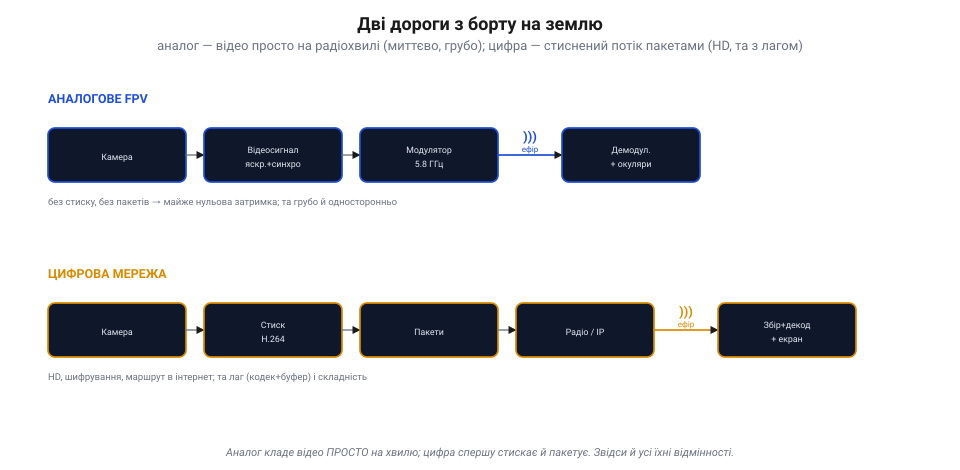
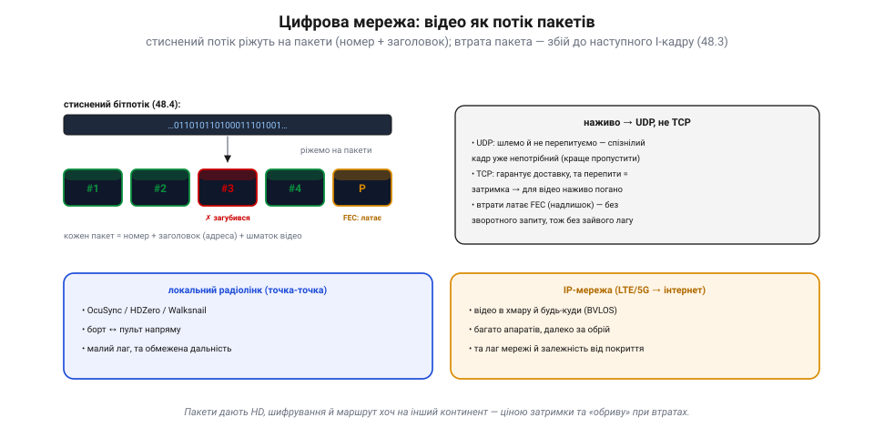
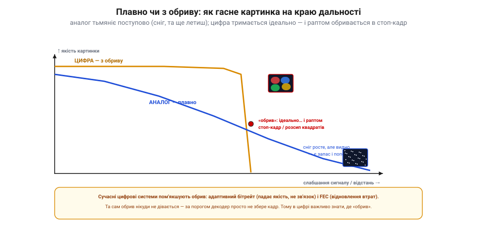

# Передача відео: радіо (аналогове FPV) і мережа

Коли відео з камери дрона вже [стиснене](book:algorithms/mjpeg-vs-h264), постає найприземленіше питання: **як ці біти фізично долітають** з борту до тебе на землю? Тут є дві великі родини, геть різні за духом. Перша — **аналогове радіо**: відеохвилю кладуть просто на радіонесучу, без жодного стиску й пакетів (класичне FPV, на якому виросли гонки). Друга — **цифрова мережа**: стиснений потік ріжуть на пакети й шлють цифровим радіо чи через інтернет. Розберімо обидві — і, головне, чим вони відрізняються на практиці.

### Дві дороги з борту на землю

Найперше — загальна картина. Аналог і цифра роблять принципово різне ще до того, як сигнал торкнеться антени.

*Рис. Дві дороги з борту на землю. **Аналогове FPV**: камера → відеосигнал (яскравість+синхро) → модулятор кладе його на несучу 5.8 ГГц → ефір → демодулятор → окуляри. Без стиску, без пакетів — звідси майже нульова затримка, та грубо й односторонньо. **Цифрова мережа**: камера → стиск H.264 → пакети → цифрове радіо або IP → збір пакетів → декодування → екран. HD, шифрування, маршрут в інтернет — та лаг (кодек+буфер) і складність.*

Бачиш ключову різницю? **Аналог** кладе відео **просто на хвилю**: модулює нею радіонесучу — і все. **Цифра** спершу [стискає кадр](book:algorithms/jpeg-intra) і ріже на **пакети**, а вже тоді шле. Усі інші відмінності — миттєвість, якість, поведінка на краю дальності — випливають саме звідси.

### Аналогове FPV: відео просто на несучій хвилі

Почнімо з простішого. В аналоговому FPV беруть **композитний відеосигнал** — [аналогову відеохвилю](book:communications/analog-video), де яскравість рядків плюс імпульси синхронізації злиті в одну хвилю. Цією хвилею **модулюють** радіонесучу (зазвичай у діапазоні ~5.8 ГГц), антена випромінює, приймач на землі **демодулює** назад у відеосигнал — і одразу на окуляри.

*Рис. Аналогове FPV. Композитний відеосигнал одного рядка (синхро + яскравість) модулює радіонесучу ~5.8 ГГц; приймач демодулює — й на окуляри. Діапазон 5.8 ГГц поділений на ~40 каналів, тож багато пілотів літають поряд. **За що люблять**: майже нульова затримка (нема кодека й буфера), плавне згасання, простота й дешевизна. **Чим платять**: низька роздільність, шум і завади, односторонній зв'язок без шифрування, фіксована смуга каналу (не HD).*

Уся принада — у **простоті**. Нема кодека, нема буферів, нема пакетів — тому затримка **майже нульова** (світло впало на сенсор — і за мить уже перед очима). Тому ж гонщики десятиліттями обирали саме аналог. Ціна простоти — **груба картинка**: низька роздільність (як у старого телевізора), шум, чутливість до завад, односторонній зв'язок без захисту, і фіксована вузька смуга каналу, у яку HD просто не влізе. Зате на діапазоні 5.8 ГГц уміщається близько **40 каналів**, тож десяток пілотів злітає поряд, не глушачи одне одного.

### Цифрова мережа: відео як потік пакетів

Цифра працює інакше. [Стиснений бітпотік](book:algorithms/mjpeg-vs-h264) ріжуть на **пакети** — невеликі порції, кожна зі своїм **номером** і **заголовком** (адресою). Пакети летять цифровим радіо чи мережею й на тому боці збираються назад по порядку.

*Рис. Відео як потік пакетів. Стиснений бітпотік ріжуть на пакети (номер + заголовок + шматок відео). Загубився пакет — буде збій (до наступного I-кадру). Наживо шлють по **UDP** (не перепитувати — спізнілий кадр уже непотрібний), а втрати латають **FEC** (надлишкові пакети — відновлення без зворотного запиту, тож без зайвого лагу). Дві ниші: **локальний радіолінк** точка-точка (OcuSync/HDZero/Walksnail — малий лаг, обмежена дальність) і **IP-мережа** (LTE/5G → інтернет — відео в хмару й за обрій, та лаг мережі й залежність від покриття).*

Тут з'являються три речі, яких в аналога не було. Перше — **втрата пакета**: загубився — і в картинці буде збій, що тягнеться до наступного [I-кадру](book:algorithms/inter-frame). Друге — **протокол**: відео наживо шлють по **UDP** (шлемо й не перепитуємо — спізнілий кадр уже непотрібний), а **не** по TCP (той гарантує доставку, але перепитування додає затримку — для живого відео згубну); а щоб усе ж латати втрати, додають **FEC** (*forward error correction*) — надлишкові пакети, з яких приймач **сам відновлює** загублене, без зворотного запиту. Третє — **масштаб**: цифру можна слати або **локальним радіолінком** точка-точка (OcuSync, HDZero, Walksnail — борт↔пульт напряму, малий лаг, та обмежена дальність), або через **IP-мережу** (LTE/5G → інтернет), і тоді відео летить хоч у хмару, хоч за обрій (BVLOS) — ціною мережевого лагу й залежності від покриття.

### Плавно чи з обриву: головна практична різниця

А тепер — найважливіше для пілота. Аналог і цифра **по-різному вмирають**, коли сигнал слабшає на краю дальності. І це різниця, яку відчуваєш шкірою.

*Рис. Плавно чи з обриву. По горизонталі — слабшання сигналу (відстань), по вертикалі — якість картинки. **Аналог** (синя) гасне **плавно**: росте «сніг», та картинку ще видно — є запас і попередження, встигаєш розвернутись. **Цифра** (бурштинова) тримається **ідеально**… і за порогом раптом **обривається** в стоп-кадр чи розсип квадратів. Сучасні системи пом'якшують обрив (адаптивний бітрейт, FEC), та сам обрив лишається: за порогом декодер просто не збере кадр.*

**Аналог гасне плавно** (*graceful degradation*): що далі — то більше «снігу» й шуму, але картинку **ще видно**, і ти встигаєш зрозуміти, що пора розвертатись. **Цифра падає з обриву** (*cliff effect*): тримає ідеальну HD-картинку — і раптом, за якимось порогом сигналу, **обривається** в завмерлий стоп-кадр чи розсип квадратів — той самий [цифровий розпад](book:communications/analog-video) через зламаний [ланцюг P-кадрів](book:algorithms/inter-frame). Причина проста: нижче певного відношення сигнал/шум декодер уже **не може** зібрати кадр із побитих пакетів — або все, або нічого. Сучасні системи цей обрив **пом'якшують**: адаптивний бітрейт (на слабкому сигналі сама знижує якість, аби втримати зв'язок) і FEC (латає дрібні втрати). Та зовсім його не прибрати — тому в цифрі критично **знати, де твій «обрив»**, і не залітати за нього наосліп.

> 📜 **Як голлівудська зірка наблизила глушко-стійке радіо.** Хоч би яким радіо ти слав відео й команди — його можна **заглушити** чи підслухати. Розв'язок придумала… кінозірка. 1942 року актриса **Геді Ламарр** разом із композитором **Джорджем Антайлом** отримали патент США № 2 292 387 на «секретну систему зв'язку»: ідея була в тому, щоб передавач і приймач **синхронно стрибали** по багатьох радіочастотах за відомим лише їм візерунком — тоді ворог не може ні заглушити сигнал (він щомиті на новій частоті), ні підслухати. Синхронізували стрибки… перфострічкою від механічного піаніно (а 88 частот — мов 88 клавіш!). Винахід призначався для некерованого глушіння радіоторпед, та військові поклали його під сукно як «нездійсненний». Аж за десятиліття ця ідея — **стрибки частот** (*frequency hopping*) — постала як одна з ранніх у родині **розширеного спектра** (*spread spectrum*). Частотами й досі стрибають **Bluetooth** і стійкі дрон-лінки; а от **Wi-Fi, GPS і мобільний** зв'язок користуються **іншими** формами розширеного спектра (CDMA, OFDM), а не прямою її схемою — та й подібні ідеї патентували ще до неї. А ще — у твій апарат: сучасні стійкі лінки керування (FrSky, Crossfire, ExpressLRS) і цифрове відео/телеметрія стрибають частотами рівно за Ламарр, щоб дрон не «осліп» від першої-ліпшої завади. Голлівудська зірка стояла біля **витоків** того, завдяки чому твій квадрокоптер чує пульт у переповненому ефірі (його стійкий лінк справді стрибає частотами).

> 🔧 **Навіщо це.** Вибираючи відеолінк, став питання руба: **аналог чи цифра?** Гонка, простота, граничний запас за дальністю, миттєвість — **аналог** (плавне згасання прощає помилки). HD-картинка, шифрування, дальність за обрій, відео в хмару — **цифра**, але вивчи, **де її обрив**, стеж за статистикою лінка (RSSI/якість) і не залітай за поріг. Тримай відеолінк **окремо** від лінка керування й телеметрії — щоб важкий відеопотік не «забивав» команди. І пам'ятай: стійкі лінки [стрибають частотами](book:communications/spread-spectrum) — це твій головний захист від завад у переповненому ефірі.

### Підсумок теми

Відео долітає з борту двома дорогами. **Аналогове радіо** кладе відеохвилю просто на несучу: жодного стиску чи пакетів, тому майже нульова затримка й **плавне згасання** — але груба картинка, шум і фіксована вузька смуга. **Цифрова мережа** ріже стиснений потік на **пакети**: HD, шифрування, маршрут хоч в інтернет (BVLOS) — але затримка, складність і **обрив** на краю дальності (за порогом декодер не збере кадр). Тому відео наживо шлють по **UDP** з **FEC**, а не по TCP, і обирають масштаб — локальний радіолінк чи IP-мережу. Головна практична різниця — **graceful** проти **cliff**: аналог попереджає, цифра обриває. А над усім цим — стара ідея **стрибків частот**, що робить лінки стійкими до завад. За самим вибором дороги стоять її **реалії** — [пропускна здатність, втрати й буферизація](book:communications/bandwidth-loss), що вирішують, скільки відео й з яким лагом справді долетить.
